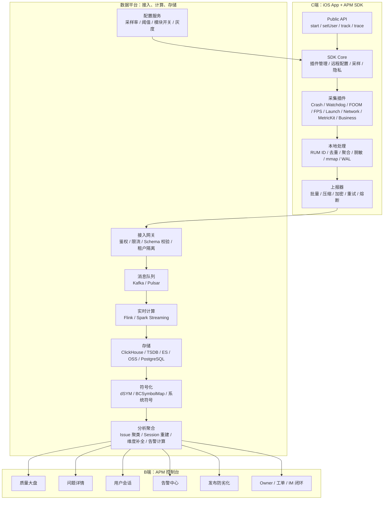
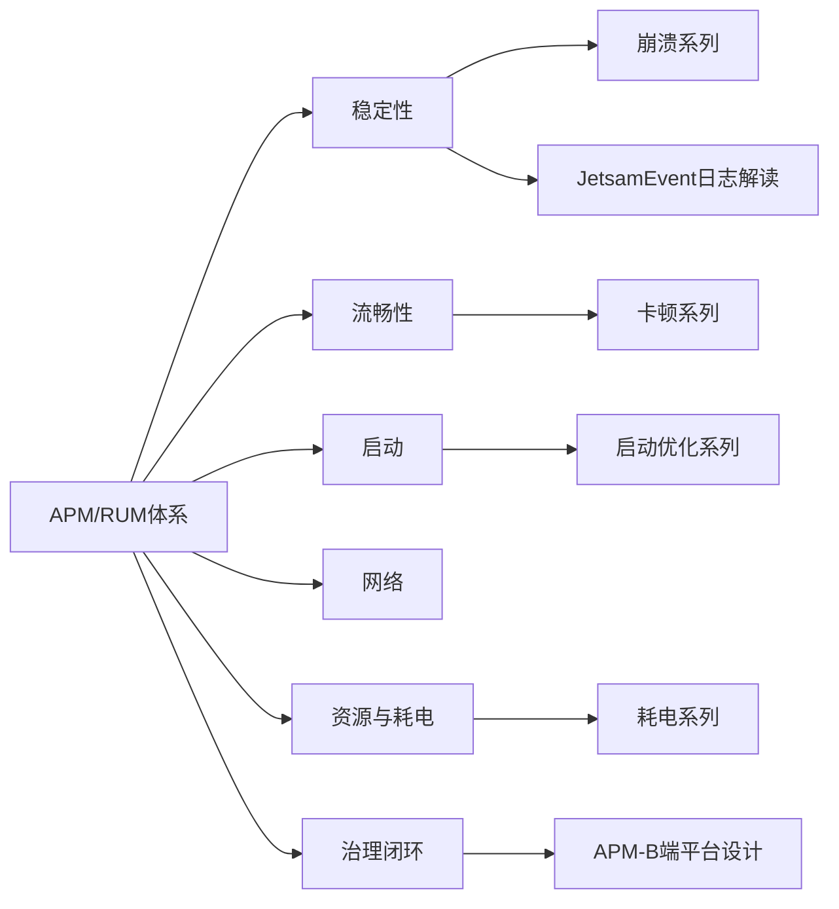
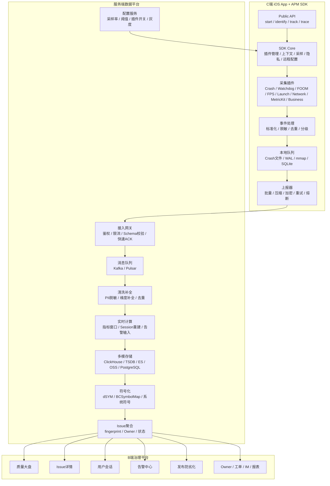

+++
title = "iOS APM 与 RUM 体系总览"
date = '2026-05-07T15:42:48+08:00'
draft = false
weight = 9
tags = ["iOS", "APM", "监控"]
categories = ["iOS开发", "APM"]
+++
APM（Application Performance Monitoring / Management）是面向线上真实用户的性能稳定性观测与治理体系。对 iOS App 来说，它不是一个单纯的 Crash SDK，也不是一个“把指标画成图”的后台，而是一套贯穿 **C 端真实用户体验、端侧采集 SDK、服务端数据平台、B 端研发治理平台** 的完整系统。

RUM（Real User Monitoring）是 APM 在真实用户体验侧的核心模型：把用户的一次使用会话拆成 `Session / View / Action / Resource / Error / LongTask` 等对象，用统一 ID 串联页面、交互、网络、错误和性能现场。没有 RUM 模型，APM 很容易退化成一堆孤立指标；有了 RUM 模型，平台才能回答“哪个真实用户在什么页面做了什么操作，随后发生了什么性能或稳定性问题”。

---

## 一、重构后的系列结构

| 文章 | 定位 |
|-----|------|
| [APM]()（本文） | 系列入口：APM/RUM 定义、B/C 端边界、技术分层、建设路线 |
| [APM-产品与架构设计]() | 产品视角：C 端体验、B 端用户、角色视图、治理闭环 |
| [APM-指标体系]() | 指标口径：稳定性、流畅性、启动、资源、网络、业务、RUM 指标 |
| [APM-C端SDK架构]() | iOS SDK 架构：插件化、远程配置、采样、隐私、低开销、防自崩 |
| [APM-数据采集]() | 采集技术：Crash、Watchdog、FOOM、卡顿、启动、网络、MetricKit、业务 Trace |
| [APM-数据模型与上报]() | 事件模型、RUM ID、协议、落盘、批量、重试、脱敏、采样 |
| [APM-服务端数据架构]() | 接入网关、消息队列、实时计算、存储、符号化、Issue 聚合、配置下发 |
| [APM-B端平台设计]() | Web 控制台：大盘、详情页、用户会话、告警、工单、发布防劣化 |
| [APM-业界方案]() | MetricKit、Sentry、Firebase、Bugly、Matrix、Slardar、Hertz 等方案对比 |

重构后的主线是：

```text
为什么建 APM
  -> 产品上服务谁
  -> 指标上如何定义体验
  -> C 端 SDK 如何采
  -> 数据模型如何串联
  -> 服务端如何处理
  -> B 端如何让问题闭环
  -> 业界方案如何选型
```

---

## 二、APM 是否要区分 B 端和 C 端

要区分，但不能拆成两套彼此割裂的系统。

产品视角下：

| 端 | 面向对象 | 核心问题 |
|---|---------|---------|
| C 端 | 真实用户设备上的 App | 用户是否崩溃、卡顿、白屏、慢加载、耗电、网络失败 |
| B 端 | 研发、测试、架构、运维、产品、客服 | 如何发现问题、定位原因、分配负责人、验证修复、防止劣化 |

技术视角下：

| 层 | 典型形态 | 责任 |
|---|---------|------|
| C 端采集层 | iOS APM SDK | 低开销采集真实用户现场 |
| 数据协议层 | RUM event schema / OTLP-like schema | 统一事件、指标、Trace、Session 语义 |
| 服务端数据层 | Ingest / Kafka / Flink / ClickHouse / Object Storage | 接入、清洗、聚合、存储、查询、告警计算 |
| B 端应用层 | Web Console / BFF / Query API | 可视化、下钻、Issue 流转、权限、配置 |

---

## 三、整体技术架构



这张图里最重要的不是组件数量，而是职责边界：

1. **SDK 只做必要采集和轻量预处理**，不能把服务端计算搬到端上。
2. **服务端要把事件变成可查询、可告警、可归因的数据资产**，不是只存原始日志。
3. **B 端要面向工作流设计**，不是把 ClickHouse 查询结果换成图表。
4. **配置服务反向控制 SDK**，否则采样、阈值、问题版本熔断都无法闭环。

---

## 四、统一 RUM 数据模型

APM 的技术分层可以拆，但数据模型不能拆。推荐使用以 RUM 为核心的层级模型：

```text
Application
  Release / Build / Environment
    User / Anonymous Device
      Session
        View
          Action
          Resource
          Error
          LongTask / Freeze
          Custom Event
```

关键 ID：

| ID | 作用 |
|----|------|
| `app_id` | 区分业务 App |
| `env` | prod、gray、test、dev |
| `release` / `build` | 版本对比、发布防劣化 |
| `sdk_version` | SDK 自身问题定位 |
| `device_id` / `user_id` | 用户影响面、会话串联，必须支持匿名化 |
| `session_id` | 一次前台使用会话 |
| `view_id` | 一个页面实例 |
| `action_id` | 一次用户交互 |
| `resource_id` | 一次网络或资源请求 |
| `trace_id` / `span_id` | 与后端链路追踪打通 |
| `event_id` | 幂等、去重、重试 |

典型用户链路：

```text
Session s1
  View home_v1
    Action tap_buy
      Resource POST /api/order, 3.2s, 500
      LongTask main_thread_blocked, 850ms
      Error crash EXC_BAD_ACCESS
```

B 端最终应该能展示为一句人能理解的话：

```text
iPhone 13 / iOS 17.5 / App 3.2.1 的用户，在首页点击下单后，
/api/order 请求 3.2s 且返回 500，随后主线程阻塞 850ms，最后发生 EXC_BAD_ACCESS。
```

---

## 五、iOS APM 的特殊难点

| 难点 | 说明 | 设计要求 |
|-----|------|---------|
| Crash handler 环境不安全 | 崩溃现场可能处在锁损坏、堆损坏、线程状态异常中 | 只做 async-signal-safe 写入，下次启动再处理 |
| Jetsam / FOOM 无信号 | 系统直接杀进程，不会给 App 崩溃回调 | 用上次运行状态 + 排除法 + 内存水位判定 |
| Watchdog 不是普通卡顿 | 系统杀进程前可能没有可用堆栈 | 主线程多次采样、保存最近操作和页面现场 |
| WKWebView 多进程 | App 侧 `URLProtocol` 拦不到 WebContent 网络 | 注入 JS SDK，采集 Navigation Timing、Long Task、Resource Timing |
| ProMotion 自适应刷新 | 静止页面低 FPS 不等于卡顿 | 区分 FPS、掉帧、单帧耗时、滚动场景 |
| MetricKit 延迟回调 | 系统级数据通常按日聚合 | 作为低开销基线，不替代实时 SDK |
| 符号化依赖构建产物 | 没有 dSYM 就无法定位 Crash | CI 自动上传 dSYM、BCSymbolMap、源码版本 |
| SDK 自身可能反杀 App | Hook、采样、写盘、网络都可能引入风险 | 插件隔离、远程关闭、熔断、灰度 |

---

## 六、建设优先级

不是所有团队都应该一上来做完整自研平台。更合理的路线是按成熟度演进：

| 阶段 | 目标 | 必备能力 |
|-----|------|---------|
| L1 能看到 | 先知道线上出了什么问题 | Crash、启动耗时、基础网络错误、MetricKit |
| L2 覆盖完整 | 覆盖主要用户体验问题 | Watchdog、FOOM、卡顿、页面耗时、业务 Trace |
| L3 能归因 | 从“有问题”走向“知道为什么” | 符号化、Issue 聚类、Session 时间线、共性维度、火焰图 |
| L4 能闭环 | 让问题进入研发流程 | Owner 分发、工单、告警、灰度对比、修复验证 |
| L5 能治理 | 阻止劣化进入全量 | 发布门禁、SLO、自动拦截、指标与业务结果关联 |

---

## 七、架构设计的判断标准

一套好的 iOS APM 体系应该满足：

1. **低开销**：SDK 不明显增加启动、CPU、内存、磁盘、流量、电量成本。
2. **高可靠**：Crash、FOOM、Watchdog 等高价值数据尽量不丢。
3. **可关联**：页面、操作、网络、错误、性能、业务事件能通过 RUM ID 串起来。
4. **可归因**：不是只看到指标升高，而是能找到版本、机型、页面、接口、堆栈、Owner。
5. **可控制**：远程配置能控制模块开关、采样率、阈值、灰度和熔断。
6. **可治理**：问题能进入告警、分发、修复、验证、防劣化闭环。
7. **可合规**：采集前有边界，采集中有脱敏，存储后有保留期限和访问权限。

一句话总结：

**C 端 SDK 决定数据质量，服务端数据平台决定系统规模，B 端控制台决定诊断效率；三者必须共享同一套 RUM 数据模型和指标口径。**

---

## 八、与现有专题的关系

APM 是总体系，现有专题是其中的能力纵深：



延伸阅读：

- 崩溃体系：[崩溃]()、[崩溃-采集]()、[崩溃-治理]()
- 卡顿体系：[卡顿]()、[卡顿-检测]()
- 启动体系：[启动优化]()、[启动优化-观测]()
- 耗电体系：[耗电]()、[耗电-检测]()、[耗电-治理]()
- 工具体系：[Instruments详解]()

---

## 九、面试题：如何从 0 到 1 实现 APM 系统？

从产品维度讲，APM需要区分C端和B端。C端负责采集用户现场，B端负责分析和处理。
明确产品形态：C 端 iOS SDK 负责低开销采集真实用户现场，服务端数据平台负责接入、清洗、聚合、存储、符号化、告警和配置下发，B 端平台负责让研发、测试、架构、产品、客服围绕 Issue 完成发现、定位、分发、修复、验证和发布防劣化。

整体架构可以这样拆：



第一步是定义指标体系。APM 的核心指标不应该只看平均值，而要按 P50 / P90 / P99、版本、机型、OS、网络、地域、渠道、页面、业务模块切分。稳定性看 `Crash Rate`、`Watchdog Rate`、`FOOM Rate` 和总异常退出率；流畅性看 FPS、掉帧率、卡顿率、Freeze 率；启动看冷启动、温启动、热启动、首屏和 TTI；网络看 DNS、TCP、TLS、TTFB、总耗时、错误率、慢请求率和流量；页面体验看页面加载 P90、秒开率、首屏、白屏率；资源看内存峰值、CPU、磁盘 IO、电量和热状态。稳定性面向管理层可以汇总成：

```text
Abnormal Exit Rate = Crash Rate + Watchdog Rate + FOOM Rate
Crash-free Users = 1 - crashed_users / active_users
Slow Resource Rate = slow_resource_count / total_resource_count
View Blank Rate = blank_view_count / total_view_count
```

第二步是设计 C 端 SDK。SDK 是数据质量的入口，但它和业务 App 共进程，所以原则是低开销、可控制、可降级、可追责、可合规。架构上要插件化，而不是一个巨大单例：

```swift
protocol APMPlugin {
    var name: String { get }
    var defaultEnabled: Bool { get }

    func start(context: APMContext, config: APMPluginConfig)
    func stop()
    func update(config: APMPluginConfig)
}
```

SDK Core 负责初始化、生命周期、远程配置、插件调度、自监控；Context Manager 负责 `app_id`、`release`、`build`、`device_id`、`user_id`、`session_id`、`view_id`、`action_id`、`resource_id`、`trace_id`、`span_id`、`event_id` 等上下文；Event Processor 负责标准化、脱敏、采样、去重和优先级；Local Store 负责分级落盘；Uploader 负责批量、压缩、加密、重试、幂等和熔断。

初始化要拆成极早期和延后阶段。Crash handler、上次运行状态、最小上下文、本地配置可以尽早启动；FPS、网络 hook、历史包扫描、批量上报、MemoryGraph 这类有开销的能力要放到首帧后或空闲时启动。SDK 本身也要被监控，例如初始化耗时、队列大小、丢弃数、上报失败率、禁用插件列表、SDK 自身 Crash 率。

第三步是落地核心采集能力。Crash 要同时覆盖 Mach Exception、Unix Signal、NSException / C++ terminate。崩溃现场环境不安全，只能做 async-signal-safe 的最小写入，不能 `malloc`、不能 Objective-C / Swift 调用、不能网络请求、不能符号化，下次启动再转换成标准事件上报。Mach 端口注册时要保存旧 handler 并转发，避免破坏 Bugly、Sentry 等其它 SDK。

```c
void crash_handler(int sig, siginfo_t *info, void *ucontext) {
    static char buffer[65536];
    int fd = open("/path/to/apm_crash.log", O_WRONLY | O_CREAT | O_TRUNC, 0644);

    write_header(fd, buffer, sig, info);
    write_thread_states(fd);
    write_backtraces(fd);
    write_image_infos(fd);

    fsync(fd);
    close(fd);
    raise(sig);
}
```

Watchdog 和卡死不能只抓一次堆栈。推荐用 RunLoop Observer + 子线程 Ping 检测主线程长时间停留在 `beforeSources` 或 `afterWaiting`，触发后每 500ms 多次采样主线程栈，并记录线程状态、CPU 占用、最近页面、最近操作、网络和磁盘现场。服务端再聚合多次采样，找出现频率最高或阻塞时间最长的关键栈帧。死锁场景可以扫描等待锁的线程，解析锁拥有者 tid，构建“等待 -> 持有”的有向图并找环。

FOOM 没有系统回调，要用排除法。每次启动保存上次运行状态，包括版本、OS、机型、是否前台、是否 Crash、是否正常退出、电量、内存水位、时间戳。下次启动时，如果上次没有 Crash、没有正常退出、不是升级、不是系统重启、不是电量耗尽，并且上次处于前台，就判定疑似 FOOM。FOOM 详情没有崩溃栈，所以必须保存内存水位、页面路径、大对象 TopN、机型内存档位和 MetricKit memory diagnostics。

```swift
struct LastState: Codable {
    var appVersion: String
    var osVersion: String
    var deviceModel: String
    var isForeground: Bool
    var didCrash: Bool
    var didExitNormally: Bool
    var batteryLevel: Float
    var memoryPressure: Int
    var timestamp: TimeInterval
}

func suspectedFOOM(last: LastState, current: LastState) -> Bool {
    if last.didCrash || last.didExitNormally { return false }
    if last.appVersion != current.appVersion { return false }
    if last.osVersion != current.osVersion { return false }
    if last.batteryLevel < 0.02 { return false }
    return last.isForeground
}
```

卡顿和 FPS 用 `CADisplayLink`、RunLoop Observer、主线程堆栈采样实现。ProMotion 机型要注意自适应刷新率，静止页面低 FPS 不一定是卡顿，应区分 FPS、掉帧、单帧耗时和滚动场景。启动采集要拆 Pre-main、`main -> didFinishLaunching`、首屏、可交互，最终面向用户更应看首屏和 TTI。网络采集优先用 `URLSessionTaskMetrics` 拿 DNS、TCP、TLS、TTFB、download、total 分段耗时；如果要拦截内容可用 `NSURLProtocol`，但要防重复拦截；WKWebView 走 WebContent 进程，需要注入 JS SDK 采集 Navigation Timing、Resource Timing、Paint 和 Long Task。MetricKit 必接，作为低开销系统基线，但它缺少业务上下文，不能替代实时 SDK。

第四步是统一 RUM 数据模型和上报协议。不要让 Crash、网络、页面、卡顿各自孤立上报，而要用 RUM 把用户链路串起来：

```text
Application
  Release / Build / Environment
    User / Anonymous Device
      Session
        View
          Action
          Resource
          Error
          LongTask / Freeze
          Custom Event
```

所有事件外层都用统一 envelope，payload 按事件类型扩展。`event_id` 用于幂等去重，重试时不能变化；`event_time` 是端侧时间，服务端写入 `receive_time`；`schema_version` 用来支撑长期演进。

```json
{
  "schema_version": "1.0",
  "event_id": "01HZY2...",
  "event_type": "resource",
  "event_time": 1715000000123,
  "app": {
    "app_id": "com.example.app",
    "env": "prod",
    "release": "3.2.1",
    "build": "3020100",
    "sdk_version": "2.5.0"
  },
  "device": {
    "model": "iPhone15,2",
    "os_version": "17.5",
    "network_type": "wifi",
    "region": "CN-SH"
  },
  "identity": {
    "device_id": "anon_xxx",
    "user_id": "hash_xxx"
  },
  "rum": {
    "session_id": "s_123",
    "view_id": "v_456",
    "action_id": "a_789",
    "resource_id": "r_001",
    "trace_id": "t_abc",
    "span_id": "sp_def"
  },
  "payload": {
    "method": "POST",
    "url_template": "/api/order",
    "status_code": 500,
    "duration_ms": 3200,
    "ttfb_ms": 2100
  }
}
```

上报链路要先落盘再上传，按数据价值分 Critical、Important、Sampled、Debug。Crash、Watchdog、FOOM 尽量全量并可靠落盘；网络错误、慢请求、核心页面性能较高采样；普通 FPS、CPU、资源请求低采样；MemoryGraph、Coredump、Zombie 只灰度或触发式开启。稳定采样要按设备或用户 hash，而不是每条事件随机，否则一个用户的页面、网络、错误会被切碎。

```swift
func sampled(deviceId: String, key: String, rate: Double, day: String) -> Bool {
    let seed = "\(deviceId)-\(key)-\(day)"
    let hash = UInt64(seed.hashValue.magnitude)
    return Double(hash % 10_000) / 10_000.0 < rate
}
```

上传协议可以用 protobuf + gzip / zstd + HTTPS，带 App、SDK、Schema、Package、Signature。失败重试用指数退避和 jitter；4xx schema 错误不重试，401 / 403 刷新配置或停传，413 拆包，429 遵守 `Retry-After`，5xx 重试。APM 自身请求、文件和线程都要打白名单，防止网络、磁盘、CPU 监控产生回环。

第五步是设计服务端数据平台。接入网关只做轻逻辑，包括鉴权、限流、解压解密、Schema 校验、大小限制、租户隔离、时间校正和快速 ACK，然后写 Kafka / Pulsar。清洗层做 decode、PII 脱敏、normalize、维度补全、去重和路由；维度补全包括 IP 到地域运营商、机型到性能档位、版本到 Git commit 和灰度批次、URL 到 path template 和接口 owner、栈帧到模块和团队。

存储不能只靠 MySQL。明细事件和多维聚合适合 ClickHouse / Doris，指标时序适合 TSDB，堆栈和错误文本适合 Elasticsearch / OpenSearch，dSYM、原始包、MemoryGraph、Coredump 适合对象存储，项目配置、权限、Issue 元数据适合 PostgreSQL / MySQL，热点缓存和限流适合 Redis。

```sql
CREATE TABLE rum_events (
    app_id LowCardinality(String),
    env LowCardinality(String),
    release LowCardinality(String),
    event_date Date,
    event_time DateTime64(3),
    event_type LowCardinality(String),
    event_id String,
    session_id String,
    view_id String,
    action_id String,
    resource_id String,
    trace_id String,
    user_id String,
    device_model LowCardinality(String),
    os_version LowCardinality(String),
    network_type LowCardinality(String),
    name String,
    duration_ms UInt32,
    status_code UInt16,
    error_type LowCardinality(String),
    fingerprint String,
    payload_json String
) ENGINE = MergeTree
PARTITION BY (app_id, event_date)
ORDER BY (app_id, event_type, release, event_time, session_id);
```

符号化服务要由 CI 自动上传 dSYM、BCSymbolMap 和源码版本，按 `release + build + UUID` 绑定。客户端上报 image UUID、slide、PC address、architecture、OS version，服务端用 `atos` 或 `llvm-symbolizer` 符号化，支持 Swift demangle、系统符号库和历史重符号化。没有 dSYM 的 Crash 平台只能统计，不能真正定位。

Issue 聚合是治理的最小单元。平台不应该把每条 Crash 都丢给研发，而要按 fingerprint 聚成 Crash Issue、Watchdog Issue、FOOM Issue、慢页面 Issue、慢接口 Issue、JS Error Issue。Crash fingerprint 可以用异常类型、signal、崩溃线程标记、前几个 in-app frame；Watchdog 可以用多次采样公共栈和阻塞类型；慢接口可以用 host、path template、status / error；FOOM 可以用页面、内存峰值特征、机型档位和模块特征。Issue 还要维护状态、Owner、影响用户、趋势、首现版本、最近版本、样本事件、关联 Session、修复版本和重复 / 噪声标记。

第六步是做 B 端治理平台。B 端不是把数据画成图，而是服务工作流。首页只放能代表用户体验和发布风险的指标，例如 Crash-free users、异常退出率、启动 P90 / P99、页面秒开率、白屏率、卡顿率、网络错误率、慢请求率、新版本劣化项、Top Issue。所有异常项都要一键下钻到 Issue、Session、版本、机型、页面或接口。

Issue 详情页要回答“影响多少人、从什么时候开始、在哪些版本机型页面发生、疑似原因是什么、谁负责、修复后是否恢复”。Session 页要按时间线串起页面、操作、网络、错误和长任务，例如：

```text
10:01:02  Session Start  cold_launch
10:01:03  View Home appear
10:01:04  Resource GET /home 340ms 200
10:01:08  Action tap_product
10:01:09  View ProductDetail appear
10:01:10  Resource GET /product/{id} 1.2s 200
10:01:12  LongTask main 680ms
10:01:15  Action tap_buy
10:01:16  Resource POST /order 3.2s 500
10:01:17  Error EXC_BAD_ACCESS
```

告警要少而准，可行动。规则可以分绝对阈值、环比、变点、TopN、SLO 和灰度拦截，但告警内容必须包含发生了什么、影响多少用户、从什么时候开始、影响哪些版本 / 机型 / 地区、疑似 Top 维度、Owner 和下一步入口。要做同 Issue 合并、静默窗口、升级策略、恢复通知和误报反馈。不可行动的指标只进报表，不进告警。

发布防劣化是 APM 的高价值场景。灰度阶段要用同时间窗口、同机型、同 OS、同网络、同地域、同渠道做新旧版本对照，门禁指标包括 Crash-free users、FOOM rate、Watchdog rate、Launch P90、View slow rate、Network error rate、关键路径成功率。指标显著劣化时暂停放量，通知 Release Owner，给出 Top Issue、Top 指标和疑似 commit。

最后是落地路线。L1 先“能看到”，接入 MetricKit、Crash、启动、基础网络错误和最小质量大盘；L2 “覆盖完整”，补 Watchdog、FOOM、卡顿、页面耗时、业务 Trace 和 RUM ID；L3 “能归因”，建设符号化、Issue 聚类、Session 时间线、共性维度、主线程采样和火焰图；L4 “能闭环”，接入 Owner、工单、IM、告警、修复版本和灰度验证；L5 “能治理”，做 SLO、发布门禁、自动拦截、质量报表和业务结果关联。

这套系统最容易失败的点有四个。第一，指标口径不统一，只采技术点，没有 RUM 关联 ID，导致 B 端无法还原用户故事。第二，SDK 过重，Hook、高频采样、写盘、上报把 App 自己拖慢，所以必须远程配置、灰度、熔断和自监控。第三，服务端只存原始日志，没有实时聚合、符号化、Issue 聚类和多模存储，导致查不快、告不准、无法重放。第四，B 端只有看板，没有 Owner、告警、工单、修复验证和发布门禁，最后没人真正治理。
