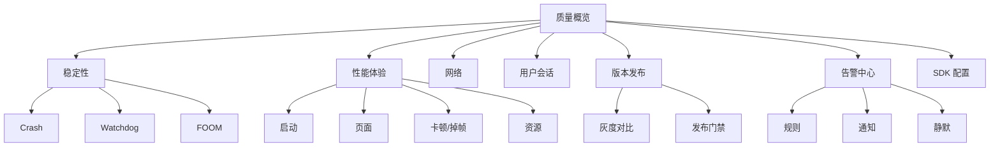
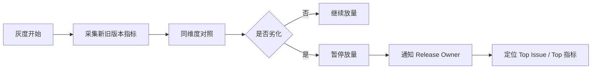

+++
title = "APM-B端平台设计"
date = '2026-05-07T15:42:48+08:00'
draft = false
weight = 1
tags = ["iOS", "APM", "监控"]
categories = ["iOS开发", "APM"]
+++
B 端 APM 平台的目标不是“展示所有数据”，而是让研发团队在最短路径内完成：**发现问题、判断影响、定位原因、分配负责人、验证修复、防止再次劣化**。

---

## 一、信息架构



一级导航不要按技术实现命名，比如 Kafka、ClickHouse、符号化任务；应该按用户任务命名，比如稳定性、性能体验、网络、发布、告警。

---

## 二、首页质量概览

首页回答三个问题：

1. 当前版本稳不稳？
2. 过去一段时间有没有变差？
3. 最应该处理的 Top 问题是什么？

核心卡片：

| 卡片 | 展示 |
|-----|------|
| 稳定性 | Crash-free users、Crash-free sessions、异常退出率 |
| 启动 | 冷启动 P90/P99、首屏 P90、TTI |
| 流畅性 | 卡顿率、Freeze 率、滚动掉帧 |
| 网络 | 错误率、慢请求率、TTFB P90 |
| 页面体验 | 页面秒开率、白屏率、慢页面 TopN |
| 发布风险 | 新版本 vs 老版本劣化项 |
| Top Issue | 影响用户数、趋势、Owner、状态 |

所有指标都必须能按这些维度筛选：

```text
app_id
env
release
build
os_version
device_model
device_tier
network_type
region
channel
view_name
business_module
```

首页设计原则：

- 用 P90/P99 看长尾，不只看平均值。
- 每个指标都带同比或环比。
- 默认展示当前主版本和灰度版本。
- 异常项必须能一键下钻。
- 不可行动的内部平台指标不要放首页。

---

## 三、稳定性详情

### 3.1 Crash Issue 页

Crash Issue 页面需要展示：

```text
标题：EXC_BAD_ACCESS in ProductViewController.dealloc
状态：Open / Assigned / Fixed / Verifying / Closed
影响：用户数、次数、Session 数、Crash-free 影响
趋势：首次出现、最近出现、版本分布
归因：堆栈、线程、异常类型、寄存器、二进制镜像
现场：Breadcrumb、页面路径、网络请求、用户操作
维度：机型、OS、地区、网络、渠道
协作：Owner、工单、备注、修复版本
```

详情页布局建议：

```text
顶部：Issue 摘要 + 状态 + Owner + 操作按钮
左侧：代表性堆栈 + 线程列表
右侧：影响面 + 维度分布 + 趋势图
底部：样本事件 + Session 时间线 + 相似问题
```

堆栈展示要求：

- 默认突出 in-app frame。
- 系统栈折叠。
- 支持 Swift demangle。
- 支持源码链接或 Git commit 链接。
- 支持同类样本堆栈差异对比。

### 3.2 Watchdog / 卡死页

Watchdog 不等于普通卡顿，页面要展示多次采样结果：

| 信息 | 价值 |
|-----|------|
| 主线程连续采样 | 判断真正阻塞位置 |
| 线程状态 | 是否锁等待、IO、同步派发 |
| CPU 占用 | 区分死循环和等待 |
| 最近页面和操作 | 找触发场景 |
| 同时段网络和磁盘 | 找外部等待 |

如果只有一次堆栈，平台要明确标记可信度，避免误导研发。

### 3.3 FOOM 页

FOOM 没有崩溃堆栈，必须围绕证据链设计：

```text
上次前台状态
上次内存水位
页面路径
大对象 TopN
图片/缓存/播放器/数据库等模块内存
MetricKit memory diagnostics
机型内存档位
同版本趋势
```

FOOM 页面应该默认按机型内存档位切分，否则高端机和低端机会互相稀释。

---

## 四、性能体验详情

### 4.1 启动分析

启动页按阶段拆：

```text
process start -> main
main -> didFinishLaunching
didFinishLaunching -> first frame
first frame -> first content
first content -> interactive
```

展示：

- P50/P90/P99。
- 冷启动、温启动、热启动、预热启动分开。
- 按版本、机型、OS、渠道切分。
- 慢启动样本 Session。
- 阶段耗时瀑布图。

### 4.2 页面性能

页面详情要回答：

```text
哪个页面慢？
慢在哪个阶段？
是否白屏？
是否和接口、图片、布局、主线程卡顿相关？
影响多少用户？
```

典型指标：

| 指标 | 含义 |
|-----|------|
| view_load_ms | 页面生命周期加载耗时 |
| first_contentful_ms | 首个关键内容出现 |
| interactive_ms | 可交互 |
| blank_rate | 白屏率 |
| slow_view_rate | 慢页面率 |
| long_task_count | 页面内主线程长任务数 |

### 4.3 网络分析

网络页要从用户视角展示真实耗时，而不是只看服务端接口耗时。

```text
DNS
TCP
TLS
request
TTFB
download
total
```

必备下钻：

- host / path template。
- HTTP status。
- URLSession error。
- 网络类型。
- 地区和运营商。
- trace_id 关联后端。
- 页面和 Action 来源。

---

## 五、用户会话

Session 页面是 RUM 的核心呈现。

时间线示例：

```text
10:01:02  Session Start  cold_launch
10:01:03  View Home appear
10:01:04  Resource GET /home 340ms 200
10:01:08  Action tap_product
10:01:09  View ProductDetail appear
10:01:10  Resource GET /product/{id} 1.2s 200
10:01:12  LongTask main 680ms
10:01:15  Action tap_buy
10:01:16  Resource POST /order 3.2s 500
10:01:17  Error EXC_BAD_ACCESS
```

Session 页要支持：

| 能力 | 说明 |
|-----|------|
| 时间线 | 页面、操作、网络、错误、卡顿按时间排序 |
| 过滤 | 只看 error、resource、long task |
| 上下文 | 设备、系统、版本、网络、地区 |
| 关联 | 跳转 Issue、接口详情、页面详情 |
| 隐私 | 用户身份匿名化，敏感字段不可见 |

不要做屏幕录像回放，除非合规、授权和脱敏能力非常成熟。多数 APM 场景下，结构化 Session 时间线已经足够。

---

## 六、告警中心

告警设计目标是“少而准，可行动”。

规则类型：

| 类型 | 示例 |
|-----|------|
| 阈值 | Crash 率 > 0.2% |
| 环比 | 新版本启动 P90 劣化 15% |
| 变点 | 10 分钟内网络错误率突增 |
| SLO | Crash-free users < 99.9% |
| 灰度 | 灰度组指标显著差于对照组 |
| Top Issue | 单 Issue 影响用户数进入 TopN |

告警内容必须包含：

```text
发生了什么
影响多少用户
从什么时候开始
影响哪些版本/机型/地区
疑似原因或 Top 维度
Owner 是谁
下一步入口链接
```

告警收敛：

- 同 Issue 合并。
- 同版本同规则合并。
- 静默窗口。
- 恢复通知。
- 升级策略。
- 误报反馈。

不可行动的指标只进报表，不进告警。

---

## 七、发布防劣化

发布页围绕“新版本是否可以继续放量”设计。



对照要控制变量：

| 变量 | 说明 |
|-----|------|
| 时间窗口 | 新旧版本同一时间段 |
| 机型 | 同设备档位 |
| OS | 同系统版本 |
| 网络 | 同网络类型 |
| 地区 | 同地域 |
| 渠道 | 同发布渠道 |

门禁指标：

```text
Crash-free users
FOOM rate
Watchdog rate
Launch P90
View slow rate
Network error rate
Key business path success rate
```

---

## 八、SDK 配置后台

B 端必须能反控 C 端 SDK。

配置项：

| 配置 | 示例 |
|-----|------|
| 插件开关 | crash、network、fps、memory_graph |
| 采样率 | 按 App、版本、设备、地区配置 |
| 阈值 | 卡顿阈值、慢请求阈值、慢页面阈值 |
| 黑白名单 | URL、页面、用户 hash、设备 |
| 隐私策略 | URL query、header、body、PII |
| 熔断 | 上报失败率、SDK CPU、队列大小 |

配置发布流程：

```text
编辑 -> 校验 -> 灰度 -> 观察 SDK health -> 全量 -> 可回滚
```

配置后台必须有审计日志。APM SDK 配置改错，可能造成全量数据丢失或端侧性能问题。

---

## 九、权限与合规

权限模型：

| 权限 | 能力 |
|-----|------|
| Viewer | 查看聚合大盘 |
| Developer | 查看自己模块 Issue 和脱敏样本 |
| Maintainer | 修改 Issue 状态、Owner、告警规则 |
| Release Manager | 发布门禁、灰度规则 |
| Admin | SDK 配置、权限、数据保留策略 |

合规要求：

- 默认脱敏。
- 用户 ID hash 化。
- 敏感字段不可搜索。
- 样本事件访问留审计。
- 大附件下载需要权限。
- 数据保留期限按地区和业务配置。

---

## 十、B 端性能

APM 平台自身也是高频工具，查询体验要好。

设计建议：

- 首页只查预聚合表。
- 明细查询必须限制时间范围。
- 大查询异步化。
- 维度筛选使用字典表和缓存。
- Session 时间线按需加载。
- 堆栈和大附件懒加载。
- 常用视图保存为 Dashboard。

常见反模式：

| 反模式 | 后果 |
|-------|------|
| 首页实时扫明细表 | 页面慢、数据库压力大 |
| 所有维度都支持任意组合 | 查询不可控 |
| Issue 详情加载全部样本 | 页面卡死 |
| 告警规则直接跑 SQL | 规则延迟和成本不可控 |

---

## 十一、总结

B 端 APM 平台的成熟度不看图表数量，而看闭环能力：

```text
能发现
能下钻
能归因
能分发
能验证
能拦截
能审计
```

如果一个平台只能看趋势图，它只是监控看板；如果它能让问题自动进入研发流程，并在发布阶段阻止劣化进入全量，它才是 APM 治理平台。
