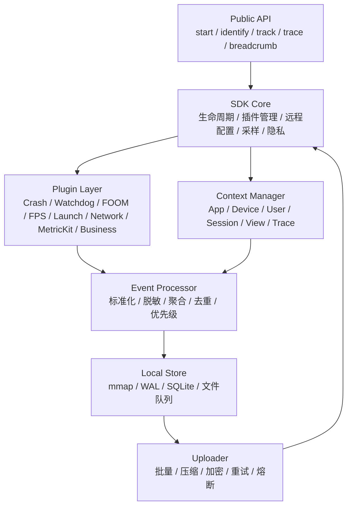

+++
title = "APM-C端SDK架构"
date = '2026-05-07T15:42:48+08:00'
draft = false
weight = 2
tags = ["iOS", "APM", "监控"]
categories = ["iOS开发", "APM"]
+++
iOS APM SDK 是整个系统的数据入口。它运行在真实用户设备上，和业务 App 共进程、共资源、共生命周期，所以设计目标不是“能力越多越好”，而是 **低开销、可控制、可降级、可追责、可合规**。

---

## 一、SDK 职责边界

SDK 应该做：

- 采集 Crash、Watchdog、FOOM、卡顿、启动、网络、页面、MetricKit、业务 Trace 等现场。
- 生成并维护 `session_id`、`view_id`、`action_id`、`resource_id`、`trace_id` 等关联 ID。
- 做轻量预处理：去重、聚合、脱敏、采样、压缩、加密。
- 按数据价值分级落盘和上报。
- 接收远程配置，动态控制模块开关、采样率、阈值和熔断。

SDK 不应该做：

- 复杂 OLAP 查询。
- 大规模归因计算。
- 服务端符号化。
- 跨用户聚合。
- 长时间 CPU 采样或高频全量堆栈采样。
- 未经允许采集请求 body、用户输入、定位、通讯录等敏感数据。

---

## 二、分层架构



推荐模块：

| 模块 | 责任 |
|-----|------|
| `APMCore` | 初始化、生命周期、配置、插件调度 |
| `APMContext` | 设备、App、用户、Session、View、Trace 上下文 |
| `APMPlugin` | 插件协议和插件容器 |
| `APMEventProcessor` | 事件标准化、过滤、脱敏、采样 |
| `APMLocalStore` | 分级落盘、队列、容量控制 |
| `APMUploader` | 批量、重试、压缩、加密、熔断 |
| `APMConfigManager` | 拉取远程配置、灰度、缓存、回滚 |
| `APMPrivacyGuard` | 敏感字段识别、脱敏、采集授权 |

---

## 三、插件化设计

每个采集能力都应该是插件，而不是塞进一个巨大单例。

```swift
protocol APMPlugin {
    var name: String { get }
    var defaultEnabled: Bool { get }
    func start(context: APMContext, config: APMPluginConfig)
    func stop()
    func update(config: APMPluginConfig)
}
```

插件生命周期：

```text
register
  -> load local config
  -> start minimal core
  -> fetch remote config
  -> start enabled plugins
  -> runtime config update
  -> stop / degrade / disable
```

插件拆分建议：

| 插件 | 开启策略 |
|-----|---------|
| Crash | 默认全量开启，高价值低频 |
| FOOM | 默认开启，低开销，依赖上次运行状态 |
| Watchdog | 默认开启或灰度开启，阈值远程可调 |
| FPS / Frame | 采样开启，避免高频常驻 |
| Launch | 默认开启，采集阶段耗时 |
| Network | 默认采样，错误和慢请求优先保留 |
| MetricKit | 默认开启，系统低开销基线 |
| MemoryGraph / Zombie / Coredump | 只对疑难问题灰度或触发式开启 |
| Business Trace | 业务接入，按场景采样 |

---

## 四、初始化策略

APM SDK 不能拖慢 App 启动。初始化要拆成轻重两段：

```text
极早期：
  - Crash handler
  - 上次运行状态读取
  - 本地配置读取
  - 最小上下文初始化

首帧后/空闲时：
  - 远程配置拉取
  - 高频插件启动
  - 历史数据扫描
  - 批量上报
```

推荐原则：

1. Crash 和 FOOM 这类稳定性基础能力可以早启动。
2. FPS、网络 hook、MetricKit 注册、历史包上报尽量延后。
3. SDK 初始化必须有耗时埋点，自己也要被监控。
4. 首次安装、版本升级、配置异常时要走保守策略。

---

## 五、上下文与 ID 管理

SDK 最重要的隐藏职责是生成稳定 ID。

```text
app_id
env
release
build
sdk_version
device_id
user_id
session_id
view_id
action_id
resource_id
trace_id
span_id
event_id
```

Session 规则建议：

| 场景 | 处理 |
|-----|------|
| App 冷启动进入前台 | 创建新 `session_id` |
| App 后台超过阈值再回前台 | 创建新 `session_id` |
| 短时间前后台切换 | 保持同一 Session |
| Crash 后下次启动 | 上报上次 Session 结束原因 |

View 规则建议：

- UIKit 用 `viewDidAppear` / `viewDidDisappear` 维护页面栈。
- SwiftUI 需要业务显式声明 `viewName`，不要完全依赖类型名。
- 页面实例要有 `view_id`，页面名称只是维度。
- 页面切换要和网络、错误、Action 关联。

Trace 规则建议：

- 网络请求注入 `traceparent` 或自定义 trace header。
- 业务 Trace 可以由 SDK 生成 `trace_id`，服务端继续透传。
- 不要把日志 ID、请求 ID、Session ID 混用。

---

## 六、采样与优先级

采样必须在端侧就开始，否则服务端和用户流量成本会失控。

数据分级：

| 等级 | 数据 | 策略 |
|-----|------|------|
| Critical | Crash、Watchdog、FOOM、致命业务错误 | 尽量全量，可靠落盘 |
| Important | 启动、页面慢加载、网络错误、慢请求 | 较高采样，错误优先 |
| Sampled | FPS 时序、CPU 时序、普通资源请求、普通业务事件 | 低采样，可丢弃 |
| Debug | MemoryGraph、Coredump、Zombie、长时间 Profiling | 灰度、触发式、短时间 |

稳定采样：

```swift
func sampled(deviceId: String, key: String, rate: Double, day: String) -> Bool {
    let seed = "\(deviceId)-\(key)-\(day)"
    let hash = UInt64(seed.hashValue.magnitude)
    return Double(hash % 10_000) / 10_000.0 < rate
}
```

采样策略要支持：

- 按 App 版本采样。
- 按设备、系统、地区、渠道采样。
- 错误全量、成功抽样。
- 慢请求全量、普通请求抽样。
- 命中特定 Issue 后临时提高采样率。
- 服务端下发熔断规则。

---

## 七、本地存储与上报

端侧存储要按数据价值选择不同介质：

| 数据 | 推荐存储 |
|-----|---------|
| Crash 最小现场 | 独立文件 + `fsync` |
| Watchdog / FOOM 状态 | 小文件或 WAL |
| 高频日志 / FPS / CPU | mmap ring buffer |
| 事件队列 | SQLite / WAL / 分片文件 |
| 待上报包 | 文件队列，带 TTL 和大小上限 |

上报器要支持：

- 批量打包。
- gzip/zstd 压缩。
- HTTPS 加密传输。
- 指数退避 + jitter。
- 幂等 `event_id`。
- 后台任务。
- 网络类型判断。
- 服务端限流响应。
- 本地容量上限。
- SDK 自熔断。

APM 自身请求要打标，避免被网络插件再次采集造成回环。

---

## 八、隐私与合规

SDK 的默认策略应该是“少采、脱敏、可关闭”。

默认禁止采集：

- 请求 body。
- Cookie、Authorization、Token。
- 手机号、身份证、邮箱、银行卡。
- 精确定位。
- 用户输入内容。
- 相册、通讯录、剪贴板。

建议提供：

```swift
APM.start(options: .init(
    uploadURL: "...",
    dataCollectionEnabled: true,
    networkBodyCapture: .disabled,
    piiMasking: .enabled,
    sampleRate: 0.1
))
```

脱敏规则要在端侧和服务端各做一次。端侧减少泄露风险，服务端兜底治理历史和业务误传。

---

## 九、防自崩与降级

APM SDK 最严重的问题是自己造成线上事故。

必须具备：

| 能力 | 说明 |
|-----|------|
| 远程关闭 | 单插件、单版本、单 App、单地区关闭 |
| 熔断 | 上报失败率、CPU、磁盘、Crash 异常时自动停用 |
| 灰度 | 新插件先在小比例用户启用 |
| 白名单 | SDK 自身请求、文件、线程不被重复监控 |
| 兼容保护 | Hook 前检查类和方法存在性，失败可回退 |
| 版本回滚 | 远程配置出错时回退本地安全配置 |
| 自监控 | 记录 SDK 初始化耗时、队列大小、丢弃数、上报失败率 |

SDK 自监控事件示例：

```json
{
  "event_type": "sdk_health",
  "sdk_version": "2.3.1",
  "init_cost_ms": 18,
  "queue_size": 120,
  "dropped_events": 3,
  "upload_fail_rate": 0.02,
  "disabled_plugins": ["fps"]
}
```

---

## 十、测试策略

APM SDK 的测试不能只跑单元测试。

| 测试 | 重点 |
|-----|------|
| 单元测试 | 采样、脱敏、队列、配置解析 |
| 集成测试 | 多插件并发、生命周期、前后台、弱网 |
| 崩溃测试 | Mach/Signal/NSException、二次崩溃、防 handler 冲突 |
| 性能测试 | 启动耗时、CPU、内存、磁盘、流量 |
| 兼容测试 | iOS 版本、机型、SwiftUI/UIKit、三方网络库 |
| 灰度验证 | 采集量、上报成功率、SDK 自身 Crash |

上线门槛建议：

```text
启动增加 < 20ms
常驻内存 < 5MB
常驻 CPU 接近 0
上报流量 < 100KB/DAU
SDK 自身 Crash 率无可见上升
远程关闭可在分钟级生效
```

---

## 十一、总结

C 端 SDK 的架构核心不是“多采”，而是：

```text
用最小成本采到能定位问题的上下文
用统一 RUM ID 把上下文串起来
用远程配置把风险控制住
```

SDK 设计得好，服务端和 B 端才有高质量数据；SDK 设计得重，APM 自己就会变成线上性能问题。
