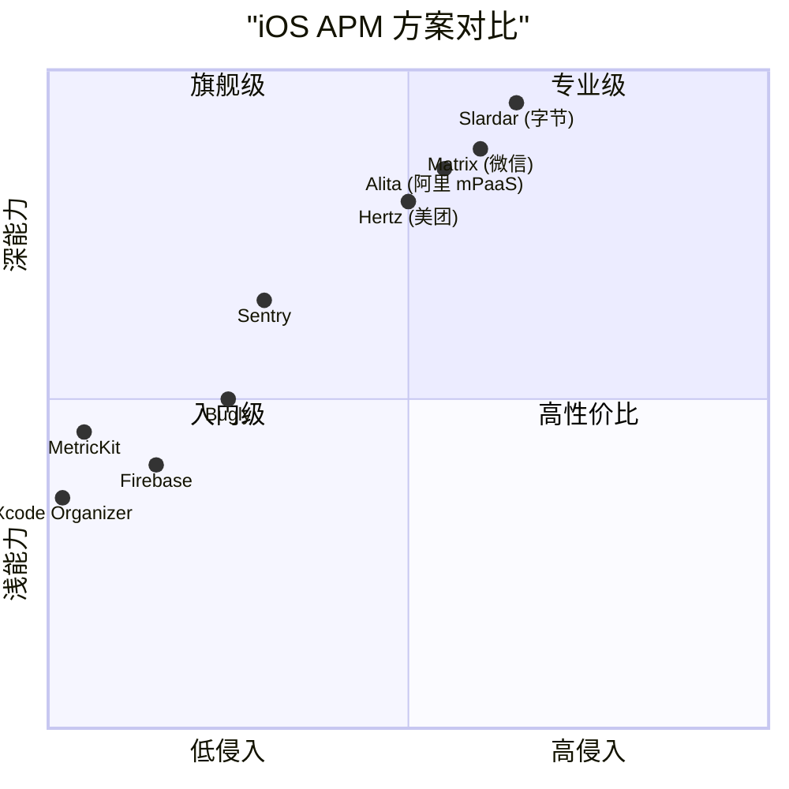
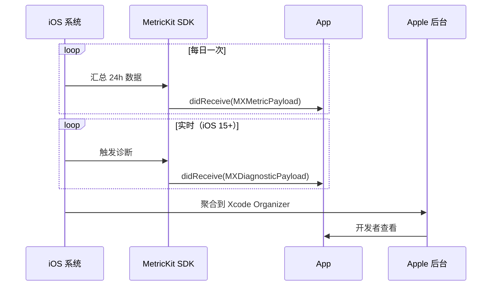
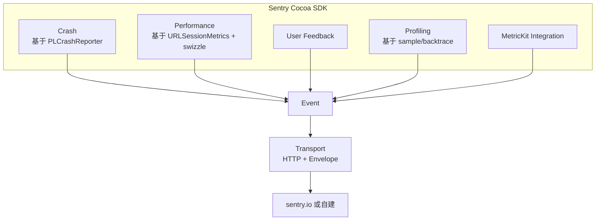
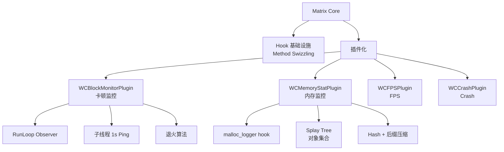
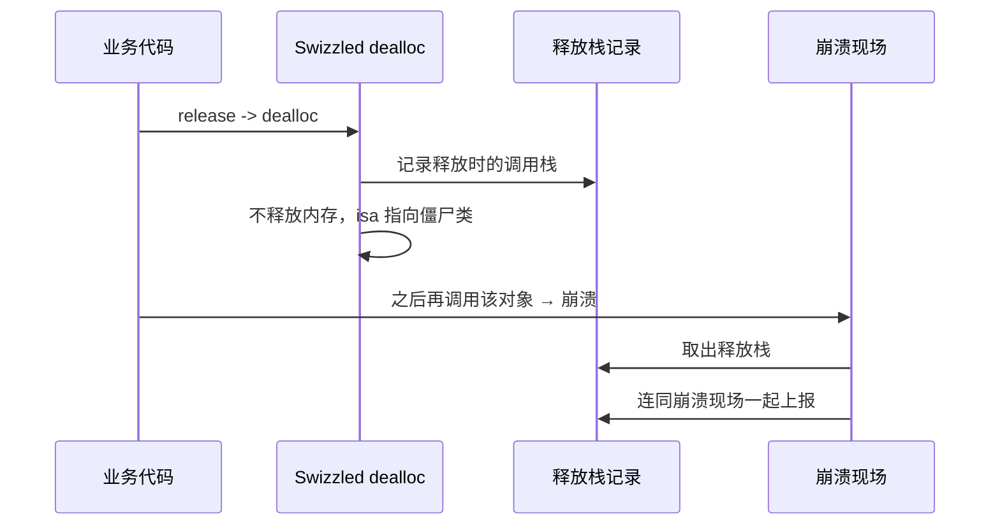
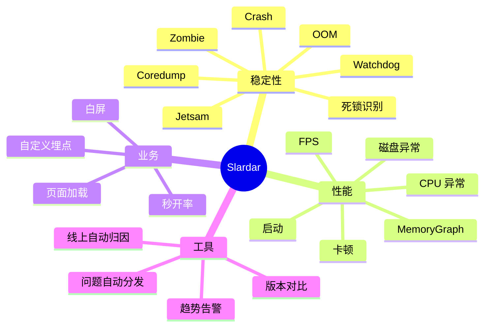
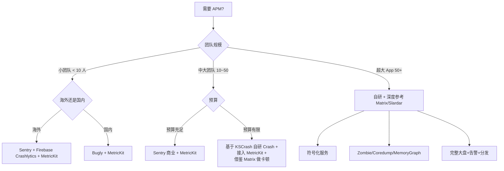

+++
title = "APM-业界方案"
date = '2026-05-07T15:42:48+08:00'
draft = false
weight = 3
tags = ["iOS", "APM", "监控"]
categories = ["iOS开发", "APM"]
+++
本文对比目前 iOS APM 领域主流的七大方案，从接入形态、原理、能力深度、适用场景四个维度深入剖析。每个方案都包含核心技术原理与关键源码解读，帮助读者做"自研还是三方、自研该参考哪个"的选型决策。

---

## 一、全景对比



---

## 二、MetricKit + Xcode Organizer（Apple 官方）

### 2.1 定位

Apple 自 iOS 13 推出的官方性能监控框架，**完全系统侧实现**，SDK 零开销，是所有方案的基线。

### 2.2 核心能力

**MetricKit**：

| API | 用途 |
|-----|-----|
| `MXMetricPayload` | 24 小时聚合指标（CPU/GPU/内存/电量/启动/磁盘/网络） |
| `MXCrashDiagnostic` | 崩溃诊断（iOS 14+）|
| `MXCPUExceptionDiagnostic` | CPU 异常（3 分钟 CPU > 80%）|
| `MXHangDiagnostic` | 卡死诊断 |
| `MXDiskWriteExceptionDiagnostic` | 磁盘异常（24h 写入 > 1GB）|
| `MXAnimationMetric` | 滚动卡顿（iOS 14+）|
| `MXAppLaunchMetric` | 启动耗时分布 |
| `MXAppResponsivenessMetric` | 响应延迟分布 |

**Xcode Organizer**：Apple 的可视化后台，展示 MetricKit 数据 + App Store 连接。

### 2.3 数据交付



**iOS 15 关键变化**：Diagnostic 报告从"按天"变成"事件触发即推送"，大幅提升及时性。

### 2.4 接入

```swift
import MetricKit

final class APMMetricSubscriber: NSObject, MXMetricManagerSubscriber {
    static let shared = APMMetricSubscriber()

    func register() {
        MXMetricManager.shared.add(self)
    }

    func didReceive(_ payloads: [MXMetricPayload]) {
        for payload in payloads {
            let json = payload.jsonRepresentation()
            APMUploader.upload(type: .metric, data: json)
        }
    }

    @available(iOS 14.0, *)
    func didReceive(_ payloads: [MXDiagnosticPayload]) {
        for payload in payloads {
            payload.crashDiagnostics?.forEach { upload($0) }
            payload.hangDiagnostics?.forEach { upload($0) }
            payload.cpuExceptionDiagnostics?.forEach { upload($0) }
            payload.diskWriteExceptionDiagnostics?.forEach { upload($0) }
        }
    }
}
```

### 2.5 优势与短板

**优势**：

- 系统级实现，零性能开销
- 官方长期维护
- 数据权威（Apple 自己的判定）
- 无需用户授权，ATT 无关

**短板**：

- 只能看"指标值"，拿不到业务上下文（用户在哪个页面、在做什么）
- 报告延迟 24h（Diagnostic 已即时）
- 只能覆盖 iOS 13+ 系统
- 无自定义埋点能力
- 无用户级归因

### 2.6 选型建议

**必接**。即使有自研 SDK，MetricKit 也是最低成本的补充数据源，可作为"真值"校验自研数据准确性。

---

## 三、Sentry

### 3.1 定位

开源 SaaS 化错误/性能监控，覆盖全平台（Web/iOS/Android/Flutter/...），是国际上使用最广的方案之一。

### 3.2 iOS SDK 架构



### 3.3 关键原理

**崩溃采集**基于微软的 [PLCrashReporter](https://github.com/microsoft/plcrashreporter)：

- Mach 异常端口注册
- Signal handler
- 栈回溯按 DWARF/Compact Unwind 解析
- 崩溃报告二进制写入 `Crashes` 目录

**Performance 追踪**基于 OpenTelemetry 语义：

- 自动 swizzle `UIViewController.loadView`/`viewDidAppear` 生成 Transaction
- 自动 swizzle `URLSession` 生成 Span
- 支持手动 `SentrySDK.startTransaction` 打点

**Profiling**：

- 连续采样（默认 50Hz）
- 采样时机：Transaction 期间 or `SentrySDK.startProfiler`
- 输出火焰图

**MetricKit Integration**：Sentry SDK 自动订阅 MetricKit，把 `MXHangDiagnostic`/`MXCPUExceptionDiagnostic` 转为 Sentry Event 上报（从 8.0+ 默认开启）。

### 3.4 接入

```swift
import Sentry

SentrySDK.start { options in
    options.dsn = "https://xxx@sentry.io/123"
    options.tracesSampleRate = 0.2
    options.profilesSampleRate = 0.1
    options.enableAppHangTracking = true
    options.enableAutoPerformanceTracing = true
    options.enableMetricKit = true
}
```

### 3.5 优势与短板

**优势**：

- 生态成熟，跨平台
- 开箱即用的 Crash + Performance + User Feedback
- Profiling 是其他 SaaS 基本没有的能力
- 提供自托管部署（on-premise）

**短板**：

- SaaS 价格对大用户量不友好（按 event 收费）
- 中国访问 sentry.io 网络质量差，必须自建
- 堆栈符号化依赖上传 dSYM，CI 集成要做
- Performance 的自动 span 颗粒度较粗，深度定制要写代码

### 3.6 适合谁

中小团队、海外产品、需要开箱即用 + 跨平台统一方案。

---

## 四、Firebase Performance + Crashlytics

### 4.1 定位

Google 旗下 Firebase 全家桶的一部分，Crashlytics 覆盖崩溃，Performance 覆盖性能。

### 4.2 核心能力

**Crashlytics**：

- 基于 Crashlytics 自研采集（非 PLCrashReporter）
- 崩溃日志按 session 自动关联日志、网络、自定义事件
- 卡死检测（iOS 15+ 基于 MetricKit）

**Performance**：

- 自动采集：App 启动、首屏、前后台切换、HTTP 请求
- 自定义 Trace：开始/结束 + 自定义属性
- 界面渲染指标：`_app_start_trace`、`_app_in_foreground`

### 4.3 技术点

- 自动 swizzle `URLSession`，基于 Protocol 方法替换
- 启动采集：hook `UIApplicationMain` 之前埋点
- 符号化：上传 dSYM 到 Firebase 后台自动处理（或 CI 用 `upload-symbols` 工具）

### 4.4 优势与短板

**优势**：

- 免费（限额极高）
- 与 Firebase Analytics、A/B Test 打通
- Google 维护、稳定性高

**短板**：

- 采样频率低，拿不到帧级别数据
- 无 Profiling
- 中国访问/数据出境问题
- 扩展性差

### 4.5 适合谁

海外小中型团队、已在用 Firebase 的项目。

---

## 五、Bugly（腾讯）

### 5.1 定位

腾讯 Bugly 是国内最早的崩溃收集服务（2015 年左右），现并入腾讯云。

### 5.2 能力

- Crash（Mach / Signal / NSException）
- ANR/卡顿（基于 RunLoop）
- 自定义日志、面包屑
- 符号化托管

**注意**：Bugly iOS SDK 长期维护比较保守，新特性（MetricKit、FOOM、Profile）相对滞后。

### 5.3 优势与短板

**优势**：国内网络稳定、接入简单、中文生态。
**短板**：能力偏 Crash，性能维度较弱。

### 5.4 适合谁

中小团队、国内 App、诉求主要是 Crash 收集。

---

## 六、微信 Matrix

### 6.1 定位

腾讯微信开源的 iOS/macOS/Android APM 工具集合，**最具技术深度**的开源方案。

开源地址：<https://github.com/Tencent/matrix>

### 6.2 架构



### 6.3 卡顿监控

微信公开的具体参数：

| 参数 | 值 |
|-----|---|
| RunLoop 超时阈值 | 2 秒 |
| 子线程检查周期 | 1 秒 |
| CPU 高占用判定 | 单核 > 80% |
| 堆栈采样周期 | 50ms |
| 循环队列大小 | 20 帧 |
| CPU 占用增量 | 约 3% |

**退火算法**：

```swift
func shouldSample(currentStack: Stack) -> Bool {
    if currentStack == lastStack {
        consecutiveCount += 1
        skipTimes = fibonacci(consecutiveCount)
        return sampleCount >= skipTimes
    } else {
        consecutiveCount = 0
        return true
    }
}
```

**耗时堆栈提取**：

50ms 一次采样，保存最近 20 条堆栈。发生卡顿时，通过"连续相同栈顶"判定最耗时的那段，服务端能直接定位真凶函数而不是一堆散乱栈帧。

### 6.4 内存监控（WCMemoryStat）

核心思路：在进程内建立一套"实时内存快照索引"，OOM 临近时 dump 下来。

**数据结构选择**：

- **Splay Tree（伸展树）**：存活对象集合。最近访问接近 O(1)，相比红黑树更省内存。
- **Hash Table + 后缀压缩**：堆栈去重。微信数据：平均栈长 35 → 5，压缩率 42%。

**Hook 点**：

```c
extern malloc_logger_t *malloc_logger;
extern malloc_logger_t *__syscall_logger;

static malloc_logger_t *original_malloc_logger;

void wc_malloc_logger(uint32_t type, uintptr_t arg1, uintptr_t arg2,
                      uintptr_t arg3, uintptr_t result, uint32_t num_hot_frames) {
    record_allocation(type, arg1, arg2, arg3, result);
    if (original_malloc_logger) {
        original_malloc_logger(type, arg1, arg2, arg3, result, num_hot_frames);
    }
}

original_malloc_logger = malloc_logger;
malloc_logger = wc_malloc_logger;
```

**性能**：iPhone 6 Plus 上 CPU 占用约 13%，内存约 20MB（mmap 映射，不占物理内存）。

**上报策略**：按 Category（vm_region_type）分类，TOP N 类别 + TOP M 堆栈上报。

### 6.5 优势与短板

**优势**：

- 原理深，微信级实战打磨
- 开源、可完全自定义
- 卡顿、OOM 两大杀手锏

**短板**：

- 无完整后台，需自建
- iOS 端部分模块只适合灰度打开
- 更新节奏慢，与最新 iOS 版本适配滞后

### 6.6 适合谁

有自研 APM 能力、想借鉴深度原理的团队。

---

## 七、字节 Slardar / APM Plus

### 7.1 定位

字节跳动 APM 中台，服务抖音、头条、飞书等全系产品，通过火山引擎 APM Plus 对外商业化。

### 7.2 技术深度（核心创新）

#### 7.2.1 Zombie 监控

> 传统 Zombie 只能看到"哪个对象 + 哪个方法"，Slardar 扩展了 Zombie 对象**释放时**的调用栈。



案例价值：飞书某版本 Top 1 Crash 是 `MainTabbarController` 野指针。通过释放栈定位到视图导航控制器手势识别代理方法中的 trick 代码释放了首页 VC，两个月未解问题当天修复。

#### 7.2.2 Coredump

Slardar 把 Crash 现场变成可事后调试的 `.coredump` 文件：

- Crash 时写入所有线程寄存器 + 栈内存 + 主要 heap 区域
- 服务端侧可用 `lldb target create -c coredump.file` 加载调试
- 开发者可用 `memory read`、`register read` 做"崩溃时间旅行"

案例：某崩溃调用栈全系统库，命中 libdispatch 断言。通过 Coredump 读取 queue 结构体 label 属性字符串，定位到是字节网络库的 `com.apple.CFFileDescriptor` 队列引用计数异常。解决后字节全系 Crash 率下降 8%。

#### 7.2.3 死锁识别

卡死时扫描所有线程，按 PC 寄存器识别锁等待函数：

| 锁类型 | 等待函数 |
|-------|---------|
| 互斥锁 | `pthread_mutex_lock`, `psynch_mutexwait` |
| 读锁/写锁 | `pthread_rwlock_rdlock/wrlock` |
| 自旋锁 | `os_unfair_lock_lock_slow` |
| GCD 同步 | `dispatch_sync`, `_dispatch_sync_f_slow`, `_dispatch_barrier_sync_f_slow` |

从参数寄存器读取锁结构体，解析出"当前持有者 tid"，构建"等待 → 持有"有向图，DFS 找环。

#### 7.2.4 卡死多次采样

传统卡顿检测抓单帧栈容易抓到"真凶之后"。Slardar 改进：阻塞 > 1s 后每 500ms 抓一次，并记录：

- Thread CPU 占用（是不是 CPU 繁忙）
- Thread State（`TH_STATE_RUNNING`/`TH_STATE_WAITING`）
- Thread Flags（`TH_FLAGS_IDLE`/`TH_FLAGS_SWAPPED`）

服务端对多次采样做聚类，选"出现次数最多的栈帧"作为主因。

#### 7.2.5 在线 MemoryGraph

思路与微信类似（malloc_logger hook + 引用关系），但做了"类列表 + 引用路径回溯"的服务端可视化。

案例：飞书 OOM 分析中发现 47 个 `ImageIO` 对象占 500MB+，100% 被 `VM Stack: Rust Client Callback` 引用，最终定位是图片下载器未设置最大并发数。

### 7.3 能力全景



### 7.4 优势与短板

**优势**：

- 业界最深的归因能力（Zombie+Coredump+死锁识别）
- 字节全系产品打磨（抖音、头条、飞书）
- 商业化产品文档齐全

**短板**：

- 闭源，核心能力只有商业版能用
- 主要面向中国客户，海外生态弱

### 7.5 适合谁

大型 App、追求顶级归因能力、可接受商业采购的团队。

---

## 八、美团 Hertz

### 8.1 定位

美团技术团队 2016 年分享的 APM 方案。论文公开程度高，架构思路值得学习。

### 8.2 特色设计

**多阶段耗时模型**：

```mermaid
gantt
    title Hertz 页面耗时模型
    dateFormat X
    axisFormat %Ls

    section 页面测速
    T1 初始化到第一个UI : 0, 100
    T2 网络请求 : 80, 400
    T3 数据填充渲染 : 480, 200
```



- T1：页面初始化到首个 UI 显示
- T2：网络请求（可能早于 T1 结束）
- T3：数据加载后渲染完成
- T：总耗时

**首屏检测**：配置文件声明关键元素 tag，网络请求成功后开 CADisplayLink 轮询关键视图是否出现。

**聚合型堆栈**：二叉树存储多组堆栈，共用前缀节省 50%+ 存储。

**窗口扫描 CPU 异常**：固定窗口 N 次采样中超限次数超过阈值才触发上报，按平均 CPU 分 info/warn/error 三级。

**流量统计**：按"自然日+请求来源+网络类型"维度，区分 API/H5/CDN 三类来源。

### 8.3 启示

Hertz 分享最值得借鉴的是**"配置化 + 低侵入"的设计哲学**：

- 页面测速通过配置文件声明关键元素
- 网络指标通过 NSURLProtocol 自动采集
- 卡顿通过"N 次超阈值 T"分别判定长耗时卡顿与高频卡顿

---

## 九、阿里 mPaaS / Alita

### 9.1 定位

阿里集团内部 APM 平台，通过 mPaaS 对外输出。

### 9.2 能力概览

- RPC 自动监控（DNS/TCP/SSL/首包）
- H5 自动埋点
- 页面加载时长自动
- 启动速度监控
- 闪退监控
- `MPRemoteLoggingInterface` 上报入口

### 9.3 特色

- 与阿里 EMAS/ARMS 打通，做全栈追踪（前端 → 网关 → 后端）
- 支付宝级 App 打磨

---

## 十、云音乐 APM 实践

网易云音乐公开的 APM 架构特点：

- 三层模块：数据采集、堆栈处理、监控
- 聚合堆栈用二叉树，DFS 输出，统计节点命中次数做权重
- 堆栈去噪：过滤纯系统调用、过滤 main 函数、判定 image 是否来自 App 自身代码

这些工程实践点是自研 APM 绕不开的课题。

---

## 十一、选型决策树



---

## 十二、组合方案推荐

### 12.1 入门组合

```
MetricKit（打底）
+ Sentry Crash SDK（崩溃）
+ Firebase Performance（性能）
```

成本：低。覆盖：Crash + 基础性能。

### 12.2 进阶组合

```
MetricKit
+ KSCrash（Crash）
+ 自研 FPS/卡顿
+ 自研 NSURLProtocol 网络
+ 自研业务埋点
```

成本：中。覆盖：Crash + 性能 + 业务。

### 12.3 旗舰组合

```
MetricKit
+ 自研 Crash（基于 PLCrashReporter 二开）
+ 自研 Watchdog（多次采样 + 线程状态）
+ 自研 FOOM + MemoryGraph（参考 Matrix）
+ 自研 Zombie + Coredump（参考 Slardar）
+ 自研网络（URLSessionMetrics + 业务 headers）
+ 自研页面加载（关键元素 + 像素稳定性）
+ 自研大盘 + 告警
```

成本：高。覆盖：全。

---

## 十三、每个方案的"不要踩"清单

| 方案 | 踩坑 |
|-----|-----|
| Sentry | 不要在 `didFinishLaunching` 同步初始化；中国必须自建 |
| Firebase | 数据出境合规风险；中国访问慢 |
| Bugly | 不要过度依赖其卡顿数据；MetricKit 没接入 |
| Matrix iOS | WCMemoryStat 只灰度；需要人工维护后台 |
| Slardar | 商业授权成本；数据接入到火山引擎 |
| Hertz | 公开资料仅到 2016，需自行适配新 iOS |
| MetricKit | 没有业务上下文，不能单独使用 |

---

**下一步**：采集、上报、对接方案都搞定了，如何设计大盘、告警和防劣化闭环？见 [APM-B端平台设计]()。
