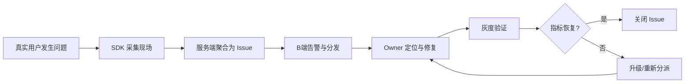
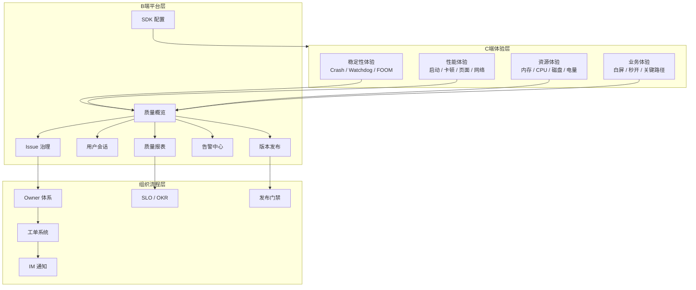

+++
title = "APM-产品与架构设计"
date = '2026-05-07T15:42:48+08:00'
draft = false
weight = 4
tags = ["iOS", "APM", "监控"]
categories = ["iOS开发", "APM"]
+++
APM 系统的产品设计不能从“要采哪些指标”开始，而应该从“谁要用这些数据解决什么问题”开始。iOS APM 的产品形态可以分成 C 端真实用户体验、B 端研发治理平台两面；技术实现则分成 iOS SDK、数据平台、Web 控制台三层。

---

## 一、产品边界

APM 的 C 端不是一个给用户看的页面，而是运行在用户设备里的监控能力；APM 的 B 端才是研发、测试、架构、运维、产品、客服使用的控制台。

| 视角 | C 端 | B 端 |
|-----|------|------|
| 用户 | App 真实用户 | 研发、测试、架构、运维、产品、客服 |
| 形态 | iOS SDK，无感运行 | Web 控制台、告警、工单、报表 |
| 核心体验 | 不打扰、不拖慢、不泄露隐私 | 快速发现、下钻、归因、分发、验证 |
| 主要风险 | SDK 自身引发卡顿、崩溃、耗电、流量 | 指标口径混乱、告警疲劳、无法定位 |
| 成功标准 | 数据真实且采集成本低 | 问题能被稳定治理，发布劣化能被拦截 |

因此产品设计要同时回答两类问题：

```text
C端：真实用户到底经历了什么？
B端：团队如何用这些数据把问题修掉？
```

---

## 二、用户角色

APM B 端不是只给研发看，不同角色需要不同入口。

| 角色 | 典型问题 | 核心视图 |
|-----|---------|---------|
| 客户端研发 | 我负责的模块有没有新 Crash、卡顿、FOOM | 我的 Issue、堆栈详情、会话时间线 |
| 后端研发 | 某接口在真实用户侧是否变慢、失败率是否升高 | 网络资源详情、Trace 关联、接口维度大盘 |
| 测试/QA | 灰度版本是否比线上版本变差 | 版本对比、灰度监控、回归报告 |
| 架构/技术负责人 | App 整体质量趋势如何，哪个团队拖后腿 | 质量大盘、模块排行、SLO |
| 产品/业务负责人 | 性能是否影响转化、留存、下单 | 页面秒开率、关键路径成功率、业务漏斗 |
| 客服/运营 | 单个用户为什么反馈无法使用 | 用户查询、Session 轨迹、错误上下文 |

设计 B 端时不要把所有人塞进同一个大盘。首页可以共用，但下钻路径要按角色分流。

---

## 三、核心业务流程

成熟 APM 平台的主流程是一个治理闭环：



每个节点都要有产品能力支撑：

| 流程节点 | 产品能力 |
|---------|---------|
| 发现 | 全局大盘、版本监控、异常突增检测 |
| 聚合 | Issue 聚类、相似问题合并、影响面统计 |
| 定位 | 堆栈、Session 时间线、设备画像、页面/接口上下文 |
| 分发 | Owner 规则、模块映射、工单/IM 集成 |
| 修复 | 状态流转、备注、关联 commit、修复版本 |
| 验证 | 灰度对比、修复率、回归告警 |
| 治理 | SLO、发布门禁、质量周报、长期趋势 |

---

## 四、产品架构



注意：`Config -> Experience` 是架构闭环的关键。B 端不能只是看数据，还要能反向控制 C 端 SDK，比如调采样率、关闭高风险模块、调整阈值、灰度开启新插件。

---

## 五、核心模块设计

### 5.1 质量概览

首页只展示最能代表用户体验和发布质量的指标：

| 指标 | 价值 |
|-----|------|
| Crash-free users / sessions | 稳定性北极星 |
| 异常退出率 | Crash + Watchdog + FOOM 的总体验损失 |
| 启动 P90 / P99 | 长尾用户启动体验 |
| 页面秒开率 | 核心页面体验 |
| 卡顿率 / Freeze 率 | 交互流畅性 |
| 网络错误率 / 慢请求率 | 真实网络体验 |
| 内存峰值 P90 | FOOM 风险前置指标 |
| 新版本劣化项 | 发布风险 |

首页不应该展示所有底层技术指标。CPU、磁盘、线程数、上报失败率这类指标更适合放到下钻页或平台运维页。

### 5.2 Issue 治理

Issue 是 B 端的最小治理单元，不是单条事件。

一个 Issue 应包含：

```text
issue_id
type: crash / watchdog / foom / slow_view / slow_resource / freeze
title
fingerprint
status
owner
first_seen_release
last_seen_release
affected_users
event_count
trend
top_stack
top_dimensions
sample_events
related_sessions
fix_version
```

Issue 状态建议保持简单：

```text
Open -> Assigned -> Fixed -> Verifying -> Closed
                  \-> Won't Fix / Duplicate / Noise
```

### 5.3 用户会话

用户会话用于回答“这个用户当时到底做了什么”。

```text
Session
  10:01:02 View Home
  10:01:05 Action tap_search
  10:01:05 Resource GET /search 820ms 200
  10:01:12 View Detail
  10:01:13 LongTask main-thread 640ms
  10:01:14 Resource POST /order 3.2s 500
  10:01:15 Error EXC_BAD_ACCESS
```

会话页不要做成“日志列表”。它应该按时间线、页面、操作、资源、错误分组，让研发可以快速复盘。

### 5.4 发布防劣化

发布监控是 APM 最有业务价值的场景之一。

灰度阶段必须支持：

| 能力 | 说明 |
|-----|------|
| 新旧版本对照 | 同时间窗口、同机型、同 OS、同网络对比 |
| 灰度阈值 | Crash、FOOM、启动、网络、页面耗时等核心指标 |
| 自动暂停 | 指标突破阈值后阻断放量 |
| 负责人通知 | 通知 release owner 和疑似模块 owner |
| 回滚建议 | 给出影响面、版本分布、疑似 commit |

---

## 六、技术架构映射

产品模块和技术模块之间的映射：

| 产品能力 | 技术依赖 |
|---------|---------|
| 用户会话 | `session_id`、`view_id`、`action_id`、事件时间线 |
| Crash 详情 | Crash SDK、dSYM 符号化、Issue 聚类 |
| 卡顿详情 | RunLoop/Frame 采样、主线程堆栈、火焰图 |
| FOOM 分析 | 上次运行状态、内存水位、Jetsam 排除法、MetricKit |
| 网络分析 | `URLSessionTaskMetrics`、Trace 透传、接口维度聚合 |
| 页面性能 | View 生命周期、首屏检测、业务埋点 |
| 告警 | 实时窗口计算、基线、环比、同环比、变点检测 |
| 配置下发 | 远程配置服务、SDK 拉取、灰度策略、熔断 |
| 发布门禁 | 版本维度聚合、灰度分组、阈值规则 |

这也是为什么 APM 不能只从 SDK 采集角度设计。B 端想看什么，会反向决定 C 端需要采哪些 ID、上下文和维度。

---

## 七、PRD 级别的验收标准

一个 APM 产品可以用这些问题验收：

1. 线上 Crash 升高时，能不能在 5 分钟内发现？
2. 一个 Issue 能不能自动聚合同类事件，而不是让研发翻几千条日志？
3. 研发能不能看到出问题前的页面、操作、网络请求和业务上下文？
4. 新版本灰度时，能不能自动判断它是否比老版本劣化？
5. 修复上线后，平台能不能自动验证 Issue 是否真正下降？
6. SDK 出现异常开销时，能不能远程降采样或关闭模块？
7. 客服输入用户 ID，能不能看到该用户近期 Session 和关键错误？
8. 平台能不能按团队、模块、版本输出质量报表？

如果这些问题无法回答，即使采集了很多指标，也还不能算完整的 APM 产品。

---

## 八、常见误区

| 误区 | 问题 |
|-----|------|
| 把 APM 等同于 Crash 平台 | 会漏掉 Watchdog、FOOM、卡顿、慢请求、白屏等更常见体验问题 |
| 把 B 端做成指标看板 | 没有 Issue、Owner、告警、修复验证，就无法治理 |
| 先采数据再想怎么用 | 很容易缺少关键 ID 和上下文，后期补不回来 |
| 所有指标都告警 | 会造成告警疲劳，最后没人看 |
| 只看平均值 | 长尾体验被掩盖，P90/P99 才是线上治理重点 |
| 忽略 SDK 配置闭环 | 采样率、模块开关、隐私策略无法动态调整 |

---

## 九、总结

APM 的产品架构应该先分清两件事：

```text
C端：真实用户体验数据从哪里来，如何低成本采集
B端：团队如何用这些数据发现、定位、修复、验证问题
```

技术上再拆成：

```text
iOS SDK -> 数据模型与上报 -> 服务端数据平台 -> B端控制台
```

两端分别设计，但共享同一套 RUM 数据模型和指标口径。C 端采得准，B 端才有诊断价值；B 端设计清楚，C 端才知道该采什么。
