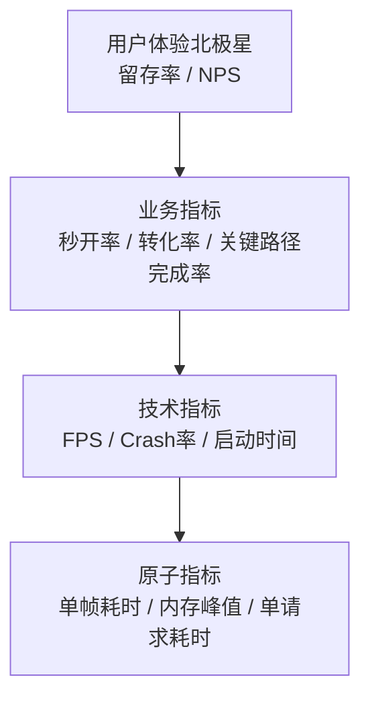
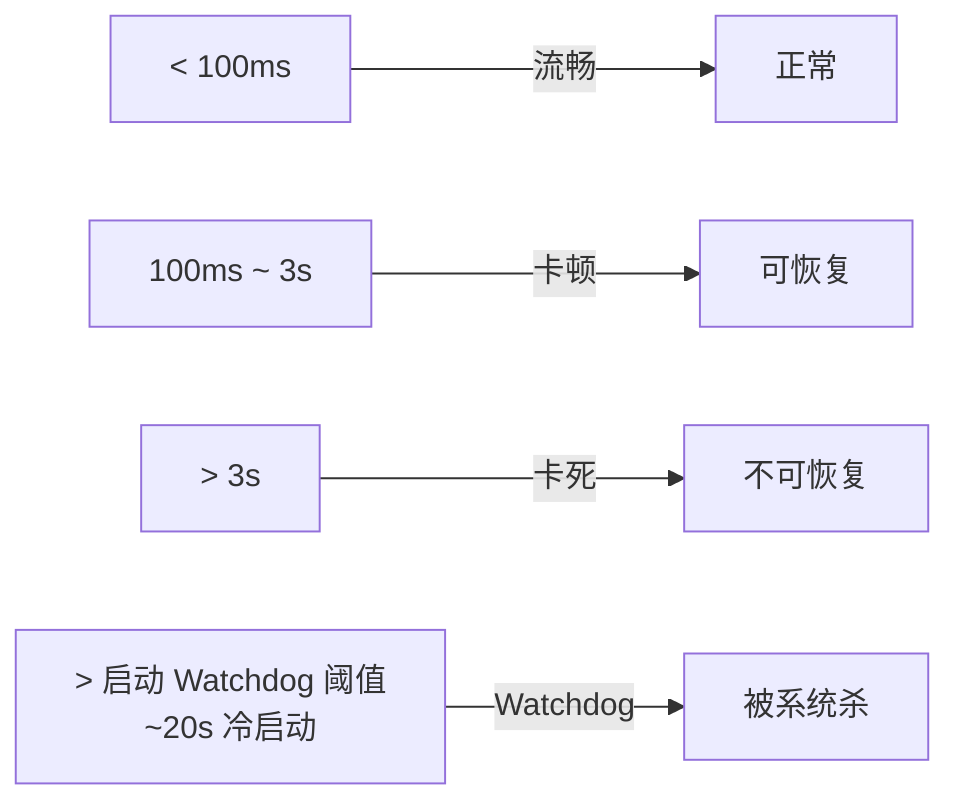
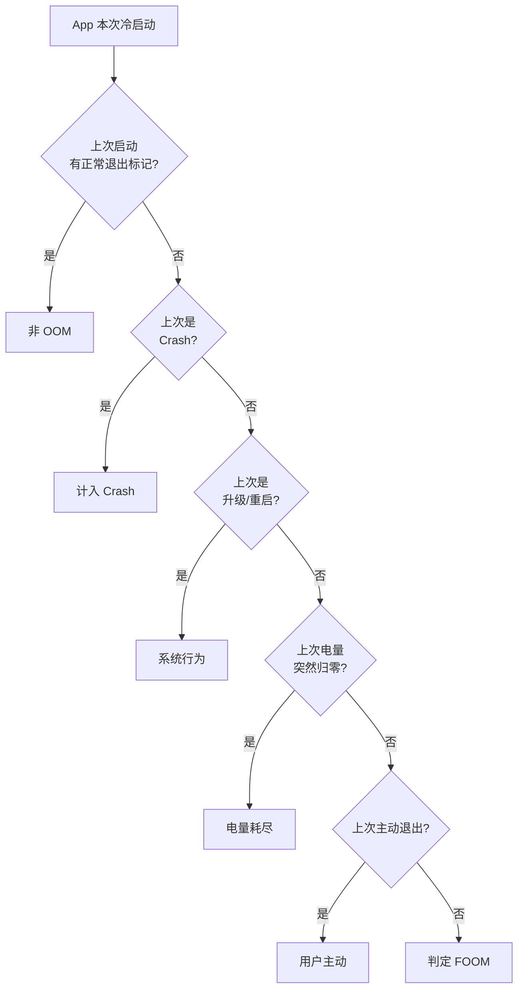
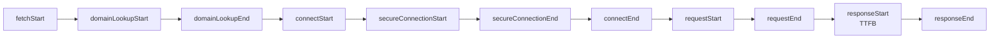
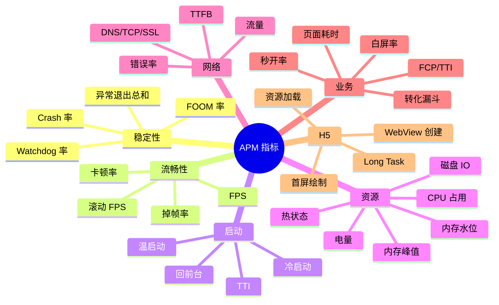

+++
title = "APM-指标体系"
date = '2026-05-07T15:42:48+08:00'
draft = false
weight = 5
tags = ["iOS", "APM", "监控"]
categories = ["iOS开发", "APM"]
+++
APM 的第一步不是写代码，而是**定义指标**。一个 App 的性能好坏不是一句话能说清的，必须把模糊的"快 / 稳 / 省"拆解为可量化、可对比、可报警的数字。本文把业界常用指标按"稳定性 / 流畅性 / 启动 / 资源 / 业务 / 网络"六大族分类，并补充 RUM 的 `Session / View / Action / Resource / Error` 口径，给出每个指标的定义、计算方式、典型目标值与常见陷阱。

---

## 一、指标设计原则

设计指标前先达成共识：

### 1.1 北极星分层



好的指标体系应该：**技术指标能解释业务指标，业务指标能解释北极星**。否则就是"为了采集而采集"。

### 1.2 分位数思维

**永远不要只看平均值**。同一个启动指标：

| 设备 | 平均 | P50 | P90 | P99 |
|-----|-----|-----|-----|-----|
| iPhone 15 | 800ms | 750ms | 900ms | 1200ms |
| iPhone SE 2 | 2000ms | 1500ms | 3500ms | 8000ms |

平均值把两者拉成 1400ms，但 iPhone SE 的 P99 用户"实际等了 8 秒"。APM 的所有耗时指标都必须同时提供 P50 / P90 / P99。

### 1.3 必备维度

每个指标至少能按以下维度切片：

- 设备（机型 / OS / 内存档位）
- 版本（App 版本 / SDK 版本）
- 渠道（App Store / TestFlight / 灰度）
- 网络（WiFi / 4G / 5G / 弱网）
- 地域（国家 / 省份）
- 用户类型（新/老 / 登录/游客）
- 时段（小时 / 工作日-周末）
- 业务（页面 / 模块）

---

## 二、稳定性指标

### 2.1 Crash 率

**定义**：发生 Crash 的用户数 / 活跃用户数（UV 口径）；或 Crash 次数 / 启动次数（PV 口径）。

> 业界默认看 UV 口径——同一用户反复重启碰到同一 Crash 不应被放大计数。

**计算示例**：

```
Crash UV = distinct(crash_user_id)
Active UV = distinct(active_user_id)
Crash Rate = Crash UV / Active UV
```

**典型目标**（大众消费类 App）：

| 级别 | Crash Rate | 备注 |
|-----|-----------|-----|
| 绿灯 | < 0.1% | 头部 App 水平 |
| 黄灯 | 0.1% ~ 0.3% | 需治理 |
| 红灯 | > 0.3% | 严重，需紧急处理 |

**细分类型**（参见 [崩溃-原理]()）：

| 类型 | 信号 | 占比（典型） |
|-----|------|----------|
| Mach 异常 | EXC_BAD_ACCESS、EXC_BAD_INSTRUCTION | 60%+ |
| Unix Signal | SIGSEGV、SIGABRT、SIGBUS | 20% |
| OC 异常 | NSException | 15% |
| C++ 异常 | std::terminate | 5% |

### 2.2 Watchdog 卡死率

**定义**：在启动/回前台/响应系统事件时，App 主线程长时间无响应被系统杀掉（`0x8badf00d`）的比例。



**阈值**（iOS 系统默认）：

| 场景 | Watchdog 阈值 |
|-----|-------------|
| 冷启动（`applicationDidFinishLaunching`） | ~20 秒 |
| 恢复前台（`applicationWillEnterForeground`） | ~10 秒 |
| 进入后台（`applicationDidEnterBackground`） | ~5 秒 |
| 响应系统事件 | ~5 秒 |

**典型目标**：

| 级别 | Watchdog Rate |
|-----|--------------|
| 绿灯 | < 0.05% |
| 黄灯 | 0.05% ~ 0.2% |
| 红灯 | > 0.2% |

**关键点**：Watchdog 的量级通常是普通 Crash 的 2~3 倍，如果你的监控只报 Crash，意味着你漏掉了一半以上稳定性问题。

### 2.3 OOM (FOOM) 率

**定义**：App 被系统因内存占用过高 kill 的比例。由于 iOS 没有给 APM SDK 任何 OOM 信号（进程直接死），通常用**排除法**判定：



标志写入时机：

| 标志 | 写入时机 |
|-----|---------|
| `lastExitNormal` | `applicationWillTerminate` / 主动调用 `exit` |
| `lastCrashed` | Crash handler 内 |
| `lastVersion` | 每次启动 |
| `lastOSVersion` | 每次启动 |
| `lastBatteryLevel` | 每秒采样 |

**典型目标**：

| 级别 | FOOM Rate |
|-----|----------|
| 绿灯 | < 0.1% |
| 黄灯 | 0.1% ~ 0.5% |
| 红灯 | > 0.5% |

**重度用户**（使用时长 > 30min）的 FOOM Rate 通常是平均的 3~5 倍。

### 2.4 异常退出总和（总稳定性）

```
Abnormal Exit Rate = Crash Rate + Watchdog Rate + FOOM Rate
```

这是向管理层汇报的**唯一稳定性指标**。三者分别优化但互相掣肘——比如"用回 AutoreleasePool 缓解内存"有时会增加主线程耗时。

---

## 三、流畅性指标

### 3.1 FPS（Frames Per Second）

**定义**：每秒实际渲染的帧数。iOS 屏幕默认 60Hz，ProMotion 机型 120Hz。

**采集**（CADisplayLink）：

```swift
class FPSMonitor {
    private var link: CADisplayLink?
    private var lastTime: CFTimeInterval = 0
    private var frameCount = 0

    func start() {
        link = CADisplayLink(target: self, selector: #selector(tick(_:)))
        link?.add(to: .main, forMode: .common)
    }

    @objc private func tick(_ link: CADisplayLink) {
        if lastTime == 0 { lastTime = link.timestamp; return }
        frameCount += 1
        let dt = link.timestamp - lastTime
        if dt >= 1 {
            let fps = Double(frameCount) / dt
            frameCount = 0
            lastTime = link.timestamp
            report(fps)
        }
    }
}
```

**120Hz 陷阱**：在 ProMotion 机型上，系统会根据内容自适应降帧到 10/30/60/120Hz。静止页面 FPS=10 是**正常行为，不是卡顿**。APM 必须读取 `UIScreen.main.maximumFramesPerSecond` 做动态阈值，或通过 `preferredFrameRateRange` 显式声明期望。

### 3.2 掉帧率

**定义**：实际帧时长超过目标帧时长的比例。

```
目标帧时长（60Hz） = 1/60 ≈ 16.67ms
目标帧时长（120Hz）= 1/120 ≈ 8.33ms
掉帧 = 当前帧耗时 > 2 × 目标帧时长
```

### 3.3 卡顿率

**定义**：主线程连续耗时超过阈值的次数 / 采样总次数。

**阈值分层**（美团 Hertz / 字节 Slardar 通用）：

| 等级 | 阈值 | 判定条件 |
|-----|------|---------|
| 微卡 | 16.67ms ~ 100ms | 单帧超时 |
| 轻卡 | 100ms ~ 500ms | 用户有感 |
| 重卡 | 500ms ~ 3000ms | 影响操作 |
| 卡死 | > 3000ms | 进入 Watchdog 范畴 |

**上报策略**：

- 微卡：只上报次数统计，不上报堆栈
- 轻卡及以上：上报堆栈 + 线程状态 + 业务页面
- 重卡：必须带全线程堆栈

详细检测方案见 [卡顿-检测]()。

### 3.4 滑动 FPS 与滚动掉帧

列表滚动是卡顿的高发区。应单独采集：

- `UIScrollView.isDragging == true` 期间的 FPS
- `scrollViewDidScroll` 回调中主线程耗时

---

## 四、启动指标

启动指标的定义分歧最大，必须明确你在量什么。

### 4.1 启动阶段划分

```mermaid
gantt
    title iOS 冷启动阶段
    dateFormat X
    axisFormat %Ls

    section Pre-main
    dyld 加载 :0, 300
    Rebase/Bind :300, 100
    Objc init/+load :400, 200
    C++ 静态初始化 :600, 100

    section main → didFinishLaunching
    main 执行 :700, 50
    didFinishLaunching :750, 300

    section didFinishLaunching → 首屏可见
    Window/RootVC 构建 :1050, 150
    首屏 VC viewDidLoad :1200, 100
    首屏数据加载 :1300, 400
    首屏渲染完成 :1700, 100

    section 首屏可见 → 可交互
    异步数据填充 :1800, 300
    TTI 可交互 :2100, 0
```



| 阶段 | 起点 | 终点 | 对应 API |
|-----|------|------|---------|
| T1 Pre-main | 进程创建 | `main()` 入口 | `DYLD_PRINT_STATISTICS` / dyld_stats |
| T2 Main | `main()` | `applicationDidFinishLaunching` 返回 | 埋点 |
| T3 首屏构建 | didFinishLaunching | 首屏第一帧 | CADisplayLink |
| T4 可交互 (TTI) | 首屏第一帧 | 关键按钮可点击 | 业务埋点 |

**启动总时长**：

- 狭义：T1 + T2（= 点击图标到 `didFinishLaunching` 返回）
- 广义：T1 + T2 + T3（= 用户看到首屏）
- 用户视角：T1 + T2 + T3 + T4（= 用户能开始操作）

### 4.2 冷启动 vs 温启动 vs 热启动

| 类型 | 定义 | 典型耗时 |
|-----|-----|---------|
| 冷启动 | 首次启动，无进程缓存 | 1500~3000ms |
| 温启动 | 进程不在、但系统缓存存在 | 500~1000ms |
| 热启动（回前台） | 进程还在 | 100~300ms |

**判定**：

```swift
func launchType() -> LaunchType {
    let now = Date()
    let lastForegroundTime = UserDefaults.standard.object(forKey: "lastFg") as? Date
    if let t = lastForegroundTime, now.timeIntervalSince(t) < 60 * 5 {
        return .hot
    }
    // 冷/温判定：通过 pid 启动时间与 boot 时间对比
    if hasColdLaunchMarker() { return .cold }
    return .warm
}
```

### 4.3 典型目标

参考 [抖音启动优化](#)：最优启动时间 400ms 内。

| 级别 | 冷启动 P90 |
|-----|-----------|
| 绿灯 | < 1500ms |
| 黄灯 | 1500 ~ 3000ms |
| 红灯 | > 3000ms |

详见 [启动优化-观测]()。

---

## 五、资源指标

### 5.1 内存

**三个关键值**：

| 指标 | 含义 | 采集 |
|-----|------|-----|
| 当前占用 | 实时 RSS | `task_info(TASK_VM_INFO)` → `phys_footprint` |
| 峰值 | 本次启动最大 | 轮询取 max |
| 危险阈值 | 触发 OOM 风险 | `os_proc_available_memory()`（iOS 13+） |

**iOS 内存上限**（经验值，实际以机型为准）：

| 机型 | 单进程上限 | Jetsam 压力起点 |
|-----|-----------|--------------|
| 1GB 内存设备 | ~250MB | ~200MB |
| 2GB 内存设备 | ~550MB | ~450MB |
| 3GB 内存设备 | ~850MB | ~700MB |
| 4GB+ 内存设备 | ~1400MB+ | ~1200MB |

**内存水位告警**：

```swift
let footprint = getPhysFootprint()
let available = os_proc_available_memory()
let total = footprint + available
let usage = Double(footprint) / Double(total)

if usage > 0.9 {
    triggerMemoryGraphDump()
} else if usage > 0.8 {
    sendMemoryWarning()
}
```

### 5.2 CPU

**定义**：App 进程所有线程 CPU 占用之和。

**采集**：

```swift
func cpuUsage() -> Double {
    var threadsList: thread_act_array_t?
    var threadsCount = mach_msg_type_number_t(0)
    guard task_threads(mach_task_self_, &threadsList, &threadsCount) == KERN_SUCCESS,
          let threads = threadsList else { return 0 }
    defer {
        vm_deallocate(mach_task_self_, vm_address_t(bitPattern: threads),
                      vm_size_t(threadsCount) * vm_size_t(MemoryLayout<thread_t>.size))
    }

    var total: Double = 0
    for i in 0..<Int(threadsCount) {
        var threadInfo = thread_basic_info()
        var count = mach_msg_type_number_t(THREAD_INFO_MAX)
        let result = withUnsafeMutablePointer(to: &threadInfo) {
            $0.withMemoryRebound(to: integer_t.self, capacity: Int(count)) {
                thread_info(threads[i], UInt32(THREAD_BASIC_INFO), $0, &count)
            }
        }
        if result == KERN_SUCCESS && (threadInfo.flags & TH_FLAGS_IDLE) == 0 {
            total += Double(threadInfo.cpu_usage) / Double(TH_USAGE_SCALE) * 100
        }
    }
    return total
}
```

**典型目标**：

| 场景 | CPU 占用 |
|-----|---------|
| 静止页面 | < 5% |
| 列表滚动 | < 40% |
| 视频播放 | < 60% |
| 动画/游戏 | < 80% |

MetricKit 的 `MXCPUExceptionDiagnostic` 在"3 分钟内 CPU 占用 > 80%" 时自动触发。

### 5.3 磁盘 IO

**关键点**：iOS 对磁盘异常写入有强约束，触发后 `MXDiskWriteExceptionDiagnostic` 上报。阈值：**24 小时内写入 > 1GB**。

**常见异常**：

- 日志疯狂刷盘（应改 ring buffer + 批量 flush）
- 图片缓存从不清理
- DB WAL 没开 auto checkpoint
- SDK 埋点频繁写单行

### 5.4 电量

**定义**：用户感知的电量消耗速度。

**采集**：

1. `UIDevice.current.batteryLevel` 按 1~5% 粒度上报（电量档位变化时）
2. `MXMetricPayload.displayMetrics` 提供屏幕耗电权重
3. `MXAnimationMetric.scrollHitchTimeRatio` 间接反映 GPU 占用

**典型目标**（前台活跃使用 1 小时）：

| 级别 | 电量消耗 |
|-----|---------|
| 绿灯 | < 10% |
| 黄灯 | 10% ~ 20% |
| 红灯 | > 20% |

详见 [耗电-检测]()。

### 5.5 热状态

iOS 提供 `ProcessInfo.processInfo.thermalState`：

| 状态 | 含义 | 策略 |
|-----|-----|-----|
| `.nominal` | 正常 | 全功率 |
| `.fair` | 升温 | 减小 Timer 频率 |
| `.serious` | 过热 | 降帧率 / 暂停视频 |
| `.critical` | 严重过热 | 最小化工作 |

APM 应该同时采集**App 被加诸的热状态**，因为高 CPU 会被系统降频，表现为"慢"但其实是热限制。

---

## 六、网络指标

### 6.1 分段耗时

通过 `URLSessionTaskTransactionMetrics` 拆分：



| 阶段 | 含义 | 典型目标 |
|-----|------|---------|
| DNS | 域名解析 | < 100ms |
| TCP | 三次握手 | < 200ms |
| SSL | TLS 握手 | < 300ms |
| TTFB | 首包 | < 500ms |
| Download | 下行传输 | 业务决定 |

### 6.2 错误率

```
HTTP 错误率 = (4xx + 5xx) / total
网络错误率 = NSURLErrorDomain 数量 / total
```

细分：

- 连接超时 `NSURLErrorTimedOut`
- DNS 解析失败 `NSURLErrorCannotFindHost`
- SSL 失败 `NSURLErrorSecureConnectionFailed`
- 无网络 `NSURLErrorNotConnectedToInternet`

### 6.3 流量

- 上行字节数（Header + Body）
- 下行字节数（Header + Body，注意已解压）
- 按 API / 域名 / 资源类型（API / H5 / CDN / 图片 / 视频）分类

### 6.4 弱网识别

同时采集网络类型（WiFi/4G/5G）与 RTT（`NWPath`），区分"真弱网"与"接口慢"。

---

## 七、业务指标

### 7.1 页面加载耗时

**定义**：从用户点击入口到页面"有效可见"的时间。

**有效可见的判定**：

1. `viewDidAppear` 时间：太早，此时可能还是骨架屏
2. 关键元素出现：在 `rootView` 子树中查找配置的关键 tag
3. 像素稳定：截图对比，连续 2 帧像素一致判定完成

```swift
func startPageTrace(key: String, tag: Int) {
    let start = CACurrentMediaTime()
    let link = CADisplayLink(target: self, selector: #selector(tick))
    link.add(to: .main, forMode: .common)
    records[key] = PageRecord(start: start, tag: tag, link: link)
}

@objc private func tick(_ link: CADisplayLink) {
    for (key, record) in records where findTag(record.tag, in: rootView) {
        let duration = link.timestamp - record.start
        report(page: key, duration: duration)
        record.link.invalidate()
        records.removeValue(forKey: key)
    }
}
```

### 7.2 秒开率

**定义**：

```
1 秒开比 = 加载耗时 ≤ 1s 的 PV / 总 PV
2 秒开比 = 加载耗时 ≤ 2s 的 PV / 总 PV
3 秒开比 = 加载耗时 ≤ 3s 的 PV / 总 PV
```

比单纯看 P90/P99 更直观——产品同学看得懂"80% 用户 1 秒内能看到内容"。

### 7.3 首屏 / FCP / TTI

借鉴 Web 标准：

| 指标 | 定义 | iOS 对应 |
|-----|------|---------|
| FP (First Paint) | 第一个像素 | `viewDidAppear` 首帧 |
| FCP (First Contentful Paint) | 第一个有意义内容 | 关键元素出现 |
| LCP (Largest Contentful Paint) | 最大内容元素 | 主图 / 主列表渲染完 |
| TTI (Time to Interactive) | 可交互 | 关键按钮可响应（主线程空闲 5s 内 < 50ms） |

### 7.4 白屏率

**定义**：页面打开 N 秒后，仍是空白/骨架屏的比例。

**采集**：

1. `viewDidAppear` 后延迟 2s 截图
2. 计算截图像素方差
3. 方差 < 阈值（比如 500）判定白屏

常见原因：网络失败、VC 状态异常、数据为空未处理、WebView 加载失败。

### 7.5 关键路径完成率

**例**：启动 → 首页 → 点击商品 → 下单 → 支付

每一步埋点，计算漏斗转化。APM 不仅看性能，还要把"因为慢/崩 → 用户流失"数据量化。

---

## 八、H5 页面指标

WebView 场景下，需要端侧 SDK 与 H5 页面 JS SDK 联动：

| 指标 | 采集 |
|-----|------|
| WebView 创建耗时 | 客户端埋点 |
| JS 首次执行 | `document.readyState` |
| DOMContentLoaded | `performance.timing` |
| 首屏渲染 | `window.performance.getEntriesByType('paint')` |
| 资源加载 | `PerformanceObserver` |
| Long Task | `PerformanceObserver('longtask')` |

秒开实现要点见 [WebView离线包]()、[WebView底层原理]()。

---

## 九、指标优先级矩阵

```mermaid
quadrantChart
    title 指标采集优先级
    x-axis: 采集难度 低 --> 高
    y-axis: 业务价值 低 --> 高
    quadrant-1: 必做
    quadrant-2: 战略
    quadrant-3: 选做
    quadrant-4: 低 ROI

    Crash率: [0.2, 0.95]
    启动耗时: [0.3, 0.9]
    FPS: [0.25, 0.6]
    网络耗时: [0.4, 0.85]
    页面加载: [0.5, 0.9]
    内存峰值: [0.4, 0.7]
    Watchdog: [0.7, 0.85]
    FOOM: [0.8, 0.9]
    在线MemoryGraph: [0.95, 0.8]
    Coredump: [0.9, 0.75]
    电量: [0.6, 0.4]
    磁盘IO: [0.5, 0.35]
    白屏率: [0.55, 0.7]
    秒开率: [0.4, 0.95]
```

---

## 十、RUM 指标模型

传统 APM 指标容易按技术模块拆散，例如 Crash、启动、网络、卡顿分别在不同页面。RUM 指标模型的作用是把它们重新组织成真实用户链路。

```text
Session
  View
    Action
    Resource
    Error
    LongTask / Freeze
```

| 层级 | 核心指标 | 典型问题 |
|-----|---------|---------|
| Session | Session 数、Crash-free sessions、异常退出率、平均会话时长 | 一次使用是否完整、是否异常结束 |
| View | 页面加载 P90、首屏 P90、白屏率、慢页面率 | 哪些页面慢、哪些页面白屏 |
| Action | 点击响应耗时、关键操作成功率、操作后错误率 | 用户点了以后有没有反应 |
| Resource | 请求总耗时、DNS/TCP/TLS/TTFB、错误率、慢请求率 | 用户侧接口到底慢在哪里 |
| Error | Crash、业务错误、JS 错误、网络错误 | 哪些错误影响真实用户 |
| LongTask / Freeze | 主线程阻塞、帧延迟、卡死率 | 用户是否感知卡住 |

RUM 口径下的指标要尽量带上关联 ID：

```text
session_id
view_id
action_id
resource_id
trace_id
span_id
```

这样 B 端才能从一个慢请求跳回触发它的页面和操作，从一个 Crash 回看崩溃前的用户路径。

---

## 十一、指标速查表


