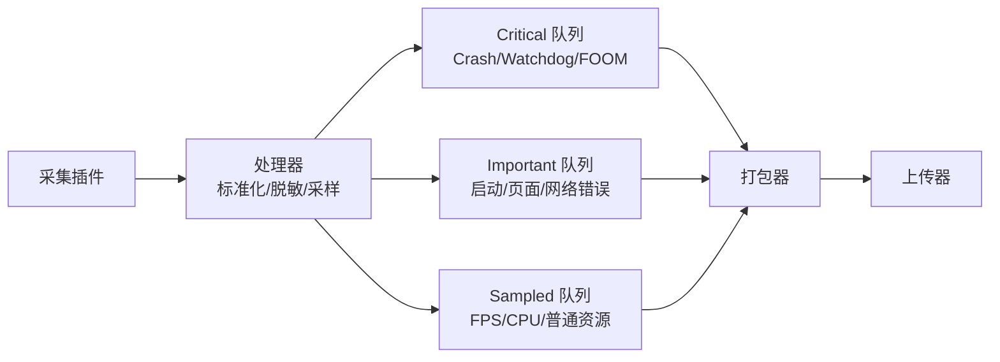

+++
title = "APM-数据模型与上报"
date = '2026-05-07T15:42:48+08:00'
draft = false
weight = 6
tags = ["iOS", "APM", "监控"]
categories = ["iOS开发", "APM"]
+++
APM 的上报系统不只是“把 JSON 发到服务端”。它要解决三件事：**数据如何建模、事件如何关联、移动端如何可靠且低成本地上传**。这一层设计不好，后面的服务端聚合、B 端下钻和告警都会变成补丁工程。

---

## 一、设计目标

数据模型与上报层要同时满足：

| 目标 | 说明 |
|-----|------|
| 可关联 | 页面、操作、网络、错误、性能现场能被 Session 串起来 |
| 可聚合 | 同类问题能按 fingerprint、版本、机型、页面、接口聚合 |
| 可重试 | 弱网、后台、进程退出后数据不轻易丢 |
| 可去重 | 重试不会造成重复统计 |
| 可采样 | 高频数据不会压垮端侧、网络和服务端 |
| 可脱敏 | 敏感数据在端侧就被过滤或掩码 |
| 可演进 | Schema 版本升级后新旧 SDK 可以共存 |

---

## 二、RUM 对象模型

推荐用 RUM 层级组织端侧事件：

```text
Session
  View
    Action
    Resource
    Error
    LongTask / Freeze
    Custom Event
```

| 对象 | 含义 | 示例 |
|-----|------|------|
| Session | 一次用户前台使用会话 | 打开 App 到退后台 |
| View | 一个页面实例 | 首页、详情页、支付页 |
| Action | 一次用户操作 | 点击下单、搜索、提交表单 |
| Resource | 一次资源请求 | HTTP 请求、图片资源、WebView 资源 |
| Error | 一次错误 | Crash、业务错误、网络错误、JS 错误 |
| LongTask / Freeze | 一次长任务或卡顿 | 主线程阻塞 800ms |

RUM 模型的价值是把“点状指标”变成“用户故事”：

```text
用户进入商品详情页
  -> 点击购买
  -> /api/order 请求耗时 3.2s
  -> 主线程阻塞 850ms
  -> 发生 EXC_BAD_ACCESS
```

---

## 三、统一事件 Envelope

所有事件都应该有一层统一 envelope，便于接入层鉴权、校验、路由、去重。

```json
{
  "schema_version": "1.0",
  "event_id": "01HZY2...",
  "event_type": "resource",
  "event_time": 1715000000123,
  "receive_time": null,
  "app": {
    "app_id": "com.example.app",
    "env": "prod",
    "release": "3.2.1",
    "build": "3020100",
    "sdk_version": "2.5.0"
  },
  "device": {
    "model": "iPhone15,2",
    "os": "iOS",
    "os_version": "17.5",
    "network_type": "wifi",
    "region": "CN-SH"
  },
  "identity": {
    "device_id": "anon_xxx",
    "user_id": "hash_xxx"
  },
  "rum": {
    "session_id": "s_123",
    "view_id": "v_456",
    "action_id": "a_789",
    "resource_id": "r_001",
    "trace_id": "t_abc",
    "span_id": "sp_def"
  },
  "payload": {}
}
```

关键点：

1. `event_time` 是端侧时间，`receive_time` 由服务端写入。
2. `event_id` 用于幂等去重，重试时不能变化。
3. `schema_version` 必须保留，SDK 长期会有多个版本共存。
4. `payload` 按事件类型变化，但 envelope 保持稳定。

---

## 四、事件类型

### 4.1 Session 事件

```json
{
  "event_type": "session_start",
  "payload": {
    "start_reason": "cold_launch",
    "foreground": true,
    "prewarm": false
  }
}
```

```json
{
  "event_type": "session_end",
  "payload": {
    "duration_ms": 180000,
    "end_reason": "background",
    "crashed": false,
    "foom_suspected": false
  }
}
```

### 4.2 View 事件

```json
{
  "event_type": "view",
  "payload": {
    "name": "ProductDetail",
    "phase": "appear",
    "load_duration_ms": 620,
    "first_contentful_ms": 480,
    "interactive_ms": 760,
    "blank": false
  }
}
```

### 4.3 Resource 事件

```json
{
  "event_type": "resource",
  "payload": {
    "method": "POST",
    "url_template": "/api/order",
    "host": "api.example.com",
    "status_code": 500,
    "error_code": "server_error",
    "duration_ms": 3200,
    "dns_ms": 20,
    "tcp_ms": 45,
    "tls_ms": 60,
    "ttfb_ms": 2100,
    "download_ms": 900,
    "request_bytes": 800,
    "response_bytes": 2048
  }
}
```

URL 必须模板化，禁止直接上报完整 query：

```text
错误：/api/user?id=13800138000&token=abc
正确：/api/user/{id}
```

### 4.4 Error 事件

```json
{
  "event_type": "error",
  "payload": {
    "error_type": "crash",
    "name": "EXC_BAD_ACCESS",
    "reason": "KERN_INVALID_ADDRESS",
    "fatal": true,
    "fingerprint": "crash_fp_xxx",
    "threads": [],
    "images": []
  }
}
```

Crash payload 只需要带最小必要现场。符号化、聚类和归因放到服务端。

### 4.5 LongTask / Freeze 事件

```json
{
  "event_type": "long_task",
  "payload": {
    "duration_ms": 850,
    "thread": "main",
    "frame_delay_ratio": 0.99,
    "sample_count": 3,
    "top_frames": [
      "ProductViewController.render",
      "UIImage.decode"
    ]
  }
}
```

---

## 五、本地队列设计

移动端上报一定会遇到弱网、后台、进程被杀、磁盘紧张，所以必须先落盘再上传。



队列策略：

| 队列 | 可靠性 | 容量 | 上传 |
|-----|--------|------|------|
| Critical | 最高，必要时同步落盘 | 小而稳 | 下次启动优先 |
| Important | 中高，异步 WAL | 中等 | 定时、后台、网络可用 |
| Sampled | 可丢弃 | 严格上限 | 低频批量 |

数据包要带：

```text
package_id
schema_version
created_at
event_count
compressed
encrypted
checksum
retry_count
expire_at
```

---

## 六、Crash 现场写入

Crash handler 里不能走完整上报流程。正确策略是：

1. handler 中只写最小现场。
2. 使用预分配 buffer。
3. 使用 async-signal-safe 函数。
4. 下次启动后再转换成标准事件并上报。

```c
void crash_handler(int sig, siginfo_t *info, void *ucontext) {
    static char buffer[65536];
    int fd = open("/path/to/apm_crash.log", O_WRONLY | O_CREAT | O_TRUNC, 0644);

    write_header(fd, buffer, sig, info);
    write_thread_states(fd);
    write_backtraces(fd);
    write_image_infos(fd);

    fsync(fd);
    close(fd);
    raise(sig);
}
```

禁止在 handler 中：

| 禁止操作 | 原因 |
|---------|------|
| `malloc` | 可能锁死或堆已损坏 |
| Objective-C/Swift 调用 | 运行时状态不可靠 |
| `NSLog` | 非 async-signal-safe |
| 网络请求 | 链路长，极易二次崩溃 |
| 符号化 | 依赖复杂库和内存分配 |

---

## 七、采样策略

采样要同时考虑数据价值和成本。

推荐规则：

| 数据 | 策略 |
|-----|------|
| Crash / Watchdog / FOOM | 全量或接近全量 |
| 网络错误 / 慢请求 | 高采样，严重错误全量 |
| 普通成功请求 | 低采样 |
| 页面性能 | 核心页面高采样，普通页面低采样 |
| FPS / CPU 时序 | 低采样、短窗口 |
| MemoryGraph / Coredump | 触发式、灰度、小比例 |

稳定采样要按用户或设备 hash，而不是每条事件随机：

```text
sample_key = hash(device_id + metric_key + date)
sampled = sample_key < rate
```

这样同一个用户在一个采样周期内链路完整，不会出现页面采到了、网络没采到、错误又没采到的断裂。

---

## 八、上传协议

上传请求建议：

```http
POST /v1/rum/batch HTTP/1.1
Content-Type: application/x-protobuf
Content-Encoding: gzip
X-APM-App-Id: com.example.app
X-APM-SDK-Version: 2.5.0
X-APM-Schema-Version: 1.0
X-APM-Package-Id: pkg_123
X-APM-Signature: hmac_sha256(...)
```

服务端响应：

```json
{
  "accepted": true,
  "server_time": 1715000009999,
  "retry_after_seconds": null,
  "config_version": "cfg_20260506_01",
  "sampling_overrides": {
    "network": 0.05,
    "fps": 0.01
  },
  "disabled_plugins": []
}
```

响应里可以带轻量配置，但完整配置建议走独立配置接口，避免上传链路变复杂。

---

## 九、重试与幂等

客户端重试策略：

```text
首次失败 -> 5s + jitter
二次失败 -> 30s + jitter
三次失败 -> 2min + jitter
继续失败 -> 指数退避，上限 1h
```

服务端幂等键：

```text
event_id
package_id + event_offset
```

丢弃策略：

| 场景 | 行为 |
|-----|------|
| 4xx schema 错误 | 不重试，记录 SDK health |
| 401/403 | 停止上传并刷新配置 |
| 413 包太大 | 拆包，降低 batch size |
| 429 限流 | 按 `Retry-After` 等待 |
| 5xx | 指数退避重试 |
| 磁盘超限 | Sampled 优先丢弃，Critical 保留 |

---

## 十、隐私脱敏

脱敏要在三个位置做：

```text
业务接入 API 入口
  -> SDK Event Processor
  -> 服务端清洗层
```

默认规则：

| 字段 | 策略 |
|-----|------|
| `Authorization` / `Cookie` / `Set-Cookie` | 删除 |
| 手机号、邮箱、身份证 | 掩码或 hash |
| URL query | 默认删除，只允许白名单 |
| request/response body | 默认不采 |
| 用户输入 | 默认不采 |
| 精确经纬度 | 默认不采，必要时栅格化 |

业务自定义属性采用白名单：

```swift
APM.track("order_submit", attributes: [
    "order_type": "normal",
    "payment_method": "wechat"
])
```

不要允许业务随意上报任意字典。

---

## 十一、Schema 演进

Schema 必须向前兼容。

建议：

1. envelope 字段稳定，payload 可按事件类型扩展。
2. 新字段只能增加，删除字段要经历废弃期。
3. 服务端按 `schema_version` 分支解析。
4. SDK 上报未知字段时服务端要能忽略。
5. B 端查询基于语义字段，不直接绑定原始 JSON 路径。

版本策略：

```text
1.0 -> 增加字段：兼容
1.1 -> 增加事件类型：兼容
2.0 -> 改变字段含义：需要双写、迁移、灰度
```

---

## 十二、总结

数据模型与上报层的核心判断：

```text
不是所有数据都值得上报
不是所有上报都值得全量
不是所有事件都应该孤立存储
```

用 RUM 模型串联体验，用分级队列保证可靠性，用稳定采样控制成本，用统一 envelope 支撑长期演进。这一层设计稳了，服务端和 B 端才有继续扩展的空间。
