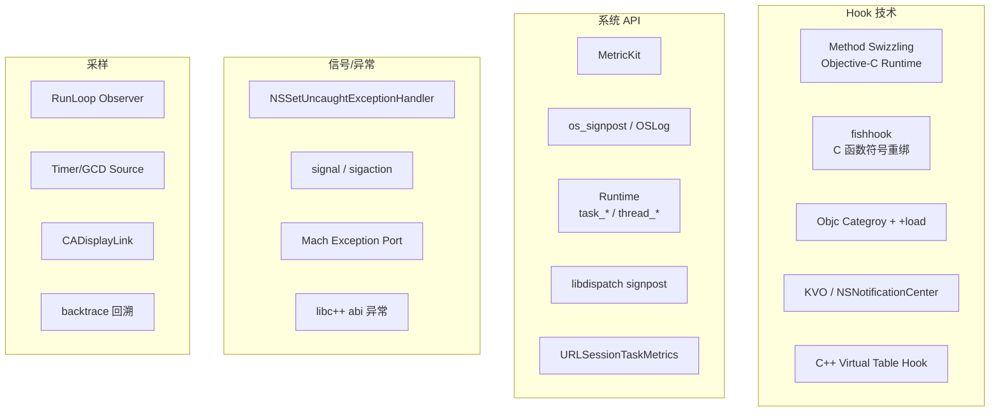
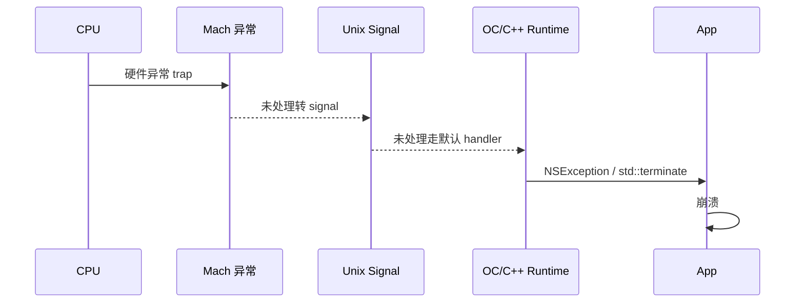
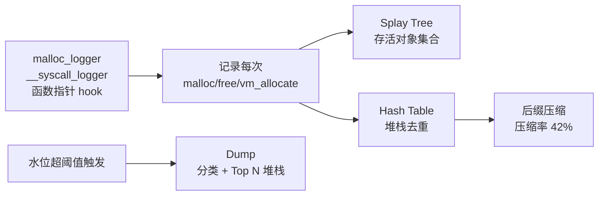

+++
title = "APM-数据采集"
date = '2026-05-02T22:32:27+08:00'
draft = false
weight = 7
tags = ["iOS", "APM", "监控"]
categories = ["iOS开发", "APM"]
+++
本文聚焦 iOS APM SDK 的**采集层**，把 `APM-指标体系` 定义好的指标落地到具体代码与底层原理。按照采集对象分八个模块展开：崩溃、卡死、内存/OOM、FPS 卡顿、启动、网络、CPU/磁盘、业务。

> 原理深度与相关文章联动：本文给出整体采集设计与关键代码；单项（如 Mach 异常、Signal、MemoryGraph 等）的纯原理细节在"崩溃/卡顿/启动/耗电"系列中已有深入剖析，本篇通过链接形式串联，避免重复。

---

## 一、采集技术图谱



---

## 二、崩溃采集

> 原理文章：[崩溃-原理]() · [崩溃-Mach异常]() · [崩溃-信号处理]() · [崩溃-采集]()

本节只给出 APM SDK 集成视角的关键点。

### 2.1 三道防线

iOS Crash 由三层异常处理体系捕获，APM 必须同时注册：



**优先级**：

1. **Mach 异常端口**（最底层、最完整）
2. **Unix Signal**（兜底）
3. **NSException/C++ handler**（高层语言异常）

三者不互斥而是互补：Mach 捕获内存错误最精准，Signal 捕获 Abort/Trap，NSException 捕获 OC 抛出的异常调用栈。

### 2.2 Mach 异常端口注册要点

```c
mach_port_t exception_port;
mach_port_allocate(mach_task_self(), MACH_PORT_RIGHT_RECEIVE, &exception_port);
mach_port_insert_right(mach_task_self(), exception_port, exception_port, MACH_MSG_TYPE_MAKE_SEND);

task_set_exception_ports(
    mach_task_self(),
    EXC_MASK_BAD_ACCESS | EXC_MASK_BAD_INSTRUCTION | EXC_MASK_ARITHMETIC
        | EXC_MASK_SOFTWARE | EXC_MASK_BREAKPOINT,
    exception_port,
    EXCEPTION_DEFAULT | MACH_EXCEPTION_CODES,
    MACHINE_THREAD_STATE
);

pthread_t thread;
pthread_create(&thread, NULL, exception_server_thread, NULL);
```

**关键陷阱**：

- 异常线程自己不能再崩溃（栈溢出要独立大栈）
- `task_set_exception_ports` 会"抢占"上一个注册者（如 Bugly、Sentry），APM 必须保存旧端口并在自己处理完后转发，避免破坏其他 SDK
- Release 包无 Xcode 调试器时才生效

### 2.3 Signal 注册

```c
struct sigaction sa;
sa.sa_sigaction = signal_handler;
sa.sa_flags = SA_SIGINFO | SA_ONSTACK;
sigemptyset(&sa.sa_mask);

int signals[] = {SIGABRT, SIGSEGV, SIGBUS, SIGILL, SIGFPE, SIGPIPE, SIGTRAP};
for (int i = 0; i < 7; i++) sigaction(signals[i], &sa, NULL);

stack_t altstack = {0};
altstack.ss_size = SIGSTKSZ * 2;
altstack.ss_sp = malloc(altstack.ss_size);
sigaltstack(&altstack, NULL);
```

**SA_ONSTACK + sigaltstack** 必须要加——栈溢出导致的 SIGSEGV 发生时主栈已不可用，必须切到预留信号栈才能回溯。

### 2.4 异步安全

Signal handler 中只能调用 **async-signal-safe** 函数。常见错误：

| ❌ 不安全 | ✅ 替代 |
|---------|--------|
| `printf`/`NSLog` | `write(STDERR_FILENO, ...)` |
| `malloc` | 预分配内存 |
| `NSString` | C 字符串 |
| `@synchronized` | 无锁写入 |
| `objc_msgSend` | 直接 C 函数 |

### 2.5 崩溃现场落盘

最小崩溃包结构（二进制格式，一次 `write()`）：

```
┌──────────────────────────────┐
│ Header (magic, version, 时间) │
├──────────────────────────────┤
│ 异常信息 (type, code, pc)     │
├──────────────────────────────┤
│ 寄存器 (所有线程 x0~x30, sp)  │
├──────────────────────────────┤
│ 各线程栈帧 (PC 列表)          │
├──────────────────────────────┤
│ 加载的二进制 (UUID + slide)   │
├──────────────────────────────┤
│ 应用信息 (版本、业务 Tag)      │
└──────────────────────────────┘
```

下次启动时读取、符号化、上报、删除。

### 2.6 高级归因：Zombie + Coredump

详见字节 APM 团队分享（在 `APM-业界方案` 会详细展开）：

- **Zombie**：hook `NSObject.dealloc`，不释放内存，把 isa 指向特殊僵尸类，下次 objc_msgSend 必崩，带来野指针对象类名
- **Coredump**：崩溃时 dump 全部线程寄存器、栈内存、堆内存（只 dump 主要 VM region），服务端用 lldb 调试

这两项是普通 Crash 不能归因时的"核武器"。

---

## 三、卡死监控

> 原理文章：[卡顿-原理]() · [卡顿-检测]()

卡顿与卡死技术同源但采集策略不同：**卡顿关心频次+堆栈，卡死关心能否捕获最后一秒**。

### 3.1 RunLoop Observer + 子线程 Ping

```swift
class HangDetector {
    private var activity: CFRunLoopActivity = .entry
    private var semaphore = DispatchSemaphore(value: 0)
    private let threshold: TimeInterval = 3.0

    func start() {
        let observer = CFRunLoopObserverCreateWithHandler(
            kCFAllocatorDefault, CFRunLoopActivity.allActivities.rawValue, true, 0
        ) { [weak self] _, activity in
            self?.activity = activity
            self?.semaphore.signal()
        }
        CFRunLoopAddObserver(CFRunLoopGetMain(), observer, .commonModes)

        DispatchQueue.global(qos: .utility).async { [weak self] in
            self?.loop()
        }
    }

    private func loop() {
        while true {
            let result = semaphore.wait(timeout: .now() + threshold)
            if result == .timedOut {
                if activity == .beforeSources || activity == .afterWaiting {
                    captureMainThreadStack()
                }
            }
        }
    }
}
```

### 3.2 字节 Slardar 改进：多次采样 + 线程状态

> 单次抓栈可能抓到"真凶之后"的帧，造成误报。

```mermaid
gantt
    title 主线程卡死期间的多次采样
    dateFormat X
    axisFormat %Ls

    section 耗时阶段
    阶段1 busy1: 0, 500
    阶段2 busy2: 500, 800
    阶段3 busy3: 1300, 1500

    section 子线程采样
    采样1 :milestone, 1000, 0
    采样2 :milestone, 2000, 0
    采样3 :milestone, 3000, 0
```



改进方案：

1. 检测到主线程阻塞 > 1s 后，每 500ms 抓一次主线程栈
2. 抓栈同时记录主线程**状态**（CPU 占用、Thread State、Thread Flags）
3. 卡死触发时（> 8s）把 N 次采样一起上报
4. 服务端对比"哪个阶段耗时最长"定位真凶

### 3.3 堆栈回溯

```c
void backtrace_thread(thread_t thread, uintptr_t *buffer, int max_depth) {
    _STRUCT_MCONTEXT ctx;
    mach_msg_type_number_t count = ARM_THREAD_STATE64_COUNT;
    thread_get_state(thread, ARM_THREAD_STATE64, (thread_state_t)&ctx.__ss, &count);

    int i = 0;
    uintptr_t fp = ctx.__ss.__fp;
    uintptr_t pc = ctx.__ss.__pc;
    buffer[i++] = pc;

    while (fp && i < max_depth) {
        uintptr_t saved_lr = *((uintptr_t *)(fp + 8));
        uintptr_t saved_fp = *((uintptr_t *)fp);
        buffer[i++] = saved_lr;
        fp = saved_fp;
    }
}
```

**注意**：

- arm64 下栈帧是 `[prev_fp, saved_lr]` 两个 8 字节
- 抓其他线程栈前要先 `thread_suspend`，抓完立刻 `thread_resume`，时间越短越好
- 主线程自抓不用 suspend

### 3.4 死锁检测（微信 Matrix / 字节 Slardar）

对所有处于 `TH_STATE_WAITING` 的线程：

1. 读取线程 PC 寄存器
2. 符号化，判断是否是锁等待函数（`pthread_mutex_lock`, `psynch_mutexwait`, `pthread_rwlock_rdlock`, `_dispatch_barrier_sync_f_slow` 等）
3. 解析参数寄存器，拿到锁所有者 tid
4. 所有边组成有向图，DFS 找环 → 死锁

---

## 四、内存 / OOM 监控

> 相关文章：[崩溃-治理]() · [JetsamEvent日志解读]()

### 4.1 内存水位采集

```swift
import Foundation

func physFootprint() -> UInt64 {
    var info = task_vm_info_data_t()
    var count = mach_msg_type_number_t(MemoryLayout<task_vm_info_data_t>.size / MemoryLayout<natural_t>.size)
    let result = withUnsafeMutablePointer(to: &info) {
        $0.withMemoryRebound(to: integer_t.self, capacity: Int(count)) {
            task_info(mach_task_self_, task_flavor_t(TASK_VM_INFO), $0, &count)
        }
    }
    return result == KERN_SUCCESS ? info.phys_footprint : 0
}

@available(iOS 13.0, *)
func availableMemory() -> UInt64 {
    return UInt64(os_proc_available_memory())
}
```

**为什么用 `phys_footprint` 而不是 `resident_size`**：
- `resident_size` 是 RSS，不包含被压缩的内存
- `phys_footprint` 是 Apple 真正用来判定 Jetsam 的值
- 两者差距可达 2~3 倍

### 4.2 FOOM 判定

完整标志写入逻辑：

```swift
class FOOMDetector {
    struct LastState: Codable {
        var appVersion: String
        var osVersion: String
        var deviceModel: String
        var isForeground: Bool
        var didCrash: Bool
        var didExitNormally: Bool
        var batteryLevel: Float
        var memoryPressure: Int
        var timestamp: TimeInterval
    }

    static func check() -> Bool {
        guard let last = load() else { save(); return false }
        let curr = current()

        if last.didCrash { return false }
        if last.didExitNormally { return false }
        if last.appVersion != curr.appVersion { return false }
        if last.osVersion != curr.osVersion { return false }
        if last.batteryLevel < 0.02 { return false }

        if last.isForeground && !last.didCrash && !last.didExitNormally {
            reportFOOM(last: last)
            return true
        }
        return false
    }
}
```

注册的标志更新点：

```swift
NotificationCenter.default.addObserver(forName: UIApplication.willTerminateNotification, object: nil, queue: .main) { _ in
    var s = LastState.load()
    s?.didExitNormally = true
    LastState.save(s)
}

NSSetUncaughtExceptionHandler { _ in
    var s = LastState.load()
    s?.didCrash = true
    LastState.save(s)
}

Timer.scheduledTimer(withTimeInterval: 1, repeats: true) { _ in
    var s = LastState.load()
    s?.isForeground = UIApplication.shared.applicationState == .active
    s?.batteryLevel = UIDevice.current.batteryLevel
    s?.timestamp = Date().timeIntervalSince1970
    LastState.save(s)
}
```

### 4.3 在线 MemoryGraph

微信 Matrix / 字节 Slardar 的 `WCMemoryStat` 核心原理：



**关键点**：

- hook `malloc_logger`/`__syscall_logger` 函数指针，不是 hook `malloc` 本身（开销低 10 倍）
- 每个对象保存：大小、Category（通过 vm region type）、分配堆栈 id
- 伸展树选择：插入/删除 O(logN)，最近访问接近 O(1)，比红黑树内存小
- 在 iPhone 6 Plus 上实测 CPU 占用约 13%（因此只在调试 + 灰度打开）

### 4.4 MetricKit 接入（最低成本）

```swift
import MetricKit

class APMMetricSubscriber: NSObject, MXMetricManagerSubscriber {
    func didReceive(_ payloads: [MXMetricPayload]) {
        for payload in payloads {
            uploadMetric(payload.jsonRepresentation())
        }
    }

    @available(iOS 14.0, *)
    func didReceive(_ payloads: [MXDiagnosticPayload]) {
        for payload in payloads {
            payload.cpuExceptionDiagnostics?.forEach { upload($0) }
            payload.hangDiagnostics?.forEach { upload($0) }
            payload.diskWriteExceptionDiagnostics?.forEach { upload($0) }
            payload.crashDiagnostics?.forEach { upload($0) }
        }
    }
}

MXMetricManager.shared.add(APMMetricSubscriber())
```

**MetricKit 局限**：

1. 数据延迟 24 小时（iOS 15 起 Diagnostic 即时上报）
2. 按天聚合，粒度粗
3. 无业务上下文（当前页面、用户路径）

**推荐做法**：用 MetricKit 打底，自研 SDK 做现场采集与业务关联。

---

## 五、FPS 与卡顿采集

> 详见 [卡顿-检测]()。

要点：

1. **FPS**：CADisplayLink，在 ProMotion 机型设置 `preferredFrameRateRange = .init(minimum: 30, maximum: 120, preferred: 120)`，计算 FPS 时按设备 `maximumFramesPerSecond` 归一化
2. **卡顿检测**：RunLoop Observer 监控 `beforeSources` 到 `beforeWaiting` 的耗时
3. **卡顿阈值自适应**：根据机型内存档位动态调整（低端机阈值可放宽到 200ms）
4. **退火（微信 Matrix）**：相同堆栈连续出现时，按斐波那契数列拉长采样间隔

---

## 六、启动采集

> 详见 [启动优化-观测]()。

### 6.1 Pre-main 阶段

获取进程启动时间：

```swift
func processStartTime() -> TimeInterval {
    var kinfo = kinfo_proc()
    var size = MemoryLayout<kinfo_proc>.stride
    var mib: [Int32] = [CTL_KERN, KERN_PROC, KERN_PROC_PID, getpid()]
    sysctl(&mib, 4, &kinfo, &size, nil, 0)
    let sec = kinfo.kp_proc.p_un.__p_starttime.tv_sec
    let usec = kinfo.kp_proc.p_un.__p_starttime.tv_usec
    return TimeInterval(sec) + TimeInterval(usec) / 1_000_000
}

let preMainDuration = CACurrentMediaTime() - processStartTime()
```

**注意**：`CACurrentMediaTime()` 是 mach_absolute_time，时间基准与 kp_proc 的 tv_sec 不一致。正确做法是在 `main()` 入口立即 `gettimeofday()`，再减去 `kp_proc.p_un.__p_starttime`。

### 6.2 主线程阶段埋点

利用 `+load` 最早时机：

```objc
__attribute__((constructor))
static void app_premain_start(void) {
    APMLaunchTracker.mainStart = CACurrentMediaTime();
}
```

或 OC `+load`：

```objc
@implementation APMLaunchTracker
+ (void)load {
    self.loadBegin = CACurrentMediaTime();
}
@end
```

### 6.3 首屏渲染完成

```swift
class FirstRenderDetector {
    private var link: CADisplayLink?
    private var frameCount = 0

    func start() {
        link = CADisplayLink(target: self, selector: #selector(tick))
        link?.add(to: .main, forMode: .common)
    }

    @objc private func tick() {
        frameCount += 1
        if frameCount >= 3 && isKeyElementVisible() {
            let duration = CACurrentMediaTime() - launchStart
            report(launchDuration: duration)
            link?.invalidate()
        }
    }
}
```

---

## 七、网络采集

### 7.1 NSURLProtocol 拦截

**能拦截**：`NSURLSession`/`NSURLConnection`/基于它们的 AFNetworking、Alamofire

**不能拦截**：WKWebView（独立进程）

```swift
class APMURLProtocol: URLProtocol {
    override class func canInit(with request: URLRequest) -> Bool {
        if URLProtocol.property(forKey: "APMHandled", in: request) != nil { return false }
        return request.url?.scheme?.hasPrefix("http") ?? false
    }

    override class func canonicalRequest(for request: URLRequest) -> URLRequest {
        return request
    }

    override func startLoading() {
        startTime = CACurrentMediaTime()
        let mutable = (request as NSURLRequest).mutableCopy() as! NSMutableURLRequest
        URLProtocol.setProperty(true, forKey: "APMHandled", in: mutable)
        session = URLSession(configuration: .default, delegate: self, delegateQueue: nil)
        task = session?.dataTask(with: mutable as URLRequest)
        task?.resume()
    }

    override func stopLoading() {
        task?.cancel()
    }
}
URLProtocol.registerClass(APMURLProtocol.self)
```

**坑**：

1. 业务层如果用了自定义 `URLSessionConfiguration`，必须把 `APMURLProtocol` 加入 `protocolClasses`
2. 重复拦截：用 `setProperty(true, forKey: ...)` 标记防止死循环
3. 流量统计问题：`HTTPBody` 对流式上传无法直接取到长度，需用 `InputStream` 镜像
4. 已解压数据：NSData 给的是解压后，不能反映真实流量，要在 `didReceive` 按 `Content-Length` 采集

### 7.2 URLSessionTaskDelegate 采集分段耗时（推荐）

```swift
class APMSessionDelegate: NSObject, URLSessionTaskDelegate {
    func urlSession(_ session: URLSession, task: URLSessionTask,
                    didFinishCollecting metrics: URLSessionTaskMetrics) {
        for t in metrics.transactionMetrics {
            let dns = t.domainLookupEndDate?.timeIntervalSince(t.domainLookupStartDate ?? Date()) ?? 0
            let tcp = t.connectEndDate?.timeIntervalSince(t.connectStartDate ?? Date()) ?? 0
            let ssl = t.secureConnectionEndDate?.timeIntervalSince(t.secureConnectionStartDate ?? Date()) ?? 0
            let ttfb = t.responseStartDate?.timeIntervalSince(t.requestStartDate ?? Date()) ?? 0
            let total = t.responseEndDate?.timeIntervalSince(t.fetchStartDate ?? Date()) ?? 0
            report(TaskMetrics(url: task.originalRequest?.url, dns: dns, tcp: tcp, ssl: ssl, ttfb: ttfb, total: total))
        }
    }
}
```

**优点**：iOS 10+ 官方 API，无需 swizzle，零侵入。

**缺点**：不能拦截请求内容（加 Header、重定向等），只能观测。

### 7.3 AFNetworking/Alamofire 专用 hook

这些框架基于 `URLSession`，直接用 URLSessionTaskDelegate 方式即可；如果业务用的是自定义 Session，需要用 swizzle 替换 `[URLSession dataTaskWithRequest:]` 插入自己的 delegate。

### 7.4 WKWebView 网络监控

WKWebView 走独立进程 WebContent，不走 App 的 NSURLSession，NSURLProtocol 无效。方案：

1. **注入 JS SDK**：`WKUserContentController.addUserScript`，在页面加载前注入 `PerformanceObserver`
2. **`WKWebView` API**：`WKNavigationDelegate` 可以看到导航时间点（不够细）
3. **自建 URLSchemeHandler**：拦截自定义协议，仅适合离线包场景

```swift
let script = """
(function() {
    const po = new PerformanceObserver((list) => {
        for (const entry of list.getEntries()) {
            window.webkit.messageHandlers.apm.postMessage({
                name: entry.name,
                duration: entry.duration,
                startTime: entry.startTime,
                type: entry.entryType
            });
        }
    });
    po.observe({ entryTypes: ['resource', 'navigation', 'paint', 'longtask'] });
})();
"""
let userScript = WKUserScript(source: script, injectionTime: .atDocumentStart, forMainFrameOnly: false)
webView.configuration.userContentController.addUserScript(userScript)
webView.configuration.userContentController.add(handler, name: "apm")
```

---

## 八、CPU / 磁盘采集

### 8.1 单线程 CPU 占用

```swift
func threadCPU(_ thread: thread_t) -> Double {
    var info = thread_basic_info()
    var count = mach_msg_type_number_t(THREAD_BASIC_INFO_COUNT)
    let result = withUnsafeMutablePointer(to: &info) {
        $0.withMemoryRebound(to: integer_t.self, capacity: Int(count)) {
            thread_info(thread, thread_flavor_t(THREAD_BASIC_INFO), $0, &count)
        }
    }
    guard result == KERN_SUCCESS else { return 0 }
    return Double(info.cpu_usage) / Double(TH_USAGE_SCALE)
}
```

### 8.2 CPU 异常

两种方式互补：

1. **MetricKit `MXCPUExceptionDiagnostic`**：系统触发，包含 `callStackTree`、`totalCPUTime`、`totalSampledTime`
2. **主动窗口扫描**：1 分钟采样 60 次，若平均 CPU > 80% 则抓栈

### 8.3 磁盘 IO

**推荐使用 MetricKit**：

```swift
func didReceive(_ payloads: [MXMetricPayload]) {
    for p in payloads {
        let diskMetrics = p.diskIOMetrics
        upload(cumulativeLogicalWrites: diskMetrics?.cumulativeLogicalWrites)
    }
}
```

超过阈值时 `MXDiskWriteExceptionDiagnostic` 自动触发。

**自采集**（较重）：

- hook `write`/`pwrite`/`writev`/`open` 等 syscall
- 结合 dtrace-like 的 endpoint security 框架（macOS only）

建议线上只用 MetricKit，本地调试再用 hook。

---

## 九、业务采集

### 9.1 页面生命周期

通过 swizzle `UIViewController` 的 `viewDidLoad`/`viewWillAppear`/`viewDidAppear`/`viewWillDisappear` 自动埋点：

```swift
extension UIViewController {
    @objc func apm_viewDidAppear(_ animated: Bool) {
        self.apm_viewDidAppear(animated)
        let name = String(describing: type(of: self))
        APMPageTracer.shared.pageAppear(name: name, vc: self)
    }

    static let swizzleOnce: Void = {
        let orig = class_getInstanceMethod(UIViewController.self, #selector(viewDidAppear(_:)))!
        let new = class_getInstanceMethod(UIViewController.self, #selector(apm_viewDidAppear(_:)))!
        method_exchangeImplementations(orig, new)
    }()
}
```

### 9.2 首屏可见检测

两种策略：

**A. 配置化关键元素**：

```json
{
    "HomeViewController": {
        "tag": 1001,
        "maxWaitMs": 3000
    }
}
```

**B. 像素稳定性**：

```swift
func checkRenderStable(view: UIView) -> Bool {
    let current = view.snapshotPixelHash()
    defer { lastSnapshot = current }
    return current == lastSnapshot
}
```

### 9.3 业务打点 API

给业务方提供简单 API：

```swift
APMTracker.beginTrace(name: "order.pay")
// ...业务代码...
APMTracker.endTrace(name: "order.pay", attributes: ["amount": 99])
```

内部用 `os_signpost` 记录，方便与 Instruments 联动：

```swift
let signposter = OSSignposter(subsystem: "com.app.apm", category: "trace")
let state = signposter.beginInterval("order.pay")
// ...
signposter.endInterval("order.pay", state)
```

---

## 十、采集通用基础设施

### 10.1 符号化

SDK 上报原始地址，符号化在服务端做：

1. 客户端记录每个二进制的 `UUID + slide`（通过 `_dyld_image_count` 和 `_dyld_get_image_header`）
2. 服务端用 `atos` 或 `llvm-symbolizer` 结合 dSYM 符号化
3. 系统库符号预先按 iOS 版本导入

```swift
func imageInfos() -> [ImageInfo] {
    var result: [ImageInfo] = []
    let count = _dyld_image_count()
    for i in 0..<count {
        guard let header = _dyld_get_image_header(i),
              let name = _dyld_get_image_name(i) else { continue }
        let slide = _dyld_get_image_vmaddr_slide(i)
        let uuid = header.uuid // 从 LC_UUID 读
        result.append(ImageInfo(name: String(cString: name), slide: slide, uuid: uuid))
    }
    return result
}
```

### 10.2 低开销日志

高频采集场景（每帧、每次请求）：

- 写入 mmap 文件，避免 open/write syscall
- 使用 ring buffer，超额覆盖最老数据
- 序列化用 protobuf 或 flatbuffers，不用 JSON

### 10.3 防回环

APM SDK 自身也会：

- 发网络请求（上报） → 不能被网络监控再统计
- 写文件（落盘） → 不能被磁盘监控触发告警
- 抓取堆栈（采样） → 不能被 CPU 监控报警

需要在各监控模块内对自身请求/操作加白名单。

---

## 十一、采集能力矩阵

| 维度 | 技术 | iOS 最低版本 | 开销 | 数据价值 |
|-----|------|-----------|------|---------|
| Crash (Mach) | `task_set_exception_ports` | 所有 | 低 | 高 |
| Crash (Signal) | `sigaction` | 所有 | 低 | 高 |
| NSException | `NSSetUncaughtExceptionHandler` | 所有 | 极低 | 高 |
| Zombie | hook `dealloc` | 所有 | 高（只灰度） | 疑难归因 |
| Coredump | 全量 VM dump | 所有 | 极高（只触发时） | 疑难归因 |
| Watchdog | RunLoop + 子线程 | 所有 | 低 | 高 |
| FOOM | 排除法 | 所有 | 极低 | 高 |
| MemoryGraph | `malloc_logger` hook | 所有 | 中高 | 高 |
| FPS | `CADisplayLink` | 所有 | 极低 | 中 |
| 卡顿 | RunLoop Observer | 所有 | 低 | 高 |
| 网络 | `URLSessionTaskMetrics` | iOS 10 | 极低 | 高 |
| 网络（内容） | `NSURLProtocol` | 所有 | 中 | 中 |
| CPU 异常 | MetricKit | iOS 14 | 极低（系统） | 高 |
| 磁盘异常 | MetricKit | iOS 14 | 极低（系统） | 高 |
| 电量 | MetricKit | iOS 13 | 极低 | 中 |
| Hang 诊断 | MetricKit | iOS 14 | 极低 | 中 |
| 业务打点 | `os_signpost` | iOS 12 | 极低 | 高 |
