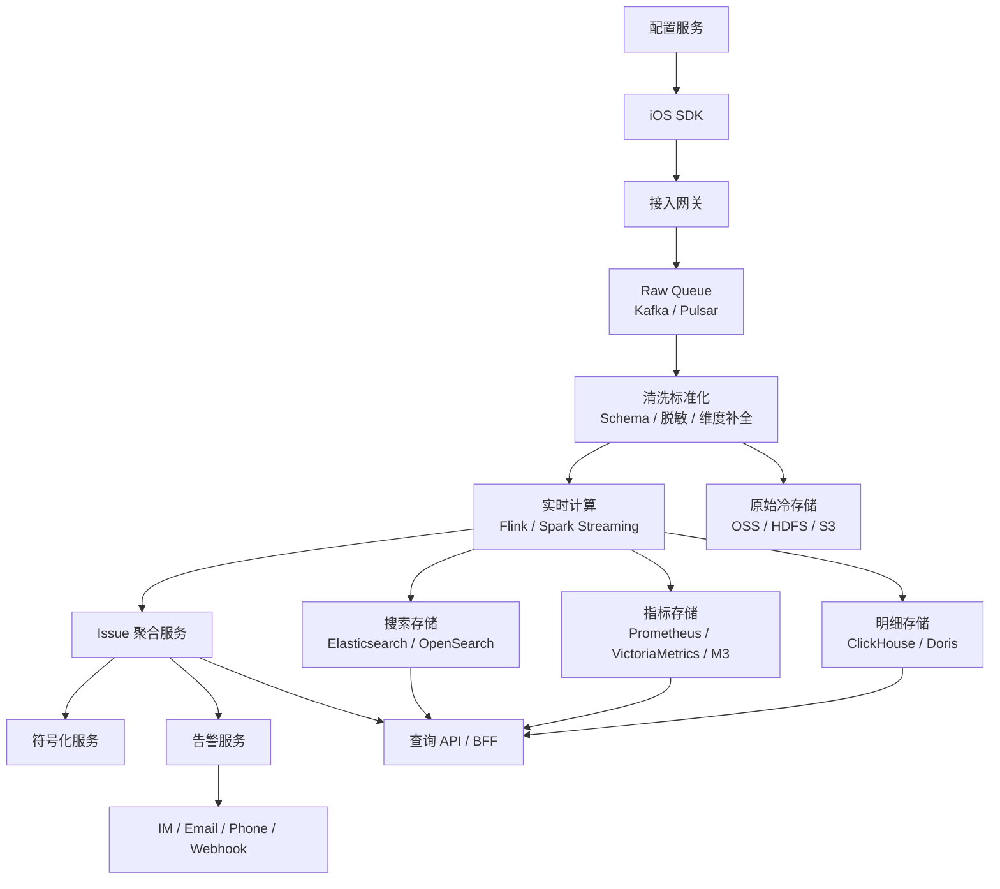
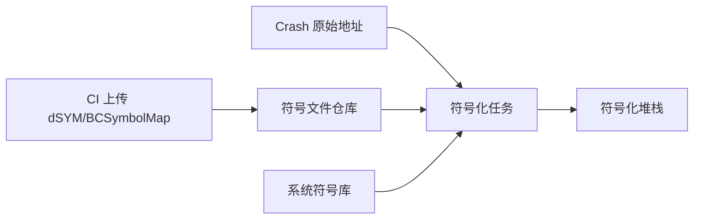

+++
title = "APM-服务端数据架构"
date = '2026-05-07T15:42:48+08:00'
draft = false
weight = 8
tags = ["iOS", "APM", "监控"]
categories = ["iOS开发", "APM"]
+++
APM 服务端本质上是一个面向移动端遥测数据的实时数据平台。它不是简单的“接收接口 + MySQL”，而要处理高吞吐写入、弱 Schema 演进、实时聚合、明细查询、符号化、Issue 聚类、告警计算和配置反控。

---

## 一、整体架构



核心原则：

1. 接入层只做轻逻辑，避免阻塞写入。
2. 原始数据先入队列，后续处理异步化。
3. 明细、指标、搜索、对象存储按查询模式分开。
4. 符号化、Issue 聚合、告警都要异步可重放。
5. 配置服务是反向控制链路，和数据链路同等重要。

---

## 二、接入网关

接入网关负责处理移动端上报请求。

必备能力：

| 能力 | 说明 |
|-----|------|
| 鉴权 | AppKey、HMAC、证书、公私钥签名 |
| 限流 | 按 App、版本、IP、设备、事件类型限流 |
| Schema 校验 | envelope 必填字段、版本、大小限制 |
| 解压解密 | gzip/zstd、AES、TLS |
| 租户隔离 | 不同 App、业务线、环境分开 |
| 时间校正 | 记录 `receive_time`，处理端侧时钟漂移 |
| 快速 ACK | 合法数据尽快入队，不做重计算 |
| 降级 | Kafka 异常时本地缓冲或返回重试 |

上报请求要有大小限制：

```text
单事件：建议 < 64KB
单批次：建议 < 512KB 或 1MB
Crash 附件：单独走对象存储预签名 URL
MemoryGraph/Coredump：只允许触发式上传
```

---

## 三、数据清洗

清洗层把 SDK 上报的事件变成平台内部标准事件。

处理步骤：

```text
decode
  -> schema validate
  -> pii scrub
  -> normalize
  -> enrich dimensions
  -> deduplicate
  -> route by event_type
```

维度补全：

| 原始字段 | 补全维度 |
|---------|---------|
| IP | 国家、省份、城市、运营商 |
| device_model | 设备名称、性能档位、内存档位 |
| os_version | 大版本、小版本、是否 beta |
| release/build | Git commit、发布批次、灰度组 |
| URL | host、path template、接口 owner |
| stack frame | module、team、owner |

清洗层必须保留坏数据样本。不要简单丢弃所有解析失败事件，否则 SDK 版本问题无法追查。

---

## 四、消息队列

Kafka/Pulsar 用于削峰和解耦。

Topic 设计示例：

```text
apm.raw.rum
apm.raw.crash
apm.raw.metric
apm.clean.rum
apm.clean.crash
apm.issue.input
apm.alert.input
apm.dead_letter
```

分区 key：

| 数据 | 分区 key |
|-----|----------|
| RUM Session | `app_id + session_id` |
| Crash | `app_id + fingerprint` |
| 指标 | `app_id + metric_name + release` |
| 配置变更 | `app_id` |

RUM Session 重建需要同一个 Session 的事件尽量落到同一分区，减少乱序处理成本。

---

## 五、实时计算

实时计算主要产出三类结果：

1. **指标聚合**：Crash 率、启动 P90、接口错误率、页面耗时。
2. **实体聚合**：Issue、Session、View、Resource。
3. **告警输入**：窗口指标、环比、基线、异常突增。

窗口建议：

| 粒度 | 用途 |
|-----|------|
| 1 分钟 | 高优先级告警、灰度拦截 |
| 5 分钟 | 常规告警、实时大盘 |
| 1 小时 | 当天分析、版本对比 |
| 1 天 | 周报、长期趋势 |

关键计算：

```text
crash_free_users = 1 - crashed_users / active_users
p90_launch = quantile(0.90)(launch_duration_ms)
slow_resource_rate = slow_resource_count / total_resource_count
view_blank_rate = blank_view_count / total_view_count
foom_rate = foom_sessions / foreground_sessions
```

分位数建议使用 t-digest、DDSketch 或 ClickHouse quantile 函数，避免只存平均值。

---

## 六、存储设计

APM 查询模式复杂，单一存储不够。

| 存储 | 适合数据 | 原因 |
|-----|---------|------|
| ClickHouse / Doris | 明细事件、聚合宽表、RUM 查询 | 列式存储，适合多维筛选和聚合 |
| TSDB | 指标时序 | 适合告警和长期趋势 |
| Elasticsearch / OpenSearch | 堆栈、错误消息、日志全文 | 适合文本检索 |
| Object Storage | 原始包、dSYM、MemoryGraph、Coredump | 成本低，适合大对象 |
| PostgreSQL / MySQL | 项目、用户、权限、配置、Issue 元数据 | 强一致业务数据 |
| Redis | 热点缓存、限流、配置缓存 | 低延迟 |

ClickHouse 表设计示例：

```sql
CREATE TABLE rum_events (
    app_id LowCardinality(String),
    env LowCardinality(String),
    release LowCardinality(String),
    event_date Date,
    event_time DateTime64(3),
    event_type LowCardinality(String),
    event_id String,
    session_id String,
    view_id String,
    action_id String,
    resource_id String,
    trace_id String,
    user_id String,
    device_model LowCardinality(String),
    os_version LowCardinality(String),
    network_type LowCardinality(String),
    name String,
    duration_ms UInt32,
    status_code UInt16,
    error_type LowCardinality(String),
    fingerprint String,
    payload_json String
) ENGINE = MergeTree
PARTITION BY (app_id, event_date)
ORDER BY (app_id, event_type, release, event_time, session_id);
```

冷热分层：

```text
最近 7 天：明细热查
最近 30 天：聚合 + 采样明细
90 天以上：只保留聚合指标和高价值 Issue
大附件：对象存储，按需加载
```

---

## 七、符号化服务

iOS Crash 和卡顿堆栈必须符号化后才有诊断价值。

输入：

```text
image_name
image_uuid
image_slide
pc_address
architecture
os_version
release
build
```

输出：

```text
module
symbol
file
line
in_app
owner
```

服务设计：



关键要求：

1. dSYM 必须和 `release + build + UUID` 绑定。
2. CI 自动上传，不依赖人工。
3. 支持异步重符号化。某次 dSYM 补传后，历史 Crash 要能重跑。
4. 系统库符号按 iOS 版本和架构预建。
5. 支持 Swift demangle。

---

## 八、Issue 聚合

APM 平台不应该把每条 Crash 都展示给研发，而应该聚合为 Issue。

聚合输入：

```text
event_type
error_type
top_in_app_frames
exception_code
signal
thread_state
resource_host/path/status
view_name
release
```

Crash fingerprint 示例：

```text
hash(
  exception_type +
  signal +
  first_3_in_app_frames_without_line +
  crashed_thread_marker
)
```

不同类型 Issue 的聚合口径：

| 类型 | fingerprint |
|-----|-------------|
| Crash | 异常类型 + 关键栈帧 |
| Watchdog | 主线程多次采样公共栈 + 阻塞类型 |
| FOOM | 页面 + 内存峰值特征 + 大对象/模块 |
| 慢页面 | view_name + 阶段 + 版本 |
| 慢接口 | host + path_template + status/error |
| JS Error | message 归一化 + stack |

Issue 服务还要维护状态、Owner、修复版本、重复问题、噪声标记。

---

## 九、告警系统

告警不应该直接查明细库，而应该基于实时聚合指标。

告警规则类型：

| 类型 | 示例 |
|-----|------|
| 绝对阈值 | Crash 率 > 0.2% |
| 环比 | 新版本启动 P90 比老版本劣化 15% |
| 变点 | 过去 10 分钟网络错误率突增 |
| TopN | 单 Issue 影响用户进入 Top 10 |
| SLO | Crash-free users 低于 99.9% |
| 灰度拦截 | 灰度组指标显著差于对照组 |

告警要做收敛：

```text
同 app + 同 release + 同 issue + 同规则
  -> 合并
  -> 静默窗口
  -> 升级策略
  -> 恢复通知
```

不可行动的指标不要告警，只进大盘。

---

## 十、配置服务

配置服务用于反向控制 SDK。

配置内容：

```json
{
  "config_version": "cfg_20260506_01",
  "plugins": {
    "crash": { "enabled": true, "sample_rate": 1.0 },
    "network": { "enabled": true, "sample_rate": 0.1 },
    "fps": { "enabled": true, "sample_rate": 0.01 },
    "memory_graph": { "enabled": false }
  },
  "thresholds": {
    "watchdog_ms": 2000,
    "slow_resource_ms": 3000,
    "slow_view_ms": 1000
  },
  "privacy": {
    "capture_body": false,
    "url_query_policy": "drop"
  }
}
```

要求：

1. SDK 本地缓存上次可用配置。
2. 配置有版本号和签名。
3. 支持按 App、版本、设备、地区、用户 hash 灰度。
4. 配置错误可自动回滚。
5. 高危模块默认关闭，只能灰度开启。

---

## 十一、容量与成本

粗略估算：

```text
DAU = 1000 万
每 DAU 原始事件 = 50 条
平均事件压缩后 = 300B
每日数据量 = 10,000,000 * 50 * 300B ≈ 150GB
```

如果网络资源、FPS、日志全量采集，数据量会迅速扩大 10 倍以上。所以服务端容量控制的第一原则是：**采样策略前置到 SDK，聚合前置到流计算，长期存储保留高价值数据**。

成本优化：

- 高频事件端侧采样。
- 服务端按事件类型分表。
- 大盘查询走预聚合表。
- 长周期查询走降采样指标。
- 原始明细设置 TTL。
- 大附件对象存储化。

---

## 十二、总结

APM 服务端架构的核心是：

```text
接得住
算得准
查得快
告得稳
能重放
可反控
```

它连接 C 端 SDK 和 B 端平台。SDK 采上来的只是原材料，服务端要把它加工成 Session、Issue、指标、告警、配置这些可治理对象。
