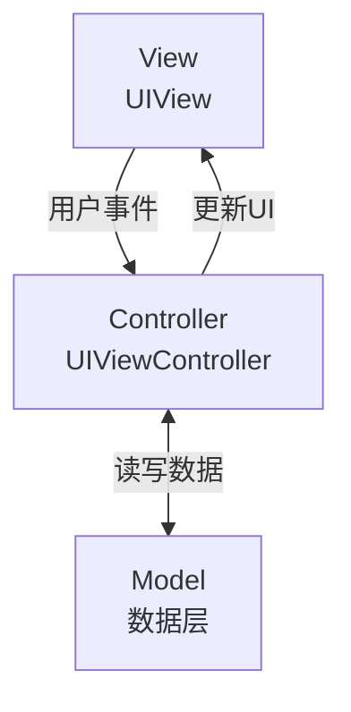
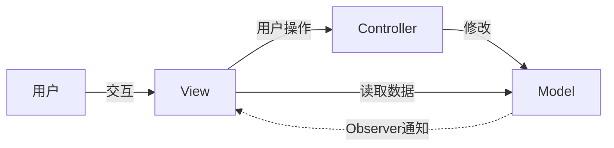
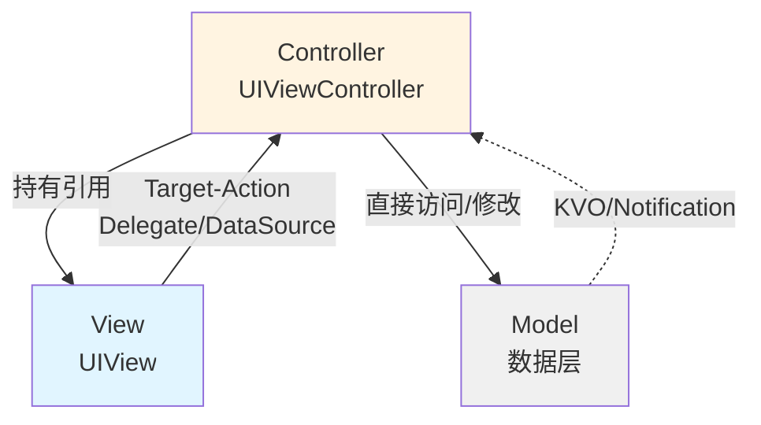

+++
title = "MVC架构详解"
date = '2026-05-02T22:32:27+08:00'
draft = false
weight = 1
tags = ["iOS", "架构"]
categories = ["iOS开发", "架构"]
+++
## 什么是MVC

MVC（Model-View-Controller）是Apple官方推荐的iOS应用架构模式，也是最基础、最常见的架构。它将应用分为三个核心组件：

- **Model（模型）**：负责数据和业务逻辑
- **View（视图）**：负责界面展示
- **Controller（控制器）**：负责协调Model和View

## MVC的结构（Apple MVC）



> 在Apple的MVC中，View和Model之间不能直接通信，所有交互都必须通过Controller中转。

### Model（模型层）

Model负责：
- 数据的存储和管理
- 业务逻辑处理
- 网络请求和数据持久化
- 数据验证

```swift
// Model示例
struct User {
    let id: Int
    let name: String
    let email: String
    
    var isValidEmail: Bool {
        let emailRegex = "[A-Z0-9a-z._%+-]+@[A-Za-z0-9.-]+\\.[A-Za-z]{2,64}"
        let emailPredicate = NSPredicate(format: "SELF MATCHES %@", emailRegex)
        return emailPredicate.evaluate(with: email)
    }
}

class UserService {
    func fetchUser(id: Int, completion: @escaping (Result<User, Error>) -> Void) {
        // 网络请求逻辑
    }
}
```

### View（视图层）

View负责：
- 界面元素的展示
- 用户交互的接收（但不处理）
- 动画效果

```swift
// View示例
class UserProfileView: UIView {
    let nameLabel: UILabel = {
        let label = UILabel()
        label.font = .systemFont(ofSize: 18, weight: .bold)
        return label
    }()
    
    let emailLabel: UILabel = {
        let label = UILabel()
        label.font = .systemFont(ofSize: 14)
        label.textColor = .gray
        return label
    }()
    
    func configure(name: String, email: String) {
        nameLabel.text = name
        emailLabel.text = email
    }
}
```

### Controller（控制器层）

Controller负责：
- 接收View的用户事件
- 调用Model获取或更新数据
- 更新View的显示

```swift
// Controller示例
class UserProfileViewController: UIViewController {
    
    private let profileView = UserProfileView()
    private let userService = UserService()
    private var user: User?
    
    override func loadView() {
        view = profileView
    }
    
    override func viewDidLoad() {
        super.viewDidLoad()
        loadUserData()
    }
    
    private func loadUserData() {
        userService.fetchUser(id: 1) { [weak self] result in
            DispatchQueue.main.async {
                switch result {
                case .success(let user):
                    self?.user = user
                    self?.updateUI()
                case .failure(let error):
                    self?.showError(error)
                }
            }
        }
    }
    
    private func updateUI() {
        guard let user = user else { return }
        profileView.configure(name: user.name, email: user.email)
    }
    
    private func showError(_ error: Error) {
        // 显示错误提示
    }
}
```

## Apple的MVC vs 传统MVC

### 传统MVC（Smalltalk MVC）



在传统MVC中：
- 用户与View直接交互
- View将用户操作转发给Controller
- Controller负责修改Model（**写操作**）
- Model变化后通过Observer模式通知View
- View直接从Model读取数据并更新显示（**读操作**）
- **关键特点**：View可以直接**读取**Model数据，但不能**修改**Model；所有修改都必须通过Controller

### Apple的MVC（Cocoa MVC）



在Apple的MVC中：
- **View → Controller**：View通过Target-Action、Delegate、DataSource与Controller通信
- **Controller → View**：Controller持有View引用并直接操作（@IBOutlet或代码创建的属性）
- **Controller → Model**：Controller直接访问和修改Model
- **Model → Controller**：Model通过KVO或Notification通知Controller数据变化
- **关键特点**：View和Model之间**不能**直接通信，必须通过Controller中转

## MVC的通信方式

### View → Controller

```swift
// 1. Target-Action
button.addTarget(self, action: #selector(buttonTapped), for: .touchUpInside)

// 2. Delegate
class ViewController: UIViewController, UITableViewDelegate {
    func tableView(_ tableView: UITableView, didSelectRowAt indexPath: IndexPath) {
        // 处理选中事件
    }
}

// 3. DataSource
class ViewController: UIViewController, UITableViewDataSource {
    func tableView(_ tableView: UITableView, numberOfRowsInSection section: Int) -> Int {
        return items.count
    }
}
```

### Controller → View

```swift
// 方式1: 通过@IBOutlet（XIB/Storyboard）
@IBOutlet weak var titleLabel: UILabel!

// 方式2: 通过代码持有引用（纯代码）
private let titleLabel = UILabel()

// 方式3: 通过view属性访问
func setupViews() {
    let label = UILabel()
    label.tag = 100
    view.addSubview(label)
}

func updateTitle(_ title: String) {
    // 使用持有的引用
    titleLabel.text = title
    
    // 或通过tag查找
    (view.viewWithTag(100) as? UILabel)?.text = title
}
```

### Model → Controller

```swift
// 1. KVO (现代API)
class ViewController: UIViewController {
    private var userObservation: NSKeyValueObservation?
    
    func observeUser(_ user: UserModel) {
        userObservation = user.observe(\.name, options: [.new]) { [weak self] user, change in
            self?.updateNameLabel(user.name)
        }
    }
}

// 2. Notification
NotificationCenter.default.addObserver(
    self,
    selector: #selector(userDidUpdate),
    name: .userDidUpdate,
    object: nil
)

// 3. Closure回调
userService.fetchUser { [weak self] user in
    self?.user = user
    self?.updateUI()
}
```

## MVC的问题：Massive View Controller

在实际iOS开发中，MVC往往会演变成"Massive View Controller"，即ViewController变得臃肿庞大。

### 问题原因

1. **职责不清**：ViewController同时处理视图逻辑、业务逻辑、导航逻辑
2. **View和Controller紧耦合**：UIViewController既是Controller又管理View的生命周期
3. **难以复用**：业务逻辑嵌入在ViewController中，难以在其他地方复用
4. **难以测试**：依赖UIKit，单元测试困难，多数情况都需要依赖集成测试

### 典型的臃肿ViewController

```swift
// 反面示例：臃肿的ViewController
class UserListViewController: UIViewController, 
    UITableViewDelegate, 
    UITableViewDataSource,
    UISearchBarDelegate,
    UserCellDelegate {
    
    @IBOutlet weak var tableView: UITableView!
    @IBOutlet weak var searchBar: UISearchBar!
    
    var users: [User] = []
    var filteredUsers: [User] = []
    var isSearching = false
    
    override func viewDidLoad() {
        super.viewDidLoad()
        setupTableView()
        setupSearchBar()
        loadUsers()
    }
    
    // 网络请求
    func loadUsers() {
        guard let url = URL(string: "https://api.example.com/users") else { return }
        URLSession.shared.dataTask(with: url) { data, response, error in
            // 解析数据
            // 更新UI
        }.resume()
    }
    
    // TableView DataSource
    func tableView(_ tableView: UITableView, numberOfRowsInSection section: Int) -> Int {
        return isSearching ? filteredUsers.count : users.count
    }
    
    func tableView(_ tableView: UITableView, cellForRowAt indexPath: IndexPath) -> UITableViewCell {
        // 配置cell
    }
    
    // TableView Delegate
    func tableView(_ tableView: UITableView, didSelectRowAt indexPath: IndexPath) {
        // 处理选中
        // 导航到详情页
    }
    
    // SearchBar Delegate
    func searchBar(_ searchBar: UISearchBar, textDidChange searchText: String) {
        // 搜索逻辑
    }
    
    // UserCell Delegate
    func userCellDidTapFollow(_ cell: UserCell) {
        // 关注逻辑
    }
    
    // 还有更多...
}
```

## 改进MVC

虽然MVC有其局限性，但通过一些技巧可以改善代码质量。

### 1. 抽离DataSource

```swift
class UserListDataSource: NSObject, UITableViewDataSource {
    var users: [User] = []
    
    func tableView(_ tableView: UITableView, numberOfRowsInSection section: Int) -> Int {
        return users.count
    }
    
    func tableView(_ tableView: UITableView, cellForRowAt indexPath: IndexPath) -> UITableViewCell {
        let cell = tableView.dequeueReusableCell(withIdentifier: "UserCell", for: indexPath) as! UserCell
        cell.configure(with: users[indexPath.row])
        return cell
    }
}
```

### 2. 抽离网络层

```swift
class UserService {
    func fetchUsers(completion: @escaping (Result<[User], Error>) -> Void) {
        // 网络请求逻辑
    }
}
```

### 3. 使用子ViewController

```swift
class ContainerViewController: UIViewController {
    private let headerVC = HeaderViewController()
    private let contentVC = ContentViewController()
    
    override func viewDidLoad() {
        super.viewDidLoad()
        
        // 添加header
        addChild(headerVC)
        view.addSubview(headerVC.view)
        headerVC.didMove(toParent: self)
        
        // 添加content
        addChild(contentVC)
        view.addSubview(contentVC.view)
        contentVC.didMove(toParent: self)
        
        // 布局子ViewController的view
        layoutChildViewControllers()
    }
    
    private func layoutChildViewControllers() {
        headerVC.view.frame = CGRect(x: 0, y: 0, width: view.bounds.width, height: 100)
        contentVC.view.frame = CGRect(x: 0, y: 100, width: view.bounds.width, height: view.bounds.height - 100)
    }
}
```

### 4. 使用扩展分离代码

```swift
// UserListViewController+TableView.swift
extension UserListViewController: UITableViewDelegate {
    func tableView(_ tableView: UITableView, didSelectRowAt indexPath: IndexPath) {
        // 处理选中
    }
}

// UserListViewController+SearchBar.swift
extension UserListViewController: UISearchBarDelegate {
    func searchBar(_ searchBar: UISearchBar, textDidChange searchText: String) {
        // 搜索逻辑
    }
}
```

## MVC的优缺点

### 优点

1. **简单直观**：概念简单，易于理解
2. **开发速度快**：对于简单页面，可以快速开发
3. **官方支持**：Apple官方推荐，UIKit设计就是基于MVC
4. **学习成本低**：新手容易上手

### 缺点

1. **可测试性差**：ViewController依赖UIKit，难以单元测试
2. **代码臃肿**：ViewController容易变得庞大
3. **职责不清**：业务逻辑和视图逻辑混在一起
4. **复用性差**：逻辑难以在不同页面复用

## 适用场景

MVC适合以下场景：

1. **小型项目**：页面简单，业务逻辑不复杂
2. **原型开发**：快速验证想法
3. **简单页面**：即使在大型项目中，简单的展示页面也可以用MVC
4. **团队新手多**：降低学习成本

## 从MVC演进

当项目复杂度增加时，可以考虑从MVC演进到其他架构：

- **MVP**：将业务逻辑抽离到Presenter，提高可测试性
- **MVVM**：使用数据绑定，进一步解耦View和业务逻辑
- **VIPER**：更细粒度的职责划分，适合大型项目
