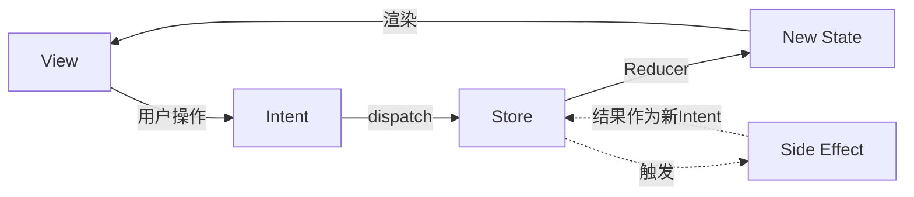

+++
title = "MVI架构详解"
date = '2026-05-02T22:32:27+08:00'
draft = false
weight = 2
tags = ["iOS", "架构"]
categories = ["iOS开发", "架构"]
+++
## 什么是MVI

MVI（Model-View-Intent）是一种单向数据流架构模式。"Model-View-Intent"这一命名最早出现在Andre Medeiros（Staltz）创建的JavaScript框架Cycle.js中。2016年，Hannes Dorfmann在其博客系列中将MVI系统化引入Android开发，他在文中明确提到同时受到了Cycle.js和Redux（以及更早的Elm架构）的启发——MVI的命名和响应式理念来自Cycle.js，而Reducer纯函数和单一状态源的机制则与Redux一脉相承。随着Swift社区对函数式编程和响应式编程的接受度提高，MVI也逐渐被引入iOS开发。

MVI的核心思想：

- **单向数据流**：数据沿固定方向流动（View -> Intent -> Reducer -> State -> View），没有捷径或后门
- **不可变状态**：整个界面由单一不可变的State描述，每次更新都产生全新的State对象
- **可预测性**：给定相同的当前State和Intent，Reducer总是产生相同的新State

## MVI的核心概念

### Model（状态）

在MVI中，Model不是传统意义上的领域数据模型，而是**界面状态模型（State）**。它用一个不可变的值类型来描述UI在某一时刻的完整快照，包括数据内容、加载状态、错误信息等。

```swift
struct UserListState: Equatable {
    var users: [User]
    var isLoading: Bool
    var error: String?
    var searchQuery: String
    
    static let initial = UserListState(
        users: [],
        isLoading: false,
        error: nil,
        searchQuery: ""
    )
}
```

这里使用`var`属性配合`struct`值类型，利用Swift的值语义在Reducer中通过拷贝实现不可变效果，这是Swift中最常用的做法（详见后文"状态的不可变性"一节）。

### Intent（意图）

Intent代表所有触发状态变化的事件。它不仅包括用户的UI操作，还包括副作用的结果回调（如网络请求完成、数据库查询结果）、系统事件（如生命周期回调、推送通知）等。所有这些事件统一通过Intent进入Reducer驱动状态变化。

```swift
enum UserListAction {
    // 用户意图
    case loadUsers
    case refreshUsers
    case deleteUser(id: Int)
    case searchQueryChanged(String)
    
    // 副作用结果（也是Intent的一种）
    case usersLoaded([User])
    case loadFailed(String)
}
```

将用户操作和副作用结果统一为同一类型，是MVI的关键设计。这样Reducer就成为状态变化的唯一入口，所有状态转换都在一处完成。

### View（视图）

View的职责非常单一：

- 根据State渲染界面（`render(state:)`）
- 将用户操作转换为Intent
- 不包含任何业务逻辑或状态管理

### Store（状态容器）

Store是MVI中协调各组件的中枢。它持有当前State，接收View发出的Intent，调用Reducer计算新State，并在需要时触发副作用（如网络请求）。View将Intent发送给Store，Store更新State后通知View重新渲染。

Store的角色类似于MVC中的Controller——都是连接View和数据层的协调者。但区别在于Controller的职责边界模糊，往往同时承担状态管理、业务逻辑和副作用处理，容易膨胀。而Store是一个**被严格约束的协调者**：状态计算必须委托给Reducer，副作用被隔离在专门的方法中，Store自身不能随意修改State，只能通过Intent驱动整个流程。这种约束是MVI相比MVC的核心进步。

### Reducer（归约器）

Reducer是一个**纯函数**，接收当前State和一个Intent，返回新的State。它不执行任何副作用，只做状态计算。

所谓副作用（Side Effect），是指函数除了返回值之外对外部世界产生的任何可观察影响，例如发起网络请求、读写数据库、访问文件系统、打印日志、修改全局变量等。纯函数的要求是：相同的输入永远产生相同的输出，且不产生任何副作用。Reducer正是这样一个纯函数——它只根据当前State和Intent计算出新State，不做其他任何事情。

```swift
func reduce(state: UserListState, intent: UserListAction) -> UserListState {
    var newState = state
    switch intent {
    case .loadUsers, .refreshUsers:
        newState.isLoading = true
        newState.error = nil
    case .usersLoaded(let users):
        newState.users = users
        newState.isLoading = false
    case .loadFailed(let error):
        newState.isLoading = false
        newState.error = error
    case .deleteUser(let id):
        newState.users.removeAll { $0.id == id }
    case .searchQueryChanged(let query):
        newState.searchQuery = query
    }
    return newState
}
```

## MVI的数据流



完整的数据流循环：

1. **View** 捕获用户操作，将其转换为 **Intent** 发送给 Store
2. **Store** 将 Intent 交给 **Reducer** 处理，Reducer根据当前State和Intent计算出新State
3. Store 更新当前 **State** 并通知 View
4. **View** 根据新State重新渲染界面
5. 如果Intent需要执行副作用（如网络请求），Store将副作用的结果作为新的Intent重新dispatch，再次经过Reducer更新State

这个循环的关键在于：**Reducer是纯函数，副作用与状态计算完全分离**。

## MVI的实现

以用户列表为例，展示MVI各层的实现。

### 定义Model

```swift
struct User: Equatable, Identifiable {
    let id: Int
    let name: String
    let email: String
}

struct UserListState: Equatable {
    var users: [User]
    var isLoading: Bool
    var error: String?
    var searchQuery: String
    
    static let initial = UserListState(
        users: [],
        isLoading: false,
        error: nil,
        searchQuery: ""
    )
}

enum UserListAction {
    case loadUsers
    case usersLoaded([User])
    case loadFailed(String)
    case deleteUser(Int)
    case searchQueryChanged(String)
}
```

### 实现Reducer

```swift
struct UserListReducer {
    func reduce(state: UserListState, action: UserListAction) -> UserListState {
        var newState = state
        
        switch action {
        case .loadUsers:
            newState.isLoading = true
            newState.error = nil
        case .usersLoaded(let users):
            newState.users = users
            newState.isLoading = false
        case .loadFailed(let error):
            newState.isLoading = false
            newState.error = error
        case .deleteUser(let id):
            newState.users.removeAll { $0.id == id }
        case .searchQueryChanged(let query):
            newState.searchQuery = query
        }
        return newState
    }
}
```

### 实现Store（含副作用处理）

Store负责协调Reducer（纯状态计算）和Side Effect（异步操作）。副作用的结果通过dispatch作为新的Intent重新进入Reducer，保证状态变化的单一入口。

#### UIKit + RxSwift版本

```swift
import RxSwift
import RxRelay

protocol UserServiceProtocol {
    func fetchUsers() -> Single<[User]>
}

class UserListStore {
    var stateObservable: Observable<UserListState> { stateRelay.asObservable().distinctUntilChanged() }
    var currentState: UserListState { stateRelay.value }
    
    private let stateRelay: BehaviorRelay<UserListState>
    private let reducer = UserListReducer()
    private let userService: UserServiceProtocol
    private let disposeBag = DisposeBag()
    
    init(userService: UserServiceProtocol, initialState: UserListState = .initial) {
        self.userService = userService
        self.stateRelay = BehaviorRelay(value: initialState)
    }
    
    func dispatch(_ action: UserListAction) {
        let newState = reducer.reduce(state: stateRelay.value, action: action)
        stateRelay.accept(newState)
        handleSideEffect(action)
    }
    
    private func handleSideEffect(_ action: UserListAction) {
        switch action {
        case .loadUsers:
            userService.fetchUsers()
                .observe(on: MainScheduler.instance)
                .subscribe(
                    onSuccess: { [weak self] users in
                        self?.dispatch(.usersLoaded(users))
                    },
                    onFailure: { [weak self] error in
                        self?.dispatch(.loadFailed(error.localizedDescription))
                    }
                )
                .disposed(by: disposeBag)
        default:
            break
        }
    }
}
```

#### SwiftUI + Combine版本

```swift
import Combine

protocol UserServiceCombineProtocol {
    func fetchUsers() -> AnyPublisher<[User], Error>
}

@MainActor
final class UserListStoreSwiftUI: ObservableObject {
    @Published private(set) var state: UserListState
    
    private let reducer = UserListReducer()
    private let userService: UserServiceCombineProtocol
    private var cancellables = Set<AnyCancellable>()
    
    init(userService: UserServiceCombineProtocol, initialState: UserListState = .initial) {
        self.userService = userService
        self.state = initialState
    }
    
    func dispatch(_ action: UserListAction) {
        state = reducer.reduce(state: state, action: action)
        handleSideEffect(action)
    }
    
    private func handleSideEffect(_ action: UserListAction) {
        switch action {
        case .loadUsers:
            userService.fetchUsers()
                .receive(on: DispatchQueue.main)
                .sink(
                    receiveCompletion: { [weak self] completion in
                        if case .failure(let error) = completion {
                            self?.dispatch(.loadFailed(error.localizedDescription))
                        }
                    },
                    receiveValue: { [weak self] users in
                        self?.dispatch(.usersLoaded(users))
                    }
                )
                .store(in: &cancellables)
        default:
            break
        }
    }
}
```

两个版本的核心逻辑完全一致：`dispatch`先通过Reducer计算新State，再处理副作用。区别仅在于状态通知机制——RxSwift用`BehaviorRelay`，Combine用`@Published`。

#### View实现

**UIKit版本：**

```swift
class UserListViewController: UIViewController {
    private let tableView = UITableView()
    private let loadingIndicator = UIActivityIndicatorView(style: .large)
    private let store: UserListStore
    private let disposeBag = DisposeBag()
    
    init(store: UserListStore) {
        self.store = store
        super.init(nibName: nil, bundle: nil)
    }
    
    required init?(coder: NSCoder) { fatalError() }
    
    override func viewDidLoad() {
        super.viewDidLoad()
        bindState()
        store.dispatch(.loadUsers)
    }
    
    private func bindState() {
        store.stateObservable
            .observe(on: MainScheduler.instance)
            .subscribe(onNext: { [weak self] state in
                self?.render(state)
            })
            .disposed(by: disposeBag)
    }
    
    private func render(_ state: UserListState) {
        loadingIndicator.isHidden = !state.isLoading
        state.isLoading ? loadingIndicator.startAnimating() : loadingIndicator.stopAnimating()
        tableView.reloadData()
    }
}

extension UserListViewController: UITableViewDelegate {
    func tableView(_ tableView: UITableView, commit editingStyle: UITableViewCell.EditingStyle, forRowAt indexPath: IndexPath) {
        if editingStyle == .delete {
            let user = store.currentState.users[indexPath.row]
            store.dispatch(.deleteUser(user.id))
        }
    }
}
```

**SwiftUI版本：**

```swift
struct UserListView: View {
    @StateObject private var store: UserListStoreSwiftUI
    
    init(userService: UserServiceCombineProtocol) {
        _store = StateObject(wrappedValue: UserListStoreSwiftUI(userService: userService))
    }
    
    var body: some View {
        Group {
            if store.state.isLoading {
                ProgressView()
            } else if let error = store.state.error {
                VStack(spacing: 12) {
                    Text(error)
                        .foregroundColor(.red)
                    Button("重试") {
                        store.dispatch(.loadUsers)
                    }
                }
            } else {
                List {
                    ForEach(store.state.users) { user in
                        VStack(alignment: .leading) {
                            Text(user.name).font(.headline)
                            Text(user.email).font(.subheadline).foregroundColor(.gray)
                        }
                    }
                    .onDelete { indexSet in
                        for index in indexSet {
                            store.dispatch(.deleteUser(store.state.users[index].id))
                        }
                    }
                }
            }
        }
        .task {
            store.dispatch(.loadUsers)
        }
    }
}
```

## 状态的不可变性

MVI强调State是不可变的——每次状态变化都产生新的状态对象，而不是修改现有对象。在Swift中有两种实现方式：

### 方式1：完全不可变（let属性 + copy方法）

```swift
struct UserListState: Equatable {
    let users: [User]
    let isLoading: Bool
    let error: String?
    
    func with(users: [User]? = nil, isLoading: Bool? = nil, error: String?? = nil) -> UserListState {
        UserListState(
            users: users ?? self.users,
            isLoading: isLoading ?? self.isLoading,
            error: error ?? self.error
        )
    }
}

// Reducer中使用
func reduce(state: UserListState, action: UserListAction) -> UserListState {
    switch action {
    case .loadUsers:
        return state.with(isLoading: true, error: .some(nil))
    case .usersLoaded(let users):
        return state.with(users: users, isLoading: false)
    // ...
    }
}
```

严格遵守不可变原则，但当属性较多时copy方法的参数列表会比较冗长。

### 方式2：var属性 + struct值拷贝（推荐）

```swift
struct UserListState: Equatable {
    var users: [User]
    var isLoading: Bool
    var error: String?
}

func reduce(state: UserListState, action: UserListAction) -> UserListState {
    var newState = state  // struct值拷贝，不会影响原state
    switch action {
    case .deleteUser(let id):
        newState.users.removeAll { $0.id == id }
    // ...
    }
    return newState  // 返回全新状态
}
```

这是Swift MVI中最常用的方式。Swift的struct是值类型，`var newState = state`会产生一份完整拷贝，对`newState`的修改不会影响`state`，因此在语义上等价于不可变。

**应避免的做法：**

```swift
// 错误1：使用inout直接修改传入状态，破坏了"旧State -> 新State"的纯函数模型
func reduce(state: inout UserListState, action: UserListAction) {
    state.users.removeAll { $0.id == id }
}

// 错误2：使用class定义State，引用语义会导致外部持有者看到意外修改
class UserListState {
    var users: [User]
}
```

## 状态的可追溯性

MVI的单向数据流天然支持状态变化追溯，可用于调试、日志记录和时间旅行调试：

```swift
class DebuggableStore<S: Equatable, A> {
    private(set) var state: S
    private(set) var history: [(action: A, fromState: S, toState: S)] = []
    private let reducer: (S, A) -> S
    private let stateDidChange: (S) -> Void
    
    init(initialState: S, reducer: @escaping (S, A) -> S, onChange: @escaping (S) -> Void) {
        self.state = initialState
        self.reducer = reducer
        self.stateDidChange = onChange
    }
    
    func dispatch(_ action: A) {
        let oldState = state
        let newState = reducer(state, action)
        history.append((action, oldState, newState))
        state = newState
        stateDidChange(newState)
        
        #if DEBUG
        print("[MVI] \(action): \(oldState) -> \(newState)")
        #endif
    }
    
    func revert(to index: Int) {
        guard index >= 0, index < history.count else { return }
        state = history[index].toState
        stateDidChange(state)
    }
}
```

## 单元测试

由于Reducer是纯函数（无副作用、输出仅取决于输入），测试非常简单直接：

```swift
class UserListReducerTests: XCTestCase {
    let reducer = UserListReducer()
    
    func testLoadUsers_SetsLoadingTrue() {
        let newState = reducer.reduce(state: .initial, action: .loadUsers)
        
        XCTAssertTrue(newState.isLoading)
        XCTAssertNil(newState.error)
    }
    
    func testUsersLoaded_UpdatesUsersAndStopsLoading() {
        let loadingState = UserListState(users: [], isLoading: true, error: nil, searchQuery: "")
        let users = [User(id: 1, name: "John", email: "john@example.com")]
        
        let newState = reducer.reduce(state: loadingState, action: .usersLoaded(users))
        
        XCTAssertEqual(newState.users, users)
        XCTAssertFalse(newState.isLoading)
    }
    
    func testDeleteUser_RemovesTargetUser() {
        let state = UserListState(
            users: [
                User(id: 1, name: "John", email: ""),
                User(id: 2, name: "Jane", email: "")
            ],
            isLoading: false,
            error: nil,
            searchQuery: ""
        )
        
        let newState = reducer.reduce(state: state, action: .deleteUser(1))
        
        XCTAssertEqual(newState.users.count, 1)
        XCTAssertEqual(newState.users.first?.id, 2)
    }
    
    func testLoadFailed_SetsErrorAndStopsLoading() {
        let loadingState = UserListState(users: [], isLoading: true, error: nil, searchQuery: "")
        
        let newState = reducer.reduce(state: loadingState, action: .loadFailed("Network error"))
        
        XCTAssertFalse(newState.isLoading)
        XCTAssertEqual(newState.error, "Network error")
    }
}
```

## 复杂页面的状态管理

前面的示例都是一个Store管理一个页面的全部状态。对于简单到中等复杂度的页面，这完全够用。但当页面变得非常复杂（例如一个电商首页包含搜索栏、Banner轮播、多个商品列表、购物车浮标等），一个巨大的State和Reducer会带来问题：State字段过多难以阅读、Reducer的switch分支膨胀、不相关的模块修改同一个文件导致协作冲突。

主要有两种页面管理方式：

### 方式1：单一State + 子State嵌套组合

保持每个页面一个Store的原则，但将State拆分为多个子State，Reducer也拆分为多个子Reducer再组合：

```swift
// 子State
struct SearchState: Equatable {
    var query: String = ""
    var suggestions: [String] = []
}

struct ProductListState: Equatable {
    var products: [Product] = []
    var isLoading: Bool = false
    var currentPage: Int = 1
}

struct CartBadgeState: Equatable {
    var itemCount: Int = 0
}

// 页面总State = 子State的组合
struct HomePageState: Equatable {
    var search: SearchState = .init()
    var productList: ProductListState = .init()
    var cartBadge: CartBadgeState = .init()
    var banners: [Banner] = []
}

// 子Reducer各自处理自己的逻辑
struct SearchReducer {
    func reduce(state: SearchState, action: HomePageAction) -> SearchState {
        var newState = state
        switch action {
        case .searchQueryChanged(let query):
            newState.query = query
        case .suggestionsLoaded(let suggestions):
            newState.suggestions = suggestions
        default: break
        }
        return newState
    }
}

struct ProductListReducer {
    func reduce(state: ProductListState, action: HomePageAction) -> ProductListState {
        var newState = state
        switch action {
        case .loadProducts:
            newState.isLoading = true
        case .productsLoaded(let products):
            newState.products = products
            newState.isLoading = false
        default: break
        }
        return newState
    }
}

// 总Reducer组合子Reducer
struct HomePageReducer {
    private let searchReducer = SearchReducer()
    private let productListReducer = ProductListReducer()
    
    func reduce(state: HomePageState, action: HomePageAction) -> HomePageState {
        var newState = state
        newState.search = searchReducer.reduce(state: state.search, action: action)
        newState.productList = productListReducer.reduce(state: state.productList, action: action)
        
        // 跨模块逻辑在总Reducer中处理
        switch action {
        case .addToCart:
            newState.cartBadge.itemCount += 1
        default: break
        }
        return newState
    }
}
```

这种方式保持了单一数据源的优势，跨模块的状态协调（比如搜索结果影响商品列表）在总Reducer中自然完成。

### 方式2：每个模块独立Store

将页面拆分为多个独立的子模块，每个模块拥有自己的Store，由一个协调层（Coordinator）管理模块间通信：

```swift
class HomePageCoordinator {
    let searchStore = SearchStore()
    let productListStore = ProductListStore()
    let cartStore = CartStore()
    
    func setup() {
        // 模块间通信：搜索结果触发商品列表刷新
        searchStore.onSearchSubmitted = { [weak self] query in
            self?.productListStore.dispatch(.searchProducts(query))
        }
        
        // 模块间通信：添加购物车更新角标
        productListStore.onAddToCart = { [weak self] product in
            self?.cartStore.dispatch(.addItem(product))
        }
    }
}
```

模块完全独立，可以单独开发和测试。但跨模块的状态一致性需要手动维护，Coordinator的协调逻辑可能变得复杂。

### 如何选择

| 场景 | 推荐方式 |
| ------ | ---------- |
| 模块之间有频繁的状态依赖 | 方式1：单一State组合，跨模块逻辑在总Reducer中统一处理 |
| 模块相对独立，交互较少 | 方式2：独立Store，通过Coordinator松耦合通信 |
| 团队按模块分工，需要独立开发部署 | 方式2：独立Store，减少文件冲突 |
| 需要整个页面的状态快照（如时间旅行调试） | 方式1：单一State组合，天然支持全局快照 |

实际项目中也可以混合使用：页面级用方式1保持状态一致性，跨页面/跨Feature级别用方式2保持模块独立性。

## MVI的优缺点

### 优点

1. **可预测性**：单向数据流使状态变化路径清晰可预测，给定相同输入必定产生相同输出
2. **可测试性**：Reducer是纯函数，无需Mock依赖即可测试所有状态转换逻辑
3. **可追溯性**：所有状态变化都经过Reducer这一唯一入口，便于记录日志和实现时间旅行调试
4. **状态一致性**：单一State对象描述整个界面，避免了多个独立状态变量之间的不一致
5. **调试友好**：可以精确重放任意一次状态变化的上下文（哪个Intent、从哪个State变到哪个State）

### 缺点

1. **学习曲线**：需要理解单向数据流、纯函数、副作用分离等函数式编程概念
2. **样板代码**：State、Intent、Reducer的定义会增加代码量，对简单页面可能显得冗余
3. **状态拷贝开销**：频繁创建新State对象有一定性能开销，不过Swift的Copy-on-Write机制在大多数场景下可以缓解这个问题
4. **副作用处理复杂度**：当副作用之间存在依赖关系（如链式网络请求）时，管理逻辑会比较复杂
5. **过度设计风险**：对于简单的CRUD页面，MVI带来的结构化收益可能不足以抵消额外的复杂度

## MVI与Redux的关系

MVI和Redux（源自JavaScript生态，由Dan Abramov于2015年提出）在核心思想上高度同源，都受到了Elm架构和函数式编程的影响。理解两者的关系有助于在不同技术栈之间建立知识映射。

### 共同的核心原则

| 原则 | MVI | Redux |
| ------ | ----- | ------- |
| 单一状态源 | 单个State描述整个界面 | 单个Store持有全局State Tree |
| 状态只读 | State不可变，只能通过Reducer产生新State | State不可变，只能通过Reducer产生新State |
| 纯函数更新 | `(State, Intent) -> State` | `(State, Action) -> State` |
| 单向数据流 | View -> Intent -> Reducer -> State -> View | View -> Action -> Reducer -> State -> View |

可以看到，`Intent`和`Action`本质上是同一概念的不同命名。两者的Reducer签名也完全一致。

### 主要区别

- **作用域**：Redux通常管理整个应用的全局状态（Single Store），而MVI更倾向于每个页面/模块拥有独立的Store
- **Middleware vs Side Effect**：Redux通过Middleware链（如redux-thunk、redux-saga）拦截Action来处理副作用；MVI没有标准化的Middleware机制，副作用处理方式更灵活（可以在Store中直接处理，也可以引入独立的Side Effect层）
- **起源背景**：Redux源自Web前端的Flux架构，面向的是大型SPA的全局状态管理；MVI源自Cycle.js的响应式理念，面向的是移动端的页面级状态管理

### iOS生态中的实践

在iOS社区中，[The Composable Architecture（TCA）]()是Redux思想在Swift中最成熟的实现，它提供了标准化的Effect系统、Dependency管理和模块组合能力。如果项目需要完善的工具链支持，TCA是一个值得考虑的选择。而如果希望保持轻量和灵活，直接按MVI的思路手写Store + Reducer则更加简洁可控。

## MVI解决了MVVM的哪些问题

### 1. 状态一致性

MVVM中ViewModel的多个独立状态属性散布在各个方法中被修改，随着业务增长，很容易在某个路径中忘记同步更新所有相关属性，导致逻辑上的状态不一致：

```swift
// MVVM：多个独立状态属性，分散在不同方法中修改
class UserViewModel {
    var users: [User] = [] { didSet { onUsersChanged?(users) } }
    var isLoading = false { didSet { onLoadingChanged?(isLoading) } }
    var error: String? { didSet { onErrorChanged?(error) } }
    
    var onUsersChanged: (([User]) -> Void)?
    var onLoadingChanged: ((Bool) -> Void)?
    var onErrorChanged: ((String?) -> Void)?
    
    func loadUsers() {
        isLoading = true
        error = nil
        fetchFromNetwork()
    }
    
    func retry() {
        isLoading = true
        // 忘记清除error -> 界面同时显示loading和上一次的错误信息
        fetchFromNetwork()
    }
    
    func handleDeepLink(_ userId: Int) {
        isLoading = true
        // 又一个入口，又需要记得正确设置所有相关属性
        // 随着入口增多，遗漏的概率越来越高
        fetchUser(userId)
    }
}
```

MVI通过Reducer将所有状态转换集中在一处，每个Action对应的状态变化一目了然，结构上杜绝了遗漏：

```swift
// MVI：所有状态转换集中在Reducer中，不可能遗漏
func reduce(state: UserListState, action: UserListAction) -> UserListState {
    var newState = state
    switch action {
    case .loadUsers, .retry:
        newState.isLoading = true
        newState.error = nil  // 在这里统一处理，不会遗漏
    // ...
    }
    return newState
}
```

### 2. 状态变化难以追踪

MVVM中状态可以从ViewModel的任何方法中被修改，当出现Bug时难以定位是哪个调用路径导致了错误状态。MVI的所有状态变化都经过Reducer这一唯一入口，配合日志记录可以精确还原每一次状态变化的来源。

### 3. 副作用管理分散

MVVM中副作用（网络请求、数据库操作、定时器等）散落在ViewModel的各个方法中，难以统一管理和测试。MVI将副作用集中在Store的`handleSideEffect`方法中，与纯函数Reducer明确分离，职责更加清晰，也更便于Mock和测试。
