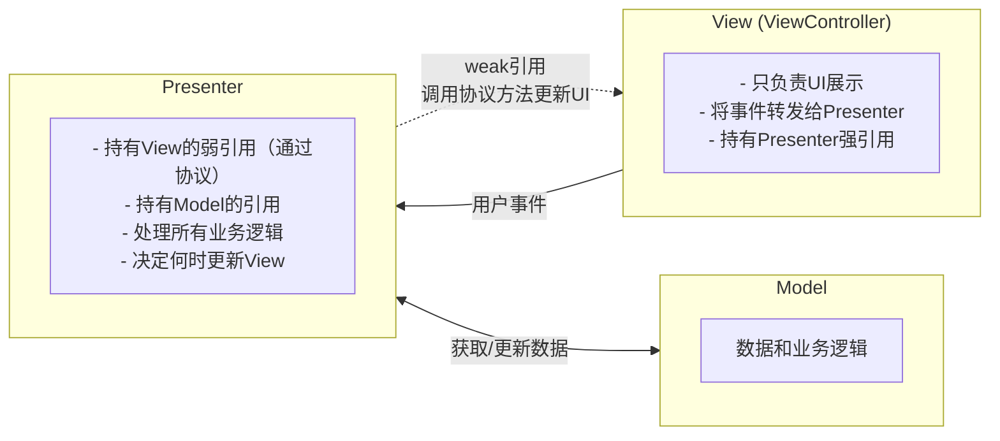
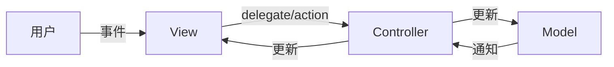
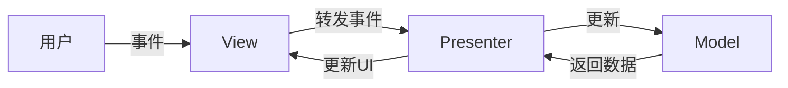

+++
title = "MVP架构详解"
date = '2026-05-02T22:32:27+08:00'
draft = false
weight = 3
tags = ["iOS", "架构"]
categories = ["iOS开发", "架构"]
+++
## 什么是MVP

MVP（Model-View-Presenter）是一种**将展示逻辑与视图分离**的架构模式，起源于上世纪90年代。MVP通过引入Presenter层来解决MVC中Controller职责过重（Massive ViewController）的问题。MVP的核心思想是让View变得"被动"（Passive View），所有的展示逻辑都由Presenter处理，View只负责UI的展示和事件的转发。

## MVP的结构



## MVP的三个组件

### Model（模型层）

与MVC中的Model相同，负责数据和业务逻辑。

```swift
// Model
struct User {
    let id: Int
    let name: String
    let email: String
    let avatarURL: URL?
}

// Service
protocol UserServiceProtocol {
    func fetchUser(id: Int, completion: @escaping (Result<User, Error>) -> Void)
    func updateUser(_ user: User, completion: @escaping (Result<Void, Error>) -> Void)
}

class UserService: UserServiceProtocol {
    func fetchUser(id: Int, completion: @escaping (Result<User, Error>) -> Void) {
        // 网络请求实现
    }
    
    func updateUser(_ user: User, completion: @escaping (Result<Void, Error>) -> Void) {
        // 更新用户实现
    }
}
```

### View（视图层）

在MVP中，View是"被动的"（Passive View），它：
- 只负责UI的展示和更新
- 将所有用户事件转发给Presenter
- 通过协议与Presenter通信
- 不包含任何业务逻辑

```swift
// View协议 - 定义View需要实现的方法
protocol UserProfileViewProtocol: AnyObject {
    func showLoading()
    func hideLoading()
    func showUser(name: String, email: String, avatarURL: URL?)
    func showError(message: String)
}

// ViewController实现View协议
class UserProfileViewController: UIViewController, UserProfileViewProtocol {
    
    // UI组件
    private let loadingIndicator = UIActivityIndicatorView(style: .large)
    private let nameLabel = UILabel()
    private let emailLabel = UILabel()
    private let avatarImageView = UIImageView()
    private let editButton = UIButton()
    
    // Presenter引用
    var presenter: UserProfilePresenterProtocol!
    
    override func viewDidLoad() {
        super.viewDidLoad()
        setupUI()
        presenter.viewDidLoad()
    }
    
    private func setupUI() {
        // UI布局代码
        editButton.addTarget(self, action: #selector(editButtonTapped), for: .touchUpInside)
    }
    
    @objc private func editButtonTapped() {
        // 将事件转发给Presenter
        presenter.didTapEditButton()
    }
    
    // MARK: - UserProfileViewProtocol
    
    func showLoading() {
        loadingIndicator.startAnimating()
    }
    
    func hideLoading() {
        loadingIndicator.stopAnimating()
    }
    
    func showUser(name: String, email: String, avatarURL: URL?) {
        nameLabel.text = name
        emailLabel.text = email
        // 加载头像
    }
    
    func showError(message: String) {
        let alert = UIAlertController(title: "错误", message: message, preferredStyle: .alert)
        alert.addAction(UIAlertAction(title: "确定", style: .default))
        present(alert, animated: true)
    }
}
```

### Presenter（展示层）

Presenter是MVP的核心，它：
- 持有View的弱引用（通过协议）
- 持有Model/Service的引用
- 处理所有业务逻辑
- 决定何时以及如何更新View

```swift
// Presenter协议
protocol UserProfilePresenterProtocol {
    func viewDidLoad()
    func didTapEditButton()
}

// Presenter实现
class UserProfilePresenter: UserProfilePresenterProtocol {
    
    // 弱引用View，避免循环引用
    weak var view: UserProfileViewProtocol?
    
    private let userService: UserServiceProtocol
    private let userId: Int
    private var user: User?
    
    // 注意：不在init中传入view，而是通过属性注入
    init(userService: UserServiceProtocol, userId: Int) {
        self.userService = userService
        self.userId = userId
    }
    
    func viewDidLoad() {
        loadUser()
    }
    
    func didTapEditButton() {
        guard let user = user else { return }
        // 导航逻辑应该通过Router/Coordinator处理
        // 或者通过代理/闭包回调给外部处理
    }
    
    private func loadUser() {
        view?.showLoading()
        
        userService.fetchUser(id: userId) { [weak self] result in
            DispatchQueue.main.async {
                self?.view?.hideLoading()
                
                switch result {
                case .success(let user):
                    self?.user = user
                    self?.view?.showUser(
                        name: user.name,
                        email: user.email,
                        avatarURL: user.avatarURL
                    )
                case .failure(let error):
                    self?.view?.showError(message: error.localizedDescription)
                }
            }
        }
    }
}
```

## MVP的组装

需要一个地方来组装MVP的各个组件：

```swift
// 组装器/工厂
class UserProfileModule {
    
    static func build(userId: Int) -> UIViewController {
        let viewController = UserProfileViewController()
        let userService = UserService()
        
        // 先创建Presenter（不传入view）
        let presenter = UserProfilePresenter(
            userService: userService,
            userId: userId
        )
        
        // 再设置双向引用
        viewController.presenter = presenter  // View持有Presenter的强引用
        presenter.view = viewController       // Presenter持有View的弱引用
        
        return viewController
    }
}

// 使用
let profileVC = UserProfileModule.build(userId: 123)
navigationController?.pushViewController(profileVC, animated: true)
```

## 完整示例：用户列表

### Model

```swift
struct User: Equatable {
    let id: Int
    let name: String
    let email: String
}

protocol UserListServiceProtocol {
    func fetchUsers(completion: @escaping (Result<[User], Error>) -> Void)
    func deleteUser(id: Int, completion: @escaping (Result<Void, Error>) -> Void)
}
```

### View协议

```swift
protocol UserListViewProtocol: AnyObject {
    func showLoading()
    func hideLoading()
    func showUsers(_ users: [UserListPresenter.UserViewModel])
    func showEmptyState()
    func showError(message: String)
    func removeUser(at index: Int)
}
```

### Presenter

```swift
protocol UserListPresenterProtocol {
    var numberOfUsers: Int { get }
    func viewDidLoad()
    func didSelectUser(at index: Int)
    func didTapDeleteUser(at index: Int)
    func didPullToRefresh()
}

class UserListPresenter: UserListPresenterProtocol {
    
    // ViewModel - 用于View展示的数据模型
    struct UserViewModel {
        let name: String
        let email: String
    }
    
    weak var view: UserListViewProtocol?
    
    private let userService: UserListServiceProtocol
    private var users: [User] = []
    
    var numberOfUsers: Int {
        return users.count
    }
    
    init(view: UserListViewProtocol, userService: UserListServiceProtocol) {
        self.view = view
        self.userService = userService
    }
    
    func viewDidLoad() {
        loadUsers()
    }
    
    func didSelectUser(at index: Int) {
        guard index < users.count else { return }
        let user = users[index]
        // 导航逻辑应该通过Router/Coordinator处理
        // 或者定义代理：weak var router: UserListRouterProtocol?
    }
    
    func didTapDeleteUser(at index: Int) {
        guard index < users.count else { return }
        let user = users[index]
        
        userService.deleteUser(id: user.id) { [weak self] result in
            DispatchQueue.main.async {
                switch result {
                case .success:
                    self?.users.remove(at: index)
                    self?.view?.removeUser(at: index)
                case .failure(let error):
                    self?.view?.showError(message: error.localizedDescription)
                }
            }
        }
    }
    
    func didPullToRefresh() {
        loadUsers()
    }
    
    private func loadUsers() {
        view?.showLoading()
        
        userService.fetchUsers { [weak self] result in
            DispatchQueue.main.async {
                self?.view?.hideLoading()
                
                switch result {
                case .success(let users):
                    self?.users = users
                    if users.isEmpty {
                        self?.view?.showEmptyState()
                    } else {
                        let viewModels = users.map { 
                            UserViewModel(name: $0.name, email: $0.email) 
                        }
                        self?.view?.showUsers(viewModels)
                    }
                case .failure(let error):
                    self?.view?.showError(message: error.localizedDescription)
                }
            }
        }
    }
}
```

### View实现

```swift
class UserListViewController: UIViewController, UserListViewProtocol {
    
    private let tableView = UITableView()
    private let loadingIndicator = UIActivityIndicatorView(style: .large)
    private let emptyLabel = UILabel()
    private let refreshControl = UIRefreshControl()
    
    var presenter: UserListPresenterProtocol!
    private var users: [UserListPresenter.UserViewModel] = []
    
    override func viewDidLoad() {
        super.viewDidLoad()
        setupUI()
        presenter.viewDidLoad()
    }
    
    private func setupUI() {
        view.addSubview(tableView)
        tableView.delegate = self
        tableView.dataSource = self
        tableView.refreshControl = refreshControl
        refreshControl.addTarget(self, action: #selector(handleRefresh), for: .valueChanged)
    }
    
    @objc private func handleRefresh() {
        presenter.didPullToRefresh()
    }
    
    // MARK: - UserListViewProtocol
    
    func showLoading() {
        loadingIndicator.startAnimating()
    }
    
    func hideLoading() {
        loadingIndicator.stopAnimating()
        refreshControl.endRefreshing()
    }
    
    func showUsers(_ users: [UserListPresenter.UserViewModel]) {
        self.users = users
        emptyLabel.isHidden = true
        tableView.reloadData()
    }
    
    func showEmptyState() {
        emptyLabel.isHidden = false
        emptyLabel.text = "暂无用户"
    }
    
    func showError(message: String) {
        let alert = UIAlertController(title: "错误", message: message, preferredStyle: .alert)
        alert.addAction(UIAlertAction(title: "确定", style: .default))
        present(alert, animated: true)
    }
    
    func removeUser(at index: Int) {
        users.remove(at: index)
        tableView.deleteRows(at: [IndexPath(row: index, section: 0)], with: .automatic)
    }
}

// MARK: - UITableViewDataSource & UITableViewDelegate
extension UserListViewController: UITableViewDataSource, UITableViewDelegate {
    
    func tableView(_ tableView: UITableView, numberOfRowsInSection section: Int) -> Int {
        return users.count
    }
    
    func tableView(_ tableView: UITableView, cellForRowAt indexPath: IndexPath) -> UITableViewCell {
        let cell = tableView.dequeueReusableCell(withIdentifier: "UserCell", for: indexPath)
        let user = users[indexPath.row]
        cell.textLabel?.text = user.name
        cell.detailTextLabel?.text = user.email
        return cell
    }
    
    func tableView(_ tableView: UITableView, didSelectRowAt indexPath: IndexPath) {
        tableView.deselectRow(at: indexPath, animated: true)
        presenter.didSelectUser(at: indexPath.row)
    }
    
    func tableView(_ tableView: UITableView, 
                   trailingSwipeActionsConfigurationForRowAt indexPath: IndexPath) 
    -> UISwipeActionsConfiguration? {
        let deleteAction = UIContextualAction(style: .destructive, title: "删除") { [weak self] _, _, completion in
            self?.presenter.didTapDeleteUser(at: indexPath.row)
            completion(true)
        }
        return UISwipeActionsConfiguration(actions: [deleteAction])
    }
}
```

## MVP的单元测试

MVP的一大优势是可测试性。Presenter不依赖UIKit，可以轻松进行单元测试。

```swift
// Mock View
class MockUserListView: UserListViewProtocol {
    var showLoadingCalled = false
    var hideLoadingCalled = false
    var showUsersCalled = false
    var showEmptyStateCalled = false
    var showErrorMessage: String?
    var displayedUsers: [UserListPresenter.UserViewModel] = []
    
    func showLoading() {
        showLoadingCalled = true
    }
    
    func hideLoading() {
        hideLoadingCalled = true
    }
    
    func showUsers(_ users: [UserListPresenter.UserViewModel]) {
        showUsersCalled = true
        displayedUsers = users
    }
    
    func showEmptyState() {
        showEmptyStateCalled = true
    }
    
    func showError(message: String) {
        showErrorMessage = message
    }
    
    func removeUser(at index: Int) {
        displayedUsers.remove(at: index)
    }
}

// Mock Service
class MockUserService: UserListServiceProtocol {
    var usersToReturn: [User] = []
    var errorToReturn: Error?
    var fetchUsersCallCount = 0
    
    func fetchUsers(completion: @escaping (Result<[User], Error>) -> Void) {
        fetchUsersCallCount += 1
        // 模拟异步调用
        DispatchQueue.main.async {
            if let error = self.errorToReturn {
                completion(.failure(error))
            } else {
                completion(.success(self.usersToReturn))
            }
        }
    }
    
    func deleteUser(id: Int, completion: @escaping (Result<Void, Error>) -> Void) {
        DispatchQueue.main.async {
            completion(.success(()))
        }
    }
}

// 测试用例
class UserListPresenterTests: XCTestCase {
    
    var presenter: UserListPresenter!
    var mockView: MockUserListView!
    var mockService: MockUserService!
    
    override func setUp() {
        super.setUp()
        mockView = MockUserListView()
        mockService = MockUserService()
        presenter = UserListPresenter(view: mockView, userService: mockService)
    }
    
    func testViewDidLoad_ShowsLoadingAndFetchesUsers() {
        // Given
        mockService.usersToReturn = [
            User(id: 1, name: "John", email: "john@example.com")
        ]
        
        // When
        let expectation = XCTestExpectation(description: "Fetch users")
        presenter.viewDidLoad()
        
        // 等待异步完成
        DispatchQueue.main.asyncAfter(deadline: .now() + 0.1) {
            // Then
            XCTAssertTrue(self.mockView.showLoadingCalled)
            XCTAssertTrue(self.mockView.hideLoadingCalled)
            XCTAssertTrue(self.mockView.showUsersCalled)
            XCTAssertEqual(self.mockView.displayedUsers.count, 1)
            XCTAssertEqual(self.mockView.displayedUsers.first?.name, "John")
            expectation.fulfill()
        }
        
        wait(for: [expectation], timeout: 1.0)
    }
    
    func testViewDidLoad_WhenNoUsers_ShowsEmptyState() {
        // Given
        mockService.usersToReturn = []
        
        // When
        let expectation = XCTestExpectation(description: "Show empty state")
        presenter.viewDidLoad()
        
        DispatchQueue.main.asyncAfter(deadline: .now() + 0.1) {
            // Then
            XCTAssertTrue(self.mockView.showEmptyStateCalled)
            expectation.fulfill()
        }
        
        wait(for: [expectation], timeout: 1.0)
    }
    
    func testViewDidLoad_WhenError_ShowsError() {
        // Given
        mockService.errorToReturn = NSError(domain: "", code: 0, userInfo: [NSLocalizedDescriptionKey: "Network error"])
        
        // When
        let expectation = XCTestExpectation(description: "Show error")
        presenter.viewDidLoad()
        
        DispatchQueue.main.asyncAfter(deadline: .now() + 0.1) {
            // Then
            XCTAssertEqual(self.mockView.showErrorMessage, "Network error")
            expectation.fulfill()
        }
        
        wait(for: [expectation], timeout: 1.0)
    }
}
```

## MVP的优缺点

### 优点

1. **可测试性高**：Presenter不依赖UIKit，可以轻松进行单元测试
2. **职责分离清晰**：View只负责UI，Presenter负责逻辑
3. **View可替换**：通过协议定义View，可以轻松替换不同的View实现
4. **代码复用**：Presenter可以在不同平台（iOS、macOS）复用

### 缺点

1. **代码量增加**：需要定义协议，代码量比MVC多
2. **View协议可能臃肿**：复杂页面的View协议方法会很多
3. **双向引用**：View和Presenter相互引用，需要注意内存管理
4. **学习成本**：比MVC复杂，需要理解协议和依赖注入
5. **导航逻辑不明确**：导航应该由谁处理（Presenter还是Router）容易混淆

## MVP最佳实践

### 1. 导航处理：使用Router/Coordinator

导航逻辑不应该由Presenter直接处理，而是通过Router或Coordinator：

```swift
// 定义Router协议
protocol UserListRouterProtocol: AnyObject {
    func navigateToUserDetail(userId: Int)
}

// Presenter持有Router
class UserListPresenter: UserListPresenterProtocol {
    weak var view: UserListViewProtocol?
    weak var router: UserListRouterProtocol?
    
    private let userService: UserListServiceProtocol
    private var users: [User] = []
    
    init(userService: UserListServiceProtocol) {
        self.userService = userService
    }
    
    func didSelectUser(at index: Int) {
        guard index < users.count else { return }
        let user = users[index]
        router?.navigateToUserDetail(userId: user.id)
    }
}

// Router实现
class UserListRouter: UserListRouterProtocol {
    weak var viewController: UIViewController?
    
    func navigateToUserDetail(userId: Int) {
        let detailVC = UserProfileModule.build(userId: userId)
        viewController?.navigationController?.pushViewController(detailVC, animated: true)
    }
}

// 组装时注入Router
class UserListModule {
    static func build() -> UIViewController {
        let viewController = UserListViewController()
        let userService = UserListService()
        let presenter = UserListPresenter(userService: userService)
        let router = UserListRouter()
        
        viewController.presenter = presenter
        presenter.view = viewController
        presenter.router = router
        router.viewController = viewController
        
        return viewController
    }
}
```

### 2. 避免循环引用的模式

```swift
// ✅ 正确的引用关系
class SomePresenter {
    weak var view: SomeViewProtocol?           // 弱引用
    private let service: ServiceProtocol        // 强引用
    weak var router: RouterProtocol?            // 弱引用（如果有）
}

class SomeViewController: UIViewController {
    var presenter: PresenterProtocol!           // 强引用
}

// ❌ 错误：会造成循环引用
class BadPresenter {
    var view: SomeViewProtocol?  // 强引用 - 会循环引用！
}
```

### 3. ViewModel的使用

Presenter应该将Model转换为ViewModel，而不是直接传递Model给View：

```swift
// ✅ 好的做法
protocol UserViewProtocol: AnyObject {
    func showUser(_ viewModel: UserViewModel)
}

struct UserViewModel {
    let displayName: String
    let email: String
    let avatarURL: URL?
}

class UserPresenter {
    func loadUser() {
        service.fetchUser { [weak self] result in
            if case .success(let user) = result {
                // 转换为ViewModel
                let viewModel = UserViewModel(
                    displayName: user.name,
                    email: user.email,
                    avatarURL: user.avatarURL
                )
                self?.view?.showUser(viewModel)
            }
        }
    }
}

// ❌ 不好的做法：直接传递Model
protocol BadUserViewProtocol: AnyObject {
    func showUser(_ user: User)  // View不应该知道Model
}
```

### 4. View协议粒度控制

避免View协议过于臃肿，可以按功能拆分：

```swift
// 按功能拆分协议
protocol UserDisplayable: AnyObject {
    func showUser(_ viewModel: UserViewModel)
}

protocol LoadingIndicatable: AnyObject {
    func showLoading()
    func hideLoading()
}

protocol ErrorDisplayable: AnyObject {
    func showError(message: String)
}

// View实现多个小协议
class UserViewController: UIViewController, 
                          UserDisplayable, 
                          LoadingIndicatable, 
                          ErrorDisplayable {
    // ...
}

// Presenter只需要它需要的协议
typealias UserViewProtocol = UserDisplayable & LoadingIndicatable & ErrorDisplayable
```

## MVP vs MVC

### 架构对比

| 特性 | MVC | MVP |
|------|-----|-----|
| View的角色 | 通过delegate/action与Controller通信 | 被动，只负责UI展示 |
| Controller/Presenter | Controller作为中心枢纽，协调View和Model | Presenter处理所有业务逻辑和展示逻辑 |
| 可测试性 | 低（Controller依赖UIKit，与View紧耦合） | 高（Presenter不依赖UIKit） |
| 代码量 | 少 | 中等（需要定义协议） |
| 耦合度 | View和Controller紧耦合（Massive ViewController） | View和Presenter通过协议解耦 |
| 数据流向 | 所有数据通过Controller传递 | 所有数据通过Presenter传递 |
| 学习曲线 | 平缓（iOS开发者熟悉） | 中等（需要理解协议和依赖注入） |

### 数据流对比

**MVC的数据流：**



**MVP的数据流：**



## 常见问题

### 1. Presenter应该是class还是struct？

**答：应该使用class。**

原因：
- Presenter需要持有View的弱引用，struct不支持弱引用
- Presenter通常有内部状态需要修改
- 测试时需要创建Mock对象

```swift
// ✅ 正确
class UserPresenter: UserPresenterProtocol {
    weak var view: UserViewProtocol?  // struct不能用weak
}

// ❌ 错误
struct UserPresenter {
    var view: UserViewProtocol?  // 会造成循环引用
}
```

### 2. View协议中应该传递Model还是ViewModel？

**答：应该传递ViewModel或原始数据类型。**

View不应该知道Model的存在，所有数据都应该由Presenter处理后再传给View。

```swift
// ✅ 好的做法
protocol UserViewProtocol: AnyObject {
    func showUserName(_ name: String)
    func showUserEmail(_ email: String)
}

// 或者
protocol UserViewProtocol: AnyObject {
    func showUser(_ viewModel: UserViewModel)
}

// ❌ 不好的做法
protocol UserViewProtocol: AnyObject {
    func showUser(_ user: User)  // View不应该知道Model
}
```

### 3. 是否每个Presenter都需要定义协议？

**答：看情况，但建议都定义。**

优点：
- 便于测试（可以创建Mock Presenter）
- 符合依赖倒置原则
- 可以轻松替换实现

如果页面非常简单且确定不会有多个实现，可以省略协议：

```swift
// 简单页面可以不定义协议
class SimplePresenter {
    weak var view: SimpleViewProtocol?
    // ...
}

// 复杂页面建议定义协议
protocol ComplexPresenterProtocol {
    func viewDidLoad()
    func didTapButton()
}

class ComplexPresenter: ComplexPresenterProtocol {
    // ...
}
```

### 4. UITableViewDataSource应该在View还是Presenter？

**答：通常在View，但数据来自Presenter。**

```swift
// ✅ 推荐做法：DataSource在View，数据来自Presenter
class UserListViewController: UIViewController, UITableViewDataSource {
    var presenter: UserListPresenterProtocol!
    private var users: [UserViewModel] = []
    
    func tableView(_ tableView: UITableView, numberOfRowsInSection section: Int) -> Int {
        return presenter.numberOfUsers  // 数据来自Presenter
    }
    
    func tableView(_ tableView: UITableView, cellForRowAt indexPath: IndexPath) -> UITableViewCell {
        let cell = tableView.dequeueReusableCell(withIdentifier: "Cell", for: indexPath)
        let user = users[indexPath.row]
        cell.textLabel?.text = user.name  // UI配置在View
        return cell
    }
}

// ⚠️ 另一种做法：让Presenter实现DataSource（不太推荐）
extension UserListPresenter: UITableViewDataSource {
    // 问题：Presenter依赖了UIKit
}
```

### 5. Presenter能否访问UIViewController的生命周期方法？

**答：不能直接访问，但可以通过协议方法通知。**

```swift
// View通知Presenter生命周期事件
protocol UserPresenterProtocol {
    func viewDidLoad()
    func viewWillAppear()
    func viewDidDisappear()
}

class UserViewController: UIViewController {
    var presenter: UserPresenterProtocol!
    
    override func viewDidLoad() {
        super.viewDidLoad()
        setupUI()
        presenter.viewDidLoad()  // 通知Presenter
    }
    
    override func viewWillAppear(_ animated: Bool) {
        super.viewWillAppear(animated)
        presenter.viewWillAppear()
    }
}
```

### 6. 多个View可以共享一个Presenter吗？

**答：不建议，但某些情况下可以。**

通常一个Presenter对应一个View，但如果是iPad的分屏场景或者需要同步更新多个View，可以：

```swift
protocol UserDataPresenterProtocol {
    func addObserver(_ observer: UserViewProtocol)
    func removeObserver(_ observer: UserViewProtocol)
}

class UserDataPresenter: UserDataPresenterProtocol {
    private var observers: [UserViewProtocol] = []
    
    func updateUser() {
        // 通知所有观察者
        observers.forEach { $0.showUser(viewModel) }
    }
}
```

但这种情况更建议使用观察者模式或响应式框架。
