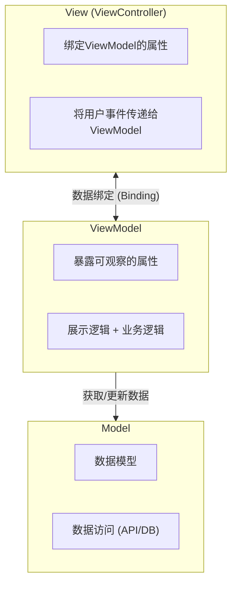
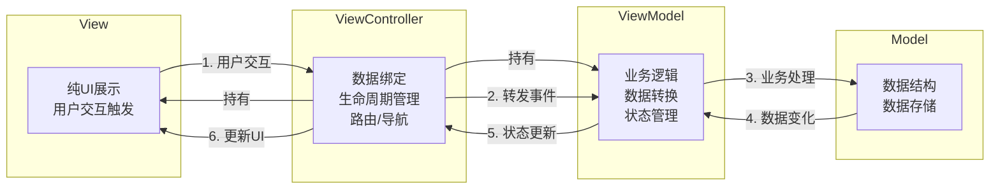
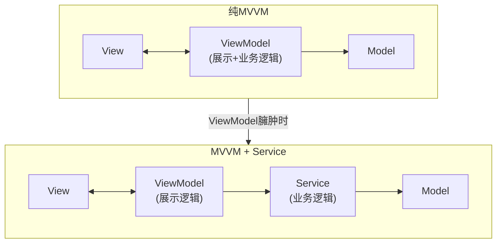
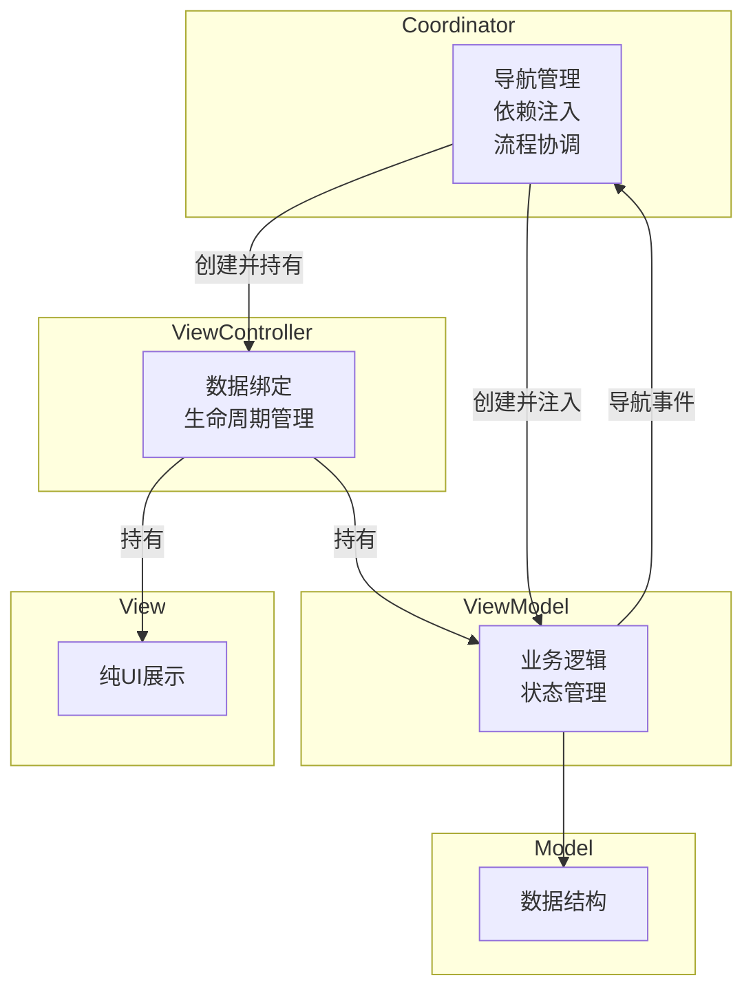
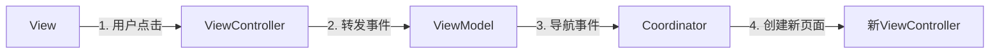

+++
title = "MVVM架构详解"
date = '2026-05-02T22:32:27+08:00'
draft = false
weight = 4
tags = ["iOS", "架构"]
categories = ["iOS开发", "架构"]
+++
## 什么是MVVM

MVVM（Model-View-ViewModel）是一种通过数据绑定实现View和业务逻辑解耦的架构模式。它最初由Microsoft提出，用于WPF开发，后来被广泛应用于iOS开发。

MVVM的核心特点是：
- **ViewModel不持有View的引用**
- **通过数据绑定实现View和ViewModel的同步**
- **View的状态完全由ViewModel驱动**

## MVVM的结构



## MVVM的数据流

MVVM的核心原则是：**View不直接访问Model**，所有交互都通过ViewModel进行。在iOS开发中，由于`UIViewController`的特殊地位，MVVM的数据流可以更细化为四个角色：



### 各层职责与持有关系

| 组件 | 职责 | 持有关系 |
|------|------|----------|
| **View** | 纯UI展示、触发用户交互事件 | 不持有其他层 |
| **ViewController** | 数据绑定、生命周期管理、持有View和ViewModel | 持有View和ViewModel |
| **ViewModel** | 业务逻辑、数据转换、状态管理 | 持有Model/Service |
| **Model** | 数据结构、数据存储 | 不持有其他层 |

### 详细数据流说明

1. **View → ViewController（用户交互）**
   - View捕获用户操作（按钮点击、文本输入等）
   - 通过Target-Action、Delegate或闭包传递给ViewController

2. **ViewController → ViewModel（事件转发）**
   - ViewController将用户事件转发给ViewModel
   - ViewController**不处理业务逻辑**

3. **ViewModel → Model（业务处理）**
   - ViewModel执行业务逻辑
   - ViewModel调用Model/Service获取或更新数据

4. **Model → ViewModel（数据变化）**
   - Model数据发生变化时通知ViewModel
   - Model不直接与View/ViewController通信

5. **ViewModel → ViewController（状态更新）**
   - ViewModel通过数据绑定通知ViewController状态变化
   - 绑定方式：Delegate、Closure、Combine、RxSwift

6. **ViewController → View（UI更新）**
   - ViewController根据ViewModel的状态更新View的显示

### 为什么ViewController负责数据绑定？

在iOS中，`UIViewController`承担了以下不可替代的职责：
- **生命周期管理**：`viewDidLoad`、`viewWillAppear`等
- **View层级管理**：持有和管理View
- **系统交互**：处理导航、弹窗、权限请求等

将数据绑定放在ViewController中，可以：
- 让View保持纯粹（只负责UI展示）
- 让ViewModel保持纯粹（不依赖UIKit）
- 便于在合适的生命周期时机建立/解除绑定

这种设计使得View和Model完全解耦，提高了可测试性、可维护性和可复用性。

## MVVM的三个组件

### Model（模型层）

在纯MVVM中，Model层负责：
- **数据模型定义**：数据结构
- **数据访问**：网络请求、数据库操作

```swift
// 数据模型
struct User: Identifiable, Codable {
    let id: Int
    let name: String
    let email: String
    let avatarURL: URL?
}

// 数据访问（可以是简单的API封装）
class UserAPI {
    func fetchUser(id: Int) async throws -> User {
        // 网络请求实现
    }
    
    func updateUser(_ user: User) async throws {
        // 更新用户实现
    }
}
```

### ViewModel（视图模型层）

ViewModel是MVVM的核心，在**纯MVVM**中，它负责：
- 暴露可观察的属性供View绑定
- 处理**展示逻辑**（数据格式化、UI状态管理）
- 处理**业务逻辑**（数据验证、业务规则）
- 调用Model获取/更新数据
- **不持有View的引用**

> **注意**：纯MVVM中业务逻辑放在ViewModel，这可能导致ViewModel臃肿。当项目变复杂时，可以引入Service层来分担业务逻辑。详见后文"ViewModel臃肿问题与解决方案"章节。

```swift
import RxSwift
import RxCocoa

class UserProfileViewModel {
    // 输出 - View绑定这些属性
    let userName = BehaviorRelay<String>(value: "")
    let isLoading = BehaviorRelay<Bool>(value: false)
    let errorMessage = PublishRelay<String>()
    
    private let userAPI: UserAPI
    private let disposeBag = DisposeBag()
    
    init(userAPI: UserAPI) {
        self.userAPI = userAPI
    }
    
    // 输入 - View调用这些方法
    func loadUser(id: Int) {
        isLoading.accept(true)
        userAPI.fetchUser(id: id)
            .observe(on: MainScheduler.instance)
            .subscribe(
                onSuccess: { [weak self] user in
                    self?.userName.accept(user.name)
                    self?.isLoading.accept(false)
                },
                onFailure: { [weak self] error in
                    self?.errorMessage.accept(error.localizedDescription)
                    self?.isLoading.accept(false)
                }
            )
            .disposed(by: disposeBag)
    }
}
```

### View（视图层）

View负责：
- 纯UI展示
- 触发用户交互事件（通过Target-Action、Delegate等传递给ViewController）

```swift
class UserProfileView: UIView {
    let nameLabel = UILabel()
    let editButton = UIButton(type: .system)
    // ... 其他UI组件
}
```

### ViewController（控制器层）

ViewController负责：
- 持有View和ViewModel
- 建立数据绑定
- 管理生命周期
- 处理路由/导航

```swift
class UserProfileViewController: UIViewController {
    private let profileView = UserProfileView()
    private let viewModel: UserProfileViewModel
    private let disposeBag = DisposeBag()
    
    override func viewDidLoad() {
        super.viewDidLoad()
        bindViewModel()
    }
    
    private func bindViewModel() {
        // ViewModel -> View 的绑定
        viewModel.userName
            .bind(to: profileView.nameLabel.rx.text)
            .disposed(by: disposeBag)
        
        // View -> ViewModel
        profileView.editButton.rx.tap
            .subscribe(onNext: { [weak self] in
                self?.viewModel.editProfile()
            })
            .disposed(by: disposeBag)
    }
}
```

## iOS中的数据绑定方式

### 1. RxSwift

第三方响应式框架，功能强大，社区活跃，支持iOS 9+。

```swift
import RxSwift
import RxCocoa

class ViewModel {
    // 输入
    let text = BehaviorRelay<String>(value: "")
    
    // 输出
    let isValid: Observable<Bool>
    
    init() {
        // 当text变化时，自动计算isValid
        isValid = text
            .map { $0.count >= 3 }
    }
}

// View中绑定
viewModel.text
    .bind(to: textField.rx.text)
    .disposed(by: disposeBag)

textField.rx.text.orEmpty
    .bind(to: viewModel.text)
    .disposed(by: disposeBag)
```

### 2. Combine

Apple官方的响应式框架，iOS 13+可用。

```swift
import Combine

class ViewModel: ObservableObject {
    @Published var text: String = ""
    @Published var isValid: Bool = false
    
    init() {
        $text
            .map { $0.count >= 3 }
            .assign(to: &$isValid)
    }
}

// View中绑定
viewModel.$text
    .sink { [weak self] text in
        self?.textField.text = text
    }
    .store(in: &cancellables)
```

### 3. 闭包回调

简单的绑定方式，不需要引入额外依赖。

**注意**：使用闭包时要注意循环引用，View持有ViewModel，ViewModel通过闭包回调View时要避免强引用。

```swift
class ViewModel {
    var onUserNameChanged: ((String) -> Void)?
    var onLoadingChanged: ((Bool) -> Void)?
    
    private(set) var userName: String = "" {
        didSet {
            onUserNameChanged?(userName)
        }
    }
    
    private(set) var isLoading: Bool = false {
        didSet {
            onLoadingChanged?(isLoading)
        }
    }
}

// View中绑定 - 注意使用 [weak self] 避免循环引用
viewModel.onUserNameChanged = { [weak self] name in
    self?.nameLabel.text = name
}

viewModel.onLoadingChanged = { [weak self] isLoading in
    self?.loadingIndicator.isAnimating = isLoading
}
```

### 4. KVO

传统的观察者模式，Objective-C时代的方式。

```swift
class ViewModel: NSObject {
    @objc dynamic var userName: String = ""
}

// View中观察
observation = viewModel.observe(\.userName, options: [.new]) { [weak self] _, change in
    self?.nameLabel.text = change.newValue
}
```

## SwiftUI中的MVVM

SwiftUI天然支持MVVM模式，通常基于 `ObservableObject` 协议和 `@Published`，并通过 `@StateObject` / `@ObservedObject` 建立视图订阅关系（基于 Combine）。

> **注意**：SwiftUI推荐使用Apple原生的Combine框架，因为`@Published`属性包装器是Combine的一部分。
>
> 自 Swift 5.9 起，也可以使用 `@Observable` 宏（Observation 框架）实现更细粒度观察，新项目可按团队技术栈选择。

```swift
// ViewModel
class UserListViewModel: ObservableObject {
    @Published var users: [User] = []
    @Published var isLoading = false
    @Published var errorMessage: String?
    
    private let userService: UserServiceProtocol
    
    init(userService: UserServiceProtocol = UserService()) {
        self.userService = userService
    }
    
    func loadUsers() {
        isLoading = true
        Task {
            do {
                let users = try await userService.fetchUsers()
                await MainActor.run {
                    self.users = users
                    self.isLoading = false
                }
            } catch {
                await MainActor.run {
                    self.errorMessage = error.localizedDescription
                    self.isLoading = false
                }
            }
        }
    }
    
    func deleteUser(at offsets: IndexSet) {
        users.remove(atOffsets: offsets)
    }
}

// View
struct UserListView: View {
    @StateObject private var viewModel = UserListViewModel()
    
    var body: some View {
        NavigationView {
            Group {
                if viewModel.isLoading {
                    ProgressView()
                } else if let error = viewModel.errorMessage {
                    Text(error)
                        .foregroundColor(.red)
                } else {
                    List {
                        ForEach(viewModel.users) { user in
                            UserRow(user: user)
                        }
                        .onDelete(perform: viewModel.deleteUser)
                    }
                }
            }
            .navigationTitle("用户列表")
            .onAppear {
                viewModel.loadUsers()
            }
        }
    }
}
```

## 完整示例：登录页面

```swift
// MARK: - ViewModel
class LoginViewModel {
    // 输入
    let email = BehaviorRelay<String>(value: "")
    let password = BehaviorRelay<String>(value: "")
    let loginTap = PublishRelay<Void>()
    
    // 输出
    let isLoginEnabled: Observable<Bool>
    let loginResult = PublishRelay<Result<User, Error>>()
    
    init() {
        // 邮箱和密码都有效时，登录按钮可用
        isLoginEnabled = Observable.combineLatest(
            email.map { $0.contains("@") },
            password.map { $0.count >= 6 }
        ).map { $0 && $1 }
    }
}

// MARK: - ViewController
class LoginViewController: UIViewController {
    private let viewModel = LoginViewModel()
    private let disposeBag = DisposeBag()
    
    override func viewDidLoad() {
        super.viewDidLoad()
        
        // 输入绑定
        emailTextField.rx.text.orEmpty.bind(to: viewModel.email).disposed(by: disposeBag)
        passwordTextField.rx.text.orEmpty.bind(to: viewModel.password).disposed(by: disposeBag)
        loginButton.rx.tap.bind(to: viewModel.loginTap).disposed(by: disposeBag)
        
        // 输出绑定
        viewModel.isLoginEnabled.bind(to: loginButton.rx.isEnabled).disposed(by: disposeBag)
    }
}
```

## MVVM的单元测试

ViewModel不依赖UIKit，可以轻松进行单元测试：

```swift
class LoginViewModelTests: XCTestCase {
    func testLoginEnabled() {
        let viewModel = LoginViewModel()
        let disposeBag = DisposeBag()
        var isEnabled = false
        
        viewModel.isLoginEnabled
            .subscribe(onNext: { isEnabled = $0 })
            .disposed(by: disposeBag)
        
        // 初始状态：不可用
        XCTAssertFalse(isEnabled)
        
        // 输入有效邮箱和密码后：可用
        viewModel.email.accept("test@example.com")
        viewModel.password.accept("123456")
        XCTAssertTrue(isEnabled)
    }
}
```

## MVVM最佳实践：Input/Output模式

将ViewModel的输入和输出明确分离，使数据流更清晰：

```swift
class ViewModel {
    struct Input {
        let loadTrigger: Observable<Void>
        let itemSelected: Observable<IndexPath>
    }
    
    struct Output {
        let items: Driver<[Item]>
        let isLoading: Driver<Bool>
    }
    
    func transform(input: Input) -> Output {
        // 将Input转换为Output...
    }
}

// ViewController中使用
let input = ViewModel.Input(
    loadTrigger: rx.viewWillAppear.mapToVoid(),
    itemSelected: tableView.rx.itemSelected.asObservable()
)
let output = viewModel.transform(input: input)
output.items.drive(tableView.rx.items(...)).disposed(by: disposeBag)
```

## ViewModel臃肿问题与解决方案

随着功能增加，ViewModel会承担越来越多的业务逻辑，导致：
- 代码难以维护
- 难以测试
- 难以复用

### 解决方案：引入Service层

当ViewModel变得臃肿时，可以将**业务逻辑抽取到Service层**：



### Service层示例

```swift
// Service - 封装业务逻辑
class UserService {
    func validateAndUpdateUser(_ user: User, newName: String) async throws -> User {
        guard newName.count >= 2 else { throw ValidationError.nameTooShort }
        // 其他业务验证...
        return try await userAPI.updateUser(user)
    }
}

// ViewModel - 调用Service，只负责状态管理
class UserProfileViewModel {
    let userName = BehaviorRelay<String>(value: "")
    private let userService: UserService
    
    func updateUserName(_ newName: String) {
        // 调用Service处理业务逻辑
        userService.validateAndUpdateUser(user, newName: newName)
            .subscribe(onSuccess: { [weak self] user in
                self?.userName.accept(user.name)
            })
            .disposed(by: disposeBag)
    }
}
```

## MVVM的优缺点

### 优点

1. **可测试性高**：ViewModel不依赖UIKit，可以轻松进行单元测试
2. **View和展示逻辑解耦**：ViewModel不持有View的引用，数据流边界清晰（多数场景以单向数据驱动为主）
3. **数据驱动**：View的状态完全由ViewModel驱动，易于理解和调试
4. **代码复用**：ViewModel可以被多个View复用
5. **SwiftUI友好**：SwiftUI原生支持MVVM模式

### 缺点

1. **学习曲线陡峭**：需要理解响应式编程和数据绑定概念
2. **调试相对困难**：数据流可能变得复杂，难以追踪数据变化链
3. **过度设计风险**：简单页面使用MVVM可能增加不必要的复杂度
4. **内存管理复杂**：需要注意Combine/RxSwift中的循环引用和内存泄漏
5. **ViewModel可能膨胀**：复杂页面的ViewModel可能变得很大，需要进一步拆分

## MVVM的导航问题与MVVM-C

在MVVM架构中，导航逻辑的归属是一个常见问题：

| 方案 | 优点 | 缺点 |
|------|------|------|
| **放在ViewController** | 简单直接 | ViewController职责过重，难以测试 |
| **放在ViewModel** | 便于测试 | ViewModel依赖UIKit，违背MVVM原则 |

两种方案都有明显的缺陷，因此演进出了 **MVVM-C（MVVM + Coordinator）** 架构。

### 什么是MVVM-C

MVVM-C在MVVM的基础上引入了**Coordinator（协调器）**，专门负责导航逻辑：



### Coordinator的职责

1. **导航管理**：决定显示哪个ViewController，处理push、present、dismiss等
2. **依赖注入**：创建ViewController和ViewModel，注入所需依赖
3. **流程协调**：管理业务流程（如登录流程、购买流程）
4. **解耦ViewController**：ViewController之间不直接引用，通过Coordinator协调

### MVVM-C实现示例

```swift
// MARK: - Coordinator协议
protocol Coordinator: AnyObject {
    var childCoordinators: [Coordinator] { get set }
    var navigationController: UINavigationController { get }
    func start()
}

// MARK: - App主Coordinator
class AppCoordinator: Coordinator {
    var childCoordinators: [Coordinator] = []
    var navigationController: UINavigationController
    
    init(navigationController: UINavigationController) {
        self.navigationController = navigationController
    }
    
    func start() {
        showUserList()
    }
    
    private func showUserList() {
        let coordinator = UserListCoordinator(navigationController: navigationController)
        coordinator.delegate = self
        childCoordinators.append(coordinator)
        coordinator.start()
    }
}

extension AppCoordinator: UserListCoordinatorDelegate {
    func userListCoordinatorDidFinish(_ coordinator: UserListCoordinator) {
        childCoordinators.removeAll { $0 === coordinator }
    }
}

// MARK: - UserList模块的Coordinator
protocol UserListCoordinatorDelegate: AnyObject {
    func userListCoordinatorDidFinish(_ coordinator: UserListCoordinator)
}

class UserListCoordinator: Coordinator {
    var childCoordinators: [Coordinator] = []
    var navigationController: UINavigationController
    weak var delegate: UserListCoordinatorDelegate?
    
    init(navigationController: UINavigationController) {
        self.navigationController = navigationController
    }
    
    func start() {
        let viewModel = UserListViewModel()
        viewModel.coordinatorDelegate = self  // ViewModel通过delegate通知Coordinator
        let viewController = UserListViewController(viewModel: viewModel)
        navigationController.pushViewController(viewController, animated: true)
    }
    
    private func showUserDetail(user: User) {
        let viewModel = UserDetailViewModel(user: user)
        viewModel.coordinatorDelegate = self
        let viewController = UserDetailViewController(viewModel: viewModel)
        navigationController.pushViewController(viewController, animated: true)
    }
}

// MARK: - ViewModel通知Coordinator导航事件
protocol UserListViewModelCoordinatorDelegate: AnyObject {
    func userListViewModelDidSelectUser(_ user: User)
}

extension UserListCoordinator: UserListViewModelCoordinatorDelegate {
    func userListViewModelDidSelectUser(_ user: User) {
        showUserDetail(user: user)
    }
}

// MARK: - ViewModel
class UserListViewModel {
    weak var coordinatorDelegate: UserListViewModelCoordinatorDelegate?
    
    // 用户选择时，通知Coordinator处理导航
    func selectUser(at index: Int) {
        let user = users.value[index]
        coordinatorDelegate?.userListViewModelDidSelectUser(user)
    }
}
```

### MVVM-C的数据流



### MVVM-C的优缺点

**优点**：
1. **导航逻辑集中管理**：易于理解和维护复杂的导航流程
2. **ViewController解耦**：页面之间不直接依赖，提高复用性
3. **便于测试**：Coordinator可以单独测试导航逻辑
4. **依赖注入清晰**：Coordinator负责创建和注入依赖

**缺点**：
1. **增加复杂度**：需要额外的Coordinator类
2. **代码量增加**：每个流程需要对应的Coordinator
3. **学习成本**：团队需要理解Coordinator模式

## MVVM vs MVP

| 特性 | MVP | MVVM |
|------|-----|------|
| View和Presenter/ViewModel的关系 | Presenter持有View的引用 | ViewModel不持有View的引用 |
| 通信方式 | 通过协议调用 | 通过数据绑定 |
| 代码量 | 需要定义View协议 | 需要设置绑定 |
| 响应式编程 | 不需要 | 通常需要 |
| 学习曲线 | 相对简单 | 需要学习响应式编程 |

### 为什么MVVM比MVP更流行

在iOS开发中，MVVM逐渐成为主流架构，主要原因如下：

**1. 数据绑定减少样板代码**

```swift
// MVP: Presenter需要手动调用View的方法更新UI
class UserPresenter {
    weak var view: UserViewProtocol?
    
    func loadUser() {
        userService.fetchUser { [weak self] user in
            self?.view?.showUserName(user.name)      // 手动调用
            self?.view?.showUserEmail(user.email)    // 手动调用
            self?.view?.showUserAvatar(user.avatar)  // 手动调用
        }
    }
}

// MVVM: 数据变化自动同步到View
class UserViewModel {
    let userName = BehaviorRelay<String>(value: "")
    let userEmail = BehaviorRelay<String>(value: "")
    
    func loadUser() {
        userService.fetchUser { [weak self] user in
            self?.userName.accept(user.name)   // View自动更新
            self?.userEmail.accept(user.email) // View自动更新
        }
    }
}
```

**2. 响应式编程支持**

MVVM天然适配RxSwift、Combine等响应式框架，可以轻松处理：
- 多个数据源的组合
- 数据流的转换和过滤
- 异步操作的链式调用

```swift
// MVVM + RxSwift: 优雅地处理复杂数据流
let isLoginEnabled = Observable.combineLatest(isEmailValid, isPasswordValid)
    .map { $0 && $1 }
```

**3. SwiftUI原生支持**

SwiftUI的`@Published`、`@StateObject`、`@ObservedObject`等属性包装器天然支持MVVM模式，使MVVM成为SwiftUI开发的首选架构。

```swift
// SwiftUI + MVVM: 原生支持
class ViewModel: ObservableObject {
    @Published var items: [Item] = []
}

struct ContentView: View {
    @StateObject var viewModel = ViewModel()
    
    var body: some View {
        List(viewModel.items) { item in
            Text(item.name)
        }
    }
}
```

**4. 更好的解耦**

| 方面 | MVP | MVVM |
|------|-----|------|
| Presenter/ViewModel对View的依赖 | 持有View引用（通过协议） | 不持有View引用 |
| 测试时的Mock | 需要Mock View协议 | 无需Mock View |
| 复用性 | Presenter与View协议绑定 | ViewModel可被多个View复用 |

**5. 行业趋势**

- Apple推出的Combine框架和SwiftUI都采用响应式+MVVM思想
- RxSwift在iOS社区的广泛采用
- 大厂（如Uber、Airbnb）的技术分享多采用MVVM
