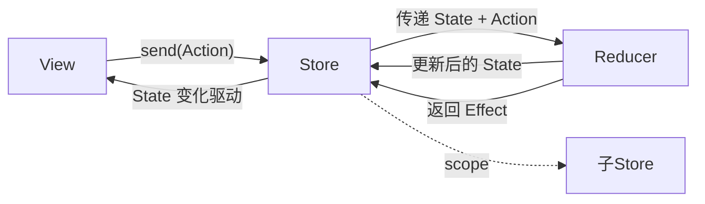
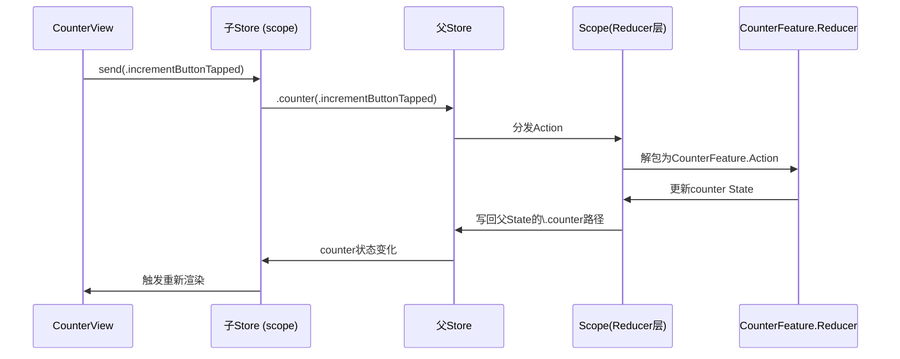
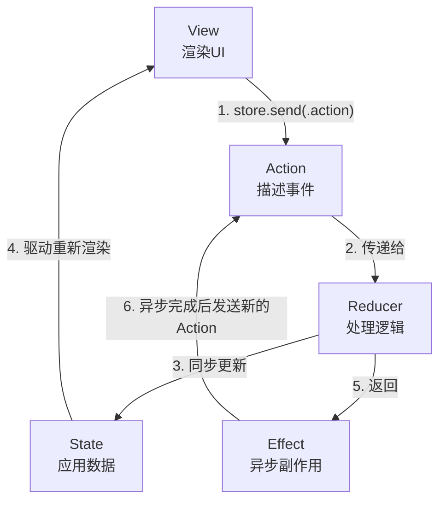

+++
title = "TCA（The Composable Architecture）详解"
date = '2026-05-02T22:32:27+08:00'
draft = false
weight = 5
tags = ["iOS", "架构"]
categories = ["iOS开发", "架构"]
+++
## 什么是TCA

TCA（The Composable Architecture）是由[Point-Free](https://www.pointfree.co)团队开发的Swift架构框架，受[Elm](https://elm-lang.org)和[Redux](https://redux.js.org/)启发，为Apple平台提供了一套完整的应用构建工具，涵盖状态管理、副作用处理、模块化组合以及测试支持。

- **GitHub仓库**：[swift-composable-architecture](https://github.com/pointfreeco/swift-composable-architecture)
- **适用平台**：iOS、macOS、iPadOS、visionOS、tvOS、watchOS
- **适用UI框架**：SwiftUI、UIKit

TCA的核心理念是：将应用状态、变更动作、副作用和依赖显式化，构建可组合、可测试的**单向数据流**架构。整体架构与Swift的语言特性（值语义、async/await、Observation、SwiftUI）紧密结合，强调小而纯的Reducer组合与明确的副作用管理。

### 为什么需要TCA

在日常iOS开发中，TCA解决了以下核心问题：

- **状态管理**：使用简单的值类型管理应用状态，支持在多个屏幕间共享状态，使一个屏幕的修改能立即反映到另一个屏幕
- **组合性**：将大型功能拆分成可独立开发、独立测试的小组件，提取到独立模块后可轻松组合回完整功能
- **副作用处理**：以最可测试和可理解的方式让应用的某些部分与外部世界通信
- **测试能力**：不仅能测试单个功能，还能编写由多个部分组成的功能的集成测试，以及端到端测试来验证副作用如何影响应用
- **人机工程学**：用尽可能少的概念和组成部分，通过简单的API实现以上所有目标

### TCA的架构渊源

TCA的设计灵感主要来自Elm Architecture和Redux，同时与[MVI架构](./MVI.md)思想有诸多相似之处，但在Swift生态中进行了大量增强：

| 特性 | Elm/Redux/MVI | TCA |
|-----|--------------|-----|
| 核心思想 | Action -> State -> View 单向数据流 | 同样的单向数据流，但深度融合Swift特性 |
| 副作用处理 | 自定义Middleware或自行实现 | 内置Effect系统（基于async/await） |
| 依赖注入 | 需手动实现 | 内置@Dependency系统 |
| 测试支持 | 需自己构建 | 提供TestStore，支持穷尽式断言 |
| 组合能力 | 基础支持 | Scope、forEach等丰富的Reducer组合手段 |
| 导航管理 | 需自己实现 | 内置状态化导航系统 |
| 状态共享 | 需自己实现 | 内置@Shared系统 |

## TCA的核心概念

TCA包含以下核心概念：

- **Feature**：一个功能模块的整体单元，由`@Reducer`标注，内含State、Action和Reducer
- **State**：描述功能所需的数据
- **Action**：功能中可能发生的所有事件
- **Reducer**：接收State和Action，更新State并产生副作用（Effect）
- **Store**：持有State、驱动Reducer执行的运行时
- **Scope**：从父Store中切出子Store，实现Feature的模块化组合
- **Effect**：封装异步操作的副作用
- **Dependency**：可替换的外部依赖

它们之间的协作关系如下：



### State（状态）

State是描述功能模块在某一时刻全部数据的值类型结构体：

```swift
import ComposableArchitecture

@Reducer
struct CounterFeature {
    @ObservableState
    struct State: Equatable {
        var count: Int = 0
        var isLoading: Bool = false
        var error: String?
    }
}
```

**设计原则**：

- **值类型（struct）**：利用Swift的值语义，天然保证状态的可预测性
- **Equatable**：便于比较状态变化，TCA内部据此优化视图更新
- **最小化**：只包含渲染UI和驱动业务逻辑所必需的数据，避免冗余

**@ObservableState宏**：自动生成观察逻辑，提供细粒度的视图更新 -- 只有被视图实际访问的属性发生变化时，才会触发该视图重新渲染。虽然Apple原生的Observation框架需要iOS 17+，但TCA通过Point-Free开发的[Perception](https://github.com/pointfreeco/swift-perception)库实现了向后兼容，`@ObservableState`在**iOS 13+**即可使用。需要注意的是，在iOS 16及更早版本上，View的`body`需要用`WithPerceptionTracking`包裹才能正确追踪状态变化。

**@Reducer宏**：应用在Feature结构体上，自动生成遵循`Reducer`协议所需的样板代码，包括为Action枚举生成`CasePathable`一致性（使TCA能用KeyPath语法访问枚举case）等。

### Action（动作）

Action是枚举类型，描述功能模块中所有可能发生的事件：

```swift
@Reducer
struct CounterFeature {
    enum Action {
        // 用户意图
        case incrementButtonTapped
        case decrementButtonTapped
        case factButtonTapped
        
        // 异步响应
        case factResponse(Result<String, Error>)
        case timerTicked
        
        // 生命周期
        case onAppear
        case onDisappear
    }
}
```

**命名规范**：TCA推荐Action命名描述"发生了什么"而非"要做什么"：

- 用户操作：过去式 + 具体控件，如`incrementButtonTapped`
- 异步响应：描述事件本身，如`factResponse`、`timerTicked`
- 生命周期：使用`on`前缀，如`onAppear`

这种命名方式使Action更像事件日志，有利于调试和理解数据流。

### Reducer（归约器）

Reducer是核心业务逻辑的载体，决定如何根据Action更新State，并返回需要执行的副作用（Effect）：

```swift
@Reducer
struct CounterFeature {
    @ObservableState
    struct State: Equatable {
        var count = 0
        var numberFact: String?
    }
    
    enum Action {
        case decrementButtonTapped
        case incrementButtonTapped
        case factButtonTapped
        case factResponse(String)
    }
    
    var body: some ReducerOf<Self> {
        Reduce { state, action in
            switch action {
            case .decrementButtonTapped:
                state.count -= 1
                return .none
                
            case .incrementButtonTapped:
                state.count += 1
                return .none
                
            case .factButtonTapped:
                return .run { [count = state.count] send in
                    let (data, _) = try await URLSession.shared.data(
                        from: URL(string: "http://numbersapi.com/\(count)/trivia")!
                    )
                    let fact = String(decoding: data, as: UTF8.self)
                    await send(.factResponse(fact))
                }
                
            case let .factResponse(fact):
                state.numberFact = fact
                return .none
            }
        }
    }
}
```

**Reducer的执行规则**：

1. 接收当前`state`（以`inout`方式传入，可直接修改）和`action`
2. 根据action**同步**更新state
3. 返回`Effect`（副作用）或`.none`
4. **必须处理所有action case**，即使只是返回`.none`

注意：`.run`闭包中需要通过`[count = state.count]`捕获值，因为`state`是`inout`参数，不能在异步闭包中直接引用。

### Store（存储）

Store是驱动功能模块的运行时，职责包括：

- 持有当前State
- 接收Action并传递给Reducer
- 执行Reducer返回的Effect
- 通知视图状态变化

```swift
// 创建Store
let store = Store(initialState: CounterFeature.State()) {
    CounterFeature()
}

// StoreOf是常用的类型别名
let store: StoreOf<CounterFeature>
// 等价于
let store: Store<CounterFeature.State, CounterFeature.Action>
```

### Feature（功能模块）

Feature是TCA中一个功能模块的整体单元。一个由`@Reducer`标注的结构体，内部包含该模块完整的State、Action和Reducer逻辑，就构成一个Feature：

```swift
@Reducer
struct CounterFeature {        // 这就是一个Feature
    struct State { ... }       // 该功能的状态
    enum Action { ... }        // 该功能的事件
    var body: some ReducerOf<Self> { ... }  // 该功能的逻辑
}
```

Feature之间可以嵌套形成**父子关系** -- 父Feature的State中包含子Feature的State，Action中包装子Feature的Action：

```swift
@Reducer
struct AppFeature {                           // 父Feature
    @ObservableState
    struct State {
        var counter = CounterFeature.State()  // 嵌套子Feature的状态
        var profile = ProfileFeature.State()
    }
    
    enum Action {
        case counter(CounterFeature.Action)   // 包装子Feature的Action
        case profile(ProfileFeature.Action)
    }
}
```

这种嵌套使每个Feature可以独立开发、独立测试，最终组合成完整应用。

### Scope（作用域）

Scope是TCA实现模块化的关键机制，解决的核心问题是：**父Feature持有一个大的State和Action，而子Feature只需要其中一小部分，如何安全地将这一小部分"切"出来给子Feature使用？**

#### 问题场景

假设AppFeature组合了Counter和Profile两个子Feature：

```swift
@Reducer
struct AppFeature {
    @ObservableState
    struct State {
        var counter = CounterFeature.State()   // 子Feature的状态
        var profile = ProfileFeature.State()
    }
    enum Action {
        case counter(CounterFeature.Action)    // 子Feature的Action被包装
        case profile(ProfileFeature.Action)
    }
}
```

此时AppFeature的Store类型是`StoreOf<AppFeature>`，但`CounterView`需要的是`StoreOf<CounterFeature>`。直接传递类型不匹配，也不应该让子View看到兄弟Feature的状态。

#### store.scope -- View层的Scope

`store.scope(state:action:)`从父Store中映射出一个子Store：

```swift
let counterStore = store.scope(state: \.counter, action: \.counter)
```

这行代码做了两件事：

1. **状态映射**（`state: \.counter`）：从父State中取出`counter`字段，子Store只能看到`CounterFeature.State`
2. **Action映射**（`action: \.counter`）：子Store发送的Action会自动包装为`AppFeature.Action.counter(...)`回传给父Store

返回值类型是`StoreOf<CounterFeature>`，子View拿到后就像拥有一个独立的Store，完全不知道父Feature的存在：

```swift
// SwiftUI
CounterView(store: store.scope(state: \.counter, action: \.counter))

// UIKit
let counterVC = CounterViewController(
    store: store.scope(state: \.counter, action: \.counter)
)
```

#### Scope构建器 -- Reducer层的Scope

在Reducer的`body`中，使用`Scope`构建器将子Reducer接入父Reducer的处理链：

```swift
var body: some ReducerOf<Self> {
    Scope(state: \.counter, action: \.counter) {
        CounterFeature()
    }
    Scope(state: \.profile, action: \.profile) {
        ProfileFeature()
    }
    Reduce { state, action in
        // 父Reducer自身的逻辑
    }
}
```

当一个`.counter(...)` Action到来时，`Scope`构建器会自动将其"解包"为`CounterFeature.Action`，交给`CounterFeature`的Reducer处理，并将结果写回父State的`\.counter`路径。

#### 数据流全貌

将Reducer层和View层的Scope结合起来看，一次完整的子Feature交互流程如下：



#### 除了Scope还有forEach和ifLet

TCA提供了三种主要的Reducer组合方式，适用于不同的子Feature关系：

| 方式 | 适用场景 | 示例 |
|-----|---------|------|
| `Scope` | 固定的一对一嵌套 | 设置页中嵌套Profile子页 |
| `.forEach` | 一对多集合 | Todo列表中的每个Todo项 |
| `.ifLet` | 可选的子Feature | 弹窗、Sheet等可能存在也可能不存在的子状态 |

这三种方式在后续的实战示例和高级特性中都会有具体展示。

### Effect（副作用）

Effect封装了异步操作和副作用，基于Swift的async/await构建：

```swift
// 1. 无副作用
return .none

// 2. 异步任务
return .run { send in
    let data = try await fetchData()
    await send(.dataLoaded(data))
}

// 3. 可取消的任务
return .run { send in
    for await value in stream {
        await send(.streamValue(value))
    }
}
.cancellable(id: CancelID.stream)

// 4. 取消指定任务
return .cancel(id: CancelID.stream)

// 5. 合并多个Effect（并行执行）
return .merge(
    .run { send in await send(.effect1) },
    .run { send in await send(.effect2) }
)

// 6. 串联多个Effect（顺序执行）
return .concatenate(
    .run { send in await send(.first) },
    .run { send in await send(.second) }
)
```

**防抖搜索 -- Effect取消的典型应用**：

```swift
@Reducer
struct SearchFeature {
    enum CancelID { case search }
    
    @ObservableState
    struct State: Equatable {
        var query = ""
        var results: [String] = []
    }
    
    enum Action {
        case searchQueryChanged(String)
        case searchResponse([String])
    }
    
    var body: some ReducerOf<Self> {
        Reduce { state, action in
            switch action {
            case .searchQueryChanged(let query):
                state.query = query
                guard !query.isEmpty else {
                    state.results = []
                    return .cancel(id: CancelID.search)
                }
                return .run { send in
                    try await Task.sleep(for: .milliseconds(300))
                    let results = try await performSearch(query)
                    await send(.searchResponse(results))
                }
                .cancellable(id: CancelID.search, cancelInFlight: true)
                
            case .searchResponse(let results):
                state.results = results
                return .none
            }
        }
    }
}
```

`cancelInFlight: true`表示每次产生新的同id Effect时，自动取消正在执行的旧Effect，配合`Task.sleep`实现防抖效果。

### Dependency（依赖注入）

TCA内置了完整的依赖注入系统，使外部依赖（网络、数据库、系统API等）可以在生产、测试、预览三种环境下自由替换。

**第一步：定义依赖客户端**

```swift
struct NumberFactClient {
    var fetch: (Int) async throws -> String
}
```

**第二步：实现DependencyKey并注册**

```swift
extension NumberFactClient: DependencyKey {
    static let liveValue = NumberFactClient(
        fetch: { number in
            let (data, _) = try await URLSession.shared.data(
                from: URL(string: "http://numbersapi.com/\(number)/trivia")!
            )
            return String(decoding: data, as: UTF8.self)
        }
    )
}

extension DependencyValues {
    var numberFact: NumberFactClient {
        get { self[NumberFactClient.self] }
        set { self[NumberFactClient.self] = newValue }
    }
}
```

**第三步：在Reducer中使用**

```swift
@Reducer
struct CounterFeature {
    @Dependency(\.numberFact) var numberFact
    
    var body: some ReducerOf<Self> {
        Reduce { state, action in
            switch action {
            case .factButtonTapped:
                return .run { [count = state.count] send in
                    let fact = try await numberFact.fetch(count)
                    await send(.factResponse(fact))
                }
            // ...
            }
        }
    }
}
```

**依赖的三个Value**：

| Value | 用途 | 说明 |
|-------|-----|------|
| `liveValue` | 生产环境 | 必须实现，真实的网络请求/系统调用 |
| `testValue` | 测试环境 | 未实现时在测试中调用会直接失败，强制开发者显式mock |
| `previewValue` | SwiftUI预览 | 可选，为Preview提供固定数据 |

## TCA的数据流

TCA采用严格的单向数据流，保证了状态变化的可预测性：



**执行流程详解**：

1. **View发送Action**：用户交互触发`store.send(.buttonTapped)`
2. **Reducer接收Action**：Store将Action传递给Reducer
3. **同步更新State**：Reducer根据Action修改State（这一步是同步的、纯粹的）
4. **驱动View更新**：State变化触发View重新渲染（SwiftUI通过Observation/Perception自动完成；UIKit通过`observe`闭包手动绑定）
5. **执行Effect**：Reducer返回的Effect被Store异步执行
6. **Effect回馈**：Effect完成后通过`send`发送新的Action，回到步骤2，形成闭环

## 在SwiftUI中使用TCA

可以直接在View中访问`store`的属性，无需额外包装：

```swift
struct CounterView: View {
    let store: StoreOf<CounterFeature>
    
    var body: some View {
        VStack(spacing: 20) {
            HStack(spacing: 20) {
                Button("-") { store.send(.decrementButtonTapped) }
                Text("\(store.count)").font(.title)
                Button("+") { store.send(.incrementButtonTapped) }
            }
            .font(.largeTitle)
            
            Button("Get fact") { store.send(.factButtonTapped) }
                .disabled(store.isLoadingFact)
            
            if store.isLoadingFact {
                ProgressView()
            } else if let fact = store.numberFact {
                Text(fact).font(.caption)
            }
        }
    }
}
```

**iOS 16及更低版本的适配**：

在iOS 17+上，`@ObservableState`直接使用原生Observation框架，无需额外处理。但在iOS 13~16上，需要用`WithPerceptionTracking`包裹View的body内容，否则状态变化不会触发视图更新：

```swift
struct CounterView: View {
    let store: StoreOf<CounterFeature>
    
    var body: some View {
        WithPerceptionTracking {
            VStack(spacing: 20) {
                HStack(spacing: 20) {
                    Button("-") { store.send(.decrementButtonTapped) }
                    Text("\(store.count)").font(.title)
                    Button("+") { store.send(.incrementButtonTapped) }
                }
                .font(.largeTitle)
            }
        }
    }
}
```

如果遗漏了`WithPerceptionTracking`，TCA会在DEBUG模式下产生紫色的运行时警告提示。建议的开发流程是：在iOS 17模拟器上正常开发（无性能损耗），然后在iOS 16模拟器上运行一次确认没有遗漏的`WithPerceptionTracking`。

**双向绑定**：

当需要将State绑定到SwiftUI控件（如`TextField`）时，需要在`store`上使用`@Bindable`：

```swift
struct TodoListView: View {
    @Bindable var store: StoreOf<TodoListFeature>
    
    var body: some View {
        TextField("New todo", text: $store.newTodoTitle.sending(\.newTodoTitleChanged))
    }
}
```

`$store.newTodoTitle.sending(\.newTodoTitleChanged)`表示：当文本变化时，自动发送`newTodoTitleChanged` Action。

## 在UIKit中使用TCA

TCA的Reducer、State、Action、Effect、Dependency等核心概念与UI框架无关，完全可以在UIKit中使用。差异仅在于View层如何观察State变化和发送Action。

### 基础用法

TCA在UIKit中提供了`observe`方法，直接在UIViewController中观察状态变化：

```swift
import ComposableArchitecture
import UIKit

class CounterViewController: UIViewController {
    let store: StoreOf<CounterFeature>
    
    private let countLabel = UILabel()
    private let decrementButton = UIButton(type: .system)
    private let incrementButton = UIButton(type: .system)
    private let factLabel = UILabel()
    
    init(store: StoreOf<CounterFeature>) {
        self.store = store
        super.init(nibName: nil, bundle: nil)
    }
    
    required init?(coder: NSCoder) {
        fatalError("init(coder:) has not been implemented")
    }
    
    override func viewDidLoad() {
        super.viewDidLoad()
        setupUI()
        
        observe { [weak self] in
            guard let self else { return }
            countLabel.text = "\(store.count)"
            factLabel.text = store.numberFact
            factLabel.isHidden = store.numberFact == nil
        }
    }
    
    private func setupUI() {
        // 布局代码省略...
        decrementButton.setTitle("-", for: .normal)
        incrementButton.setTitle("+", for: .normal)
        
        decrementButton.addTarget(self, action: #selector(decrementTapped), for: .touchUpInside)
        incrementButton.addTarget(self, action: #selector(incrementTapped), for: .touchUpInside)
    }
    
    @objc private func decrementTapped() {
        store.send(.decrementButtonTapped)
    }
    
    @objc private func incrementTapped() {
        store.send(.incrementButtonTapped)
    }
}
```

**核心要点**：

- `observe { ... }`闭包会在其中访问的State属性发生变化时自动重新执行，类似SwiftUI的body
- 闭包内部访问了`store.count`和`store.numberFact`，因此只有这两个属性变化时才会触发回调
- 发送Action直接调用`store.send()`，与SwiftUI完全相同
- `observe`方法在iOS 13+即可使用（通过Perception库向后兼容）

### 在UIKit中使用Scope

与SwiftUI一样，通过`store.scope`获取子Store传递给子ViewController：

```swift
class AppViewController: UIViewController {
    let store: StoreOf<AppFeature>
    
    override func viewDidLoad() {
        super.viewDidLoad()
        
        let counterVC = CounterViewController(
            store: store.scope(state: \.counter, action: \.counter)
        )
        addChild(counterVC)
        view.addSubview(counterVC.view)
        counterVC.didMove(toParent: self)
    }
}
```

### SwiftUI与UIKit混合使用

在实际项目中，通常存在SwiftUI和UIKit混合使用的情况。TCA的Store可以在两者之间无缝传递：

```swift
// UIKit中嵌入SwiftUI View
class HostingController: UIViewController {
    let store: StoreOf<CounterFeature>
    
    override func viewDidLoad() {
        super.viewDidLoad()
        let swiftUIView = CounterView(store: store)
        let hostingController = UIHostingController(rootView: swiftUIView)
        addChild(hostingController)
        view.addSubview(hostingController.view)
        hostingController.didMove(toParent: self)
    }
}

// SwiftUI中使用UIKit ViewController
struct CounterUIKitWrapper: UIViewControllerRepresentable {
    let store: StoreOf<CounterFeature>
    
    func makeUIViewController(context: Context) -> CounterViewController {
        CounterViewController(store: store)
    }
    
    func updateUIViewController(_ uiViewController: CounterViewController, context: Context) {}
}
```

由于Reducer层完全与UI框架无关，同一个Feature可以同时拥有SwiftUI和UIKit两套View实现，便于渐进式迁移。

## 实战示例

### 示例1：完整Counter

包含Reducer、SwiftUI View和Dependency定义：

```swift
import ComposableArchitecture
import SwiftUI

// MARK: - Feature

@Reducer
struct CounterFeature {
    @ObservableState
    struct State: Equatable {
        var count = 0
        var numberFact: String?
        var isLoadingFact = false
    }
    
    enum Action {
        case decrementButtonTapped
        case incrementButtonTapped
        case factButtonTapped
        case factResponse(Result<String, Error>)
    }
    
    @Dependency(\.numberFact) var numberFact
    
    var body: some ReducerOf<Self> {
        Reduce { state, action in
            switch action {
            case .decrementButtonTapped:
                state.count -= 1
                state.numberFact = nil
                return .none
                
            case .incrementButtonTapped:
                state.count += 1
                state.numberFact = nil
                return .none
                
            case .factButtonTapped:
                state.isLoadingFact = true
                state.numberFact = nil
                return .run { [count = state.count] send in
                    await send(.factResponse(
                        Result { try await numberFact.fetch(count) }
                    ))
                }
                
            case .factResponse(.success(let fact)):
                state.isLoadingFact = false
                state.numberFact = fact
                return .none
                
            case .factResponse(.failure):
                state.isLoadingFact = false
                state.numberFact = "Failed to load fact"
                return .none
            }
        }
    }
}

// MARK: - SwiftUI View

struct CounterView: View {
    let store: StoreOf<CounterFeature>
    
    var body: some View {
        VStack(spacing: 20) {
            HStack(spacing: 20) {
                Button("-") { store.send(.decrementButtonTapped) }
                Text("\(store.count)").font(.title)
                Button("+") { store.send(.incrementButtonTapped) }
            }
            .font(.largeTitle)
            
            Button("Get fact") { store.send(.factButtonTapped) }
                .disabled(store.isLoadingFact)
            
            if store.isLoadingFact {
                ProgressView()
            } else if let fact = store.numberFact {
                Text(fact).font(.caption)
            }
        }
    }
}

// MARK: - Dependency

struct NumberFactClient {
    var fetch: (Int) async throws -> String
}

extension NumberFactClient: DependencyKey {
    static let liveValue = NumberFactClient(
        fetch: { number in
            let (data, _) = try await URLSession.shared.data(
                from: URL(string: "http://numbersapi.com/\(number)/trivia")!
            )
            return String(decoding: data, as: UTF8.self)
        }
    )
}

extension DependencyValues {
    var numberFact: NumberFactClient {
        get { self[NumberFactClient.self] }
        set { self[NumberFactClient.self] = newValue }
    }
}
```

### 示例2：父子Feature组合（Todo列表）

展示`Scope`和`forEach`进行Feature组合：

```swift
// MARK: - 子Feature

@Reducer
struct TodoFeature {
    @ObservableState
    struct State: Equatable, Identifiable {
        let id: UUID
        var title: String
        var isCompleted: Bool
    }
    
    enum Action {
        case toggleCompleted
        case titleChanged(String)
    }
    
    var body: some ReducerOf<Self> {
        Reduce { state, action in
            switch action {
            case .toggleCompleted:
                state.isCompleted.toggle()
                return .none
            case .titleChanged(let title):
                state.title = title
                return .none
            }
        }
    }
}

// MARK: - 父Feature

@Reducer
struct TodoListFeature {
    @ObservableState
    struct State: Equatable {
        var todos: IdentifiedArrayOf<TodoFeature.State> = []
        var newTodoTitle = ""
    }
    
    enum Action {
        case addTodoButtonTapped
        case deleteTodos(IndexSet)
        case newTodoTitleChanged(String)
        case todos(IdentifiedActionOf<TodoFeature>)
    }
    
    @Dependency(\.uuid) var uuid
    
    var body: some ReducerOf<Self> {
        Reduce { state, action in
            switch action {
            case .addTodoButtonTapped:
                guard !state.newTodoTitle.isEmpty else { return .none }
                state.todos.insert(
                    TodoFeature.State(
                        id: uuid(),
                        title: state.newTodoTitle,
                        isCompleted: false
                    ),
                    at: 0
                )
                state.newTodoTitle = ""
                return .none
                
            case .deleteTodos(let indexSet):
                state.todos.remove(atOffsets: indexSet)
                return .none
                
            case .newTodoTitleChanged(let title):
                state.newTodoTitle = title
                return .none
                
            case .todos:
                return .none
            }
        }
        .forEach(\.todos, action: \.todos) {
            TodoFeature()
        }
    }
}

// MARK: - SwiftUI View

struct TodoListView: View {
    @Bindable var store: StoreOf<TodoListFeature>
    
    var body: some View {
        List {
            HStack {
                TextField("New todo", text: $store.newTodoTitle.sending(\.newTodoTitleChanged))
                Button("Add") { store.send(.addTodoButtonTapped) }
            }
            
            ForEach(store.scope(state: \.todos, action: \.todos)) { todoStore in
                HStack {
                    Button {
                        todoStore.send(.toggleCompleted)
                    } label: {
                        Image(systemName: todoStore.isCompleted ? "checkmark.circle.fill" : "circle")
                    }
                    Text(todoStore.title)
                        .strikethrough(todoStore.isCompleted)
                }
            }
            .onDelete { store.send(.deleteTodos($0)) }
        }
    }
}
```

**组合关键点**：

- `IdentifiedArrayOf`：TCA提供的有序字典集合，通过id高效查找元素
- `IdentifiedActionOf`：为子Feature的Action自动附加id，使父Feature知道是哪个子元素触发了Action
- `.forEach(\.todos, action: \.todos)`：将子Reducer自动应用到集合中的每个元素

## 高级特性

### Navigation（导航）

TCA将导航状态化，使导航逻辑可测试、可预测。

**Stack-based导航**（NavigationStack，iOS 16+）：

```swift
@Reducer
struct AppFeature {
    @ObservableState
    struct State {
        var path = StackState<Path.State>()
        var users: [User] = []
    }
    
    enum Action {
        case path(StackActionOf<Path>)
        case userTapped(User)
    }
    
    var body: some ReducerOf<Self> {
        Reduce { state, action in
            switch action {
            case .userTapped(let user):
                state.path.append(.detail(UserDetailFeature.State(user: user)))
                return .none
            case .path:
                return .none
            }
        }
        .forEach(\.path, action: \.path)
    }
    
    @Reducer(state: .equatable)
    enum Path {
        case detail(UserDetailFeature)
        case edit(UserEditFeature)
    }
}

struct AppView: View {
    @Bindable var store: StoreOf<AppFeature>
    
    var body: some View {
        NavigationStack(path: $store.scope(state: \.path, action: \.path)) {
            List(store.users) { user in
                Button(user.name) {
                    store.send(.userTapped(user))
                }
            }
        } destination: { store in
            switch store.case {
            case .detail(let store):
                UserDetailView(store: store)
            case .edit(let store):
                UserEditView(store: store)
            }
        }
    }
}
```

`@Reducer`宏应用于枚举时，会自动生成导航所需的State/Action/Reducer组合逻辑。`state: .equatable`参数使生成的State遵循Equatable协议。

对于需要支持iOS 13~15的项目，`NavigationStack`不可用，可以使用`NavigationLink`配合`@Presents`和`.navigationDestination(item:)`进行Tree-based导航。

**Sheet和Alert管理**：

```swift
@Reducer
struct SettingsFeature {
    @ObservableState
    struct State {
        @Presents var alert: AlertState<Action.Alert>?
    }
    
    enum Action {
        case deleteButtonTapped
        case alert(PresentationAction<Alert>)
        
        @CasePathable
        enum Alert {
            case confirmDelete
        }
    }
    
    var body: some ReducerOf<Self> {
        Reduce { state, action in
            switch action {
            case .deleteButtonTapped:
                state.alert = AlertState {
                    TextState("Delete Account?")
                } actions: {
                    ButtonState(role: .destructive, action: .confirmDelete) {
                        TextState("Delete")
                    }
                } message: {
                    TextState("This action cannot be undone.")
                }
                return .none
                
            case .alert(.presented(.confirmDelete)):
                return .run { _ in
                    try await deleteAccount()
                }
                
            case .alert:
                return .none
            }
        }
        .ifLet(\.$alert, action: \.alert)
    }
}
```

关键类型说明：

- `@Presents`：管理可选的子状态（弹窗、Sheet等），当设为`nil`时自动dismiss
- `PresentationAction`：包装子Action，自动处理弹窗的呈现和消失
- `@CasePathable`：为枚举生成CasePath，使TCA能通过KeyPath语法访问枚举case
- `.ifLet(\.$alert, action: \.alert)`：将可选子状态与对应的子Reducer连接

### Shared State（共享状态）

TCA通过`@Shared`属性包装器实现跨Feature的状态共享，同时保持值语义和可测试性：

```swift
@ObservableState
struct State: Equatable {
    @Shared(.appStorage("userSettings")) var userSettings = UserSettings()
    @Shared(.inMemory("currentUser")) var currentUser: User?
}
```

**持久化策略**：

| 策略 | 说明 | 适用场景 |
|-----|------|---------|
| `.inMemory("key")` | 存储在内存中 | 会话级的临时共享数据 |
| `.appStorage("key")` | 同步到UserDefaults | 用户偏好设置等轻量配置 |
| `.fileStorage(URL)` | 持久化到文件 | 需要持久化的复杂数据 |

`@Shared`的状态在任意Feature中修改后，所有引用同一key的Feature都会自动同步更新。

### Reducer组合与执行顺序

在前面的Scope章节中已经介绍了如何通过`Scope`构建器将子Feature的Reducer组合到父Feature。这里补充一个关键细节 -- `body`中的Reducer按声明顺序执行：

```swift
var body: some ReducerOf<Self> {
    Scope(state: \.counter, action: \.counter) {
        CounterFeature()      // 1. 先执行子Reducer
    }
    Reduce { state, action in // 2. 再执行父Reducer
        switch action {
        case .counter(.incrementButtonTapped):
            // 此时子Reducer已经完成了状态更新
            // 父Reducer可以在此基础上做额外的跨Feature协调
            return .none
        default:
            return .none
        }
    }
}
```

这意味着当父Reducer处理子Action时，子Reducer已经完成了对子State的更新。利用这一点，父Reducer可以在子状态更新后做跨Feature的协调逻辑（如重置另一个子Feature的状态）。

### Testing（测试）

TCA的`TestStore`提供了穷尽式（exhaustive）测试能力，要求开发者对每一步状态变化和每一个Effect的回馈都做出断言：

```swift
@Test
func testCounter() async {
    let store = TestStore(initialState: CounterFeature.State()) {
        CounterFeature()
    } withDependencies: {
        $0.numberFact.fetch = { "\($0) is a good number" }
    }
    
    await store.send(.incrementButtonTapped) {
        $0.count = 1
    }
    
    await store.send(.factButtonTapped) {
        $0.isLoadingFact = true
    }
    
    await store.receive(\.factResponse.success) {
        $0.isLoadingFact = false
        $0.numberFact = "1 is a good number"
    }
}
```

**TestStore的核心特性**：

- **穷尽式断言**：必须断言每一个状态变化，遗漏会导致测试失败
- **Effect追踪**：未处理的Effect在测试结束时会报错
- **依赖替换**：通过`withDependencies`闭包替换任意依赖
- **非穷尽模式**：可通过`store.exhaustivity = .off`关闭穷尽断言，适合集成测试中只关注部分行为的场景

### Performance（性能优化）

`@ObservableState`配合Observation框架，实现了细粒度的视图更新：只有被当前View实际读取的State属性发生变化时，才会触发该View的重新渲染。

**优化建议**：

- 简单衍生数据使用计算属性，避免在State中存储冗余数据
- 复杂计算在Reducer中预处理后存入State，避免在View中进行
- 长时运行的Effect使用`.cancellable(id:)`并在适当时机取消
- 大集合使用`IdentifiedArrayOf`而非普通数组，提升diff效率

## 与其他架构对比

| 对比维度 | TCA | MVVM | VIPER |
|---------|-----|------|-------|
| 数据流 | 单向 | 双向绑定 | 单向 |
| 状态管理 | 集中式，值类型State | 分散式，可变ViewModel | 分散式 |
| 副作用处理 | 内置Effect系统 | Closure/Combine/async | Interactor层 |
| 依赖注入 | 内置@Dependency | 手动注入 | 手动注入 |
| 测试支持 | TestStore穷尽式断言 | 中等 | 强（协议mock） |
| 学习曲线 | 陡峭 | 平缓 | 陡峭 |
| 样板代码 | 较多（宏已大幅减少） | 适中 | 很多 |
| 导航管理 | 内置状态化导航 | 手动实现 | Router层 |
| UIKit支持 | 支持（observe） | 原生 | 原生 |
| 模块化 | 优秀（天然边界） | 中等 | 优秀 |
| 适用规模 | 中大型 | 中小型 | 大型 |

### TCA适用场景

**适合使用TCA的场景**：

- 中大型应用，多人协作，需要统一架构规范
- 对测试覆盖率有较高要求的项目
- 复杂的状态管理需求（多屏幕共享状态、复杂导航）
- 需要时间旅行调试等高级调试手段
- SwiftUI和UIKit混合项目，希望业务逻辑与UI框架解耦

**不太适合的场景**：

- 小型应用或快速原型，TCA的引入成本可能过高
- 团队对函数式编程和Swift高级特性不熟悉
- 最低部署目标低于iOS 13（TCA不支持）
