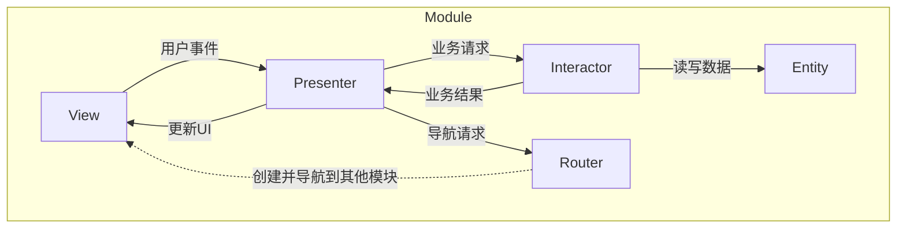

+++
title = "VIPER架构详解"
date = '2026-05-02T22:32:27+08:00'
draft = false
weight = 6
tags = ["iOS", "架构"]
categories = ["iOS开发", "架构"]
+++
## 什么是VIPER

VIPER是一种更加细粒度的架构模式，由Mutual Mobile公司提出。VIPER将应用分为五个层次：

- **V**iew（视图）：负责UI展示
- **I**nteractor（交互器）：负责业务逻辑
- **P**resenter（展示器）：负责视图逻辑
- **E**ntity（实体）：数据模型
- **R**outer（路由）：负责页面导航

VIPER的核心思想是**单一职责原则**，每个组件只负责一件事。

## VIPER的结构



### 数据流向说明

1. **用户交互流**：View → Presenter → Interactor → Presenter → View
2. **导航流**：View → Presenter → Router → 新的 View
3. **数据流**：Interactor → Entity（数据存储）→ Interactor → Presenter → View（数据展示）

## VIPER的五个组件

### View（视图层）

View负责：
- 展示UI
- 接收用户输入并传递给Presenter
- 实现Presenter定义的协议

```swift
// View协议
protocol UserListViewProtocol: AnyObject {
    func showLoading()
    func showUsers(_ users: [UserViewModel])
    func showError(_ message: String)
}

// ViewController实现
class UserListViewController: UIViewController, UserListViewProtocol {
    var presenter: UserListPresenterProtocol!
    private var users: [UserViewModel] = []
    
    override func viewDidLoad() {
        super.viewDidLoad()
        presenter.viewDidLoad()
    }
    
    func showUsers(_ users: [UserViewModel]) {
        self.users = users
        tableView.reloadData()
    }
    
    func tableView(_ tableView: UITableView, didSelectRowAt indexPath: IndexPath) {
        presenter.didSelectUser(at: indexPath.row)
    }
}
```

### Interactor（交互器）

Interactor负责：
- 执行业务逻辑
- 与数据层（网络、数据库）交互
- 不知道UI的存在

```swift
// Interactor协议
protocol UserListInteractorInputProtocol: AnyObject {
    func fetchUsers()
}

protocol UserListInteractorOutputProtocol: AnyObject {
    func didFetchUsers(_ users: [User])
    func didFailToFetchUsers(_ error: Error)
}

// Interactor实现
class UserListInteractor: UserListInteractorInputProtocol {
    weak var presenter: UserListInteractorOutputProtocol?
    private let userService: UserServiceProtocol
    
    func fetchUsers() {
        Task {
            do {
                let users = try await userService.fetchUsers()
                await MainActor.run {
                    presenter?.didFetchUsers(users)
                }
            } catch {
                await MainActor.run {
                    presenter?.didFailToFetchUsers(error)
                }
            }
        }
    }
}
```

### Presenter（展示器）

Presenter负责：
- 接收View的用户事件
- 调用Interactor执行业务逻辑
- 将数据转换为View可以展示的格式
- 调用Router进行导航

```swift
// Presenter协议
protocol UserListPresenterProtocol: AnyObject {
    func viewDidLoad()
    func didSelectUser(at index: Int)
}

// ViewModel
struct UserViewModel {
    let id: Int
    let name: String
    let email: String
}

// Presenter实现
class UserListPresenter: UserListPresenterProtocol {
    weak var view: UserListViewProtocol?
    var interactor: UserListInteractorInputProtocol!
    var router: UserListRouterProtocol!
    
    private var users: [User] = []
    
    func viewDidLoad() {
        view?.showLoading()
        interactor.fetchUsers()
    }
    
    func didSelectUser(at index: Int) {
        let user = users[index]
        router.navigateToUserDetail(userId: user.id)
    }
}

// MARK: - InteractorOutput
extension UserListPresenter: UserListInteractorOutputProtocol {
    func didFetchUsers(_ users: [User]) {
        self.users = users
        let viewModels = users.map { UserViewModel(id: $0.id, name: $0.name, email: $0.email) }
        view?.showUsers(viewModels)
    }
    
    func didFailToFetchUsers(_ error: Error) {
        view?.showError(error.localizedDescription)
    }
}
```

### Entity（实体）

Entity是纯数据模型，不包含任何业务逻辑：

```swift
// Entity
struct User: Codable, Equatable {
    let id: Int
    let name: String
    let email: String
    let avatarURL: URL?
    let createdAt: Date
}

// 可以有多个Entity
struct UserProfile: Codable {
    let user: User
    let followers: Int
    let following: Int
    let isFollowing: Bool
    let posts: [Post]
}

struct Post: Codable {
    let id: Int
    let title: String
    let content: String
}
```

### Router（路由）

Router负责：
- 创建模块（组装VIPER组件）
- 处理页面导航

```swift
// Router协议
protocol UserListRouterProtocol: AnyObject {
    static func createModule() -> UIViewController
    func navigateToUserDetail(userId: Int)
}

// Router实现
class UserListRouter: UserListRouterProtocol {
    weak var viewController: UIViewController?
    
    static func createModule() -> UIViewController {
        let view = UserListViewController()
        let presenter = UserListPresenter()
        let interactor = UserListInteractor(userService: UserService())
        let router = UserListRouter()
        
        // 组装VIPER组件
        view.presenter = presenter
        presenter.view = view
        presenter.interactor = interactor
        presenter.router = router
        interactor.presenter = presenter
        router.viewController = view
        
        return view
    }
    
    func navigateToUserDetail(userId: Int) {
        let detailVC = UserDetailRouter.createModule(userId: userId)
        viewController?.navigationController?.pushViewController(detailVC, animated: true)
    }
}
```

## VIPER组件的完整交互流程

以用户列表为例，展示一次完整的数据请求流程：

```swift
// 1. View 触发事件
class UserListViewController {
    override func viewDidLoad() {
        presenter.viewDidLoad()  // 通知 Presenter
    }
}

// 2. Presenter 处理事件
class UserListPresenter {
    func viewDidLoad() {
        view?.showLoading()
        interactor.fetchUsers()  // 调用 Interactor
    }
}

// 3. Interactor 执行业务逻辑
class UserListInteractor {
    func fetchUsers() {
        Task {
            let users = try await userService.fetchUsers()  // 获取数据
            presenter?.didFetchUsers(users)  // 回调 Presenter
        }
    }
}

// 4. Presenter 处理结果并更新 View
extension UserListPresenter: UserListInteractorOutputProtocol {
    func didFetchUsers(_ users: [User]) {
        let viewModels = users.map { /* 转换为 ViewModel */ }
        view?.showUsers(viewModels)  // 更新 View
    }
}

// 5. View 展示数据
class UserListViewController {
    func showUsers(_ users: [UserViewModel]) {
        self.users = users
        tableView.reloadData()
    }
}
```

## VIPER的单元测试

VIPER的每个组件都可以独立测试，这是其最大优势之一。

### 测试Presenter

```swift
class UserListPresenterTests: XCTestCase {
    var presenter: UserListPresenter!
    var mockView: MockUserListView!
    var mockInteractor: MockUserListInteractor!
    
    override func setUp() {
        presenter = UserListPresenter()
        mockView = MockUserListView()
        mockInteractor = MockUserListInteractor()
        
        presenter.view = mockView
        presenter.interactor = mockInteractor
    }
    
    func testViewDidLoad_CallsFetchUsers() {
        // When
        presenter.viewDidLoad()
        
        // Then
        XCTAssertTrue(mockView.showLoadingCalled)
        XCTAssertTrue(mockInteractor.fetchUsersCalled)
    }
    
    func testDidFetchUsers_ShowsUsers() {
        // Given
        let users = [User(id: 1, name: "John", email: "john@example.com")]
        
        // When
        presenter.didFetchUsers(users)
        
        // Then
        XCTAssertTrue(mockView.showUsersCalled)
        XCTAssertEqual(mockView.displayedUsers?.count, 1)
    }
}
```

### 测试Interactor

```swift
class UserListInteractorTests: XCTestCase {
    var interactor: UserListInteractor!
    var mockPresenter: MockPresenterOutput!
    var mockService: MockUserService!
    
    func testFetchUsers_Success() {
        // Given
        mockService.usersToReturn = [User(id: 1, name: "John")]
        
        // When
        interactor.fetchUsers()
        
        // Then
        XCTAssertTrue(mockPresenter.didFetchUsersCalled)
    }
}
```

### Mock类示例

```swift
class MockUserListView: UserListViewProtocol {
    var showLoadingCalled = false
    var showUsersCalled = false
    var displayedUsers: [UserViewModel]?
    
    func showLoading() { showLoadingCalled = true }
    func showUsers(_ users: [UserViewModel]) {
        showUsersCalled = true
        displayedUsers = users
    }
}

class MockUserListInteractor: UserListInteractorInputProtocol {
    var fetchUsersCalled = false
    func fetchUsers() { fetchUsersCalled = true }
}
```

## 模块间通信

### 1. 通过 Router 传递参数（推荐）

```swift
// 导航时传递参数
class UserListRouter {
    func navigateToUserDetail(userId: Int) {
        let detailVC = UserDetailRouter.createModule(userId: userId)
        viewController?.navigationController?.pushViewController(detailVC, animated: true)
    }
}

// 接收参数
class UserDetailRouter {
    static func createModule(userId: Int) -> UIViewController {
        let presenter = UserDetailPresenter(userId: userId)
        // ... 组装组件
    }
}
```

### 2. 通过 Delegate 回传数据

```swift
protocol EditUserDelegate: AnyObject {
    func didUpdateUser(_ user: User)
}

class EditUserPresenter {
    weak var delegate: EditUserDelegate?
    
    func saveUser() {
        delegate?.didUpdateUser(user)
    }
}
```

### 3. 通过闭包回调

```swift
class SelectUserRouter {
    static func createModule(onSelected: @escaping (User) -> Void) -> UIViewController {
        let presenter = SelectUserPresenter(onSelected: onSelected)
        // ...
    }
}
```

## VIPER的优缺点

### 优点

1. **职责分离清晰**：每个组件只负责一件事
2. **可测试性极高**：每个组件都可以独立测试
3. **可维护性好**：代码结构清晰，易于维护
4. **可扩展性强**：添加新功能不会影响现有代码
5. **适合团队协作**：不同开发者可以并行开发不同组件

### 缺点

1. **代码量大**：需要创建大量协议和类
2. **学习曲线陡峭**：需要理解各组件的职责和交互
3. **过度设计风险**：简单页面使用VIPER过于复杂
4. **模块间通信复杂**：需要通过Router和Delegate传递数据

## VIPER vs 其他架构

| 特性 | MVC | MVP | MVVM | VIPER |
|------|-----|-----|------|-------|
| 职责分离 | 低 | 中 | 中 | 高 |
| 可测试性 | 低 | 高 | 高 | 很高 |
| 代码量 | 少 | 中 | 中 | 多 |
| 学习曲线 | 低 | 中 | 中 | 高 |
| 适用规模 | 小型 | 中型 | 中大型 | 大型 |

## VIPER常见问题

### 1. View 和 Presenter 的引用关系？

View 持有 Presenter 用强引用，Presenter 持有 View 用弱引用，避免循环引用。

```swift
class UserListViewController {
    var presenter: UserListPresenterProtocol!  // 强引用
}

class UserListPresenter {
    weak var view: UserListViewProtocol?  // 弱引用
}
```

### 2. Entity 应该放在哪里？

Entity 是独立的数据模型，放在单独的文件夹中，可被多个模块共享。

```
Project/
├── Modules/
│   ├── UserList/
│   └── UserDetail/
└── Entities/
    └── User.swift
```

### 3. ViewModel 属于哪一层？

ViewModel 是 Presenter 层的一部分，用于将 Entity 转换为 View 展示数据。

```swift
// Entity（业务数据）
struct User {
    let firstName: String
    let lastName: String
}

// ViewModel（展示数据）
struct UserViewModel {
    let displayName: String  // firstName + lastName
}
```

### 4. 网络请求应该放在哪里？

网络请求放在独立的 Service 层，由 Interactor 调用。

```swift
// Service 层
class UserService {
    func fetchUsers() async throws -> [User] { }
}

// Interactor 调用
class UserListInteractor {
    func fetchUsers() {
        let users = try await userService.fetchUsers()
    }
}
```
