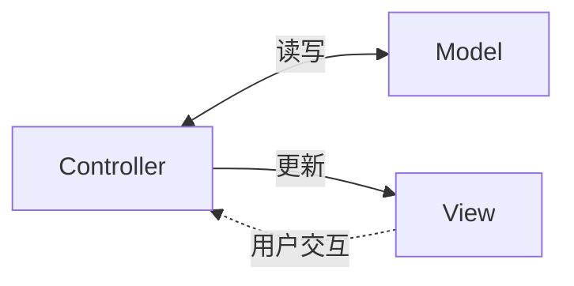
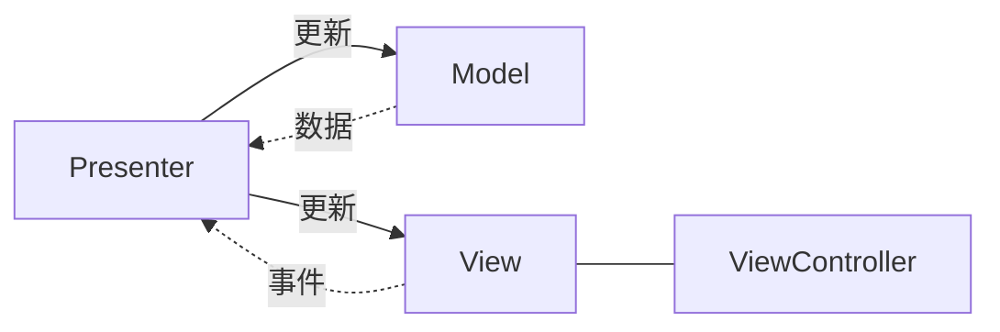
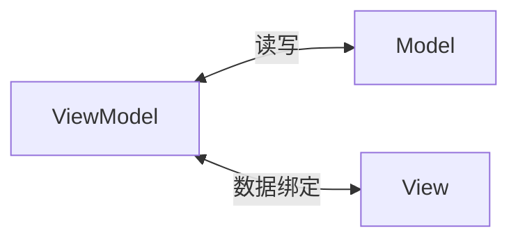
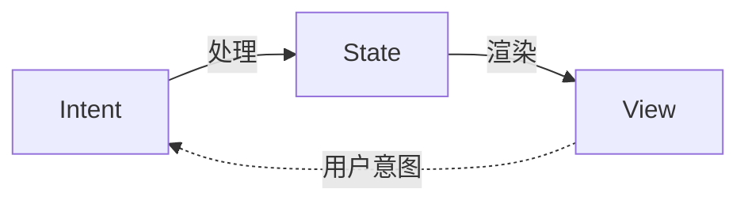
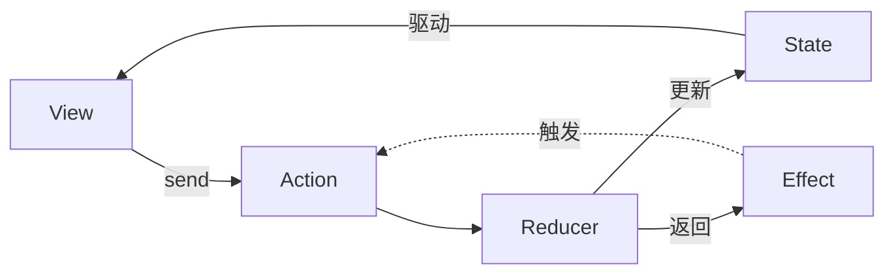
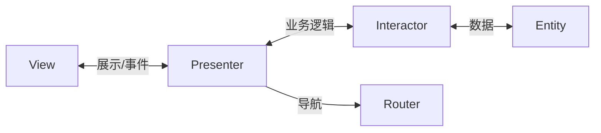
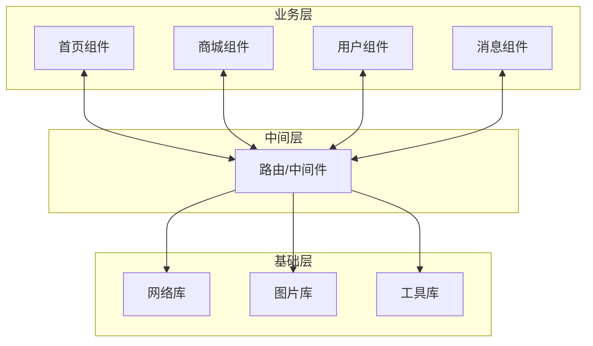
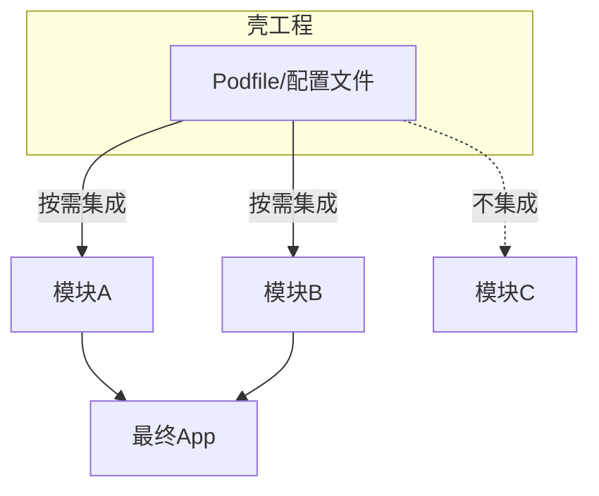
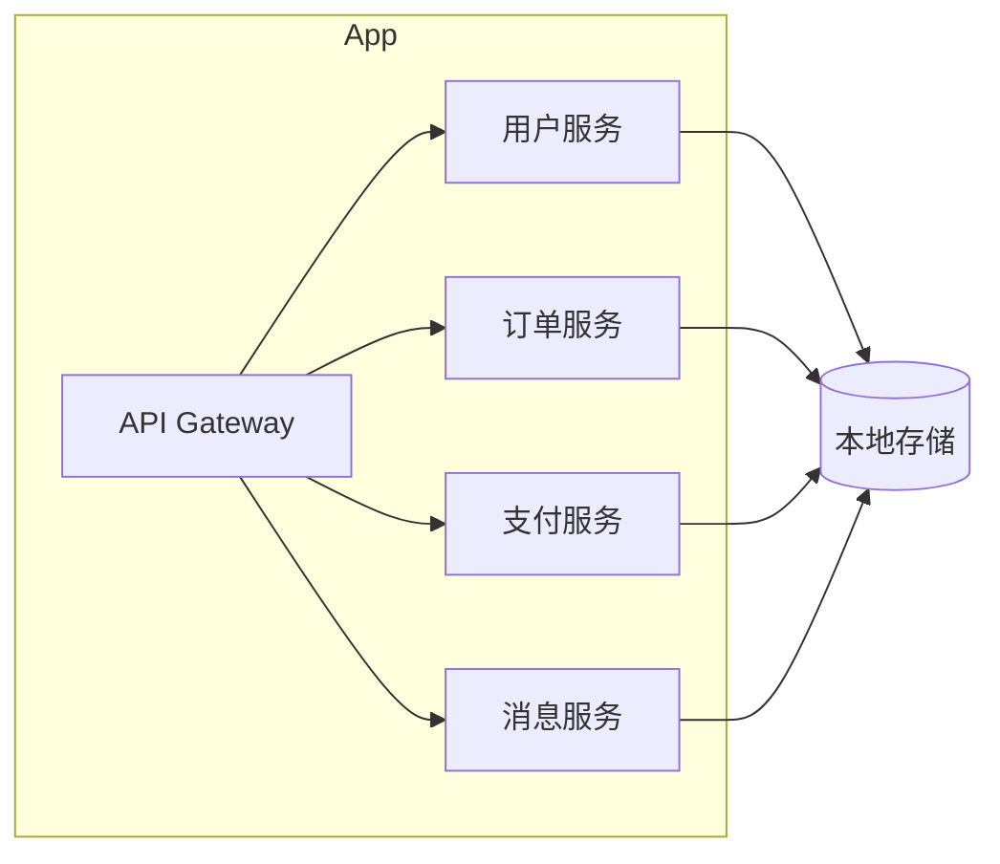

+++
title = "iOS架构概述"
date = '2026-06-21T22:41:52+08:00'
draft = false
weight = 7
tags = ["iOS", "架构"]
categories = ["iOS开发", "架构"]
+++
## 什么是架构

软件架构是指软件系统的高层结构，定义了系统的各个组成部分及其之间的关系。一个好的架构能够帮助我们：

- **职责分离**：将不同的功能模块分开，降低耦合度
- **可测试性**：使代码更容易进行单元测试
- **可维护性**：便于理解和修改代码
- **可扩展性**：方便添加新功能
- **团队协作**：不同开发者可以并行开发不同模块

## 架构的两个层次

在讨论iOS架构时，需要区分两种不同层次的架构：

| 类型 | 关注点 | 代表模式 |
|------|--------|----------|
| 页面架构 | 单个页面内的代码组织 | MVC、MVP、MVVM、MVI、TCA、VIPER |
| 工程架构 | 整个App的模块划分与通信 | 组件化、插件化、微服务化 |

两者并不冲突，大型项目通常会同时采用：工程层面使用组件化拆分业务，每个组件内部使用MVVM等页面架构。

## 页面架构模式

### MVC (Model-View-Controller)

MVC是Apple官方推荐的架构模式，也是iOS开发中最基础的架构。



**特点**：
- Controller作为中介者连接Model和View
- View和Model不直接通信
- 在iOS中，ViewController往往承担了过多职责

### MVP (Model-View-Presenter)

MVP是MVC的演进版本，将业务逻辑从Controller中抽离到Presenter。



**特点**：
- Presenter持有View的引用（通常是协议）
- View变得非常"被动"，只负责展示
- 便于单元测试

### MVVM (Model-View-ViewModel)

MVVM通过数据绑定实现View和ViewModel的同步更新。



**特点**：
- ViewModel不持有View的引用
- 通过数据绑定（KVO、Combine、RxSwift）实现双向通信
- ViewModel更容易测试

### MVI (Model-View-Intent)

MVI是一种单向数据流架构，强调状态的不可变性。



**特点**：
- 单向数据流，状态变化可预测
- State是不可变的
- 便于调试和追踪状态变化

### TCA (The Composable Architecture)

TCA是Point-Free团队开发的MVI风格架构框架，提供了完整的状态管理解决方案。



**特点**：
- 基于MVI思想，单向数据流
- 内置依赖注入系统
- 强大的组合能力，可将多个Feature组合
- 内置TestStore，测试支持完善
- 副作用（Effect）管理清晰

### VIPER (View-Interactor-Presenter-Entity-Router)

VIPER是一种更加细粒度的架构模式，将职责拆分得更细。



**特点**：
- 职责划分非常清晰
- 每个模块都可以独立测试
- 代码量较大，适合大型项目

## 页面架构模式对比

| 特性 | MVC | MVP | MVVM | MVI | TCA | VIPER |
|------|-----|-----|------|-----|-----|-------|
| 复杂度 | 低 | 中 | 中 | 中高 | 高 | 高 |
| 可测试性 | 低 | 高 | 高 | 高 | 很高 | 很高 |
| 代码量 | 少 | 中 | 中 | 中 | 中 | 多 |
| 学习曲线 | 低 | 中 | 中 | 中高 | 高 | 高 |
| 框架依赖 | 无 | 无 | 可选 | 无 | 必须 | 无 |
| 适用场景 | 小型项目 | 中型项目 | 中大型项目 | 复杂状态管理 | 中大型项目 | 大型项目 |

## 工程架构模式

### 组件化架构

组件化是一种工程架构思想，将App拆分为多个独立的业务组件，通过中间件进行通信。



**特点**：
- 业务模块独立，可单独开发、测试、编译
- 通过路由或协议实现模块间解耦通信
- 适合多团队协作的大型项目
- 支持模块的动态化和热修复

**常见实现方案**：
- **URL Router**：通过URL注册和调用服务（如MGJRouter）
- **Target-Action**：通过runtime调用（如CTMediator）
- **Protocol-Class**：通过协议注册和获取服务（如BeeHive）
- **依赖注入（DI）**：通过DI容器管理依赖关系（如Swinject、Resolver、Needle）

> Protocol-Class可以看作是DI的简化形式，而完整的DI框架还提供依赖树自动解析、生命周期管理（单例/瞬态）、作用域控制等高级能力。

### 插件化架构

通过壳工程配置，在编译期决定集成哪些功能模块。这是组件化的一种工程实践形态。



**特点**：
- 通过配置文件（如Podfile）决定集成哪些模块
- 不同的壳工程可以产出不同功能组合的App
- 支持模块的独立开发和二进制化，提升编译效率
- 本质上是编译期的"按需装配"

### 微服务化架构

微服务化是将后端微服务的思想应用到客户端，将App内部按业务域拆分为多个独立服务。



**特点**：
- 每个服务有独立的数据存储和业务逻辑
- 服务间通过定义良好的接口通信
- 便于团队按业务域独立开发
- 强调服务的自治性和边界清晰

**与组件化的区别**：
- 组件化侧重于代码的物理隔离和编译解耦
- 微服务化侧重于业务域的逻辑划分和运行时隔离
- 实践中两者常结合使用：组件是载体，服务是抽象

## 选择架构的考量因素

### 1. 项目规模

- **小型项目**：MVC足够，避免过度设计
- **中型项目**：MVP或MVVM是不错的选择
- **大型项目**：MVVM、MVI或VIPER更适合

### 2. 团队经验

- 如果团队对响应式编程熟悉，MVVM配合RxSwift/Combine是好选择
- 如果团队偏好传统方式，MVP可能更容易上手

### 3. 测试需求

- 如果需要高测试覆盖率，避免使用原生MVC
- MVP、MVVM、MVI、VIPER都能提供较好的可测试性

### 4. 状态管理复杂度

- 如果应用状态复杂且需要可预测的状态变化，考虑MVI
- 简单的表单页面不需要复杂的状态管理

## 架构不是银弹

需要注意的是，没有完美的架构，每种架构都有其适用场景和局限性：

1. **不要过度设计**：简单的页面不需要复杂的架构
2. **可以混合使用**：不同模块可以使用不同的架构
3. **架构是演进的**：随着项目发展，架构可能需要调整
4. **一致性很重要**：团队内部应该对架构有统一的理解

## 相关文章

- [MVC架构详解]()
- [MVP架构详解]()
- [MVVM架构详解]()
- [MVI架构详解]()
- [TCA架构详解]()
- [VIPER架构详解]()
- [组件化架构详解]()
- [插件化架构详解]()
- [微服务化架构详解]()

## 高频面试问题

### 1. 为什么iOS中的MVC容易变成Massive View Controller？如何改进？

**答案：**

Apple的MVC中，View和Model不能直接通信，所有交互都要通过Controller中转。而在UIKit里，`UIViewController`本身又负责生命周期管理、View层级管理、系统交互、导航、弹窗等职责，所以实际开发中Controller很容易同时承担以下工作：

- 接收用户事件，例如按钮点击、列表选择、输入变化；
- 管理UI布局和UI状态；
- 调用网络请求、数据库或缓存；
- 处理业务逻辑和数据校验；
- 处理Model到View的转换；
- 处理页面跳转、弹窗、权限申请；
- 实现`UITableViewDataSource`、`UITableViewDelegate`、各种自定义Delegate。

当这些职责都集中在一个ViewController里时，就会形成Massive View Controller。它的问题主要有四个：代码难读、逻辑难复用、依赖UIKit导致单元测试困难、修改一个功能容易影响其他功能。

MVC改进：

1. **抽离Service层**：网络请求、缓存、数据库访问不要写在ViewController里，而是放到`UserService`、`OrderService`、`Repository`等对象中。
2. **抽离DataSource/Delegate**：复杂列表可以把`UITableViewDataSource`封装成独立对象，ViewController只负责协调。
3. **抽离View**：将复杂UI封装成自定义`UIView`，ViewController只调用`configure`或绑定数据。
4. **抽离数据转换逻辑**：把Model转换成展示文案、颜色、按钮状态等逻辑放到ViewModel或Presenter式的小对象中。
5. **拆分子ViewController**：复杂页面可以拆成多个子模块，由容器ViewController负责组合。
6. **导航交给Router/Coordinator**：减少ViewController之间直接创建和强依赖。

如果页面继续变复杂，可以进一步演进到MVP、MVVM、MVI或VIPER。**MVC本身并不是错误，问题是ViewController缺少约束时容易成为所有逻辑的容器。改进重点是让ViewController回到协调者角色，而不是业务逻辑的承载者。**

### 2. MVP和MVVM有什么区别？Presenter和ViewModel分别应该持有哪些对象？

**答案：**

MVP和MVVM都用于解决MVC中ViewController职责过重的问题，但它们的通信方式和依赖关系不同。

在**MVP**中，核心是Presenter。View通常是被动的，只负责UI展示和事件转发；Presenter负责业务逻辑、展示逻辑和调用Model/Service。Presenter会通过协议持有View的弱引用，调用View协议方法更新UI。ViewController作为View实现协议，并强持有Presenter。

典型引用关系是：

- ViewController强持有Presenter；
- Presenter弱持有View协议；
- Presenter强持有Service或Model；
- 如果有导航逻辑，Presenter可以弱持有Router或Coordinator协议。

这样设计的好处是Presenter不依赖具体View实现，只依赖协议，因此可以用Mock View做单元测试。但MVP也有缺点：View协议可能随着页面复杂度变得很臃肿，View和Presenter之间仍然是明确的双向通信，导航逻辑如果不单独抽离也容易混乱。

在**MVVM**中，核心是ViewModel。ViewModel不应该持有View，也不应该依赖UIKit。ViewModel负责状态管理、数据转换、展示逻辑和必要的业务逻辑，并通过可观察属性、闭包、Combine、RxSwift等方式向ViewController输出状态。ViewController负责生命周期管理、持有View和ViewModel、建立数据绑定、转发用户事件。

典型引用关系是：

- ViewController强持有View和ViewModel；
- ViewModel强持有Service或Model；
- ViewModel不持有ViewController或View；
- ViewController通过绑定观察ViewModel输出，并把用户事件转发给ViewModel。

两者核心区别：

| 对比点 | MVP | MVVM |
|------|-----|------|
| 核心对象 | Presenter | ViewModel |
| View更新方式 | Presenter调用View协议方法 | View绑定ViewModel状态 |
| 是否持有View | Presenter弱持有View协议 | ViewModel不持有View |
| View是否被动 | 更强调Passive View | View通过绑定响应状态变化 |
| 测试重点 | 测Presenter是否调用正确View方法 | 测ViewModel输入输出和状态变化 |
| 常见问题 | View协议膨胀、导航归属不清 | 绑定复杂、ViewModel膨胀、内存管理 |

**MVP适合希望明确命令式更新UI、团队不想引入响应式绑定的场景；MVVM适合状态驱动UI、SwiftUI或响应式编程经验较好的团队。**

### 3. MVVM相比MVC的优势是什么？

**答案：**

MVVM相比MVC最大的优势，是通过引入ViewModel把ViewController中的展示逻辑、状态管理和数据转换逻辑抽离出来，让ViewController从“什么都管”的中心对象，回到更轻量的页面协调者角色。

在MVC中，尤其是Apple MVC里，View和Model不能直接通信，Controller需要协调View和Model。同时`UIViewController`还天然负责生命周期、View层级、系统交互、导航、弹窗等工作。业务一复杂，网络请求、数据校验、状态判断、Model到UI文案的转换、列表数据源、用户事件处理都容易堆到ViewController里，最终形成Massive View Controller。

MVVM的典型分工是：

- **View/ViewController**：负责UI展示、生命周期、View层级管理、建立绑定、转发用户事件。
- **ViewModel**：负责展示逻辑、状态管理、输入输出转换、调用Model或Service获取数据。
- **Model/Service**：Model表示业务数据结构，Service负责网络请求、缓存、数据库和业务规则。

MVVM相比MVC主要有以下优势：

1. **减轻ViewController职责**
   MVC中ViewController往往既处理UI，又处理业务逻辑，还处理数据转换。MVVM把展示逻辑和状态管理放到ViewModel中，ViewController只负责绑定ViewModel状态、转发用户事件和处理UIKit生命周期，代码更容易阅读和维护。

2. **提高可测试性**
   MVC中的业务和展示逻辑如果写在ViewController里，测试时会依赖UIKit、生命周期和UI环境，单元测试成本高。MVVM中的ViewModel通常不依赖UIKit，可以直接构造Mock Service，测试输入、输出和状态变化。例如登录页可以测试“邮箱和密码合法时登录按钮是否可用”，而不需要启动真实页面。

3. **展示逻辑更容易复用**
   在MVC中，格式化文案、按钮状态、空页面判断、错误提示映射等逻辑常常散落在ViewController中，复用困难。MVVM可以把这些逻辑封装在ViewModel里，同一套ViewModel输出可以被不同View复用，例如UIKit页面、SwiftUI页面或不同样式的业务入口。

4. **更适合状态驱动UI**
   MVVM通常会让ViewModel暴露可观察状态，例如`isLoading`、`users`、`errorMessage`、`isLoginEnabled`。View根据状态变化自动更新，而不是在多个回调里手动到处改UI。这样可以减少“某个分支忘记刷新UI”或“loading和error状态同时出现”的问题。

5. **View和Model解耦更彻底**
   MVC中ViewController经常直接拿Model字段更新UI，页面越复杂，ViewController越了解业务数据细节。MVVM会把Model转换为面向展示的ViewModel输出，View层不需要关心原始Model结构。例如`firstName + lastName`、日期格式化、价格展示、按钮是否可点，都可以由ViewModel统一产出。

6. **更适配响应式编程和SwiftUI**
   MVVM天然适合Combine、RxSwift、KVO、闭包回调等绑定方式，也和SwiftUI的`ObservableObject`、`@Published`、`@Observable`等状态驱动机制更契合。相比MVC命令式地手动更新UI，MVVM更容易形成“状态变化 -> UI刷新”的统一数据流。

但MVVM也不是没有成本。简单页面使用MVVM可能会增加不必要的ViewModel和绑定代码；复杂页面如果把所有业务规则都塞进ViewModel，也会形成Massive ViewModel。因此实践中需要继续拆分：

- 复杂业务规则下沉到Service、UseCase或Domain层；
- 数据访问逻辑放到Repository或API Client；
- 复杂导航交给Coordinator，形成MVVM-C；
- 状态特别复杂时，可以进一步演进到MVI或TCA。

**总结来说，MVVM相比MVC的核心优势是：让ViewController变轻，让展示逻辑可测试、可复用，并通过状态绑定让UI更新更清晰。它解决的是MVC中Controller过重和逻辑难测试的问题，但仍然需要控制ViewModel职责边界，避免把MVC的问题转移到ViewModel中。**

### 4. MVI相比MVVM解决了什么问题？Reducer为什么要设计成纯函数？

**答案：**

MVI是一种单向数据流架构，核心流程是：

```
View -> Intent/Action -> Store -> Reducer -> State -> View
```

在MVI中，界面由一个完整的State描述，用户操作、生命周期事件、网络请求结果都被建模成Intent或Action。所有状态变化都进入Reducer，由Reducer根据当前State和Action计算出新的State，View再根据新State重新渲染。

相比MVVM，MVI主要解决三个问题：

1. **状态一致性问题**  
   MVVM中ViewModel通常有多个独立属性，例如`users`、`isLoading`、`error`、`selectedIndex`。这些属性可能在不同方法里被修改，入口多了以后容易漏改某个状态。例如重试时设置了`isLoading = true`，却忘记清空上一次的`error`。MVI把状态集中到一个State对象中，并在Reducer里统一处理状态转换，可以减少这种遗漏。

2. **状态变化难以追踪的问题**  
   MVVM里状态可能从ViewModel的任意方法被修改。MVI要求所有状态变化都通过Action进入Reducer，因此可以记录“哪个Action让State从A变成B”，方便日志、调试和时间旅行调试。

3. **副作用分散的问题**  
   MVVM中网络请求、数据库操作、定时器等副作用可能散落在ViewModel各个方法里。MVI强调Reducer只做状态计算，副作用放在Store或Effect层处理，副作用完成后再发送新的Action回到Reducer。

Reducer设计成纯函数，是MVI可预测和可测试的关键。纯函数意味着：

- 输入相同的`State + Action`，输出一定相同；
- 不发网络请求；
- 不读写数据库；
- 不修改全局变量；
- 不直接操作UI；
- 不依赖当前时间、随机数等外部状态。

这样Reducer测试非常简单，不需要Mock网络或UIKit，只要构造旧State和Action，断言新State是否符合预期。

在Swift里，MVI通常使用`struct State`配合值语义。Reducer中可以写：

```swift
var newState = state
newState.isLoading = true
return newState
```

虽然属性是`var`，但由于`struct`是值类型，语义上仍然是“旧State生成新State”，不会修改外部持有的旧State。需要避免用`class`做State，或者用`inout`直接修改外部状态，否则会破坏可追溯性。

MVI的代价是样板代码更多，State、Action、Reducer都需要显式定义。对于简单页面可能过度设计，但对于复杂状态、多入口、多异步副作用的页面，收益非常明显。

### 5. TCA和普通MVI有什么关系？TCA的State、Action、Reducer、Effect、Dependency、Scope分别是什么？

**答案：**

TCA（The Composable Architecture）可以理解为Swift生态中对MVI/Redux/Elm思想的一套成熟实现。它同样基于单向数据流，但提供了更完整的工程化能力，包括Effect系统、依赖注入、Feature组合、导航状态管理和TestStore测试工具。

TCA中的核心概念如下：

- **State**：描述某个Feature当前所需的全部状态，通常是值类型结构体。State应该尽量最小化，只保留渲染UI和驱动业务逻辑必要的数据。
- **Action**：枚举，描述Feature中可能发生的所有事件，包括用户点击、输入变化、生命周期事件、异步请求结果等。TCA推荐Action命名描述“发生了什么”，例如`loginButtonTapped`、`userResponse`。
- **Reducer**：接收State和Action，同步更新State，并返回Effect。Reducer是业务逻辑的核心位置。
- **Store**：持有State，接收View发送的Action，驱动Reducer执行，并把State变化通知View。
- **Effect**：封装异步操作或副作用，例如网络请求、定时器、文件读写。Effect完成后可以继续发送Action回到Reducer。
- **Dependency**：TCA内置的依赖注入系统，用于把网络、数据库、UUID、日期等外部依赖替换成生产实现、测试实现或预览实现。
- **Scope**：把父Feature中的一部分State和Action映射成子Feature需要的Store，实现Feature组合。

一次典型TCA数据流是：

1. View调用`store.send(.buttonTapped)`；
2. Store把Action交给Reducer；
3. Reducer同步修改State；
4. State变化驱动View重新渲染；
5. Reducer如果返回Effect，Store执行Effect；
6. Effect完成后发送新的Action，再次进入Reducer。

TCA相比手写MVI的优势主要有：

1. **组合能力强**：可以通过`Scope`组合固定子Feature，通过`forEach`组合列表项Feature，通过`ifLet`组合可选子Feature。
2. **副作用标准化**：Effect支持异步、合并、串联、取消，适合处理搜索防抖、轮询、长连接等场景。
3. **依赖注入完善**：通过`@Dependency`替换外部依赖，测试时可以显式注入Mock。
4. **测试能力强**：TestStore可以断言发送Action后State如何变化、Effect会回传什么Action，适合做穷尽式测试。
5. **SwiftUI/UIKit都可用**：Reducer层与UI框架无关，同一个Feature可以对应SwiftUI View，也可以对应UIKit ViewController。

TCA的缺点也很明确：学习曲线更高，代码风格和普通UIKit/MVVM差异较大，简单页面会显得重，团队需要统一理解State、Action、Effect和依赖注入的写法。**TCA不是简单的MVVM替代品，而是一套强约束的状态管理和模块组合框架，适合状态复杂、测试要求高、Feature需要组合的大中型项目。**

### 6. VIPER每一层的职责是什么？它适合什么场景，缺点是什么？

**答案：**

VIPER把一个模块拆成View、Interactor、Presenter、Entity、Router五层，核心目标是单一职责和高可测试性。

各层职责如下：

- **View**：负责UI展示，接收用户输入并转发给Presenter。通常由`UIViewController`实现View协议。
- **Presenter**：负责展示逻辑，接收View事件，调用Interactor执行业务逻辑，把Entity转换为ViewModel，并调用View协议更新UI。
- **Interactor**：负责业务逻辑和数据获取，不知道UI存在。网络请求、数据库访问通常通过Service或Repository由Interactor调用。
- **Entity**：纯数据模型，表示业务数据，不包含UI逻辑。
- **Router**：负责模块组装和页面导航，例如创建VIPER模块、push到详情页、present弹窗。

一次典型数据流是：

1. View触发`viewDidLoad`或用户点击；
2. View把事件交给Presenter；
3. Presenter调用Interactor；
4. Interactor通过Service获取数据，结果回调给Presenter；
5. Presenter把Entity转换成ViewModel；
6. Presenter调用View协议更新UI；
7. 如果需要跳转，Presenter调用Router。

VIPER适合以下场景：

- 金融、交易、医疗等业务复杂且对测试要求高的模块；
- 团队规模较大，需要多人并行开发同一个业务模块的不同层；
- 模块生命周期较长，后续维护和扩展成本比初始开发速度更重要；
- 页面逻辑、业务逻辑、导航逻辑都很复杂，需要清晰边界。

VIPER的主要缺点是代码量大。一个简单页面也要创建多个协议和类，样板代码明显增加；模块之间通信也需要通过Router、Delegate或闭包设计清楚，否则会变得繁琐。对简单页面使用VIPER通常是过度设计。

**VIPER通过极细粒度拆分换来了职责清晰和高可测试性，但代价是复杂度和代码量。它适合复杂、长期维护、测试要求高的模块，不适合所有页面一刀切。**

### 7. iOS组件化中常见的组件通信方案有哪些？

**答案：**

组件化的核心目标是让业务组件之间不直接依赖。比如首页组件不应该直接`import UserModule`再创建`UserProfileViewController`，否则用户组件改动会影响首页组件编译，模块边界也会被破坏。组件间通信通常通过中间层完成，常见方案有四类。

**1. URL Router**

通过URL注册和打开页面或服务，例如`user://profile?id=123`。优点是简单、直观、支持跨App跳转，也适合服务端下发动态路由。缺点是参数依赖字符串，类型不安全，复杂对象传递不优雅，URL维护成本较高。

实现原理是维护一张**路由表**，Key通常是URL Pattern，例如`user://profile`，Value是一个Handler闭包或目标页面工厂。业务组件启动时向Router注册自己能处理的URL；调用方只需要把URL交给Router，Router负责解析scheme、host、path和query参数，匹配对应Pattern，然后执行Handler创建页面或调用服务。调用方只依赖Router，不依赖目标组件的具体类。

适合：页面跳转、H5和Native统一路由、动态化跳转场景。

**2. Target-Action**

通过Runtime根据字符串找到目标类和方法，例如CTMediator。调用方不直接依赖目标组件，Mediator通过`Target_User`和`Action_profileWithParams`创建目标页面。优点是无需启动时注册，编译期无直接依赖；缺点是依赖字符串和Runtime，Swift纯项目需要额外处理，运行时才发现错误。

实现原理是约定目标组件暴露一个固定命名的Target类和Action方法，例如用户组件提供`Target_User`类，并实现`Action_profileWithParams:`方法。调用方通过Mediator传入`target = "User"`、`action = "profile"`和参数字典，Mediator内部拼接类名和方法名，再通过`NSClassFromString`、`NSSelectorFromString`、`perform`等Runtime能力动态创建对象并调用方法。为了改善调用体验，通常会给Mediator写Category或扩展，把字符串调用包装成有明确方法名的API。

适合：希望减少注册成本、接受Runtime动态调用、以Objective-C兼容为基础的项目。

**3. Protocol-Class**

定义独立的协议层，业务组件实现协议并注册到容器，调用方只依赖协议，通过容器获取服务。例如首页依赖`UserRouterProtocol`，而不是依赖`UserModule`。优点是类型安全、接口清晰、便于Mock测试；缺点是需要维护独立Protocol组件，服务需要显式注册，协议变更会影响多个组件。

实现原理是引入一个**协议层**和一个**服务容器**。协议层只放对外接口，例如`UserRouterProtocol`、`UserServiceProtocol`，调用方依赖这些协议；用户组件内部提供实现类，例如`UserRouterImpl`，并在启动时把`UserRouterProtocol -> UserRouterImpl`注册到容器。调用方需要能力时，通过`getService(UserRouterProtocol.self)`从容器取出协议实例，再调用协议方法。这样编译期依赖的是抽象协议，不是具体业务组件。

适合：中大型项目、重视类型安全和测试、希望通过接口稳定组件边界的场景。

**4. DI（依赖注入）**

DI可以看作Protocol-Class的增强版。它不仅能按协议解析实现，还能自动构建依赖树，并管理生命周期，例如单例、瞬态、作用域。优点是依赖关系更清晰，测试替换Mock方便，复杂依赖链更好维护；缺点是学习和配置成本更高，过度使用会让依赖来源变得不直观。

实现原理是把对象创建权交给DI容器。各模块先向容器注册“协议对应哪个实现、如何构造、生命周期是什么”。当某个对象需要`UserServiceProtocol`时，不自己创建`UserServiceImpl`，而是由容器解析并注入。如果`UserServiceImpl`又依赖`UserRepositoryProtocol`，`UserRepositoryImpl`又依赖`NetworkServiceProtocol`，容器会递归解析这条依赖链并完成构造。相比Protocol-Class，DI更强调构造器注入、依赖树自动解析和生命周期管理。

适合：依赖关系复杂、需要生命周期管理、测试体系成熟的大型项目。
