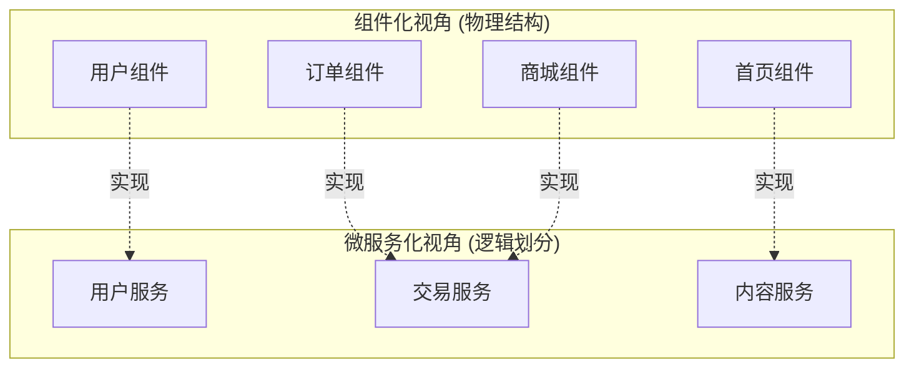
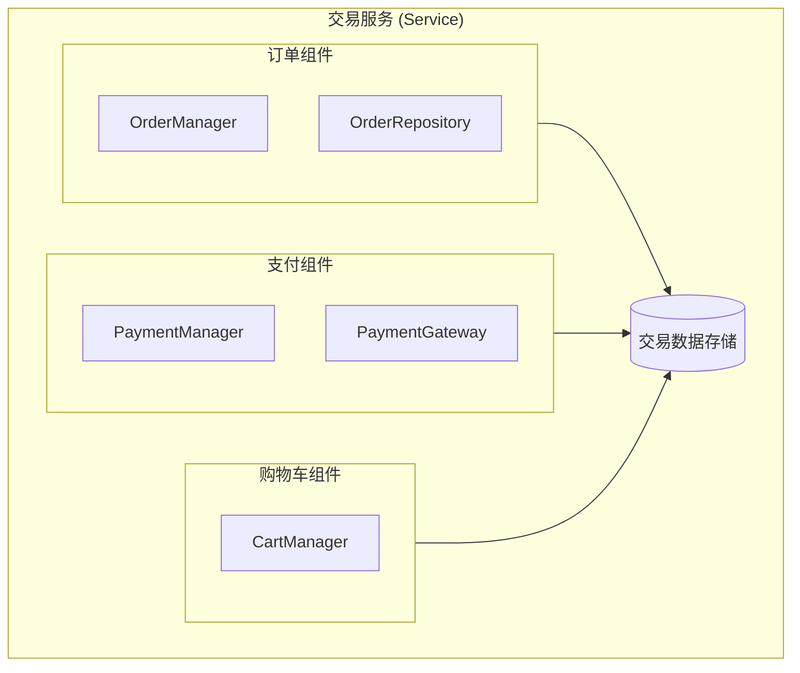
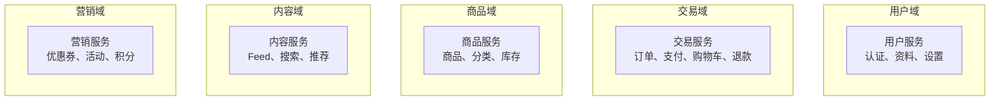
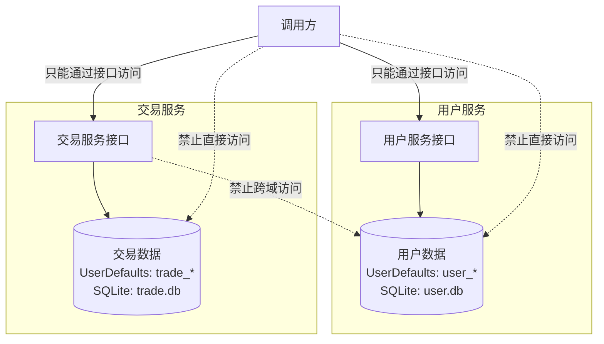
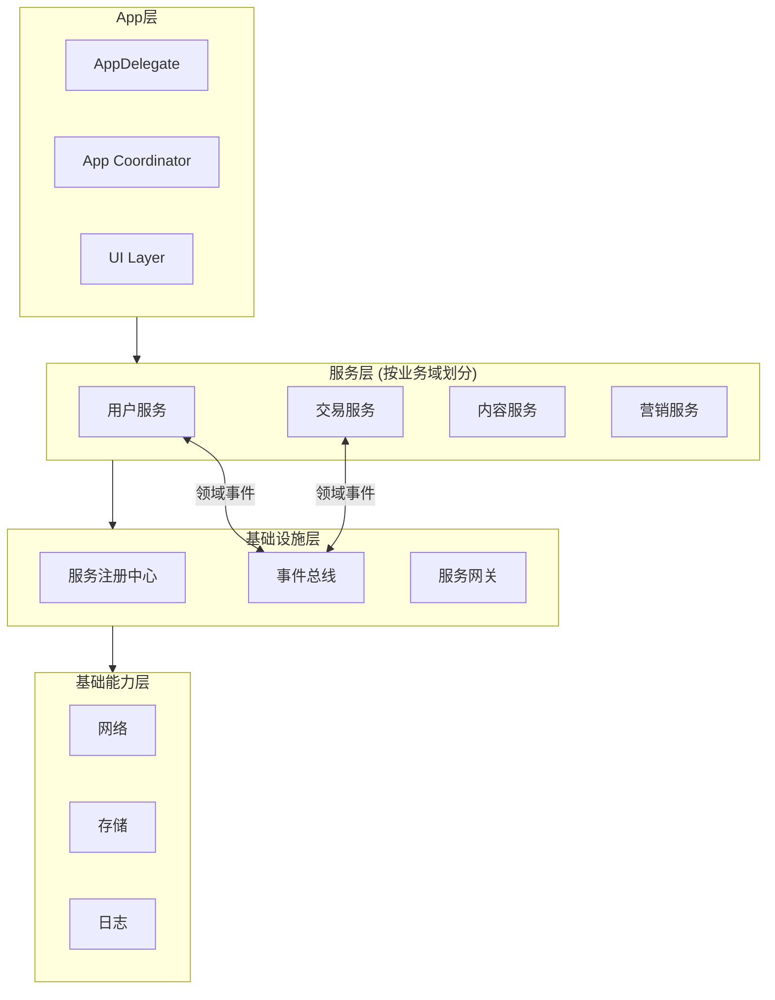
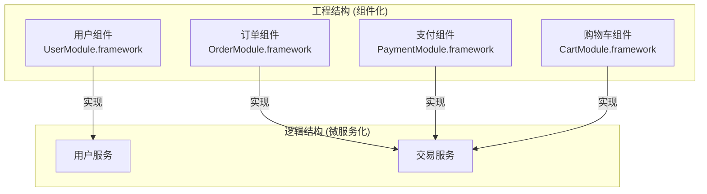

+++
title = "微服务化架构详解"
date = '2026-05-02T22:32:27+08:00'
draft = false
weight = 8
tags = ["iOS", "架构"]
categories = ["iOS开发", "架构"]
+++
## 什么是客户端微服务化

微服务化是将后端微服务的思想应用到客户端，将App内部按**业务域**拆分为多个独立服务。每个服务拥有独立的数据存储和业务逻辑，服务间通过定义良好的接口通信。

微服务化的核心关注点是：

- **业务域的逻辑划分**：按领域边界划分服务，而非按代码结构
- **运行时隔离**：服务在运行时保持独立，数据不互相污染
- **服务自治**：每个服务独立演进，对外提供稳定的契约

### 客户端微服务化 vs 后端微服务

| 维度 | 后端微服务 | 客户端微服务化 |
|------|-----------|----------------|
| 部署 | 独立部署、独立运行的进程 | 同一App内的独立服务 |
| 通信 | HTTP/RPC/消息队列 | 进程内通信（协议、事件总线） |
| 数据库 | 每个服务独立数据库 | 每个服务独立数据存储空间 |
| 扩缩容 | 水平扩展多实例 | 不适用 |
| 故障隔离 | 进程级隔离 | 逻辑隔离（防御性编程） |
| 核心目标 | 独立部署、水平扩展 | 业务域划分、运行时隔离 |

### 微服务化与组件化的关系

微服务化和组件化是**不同维度**的概念：



| 维度 | 组件化 | 微服务化 |
|------|--------|----------|
| 关注点 | 代码的物理隔离、编译解耦 | 业务域的逻辑划分、运行时隔离 |
| 划分依据 | 功能模块、代码边界 | 业务领域、数据边界 |
| 解决的问题 | 编译依赖、团队协作、代码复用 | 业务自治、数据隔离、服务演进 |
| 粒度 | 可大可小（页面、功能模块） | 通常较粗（业务域） |

**实践中两者结合使用**：

- **组件是载体**：用组件化技术实现代码的物理隔离
- **服务是抽象**：在组件之上定义服务接口和数据边界
- 一个服务可能由多个组件实现，一个组件也可能参与多个服务



## 微服务化的核心概念

### 服务（Service）

服务是微服务化的核心抽象，代表一个**业务领域**的完整能力：

```swift
// 用户服务 - 代表用户领域的所有能力
protocol UserServiceProtocol {
    /// 获取当前用户
    func currentUser() -> User?
    
    /// 登录
    func login(credential: Credential) async throws -> User
    
    /// 登出
    func logout() async throws
    
    /// 监听登录状态变化
    func observeLoginState() -> AnyPublisher<LoginState, Never>
}

// 交易服务 - 代表交易领域的所有能力
protocol TradeServiceProtocol {
    /// 创建订单
    func createOrder(items: [CartItem]) async throws -> Order
    
    /// 支付订单
    func payOrder(_ orderId: String, method: PaymentMethod) async throws -> PaymentResult
    
    /// 查询订单
    func getOrders(status: OrderStatus?) async throws -> [Order]
}
```

服务的特征：

- **业务完整性**：包含一个业务域的所有能力
- **数据自治**：拥有独立的数据存储，不直接访问其他服务的数据
- **接口稳定**：对外提供稳定的服务契约
- **独立演进**：内部实现可以独立变化，不影响其他服务

### 业务域（Domain）

业务域是服务划分的依据，通常采用**领域驱动设计（DDD）**的思想：



域的划分原则：

1. **高内聚**：同一域内的功能紧密相关
2. **低耦合**：不同域之间依赖最小化
3. **数据边界清晰**：每个域管理自己的数据
4. **业务语言统一**：域内使用一致的业务术语

### 服务契约（Service Contract）

服务契约是服务对外的正式承诺，定义了服务的能力边界：

```swift
// MARK: - 用户服务契约

/// 用户服务契约
/// 版本：1.0.0
/// 负责团队：用户增长团队
protocol UserServiceContract {
    
    // MARK: - 查询能力
    
    /// 获取当前登录用户
    func currentUser() -> User?
    
    /// 检查登录状态
    func isLoggedIn() -> Bool
    
    /// 获取用户资料
    func getUserProfile(userId: String) async throws -> UserProfile
    
    // MARK: - 操作能力
    
    /// 执行登录
    func login(credential: Credential) async throws -> User
    
    /// 执行登出
    func logout() async throws
    
    // MARK: - 事件订阅
    
    /// 登录状态变化事件
    var loginStatePublisher: AnyPublisher<LoginState, Never> { get }
}

/// 服务契约的错误定义
enum UserServiceError: Error {
    case notLoggedIn
    case invalidCredential
    case networkError(underlying: Error)
    case userNotFound(userId: String)
}
```

契约的重要性：

- **稳定性**：契约变更需要慎重，保持向后兼容
- **文档性**：契约本身就是服务的使用说明
- **可测试性**：基于契约可以轻松创建Mock

### 数据边界（Data Boundary）

每个服务拥有独立的数据存储，这是运行时隔离的关键：



## 微服务化架构设计

### 整体架构



### 服务注册与发现

```swift
// MARK: - 服务注册协议

protocol ServiceRegistryProtocol {
    /// 注册服务
    func register<T>(_ serviceType: T.Type, implementation: T)
    
    /// 获取服务
    func resolve<T>(_ serviceType: T.Type) -> T?
    
    /// 检查服务是否可用
    func isAvailable<T>(_ serviceType: T.Type) -> Bool
}

// MARK: - 服务注册中心实现

final class ServiceRegistry: ServiceRegistryProtocol {
    static let shared = ServiceRegistry()
    
    private var services: [String: Any] = [:]
    private let lock = NSRecursiveLock()
    
    func register<T>(_ serviceType: T.Type, implementation: T) {
        let key = String(describing: serviceType)
        lock.lock()
        defer { lock.unlock() }
        services[key] = implementation
    }
    
    func resolve<T>(_ serviceType: T.Type) -> T? {
        let key = String(describing: serviceType)
        lock.lock()
        defer { lock.unlock() }
        return services[key] as? T
    }
    
    func isAvailable<T>(_ serviceType: T.Type) -> Bool {
        return resolve(serviceType) != nil
    }
}

// MARK: - 便捷访问

@propertyWrapper
struct Service<T> {
    private let serviceType: T.Type
    
    init(_ serviceType: T.Type) {
        self.serviceType = serviceType
    }
    
    var wrappedValue: T {
        guard let service = ServiceRegistry.shared.resolve(serviceType) else {
            fatalError("Service \(serviceType) not registered")
        }
        return service
    }
}

// 使用示例
class OrderViewModel {
    @Service(UserServiceProtocol.self) var userService
    @Service(TradeServiceProtocol.self) var tradeService
    
    func createOrder(items: [CartItem]) async throws -> Order {
        guard userService.isLoggedIn() else {
            throw OrderError.notLoggedIn
        }
        return try await tradeService.createOrder(items: items)
    }
}
```

### 服务实现示例

```swift
// MARK: - 用户服务实现

final class UserServiceImpl: UserServiceProtocol {
    
    // 数据存储 - 用户服务独占
    private let storage: UserDataStorage
    private let loginStateSubject = CurrentValueSubject<LoginState, Never>(.loggedOut)
    
    init() {
        // 用户服务使用独立的数据存储空间
        self.storage = UserDataStorage(namespace: "user_service")
    }
    
    func currentUser() -> User? {
        return storage.getCurrentUser()
    }
    
    func isLoggedIn() -> Bool {
        return currentUser() != nil
    }
    
    func login(credential: Credential) async throws -> User {
        // 调用登录API
        let user = try await AuthAPI.login(credential: credential)
        
        // 保存到用户服务的数据存储
        storage.saveCurrentUser(user)
        
        // 发布状态变化
        loginStateSubject.send(.loggedIn(user))
        
        // 发布领域事件
        EventBus.shared.publish(UserLoggedInEvent(user: user))
        
        return user
    }
    
    func logout() async throws {
        guard let userId = currentUser()?.id else { return }
        
        // 清理用户服务的数据
        storage.clearCurrentUser()
        
        // 发布状态变化
        loginStateSubject.send(.loggedOut)
        
        // 发布领域事件
        EventBus.shared.publish(UserLoggedOutEvent(userId: userId))
    }
    
    func observeLoginState() -> AnyPublisher<LoginState, Never> {
        return loginStateSubject.eraseToAnyPublisher()
    }
}

// MARK: - 用户服务独立的数据存储

final class UserDataStorage {
    private let namespace: String
    private let userDefaults: UserDefaults
    private let database: SQLiteDatabase
    
    init(namespace: String) {
        self.namespace = namespace
        self.userDefaults = UserDefaults.standard
        self.database = try! SQLiteDatabase(name: "\(namespace).db")
    }
    
    private func key(_ name: String) -> String {
        return "\(namespace)_\(name)"
    }
    
    func getCurrentUser() -> User? {
        guard let data = userDefaults.data(forKey: key("current_user")) else {
            return nil
        }
        return try? JSONDecoder().decode(User.self, from: data)
    }
    
    func saveCurrentUser(_ user: User) {
        let data = try? JSONEncoder().encode(user)
        userDefaults.set(data, forKey: key("current_user"))
    }
    
    func clearCurrentUser() {
        userDefaults.removeObject(forKey: key("current_user"))
    }
}
```

## 服务间通信

### 通信方式对比

| 方式 | 适用场景 | 特点 |
|------|----------|------|
| 直接调用 | 获取其他服务的数据 | 同步、简单、有依赖 |
| 领域事件 | 通知其他服务状态变化 | 异步、解耦、无返回值 |
| 服务网关 | 聚合多个服务的数据 | 统一入口、可组合 |

### 方式一：服务直接调用

当一个服务需要另一个服务的数据时，通过服务接口获取：

```swift
// 交易服务需要用户服务的数据
final class TradeServiceImpl: TradeServiceProtocol {
    @Service(UserServiceProtocol.self) private var userService
    
    func createOrder(items: [CartItem]) async throws -> Order {
        // 通过用户服务获取当前用户
        guard let user = userService.currentUser() else {
            throw TradeError.notLoggedIn
        }
        
        // 创建订单（使用交易服务自己的数据存储）
        let order = Order(
            id: UUID().uuidString,
            userId: user.id,
            items: items,
            status: .pending
        )
        
        try await orderStorage.save(order)
        
        return order
    }
}
```

### 方式二：领域事件

服务通过发布领域事件通知其他服务，实现解耦：

```swift
// MARK: - 领域事件定义

protocol DomainEvent {
    var eventId: String { get }
    var timestamp: Date { get }
    var domain: String { get }
}

// 用户域事件
struct UserLoggedInEvent: DomainEvent {
    let eventId = UUID().uuidString
    let timestamp = Date()
    let domain = "user"
    
    let user: User
}

struct UserLoggedOutEvent: DomainEvent {
    let eventId = UUID().uuidString
    let timestamp = Date()
    let domain = "user"
    
    let userId: String
}

// 交易域事件
struct OrderCreatedEvent: DomainEvent {
    let eventId = UUID().uuidString
    let timestamp = Date()
    let domain = "trade"
    
    let order: Order
}

struct OrderPaidEvent: DomainEvent {
    let eventId = UUID().uuidString
    let timestamp = Date()
    let domain = "trade"
    
    let orderId: String
    let amount: Decimal
}

// MARK: - 事件总线

final class EventBus {
    static let shared = EventBus()
    
    private var subjects: [String: Any] = [:]
    private let lock = NSLock()
    
    func publish<E: DomainEvent>(_ event: E) {
        let key = String(describing: E.self)
        lock.lock()
        let subject = subjects[key] as? PassthroughSubject<E, Never>
        lock.unlock()
        
        subject?.send(event)
        
        // 可选：记录事件日志用于追踪
        Logger.shared.info("Domain event published: \(key), id: \(event.eventId)")
    }
    
    func subscribe<E: DomainEvent>(to eventType: E.Type) -> AnyPublisher<E, Never> {
        let key = String(describing: E.self)
        lock.lock()
        defer { lock.unlock() }
        
        if let subject = subjects[key] as? PassthroughSubject<E, Never> {
            return subject.eraseToAnyPublisher()
        }
        
        let subject = PassthroughSubject<E, Never>()
        subjects[key] = subject
        return subject.eraseToAnyPublisher()
    }
}

// MARK: - 服务订阅领域事件

final class TradeServiceImpl: TradeServiceProtocol {
    private var cancellables = Set<AnyCancellable>()
    private let orderStorage: OrderStorage
    
    init() {
        self.orderStorage = OrderStorage(namespace: "trade_service")
        setupEventSubscriptions()
    }
    
    private func setupEventSubscriptions() {
        // 订阅用户登出事件，清理交易相关的临时数据
        EventBus.shared.subscribe(to: UserLoggedOutEvent.self)
            .sink { [weak self] event in
                self?.handleUserLoggedOut(userId: event.userId)
            }
            .store(in: &cancellables)
    }
    
    private func handleUserLoggedOut(userId: String) {
        // 清理该用户的购物车等临时数据
        orderStorage.clearCart(for: userId)
    }
}

final class MarketingServiceImpl: MarketingServiceProtocol {
    private var cancellables = Set<AnyCancellable>()
    
    init() {
        setupEventSubscriptions()
    }
    
    private func setupEventSubscriptions() {
        // 订阅订单支付事件，发放积分
        EventBus.shared.subscribe(to: OrderPaidEvent.self)
            .sink { [weak self] event in
                self?.grantPoints(for: event.orderId, amount: event.amount)
            }
            .store(in: &cancellables)
    }
    
    private func grantPoints(for orderId: String, amount: Decimal) {
        // 根据订单金额发放积分
        let points = Int(truncating: amount as NSNumber) / 10
        // 保存到营销服务的数据存储
    }
}
```

### 方式三：服务网关

当UI层需要聚合多个服务的数据时，可以通过服务网关：

```swift
// MARK: - 服务网关

final class ServiceGateway {
    @Service(UserServiceProtocol.self) private var userService
    @Service(TradeServiceProtocol.self) private var tradeService
    @Service(MarketingServiceProtocol.self) private var marketingService
    
    /// 获取用户主页数据（聚合多个服务）
    func getUserHomePage() async throws -> UserHomePage {
        guard let user = userService.currentUser() else {
            throw GatewayError.notLoggedIn
        }
        
        // 并行获取多个服务的数据
        async let profile = userService.getUserProfile(userId: user.id)
        async let recentOrders = tradeService.getOrders(status: nil)
        async let points = marketingService.getPoints(userId: user.id)
        
        return try await UserHomePage(
            profile: profile,
            recentOrders: Array(recentOrders.prefix(5)),
            points: points
        )
    }
}
```

## 数据隔离实现

### 存储隔离策略

```swift
// MARK: - 服务数据存储基类

class ServiceDataStorage {
    let namespace: String
    
    init(namespace: String) {
        self.namespace = namespace
    }
    
    // MARK: - UserDefaults隔离
    
    func userDefaultsKey(_ key: String) -> String {
        return "\(namespace)_\(key)"
    }
    
    func setUserDefault(_ value: Any?, forKey key: String) {
        UserDefaults.standard.set(value, forKey: userDefaultsKey(key))
    }
    
    func getUserDefault<T>(forKey key: String) -> T? {
        return UserDefaults.standard.object(forKey: userDefaultsKey(key)) as? T
    }
    
    // MARK: - 文件存储隔离
    
    var serviceDirectory: URL {
        let documents = FileManager.default.urls(for: .documentDirectory, in: .userDomainMask)[0]
        let dir = documents.appendingPathComponent("services/\(namespace)")
        try? FileManager.default.createDirectory(at: dir, withIntermediateDirectories: true)
        return dir
    }
    
    // MARK: - 数据库隔离
    
    func createDatabase() throws -> SQLiteDatabase {
        let dbPath = serviceDirectory.appendingPathComponent("data.sqlite")
        return try SQLiteDatabase(path: dbPath.path)
    }
    
    // MARK: - 清理服务数据
    
    func clearAllData() {
        // 清理UserDefaults
        let allKeys = UserDefaults.standard.dictionaryRepresentation().keys
        for key in allKeys where key.hasPrefix(namespace) {
            UserDefaults.standard.removeObject(forKey: key)
        }
        
        // 清理文件
        try? FileManager.default.removeItem(at: serviceDirectory)
    }
}

// MARK: - 各服务的数据存储

final class UserDataStorage: ServiceDataStorage {
    init() {
        super.init(namespace: "user_service")
    }
    
    // 用户服务特有的存储方法...
}

final class TradeDataStorage: ServiceDataStorage {
    init() {
        super.init(namespace: "trade_service")
    }
    
    // 交易服务特有的存储方法...
}
```

### 跨服务数据访问规则

```swift
// MARK: - 正确：通过服务接口获取数据

final class TradeServiceImpl: TradeServiceProtocol {
    @Service(UserServiceProtocol.self) private var userService
    
    func createOrder(items: [CartItem]) async throws -> Order {
        // 正确：通过用户服务接口获取用户信息
        guard let user = userService.currentUser() else {
            throw TradeError.notLoggedIn
        }
        
        // 使用用户ID创建订单
        return Order(userId: user.id, items: items)
    }
}

// MARK: - 错误：直接访问其他服务的数据

final class BadTradeServiceImpl {
    // 错误：直接引用用户服务的数据存储
    private let userStorage = UserDataStorage()
    
    func createOrder(items: [CartItem]) async throws -> Order {
        // 错误：直接访问用户服务的数据
        guard let user = userStorage.getCurrentUser() else {
            throw TradeError.notLoggedIn
        }
        
        return Order(userId: user.id, items: items)
    }
}
```

## 服务生命周期管理

### 服务状态

```swift
enum ServiceState {
    case unregistered   // 未注册
    case registered     // 已注册
    case initializing   // 初始化中
    case ready          // 就绪
    case degraded       // 降级运行
    case unavailable    // 不可用
}

protocol ManagedService {
    var serviceName: String { get }
    var state: ServiceState { get }
    
    func initialize() async throws
    func healthCheck() -> Bool
}
```

### 服务启动流程

```swift
final class ServiceBootstrap {
    
    static func bootstrap() async {
        // 1. 注册所有服务
        registerServices()
        
        // 2. 初始化服务（按依赖顺序）
        await initializeServices()
        
        // 3. 设置服务间的事件订阅
        setupEventSubscriptions()
    }
    
    private static func registerServices() {
        let registry = ServiceRegistry.shared
        
        // 注册用户服务
        registry.register(UserServiceProtocol.self, implementation: UserServiceImpl())
        
        // 注册交易服务
        registry.register(TradeServiceProtocol.self, implementation: TradeServiceImpl())
        
        // 注册营销服务
        registry.register(MarketingServiceProtocol.self, implementation: MarketingServiceImpl())
        
        // 注册内容服务
        registry.register(ContentServiceProtocol.self, implementation: ContentServiceImpl())
    }
    
    private static func initializeServices() async {
        // 用户服务先初始化（其他服务可能依赖）
        if let userService = ServiceRegistry.shared.resolve(UserServiceProtocol.self) as? ManagedService {
            try? await userService.initialize()
        }
        
        // 其他服务并行初始化
        await withTaskGroup(of: Void.self) { group in
            let services: [ManagedService] = [
                ServiceRegistry.shared.resolve(TradeServiceProtocol.self) as? ManagedService,
                ServiceRegistry.shared.resolve(MarketingServiceProtocol.self) as? ManagedService,
                ServiceRegistry.shared.resolve(ContentServiceProtocol.self) as? ManagedService,
            ].compactMap { $0 }
            
            for service in services {
                group.addTask {
                    try? await service.initialize()
                }
            }
        }
    }
    
    private static func setupEventSubscriptions() {
        // 服务在各自的init中设置事件订阅
    }
}
```

## 服务降级与容错

### 服务降级

当服务不可用时，提供降级方案：

```swift
// MARK: - 降级包装器

final class ResilientService<T> {
    private let primary: () -> T?
    private let fallback: () -> T
    
    init(primary: @escaping () -> T?, fallback: @escaping () -> T) {
        self.primary = primary
        self.fallback = fallback
    }
    
    var service: T {
        return primary() ?? fallback()
    }
}

// MARK: - 降级用户服务

final class FallbackUserService: UserServiceProtocol {
    func currentUser() -> User? {
        // 从本地缓存获取（可能是旧数据）
        return LocalCache.shared.getCachedUser()
    }
    
    func login(credential: Credential) async throws -> User {
        throw UserServiceError.serviceUnavailable
    }
    
    func logout() async throws {
        // 仅清理本地状态
        LocalCache.shared.clearUser()
    }
    
    func observeLoginState() -> AnyPublisher<LoginState, Never> {
        return Just(.unknown).eraseToAnyPublisher()
    }
}

// 使用
let userService = ResilientService(
    primary: { ServiceRegistry.shared.resolve(UserServiceProtocol.self) },
    fallback: { FallbackUserService() }
)
```

### 服务健康检查

```swift
final class ServiceHealthMonitor {
    static let shared = ServiceHealthMonitor()
    
    private var healthStatus: [String: Bool] = [:]
    
    func checkHealth<T: ManagedService>(_ service: T) -> Bool {
        let isHealthy = service.healthCheck()
        healthStatus[service.serviceName] = isHealthy
        return isHealthy
    }
    
    func isServiceHealthy(_ serviceName: String) -> Bool {
        return healthStatus[serviceName] ?? false
    }
    
    func startPeriodicHealthCheck(interval: TimeInterval = 60) {
        Timer.scheduledTimer(withTimeInterval: interval, repeats: true) { [weak self] _ in
            self?.checkAllServices()
        }
    }
    
    private func checkAllServices() {
        // 检查所有已注册的服务健康状态
    }
}
```

## 测试策略

### Mock服务

```swift
// MARK: - Mock用户服务

final class MockUserService: UserServiceProtocol {
    var mockUser: User?
    var loginResult: Result<User, Error> = .failure(UserServiceError.invalidCredential)
    
    var loginCallCount = 0
    var logoutCallCount = 0
    
    func currentUser() -> User? {
        return mockUser
    }
    
    func isLoggedIn() -> Bool {
        return mockUser != nil
    }
    
    func login(credential: Credential) async throws -> User {
        loginCallCount += 1
        return try loginResult.get()
    }
    
    func logout() async throws {
        logoutCallCount += 1
        mockUser = nil
    }
    
    func observeLoginState() -> AnyPublisher<LoginState, Never> {
        return Just(mockUser != nil ? .loggedIn(mockUser!) : .loggedOut)
            .eraseToAnyPublisher()
    }
}

// MARK: - 测试注册表

final class TestServiceRegistry {
    static func setupForTesting() {
        let registry = ServiceRegistry.shared
        
        // 注册Mock服务
        registry.register(UserServiceProtocol.self, implementation: MockUserService())
        registry.register(TradeServiceProtocol.self, implementation: MockTradeService())
    }
}
```

### 服务集成测试

```swift
final class TradeServiceTests: XCTestCase {
    var mockUserService: MockUserService!
    var tradeService: TradeServiceProtocol!
    
    override func setUp() {
        super.setUp()
        
        // 设置Mock用户服务
        mockUserService = MockUserService()
        mockUserService.mockUser = User(id: "test_user", name: "Test")
        ServiceRegistry.shared.register(UserServiceProtocol.self, implementation: mockUserService)
        
        // 创建交易服务
        tradeService = TradeServiceImpl()
    }
    
    func testCreateOrder_WhenUserLoggedIn_ShouldSucceed() async throws {
        // Given
        let items = [CartItem(productId: "p1", quantity: 2)]
        
        // When
        let order = try await tradeService.createOrder(items: items)
        
        // Then
        XCTAssertEqual(order.userId, "test_user")
    }
    
    func testCreateOrder_WhenUserNotLoggedIn_ShouldFail() async {
        // Given
        mockUserService.mockUser = nil
        let items = [CartItem(productId: "p1", quantity: 2)]
        
        // When/Then
        do {
            _ = try await tradeService.createOrder(items: items)
            XCTFail("Should throw error")
        } catch TradeError.notLoggedIn {
            // Expected
        } catch {
            XCTFail("Unexpected error: \(error)")
        }
    }
}
```

## 实践建议

### 服务划分原则

1. **按业务域划分**：而非按技术层次划分
2. **数据边界清晰**：每个服务管理自己的数据
3. **服务粒度适中**：太细导致通信复杂，太粗失去隔离意义
4. **契约稳定**：服务接口变更要慎重

### 与组件化结合



- **组件化解决**：编译隔离、代码复用、独立开发
- **微服务化解决**：业务划分、数据隔离、服务自治
- **两者结合**：用组件实现服务，享受两种架构的优势
