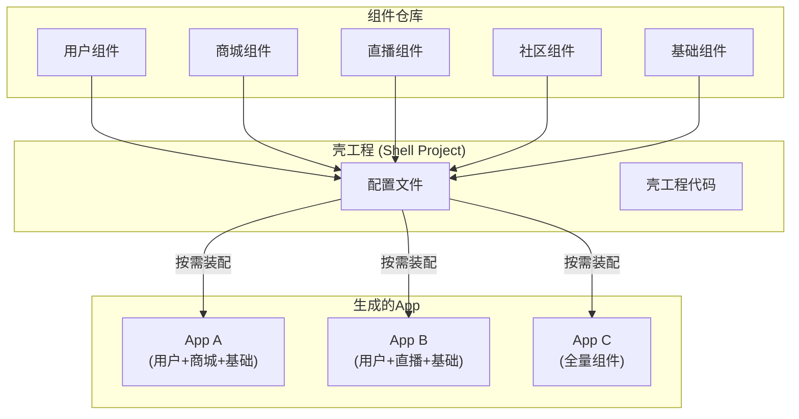
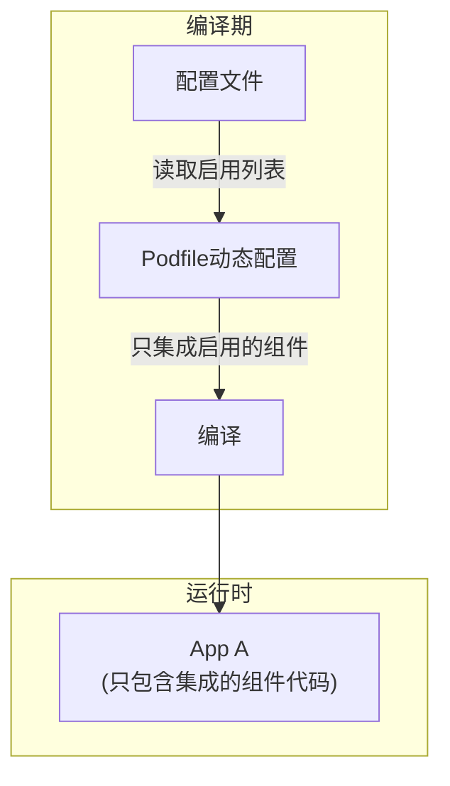
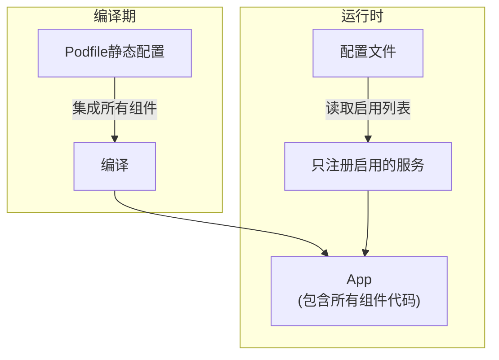
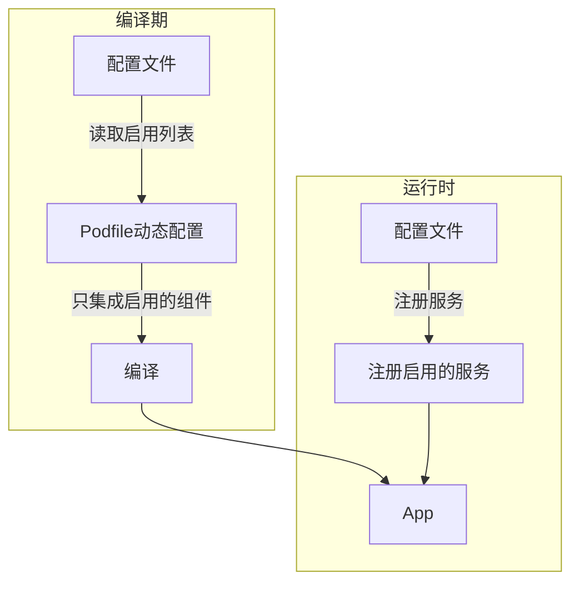
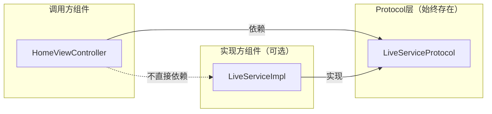
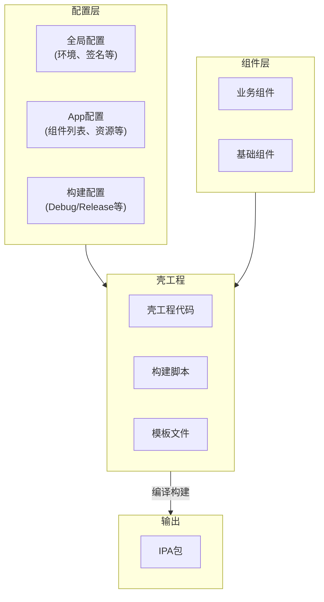
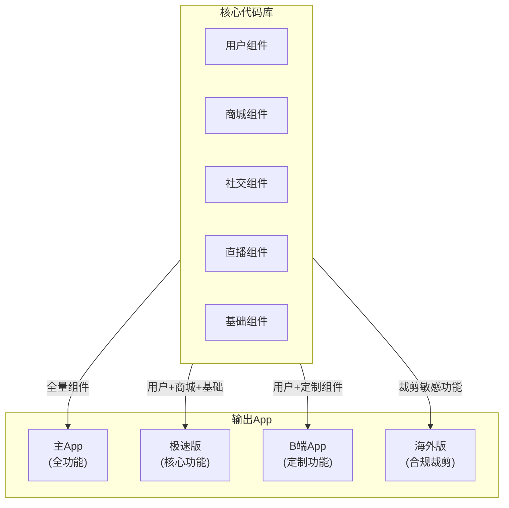

+++
title = "插件化架构详解"
date = '2026-05-02T22:32:27+08:00'
draft = false
weight = 9
tags = ["iOS", "架构"]
categories = ["iOS开发", "架构"]
+++
## 什么是插件化

在iOS开发中，**插件化**通常指的是**编译期插件化**，即通过壳工程（Shell Project）按需装配不同的业务组件，生成不同功能的App。这与Android的运行时插件化（动态加载代码）有本质区别。

### iOS插件化 vs Android插件化

| 特性 | Android插件化 | iOS插件化 |
|------|---------------|-----------|
| 实现方式 | 运行时动态加载APK/DEX | 编译期按需集成组件 |
| 代码热更新 | 支持 | 不支持（App Store限制） |
| 主要目的 | 绕过包大小限制、热修复 | 多App复用、编译提效 |
| 技术难度 | 高（Hook系统API） | 中（工程配置） |

iOS的"插件化"主要体现在：

1. **壳工程设计**：一套代码支撑多个App
2. **配置驱动集成**：通过配置文件决定集成哪些组件
3. **二进制化提效**：稳定组件编译为二进制，减少编译时间



## 两种插件化实现方式

根据组件间通信方案的不同，iOS插件化有两种主要实现方式，它们的核心区别在于**是否强制要求编译期隔离**：

### 方式一：编译期动态集成

适用于 **URL Router** 和 **Target-Action** 等基于字符串调用的组件化方案。



**特点**：
- 未集成的组件代码**完全不会**被编译进App
- 需要在Podfile中根据配置动态引入组件
- 可能需要使用 `#if canImport` 处理可选依赖
- 包体积更小（只包含需要的组件）

### 方式二：运行时服务注册

适用于 **Protocol-Class** 和 **依赖注入（DI）** 等基于协议的组件化方案。

这种方案有两种使用方式：

#### 方式2a：静态集成 + 运行时控制（简单）



#### 方式2b：动态集成 + 运行时控制（包体积优化）



**核心特点**：
- 调用方依赖的是Protocol（接口），而非具体实现
- 服务不存在时返回nil，代码自然降级
- **不强制要求**动态Podfile和canImport（但可以用来减小包体积）
- 可以在编译期控制，也可以在运行时控制（如A/B测试）

在Protocol-Class或DI方案中，组件间的依赖关系是这样的：



**关键点**：调用方依赖的是 **Protocol层**，而不是具体实现。Protocol层作为独立的Pod始终被集成，因此：

1. **不需要动态Podfile**：所有组件都可以集成，区别只在于是否注册服务
2. **不需要canImport**：调用方import的是Protocol，不是具体实现
3. **天然支持降级**：`getService` 返回nil时，业务代码走默认逻辑

```swift
// Protocol层（独立Pod，所有App都依赖）
protocol LiveServiceProtocol {
    func startLive()
    func isLiveAvailable() -> Bool
}

// 调用方（不需要知道LiveModule是否被集成/注册）
class HomeViewController: UIViewController {
    
    func showLiveButton() {
        // 尝试获取服务
        let liveService = ServiceContainer.shared.getService(LiveServiceProtocol.self)
        
        // 如果服务不存在（组件未注册），自然走默认逻辑
        if let service = liveService, service.isLiveAvailable() {
            setupLiveEntrance()
        } else {
            // 不显示直播入口，或显示"功能未开放"
            // 无需任何特殊处理
        }
    }
}
```

### 两种方式的对比

| 维度 | 编译期动态集成 | 运行时服务注册 |
|------|----------------|----------------|
| 适用的组件化方案 | URL Router、Target-Action | Protocol-Class、DI |
| 是否必须动态Podfile | 是 | 否（可选，用于减小包体积） |
| 是否必须canImport | 是 | 否（依赖Protocol层，无需条件编译） |
| 功能控制时机 | 仅编译期 | 编译期或运行时 |
| 包体积 | 更小 | 可大可小（取决于是否动态集成） |
| 构建复杂度 | 较高 | 可高可低（取决于选择） |
| 运行时动态控制 | 不支持 | 支持（如A/B测试、灰度发布） |

## 插件化架构设计

### 整体架构

一个完整的插件化架构包含以下几个核心部分：



### 壳工程设计

壳工程（Shell Project）是插件化的核心，它负责：

1. **统一App入口**：AppDelegate、SceneDelegate
2. **初始化流程**：组件注册、服务初始化
3. **资源管理**：App Icon、Launch Screen、Info.plist
4. **配置管理**：读取和应用App配置

#### 壳工程目录结构

```
ShellProject/
├── App/
│   ├── AppDelegate.swift          # 应用入口
│   ├── SceneDelegate.swift        # 场景管理
│   └── Bootstrap.swift            # 启动引导
├── Configs/
│   ├── AppA/                      # App A的配置
│   │   ├── app.json              # App配置
│   │   ├── Info.plist            # App信息
│   │   └── Assets/               # App资源
│   ├── AppB/                      # App B的配置
│   │   ├── app.json
│   │   ├── Info.plist
│   │   └── Assets/
│   └── Shared/                    # 共享配置
│       └── environment.json
├── Scripts/
│   ├── build.sh                   # 构建脚本
│   └── switch_app.rb              # 切换App脚本
├── Podfile                        # 依赖管理
└── ShellProject.xcworkspace
```

#### AppDelegate实现

```swift
// MARK: - 壳工程AppDelegate

import UIKit

@main
class AppDelegate: UIResponder, UIApplicationDelegate {
    
    var window: UIWindow?
    
    // 组件管理器
    private let moduleManager = ModuleManager.shared
    
    func application(
        _ application: UIApplication,
        didFinishLaunchingWithOptions launchOptions: [UIApplication.LaunchOptionsKey: Any]?
    ) -> Bool {
        
        // 1. 加载App配置
        AppConfig.shared.load()
        
        // 2. 初始化基础服务
        setupFoundationServices()
        
        // 3. 注册并初始化所有组件
        moduleManager.registerAllModules()
        moduleManager.initializeAllModules(launchOptions: launchOptions)
        
        // 4. 设置根视图控制器
        setupRootViewController()
        
        return true
    }
    
    private func setupFoundationServices() {
        // 网络、日志、埋点等基础服务初始化
        NetworkService.shared.setup()
        LogService.shared.setup()
        AnalyticsService.shared.setup()
    }
    
    private func setupRootViewController() {
        window = UIWindow(frame: UIScreen.main.bounds)
        
        // 根据配置决定首页
        let rootVC = moduleManager.createRootViewController()
        window?.rootViewController = rootVC
        window?.makeKeyAndVisible()
    }
}
```

#### 组件管理器

```swift
// MARK: - 组件管理器

/// 组件协议
protocol ModuleProtocol: AnyObject {
    /// 组件标识
    static var moduleIdentifier: String { get }
    
    /// 组件优先级（数字越小优先级越高）
    static var priority: Int { get }
    
    /// 初始化组件
    func initialize(launchOptions: [UIApplication.LaunchOptionsKey: Any]?)
    
    /// 组件提供的服务
    func registerServices()
}

extension ModuleProtocol {
    static var priority: Int { return 100 }
}

/// 组件管理器
class ModuleManager {
    static let shared = ModuleManager()
    
    private(set) var modules: [ModuleProtocol] = []
    
    /// 注册所有组件
    func registerAllModules() {
        // 读取配置，获取需要启用的组件列表
        let enabledModules = AppConfig.shared.enabledModules
        
        // 遍历所有已集成的组件，只初始化启用的
        for moduleType in ModuleRegistry.allModules {
            let identifier = moduleType.moduleIdentifier
            if enabledModules.contains(identifier) {
                let module = moduleType.init()
                modules.append(module)
            }
        }
        
        // 按优先级排序
        modules.sort { type(of: $0).priority < type(of: $1).priority }
    }
    
    /// 初始化所有组件
    func initializeAllModules(launchOptions: [UIApplication.LaunchOptionsKey: Any]?) {
        for module in modules {
            // 注册服务
            module.registerServices()
            // 初始化
            module.initialize(launchOptions: launchOptions)
        }
    }
    
    /// 创建根视图控制器
    func createRootViewController() -> UIViewController {
        // 从Router获取首页
        if let homeVC = Router.shared.viewController(for: AppConfig.shared.homeRoute) {
            return UINavigationController(rootViewController: homeVC)
        }
        return UIViewController()
    }
}
```

### 配置驱动的模块集成

配置驱动是插件化的核心思想，通过配置文件决定启用哪些组件。

#### 配置文件设计

```json
// Configs/AppA/app.json
{
    "appName": "App A",
    "bundleIdentifier": "com.example.appA",
    "version": "1.0.0",
    "environment": "production",
    
    "modules": {
        "enabled": [
            "UserModule",
            "ShopModule",
            "PaymentModule"
        ]
    },
    
    "features": {
        "enablePush": true,
        "enableLocation": false,
        "enableFaceID": true
    },
    
    "routes": {
        "home": "shop://home",
        "login": "user://login"
    },
    
    "theme": {
        "primaryColor": "#FF5722",
        "accentColor": "#2196F3"
    }
}
```

#### 配置管理器

```swift
// MARK: - 配置管理器

class AppConfig {
    static let shared = AppConfig()
    
    private var config: [String: Any] = [:]
    
    /// 当前App标识（通过构建配置注入）
    var appIdentifier: String {
        Bundle.main.object(forInfoDictionaryKey: "APP_IDENTIFIER") as? String ?? "default"
    }
    
    /// 加载配置
    func load() {
        guard let configPath = Bundle.main.path(forResource: "app", ofType: "json"),
              let data = FileManager.default.contents(atPath: configPath),
              let json = try? JSONSerialization.jsonObject(with: data) as? [String: Any] else {
            fatalError("Failed to load app config")
        }
        
        config = json
    }
    
    /// 启用的组件列表
    var enabledModules: [String] {
        guard let modules = config["modules"] as? [String: Any],
              let enabled = modules["enabled"] as? [String] else {
            return []
        }
        return enabled
    }
    
    /// 首页路由
    var homeRoute: String {
        guard let routes = config["routes"] as? [String: String] else {
            return ""
        }
        return routes["home"] ?? ""
    }
    
    /// Feature Flag
    func isFeatureEnabled(_ feature: String) -> Bool {
        guard let features = config["features"] as? [String: Bool] else {
            return false
        }
        return features[feature] ?? false
    }
    
    /// 获取任意配置值
    func value<T>(forKey key: String) -> T? {
        return config[key] as? T
    }
}
```

### 编译期动态集成方案

如果采用URL Router或Target-Action方案，需要在Podfile中动态配置：

#### Podfile动态配置

```ruby
# Podfile（编译期动态集成方案）

# 读取当前App配置
require 'json'
app_id = ENV['APP_ID'] || 'AppA'
config_path = "./Configs/#{app_id}/app.json"
config = JSON.parse(File.read(config_path))
enabled_modules = config['modules']['enabled']

platform :ios, '13.0'
use_frameworks!

target 'ShellProject' do
    # 基础组件（必须）
    pod 'FoundationKit', :path => './Modules/Foundation'
    pod 'Router', :path => './Modules/Router'
    
    # 动态集成业务组件（只集成配置中启用的）
    enabled_modules.each do |module_name|
        pod module_name, :path => "./Modules/#{module_name}"
    end
end

# 后处理：复制对应App的资源文件
post_install do |installer|
    FileUtils.cp_r("./Configs/#{app_id}/Assets/.", "./ShellProject/Assets/")
    FileUtils.cp("./Configs/#{app_id}/Info.plist", "./ShellProject/Info.plist")
end
```

#### 处理可选依赖

```swift
// 编译期动态集成方案需要处理可选依赖

// 方式1：使用 canImport
#if canImport(LiveModule)
import LiveModule

extension HomeViewController {
    func setupLiveIfAvailable() {
        LiveManager.shared.setup()
    }
}
#else
extension HomeViewController {
    func setupLiveIfAvailable() {
        // 空实现或显示"功能未开放"
    }
}
#endif

// 方式2：使用Target-Action（运行时反射）
class HomeViewController: UIViewController {
    func showLive() {
        // 通过字符串调用，运行时才知道是否存在
        if let vc = CTMediator.shared.performTarget("Live", action: "home", params: nil) as? UIViewController {
            navigationController?.pushViewController(vc, animated: true)
        } else {
            showToast("功能未开放")
        }
    }
}
```

### 运行时服务注册方案

Protocol-Class或DI方案有两种配置方式，可根据需求选择：

#### 方式A：静态Podfile（简单，推荐）

```ruby
# Podfile（静态配置，所有组件都集成）

platform :ios, '13.0'
use_frameworks!

target 'ShellProject' do
    # Protocol层（必须，所有App都依赖）
    pod 'ServiceProtocols', :path => './Modules/ServiceProtocols'
    pod 'ServiceContainer', :path => './Modules/ServiceContainer'
    
    # 所有业务组件都集成（但只有注册的才会生效）
    pod 'UserModule', :path => './Modules/UserModule'
    pod 'ShopModule', :path => './Modules/ShopModule'
    pod 'LiveModule', :path => './Modules/LiveModule'
    pod 'SocialModule', :path => './Modules/SocialModule'
    pod 'PaymentModule', :path => './Modules/PaymentModule'
    
    # 基础组件
    pod 'FoundationKit', :path => './Modules/Foundation'
end
```

**优点**：构建流程简单，不需要根据配置重新 `pod install`
**缺点**：所有组件都会被编译进App，包体积较大

#### 方式B：动态Podfile（包体积优化）

```ruby
# Podfile（动态配置，只集成启用的组件）

require 'json'
app_id = ENV['APP_ID'] || 'AppA'
config = JSON.parse(File.read("./Configs/#{app_id}/app.json"))
enabled_modules = config['modules']['enabled']

platform :ios, '13.0'
use_frameworks!

target 'ShellProject' do
    # Protocol层（必须）
    pod 'ServiceProtocols', :path => './Modules/ServiceProtocols'
    pod 'ServiceContainer', :path => './Modules/ServiceContainer'
    
    # 只集成启用的业务组件
    enabled_modules.each do |module_name|
        pod module_name, :path => "./Modules/#{module_name}"
    end
    
    # 基础组件
    pod 'FoundationKit', :path => './Modules/Foundation'
end
```

**优点**：包体积更小，只包含需要的组件
**缺点**：切换App配置需要重新 `pod install`

#### 关键区别：即使动态集成，也不需要canImport

```swift
// Protocol-Class方案的核心优势：
// 即使采用动态Podfile，调用方代码也不需要canImport

// 因为调用方依赖的是Protocol层（始终存在），而非具体实现
// 所以无论LiveModule是否被集成，以下代码都能编译通过

class HomeViewController: UIViewController {
    func showLive() {
        // LiveModule未集成时：getService返回nil，走else分支
        // LiveModule已集成时：getService返回实例，正常使用
        if let liveService = ServiceContainer.shared.getService(LiveServiceProtocol.self) {
            liveService.startLive()
        } else {
            showToast("功能未开放")
        }
    }
}
```

#### 不同App的区别：注册不同的服务

```swift
// 组件注册表
enum ModuleRegistry {
    // 方式A（静态Podfile）：包含所有组件
    // 方式B（动态Podfile）：由脚本根据配置生成，只包含启用的组件
    static let allModules: [ModuleProtocol.Type] = [
        UserModule.self,
        ShopModule.self,
        LiveModule.self,
        SocialModule.self,
        PaymentModule.self,
    ]
}

// 无论哪种方式，启动时都根据配置决定注册哪些服务
// App A 配置：enabled = ["UserModule", "ShopModule", "PaymentModule"]
// App B 配置：enabled = ["UserModule", "LiveModule"]
```

#### 调用方代码（无需特殊处理）

```swift
// 调用方只依赖Protocol，不需要知道具体实现是否存在
class HomeViewController: UIViewController {
    
    func showLiveEntrance() {
        // 尝试获取直播服务
        guard let liveService = ServiceContainer.shared.getService(LiveServiceProtocol.self) else {
            // 服务不存在 = 功能未启用，走默认逻辑
            return
        }
        
        // 服务存在，正常使用
        if liveService.isLiveAvailable() {
            let button = createLiveButton()
            view.addSubview(button)
        }
    }
    
    func showUserProfile(userId: String) {
        // 同样的模式
        guard let userRouter = ServiceContainer.shared.getService(UserRouterProtocol.self) else {
            showToast("用户模块未启用")
            return
        }
        
        let vc = userRouter.profileViewController(userId: userId)
        navigationController?.pushViewController(vc, animated: true)
    }
}
```

#### 构建脚本

```bash
#!/bin/bash
# Scripts/build.sh

# 使用方式: ./build.sh AppA Release

APP_ID=$1
BUILD_TYPE=${2:-Debug}

echo "Building $APP_ID ($BUILD_TYPE)..."

# 1. 复制对应App的配置文件
cp "./Configs/$APP_ID/app.json" "./ShellProject/Resources/app.json"
cp "./Configs/$APP_ID/Info.plist" "./ShellProject/Info.plist"
cp -r "./Configs/$APP_ID/Assets/." "./ShellProject/Assets/"

# 2. 构建App（Podfile是静态的，不需要重新pod install）
xcodebuild \
    -workspace ShellProject.xcworkspace \
    -scheme ShellProject \
    -configuration $BUILD_TYPE \
    -archivePath "./build/$APP_ID.xcarchive" \
    archive

# 3. 导出IPA
xcodebuild \
    -exportArchive \
    -archivePath "./build/$APP_ID.xcarchive" \
    -exportPath "./build/$APP_ID" \
    -exportOptionsPlist "./Configs/$APP_ID/ExportOptions.plist"

echo "Build completed: ./build/$APP_ID/$APP_ID.ipa"
```

## 多App支撑实践

### 应用场景

插件化架构特别适合以下场景：

1. **一套代码多个App**：主App、极速版、海外版等
2. **To B定制化**：为不同客户定制专属App
3. **马甲包**：快速生成多个类似App



### 差异化配置

#### 1. App级别差异

```json
// 主App配置
{
    "appName": "主App",
    "modules": {
        "enabled": ["UserModule", "ShopModule", "SocialModule", "LiveModule", "PaymentModule"]
    },
    "features": {
        "enableLive": true,
        "enableSocial": true,
        "enableInAppPurchase": true
    }
}

// 极速版配置
{
    "appName": "极速版",
    "modules": {
        "enabled": ["UserModule", "ShopModule", "PaymentModule"]
    },
    "features": {
        "enableLive": false,
        "enableSocial": false,
        "enableInAppPurchase": true
    }
}
```

#### 2. 功能级别差异

```swift
// MARK: - Feature Flag使用

class ShopViewController: UIViewController {
    
    override func viewDidLoad() {
        super.viewDidLoad()
        
        setupUI()
        
        // 方式1：通过Feature Flag控制（适合细粒度控制）
        if AppConfig.shared.isFeatureEnabled("enableLive") {
            setupLiveEntrance()
        }
        
        // 方式2：通过服务是否存在控制（Protocol方案推荐）
        if let liveService = ServiceContainer.shared.getService(LiveServiceProtocol.self),
           liveService.isLiveAvailable() {
            setupLiveEntrance()
        }
        
        // 方式3：组合使用（最灵活）
        // Feature Flag控制是否显示入口，Service控制具体功能
        if AppConfig.shared.isFeatureEnabled("enableSocial") {
            setupShareButton()
        }
    }
}
```

#### 3. UI/主题差异

```swift
// MARK: - 主题配置

class ThemeManager {
    static let shared = ThemeManager()
    
    private var theme: Theme!
    
    func setup() {
        // 从配置加载主题
        guard let themeConfig = AppConfig.shared.value(forKey: "theme") as? [String: String] else {
            theme = Theme.default
            return
        }
        
        theme = Theme(
            primaryColor: UIColor(hex: themeConfig["primaryColor"] ?? "#007AFF"),
            accentColor: UIColor(hex: themeConfig["accentColor"] ?? "#FF9500"),
            backgroundColor: UIColor(hex: themeConfig["backgroundColor"] ?? "#FFFFFF")
        )
    }
    
    var primaryColor: UIColor { theme.primaryColor }
    var accentColor: UIColor { theme.accentColor }
}

struct Theme {
    let primaryColor: UIColor
    let accentColor: UIColor
    let backgroundColor: UIColor
    
    static let `default` = Theme(
        primaryColor: .systemBlue,
        accentColor: .systemOrange,
        backgroundColor: .white
    )
}
```

## 插件化最佳实践

### 1. 组件自注册

避免在壳工程手动注册组件，使用自注册机制。常见的实现方式有以下几种：

#### 方式一：利用OC的+load方法

```objc
// MARK: - Objective-C实现

@interface UserModule : NSObject <ModuleProtocol>
@end

@implementation UserModule

+ (void)load {
    // +load在类加载时自动调用，早于main函数
    [ModuleManager.shared registerModule:self];
}

- (void)initializeWithLaunchOptions:(NSDictionary *)launchOptions {
    // 模块初始化
}

@end
```

#### 方式二：Swift中使用__attribute__

```swift
// MARK: - Swift组件自注册

// 在组件的某个Swift文件中添加
@_cdecl("UserModuleRegister")
public func UserModuleRegister() {
    ModuleManager.shared.register(UserModule.self)
}

// 然后在OC桥接文件中调用，或使用构造函数属性
// 这种方式需要配合OC代码使用
```

#### 方式三：使用编译期注册表（推荐）

```swift
// MARK: - 编译期注册（更安全的方式）

/// 在壳工程中维护一个模块注册表
/// 由构建脚本自动生成

// ModuleRegistry.swift（自动生成）
enum ModuleRegistry {
    static let allModules: [ModuleProtocol.Type] = [
        UserModule.self,
        ShopModule.self,
        PaymentModule.self,
        // ... 由脚本根据配置自动生成
    ]
}

// 组件管理器使用注册表
class ModuleManager {
    static let shared = ModuleManager()
    
    private(set) var modules: [ModuleProtocol] = []
    
    func registerAllModules() {
        let enabledModules = AppConfig.shared.enabledModules
        
        // 从编译期生成的注册表获取模块列表
        for moduleType in ModuleRegistry.allModules {
            // 只初始化配置中启用的模块
            if enabledModules.contains(moduleType.moduleIdentifier) {
                let module = moduleType.init()
                modules.append(module)
            }
        }
        
        // 按优先级排序
        modules.sort { type(of: $0).priority < type(of: $1).priority }
    }
}
```

```ruby
# 构建脚本：根据配置生成ModuleRegistry.swift

require 'json'

app_id = ENV['APP_ID'] || 'AppA'
config = JSON.parse(File.read("./Configs/#{app_id}/app.json"))
enabled_modules = config['modules']['enabled']

# 生成Swift文件
registry_content = <<~SWIFT
// 此文件由构建脚本自动生成，请勿手动修改
// Generated for: #{app_id}

enum ModuleRegistry {
    static let allModules: [ModuleProtocol.Type] = [
        #{enabled_modules.map { |m| "#{m}.self" }.join(",\n        ")}
    ]
}
SWIFT

File.write('./ShellProject/Generated/ModuleRegistry.swift', registry_content)
```

### 2. 编译隔离（仅编译期动态集成方案需要）

如果采用编译期动态集成方案，需要确保组件在不集成的情况下不会被编译进App：

```swift
// MARK: - 编译隔离（URL Router / Target-Action 方案）

// 错误做法：硬编码import，即使不使用也会被编译
import LiveModule  // 如果LiveModule没有被Podfile引入，会报错

// 正确做法1：使用条件编译
#if canImport(LiveModule)
import LiveModule

extension SomeClass {
    func setupLive() {
        LiveManager.shared.setup()
    }
}
#endif

// 正确做法2：使用Target-Action（运行时反射）
if let vc = CTMediator.shared.performTarget("Live", action: "home", params: nil) as? UIViewController {
    // ...
}
```

```swift
// MARK: - 无需编译隔离（Protocol-Class / DI 方案）

// 因为依赖的是Protocol层，而Protocol层始终存在
// 所以不需要 canImport 或条件编译

protocol LiveServiceProtocol {
    func startLive()
}

// 直接调用，服务不存在时返回nil
if let liveService = ServiceContainer.shared.getService(LiveServiceProtocol.self) {
    liveService.startLive()
} else {
    // 走默认逻辑
}
```

### 3. 资源隔离

每个组件管理自己的资源，避免资源冲突：

```swift
// MARK: - 组件资源访问

// 组件内部定义资源Bundle
extension Bundle {
    static var userModule: Bundle {
        // 获取组件的Bundle
        let bundleName = "UserModule"
        guard let bundleURL = Bundle.main.url(forResource: bundleName, withExtension: "bundle"),
              let bundle = Bundle(url: bundleURL) else {
            // 开发期间可能在主Bundle中
            return Bundle.main
        }
        return bundle
    }
}

// 使用组件资源
class UserProfileViewController: UIViewController {
    override func viewDidLoad() {
        super.viewDidLoad()
        
        // 加载组件内的图片
        let image = UIImage(named: "avatar_placeholder", in: .userModule, compatibleWith: nil)
        
        // 加载组件内的xib
        let nib = UINib(nibName: "UserCell", bundle: .userModule)
        
        // 加载组件内的本地化字符串
        let title = NSLocalizedString("profile_title", bundle: .userModule, comment: "")
    }
}
```
