+++
title = "组件化架构详解"
date = '2026-05-02T22:32:27+08:00'
draft = false
weight = 10
tags = ["iOS", "架构"]
categories = ["iOS开发", "架构"]
+++
## 什么是组件化

组件化是一种**工程架构思想**，将一个大型App拆分为多个独立的业务组件（Module），每个组件可以独立开发、独立测试、独立编译，组件之间通过**中间层**进行解耦通信。

### 组件化解决的问题

| 问题 | 未组件化 | 组件化后 |
|------|----------|----------|
| 编译速度 | 全量编译，耗时长 | 只编译修改的组件，支持二进制化 |
| 团队协作 | 代码冲突频繁 | 独立仓库，减少冲突 |
| 代码复用 | 复制粘贴，难以维护 | 组件复用，统一维护 |
| 耦合度 | 类之间直接依赖，牵一发动全身 | 通过中间层通信，解耦 |
| 测试 | 难以单元测试 | 组件可独立测试 |

### 组件化与页面架构的关系

组件化是**工程架构**，关注的是App整体的模块划分和通信方式；而MVC、MVVM、TCA等是**页面架构**，关注的是单个页面内的代码组织。

两者并不冲突，在大型项目中通常会同时采用：

- **工程层面**：使用组件化拆分业务模块
- **组件内部**：每个组件使用MVVM/TCA等页面架构

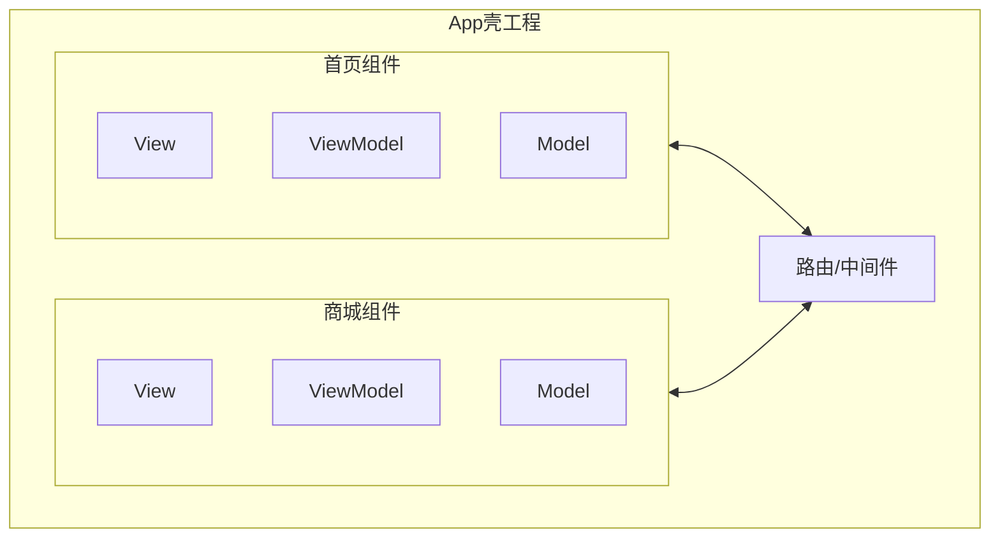

## 组件化的分层架构

典型的组件化架构采用三层结构：

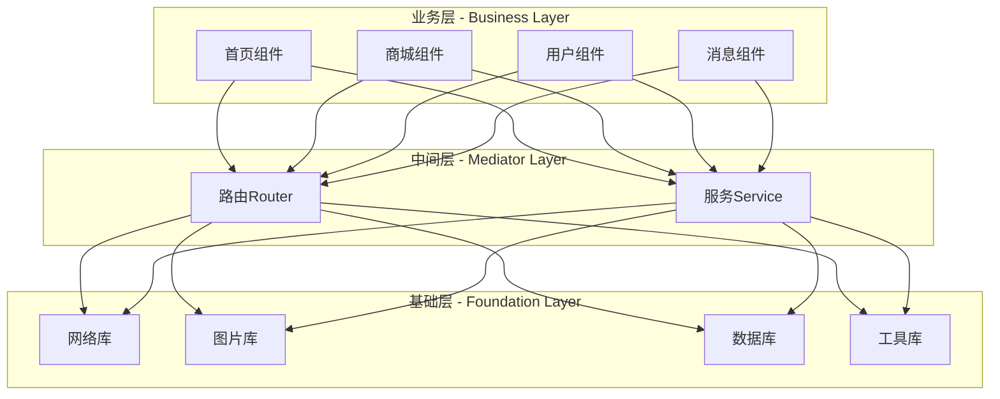

### 业务层（Business Layer）

业务层包含各个业务组件，每个组件是一个独立的业务单元：

- **独立性**：组件之间不直接依赖，只能通过中间层通信
- **可复用**：组件可以在不同App中复用
- **可替换**：组件可以被替换而不影响其他组件

### 中间层（Mediator Layer）

中间层是组件化的核心，负责组件间的通信：

- **路由（Router）**：负责页面跳转
- **服务（Service）**：负责跨组件的方法调用和数据获取

### 基础层（Foundation Layer）

基础层提供基础能力，被所有业务组件依赖：

- 网络请求、图片加载、数据库、埋点、日志等
- 基础UI组件、工具类

### 依赖规则

组件化架构的核心依赖规则是**单向依赖**：

```
业务层 → 中间层 → 基础层
```

- 上层可以依赖下层
- 下层不能依赖上层
- **同层之间不能直接依赖**（业务组件之间不能import）

## 组件间通信方案

组件化的核心问题是：**组件之间如何在不直接依赖的情况下进行通信？**

常见的通信方案有四种：

| 方案 | 代表库 | 原理 | 优点 | 缺点 |
|------|--------|------|------|------|
| URL Router | MGJRouter | URL注册和调用 | 简单易用，支持跨App | 参数类型不安全，字符串管理成本高 |
| Target-Action | CTMediator | Runtime反射调用 | 无需注册，编译期无依赖 | 硬编码多，缺少编译检查 |
| Protocol-Class | BeeHive | 协议注册和获取 | 类型安全，面向接口 | 需要维护协议和注册 |
| 依赖注入（DI）| Swinject | DI容器管理依赖 | 完整的生命周期管理 | 学习成本高，配置复杂 |

### 方案一：URL Router

URL Router是最早被广泛使用的组件化方案，代表库是蘑菇街的**MGJRouter**。

#### 核心思想

将每个页面或服务注册为一个URL，通过URL进行跳转和调用：

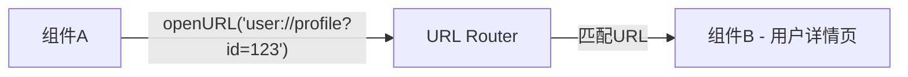

#### 实现示例

```swift
// MARK: - MGJRouter核心API

class MGJRouter {
    static let shared = MGJRouter()
    
    /// URL注册表：URL Pattern -> Handler
    private var routes: [String: ([String: Any]) -> Any?] = [:]
    
    /// 注册URL
    func registerURL(_ pattern: String, handler: @escaping ([String: Any]) -> Any?) {
        routes[pattern] = handler
    }
    
    /// 打开URL
    @discardableResult
    func openURL(_ url: String, params: [String: Any] = [:]) -> Any? {
        // 解析URL，匹配注册的pattern
        guard let (pattern, urlParams) = matchURL(url),
              let handler = routes[pattern] else {
            return nil
        }
        
        // 合并URL参数和额外参数
        var allParams = urlParams
        allParams.merge(params) { _, new in new }
        
        return handler(allParams)
    }
    
    private func matchURL(_ url: String) -> (String, [String: Any])? {
        // URL匹配逻辑...
        return nil
    }
}
```

```swift
// MARK: - 用户组件注册

class UserModule {
    static func registerRoutes() {
        // 注册用户详情页
        MGJRouter.shared.registerURL("user://profile") { params in
            guard let userId = params["id"] as? String else { return nil }
            let vc = UserProfileViewController(userId: userId)
            return vc
        }
        
        // 注册登录服务
        MGJRouter.shared.registerURL("user://login") { params in
            let completion = params["completion"] as? (Bool) -> Void
            LoginService.shared.login { success in
                completion?(success)
            }
            return nil
        }
    }
}

// MARK: - 首页组件调用

class HomeViewController: UIViewController {
    func showUserProfile(userId: String) {
        // 通过URL跳转，不需要import用户组件
        if let vc = MGJRouter.shared.openURL("user://profile?id=\(userId)") as? UIViewController {
            navigationController?.pushViewController(vc, animated: true)
        }
    }
    
    func checkLogin() {
        MGJRouter.shared.openURL("user://login", params: [
            "completion": { [weak self] success in
                if success {
                    self?.refreshData()
                }
            }
        ])
    }
}
```

#### 优缺点分析

**优点**：
- 实现简单，容易理解
- 支持跨App调用（Universal Links、Scheme）
- 动态化友好，服务端可下发跳转URL

**缺点**：
- 参数传递不安全，依赖字符串Key
- URL硬编码，维护成本高
- 复杂对象（如闭包）需要通过params额外传递，不够优雅
- 缺少编译时检查

### 方案二：Target-Action（CTMediator）

Target-Action方案由Casa提出，通过**Runtime反射**调用其他组件，代表库是**CTMediator**。

#### 核心思想

利用Objective-C的Runtime特性，通过字符串动态调用目标类的方法，无需import目标组件：

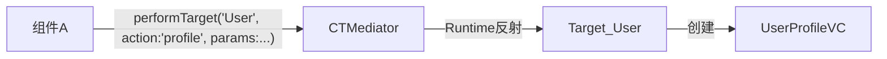

#### 架构设计

CTMediator采用三层架构：

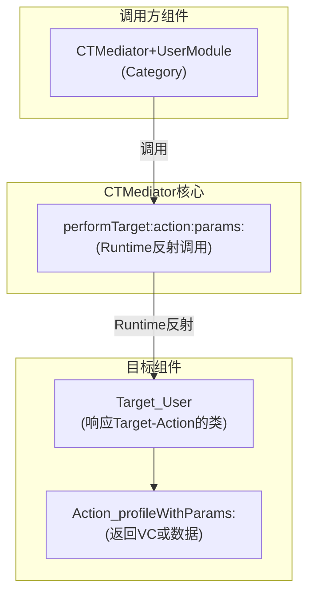

#### 实现示例

```swift
// MARK: - CTMediator核心类

class CTMediator {
    static let shared = CTMediator()
    
    /// 核心方法：通过Runtime调用Target的Action
    func performTarget(_ targetName: String, 
                       action actionName: String, 
                       params: [String: Any]?, 
                       shouldCacheTarget: Bool = false) -> Any? {
        
        // 1. 拼接Target类名
        let targetClassString = "Target_\(targetName)"
        
        // 2. 获取Target类
        guard let targetClass = NSClassFromString(targetClassString) as? NSObject.Type else {
            // 降级处理
            return nil
        }
        
        let target = targetClass.init()
        
        // 3. 拼接Action方法名
        let actionString = "Action_\(actionName)WithParams:"
        let action = NSSelectorFromString(actionString)
        
        // 4. 检查方法是否存在
        guard target.responds(to: action) else {
            return nil
        }
        
        // 5. 执行方法
        return target.perform(action, with: params)?.takeUnretainedValue()
    }
}
```

```swift
// MARK: - 用户组件的Target（用户组件内部）

class Target_User: NSObject {
    
    /// 用户详情页
    /// - 方法名必须以 Action_ 开头，以 WithParams: 结尾
    @objc func Action_profileWithParams(_ params: [String: Any]) -> UIViewController {
        guard let userId = params["userId"] as? String else {
            return UIViewController()
        }
        return UserProfileViewController(userId: userId)
    }
    
    /// 获取用户信息
    @objc func Action_userInfoWithParams(_ params: [String: Any]) -> [String: Any]? {
        guard let userId = params["userId"] as? String else {
            return nil
        }
        return UserService.shared.getUserInfo(userId: userId)
    }
}
```

```swift
// MARK: - CTMediator的Category（调用方组件依赖）

extension CTMediator {
    /// 跳转用户详情页
    func userProfileViewController(userId: String) -> UIViewController? {
        performTarget("User", 
                      action: "profile", 
                      params: ["userId": userId]) as? UIViewController
    }
    
    /// 获取用户信息
    func userInfo(userId: String) -> [String: Any]? {
        performTarget("User", 
                      action: "userInfo", 
                      params: ["userId": userId]) as? [String: Any]
    }
}

// MARK: - 首页组件调用

class HomeViewController: UIViewController {
    func showUserProfile(userId: String) {
        // 通过Category调用，有类型提示
        if let vc = CTMediator.shared.userProfileViewController(userId: userId) {
            navigationController?.pushViewController(vc, animated: true)
        }
    }
}
```

#### 优缺点分析

**优点**：
- 无需注册，减少启动时间
- Category提供类型安全的API
- 组件间完全解耦，编译时无依赖

**缺点**：
- 依赖OC Runtime，纯Swift项目需要额外处理
- 硬编码字符串（Target名、Action名）
- 参数传递依赖字典，类型不安全
- 缺少编译时检查，运行时才能发现错误

### 方案三：Protocol-Class（BeeHive）

Protocol-Class方案通过**协议注册**和**服务发现**实现组件间通信，代表库是阿里的**BeeHive**。

#### 核心思想

每个组件暴露一个协议（Protocol），将协议和实现类注册到容器中。调用方通过协议获取服务实例：

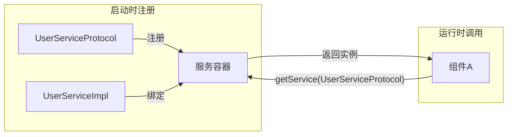

#### 架构特点：依赖接口而非实现

与 URL Router 和 Target-Action 不同，Protocol-Class 方案的**组件依赖的是接口（Protocol），而非具体实现**。这需要引入一个独立的**协议层**：

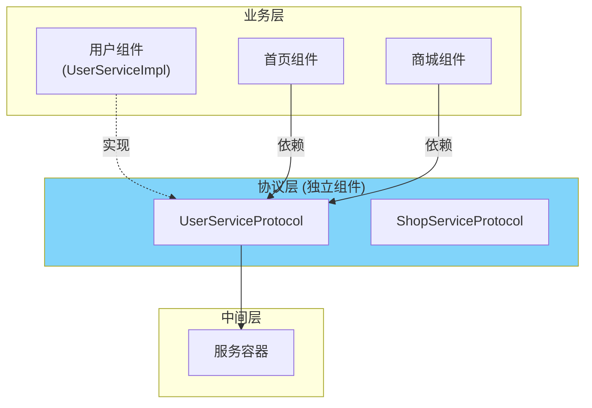

**关键点**：

- **协议层独立**：所有 Protocol 定义放在独立组件中，被所有业务组件依赖
- **依赖倒置**：业务组件依赖抽象（Protocol），而非具体实现（Impl）
- **编译隔离**：首页组件只需 import 协议组件，无需 import 用户组件的实现代码

#### 实现示例

```swift
// MARK: - 服务容器

class ServiceContainer {
    static let shared = ServiceContainer()
    
    /// Protocol -> Class 的映射表
    private var serviceMap: [String: AnyClass] = [:]
    /// 已创建的服务实例缓存（单例）
    private var serviceInstances: [String: Any] = [:]
    
    /// 注册服务
    func registerService<P>(_ protocol: P.Type, implClass: AnyClass) {
        let key = String(describing: `protocol`)
        serviceMap[key] = implClass
    }
    
    /// 获取服务（单例模式）
    func getService<P>(_ protocol: P.Type) -> P? {
        let key = String(describing: `protocol`)
        
        // 先从缓存获取
        if let instance = serviceInstances[key] as? P {
            return instance
        }
        
        // 创建新实例
        guard let implClass = serviceMap[key] as? NSObject.Type else {
            return nil
        }
        
        let instance = implClass.init()
        serviceInstances[key] = instance
        return instance as? P
    }
}
```

```swift
// MARK: - 用户组件对外协议（独立的协议库）

/// 用户服务协议 - 放在独立的Protocol组件中
protocol UserServiceProtocol {
    func getUserProfile(userId: String) -> UserProfile?
    func isLoggedIn() -> Bool
    func login(completion: @escaping (Bool) -> Void)
}

/// 用户页面协议
protocol UserRouterProtocol {
    func profileViewController(userId: String) -> UIViewController
    func settingsViewController() -> UIViewController
}
```

```swift
// MARK: - 用户组件实现（用户组件内部）

class UserServiceImpl: NSObject, UserServiceProtocol {
    func getUserProfile(userId: String) -> UserProfile? {
        // 实现获取用户信息
        return UserRepository.shared.getProfile(userId: userId)
    }
    
    func isLoggedIn() -> Bool {
        return UserSession.shared.isLoggedIn
    }
    
    func login(completion: @escaping (Bool) -> Void) {
        LoginManager.shared.showLogin { success in
            completion(success)
        }
    }
}

class UserRouterImpl: NSObject, UserRouterProtocol {
    func profileViewController(userId: String) -> UIViewController {
        return UserProfileViewController(userId: userId)
    }
    
    func settingsViewController() -> UIViewController {
        return UserSettingsViewController()
    }
}

// 用户组件入口 - 注册服务
class UserModule {
    static func registerServices() {
        ServiceContainer.shared.registerService(UserServiceProtocol.self, implClass: UserServiceImpl.self)
        ServiceContainer.shared.registerService(UserRouterProtocol.self, implClass: UserRouterImpl.self)
    }
}
```

```swift
// MARK: - 首页组件调用

class HomeViewController: UIViewController {
    // 通过协议获取服务
    var userService: UserServiceProtocol? {
        ServiceContainer.shared.getService(UserServiceProtocol.self)
    }
    
    var userRouter: UserRouterProtocol? {
        ServiceContainer.shared.getService(UserRouterProtocol.self)
    }
    
    func showUserProfile(userId: String) {
        // 类型安全的调用
        if let vc = userRouter?.profileViewController(userId: userId) {
            navigationController?.pushViewController(vc, animated: true)
        }
    }
    
    func checkLoginAndDoSomething() {
        guard let userService = userService else { return }
        
        if userService.isLoggedIn() {
            doSomething()
        } else {
            userService.login { [weak self] success in
                if success {
                    self?.doSomething()
                }
            }
        }
    }
}
```

#### 优缺点分析

**优点**：
- 类型安全，面向协议编程
- 编译时检查协议方法
- 接口清晰，易于mock测试

**缺点**：
- 需要维护独立的Protocol组件
- 需要显式注册，增加启动时间
- 协议修改会影响多个组件

### 方案四：依赖注入（DI）

依赖注入是Protocol-Class的增强版本，通过DI容器管理依赖关系，代表库是**Swinject**、**Resolver**、**Needle**。

#### 核心思想

依赖注入（Dependency Injection）是一种设计模式，组件不自己创建依赖，而是由外部注入。DI容器负责：

- 依赖的注册和解析
- 依赖树的自动构建
- 生命周期管理（单例、瞬态、作用域）

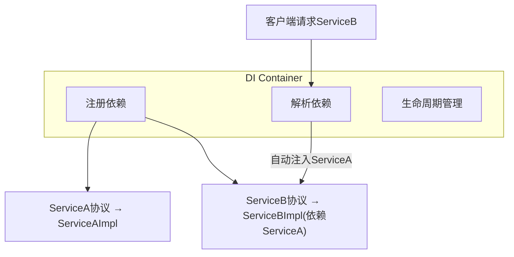

#### 架构特点：依赖接口而非实现

依赖注入同样遵循**依赖倒置原则（DIP）**，组件依赖的是协议而非具体实现。与 Protocol-Class 类似，需要独立的协议层：

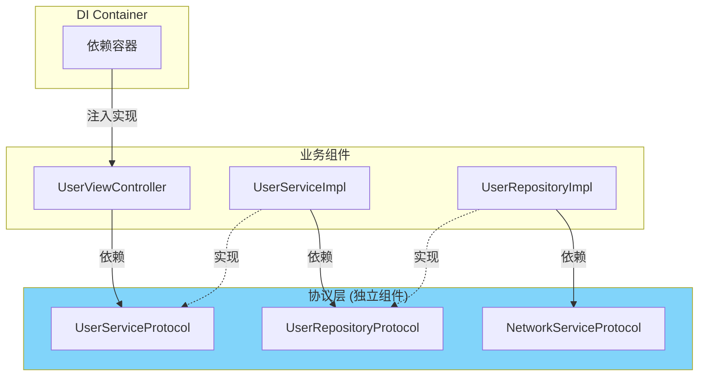

**与 Protocol-Class 的区别**：

- DI 容器自动解析依赖链：请求 `UserServiceProtocol` 时，会自动注入其依赖的 `UserRepositoryProtocol`
- 支持构造器注入，依赖关系更清晰
- 实现类通过构造器声明依赖，而非主动从容器获取

#### 与Protocol-Class的区别

| 特性 | Protocol-Class | 依赖注入（DI） |
|------|----------------|----------------|
| 依赖树 | 不支持 | 自动解析依赖树 |
| 生命周期 | 简单的单例 | 单例/瞬态/作用域 |
| 循环依赖 | 需手动处理 | 框架处理 |
| 配置复杂度 | 低 | 中高 |

#### 实现示例（Swinject）

```swift
// MARK: - 定义协议

protocol NetworkServiceProtocol {
    func request<T: Decodable>(url: String) async throws -> T
}

protocol UserRepositoryProtocol {
    func getUser(id: String) async throws -> User
}

protocol UserServiceProtocol {
    func getUserProfile(id: String) async throws -> UserProfile
}
```

```swift
// MARK: - 实现类（声明依赖，但不自己创建）

class NetworkServiceImpl: NetworkServiceProtocol {
    func request<T: Decodable>(url: String) async throws -> T {
        // 网络请求实现
    }
}

class UserRepositoryImpl: UserRepositoryProtocol {
    // 依赖由外部注入
    let networkService: NetworkServiceProtocol
    
    init(networkService: NetworkServiceProtocol) {
        self.networkService = networkService
    }
    
    func getUser(id: String) async throws -> User {
        try await networkService.request(url: "/users/\(id)")
    }
}

class UserServiceImpl: UserServiceProtocol {
    // 依赖由外部注入
    let repository: UserRepositoryProtocol
    
    init(repository: UserRepositoryProtocol) {
        self.repository = repository
    }
    
    func getUserProfile(id: String) async throws -> UserProfile {
        let user = try await repository.getUser(id: id)
        return UserProfile(user: user)
    }
}
```

```swift
// MARK: - Swinject配置

import Swinject

class AppContainer {
    static let shared = AppContainer()
    let container = Container()
    
    func registerAll() {
        // 注册NetworkService（单例）
        container.register(NetworkServiceProtocol.self) { _ in
            NetworkServiceImpl()
        }.inObjectScope(.container)  // 单例
        
        // 注册UserRepository（自动注入NetworkService）
        container.register(UserRepositoryProtocol.self) { resolver in
            let networkService = resolver.resolve(NetworkServiceProtocol.self)!
            return UserRepositoryImpl(networkService: networkService)
        }
        
        // 注册UserService（自动注入UserRepository）
        container.register(UserServiceProtocol.self) { resolver in
            let repository = resolver.resolve(UserRepositoryProtocol.self)!
            return UserServiceImpl(repository: repository)
        }
    }
    
    func resolve<T>(_ type: T.Type) -> T? {
        container.resolve(type)
    }
}
```

```swift
// MARK: - 使用

class UserViewController: UIViewController {
    // 依赖注入
    var userService: UserServiceProtocol?
    
    func loadUser(id: String) async {
        guard let userService = userService else { return }
        
        do {
            let profile = try await userService.getUserProfile(id: id)
            updateUI(with: profile)
        } catch {
            showError(error)
        }
    }
}

// 创建ViewController时注入依赖
let vc = UserViewController()
vc.userService = AppContainer.shared.resolve(UserServiceProtocol.self)
```

#### 优缺点分析

**优点**：
- 自动解析依赖树，减少手动创建
- 完整的生命周期管理
- 便于单元测试，轻松替换mock

**缺点**：
- 学习成本高
- 配置复杂，需要理解DI概念
- 过度使用会导致代码难以理解

## 组件化实践

### 代码仓库管理

组件化项目通常采用**多仓库**或**Monorepo**两种方式：

#### 多仓库（Multi-Repo）

每个组件一个独立Git仓库：

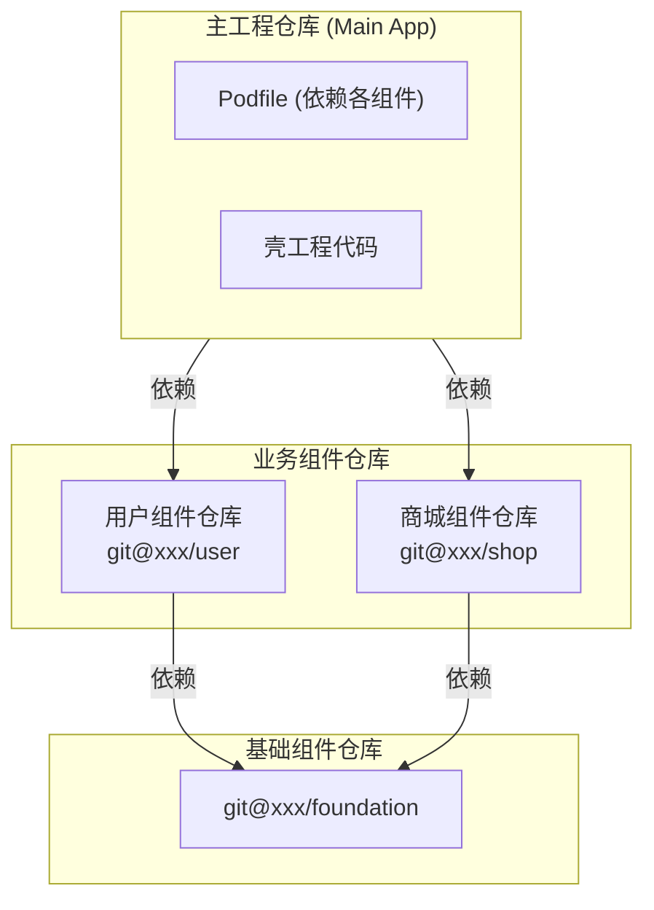

**优点**：权限控制细粒度、组件独立版本管理

**缺点**：仓库管理复杂、跨组件修改困难

#### Monorepo

所有组件在同一个仓库：

```
monorepo/
├── apps/
│   └── MainApp/
├── modules/
│   ├── user/
│   ├── shop/
│   └── message/
├── foundation/
│   ├── network/
│   └── utils/
└── Podfile
```

**优点**：原子提交、重构方便、统一CI/CD

**缺点**：仓库体积大、需要工具支持（如Bazel）

### CocoaPods组件化

CocoaPods是iOS组件化的常用工具：

```ruby
# Podfile

# 业务组件
pod 'UserModule', :path => './modules/user'
pod 'ShopModule', :path => './modules/shop'
pod 'MessageModule', :path => './modules/message'

# 中间层
pod 'Router', :path => './foundation/router'
pod 'ServiceContainer', :path => './foundation/service'

# 基础组件
pod 'NetworkKit', :path => './foundation/network'
pod 'UIKit+Extensions', :path => './foundation/ui'
```

```ruby
# modules/user/UserModule.podspec

Pod::Spec.new do |s|
  s.name         = 'UserModule'
  s.version      = '1.0.0'
  s.summary      = '用户模块'
  s.homepage     = 'https://github.com/xxx/UserModule'
  s.source       = { :git => 'xxx', :tag => s.version }
  s.source_files = 'Sources/**/*.swift'
  
  # 只依赖中间层和基础层，不依赖其他业务组件
  s.dependency 'Router'
  s.dependency 'ServiceContainer'
  s.dependency 'NetworkKit'
end
```

### 二进制化加速编译

大型项目中，源码编译非常耗时。通过**二进制化**可以显著提升编译速度：

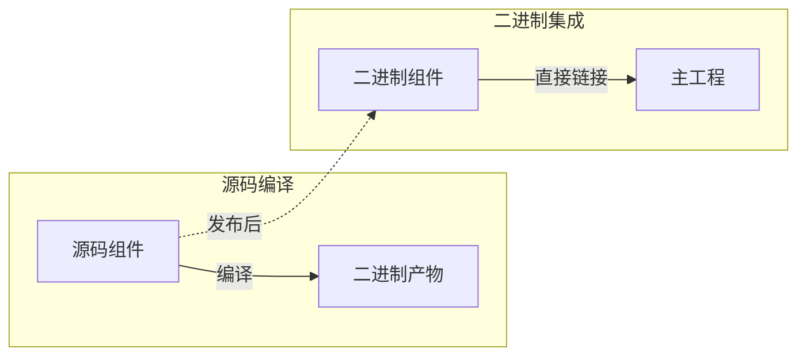

#### 实现方式

```ruby
# 通过环境变量控制源码/二进制切换
if ENV['USE_BINARY'] == '1'
  pod 'UserModule', :http => 'https://cdn.xxx.com/UserModule-1.0.0.zip'
else
  pod 'UserModule', :path => './modules/user'
end
```

常用的二进制化方案：
- **cocoapods-binary**：自动将Pod编译为framework
- **私有二进制Spec仓库**：维护二进制版本的podspec
- **自研方案**：结合CI/CD自动发布二进制

### 组件独立运行

每个组件应该能够**独立运行和调试**，不需要编译整个App：

```
UserModule/
├── Sources/           # 组件源码
├── Resources/         # 组件资源
├── Tests/             # 单元测试
└── Example/           # 独立运行的Demo工程
    ├── ExampleApp/
    └── Podfile
```

```ruby
# UserModule/Example/Podfile

target 'UserModuleExample' do
  pod 'UserModule', :path => '../'
  
  # Mock其他组件的服务
  pod 'MockServices', :path => './MockServices'
end
```

