+++
title = "App启动流程"
date = '2026-05-02T22:32:27+08:00'
draft = false
weight = 1
tags = ["iOS", "面试", "基础"]
categories = ["iOS开发", "面试"]
+++
## 启动类型概览

iOS应用启动分为三种类型：

| 启动类型 | 描述 | 特点 |
|---------|------|------|
| 冷启动（Cold Launch） | App完全不在内存中，需要从头开始加载 | 耗时最长，需要完整执行所有启动流程 |
| 热启动（Warm Launch） | App在后台被挂起（Suspended），重新进入前台 | 最快，只需恢复App状态，不需要重新创建进程 |
| 预热启动（Pre-warm Launch） | 系统预测用户可能启动App，提前在后台执行部分启动流程 | iOS 15+引入，介于冷启动和热启动之间 |

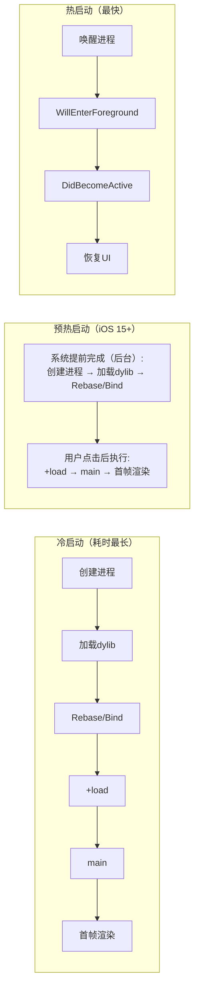

---

# 一、冷启动（Cold Launch）

冷启动是最完整的启动流程，也是启动优化的主要关注点。

## 冷启动流程概览

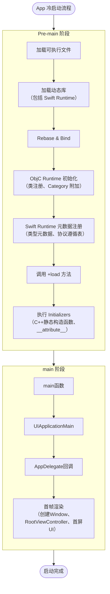

---

## Pre-main 阶段

Pre-main阶段是指从用户点击App图标到main函数执行之前的过程，这个阶段主要由dyld（动态链接器）负责。

### 1. 加载可执行文件（Load Executable）

当用户点击App图标时，系统会执行以下操作：

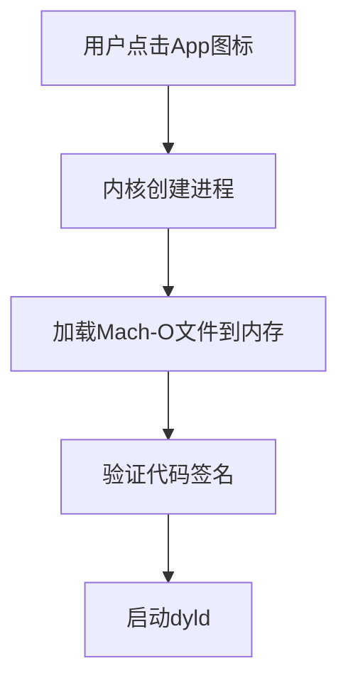

#### 1.1 创建进程和主线程

内核通过 `fork()` 系统调用创建新进程，为 App 分配独立的进程空间。**在创建进程的同时，内核会创建进程的第一个线程，这就是主线程（Main Thread）**。

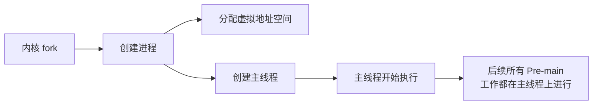

#### 1.2 加载Mach-O到内存

内核使用 `mmap()` 系统调用将 Mach-O 文件**映射**到进程的虚拟地址空间。这里是映射而非直接读取，是**惰性加载**的基础——只有实际访问到的页面才会被加载到物理内存。

> 关于 mmap 的详细原理和应用，请参考：[mmap详解]()

**解析 Mach-O Header**

内核首先读取 Mach-O 文件头部信息，**并根据这些信息做出决策**：

| 信息 | 读取后的处理 |
|-----|-------------|
| Magic Number | 验证文件格式是否正确（0xFEEDFACF 表示 64位 Mach-O） |
| CPU 类型和子类型 | 检查是否与当前设备架构匹配（如 arm64），不匹配则拒绝加载 |
| 文件类型 | 识别是可执行文件（MH_EXECUTE）还是动态库（MH_DYLIB） |
| Load Commands 数量和大小 | 计算需要读取的 Load Commands 区域的范围 |
| Flags | 检查特殊标记（如 PIE、TWOLEVEL 等），决定后续处理方式 |

**处理 Load Commands**

内核遍历 Mach-O 中的所有 Load Commands，**针对每种类型执行不同的操作**：

| Load Command | 内核执行的操作（不仅是读取） |
|-------------|--------------------------|
| `LC_SEGMENT_64` | **映射内存**：调用 `mmap()` 将段映射到虚拟内存的指定地址<br>**设置权限**：根据段的属性设置内存保护（如 `__TEXT` 设为只读+可执行，`__DATA` 设为可读写） |
| `LC_LOAD_DYLIB` | **记录依赖**：提取动态库路径并加入待加载队列<br>**版本检查**：记录库的版本要求，后续交给 dyld 验证兼容性 |
| `LC_MAIN` | **记录入口**：保存程序入口点的偏移量（相对于 `__TEXT` 段的偏移）<br>**计算地址**：结合 ASLR 偏移量计算 main 函数的实际虚拟地址 |
| `LC_CODE_SIGNATURE` | **定位签名**：记录代码签名数据在文件中的位置和大小<br>**准备验证**：为后续的代码签名验证准备数据 |
| `LC_DYLD_INFO_ONLY` | **记录元数据**：保存 Rebase、Bind、Export 信息的位置<br>**传递给 dyld**：这些信息后续交给 dyld 完成地址重定位和符号绑定 |
| `LC_ENCRYPTION_INFO_64` | **检查加密**：如果段被加密（如 App Store 加密），记录加密范围<br>**解密准备**：系统会在访问时自动解密 |

**虚拟内存布局**

处理完所有 `LC_SEGMENT_64` 后，虚拟内存布局如下：

```plaintext
虚拟内存布局：
┌─────────────────┐ 高地址
│     Stack       │
├─────────────────┤
│     Heap        │
├─────────────────┤
│   __LINKEDIT    │ 符号表、签名等
├─────────────────┤
│    __DATA       │ 可读写（全局变量）
├─────────────────┤
│    __TEXT       │ 只读、可执行（代码和常量）
└─────────────────┘ 低地址
```

- `__TEXT` 段：可读、可执行，不可写（防止代码被篡改）
- `__DATA` 段：可读、可写，不可执行

> 关于 Mach-O 文件格式的详细介绍，请参考：[Mach-O的链接、装载与库]()

#### 1.3 验证代码签名

系统验证 Mach-O 文件的代码签名，确保App来源可信且未被篡改。

### 2. 加载动态库（Load Dylibs）

dyld（Dynamic Linker）负责加载App依赖的所有动态库。这是Pre-main阶段最耗时的操作之一。

#### 2.1 动态库依赖关系

一个典型的iOS App会依赖多个系统框架和自定义动态库：

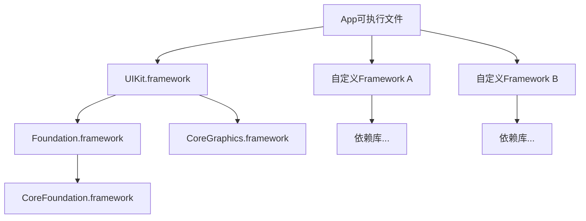

#### 2.2 dyld 加载动态库的主要工作

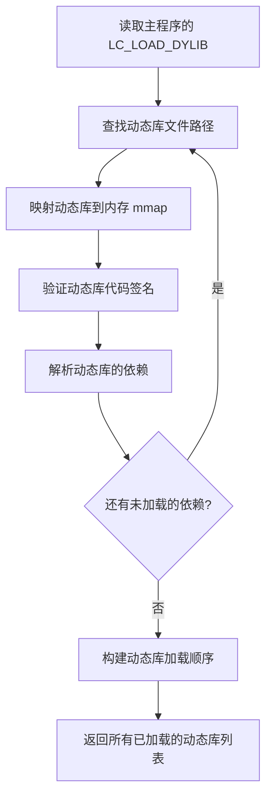

**主要步骤详解**：

##### 步骤1：读取依赖信息

dyld 从主程序的 Mach-O 文件中读取 `LC_LOAD_DYLIB` 类型的 Load Commands，获取所有依赖的动态库路径。

```plaintext
LC_LOAD_DYLIB 示例：
┌─────────────────────────────────────────┐
│ cmd: LC_LOAD_DYLIB                      │
│ name: /System/Library/Frameworks/       │
│       UIKit.framework/UIKit             │
│ timestamp: 2                            │
│ current_version: 1.0.0                  │
│ compatibility_version: 1.0.0            │
└─────────────────────────────────────────┘
```

每个 `LC_LOAD_DYLIB` 记录包含：
- **库路径**：动态库的安装路径（如 `/System/Library/Frameworks/UIKit.framework/UIKit`）
- **版本信息**：当前版本和兼容版本，用于检查库的兼容性

##### 步骤2：查找动态库文件

dyld 按照特定的搜索规则查找动态库的实际位置：

##### 步骤3：映射动态库到内存

找到动态库文件后，dyld 使用 `mmap()` 系统调用将其映射到进程的虚拟地址空间：

**映射后的内存布局**：

```plaintext
虚拟内存地址空间（完整示意）：
┌─────────────────────┐ 0x7FFFFFFFFFFFFFFF (高地址)
│       内核空间       │ 内核态内存（用户态无法访问）
├─────────────────────┤
│       Stack         │ 栈区：函数调用栈、局部变量
│         ↓           │ （向下增长）
│                     │
│   （预留空间）        │
│                     │
│         ↑           │
│       Heap          │ 堆区：动态分配的内存（malloc/new）
│                     │ （向上增长）
├─────────────────────┤
│    App 主程序        │ 可执行文件的 Segments
│  - __TEXT (rx)      │ 代码段（可读、可执行）
│  - __DATA (rw)      │ 数据段（可读、可写）
│  - __LINKEDIT (r)   │ 链接信息（只读）
├─────────────────────┤
│  UIKit.framework    │ 系统框架动态库
│  - __TEXT (rx)      │
│  - __DATA (rw)      │
├─────────────────────┤
│ Foundation.framework│ 系统框架动态库
│  - __TEXT (rx)      │
│  - __DATA (rw)      │
├─────────────────────┤
│ CoreFoundation.fwk  │ 系统框架动态库
├─────────────────────┤
│  ...其他动态库...     │ 其他依赖的动态库
├─────────────────────┤
│    dyld 本身         │ 动态链接器
└─────────────────────┘ 0x0000000000000000 (低地址)
```

**内存布局说明**：

- **Stack（栈）**：位于高地址区域，向下增长，存储函数调用栈、局部变量、函数参数等。由系统自动管理，作用域结束后自动释放
- **Heap（堆）**：位于栈下方，向上增长，存储动态分配的内存（`malloc`、`new`、对象实例等）。需要手动管理或通过 ARC 管理
- **可执行文件和动态库**：位于中低地址区域，每个库的 Segments 按照权限分段映射（代码段只读可执行，数据段可读可写）
- **dyld**：动态链接器本身也作为一个共享库映射到进程空间的低地址区域

每个动态库的各个 Segment 会被映射到不同的虚拟内存区域，并设置相应的访问权限。

##### 步骤4：验证代码签名

为了保证动态库的完整性和安全性，系统会验证每个动态库的代码签名。

##### 步骤5：递归加载依赖

每个动态库自己也可能依赖其他动态库，dyld 会递归地加载所有依赖：

**加载顺序规则**：
- 使用**深度优先搜索**（DFS）递归加载依赖
- 每个库只加载一次（使用缓存避免重复）
- 被依赖的库会先于依赖方加载（例如，Foundation 会在 UIKit 之前加载）

##### 步骤6：构建初始化顺序

所有动态库加载完成后，dyld 会根据依赖关系构建初始化顺序：

```plaintext
初始化顺序（自底向上）：
1. libSystem.dylib (最底层，被所有库依赖)
2. CoreFoundation.framework
3. Foundation.framework
4. CoreGraphics.framework
5. libswiftCore.dylib (Swift Runtime，如果 App 使用 Swift)
6. UIKit.framework
7. 自定义 Framework A
8. 自定义 Framework B
9. App 主程序 (最后初始化)
```

这个顺序保证了：**一个库的初始化代码执行时，它依赖的所有库已经初始化完毕**。后续的 Rebase/Bind、ObjC Runtime 初始化等操作也会按照这个顺序执行。

**Swift Runtime 的特殊处理**：

如果 App 使用了 Swift，dyld 会在此阶段加载 Swift 标准库（如 `libswiftCore.dylib`）：

- **iOS 12.2+**：Swift 标准库位于系统共享缓存中，无需嵌入 App
- **iOS 12.2 以下**：Swift 标准库嵌入到 App Bundle 中，会增加包体积

Swift Runtime 在加载时会通过 `_dyld_register_func_for_add_image` 向 dyld 注册回调，用于后续的元数据注册（详见 [4.4 Swift Runtime 元数据注册](#44-swift-runtime-元数据注册)）。

至此，dyld 完成了动态库的加载工作。此时所有依赖的动态库都已经被映射到了进程的虚拟地址空间，并且按照依赖关系构建好了初始化顺序。接下来 dyld 会进入 Rebase/Bind 阶段，修正这些动态库中的指针地址。

#### 2.3 动态库的共享与缓存

> **扩展**：iOS 系统对常用的系统框架做了特殊优化，将它们预先打包到共享缓存中，这样可以大幅提升加载速度。

**共享库缓存（Shared Library Cache）**：

iOS 系统将常用的系统框架（如 UIKit、Foundation）打包到一个共享缓存文件中（dyld shared cache），位于 `/System/Library/Caches/com.apple.dyld/`。

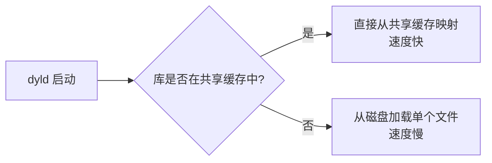

**共享缓存的优势**：
- **启动更快**：系统框架已预先加载到内存，避免每次从磁盘读取
- **内存共享**：多个进程可以共享同一份物理内存中的系统框架代码
- **优化过的布局**：共享缓存中的符号地址已经预先绑定（Pre-binding），减少 Rebase/Bind 的工作量

### 3. Rebase 和 Bind

由于 ASLR（Address Space Layout Randomization）技术，App 每次启动时 Mach-O 加载到虚拟内存的起始地址都是随机的，因此需要对内部指针进行地址修正。

**Rebase（重定位）**：
- 修正指向Mach-O内部的指针
- 将编译时的地址加上ASLR偏移量

**Bind（绑定）**：
- 修正指向Mach-O外部的指针
- 查找符号表，绑定到正确的外部符号地址

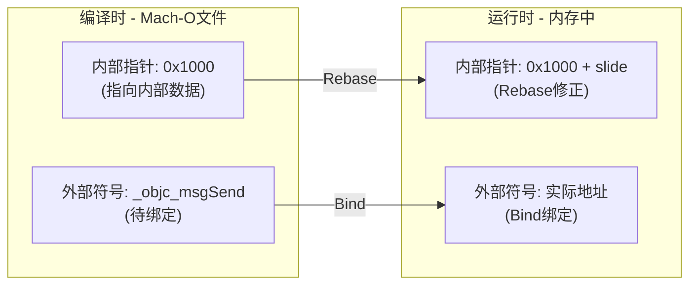

> 关于Rebase和Bind的详细原理及优化方法，请参考：[启动优化-Rebase与Bind]()

### 4. ObjC Runtime 初始化

当 dyld 完成 Rebase/Bind 之后，会通过 `_dyld_objc_notify_register` 回调通知 Runtime，触发 Objective-C 运行时的初始化。这个阶段由 `_objc_init` 函数负责，主要完成类注册和 Category 附加工作：

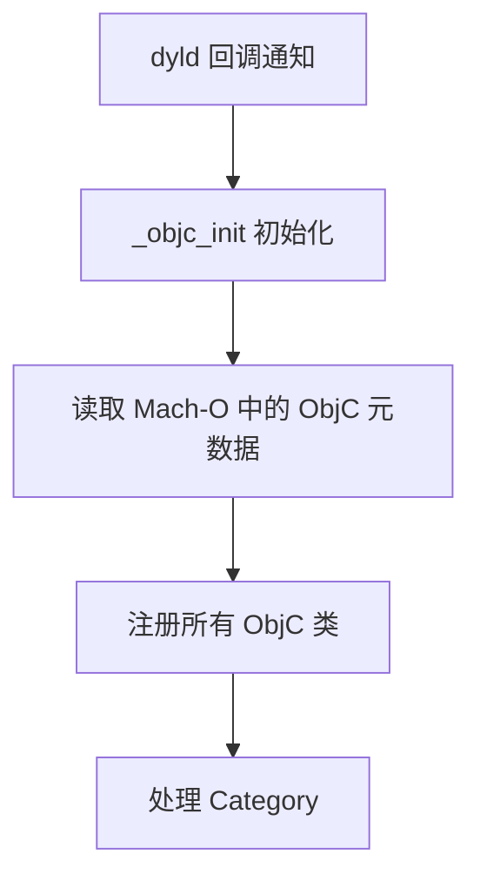

#### 4.1 读取 ObjC 元数据

Runtime 从 Mach-O 的 `__DATA` 系列段中读取 Objective-C 相关的元数据。objc4 源码中 `getDataSection()` 会依次在 `__DATA`、`__DATA_CONST`、`__DATA_DIRTY` 三个 segment 中查找同名 section，具体 section 落在哪个 segment 由链接器根据 deployment target 和工具链版本决定（例如启用 relative method lists 后部分只读元数据会被放入 `__DATA_CONST` 以减少 dirty page）：

| Section | 存储内容 | 说明 |
|---------|---------|------|
| `__objc_classlist` | 类列表指针 | 所有 ObjC 类的指针数组 |
| `__objc_nlclslist` | 非懒加载类列表 | 实现了 `+load` 方法的类（Non-Lazy Class） |
| `__objc_catlist` | Category 列表 | 所有 Category 的指针数组 |
| `__objc_nlcatlist` | 非懒加载 Category 列表 | 实现了 `+load` 方法的 Category |
| `__objc_protolist` | 协议列表 | 所有 Protocol 定义 |
| `__objc_selrefs` | SEL 引用表 | 代码中使用的所有方法选择器 |
| `__objc_classrefs` | 类引用表 | 代码中引用的所有类 |

**懒加载类 vs 非懒加载类**：
- **非懒加载类**：实现了 `+load` 方法的类，在启动时立即初始化
- **懒加载类**：没有 `+load` 方法的类，延迟到第一次使用时才初始化（如第一次调用类方法或创建实例）

#### 4.2 注册所有 ObjC 类

Runtime 遍历 `__objc_classlist`，将**所有类**注册到全局的类列表（`gdb_objc_realized_classes`）中，但只对**非懒加载类**立即 realize：

```c
// Runtime 内部的类注册过程（简化）
void _read_images(header_info *hinfo) {
    // 1. 读取类列表，将所有类注册到全局类表
    classref_t *classlist = _getObjc2ClassList(hinfo, &count);
    for (int i = 0; i < count; i++) {
        Class cls = classlist[i];
        addNamedClass(cls, cls->mangledName());
    }
    
    // 2. 只对非懒加载类（实现了 +load 的类）立即 realize
    classref_t *nlclslist = _getObjc2NonlazyClassList(hinfo, &nlcount);
    for (int i = 0; i < nlcount; i++) {
        Class cls = remapClass(nlclslist[i]);
        realizeClassWithoutSwift(cls);
    }
    
    // 懒加载类不在此处 realize，延迟到首次收到消息时：
    // objc_msgSend → lookUpImpOrForward → realizeClassMaybeSwiftMaybeRelock
}
```

**类的实现过程（Realize）**：

编译期生成的类信息存储在 `class_ro_t` 结构中，是只读的。但 ObjC 是动态语言，运行时可能需要修改类（如添加 Category 方法、关联对象等），所以 Runtime 需要为每个类创建一个可读写的 `class_rw_t` 结构。这个过程叫做"类的实现（Realize）"。所有类（无论懒加载还是非懒加载）最终都会经历 realize，只是时机不同：非懒加载类在 `map_images` 阶段立即 realize，懒加载类延迟到首次使用时才 realize。

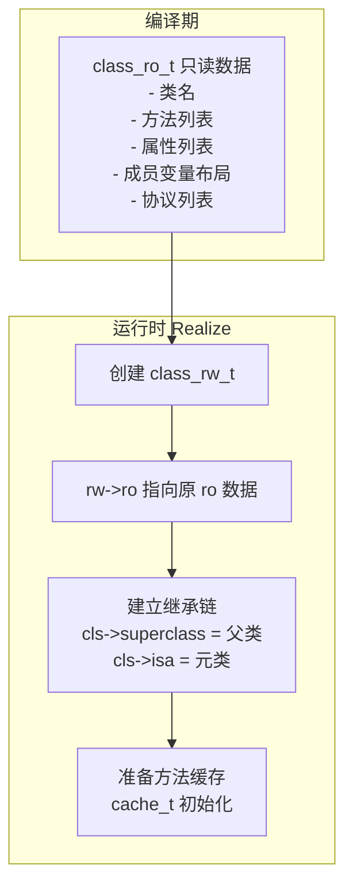

| 结构 | 生成时机 | 可否修改 | 存储内容 |
|-----|---------|---------|---------|
| class_ro_t | 编译期 | 只读 | 类名、成员变量布局、基础方法/属性/协议列表 |
| class_rw_t | 运行时首次使用类 | 可读写 | 指向 ro 的指针、Category 附加的方法、运行时添加的方法 |

**为什么需要这样设计？**

1. **节省内存**：`class_ro_t` 存储在 `__DATA_CONST` 段，可以被多个进程共享（通过 Copy-On-Write）；如果直接修改 ro，会导致整个页被复制
2. **支持动态性**：Category 方法、`class_addMethod` 添加的方法都需要写入到 rw 中
3. **延迟初始化**：只有真正使用到的类才会创建 rw，节省启动时间（懒加载类）

#### 4.3 处理 Category

Runtime 遍历 `__objc_catlist`，将 Category 中的内容附加到对应的类上：

```c
// Category 结构
struct category_t {
    const char *name;           // 类名
    classref_t cls;             // 所属的类
    method_list_t *instanceMethods;  // 实例方法
    method_list_t *classMethods;     // 类方法
    protocol_list_t *protocols;      // 协议
    property_list_t *instanceProperties; // 属性
};
```

**Category 的附加过程**：

遍历 `__objc_catlist` 时，Runtime 会根据对应类是否已经 realize 来决定处理方式：

- **类已 realize**（非懒加载类）：立即调用 `attachCategories` 将 Category 内容附加到类的 `class_rw_t`
- **类未 realize**（懒加载类）：将 Category 暂存到全局的 `unattachedCategories` 表中，等到该类被 realize 时再附加

```c
static void attachCategories(Class cls, category_list *cats) {
    // 1. 收集所有 Category 的方法
    method_list_t **mlists = malloc(cats->count * sizeof(*mlists));
    for (int i = 0; i < cats->count; i++) {
        mlists[i] = cats->list[i].cat->methodsForMeta(isMeta);
    }
    
    // 2. 将方法列表附加到类的 class_rw_t
    prepareMethodLists(cls, mlists, count);
    rw->methods.attachLists(mlists, count);
}
```

**Category 方法覆盖原理**：
- Category 的方法会被插入到方法列表的**前面**（后编译的 Category 排在更前面）
- 运行时查找方法时从前往后遍历，所以 Category 中的同名方法会"覆盖"原类方法
- 实际上原方法并未被删除，只是不会被优先找到

### 5. Swift Runtime 元数据注册

在 ObjC Runtime 完成类注册和 Category 附加后，dyld 会触发 Swift Runtime 的元数据注册。Swift Runtime 之前通过 `_dyld_register_func_for_add_image` 注册的回调会被调用，遍历所有已加载镜像中的 Swift section，将元数据记录的**位置指针注册**到 Runtime 的全局缓存中。

此阶段只做轻量的指针注册，并不解析和实例化元数据；真正的解析延迟到首次使用时（如首次 `as?` 触发协议遵循查找、首次 `Mirror(reflecting:)` 触发字段描述符解析、泛型类型首次实例化时创建完整的 type metadata）。

**Swift Runtime 注册的元数据**：

| Section | 存储内容 | 启动时做了什么 | 首次使用时才做什么 |
|---------|---------|--------------|------------------|
| `__swift5_types` | 类型元数据记录 | 注册记录的位置指针 | 分配并填充完整的 metadata 结构（泛型类型的 metadata 是懒创建的） |
| `__swift5_proto` | 协议遵循记录 | 注册 type→protocol 的映射条目 | 首次 `as?`/`as!` 时查找并缓存 Protocol Witness Table |
| `__swift5_fieldmd` | 字段描述符 | 注册记录的位置指针 | 首次 `Mirror(reflecting:)` 时解析字段名称和类型字符串 |
| `__swift5_assocty` | 关联类型记录 | 注册记录的位置指针 | 首次涉及关联类型解析时使用 |

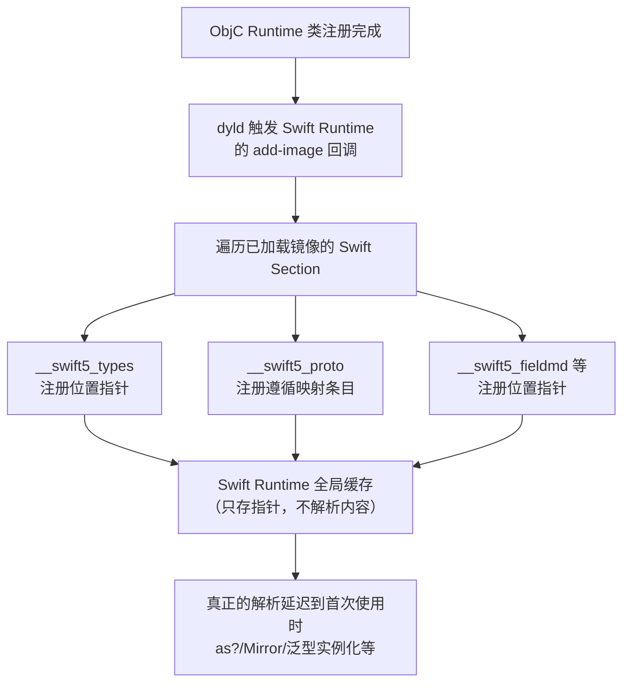

**协议遵循查找优化（iOS 16+）**：

在 iOS 16 之前，Swift 协议遵循查找需要遍历所有已加载镜像的 `__swift5_proto` section，时间复杂度为 O(N)。iOS 16+ 引入了 dyld 协议遵循缓存机制：

- **首次启动时**：dyld 构建协议遵循缓存（类似 dyld 3 的 Launch Closure 机制），App 更新后会重新生成
- **后续启动时**：通过 `_dyld_find_protocol_conformance_on_disk` 等 API 直接查表，无需扫描所有描述符
- 显著提升 `as?`/`as!` 等动态类型转换的性能

> **注意**：Swift 的元数据注册与 ObjC 的类注册是两套独立机制，二者都在 `+load` 之前完成。

### 6. 调用 +load 方法

在 ObjC 类注册、Category 附加、Swift Runtime 元数据注册都完成后，dyld 调用 Runtime 的 `load_images` 回调，开始执行 `+load` 方法。

**+load 的调用机制**：

```c
void call_load_methods(void) {
    // 1. 先调用非懒加载类的 +load（按继承层级顺序）
    do {
        while (loadable_classes_used > 0) {
            call_class_loads();  // 直接通过函数指针调用
        }
        more_categories = call_category_loads();  // 再调用非懒加载 Category 的 +load
    } while (loadable_classes_used > 0 || more_categories);
}

static void call_class_loads(void) {
    for (int i = 0; i < loadable_classes_used; i++) {
        Class cls = loadable_classes[i].cls;
        load_method_t load_method = loadable_classes[i].method;
        
        // 直接调用函数指针，不经过 objc_msgSend
        (*load_method)(cls, @selector(load));
    }
}
```

**+load 调用顺序规则**：

1. **父类优先于子类**：确保子类的 `+load` 执行时，父类已完成初始化
2. **类优先于 Category**：主类的 `+load` 先于其所有 Category
3. **同一镜像内按编译顺序**：Build Phases → Compile Sources 中的文件顺序
4. **不同镜像按依赖顺序**：被依赖的动态库先于依赖方

```objc
// +load方法调用顺序示例
@implementation ParentClass
+ (void)load {
    NSLog(@"1. ParentClass +load");  // 第1个执行
}
@end

@implementation ChildClass
+ (void)load {
    NSLog(@"2. ChildClass +load");   // 第2个执行
}
@end

@implementation ParentClass (Category)
+ (void)load {
    NSLog(@"3. ParentClass+Category +load");  // 第3个执行
}
@end
```

**+load 的特点**：
- **直接调用**：通过函数指针调用，不经过 `objc_msgSend`，所以 Category 的 `+load` 不会覆盖主类
- **阻塞启动**：所有 `+load` 在 main 函数之前同步执行，会直接影响启动时间
- **线程安全**：在主线程串行调用，无需加锁

> 关于 `+load` 和 `+initialize` 的详细对比，请参考：[+load与+initialize的区别]()

### 7. 执行 Initializers

在 `+load` 方法执行完成后，dyld 会执行各种初始化器（Initializers）。这些初始化器的函数指针存储在 Mach-O 的 `__DATA,__mod_init_func` section 中。

#### 7.1 Initializers 的来源

| 类型 | 说明 | 示例 |
|-----|------|------|
| C++ 静态构造函数 | 全局/静态对象的构造函数 | `static std::string s = "hello";` |
| `__attribute__((constructor))` | GCC/Clang 扩展，标记在 main 之前执行的函数 | `__attribute__((constructor)) void init() {}` |

#### 7.2 `__mod_init_func` Section 原理

编译器会将所有需要在 main 之前执行的初始化函数指针，收集到 `__DATA,__mod_init_func` section 中：

```plaintext
Mach-O 文件结构：
┌─────────────────────────────┐
│         __TEXT              │
├─────────────────────────────┤
│         __DATA              │
│  ┌────────────────────────┐ │
│  │   __mod_init_func      │ │  ← 存储函数指针数组
│  │   ┌──────────────────┐ │ │
│  │   │ func_ptr_1       │─┼─┼──→ 指向 C++ 构造函数
│  │   │ func_ptr_2       │─┼─┼──→ 指向 constructor 函数
│  │   │ ...              │ │ │
│  │   └──────────────────┘ │ │
│  └────────────────────────┘ │
└─────────────────────────────┘
```

dyld 在初始化阶段会：
1. 遍历所有已加载镜像的 `__mod_init_func` section
2. 按依赖顺序（被依赖的库优先）调用每个函数指针
3. 同一镜像内按函数指针在 section 中的排列顺序调用

#### 7.3 执行顺序详解

Initializers 的执行顺序受**镜像依赖顺序**和**优先级**共同影响：

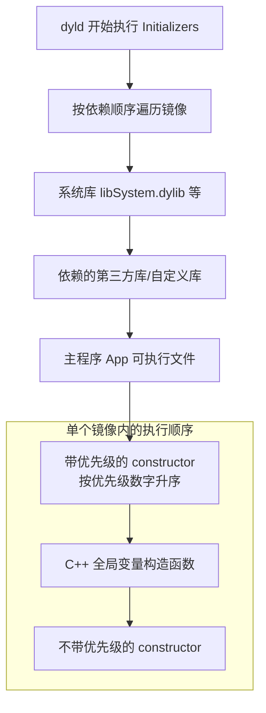

**优先级规则**：

| 优先级范围 | 说明 |
|-----------|------|
| 0-100 | 保留给系统使用，开发者不应使用 |
| 101-65535 | 开发者可用范围，数字越小越早执行 |
| 无优先级 | 等同于 65535，在所有带优先级的之后执行 |

```cpp
// 带优先级的构造函数（优先级101，最早执行）
__attribute__((constructor(101)))
static void EarlyInitializer() {
    printf("1. Early initializer (priority 101)\n");
}

// 带优先级的构造函数（优先级200）
__attribute__((constructor(200)))
static void MidInitializer() {
    printf("2. Mid initializer (priority 200)\n");
}

// C++ 全局静态变量的构造函数
// 执行顺序取决于链接顺序，通常在带优先级的 constructor 之后
class GlobalObject {
public:
    GlobalObject() {
        printf("3. C++ global object constructor\n");
    }
};
static GlobalObject globalObj;

// 不带优先级的构造函数（等同于65535，最晚执行）
__attribute__((constructor))
static void DefaultInitializer() {
    printf("4. Default initializer (no priority)\n");
}
```

#### 7.4 C++ 静态构造函数详解

C++ 全局变量和静态变量如果是非平凡类型（non-trivial），编译器会为其生成构造函数调用：

```cpp
// 非平凡类型 - 需要构造函数调用
static std::string globalString = "Hello";      // 需要调用 std::string 构造函数
static std::vector<int> globalVec = {1, 2, 3};  // 需要调用 std::vector 构造函数
static MyClass globalObj;                        // 需要调用 MyClass 构造函数

// 平凡类型 - 不需要 Initializer
static int globalInt = 42;          // 直接在 __DATA 段初始化
static const char* globalStr = "Hi"; // 指针直接指向 __TEXT 段的字符串常量
```

**C++ 静态变量的初始化顺序问题**：

同一编译单元（.cpp 文件）内的静态变量按定义顺序初始化，但**不同编译单元之间的顺序是未定义的**，这被称为"静态初始化顺序问题"（Static Initialization Order Fiasco）：

```cpp
// FileA.cpp
std::string configPath = "/path/to/config";  // 可能先初始化

// FileB.cpp  
// 危险！configPath 可能还未初始化
std::string fullPath = configPath + "/file.txt";  // 可能访问到未初始化的 configPath
```

**解决方案**：使用 Construct On First Use 惯用法（懒加载）：

```cpp
// 安全的做法：保证使用时已初始化
std::string& getConfigPath() {
    static std::string configPath = "/path/to/config";  // 首次调用时初始化
    return configPath;
}
```

#### 7.5 dyld 调用 Initializers 的源码流程

dyld 中调用 Initializers 的简化流程如下：

```cpp
// dyld 内部调用 Initializers 的简化流程
void ImageLoader::runInitializers() {
    // 1. 先递归初始化依赖的库
    for (ImageLoader* dep : fDependencies) {
        dep->runInitializers();
    }
    
    // 2. 获取 __mod_init_func section
    const uint32_t* initFuncs;
    size_t initCount;
    getInitializers(&initFuncs, &initCount);
    
    // 3. 按顺序调用每个初始化函数
    for (size_t i = 0; i < initCount; i++) {
        Initializer func = (Initializer)initFuncs[i];
        func();  // 直接调用函数指针
    }
}
```

#### 7.6 Initializers 的注意事项

| 注意事项 | 说明 |
|---------|------|
| 阻塞启动 | 所有 Initializers 在主线程同步执行，直接影响启动时间 |
| 执行顺序不确定 | 不同编译单元的 C++ 静态变量初始化顺序不确定 |
| 避免复杂逻辑 | 不要在 Initializers 中执行耗时操作或依赖其他模块 |
| 不能依赖 AppDelegate | Initializers 在 main 之前执行，此时 AppDelegate 还未创建 |
| 异常处理 | Initializers 中抛出异常会导致 App 启动崩溃 |

---

## main() 阶段

### 1. main函数入口

#### Objective-C 的 main 函数

```objc
// main.m
int main(int argc, char * argv[]) {
    @autoreleasepool {
        return UIApplicationMain(argc, argv, nil, NSStringFromClass([AppDelegate class]));
    }
}
```

**为什么需要 `@autoreleasepool`？**

- **main 函数的特殊性**：main 函数是程序入口，在 RunLoop 启动之前没有自动的 autorelease pool，需要手动创建
- **内存管理**：即使在 ARC 下，某些临时对象（特别是与 OC 运行时交互时）仍需要 autorelease pool 来及时释放
- **RunLoop 尚未启动**：正常运行时，RunLoop 每次循环会自动创建和销毁 autorelease pool，但在 main 函数刚进入时 RunLoop 还未启动

#### Swift 的 main 函数

Swift 使用 `@main`（或旧版的 `@UIApplicationMain`）属性来隐藏 main 函数的实现：

```swift
@main  // 或 @UIApplicationMain
class AppDelegate: UIResponder, UIApplicationDelegate {
    // ...
}
```

编译器会自动生成类似这样的代码：

```swift
// 编译器自动生成，开发者看不到
func main() {
    UIApplicationMain(
        CommandLine.argc,
        CommandLine.unsafeArgv,
        nil,
        NSStringFromClass(AppDelegate.self)
    )
}
```

**为什么 Swift 不需要显式的 autoreleasepool？**

- **Swift 对 autorelease 依赖更少**：Swift 默认使用 ARC，且内存管理比 OC 更严格，很少产生 autorelease 对象
- **编译器自动处理**：Swift 编译器在生成 main 函数时会自动处理必要的内存管理
- **运行时兼容**：当 Swift 调用 OC API（如 `UIApplicationMain`）时，运行时会自动处理 autorelease pool

如果需要自定义 main 函数，可以创建 `main.swift` 文件（注意：使用 `main.swift` 时需要移除 AppDelegate 上的 `@main` 属性）：

```swift
// main.swift
import UIKit

autoreleasepool {
    UIApplicationMain(
        CommandLine.argc,
        CommandLine.unsafeArgv,
        nil,
        NSStringFromClass(AppDelegate.self)
    )
}
```

#### UIApplicationMain 的作用

`UIApplicationMain` 函数执行以下操作：

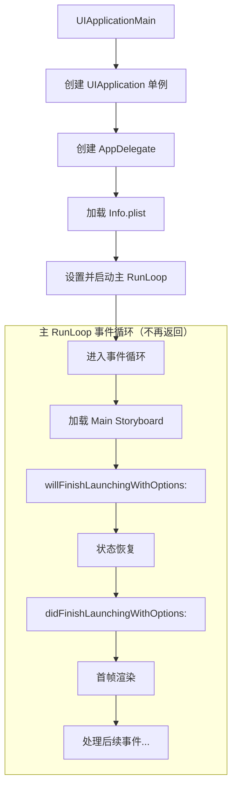

- **RunLoop 先于 didFinishLaunchingWithOptions 启动**：主 RunLoop 在 `UIApplicationMain` 内部被设置并启动，之后的 `didFinishLaunchingWithOptions:` 和首帧渲染都是在 RunLoop 的事件循环中执行的
- **启动后不再返回**：`UIApplicationMain` 函数不会返回，因此 `main()` 函数中 `UIApplicationMain` 之后的代码永远不会执行

### 2. AppDelegate回调

```swift
class AppDelegate: UIResponder, UIApplicationDelegate {
    
    var window: UIWindow?
    
    // iOS 12及之前的启动入口
    func application(_ application: UIApplication, 
                     didFinishLaunchingWithOptions launchOptions: [UIApplication.LaunchOptionsKey: Any]?) -> Bool {
        
        // 1. 初始化第三方SDK
        setupThirdPartySDKs()
        
        // 2. 配置全局UI样式等
        setupAppearance()
        
        return true
    }
}
```

### 3. 首帧渲染

首帧渲染是指从创建Window到第一帧画面显示在屏幕上的过程：

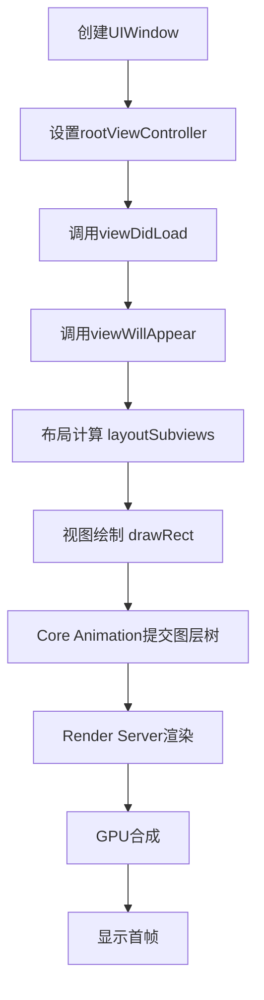

> 关于iOS渲染流程的详细原理，请参考：[卡顿-原理]()

---

# 二、热启动（Warm Launch）

热启动是指App从后台挂起状态（Suspended）恢复到前台的过程，是三种启动类型中最快的。

## 热启动流程

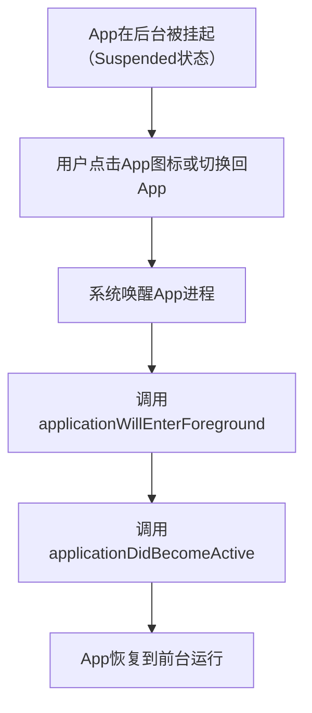

## 热启动的特点

1. **进程仍在内存中**：不需要重新创建进程，所有代码和数据都还在内存中
2. **无需重新加载**：不需要执行Pre-main阶段的任何操作
3. **只需状态恢复**：主要是UI状态的恢复和必要的数据刷新
4. **速度最快**：通常在毫秒级别完成

## 热启动时的回调

```swift
// SceneDelegate (iOS 13+)
func sceneWillEnterForeground(_ scene: UIScene) {
    // 即将进入前台，可以恢复被暂停的任务
}

func sceneDidBecomeActive(_ scene: UIScene) {
    // 已经进入前台，开始响应用户交互
    // 可以刷新UI、恢复动画等
}

// AppDelegate (iOS 12及之前)
func applicationWillEnterForeground(_ application: UIApplication) {
    // 即将进入前台
}

func applicationDidBecomeActive(_ application: UIApplication) {
    // 已经激活
}
```

---

# 三、预热启动（Pre-warm Launch）

从iOS 15开始，系统引入了预热启动机制。由于它会影响启动时间的统计，因此需要特别注意。

## 什么是预热启动

系统会根据用户的使用习惯预测用户可能启动的App，并在后台提前执行部分启动流程，以加快实际启动速度。

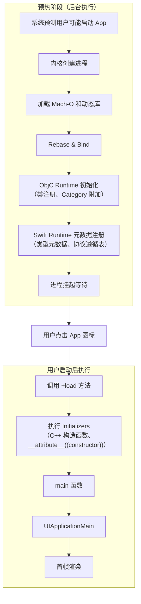

对照 [Pre-main 阶段](#pre-main-阶段) 的流程，预热启动在各阶段的完成状态如下：

| Pre-main 阶段 | 预热时完成? | 说明 |
|--------------|:-----------:|------|
| 1. 加载可执行文件 | ✅ | 内核创建进程、mmap 映射 Mach-O、验证签名 |
| 2. 加载动态库 | ✅ | dyld 递归加载所有依赖的动态库（包括 Swift Runtime） |
| 3. Rebase & Bind | ✅ | 地址重定位和外部符号绑定已完成 |
| 4. ObjC Runtime 初始化 | ⚠️ 部分 | 类注册、Category 附加已完成；**+load 未调用** |
| 4.4 Swift Runtime 元数据注册 | ✅ | `__swift5_types`、`__swift5_proto` 等元数据注册已完成 |
| 5. 执行 Initializers | ❌ | `+load`、C++ 构造函数、`__attribute__((constructor))` 均未执行 |

### ObjC Runtime 初始化状态详解

预热阶段 **已完成** 的 ObjC Runtime 工作：

| 工作项 | 说明 |
|-------|------|
| `_objc_init` 基础初始化 | Runtime 环境已准备就绪 |
| 读取 ObjC 元数据 | `__objc_classlist`、`__objc_catlist` 等 section 已扫描 |
| 注册所有 ObjC 类 | 类已添加到全局类表（`gdb_objc_realized_classes`） |
| 类的 Realize | `class_rw_t` 结构已创建（针对非懒加载类） |
| 处理 Category | Category 的方法/属性/协议已附加到对应类 |

预热阶段 **未执行** 的 ObjC Runtime 工作：

| 工作项 | 说明 |
|-------|------|
| 调用 `+load` 方法 | 所有类和 Category 的 `+load` 延迟到用户实际启动时执行 |

### 对启动时间统计的影响

由于预热启动已完成部分 Pre-main 工作，统计启动时间时需要注意：

```swift
// 错误做法：从进程创建时间开始计算
// 预热启动时，进程创建时间可能远早于用户点击时间

// 正确做法：检测预热启动并调整统计基准
func measureLaunchTime() {
    if ProcessInfo.processInfo.environment["ActivePrewarm"] == "1" {
        // 预热启动：Pre-main 时间不应计入用户感知的启动耗时
        // 只统计从 +load 开始到首帧渲染的时间
    } else {
        // 冷启动：统计完整的启动时间
    }
}
```

---

# 四、dyld 版本演进

## dyld 3（iOS 13引入）

dyld 3引入了启动闭包（Launch Closure）机制：

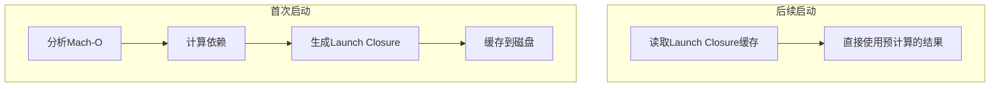

Launch Closure包含：
- 依赖的动态库列表
- Rebase/Bind信息
- 初始化顺序

## dyld 4（iOS 15引入）

dyld 4进一步优化：
- **Chained Fixups**：使用链式修复技术，减少需要修复的指针数量，降低Rebase/Bind的开销
- **Page-in Linking**：按需加载，只有在访问到某个页面时才进行修复，减少启动时的内存占用
- **改进的Swift运行时支持**：更好地支持Swift的类型元数据和协议一致性检查

---

# 五、启动流程关键节点总结

| 阶段 | 关键函数/方法 | 可优化点 |
|------|--------------|---------|
| 加载可执行文件 | 内核 `mmap`、签名验证 | 减少 Mach-O 体积 |
| 加载动态库 | dyld 加载 | 减少动态库数量，合并动态库 |
| Rebase/Bind | dyld 处理 | 减少 ObjC 类、减少 C++ 虚函数、减少指针数量 |
| ObjC Runtime 初始化 | `_objc_init` | 减少类数量、减少 Category |
| Swift Runtime 元数据注册 | dyld 回调 | 减少 Swift 类型数量、减少协议遵循 |
| +load 方法 | `+load` | 使用 `+initialize` 替代、延迟到首次使用 |
| Initializers | C++ 构造函数、`__attribute__((constructor))` | 延迟初始化、使用懒加载 |
| main 函数 | `main()` | - |
| didFinishLaunching | AppDelegate | 延迟非必要初始化、异步执行 |
| 首帧渲染 | `viewDidAppear` | 简化首屏 UI、异步加载、预加载 |

## 完整时序图

```plaintext
时间线 ──────────────────────────────────────────────────────────────────────────→

     用户点击        dyld开始        main()        didFinishLaunching    首帧显示
        │              │              │                  │                  │
        ▼              ▼              ▼                  ▼                  ▼
────────┼──────────────┼──────────────┼──────────────────┼──────────────────┼────
        │              │              │                  │                  │
        │◄────────────►│◄────────────►│◄────────────────►│◄────────────────►│
        │   内核准备    │  Pre-main    │   main阶段        │    首帧渲染       │
        │              │              │                  │                  │
        │              │  · 加载dylibs│  · UIApplication │  · 布局计算        │
        │  · fork进程  │  · Rebase    │    Main          │  · 视图绘制        │
        │  · 加载Mach-O│  · Bind      │  · AppDelegate   │  · CA提交         │
        │  · 签名验证   │  · ObjC setup│    初始化         │  · GPU渲染        │
        │              │  · +load     │  · 业务初始化      │                  │
        │              │  · C++构造    │                  │                  │
```

---

# 六、常见面试问题

## Q1: APP启动的详细流程

iOS 应用启动分为冷启动、热启动和预热启动三种类型。冷启动是最完整的流程，分为 **Pre-main 阶段** 和 **main 阶段**。

### Pre-main 阶段

Pre-main 阶段由 dyld（动态链接器）负责，从用户点击 App 图标到 `main()` 执行之前。**主线程在内核 `fork()` 创建进程时同时创建**，后续所有 Pre-main 工作都在主线程上执行。

**1. 加载可执行文件**

内核创建进程，使用 `mmap()` 将 Mach-O 文件映射到虚拟内存（惰性加载，只有实际访问的页才加载到物理内存）。解析 Mach-O Header（验证 Magic Number、CPU 架构匹配、文件类型识别）和 Load Commands（`LC_SEGMENT_64` 映射内存并设置权限、`LC_LOAD_DYLIB` 记录动态库依赖、`LC_MAIN` 计算入口地址等），最后验证代码签名。

**2. 加载动态库（dyld）**

dyld 从主程序 Mach-O 的 `LC_LOAD_DYLIB` 中读取依赖的动态库路径，按搜索规则查找动态库实际位置（优先从共享缓存中查找），使用 `mmap()` 映射到进程虚拟地址空间，验证代码签名，然后使用**深度优先搜索**递归加载每个动态库的依赖（每个库只加载一次）。最终按依赖关系构建初始化顺序——被依赖的库先于依赖方（如 Foundation 在 UIKit 之前）。如果 App 使用 Swift，此阶段还会加载 Swift 标准库（iOS 12.2+ 位于系统共享缓存，无需嵌入 App）。

**3. Rebase & Bind**

由于 ASLR（地址空间布局随机化），App 每次启动的加载地址不同，需要修正指针：
- **Rebase（重定位）**：修正指向 Mach-O **内部**的指针，将编译时地址加上 ASLR 偏移量（slide）
- **Bind（绑定）**：修正指向 Mach-O **外部**的指针，查找符号表绑定到正确的外部符号地址（如 `_objc_msgSend`）

**4. ObjC Runtime 初始化**

dyld 通过 `_dyld_objc_notify_register` 回调通知 Runtime，触发 `_objc_init`（`map_images` 回调）：
1. **读取 ObjC 元数据**：从 Mach-O 的 `__DATA` 系列段（`__DATA`、`__DATA_CONST`、`__DATA_DIRTY`）读取类列表（`__objc_classlist`）、Category 列表（`__objc_catlist`）、协议列表等
2. **注册所有 ObjC 类**：遍历 `__objc_classlist`，将**所有类**注册到全局类表（`gdb_objc_realized_classes`）
3. **类的实现（Realize）**：对非懒加载类（实现了 `+load` 的类）**立即 realize**——调用 `realizeClassWithoutSwift` 创建可读写的 `class_rw_t` 结构（编译期的 `class_ro_t` 是只读的），建立继承链（`cls->superclass`）和元类关系（`cls->isa`），初始化方法缓存 `cache_t`；懒加载类则**延迟到首次收到消息时**才 realize（`objc_msgSend` → `lookUpImpOrForward` 触发），执行相同的初始化流程
4. **处理 Category**：遍历 `__objc_catlist`，若对应类已 realize，立即将 Category 的方法、属性、协议附加到其 `class_rw_t` 上（方法插入到列表**前面**，实现"覆盖"效果）；若对应类尚未 realize，则暂存到 `unattachedCategories` 表，待类 realize 时再附加

**5. Swift Runtime 元数据注册**

ObjC Runtime 完成后，dyld 触发 Swift Runtime 之前通过 `_dyld_register_func_for_add_image` 注册的回调，遍历所有已加载镜像中的 Swift section，将元数据记录的**位置指针注册**到 Runtime 的全局缓存中：`__swift5_types`（类型元数据）、`__swift5_proto`（协议遵循表）、`__swift5_fieldmd`（字段描述符）等。此阶段只做轻量的指针注册，不解析和实例化元数据；真正的解析延迟到首次使用时（如首次 `as?` 触发协议遵循查找、首次 `Mirror(reflecting:)` 触发字段描述符解析）。

**6. 调用 +load 方法**

dyld 调用 Runtime 的 `load_images` 回调，通过**函数指针直接调用**（不经过 `objc_msgSend`），因此 Category 的 `+load` 不会覆盖主类的 `+load`，两者都会执行。调用顺序：
1. 父类优先于子类
2. 类优先于 Category
3. 同一镜像内按编译顺序（Build Phases → Compile Sources）
4. 不同镜像按依赖顺序（被依赖的库先执行）

所有 `+load` 在主线程串行调用，直接阻塞启动。

**7. 执行 Initializers**

dyld 遍历所有已加载镜像的 `__DATA,__mod_init_func` section 中的函数指针并调用。来源包括 C++ 静态构造函数（如 `static std::string s = "hello"`）和 `__attribute__((constructor))` 标记的函数。执行顺序：按镜像依赖顺序（被依赖的库优先），同一镜像内按 带优先级的 constructor（数字小的先执行）→ C++ 构造函数 → 不带优先级的 constructor。

### main 阶段

**1. main 函数**

OC 中 `main()` 调用 `UIApplicationMain`（需手动创建 `@autoreleasepool`，因为此时 RunLoop 尚未启动）；Swift 中 `@main` 属性让编译器自动生成入口。

**2. UIApplicationMain**

创建 `UIApplication` 单例 → 创建 `AppDelegate` → 加载 Info.plist → **设置并启动主 RunLoop**（调用 `CFRunLoopRun()` 进入无限事件循环，此函数不再返回）。注意：**主 RunLoop 采用懒加载机制**，首次调用 `[NSRunLoop mainRunLoop]` 时创建，在 `UIApplicationMain` 内部启动。

**3. AppDelegate 回调**（RunLoop 事件循环中）

加载 Main Storyboard → `willFinishLaunchingWithOptions:` → 状态恢复 → `didFinishLaunchingWithOptions:`

### 预热启动（iOS 15+）

系统预测用户可能启动 App，提前在后台执行部分启动流程：

| 对比项 | 冷启动 | 预热启动 |
|-------|-------|---------|
| 触发时机 | 用户点击 App 图标 | 系统预测后自动在后台执行 |
| Pre-main 工作 | 全部在用户点击后执行 | 大部分已在后台完成 |
| 用户感知启动时间 | 包含完整 Pre-main | 只包含 +load 之后的时间 |

**预热阶段已完成**：加载可执行文件、加载动态库、Rebase & Bind、ObjC 类注册和 Category 处理、Swift Runtime 元数据注册

**预热阶段未执行**：+load 方法、Initializers（C++ 构造函数、`__attribute__((constructor))`）、main 阶段全部内容

可通过 `ProcessInfo.processInfo.environment["ActivePrewarm"] == "1"` 检测是否为预热启动，避免将后台预热时间计入用户感知的启动耗时。

---

## Q2: dyld 3/4 有哪些优化？

**dyld 3（iOS 13）引入 Launch Closure**：
- **首次启动**：分析 Mach-O、计算依赖、生成 Launch Closure 并缓存到磁盘
- **后续启动**：直接读取缓存，跳过分析步骤

Launch Closure 包含：依赖的动态库列表、Rebase/Bind 信息、初始化顺序

**dyld 4（iOS 15）进一步优化**：
- **Chained Fixups**：链式修复技术，减少需要修复的指针数量
- **Page-in Linking**：按需加载，只有访问到某个页面时才进行修复
- **改进的 Swift 运行时支持**：更好地支持 Swift 类型元数据和协议一致性检查

---

## Q3: UIApplicationMain 后面的代码会执行吗？为什么？

**不会执行**。

```swift
// main.swift（手动管理入口时）
UIApplicationMain(
    CommandLine.argc,
    CommandLine.unsafeArgv,
    nil,
    NSStringFromClass(AppDelegate.self)
)

// 这行代码永远不会执行
print("This will never print")
```

**原因**：
- `UIApplicationMain` 创建 `UIApplication` 单例和 `AppDelegate`
- 内部调用 `CFRunLoopRun()` 启动主 RunLoop
- 主 RunLoop 进入无限循环，持续监听和处理事件（触摸、Timer、Source 等）
- 只有当 App 被系统终止时，RunLoop 才会退出，但此时进程已结束
