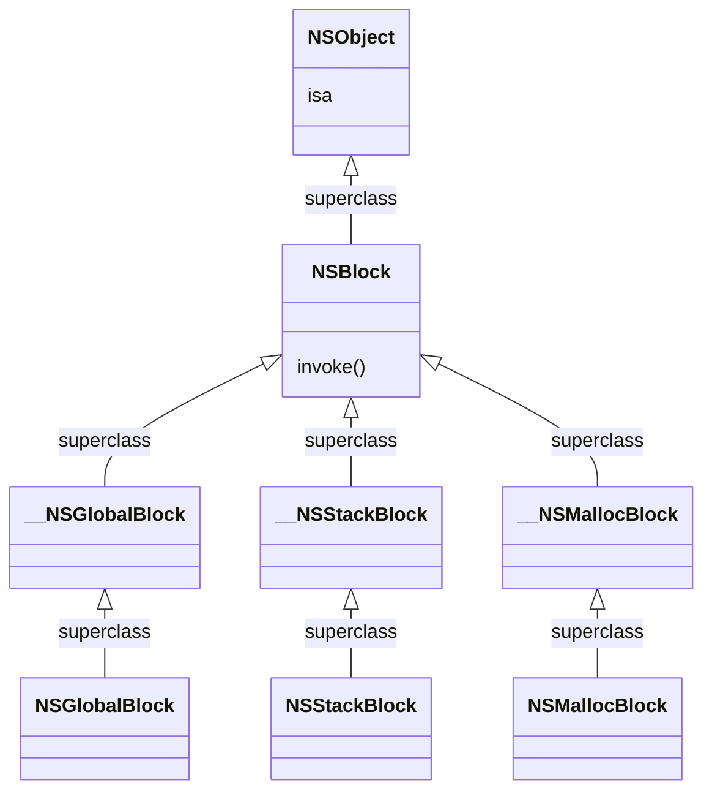
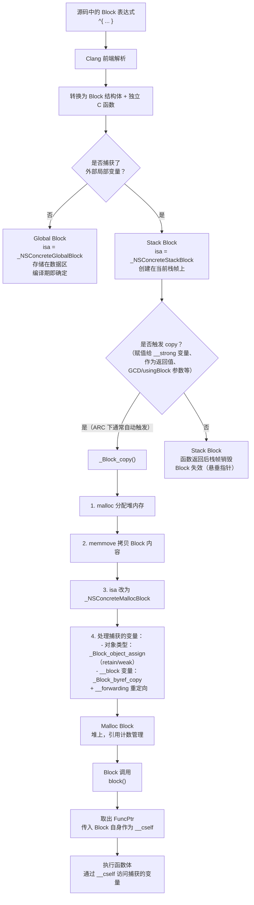

+++
title = "Block底层原理"
date = '2026-05-02T22:32:27+08:00'
draft = false
weight = 2
tags = ["iOS", "面试", "基础"]
categories = ["iOS开发", "面试"]
+++
## 基础概念

Block 是 Apple 在 C 语言基础上扩展的语法特性（也称为 Closure / 闭包），它允许将一段代码和其执行时需要的上下文环境封装为一个可传递的对象。Block 在 Objective-C 和 C/C++ 中均可使用，是 GCD、动画 API、回调等场景的核心机制。

```objc
// Block 的声明与调用
void (^myBlock)(NSString *) = ^(NSString *name) {
    NSLog(@"Hello, %@", name);
};
myBlock(@"World");
```

一个核心问题是：**Block 是函数指针还是对象？** 答案是——Block 本质上是一个 **OC 对象**。它的底层是一个包含 `isa` 指针的 C 结构体，满足 OC 对象的基本条件；同时它也包含一个函数指针（`FuncPtr`），指向 Block 实际执行的代码。因此可以说，Block 是一个用对象形式包装了函数指针和捕获变量的特殊 OC 对象。

## 底层数据结构

通过 `clang -rewrite-objc` 可以将 Block 语法转换为 C++ 代码，观察其底层结构。这个转换虽然不完全等同于最终编译产物，但准确反映了 Block 的数据布局和调用机制。

### 编译器转换示例

对以下源码：

```objc
int main() {
    int a = 10;
    void (^block)(void) = ^{
        NSLog(@"%d", a);
    };
    block();
    return 0;
}
```

Clang 会将其转换为如下结构：

```c
// ==================== 1. Block 的通用底层结构 ====================
struct __block_impl {
    void *isa;         // 指向 Block 的类对象（说明 Block 是 OC 对象）
    int Flags;         // 标志位，用于记录 Block 的附加信息（是否需要 copy/dispose 等）
    int Reserved;      // 保留字段
    void *FuncPtr;     // 指向 Block 执行代码的函数指针
};

// ==================== 2. 具体 Block 的描述信息 ====================
static struct __main_block_desc_0 {
    unsigned long reserved;
    unsigned long Block_size;  // Block 结构体的总大小
} __main_block_desc_0_DATA = {
    0,
    sizeof(struct __main_block_impl_0)
};

// ==================== 3. 具体 Block 的结构体（包含捕获的变量）====================
struct __main_block_impl_0 {
    struct __block_impl impl;            // 内嵌通用结构
    struct __main_block_desc_0 *Desc;    // 指向描述信息
    int a;                               // 捕获的外部变量副本

    // 构造函数
    __main_block_impl_0(void *fp, struct __main_block_desc_0 *desc, int _a, int flags=0) : a(_a) {
        impl.isa = &_NSConcreteStackBlock; // isa 指向栈 Block 类
        impl.Flags = flags;
        impl.FuncPtr = fp;                 // 函数指针指向下面的 __main_block_func_0
        Desc = desc;
    }
};

// ==================== 4. Block 体被提取为独立的 C 函数 ====================
static void __main_block_func_0(struct __main_block_impl_0 *__cself) {
    int a = __cself->a;  // 从 Block 结构体中读取捕获的变量
    NSLog(@"%d", a);
}

// ==================== 5. main 函数的转换结果 ====================
int main() {
    int a = 10;

    // Block 的创建：构造结构体，传入函数指针、描述信息和捕获变量
    void (*block)(void) = (void (*)())&__main_block_impl_0(
        (void *)__main_block_func_0,
        &__main_block_desc_0_DATA,
        a  // 值拷贝
    );

    // Block 的调用：取出 FuncPtr 并调用，传入 Block 结构体自身作为参数
    ((void (*)(__block_impl *))((__block_impl *)block)->FuncPtr)((__block_impl *)block);

    return 0;
}
```

### 完整的内存布局

将上面的结构体展开，一个 Block 对象在内存中的实际布局如下：

```plaintext
┌────────────────────────────────────────────┐
│              __main_block_impl_0           │
├────────────────────────────────────────────┤
│  __block_impl impl                         │
│  ├── void *isa          (8 bytes)  ───→ _NSConcreteStackBlock / GlobalBlock / MallocBlock
│  ├── int Flags           (4 bytes)         │
│  ├── int Reserved        (4 bytes)         │
│  └── void *FuncPtr      (8 bytes)  ───→ __main_block_func_0（Block 的执行代码）
├────────────────────────────────────────────┤
│  __main_block_desc_0 *Desc (8 bytes) ───→ { reserved, Block_size, copy_func, dispose_func }
├────────────────────────────────────────────┤
│  int a                    (4 bytes)        │  ← 捕获的变量（值拷贝）
│  (padding)                (4 bytes)        │  ← 内存对齐
└────────────────────────────────────────────┘
```

### 关键结论

1. **Block 是 OC 对象**：拥有 `isa` 指针，指向 Block 的类对象（`_NSConcreteStackBlock` / `_NSConcreteGlobalBlock` / `_NSConcreteMallocBlock`）
2. **Block 包含函数指针**：`FuncPtr` 指向编译器从 Block 体中提取出的独立 C 函数
3. **Block 调用时传入自身**：调用 `block()` 时，Block 结构体自身被作为第一个参数（`__cself`）传给 `FuncPtr` 指向的函数，因此函数内部能访问捕获的变量
4. **捕获变量存储在结构体末尾**：被捕获的局部变量以值拷贝的方式存储在 Block 结构体的成员变量位置

### Flags 标志位详解

`Flags` 字段是一个位掩码，编码了 Block 的多种属性：

```c
enum {
    BLOCK_DEALLOCATING      = (0x0001),  // Block 正在被释放（运行时使用）
    BLOCK_REFCOUNT_MASK     = (0xfffe),  // 引用计数掩码（低16位中的高15位）
    BLOCK_NEEDS_FREE        = (1 << 24), // 堆 Block，需要 free 释放
    BLOCK_HAS_COPY_DISPOSE  = (1 << 25), // Block 有 copy/dispose 辅助函数（捕获了对象或 __block 变量时设置）
    BLOCK_HAS_CTOR          = (1 << 26), // Block 有 C++ 构造函数/析构函数
    BLOCK_IS_GC             = (1 << 27), // GC 标记（已废弃）
    BLOCK_IS_GLOBAL         = (1 << 28), // 全局 Block
    BLOCK_HAS_STRET         = (1 << 29), // 返回值通过结构体返回（已废弃）
    BLOCK_HAS_SIGNATURE     = (1 << 30), // Block 有类型签名
};
```

其中 `BLOCK_HAS_COPY_DISPOSE` 最常见——当 Block 捕获了对象类型变量或 `__block` 修饰的变量时，编译器会生成 `copy` 和 `dispose` 辅助函数，并在描述信息中记录它们的指针：

```c
// 捕获了对象时，Desc 结构体会扩展为：
static struct __main_block_desc_0 {
    unsigned long reserved;
    unsigned long Block_size;
    void (*copy)(struct __main_block_impl_0 *, struct __main_block_impl_0 *);    // copy 辅助函数
    void (*dispose)(struct __main_block_impl_0 *);                                // dispose 辅助函数
};
```

## Block 的类型与内存分布

Block 作为 OC 对象，其 `isa` 指向不同的类，对应三种类型。不同类型的 Block 存储在不同的内存区域，生命周期和行为也各不相同：

| 类型 | isa 指向 | 存储位置 | 触发条件 | 生命周期 |
|------|---------|---------|---------|---------|
| `__NSGlobalBlock__` | `_NSConcreteGlobalBlock` | 数据区（.data） | 没有捕获任何外部局部变量 | 程序运行期间一直存在 |
| `__NSStackBlock__` | `_NSConcreteStackBlock` | 栈 | 捕获了外部局部变量，且未被 copy | 当前函数作用域结束即销毁 |
| `__NSMallocBlock__` | `_NSConcreteMallocBlock` | 堆 | 对 Stack Block 执行了 copy 操作 | 引用计数为 0 时销毁 |

### Global Block

没有捕获任何外部局部变量的 Block 是 Global Block。由于它不依赖任何外部状态，编译器可以在编译期就确定其内容，将其存放在数据区（类似全局变量）。

```objc
void (^globalBlock)(void) = ^{
    NSLog(@"I am a global block");
};
NSLog(@"%@", [globalBlock class]);  // __NSGlobalBlock__

// 访问全局变量或 static 变量不影响 Block 类型
static int s = 10;
int g = 20; // 全局变量
void (^block2)(void) = ^{
    NSLog(@"%d %d", s, g);
};
NSLog(@"%@", [block2 class]); // __NSGlobalBlock__
```

Global Block 的 `copy` / `retain` / `release` 都是空操作，因为它在数据区永远不会被释放。

### Stack Block

捕获了外部局部变量的 Block 默认创建在栈上。栈 Block 的生命周期与定义它的函数/作用域绑定——当函数返回后，栈帧被回收，栈 Block 也随之销毁。

```objc
// 在 MRC 下可以直接观察到 Stack Block
// 在 ARC 下，由于编译器自动插入 copy，赋值给变量后通常变为 Malloc Block
// 但以下场景仍可见 Stack Block：

int a = 10;
// 直接打印 Block 的 class，不赋值给变量
NSLog(@"%@", [^{ NSLog(@"%d", a); } class]); // __NSStackBlock__
```

**栈 Block 的危险性：** 如果在函数返回后还通过指针访问栈 Block，由于栈帧已被回收，会导致未定义行为（通常是崩溃或数据错乱）：

```objc
typedef void (^MyBlock)(void);

MyBlock getBlock() {
    int a = 10;
    // MRC 下：返回的是栈 Block，函数返回后栈帧销毁，调用者拿到的是悬垂指针
    // ARC 下：编译器自动 copy，返回的是堆 Block，安全
    return ^{
        NSLog(@"%d", a);
    };
}
```

### Malloc Block

对 Stack Block 执行 `copy` 后，Block 被拷贝到堆上，成为 Malloc Block。堆 Block 的生命周期由引用计数管理。

```objc
int a = 10;
void (^mallocBlock)(void) = ^{
    NSLog(@"%d", a);
};
NSLog(@"%@", [mallocBlock class]); // __NSMallocBlock__（ARC 下编译器自动 copy）
```

### 三种 Block 的内存分布图

```plaintext
┌─────────────────────────────────────────────────────────────┐
│                        进程内存空间                           │
├──────────────┬──────────────────────────────────────────────┤
│  栈（Stack）  │  __NSStackBlock__                            │
│  ↓ 向下增长   │  - 捕获了局部变量、未 copy 的 Block              │
│              │  - 函数返回后自动销毁                            │
├──────────────┼──────────────────────────────────────────────┤
│  堆（Heap）   │  __NSMallocBlock__                           │
│  ↑ 向上增长   │  - copy 后的 Block                            │
│              │  - 引用计数管理生命周期                           │
├──────────────┼──────────────────────────────────────────────┤
│  数据区       │  __NSGlobalBlock__                            │
│  （.data）    │  - 不捕获局部变量的 Block                       │
│              │  - 程序运行期间一直存在                           │
├──────────────┼──────────────────────────────────────────────┤
│  代码区       │  Block 的 FuncPtr 指向的函数代码                 │
│  （.text）    │                                              │
└──────────────┴──────────────────────────────────────────────┘
```

### Block 的继承链

Block 的类最终继承自 `NSObject`，可以通过 `class` / `superclass` 验证：

```objc
void (^block)(void) = ^{ NSLog(@"Hello"); };

NSLog(@"%@", [block class]);                              // __NSGlobalBlock__
NSLog(@"%@", [block superclass]);                         // __NSGlobalBlock
NSLog(@"%@", [[block superclass] superclass]);            // NSBlock
NSLog(@"%@", [[[block superclass] superclass] superclass]); // NSObject
```



正因为 Block 的继承链最终指向 `NSObject`，Block 可以接收 `copy`、`release`、`class`、`description` 等 `NSObject` 的消息。

### Block 的 copy 行为

不同类型的 Block 执行 `copy` 后的行为不同：

| 源类型 | copy 后 | 说明 |
|-------|--------|------|
| `__NSGlobalBlock__` | 什么也不做，返回原 Block | 全局 Block 不需要内存管理，copy 是空操作 |
| `__NSStackBlock__` | 从栈拷贝到堆，变为 `__NSMallocBlock__` | 这是 copy 的核心价值——延长 Block 的生命周期 |
| `__NSMallocBlock__` | 引用计数 +1，返回原 Block | 已在堆上，仅增加引用计数 |

copy 的底层实现（`_Block_copy` 函数）的核心流程：

```c
void *_Block_copy(const void *arg) {
    struct Block_layout *aBlock = (struct Block_layout *)arg;

    // Global Block：直接返回
    if (aBlock->flags & BLOCK_IS_GLOBAL) return aBlock;

    // Malloc Block：引用计数 +1
    if (aBlock->flags & BLOCK_NEEDS_FREE) {
        latching_incr_int(&aBlock->flags); // 原子操作增加引用计数
        return aBlock;
    }

    // Stack Block：拷贝到堆上
    struct Block_layout *result = (struct Block_layout *)malloc(aBlock->descriptor->size);
    memmove(result, aBlock, aBlock->descriptor->size);  // 内存拷贝
    result->flags |= BLOCK_NEEDS_FREE | 1;              // 标记为堆 Block，引用计数设为 1
    result->isa = _NSConcreteMallocBlock;                // 修改 isa
    _Block_call_copy_helper(result, aBlock);             // 调用 copy 辅助函数（处理捕获的对象和 __block 变量）
    return result;
}
```

### ARC 下编译器自动 copy 的场景

ARC 环境下，以下场景编译器会**自动对 Block 执行 copy**（插入 `objc_retainBlock` 调用，内部调用 `_Block_copy`）：

1. **Block 赋值给 `__strong` 修饰的变量**（包括属性）

```objc
int a = 10;
void (^block)(void) = ^{ NSLog(@"%d", a); };
// 编译器在赋值时自动插入 copy，block 变为 __NSMallocBlock__
```

2. **Block 作为函数/方法的返回值**

```objc
typedef void (^MyBlock)(void);
MyBlock getBlock() {
    int a = 10;
    return ^{ NSLog(@"%d", a); }; // 编译器自动 copy
}
```

3. **Block 作为 Cocoa API 中含 `usingBlock` 的方法参数**

```objc
[array enumerateObjectsUsingBlock:^(id obj, NSUInteger idx, BOOL *stop) {
    // 编译器自动 copy
}];
```

4. **Block 作为 GCD API 的参数**

```objc
dispatch_async(dispatch_get_main_queue(), ^{
    // GCD 内部会 copy
});
```

因此在 ARC 下，Stack Block 几乎不可见——只要你将 Block 赋值给一个变量，它就已经被 copy 到堆上了。

## 变量捕获机制

Block 捕获外部变量的方式取决于变量的存储类型。这是 Block 最核心的特性之一——能够"记住"定义时的上下文环境。

### 捕获规则总览

| 变量类型 | 是否捕获 | 捕获方式 | Block 内能否修改 | 原理 |
|---------|---------|---------|---------------|------|
| 局部自动变量（`auto`） | 捕获 | 值拷贝 | 不能（编译器报错） | 拷贝了一份独立的副本 |
| `static` 局部变量 | 捕获 | 指针拷贝 | 能 | 持有变量的指针，通过指针间接访问 |
| 全局变量 | 不捕获 | 直接访问 | 能 | Block 执行时直接访问全局地址 |
| `__block` 修饰的局部变量 | 捕获 | 包装为结构体后捕获指针 | 能 | 通过 `__forwarding` 指针间接访问 |
| 对象类型局部变量 | 捕获 | 指针值拷贝 + 引用管理 | 能修改对象内容，不能修改指针指向 | `_Block_object_assign` 管理引用 |

### 局部自动变量：值拷贝

```objc
int a = 10;
int b = 20;
void (^block)(void) = ^{
    NSLog(@"a = %d, b = %d", a, b);
};
a = 100;
b = 200;
block(); // 输出 a = 10, b = 20（不是 100, 200）
```

**底层原因：** 编译器将捕获的变量作为 Block 结构体的成员变量，在 Block 创建时执行值拷贝：

```c
struct __main_block_impl_0 {
    struct __block_impl impl;
    struct __main_block_desc_0 *Desc;
    int a;  // 值拷贝，与外部的 a 独立
    int b;  // 值拷贝，与外部的 b 独立
};

// Block 创建时：
__main_block_impl_0(fp, desc, a, b, flags);  // a=10, b=20 被拷贝进来
```

**为什么 Block 内不能修改 auto 变量？** 因为 Block 内部访问的是拷贝后的副本，修改副本对原始变量没有任何意义（开发者的意图通常是要修改原变量）。为了避免这种语义上的歧义，编译器直接禁止了这种写法。如果确实需要修改，应使用 `__block` 修饰符。

### static 局部变量：指针拷贝

```objc
static int count = 0;
void (^block)(void) = ^{
    count++;
    NSLog(@"count = %d", count);
};
count = 100;
block(); // 输出 count = 101（通过指针访问的是同一个变量）
```

**底层原因：** `static` 变量存储在数据区，生命周期与程序一致，不存在作用域结束后被销毁的问题。因此 Block 捕获的是变量的指针，通过指针间接读写：

```c
struct __main_block_impl_0 {
    struct __block_impl impl;
    struct __main_block_desc_0 *Desc;
    int *count;  // 指针拷贝，指向 static 变量的地址
};

static void __main_block_func_0(struct __main_block_impl_0 *__cself) {
    int *count = __cself->count;
    (*count)++;  // 通过指针修改
}
```

### 全局变量：不捕获

```objc
int globalVar = 10;
static int staticGlobalVar = 20;

void (^block)(void) = ^{
    globalVar = 100;
    staticGlobalVar = 200;
    NSLog(@"%d, %d", globalVar, staticGlobalVar);
};
```

全局变量和静态全局变量的地址在编译期就已确定，任何代码都可以直接访问，Block 不需要额外捕获。因此 Block 结构体中不会增加对应的成员变量。

### `__block` 修饰符的底层原理

`__block` 是解决"Block 内部无法修改局部变量"的关键修饰符。它的底层实现比简单的值拷贝复杂得多。

#### 编译器包装

编译器会将 `__block` 修饰的变量包装成一个结构体 `__Block_byref`：

```objc
// 源码
__block int a = 10;
```

```c
// 编译器转换后
struct __Block_byref_a_0 {
    void *__isa;                                  // isa（通常为 nil）
    struct __Block_byref_a_0 *__forwarding;       // 指向自身（关键！）
    int __flags;
    int __size;
    int a;                                        // 真正的变量值
};

// 初始化
__Block_byref_a_0 a = {
    .isa = NULL,
    .forwarding = &a,  // __forwarding 指向自身
    .flags = 0,
    .size = sizeof(__Block_byref_a_0),
    .a = 10
};
```

#### `__forwarding` 指针的精妙设计

`__forwarding` 是 `__block` 实现的核心。初始时它指向自身（栈上的结构体）。当 Block 被 copy 到堆上时，`__block` 变量也会被拷贝到堆上，此时会发生 `__forwarding` 的重定向：

**copy 前（Block 在栈上）：**

```plaintext
栈内存：
┌─────────────────────────┐
│  __Block_byref_a_0      │
│  ├── __forwarding ──┐   │
│  └── a = 10         │   │
│         ↑           │   │
│         └───────────┘   │  __forwarding 指向自身
└─────────────────────────┘
```

**copy 后（Block 在堆上）：**

```plaintext
栈内存：                              堆内存：
┌─────────────────────────┐        ┌─────────────────────────┐
│  __Block_byref_a_0      │        │  __Block_byref_a_0      │
│  ├── __forwarding ──────────────→│  ├── __forwarding ──┐   │
│  └── a = 10 (旧值)       │        │  └── a = 10         │   │
└─────────────────────────┘        │         ↑           │   │
                                   │         └───────────┘   │
                                   └─────────────────────────┘
```

copy 后，栈上结构体的 `__forwarding` 被修改为指向堆上的副本，而堆上结构体的 `__forwarding` 指向自身。这保证了无论从栈还是堆访问，最终都操作堆上的同一份数据。

#### 访问与修改

```objc
__block int a = 10;
void (^block)(void) = ^{
    a = 20;
};
block();
NSLog(@"%d", a); // 输出 20
```

无论 Block 内部还是外部，对 `a` 的访问都被编译器转换为：

```c
// Block 内部修改
__cself->a->__forwarding->a = 20;

// Block 外部访问
a.__forwarding->a;  // 通过 __forwarding 间接访问
```

#### `__block` 变量的内存管理

当 Block 从栈拷贝到堆时，`_Block_copy` 内部会调用 `_Block_byref_copy` 函数来处理 `__block` 变量的拷贝。如果 `__block` 修饰的是对象类型，还需要根据对象的修饰符来决定引用关系：

```c
// __block 对象的 byref 结构体会包含 copy/dispose 辅助函数
struct __Block_byref_obj_0 {
    void *__isa;
    struct __Block_byref_obj_0 *__forwarding;
    int __flags;
    int __size;
    void (*__Block_byref_id_object_copy)(void *, void *);    // copy 辅助函数
    void (*__Block_byref_id_object_dispose)(void *);          // dispose 辅助函数
    NSObject *obj;                                            // 对象类型变量
};
```

当多个 Block 捕获同一个 `__block` 变量时，第一次 copy 会将 byref 结构体拷贝到堆上，后续的 copy 仅增加 byref 的引用计数（通过 `__flags` 中的 refcount 管理），确保所有 Block 共享同一份数据。

### 对象类型变量的捕获

当 Block 捕获对象类型变量时，捕获的是指针值（值拷贝）。但与基本类型不同的是，Block 还需要管理对象的引用关系，防止对象在 Block 执行前被释放。

```objc
NSMutableArray *array = [NSMutableArray array];
void (^block)(void) = ^{
    [array addObject:@"hello"]; // 可以修改对象内容
    // array = nil;             // 不能修改指针指向（编译器报错）
};
```

**引用管理的时机和方式：**

Block 被 copy 到堆上时，编译器生成的 `copy` 辅助函数（`__main_block_copy_0`）会被调用，内部通过 `_Block_object_assign` 根据变量的修饰符决定引用类型：

```c
// 编译器生成的 copy 辅助函数
static void __main_block_copy_0(struct __main_block_impl_0 *dst,
                                 struct __main_block_impl_0 *src) {
    // BLOCK_FIELD_IS_OBJECT 表示这是一个 OC 对象
    // 会根据 src->array 的修饰符（__strong / __weak）来决定 retain 还是弱引用
    _Block_object_assign(&dst->array, src->array, BLOCK_FIELD_IS_OBJECT);
}

// 编译器生成的 dispose 辅助函数（Block 释放时调用）
static void __main_block_dispose_0(struct __main_block_impl_0 *src) {
    _Block_object_dispose(src->array, BLOCK_FIELD_IS_OBJECT);
}
```

`_Block_object_assign` 内部的行为取决于变量的所有权修饰符：

| 修饰符 | `_Block_object_assign` 的行为 | 效果 |
|--------|------------------------------|------|
| `__strong`（默认） | 对对象执行 `retain`（强引用） | Block 持有对象，对象不会被提前释放 |
| `__weak` | 创建弱引用 | Block 不持有对象，对象可能在 Block 执行前被释放 |
| `__unsafe_unretained` | 直接赋值指针，不做任何引用操作 | 对象释放后指针变为悬垂指针，不安全 |

```objc
NSObject *strongObj = [[NSObject alloc] init];
__weak NSObject *weakObj = strongObj;

void (^block)(void) = ^{
    NSLog(@"strong: %@", strongObj); // Block 对 strongObj 做 retain
    NSLog(@"weak: %@", weakObj);     // Block 对 weakObj 做弱引用
};
```

## 循环引用问题

Block 最常见的内存问题是循环引用（Retain Cycle）。当对象持有 Block，Block 又捕获了该对象时，两者相互强引用，引用计数永远无法归零，导致内存泄漏。

### 循环引用的形成条件

循环引用需要**同时满足两个条件**：

1. **self 直接或间接强引用了 Block**（如 Block 作为 self 的属性）
2. **Block 强引用了 self**（Block 内部使用了 self 或 self 的属性/方法）


### 典型场景

**场景一：Block 属性中直接使用 self**

```objc
@interface MyViewController ()
@property (nonatomic, copy) void (^completionBlock)(void);
@end

@implementation MyViewController
- (void)viewDidLoad {
    // self → completionBlock → self，循环引用
    self.completionBlock = ^{
        [self doSomething];
    };
}
@end
```

**场景二：Block 中访问 self 的属性（隐式捕获 self）**

```objc
self.completionBlock = ^{
    // 访问 _name 等同于 self->_name，隐式捕获了 self
    NSLog(@"%@", _name);
};
```

**场景三：多层间接持有**

```objc
// self → manager → block → self
self.manager.completionBlock = ^{
    [self handleResult];
};
```

### 解决方案

**方案一：`__weak` + `__strong`（推荐，最常用）**

```objc
__weak typeof(self) weakSelf = self;
self.completionBlock = ^{
    __strong typeof(weakSelf) strongSelf = weakSelf;
    if (!strongSelf) return;

    // 使用 strongSelf 而非 self
    [strongSelf doSomething];
    [strongSelf doAnotherThing]; // strongSelf 保证整个 Block 执行期间 self 不会被释放
};
```

**为什么需要 Block 内部的 `__strong`？** 如果只用 `weakSelf` 而不在 Block 内部做 `__strong`，在多线程环境下可能出现：第一行代码执行时 `weakSelf` 还有值，但在执行到第二行代码之前，`self` 在其他线程被释放了，导致 `weakSelf` 变为 `nil`。`__strong` 保证在 Block 的整个执行期间持有 `self`。

**方案二：`__block` 变量手动置 nil**

```objc
__block MyViewController *blockSelf = self;
self.completionBlock = ^{
    [blockSelf doSomething];
    blockSelf = nil; // 手动断开引用
};
// 注意：必须执行 Block 才能断开引用。如果 Block 从未被调用，循环引用仍然存在
self.completionBlock();
```

这种方案的优点是可以精确控制引用的释放时机，缺点是依赖 Block 必须被执行。在 MRC 下这是主要的解决方案，因为 MRC 下 `__block` 变量不会被 Block retain。

**方案三：将 self 作为参数传入**

```objc
// 修改 Block 签名，将 self 作为参数
@property (nonatomic, copy) void (^completionBlock)(MyViewController *vc);

self.completionBlock = ^(MyViewController *vc) {
    [vc doSomething]; // vc 是参数，不是 Block 捕获的变量
};
self.completionBlock(self);
```

Block 没有捕获 self，而是在调用时通过参数传入，因此不存在循环引用。

### 不会产生循环引用的场景

并非所有 Block 中使用 `self` 都会导致循环引用。判断的关键是：**self 是否直接或间接持有了这个 Block**。

```objc
// 1. UIView 动画 Block：Block 作为类方法的参数传入，self 不持有该 Block
[UIView animateWithDuration:0.3 animations:^{
    self.view.alpha = 0; // 安全，self 不持有这个 Block
}];

// 2. GCD Block：Block 被 GCD 系统持有，self 没有直接持有
dispatch_async(dispatch_get_main_queue(), ^{
    [self doSomething]; // 安全，但 self 的释放会被延迟到 Block 执行完毕
});

// 3. 局部变量 Block：不被任何对象持有，执行完即释放
void (^localBlock)(void) = ^{
    [self doSomething]; // 安全，localBlock 是局部变量，不被 self 持有
};
localBlock();

// 4. NSNotificationCenter 的 block-based API（需注意）
// observer 被 self 持有时仍可能形成间接循环引用
id observer = [[NSNotificationCenter defaultCenter]
    addObserverForName:@"MyNotif" object:nil queue:nil
    usingBlock:^(NSNotification *note) {
        [self doSomething]; // 如果 self 持有 observer，则循环引用
    }];
self.observer = observer; // self → observer → block → self，循环引用！
```

### 循环引用的检测

- **Xcode Memory Graph Debugger**：在调试时点击 Debug Memory Graph 按钮，可以可视化查看对象间的引用关系，紫色感叹号标记的对象即为可能的内存泄漏
- **Instruments - Leaks**：运行时检测内存泄漏
- **MLeaksFinder / FBRetainCycleDetector**：第三方库，在 Debug 模式下自动检测 ViewController 和 View 的内存泄漏

## Block 属性为什么用 copy

在 MRC 时代，Block 属性必须使用 `copy` 特性：

```objc
// MRC
@property (nonatomic, copy) void (^myBlock)(void);
```

**原因分析：** 捕获了局部变量的 Block 默认创建在栈上（Stack Block）。如果属性使用 `retain`，仅增加引用计数而不执行真正的内存拷贝——Block 仍然在栈上。当定义 Block 的函数返回后，栈帧被回收，该 Block 变成悬垂指针，通过属性访问时会崩溃。`copy` 会触发 `_Block_copy`，将 Block 从栈拷贝到堆上，生命周期改由引用计数管理，确保安全。

**ARC 下的情况：** 在 ARC 下，`copy` 和 `strong` 对 Block 属性的效果实际上相同——编译器在赋值时会自动插入 `objc_retainBlock`（内部调用 `_Block_copy`），无论属性声明为 `copy` 还是 `strong`，Block 都会被拷贝到堆上。但使用 `copy` 仍然是推荐的写法，原因有二：

1. **语义清晰**：明确表达"这个属性持有的是 Block 的副本"
2. **向后兼容**：即使代码在 MRC 环境下编译也能正确工作

## Block 在编译和运行时的完整流程



## 常见面试题

### Block 的本质是什么？是函数指针还是对象？

Block 本质上是一个 **OC 对象**。通过 `clang -rewrite-objc` 可以看到，编译器将 Block 转换为一个 C 结构体，该结构体包含 `isa` 指针（指向 `_NSConcreteGlobalBlock` / `_NSConcreteStackBlock` / `_NSConcreteMallocBlock`），满足 OC 对象的基本条件。Block 的继承链为 `__NSGlobalBlock__` → `__NSGlobalBlock` → `NSBlock` → `NSObject`，因此 Block 可以响应 `copy`、`class` 等消息。

同时，Block 结构体中也包含一个函数指针 `FuncPtr`，指向编译器从 Block 体中提取出的独立 C 函数。调用 Block 时，实际上是通过 `FuncPtr` 调用这个函数，并将 Block 结构体自身作为第一个参数传入，使函数内部能访问捕获的变量。

因此，Block 既不是简单的函数指针，也不是普通的 OC 对象，而是**一个封装了函数指针、捕获变量和对象特性的特殊 OC 对象**。

### Block 有哪几种类型？分别存储在哪里？

Block 有三种类型：

1. **`__NSGlobalBlock__`**（全局 Block）：没有捕获任何外部局部变量，存储在数据区（.data），生命周期与程序一致。`copy`/`retain`/`release` 都是空操作。

2. **`__NSStackBlock__`**（栈 Block）：捕获了外部局部变量但未被 copy，存储在栈上，生命周期与当前函数作用域绑定。函数返回后 Block 失效。ARC 下几乎不可见，因为编译器会在赋值时自动 copy。

3. **`__NSMallocBlock__`**（堆 Block）：对栈 Block 执行 copy 后的产物，存储在堆上，由引用计数管理生命周期。ARC 下这是最常见的 Block 类型。

判断 Block 类型的关键：是否捕获了局部变量（决定 Global vs Stack），以及是否被 copy（决定 Stack vs Malloc）。

### `__block` 的作用和原理是什么？

`__block` 修饰符使得 Block 内部可以修改捕获的局部变量。

**底层原理：** 编译器将 `__block` 变量包装为 `__Block_byref` 结构体，其中包含变量的实际值和一个 `__forwarding` 指针。初始时 `__forwarding` 指向自身（栈上的结构体）。

当 Block 被 copy 到堆上时，`__block` 变量的 byref 结构体也被拷贝到堆上，并且栈上结构体的 `__forwarding` 被修改为指向堆上的副本。堆上的 `__forwarding` 仍指向自身。这样无论从 Block 内部还是外部访问变量，都是通过 `__forwarding` 指针间接访问，最终操作的都是堆上的同一份数据，保证了修改的一致性。

所有对 `__block` 变量的读写都被编译器转换为 `byref->__forwarding->variable` 的形式。

### 什么情况下 Block 会产生循环引用？如何解决？

**形成条件：** self 直接或间接强引用了 Block（如 Block 是 self 的属性），同时 Block 内部强引用了 self（使用了 self 或 self 的成员变量），两者相互持有，引用计数无法归零。

**解决方案：**

1. **`__weak` + `__strong`**（推荐）：用 `__weak typeof(self) weakSelf = self` 打破引用环，Block 内部用 `__strong typeof(weakSelf) strongSelf = weakSelf` 确保执行期间 self 不被释放。
2. **`__block` 变量手动置 nil**：Block 执行后将 `__block` 修饰的 self 引用置为 nil。缺点是 Block 必须被执行，否则引用不会被释放。
3. **将 self 作为 Block 参数传入**：Block 不捕获 self，调用时通过参数传入。

**不会循环引用的场景：** UIView 动画 Block、GCD Block、局部变量 Block 等——这些场景中 self 没有直接或间接持有 Block，因此不构成引用环。GCD Block 虽然会延长 self 的生命周期（Block 持有 self 直到执行完毕），但不会造成循环引用，因为 Block 执行完毕后会被 GCD 释放，进而释放对 self 的引用。

### Block 属性为什么推荐用 copy 而不是 strong？

在 MRC 下，`copy` 是**必须的**。因为捕获了局部变量的 Block 默认在栈上，`retain` 只增加引用计数而不进行内存拷贝，函数返回后栈帧销毁，Block 成为悬垂指针。`copy` 会将 Block 从栈拷贝到堆上，确保安全。

在 ARC 下，`copy` 和 `strong` 效果相同——编译器在赋值时会自动插入 `_Block_copy` 调用。但推荐使用 `copy`，一是语义更清晰（明确表达持有的是副本），二是保证在 MRC 下也能正确工作。
