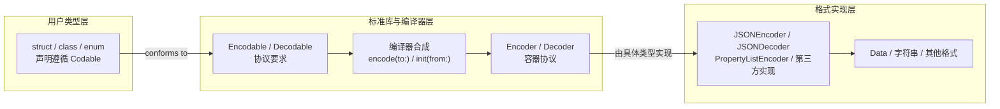
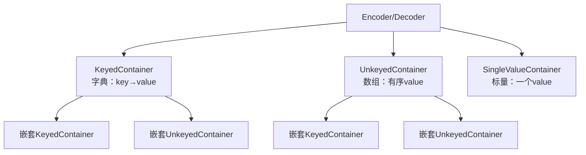
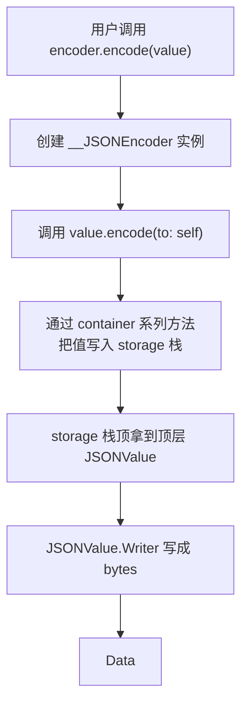
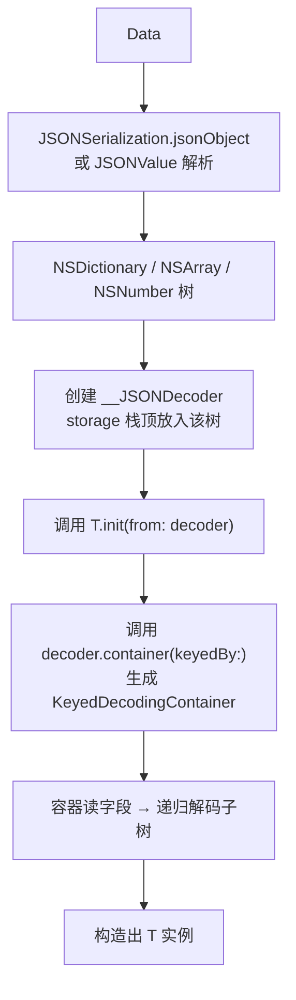

+++
title = "Codable底层原理"
date = '2026-06-08T23:06:52+08:00'
draft = false
weight = 3
tags = ["iOS", "面试", "基础"]
categories = ["iOS开发", "面试"]
+++
`Codable` 是 Swift 4 引入的序列化方案，官方定位是替代 Objective-C 时代的 `NSCoding`、以及各种第三方字典转模型框架（MJExtension、YYModel、JSONModel 等）。与运行时反射方案不同，`Codable` 通过"编译器自动合成 + 标准库协议抽象 + 具体格式实现"三层解耦，在编译期就把类型与序列化逻辑绑定好，兼具类型安全、性能和扩展性。

本文基于以下 Swift 源码展开分析：

- 协议定义：[`swift/stdlib/public/core/Codable.swift`](https://github.com/apple/swift/blob/main/stdlib/public/core/Codable.swift)
- 编译器合成：[`swift/lib/Sema/DerivedConformanceCodable.cpp`](https://github.com/apple/swift/blob/main/lib/Sema/DerivedConformanceCodable.cpp)、`DerivedConformanceCodingKey.cpp`
- Foundation 实现：[`swift-corelibs-foundation/Sources/Foundation/JSONEncoder.swift`](https://github.com/apple/swift-corelibs-foundation/blob/main/Sources/Foundation/JSONEncoder.swift)、`JSONDecoder.swift`、`PropertyListEncoder.swift`

## 整体架构

在开始深入之前，先建立整体印象。`Codable` 可以拆成三层角色：

- **用户类型层**：业务中的 `struct` / `class` / `enum`，声明遵循 `Codable`
- **标准库与编译器层**：标准库定义 `Encodable` / `Decodable` / `Encoder` / `Decoder` 等协议，编译器为符合条件的类型合成 `encode(to:)` 和 `init(from:)`
- **格式实现层**：Foundation 或第三方提供具体 `Encoder` / `Decoder`，负责把容器操作落到 JSON、Plist、BSON 等格式上



核心思想是：**标准库只定义"如何描述一个可编码类型"和"编码器需要提供什么能力"，具体的格式（JSON、Plist、BSON…）由 Foundation 或第三方实现**。用户类型只需要遵循协议，剩下的由编译器在 SIL 层自动生成。

## Codable 协议族源码剖析

### 顶层协议：Encodable 与 Decodable

`Codable.swift` 开头就是简单明了的三个声明：

```swift
public protocol Encodable {
    /// Encodes this value into the given encoder.
    func encode(to encoder: any Encoder) throws
}

public protocol Decodable {
    /// Creates a new instance by decoding from the given decoder.
    init(from decoder: any Decoder) throws
}

public typealias Codable = Encodable & Decodable
```

几个关键点：

- `Codable` 只是 `Encodable & Decodable` 的协议组合（typealias），本身没有额外要求
- `Encodable` 只有一个要求：把自己写到一个 `Encoder` 里；`Decodable` 只有一个要求：从 `Decoder` 中恢复自己
- 协议不关心"目标格式"——不管编码成 JSON、Plist 还是二进制，用户类型的 `encode(to:)` 实现完全一样
- `throws` 意味着编码/解码过程是可失败的（键缺失、类型不匹配等）

这种设计正是典型的**面向协议编程**：用最小的接口定义能力，具体实现由遵循者提供。

### CodingKey：类型安全的 key

字典转模型框架的老大难问题是"字段名拼错了怎么办"。`Codable` 用 `CodingKey` 协议彻底解决这个问题：

```swift
public protocol CodingKey: CustomStringConvertible,
                          CustomDebugStringConvertible,
                          Sendable {
    var stringValue: String { get }
    init?(stringValue: String)

    var intValue: Int? { get }
    init?(intValue: Int)
}
```

- `stringValue` 用于字典/对象类型的 key（JSON 对象的字段名）
- `intValue` 用于数组索引（少见，主要服务于某些二进制格式）
- 两个 `init?` 保证可以反向由字符串/整型构造出 key

编译器为每个 `Codable` 类型**自动合成一个嵌套的 `CodingKeys` 枚举**，这个枚举就是该类型的 `CodingKey`。用户也可以显式声明来改写字段名：

```swift
struct User: Codable {
    let userId: Int
    let name: String

    // 显式声明会覆盖编译器合成的版本
    enum CodingKeys: String, CodingKey {
        case userId = "user_id"  // JSON 字段叫 user_id，Swift 属性叫 userId
        case name
    }
}
```

原始值是 `String` 时，编译器通过 `RawRepresentable` 间接合成 `stringValue`（`rawValue` 即 `stringValue`）。`DerivedConformanceCodingKey.cpp` 里完成了 `String` 和 `Int` 两种原始值到 `CodingKey` 的桥接。

### Encoder / Decoder 协议

这是整个体系最核心的两个协议：

```swift
public protocol Encoder {
    var codingPath: [any CodingKey] { get }
    var userInfo: [CodingUserInfoKey: Any] { get }

    func container<Key: CodingKey>(keyedBy type: Key.Type) -> KeyedEncodingContainer<Key>
    func unkeyedContainer() -> UnkeyedEncodingContainer
    func singleValueContainer() -> SingleValueEncodingContainer
}

public protocol Decoder {
    var codingPath: [any CodingKey] { get }
    var userInfo: [CodingUserInfoKey: Any] { get }

    func container<Key: CodingKey>(keyedBy type: Key.Type) throws -> KeyedDecodingContainer<Key>
    func unkeyedContainer() throws -> UnkeyedDecodingContainer
    func singleValueContainer() throws -> SingleValueDecodingContainer
}
```

两个协议几乎对称，关键信息：

- `codingPath`：当前编码/解码位置的路径栈。出错时可以打印这个路径，精确定位到是哪个嵌套字段出的问题（比如 `user.address.street`）
- `userInfo`：外部传入的上下文字典，可以把一些运行时依赖注入进来（比如依赖的 `NSManagedObjectContext`）
- 三个容器方法：分别对应"字典式"、"数组式"、"标量式"三种数据结构

**"容器"是 Codable 最巧妙的设计**。它把不同数据形态统一为三种接口，既能表达 JSON、Plist、XML 等不同格式，也能让用户代码保持简洁。

### 三种容器

三种容器对应三种数据形态：



`KeyedEncodingContainerProtocol` 是 keyed 容器的实际协议：

```swift
public protocol KeyedEncodingContainerProtocol {
    associatedtype Key: CodingKey
    var codingPath: [any CodingKey] { get }

    mutating func encodeNil(forKey key: Key) throws
    mutating func encode(_ value: Bool, forKey key: Key) throws
    mutating func encode(_ value: String, forKey key: Key) throws
    mutating func encode(_ value: Double, forKey key: Key) throws
    mutating func encode(_ value: Float, forKey key: Key) throws
    mutating func encode(_ value: Int, forKey key: Key) throws
    // Int8/16/32/64, UInt, UInt8/16/32/64 ...省略
    mutating func encode<T: Encodable>(_ value: T, forKey key: Key) throws

    mutating func encodeIfPresent(_ value: Bool?, forKey key: Key) throws
    // ...

    mutating func nestedContainer<NestedKey>(
        keyedBy keyType: NestedKey.Type, forKey key: Key
    ) -> KeyedEncodingContainer<NestedKey>

    mutating func nestedUnkeyedContainer(forKey key: Key) -> UnkeyedEncodingContainer

    mutating func superEncoder() -> Encoder
    mutating func superEncoder(forKey key: Key) -> Encoder
}
```

为什么要为每个**基础类型**单独重载一个 `encode` 方法？这是性能考虑：如果只有泛型版本 `encode<T: Encodable>`，那么 `Int`、`Double` 这些在编码时都要走一遍泛型分发，走不了 inline 和特化。给基础类型单独声明重载，遵循 Encoder 实现时就可以直接输出 `NSNumber`、原生数值，避免装箱。这也是 Swift 编译器与标准库的常见优化手法。

#### KeyedEncodingContainer 的类型擦除盒子

注意 `Encoder.container(keyedBy:)` 返回的是结构体 `KeyedEncodingContainer<Key>` 而不是协议。这是因为 `KeyedEncodingContainerProtocol` 有 `associatedtype`，不能直接作为存在容器使用。Swift 标准库的做法是**手写类型擦除盒子**：

```swift
public struct KeyedEncodingContainer<K: CodingKey>: KeyedEncodingContainerProtocol {
    public typealias Key = K
    internal var _box: _KeyedEncodingContainerBase

    public init<Container: KeyedEncodingContainerProtocol>(_ container: Container)
        where Container.Key == Key {
        self._box = _KeyedEncodingContainerBox(container)
    }

    public mutating func encode(_ value: String, forKey key: Key) throws {
        try _box.encode(value, forKey: key)
    }
    // ...所有方法都转发给 _box
}

internal class _KeyedEncodingContainerBase {
    internal func encode(_ value: String, forKey key: /* AnyCodingKey */) throws {
        fatalError("Must be overridden")
    }
    // ...
}

internal final class _KeyedEncodingContainerBox<
    Concrete: KeyedEncodingContainerProtocol
>: _KeyedEncodingContainerBase {
    var concrete: Concrete
    init(_ container: Concrete) { self.concrete = container }

    override func encode(_ value: String, forKey key: Concrete.Key) throws {
        try concrete.encode(value, forKey: key)
    }
    // ...
}
```

这种"**抽象基类 + 泛型具体子类**"的 pattern 在 Swift 标准库中很常见（比如 `AnyHashable`、`AnyCollection` 都是类似套路）。详见 [类型擦除]()。

### CodingUserInfoKey 与 EncodingError / DecodingError

两个错误类型是 enum：

```swift
public enum EncodingError: Error {
    case invalidValue(Any, Context)

    public struct Context: Sendable {
        public let codingPath: [any CodingKey]
        public let debugDescription: String
        public let underlyingError: (any Error)?
    }
}

public enum DecodingError: Error {
    case typeMismatch(Any.Type, Context)
    case valueNotFound(Any.Type, Context)
    case keyNotFound(any CodingKey, Context)
    case dataCorrupted(Context)

    public struct Context: Sendable {
        public let codingPath: [any CodingKey]
        public let debugDescription: String
        public let underlyingError: (any Error)?
    }
}
```

所有错误都带 `codingPath`，这样用户可以拿到嵌套路径准确定位问题。日志里看到 `"Expected Int but found String, path: user.address.zipCode"`，立刻就能知道是哪个字段出错了。

## 编译器自动合成机制

`Codable` 最神奇的特性是不用写任何代码就能自动获得序列化能力：

```swift
struct User: Codable {
    let id: Int
    let name: String
    let email: String?
}
// 就这么多，不用写别的
```

这背后是 Swift 编译器的**派生协议一致性**（Derived Conformance）机制，实现在 [`DerivedConformanceCodable.cpp`](https://github.com/apple/swift/blob/main/lib/Sema/DerivedConformanceCodable.cpp) 中。它在语义分析（Sema）阶段工作，为类型自动生成 AST 节点，再交给后续 SILGen 处理。

### 合成时机与条件

编译器触发派生合成的条件：

- 类型显式声明遵循 `Codable`、`Encodable` 或 `Decodable`
- 类型是 `struct`、`class` 或 `enum`（枚举从 Swift 5.5 开始支持，SE-0295）
- 所有存储属性（或枚举关联值）的类型都已遵循 `Codable`（或对应的半边协议）
- 用户没有**手动**实现 `encode(to:)` / `init(from:)`——只要实现了其中一个，整个合成就被禁用（必须两个都手写）

### 合成出的 CodingKeys

如果用户没有显式声明嵌套 `enum CodingKeys: CodingKey`，编译器会合成一个：

```swift
// 编译器内部合成
private enum CodingKeys: String, CodingKey {
    case id
    case name
    case email
}
```

合成逻辑（`DerivedConformanceCodingKey.cpp`）：

- 遍历类型的存储属性（class 也包括继承来的）
- 用属性名作为 case 名，同时作为原始字符串值
- 如果用户自己声明了 `CodingKeys`，就不再合成，这也是自定义 JSON 字段名的入口

### 合成出的 encode(to:)

编译器合成的 `encode(to:)` 大致长这样（以 `User` 为例）：

```swift
// 伪代码，展示合成逻辑
func encode(to encoder: Encoder) throws {
    var container = encoder.container(keyedBy: CodingKeys.self)
    try container.encode(self.id, forKey: .id)
    try container.encode(self.name, forKey: .name)
    try container.encodeIfPresent(self.email, forKey: .email)
    // Optional 类型用 encodeIfPresent，其余用 encode
}
```

关键细节：

- 对 `Optional<T>` 字段使用 `encodeIfPresent`，这样 `nil` 时字段被**省略**而不是输出 `"email": null`
- 对普通字段使用 `encode`，nil 会报错（因为类型是 `Int` 不是 `Int?`）
- 容器的类型参数用合成的 `CodingKeys`

### 合成出的 init(from:)

对应的解码初始化器：

```swift
init(from decoder: Decoder) throws {
    let container = try decoder.container(keyedBy: CodingKeys.self)
    self.id = try container.decode(Int.self, forKey: .id)
    self.name = try container.decode(String.self, forKey: .name)
    self.email = try container.decodeIfPresent(String.self, forKey: .email)
}
```

对应的关键点：

- `decodeIfPresent` 用于 `Optional`：key 不存在或 value 为 null 时返回 nil（不报错）
- `decode` 用于非 Optional：key 不存在会抛 `keyNotFound`、类型不匹配抛 `typeMismatch`
- 注意 Swift 默认没有"字段缺失时用默认值"的能力——有默认值的属性，key 缺失也会报错（[SE-0295] 开始对 enum 有 default 支持，struct/class 仍需手写）

### 枚举的合成（SE-0295）

从 Swift 5.5 开始，带关联值的枚举也能自动合成 `Codable`：

```swift
enum Shape: Codable {
    case circle(radius: Double)
    case rectangle(width: Double, height: Double)
}
```

编译器合成出的结构比较复杂：每个 case 对应一个字段名，每个 case 内部再为每个关联值生成嵌套的 keyed container。编码结果形如：

```json
{
    "circle": {
        "radius": 5.0
    }
}
```

合成的 `encode(to:)` 伪代码：

```swift
func encode(to encoder: Encoder) throws {
    var container = encoder.container(keyedBy: CodingKeys.self)
    switch self {
    case let .circle(radius):
        var nested = container.nestedContainer(
            keyedBy: CircleCodingKeys.self, forKey: .circle)
        try nested.encode(radius, forKey: .radius)
    case let .rectangle(width, height):
        var nested = container.nestedContainer(
            keyedBy: RectangleCodingKeys.self, forKey: .rectangle)
        try nested.encode(width, forKey: .width)
        try nested.encode(height, forKey: .height)
    }
}
```

每个 case 还会合成一个专属的 `CodingKeys` 嵌套 enum，用户也可以用 `enum CodingKeys: String, CodingKey` + `enum CircleCodingKeys: String, CodingKey` 改写。

### 查看合成的代码

想亲眼看到合成代码，可以让编译器输出 SIL：

```bash
# 输出生成的接口（能看到 init(from:) 和 encode(to:) 的声明和自动注释）
swiftc -print-ast User.swift
# 或输出 SIL（更底层）
swiftc -emit-sil User.swift
```

在 `-print-ast` 输出里可以看到编译器"填回"的方法实现。

## JSONEncoder 源码剖析

协议只是骨架，真正让 `Codable` 跑起来的是具体 Encoder 实现。JSON 是最常用的格式，我们以 `JSONEncoder` 为例深入源码。

### 用户 API

```swift
open class JSONEncoder {
    open var outputFormatting: OutputFormatting = []
    open var dateEncodingStrategy: DateEncodingStrategy = .deferredToDate
    open var dataEncodingStrategy: DataEncodingStrategy = .base64
    open var nonConformingFloatEncodingStrategy: NonConformingFloatEncodingStrategy = .throw
    open var keyEncodingStrategy: KeyEncodingStrategy = .useDefaultKeys
    open var userInfo: [CodingUserInfoKey: Any] = [:]

    open func encode<T: Encodable>(_ value: T) throws -> Data { ... }
}
```

`JSONEncoder` 本身是"配置 + 入口"层，真正的编码工作交给内部的 `__JSONEncoder` 类。

### 编码流程

整体流程分为三步：



新版本（Swift 5.9+）的 swift-corelibs-foundation 用 `JSONValue` 枚举作为中间表示，老版本用 `NSMutableDictionary` / `NSMutableArray` + `JSONSerialization`，思路一致。这里以较易理解的旧版为例，概念映射到新版完全一样。

### __JSONEncoder：真正的 Encoder

```swift
fileprivate class __JSONEncoder: Encoder {
    fileprivate var storage: _JSONEncodingStorage
    fileprivate let options: JSONEncoder._Options
    public var codingPath: [any CodingKey]

    fileprivate var canEncodeNewValue: Bool {
        // 每一层容器只能编码一个"顶层值"，否则报错
        return self.storage.count == self.codingPath.count
    }

    public func container<Key>(keyedBy type: Key.Type)
        -> KeyedEncodingContainer<Key>
    {
        let topContainer: NSMutableDictionary
        if self.canEncodeNewValue {
            topContainer = self.storage.pushKeyedContainer()
        } else {
            // 容器复用：不是第一次取，就返回之前压栈的
            guard let container = self.storage.containers.last as? NSMutableDictionary else {
                preconditionFailure("...")
            }
            topContainer = container
        }
        let container = _JSONKeyedEncodingContainer<Key>(
            referencing: self, codingPath: self.codingPath, wrapping: topContainer)
        return KeyedEncodingContainer(container)
    }

    public func unkeyedContainer() -> UnkeyedEncodingContainer { ... }
    public func singleValueContainer() -> SingleValueEncodingContainer { ... }
}
```

这里有几个关键设计：

- `__JSONEncoder` **本身可以当 SingleValueEncodingContainer 用**（后文讲到）
- `canEncodeNewValue` 保证每层只压入一个顶层值
- `storage` 是一个栈，每调用一次 `container(...)` 就压入一个新容器
- 返回的 `KeyedEncodingContainer<Key>` 是前面说的类型擦除盒子，内部包装了 `_JSONKeyedEncodingContainer`

### _JSONEncodingStorage：容器栈

```swift
fileprivate struct _JSONEncodingStorage {
    private(set) fileprivate var containers: [NSObject] = []
    fileprivate var count: Int { return containers.count }

    fileprivate mutating func pushKeyedContainer() -> NSMutableDictionary {
        let dictionary = NSMutableDictionary()
        containers.append(dictionary)
        return dictionary
    }

    fileprivate mutating func pushUnkeyedContainer() -> NSMutableArray {
        let array = NSMutableArray()
        containers.append(array)
        return array
    }

    fileprivate mutating func push(container: __owned NSObject) {
        containers.append(container)
    }

    fileprivate mutating func popContainer() -> NSObject {
        precondition(!containers.isEmpty, "...")
        return containers.popLast()!
    }
}
```

- 本质上是一个 `[NSObject]` 栈
- keyed container 底层用 `NSMutableDictionary`
- unkeyed container 底层用 `NSMutableArray`
- 标量值（`Int`、`String` 等）会被包装成 `NSNumber`、`NSString` 压入

为什么用 Foundation 的 NSMutable 容器？因为最终要交给 `JSONSerialization.data(withJSONObject:)`，它只认这几个类型。新版 Foundation 改用 Swift 原生的 `JSONValue` 枚举，拜托了对 `JSONSerialization` 的依赖，但栈结构的思想完全一样。

### _JSONKeyedEncodingContainer：keyed 容器实现

```swift
fileprivate struct _JSONKeyedEncodingContainer<K: CodingKey>:
    KeyedEncodingContainerProtocol
{
    typealias Key = K

    private let encoder: __JSONEncoder
    private let container: NSMutableDictionary
    private(set) public var codingPath: [any CodingKey]

    // 基本类型直接 box 成 NSNumber/NSString 写入
    public mutating func encode(_ value: String, forKey key: Key) throws {
        self.container[_converted(key).stringValue._bridgeToObjectiveC()]
            = self.encoder.box(value)
    }

    public mutating func encode(_ value: Int, forKey key: Key) throws {
        self.container[_converted(key).stringValue._bridgeToObjectiveC()]
            = self.encoder.box(value)
    }

    // 嵌套 Encodable：递归调用其 encode(to:)
    public mutating func encode<T: Encodable>(_ value: T, forKey key: Key) throws {
        self.encoder.codingPath.append(key)
        defer { self.encoder.codingPath.removeLast() }
        self.container[_converted(key).stringValue._bridgeToObjectiveC()]
            = try self.encoder.box(value)
    }

    // 嵌套 keyed container
    public mutating func nestedContainer<NestedKey>(
        keyedBy keyType: NestedKey.Type, forKey key: Key
    ) -> KeyedEncodingContainer<NestedKey>
    {
        let dictionary = NSMutableDictionary()
        self.container[_converted(key).stringValue._bridgeToObjectiveC()] = dictionary
        self.codingPath.append(key)
        defer { self.codingPath.removeLast() }
        let container = _JSONKeyedEncodingContainer<NestedKey>(
            referencing: self.encoder,
            codingPath: self.codingPath,
            wrapping: dictionary)
        return KeyedEncodingContainer(container)
    }
}
```

几个关键实现点：

- **键名转换**：`_converted(key)` 根据 `keyEncodingStrategy` 把 CodingKey 转成实际的字符串（比如 camelCase → snake_case）
- **codingPath 维护**：每次进入嵌套前 append，defer 里 removeLast，确保嵌套错误时能打印准确路径
- **box 机制**：把 Swift 值桥接成 NSObject 形态

### box 方法：Swift → Foundation 的桥接

```swift
fileprivate extension __JSONEncoder {
    func box(_ value: Bool) -> NSObject { return NSNumber(value: value) }
    func box(_ value: Int) -> NSObject { return NSNumber(value: value) }
    func box(_ value: String) -> NSObject { return NSString(string: value) }
    // ...其他基础类型

    func box(_ date: Date) throws -> NSObject {
        switch options.dateEncodingStrategy {
        case .deferredToDate:
            try date.encode(to: self)   // 调用 Date 自身的 encode(to:)
            return self.storage.popContainer()
        case .secondsSince1970:
            return NSNumber(value: date.timeIntervalSince1970)
        case .millisecondsSince1970:
            return NSNumber(value: 1000.0 * date.timeIntervalSince1970)
        case .iso8601:
            return NSString(string: _iso8601Formatter.string(from: date))
        case .formatted(let formatter):
            return NSString(string: formatter.string(from: date))
        case .custom(let closure):
            try closure(date, self)
            return self.storage.popContainer()
        }
    }

    func box<T: Encodable>(_ value: T) throws -> NSObject {
        // 递归：对任意 Encodable 值，再调用一次 encode
        let depth = self.storage.count
        do {
            try value.encode(to: self)
        } catch { ... }

        guard self.storage.count > depth else {
            return NSDictionary()   // encode 什么都没做（空容器）
        }
        return self.storage.popContainer()
    }
}
```

`box<T: Encodable>` 里有一处精彩的设计：把 `__JSONEncoder` 自己作为 encoder 传进去，让子值调用 `value.encode(to: self)`。子值编码时会往 `storage` 栈里 push 一个容器，结束后 pop 出来就是子值的编码结果。整个过程靠**栈深度**来界定每层的范围，非常简洁。

### 为什么可以"encoder 就是 SingleValueContainer"

`__JSONEncoder` 同时遵循 `Encoder` 和 `SingleValueEncodingContainer`：

```swift
extension __JSONEncoder: SingleValueEncodingContainer {
    public func encode(_ value: Int) throws {
        assertCanEncodeNewValue()
        self.storage.push(container: self.box(value))
    }
    // ...
}

public func singleValueContainer() -> SingleValueEncodingContainer {
    return self   // 返回自己
}
```

当编码标量时，直接调 `encoder.singleValueContainer().encode(value)`，本质上就是往 `storage` 栈顶 push 一个 `NSNumber`。这比为 singleValue 单独做一个类要简洁得多。

### 最终输出

```swift
public func encode<T: Encodable>(_ value: T) throws -> Data {
    let encoder = __JSONEncoder(options: self.options, codingPath: [])
    guard let topLevel = try encoder.box_(value) else {
        throw EncodingError.invalidValue(value, ...)
    }

    // 交给 JSONSerialization 完成最后的字符串化
    return try JSONSerialization.data(
        withJSONObject: topLevel, options: writingOptions)
}
```

新版本 Foundation 放弃了 `JSONSerialization`，改用自研的 `JSONValue.Writer` 直接生成字节流，性能更好且不依赖 `NSObject`。

### 一次完整编码的流程

以 `User(id: 1, name: "Alice", email: nil)` 为例，全过程如下：

```text
1. JSONEncoder.encode(user)
   → 创建 __JSONEncoder, storage = []

2. encoder.box(user) → user.encode(to: encoder)
   → [合成代码] container = encoder.container(keyedBy: CodingKeys.self)
   → storage 压入 NSMutableDictionary {}
   → storage = [{}]

3. container.encode(1, forKey: .id)
   → storage[0]["id"] = NSNumber(1)
   → storage = [{"id": 1}]

4. container.encode("Alice", forKey: .name)
   → storage = [{"id": 1, "name": "Alice"}]

5. container.encodeIfPresent(nil, forKey: .email)
   → email 是 nil，什么也不做

6. user.encode(to:) 返回
   → box(user) 从 storage pop 出 NSMutableDictionary
   → storage = []

7. JSONSerialization.data(withJSONObject: {"id": 1, "name": "Alice"})
   → 输出 Data
```

关键观察：**栈的深度与 codingPath 的深度始终保持一致**，这是整个 encoder 正确性的核心不变式（invariant），`canEncodeNewValue` 就是在检验它。

## JSONDecoder 源码剖析

解码的流程正好反过来：从 `Data` 开始，先用 `JSONSerialization`（或新版 `JSONValue` 解析器）把数据反序列化成 `NSDictionary`/`NSArray` 树，再由 `__JSONDecoder` 递归消费这棵树。

### 整体流程



### __JSONDecoder 与栈

```swift
fileprivate class __JSONDecoder: Decoder {
    fileprivate var storage: _JSONDecodingStorage
    fileprivate let options: JSONDecoder._Options
    public var codingPath: [any CodingKey]

    fileprivate init(referencing container: Any, at codingPath: [any CodingKey] = [],
                     options: JSONDecoder._Options)
    {
        self.storage = _JSONDecodingStorage()
        self.storage.push(container: container)
        self.codingPath = codingPath
        self.options = options
    }

    public func container<Key>(keyedBy type: Key.Type) throws
        -> KeyedDecodingContainer<Key>
    {
        guard !(self.storage.topContainer is NSNull) else {
            throw DecodingError.valueNotFound(
                KeyedDecodingContainer<Key>.self, ...)
        }
        guard let topContainer = self.storage.topContainer as? [String: Any] else {
            throw DecodingError.typeMismatch(...)
        }
        let container = _JSONKeyedDecodingContainer<Key>(
            referencing: self, wrapping: topContainer)
        return KeyedDecodingContainer(container)
    }
}
```

与 Encoder 对称，关键点：

- storage 栈存放**已经反序列化成 NSObject 树的数据**，decoder 只负责消费
- 每次取容器，检查栈顶类型（Dictionary → keyed、Array → unkeyed、NSNull → valueNotFound）
- 错误时精确抛出 `typeMismatch` / `keyNotFound` / `valueNotFound`

### _JSONKeyedDecodingContainer

```swift
fileprivate struct _JSONKeyedDecodingContainer<K: CodingKey>:
    KeyedDecodingContainerProtocol
{
    private let decoder: __JSONDecoder
    private let container: [String: Any]
    public var allKeys: [Key]
    public var codingPath: [any CodingKey]

    public func contains(_ key: Key) -> Bool {
        return self.container[key.stringValue] != nil
    }

    public func decode(_ type: Int.Type, forKey key: Key) throws -> Int {
        guard let entry = self.container[key.stringValue] else {
            throw DecodingError.keyNotFound(key, ...)
        }
        self.decoder.codingPath.append(key)
        defer { self.decoder.codingPath.removeLast() }
        guard let value = try self.decoder.unbox(entry, as: Int.self) else {
            throw DecodingError.valueNotFound(type, ...)
        }
        return value
    }

    public func decode<T: Decodable>(_ type: T.Type, forKey key: Key) throws -> T {
        guard let entry = self.container[key.stringValue] else {
            throw DecodingError.keyNotFound(key, ...)
        }
        self.decoder.codingPath.append(key)
        defer { self.decoder.codingPath.removeLast() }
        guard let value = try self.decoder.unbox(entry, as: T.self) else {
            throw DecodingError.valueNotFound(type, ...)
        }
        return value
    }
}
```

- `contains(_:)` 用于 `decodeIfPresent`（内部会先 check contains 再 check null）
- 每次 decode 都要维护 `codingPath`，保证错误路径正确
- 泛型版 `decode<T: Decodable>` 里，通过 `decoder.unbox(entry, as: T.self)` 递归解码

### unbox 方法

`unbox` 是反向的 `box`：

```swift
fileprivate extension __JSONDecoder {
    func unbox(_ value: Any, as type: Int.Type) throws -> Int? {
        guard !(value is NSNull) else { return nil }
        guard let number = value as? NSNumber, number !== kCFBooleanTrue,
              number !== kCFBooleanFalse else {
            throw DecodingError.typeMismatch(type, ...)
        }
        let int = number.intValue
        guard NSNumber(value: int) == number else {
            throw DecodingError.dataCorrupted(...)  // 溢出或精度损失
        }
        return int
    }

    func unbox<T: Decodable>(_ value: Any, as type: T.Type) throws -> T? {
        // 对复合类型，递归：把 value 压栈，再调 T(from: self)
        self.storage.push(container: value)
        defer { self.storage.popContainer() }
        return try T(from: self)
    }
}
```

精彩的地方还是递归：**解码一个子值 = 把它压入 decoder 的栈，然后让它自己 `init(from: decoder)`**。栈的深度管理子值的作用域。

`NSNumber(value: int) == number` 这行看似无害，实则保证了**严格类型检查**：JSON 里写的 `1.5` 尝试解码成 `Int` 会报错（回写 NSNumber 后 `1` != `1.5`），防止精度丢失。这是 Codable 比手写字典转模型更安全的一处体现。

## 与 NSCoding、字典转模型框架的对比

| 维度 | NSCoding | MJExtension / YYModel | Codable |
|---|---|---|---|
| 语言 | OC | OC（Swift 兼容） | Swift |
| 类型安全 | 弱（`id`） | 弱（运行时） | 强（编译期） |
| 实现机制 | 手写 `encodeWithCoder:` | Runtime 反射 + swizzle | 编译器合成 + 协议抽象 |
| 性能 | 一般 | 反射开销 | 接近手写 |
| 支持格式 | 归档（NSKeyedArchiver） | JSON（字典） | 任意（JSON/Plist/自定义） |
| 错误处理 | 无 | 静默失败 | `throws`，路径清晰 |
| 与第三方互操作 | 差 | 依赖具体库 | 任意 Encoder/Decoder |

**Codable 的核心优势**：

1. **编译期确定性**：类型错误、字段缺失在编译阶段就能暴露（比如属性类型不遵循 Codable 会编译失败）
2. **零反射开销**：合成的代码是静态的，没有运行时反射
3. **可组合**：Encoder/Decoder 是协议，可以为任意格式写实现（BSON、MessagePack、CBOR…）
4. **错误定位准**：`codingPath` 让嵌套错误一目了然

**代价**：

1. **灵活性不如反射**：想要"根据运行时决定字段"比较麻烦
2. **合成规则严格**：任一字段不遵循 Codable 就编译失败
3. **自定义字段名/默认值**需要写 CodingKeys 或手写 `init(from:)`

## 常见陷阱与进阶技巧

### Optional、默认值与 decodeIfPresent

合成代码对 `Optional` 字段用 `decodeIfPresent`，对非 Optional 用 `decode`。**有默认值不等于可选**：

```swift
struct Config: Codable {
    var retryCount: Int = 3  // 有默认值，但类型是 Int 不是 Int?
}
```

JSON 里没有 `retryCount` 字段时，合成的 `init(from:)` 会报 `keyNotFound`，而不是用默认值 3。想要"字段缺失时用默认值"必须手写：

```swift
init(from decoder: Decoder) throws {
    let c = try decoder.container(keyedBy: CodingKeys.self)
    self.retryCount = (try? c.decode(Int.self, forKey: .retryCount)) ?? 3
}
```

或者用 `@propertyWrapper` 抽象：

```swift
@propertyWrapper
struct DefaultValue<T: Codable>: Codable {
    var wrappedValue: T
    // 实现 init(from:) 用 decodeIfPresent 带默认
}
```

### keyEncodingStrategy/keyDecodingStrategy

snake_case ↔ camelCase 转换用这个：

```swift
let encoder = JSONEncoder()
encoder.keyEncodingStrategy = .convertToSnakeCase   // userName → user_name

let decoder = JSONDecoder()
decoder.keyDecodingStrategy = .convertFromSnakeCase // user_name → userName
```

实现上就是在 `_JSONKeyedEncodingContainer._converted(key)` 和解码对应位置做字符串转换，不用在每个模型里写 CodingKeys。

### 容器复用：superEncoder 的诡异之处

`superEncoder(forKey:)` 会给指定 key 绑定一个"子 encoder"，用于类继承场景：

```swift
class Base: Codable {
    let id: Int
    // init(from:) 用 decoder.singleValueContainer() 或 topLevel container
}

class Sub: Base {
    let name: String

    override func encode(to encoder: Encoder) throws {
        var c = encoder.container(keyedBy: CodingKeys.self)
        try c.encode(name, forKey: .name)
        try super.encode(to: c.superEncoder())  // 父类数据写到 "super" 子 key
    }
}
```

`superEncoder()` 默认 key 是 `"super"`，这点在跨语言序列化时容易踩坑。

### 条件编码：手写 encode(to:) 的常见场景

有些字段需要根据条件决定编码策略：

```swift
struct Response: Codable {
    let success: Bool
    let data: Data?
    let error: String?

    func encode(to encoder: Encoder) throws {
        var c = encoder.container(keyedBy: CodingKeys.self)
        try c.encode(success, forKey: .success)
        if success {
            try c.encodeIfPresent(data, forKey: .data)
        } else {
            try c.encodeIfPresent(error, forKey: .error)
        }
    }
}
```

一旦手写，**必须完整实现两边**（`encode(to:)` 和 `init(from:)`），合成就被关闭了。

### nestedContainer 与扁平化

有时 JSON 结构与 Swift 嵌套不一致，需要"扁平读"：

```swift
// JSON: { "user_name": "Alice", "user_id": 1, "age": 30 }
struct User: Codable {
    struct Info { let id: Int; let name: String }
    let info: Info
    let age: Int

    enum CodingKeys: String, CodingKey {
        case userName = "user_name"
        case userId = "user_id"
        case age
    }

    init(from decoder: Decoder) throws {
        let c = try decoder.container(keyedBy: CodingKeys.self)
        self.info = Info(
            id: try c.decode(Int.self, forKey: .userId),
            name: try c.decode(String.self, forKey: .userName))
        self.age = try c.decode(Int.self, forKey: .age)
    }
}
```

反过来，JSON 有嵌套而 Swift 想扁平的话，用 `nestedContainer(keyedBy:forKey:)`。

### 性能注意事项

1. **JSONEncoder/JSONDecoder 本身可复用**：构造成本不高，但配置一次复用更好
2. **大量小对象的反复编解码**：每次都要经过 `NSDictionary` 中间层（旧版），有装箱成本。新版 Foundation 改用 `JSONValue` 枚举避免了装箱
3. **泛型特化**：`encode<T: Encodable>` 在可见的具体类型上会被特化（`@inlinable`），跨模块时要注意是否启用了 WMO

### 与枚举关联值相关的命名

SE-0295 合成带关联值枚举时，**关联值必须带标签**才能合成稳定的 CodingKeys：

```swift
// 推荐：带标签
enum Event: Codable {
    case click(x: Int, y: Int)
    case swipe(direction: String)
}

// 不推荐：无标签会导致合成的 key 是 _0、_1
enum Event: Codable {
    case click(Int, Int)
}
```

### DecodingError 的实际使用

生产代码里建议统一 catch `DecodingError`，打印 `codingPath` 和 underlyingError，这样线上日志能快速定位问题：

```swift
do {
    let user = try decoder.decode(User.self, from: data)
} catch let DecodingError.keyNotFound(key, context) {
    log("Missing key: \(key.stringValue), path: \(context.codingPath)")
} catch let DecodingError.typeMismatch(type, context) {
    log("Type mismatch: expected \(type), path: \(context.codingPath), \(context.debugDescription)")
} catch let DecodingError.valueNotFound(type, context) {
    log("Value not found: \(type), path: \(context.codingPath)")
} catch let DecodingError.dataCorrupted(context) {
    log("Data corrupted: \(context.debugDescription)")
} catch {
    log("Unknown error: \(error)")
}
```

## 总结性思考：Codable 的设计哲学

通过源码，我们可以梳理 Codable 的设计哲学：

1. **协议分层**：顶层协议（`Encodable`/`Decodable`）定义能力，中间层（`Encoder`/`Decoder` + 三种 Container）抽象数据形态，具体层（`JSONEncoder`/`PropertyListEncoder`）实现格式。每一层都可以独立替换扩展。

2. **类型安全优先**：所有 key 都是 `CodingKey` 类型，所有基础类型都有显式重载，用 `associatedtype` + 类型擦除盒子保证泛型约束。相较反射方案，编译期就能抓住大部分错误。

3. **编译器协作**：把本应机械化手写的 `encode(to:)`/`init(from:)` 交给编译器合成，让用户聚焦在"类型是什么"而非"如何序列化"。这是 Swift 相对 OC 的一大飞跃。

4. **栈驱动的递归模型**：Encoder/Decoder 实现用栈管理嵌套容器，`canEncodeNewValue` / `topContainer` 保证不变式。模型简洁统一，任意嵌套深度都能正确处理。

5. **代价透明**：自动合成的代码是可预测的，没有运行时魔法，任何时候都可以用 `-print-ast` 查看。出错时 `codingPath` 给出精确定位。

相比反射方案（比如 [iOS反射]() 中介绍的 Mirror 或 OC Runtime），`Codable` 把"序列化"从**运行时的动态能力**变成了**编译期的静态契约**——这与 Swift 整体"尽量把错误提前到编译期"的哲学高度一致。理解了这层设计，再看 `@Observable`、`Macro`、`@Sendable` 等新特性，都能发现类似的思路：把模式化代码交给编译器，让用户只表达"意图"。

## 常见面试题

### Codable 的底层原理是什么？

`Codable` 的底层不是运行时反射，也不是像很多 Objective-C 字典转模型框架那样在运行时遍历属性、拼字符串、做 KVC 赋值。它的核心机制是**编译器合成 + 标准库协议抽象 + 具体 Encoder/Decoder 实现**。`Codable` 本身只是 `Encodable & Decodable` 的协议组合，真正重要的是：类型声明遵循 `Codable` 后，只要它的存储属性也满足编解码条件，Swift 编译器就会在编译期自动生成 `CodingKeys`、`encode(to:)` 和 `init(from:)`。

编译器合成的代码本质上就是一份强类型的手写编解码逻辑。编码时，`encode(to:)` 会先通过 `Encoder` 获取合适的容器，比如对象结构用 keyed container，数组结构用 unkeyed container，单个值用 single value container，然后按照 `CodingKey` 把每个属性写进去；解码时，`init(from:)` 会通过 `Decoder` 获取对应容器，再根据属性类型读取数据。普通非可选属性会走 `decode`，字段缺失或类型不匹配会抛错；可选属性会走 `decodeIfPresent`，字段不存在或值为 `null` 时通常得到 `nil`。这也是为什么 `Codable` 的字段名和类型检查比纯字符串字典转换更安全。

`Encoder` / `Decoder` 只是标准库定义的抽象协议，它们不关心最终格式是 JSON、Plist 还是自定义二进制格式。真正负责格式转换的是 `JSONEncoder`、`JSONDecoder`、`PropertyListEncoder` 这类具体实现。以 JSON 为例，`JSONEncoder` 会创建内部 encoder，递归调用模型和子模型的 `encode(to:)`，把每一层写入内部的字典、数组或标量结构中，并通过类似 `storage` 栈的结构维护当前嵌套层级，最后再序列化成 `Data`。`JSONDecoder` 的方向相反：先把 `Data` 解析成 JSON 中间结构，再创建内部 decoder，递归调用目标类型及其子类型的 `init(from:)`，逐层恢复 Swift 对象。

所以，`Codable` 的本质是一套静态、类型安全、可组合的序列化机制。它把大部分机械性的字段映射代码交给编译器生成，把数据形态抽象成容器协议，再把具体格式交给不同的 Encoder/Decoder 实现。相比 Runtime 反射方案，它的优势是编译期约束更强、性能更可控、错误路径更清晰；解码失败时还能通过 `DecodingError` 和 `codingPath` 精确知道是哪个字段、哪一层嵌套出了问题。不过它也没那么“动态”，复杂字段映射、默认值、条件编码、扁平化或嵌套转换等场景，通常需要手写 `CodingKeys`、`init(from:)` 或 `encode(to:)` 来定制。
