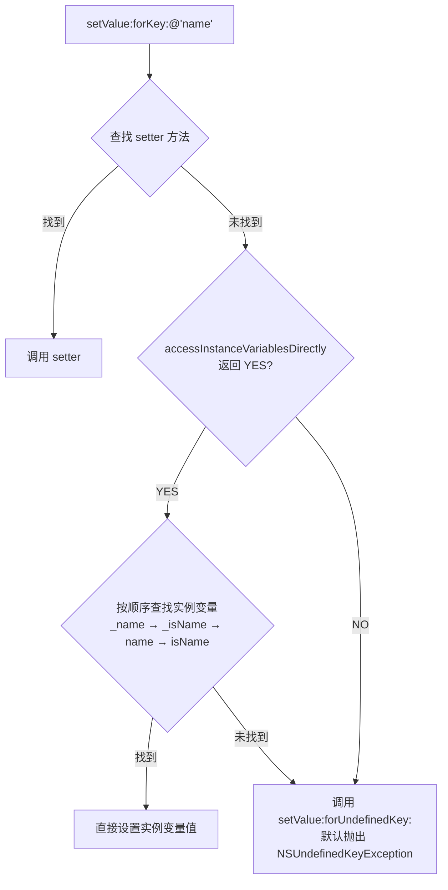
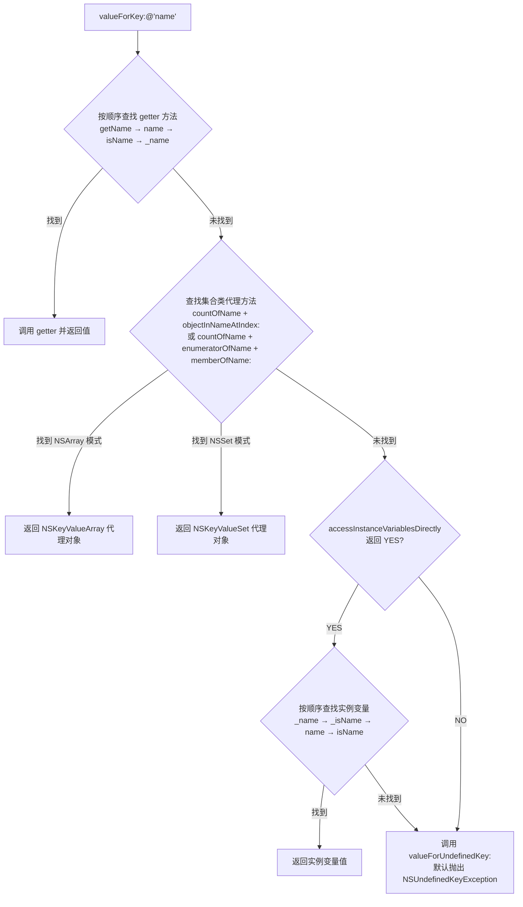

+++
title = "KVC底层原理"
date = '2026-05-02T22:32:27+08:00'
draft = false
weight = 4
tags = ["iOS", "面试", "基础"]
categories = ["iOS开发", "面试"]
+++
## 基础概念

KVC（Key-Value Coding，键值编码）是 Apple 提供的一种通过字符串 key 间接访问对象属性的机制，定义在 `NSKeyValueCoding` 协议中，`NSObject` 默认遵循该协议。

```objc
// 直接访问
person.name = @"Tom";
NSString *name = person.name;

// KVC 访问
[person setValue:@"Tom" forKey:@"name"];
NSString *name = [person valueForKey:@"name"];
```

KVC 的核心价值在于：通过字符串动态访问属性，不需要在编译期知道属性名。这使得字典转模型、序列化/反序列化、Interface Builder 的 Runtime Attributes 等场景成为可能。

## setValue:forKey: 的底层流程

当调用 `[obj setValue:value forKey:@"name"]` 时，Runtime 按照以下顺序查找：



### 第一步：查找 setter 方法

Runtime 按以下顺序查找 setter 方法：

1. `setName:`（标准 setter）
2. `_setName:`（下划线前缀 setter）

只要找到任意一个，就通过 `objc_msgSend` 调用该方法并结束。

### 第二步：检查是否允许直接访问实例变量

如果没有找到 setter 方法，Runtime 会调用类方法 `+accessInstanceVariablesDirectly`。该方法默认返回 `YES`，表示允许 KVC 直接访问实例变量。如果重写为返回 `NO`，则直接进入异常处理。

### 第三步：查找实例变量

当 `+accessInstanceVariablesDirectly` 返回 `YES` 时，Runtime 按以下顺序查找实例变量：

1. `_name`
2. `_isName`
3. `name`
4. `isName`

找到后直接通过 `object_setIvar` 设置值。如果四个都没找到，调用 `setValue:forUndefinedKey:`，默认实现抛出 `NSUndefinedKeyException`。

### 对基本类型的处理

当对基本类型（int、float、BOOL 等）的属性调用 `setValue:nil forKey:` 时，KVC 会调用 `setNilValueForKey:` 方法。默认实现抛出 `NSInvalidArgumentException`。可以重写此方法来自定义行为，如设置默认值。

```objc
- (void)setNilValueForKey:(NSString *)key {
    if ([key isEqualToString:@"age"]) {
        _age = 0;  // 设置默认值
    } else {
        [super setNilValueForKey:key];
    }
}
```

### 类型不匹配时的自动转换

`setValue:forKey:` 的 value 参数类型是 `id`，这意味着编译期不会检查 value 与属性的类型是否匹配。运行时的行为取决于具体的设值路径：

**通过 setter 方法设值时**：

- `NSNumber` → 基本类型：KVC 会根据属性的实际类型自动拆箱，调用对应的方法（如 `integerValue`、`floatValue`、`boolValue`）提取值。这也是为什么可以用 `@25` 给 `NSInteger` 类型的属性赋值。
- `NSString` → 基本类型：不会自动转换。传入 `@"25"` 给 `NSInteger` 属性，setter 接收到的是一个 `NSString` 对象的地址被当作整数解释，结果是一个无意义的大数。
- 不兼容的对象类型（如给 `NSString *` 属性传入 `NSArray *`）：赋值本身不会崩溃，因为 OC 是动态类型语言，指针赋值没有类型检查。但后续使用该属性时，如果调用了实际类型不支持的方法，会抛出 `unrecognized selector` 异常。

**通过直接设置实例变量时**：

- 对象类型的实例变量：`object_setIvar` 直接赋值指针，不做类型检查，行为与上述 setter 路径一致。
- 基本类型的实例变量：KVC 会从传入的 `NSNumber` / `NSValue` 中提取对应类型的值。如果传入的不是 `NSNumber` / `NSValue`（如传入 `NSString`），会直接崩溃。

```objc
@interface Person : NSObject
@property (nonatomic, assign) NSInteger age;
@property (nonatomic, copy) NSString *name;
@end

Person *p = [[Person alloc] init];

// NSNumber → 基本类型：自动拆箱，正常工作
[p setValue:@25 forKey:@"age"];

// 不兼容的对象类型：赋值不崩溃，使用时可能崩溃
[p setValue:@[@"a", @"b"] forKey:@"name"];
NSLog(@"%@", p.name);       // 不崩溃（NSArray 也响应 description）
NSLog(@"%lu", p.name.length); // 崩溃：NSArray 不响应 length
```

## valueForKey: 的底层流程

当调用 `[obj valueForKey:@"name"]` 时，Runtime 按照以下顺序查找：



### 第一步：查找 getter 方法

Runtime 按以下顺序查找 getter 方法：

1. `getName`
2. `name`
3. `isName`
4. `_name`

找到后通过 `objc_msgSend` 调用并返回结果。如果返回值是基本类型，会自动包装为 `NSNumber` 或 `NSValue`。

### 第二步：查找集合类代理方法

如果没有找到简单的 getter 方法，KVC 会检查是否实现了集合类代理方法。这个机制允许对象在没有声明集合属性的情况下，通过实现一组约定方法来"模拟"拥有一个数组或集合属性。KVC 会返回一个代理对象，外部对代理对象的访问会回调这些约定方法。

**NSArray 模式**：需要同时实现 `countOf<Key>` 和 `objectIn<Key>AtIndex:`（或 `<key>AtIndexes:`），KVC 返回一个 `NSKeyValueArray` 代理对象。

```objc
@implementation Library {
    NSArray *_internalBooks;
}

- (NSUInteger)countOfBooks {
    return _internalBooks.count;
}

- (id)objectInBooksAtIndex:(NSUInteger)index {
    return _internalBooks[index];
}
@end

// Library 没有 books 属性，但 KVC 检测到实现了上述两个方法
// 返回一个 NSKeyValueArray 代理对象，可以像普通数组一样使用
NSArray *books = [library valueForKey:@"books"];
NSLog(@"%lu", books.count);  // 内部调用 countOfBooks
NSLog(@"%@", books[0]);      // 内部调用 objectInBooksAtIndex:
```

**NSSet 模式**：需要同时实现 `countOf<Key>`、`enumeratorOf<Key>` 和 `memberOf<Key>:`，KVC 返回一个 `NSKeyValueSet` 代理对象。

这个机制在实际开发中较少直接使用，但它支持延迟加载和虚拟属性等场景——数据不需要一次性加载到内存，代理对象被访问时才按需获取。

### 第三步：查找实例变量

与 `setValue:forKey:` 相同，按 `_name` → `_isName` → `name` → `isName` 顺序查找。

## KeyPath 的支持

### 嵌套属性访问

KVC 支持通过 KeyPath（以 `.` 分隔的路径）访问嵌套属性：

```objc
[person valueForKeyPath:@"address.city"];
[person setValue:@"Beijing" forKeyPath:@"address.city"];
```

`valueForKeyPath:` 内部会按 `.` 分割 KeyPath，逐级调用 `valueForKey:`。以 `@"address.city"` 为例，等效于：

```objc
// valueForKeyPath:@"address.city" 等效于：
id address = [person valueForKey:@"address"];
id city = [address valueForKey:@"city"];
```

需要注意，如果中间某一级返回 `nil`，整个 KeyPath 会返回 `nil` 而不会崩溃。但对集合调用 KeyPath 时，会自动对集合中的每个元素执行该 KeyPath 并收集结果：

```objc
NSArray *people = @[person1, person2, person3];
// 对数组使用 valueForKeyPath，会对每个元素调用 valueForKeyPath:@"address.city"
// 返回 @[@"Beijing", @"Shanghai", @"Guangzhou"]
NSArray *cities = [people valueForKeyPath:@"address.city"];
```

### 集合运算符

KeyPath 支持以 `@` 开头的集合运算符，格式为 `@运算符.属性名`。集合运算符分为三类：

**简单集合运算符**：对集合中某个属性进行聚合计算，返回单个值。

```objc
NSArray *transactions = @[...]; // 每个元素有 amount 属性

[transactions valueForKeyPath:@"@count"];          // 元素个数（不需要跟属性名）
[transactions valueForKeyPath:@"@sum.amount"];     // 求和
[transactions valueForKeyPath:@"@avg.amount"];     // 平均值
[transactions valueForKeyPath:@"@max.amount"];     // 最大值
[transactions valueForKeyPath:@"@min.amount"];     // 最小值
```

**对象运算符**：对集合中的元素进行筛选或变换，返回一个数组。

```objc
// 去重：返回 amount 值不重复的数组
[transactions valueForKeyPath:@"@distinctUnionOfObjects.amount"];

// 不去重：等价于 [transactions valueForKeyPath:@"amount"]
[transactions valueForKeyPath:@"@unionOfObjects.amount"];
```

**嵌套集合运算符**：用于操作"集合的集合"（如数组中嵌套数组）的场景。

```objc
NSArray *allTransactions = @[transactions1, transactions2]; // 数组嵌套数组

// 将所有子数组的 amount 合并并去重
[allTransactions valueForKeyPath:@"@distinctUnionOfArrays.amount"];

// 将所有子数组的 amount 合并，不去重
[allTransactions valueForKeyPath:@"@unionOfArrays.amount"];
```

## Swift 中的 KVC

前面介绍的 KVC 流程完全基于 ObjC Runtime 的动态特性。在 Swift 中，KVC 分为两套机制：

### 继承 NSObject 的类：与 OC 一致

如果 Swift 类继承自 `NSObject`，并且属性标记为 `@objc dynamic`，走的就是 ObjC Runtime 的 KVC 流程，原理完全一致：

```swift
class Person: NSObject {
    @objc dynamic var name: String = ""
}

let person = Person()
person.setValue("Tom", forKey: "name")     // 走 ObjC KVC 流程
let name = person.value(forKey: "name")   // 同上
```

如果属性没有标记 `@objc dynamic`，`setValue:forKey:` 在运行时会因为找不到对应的 setter/ivar 而抛出 `NSUndefinedKeyException`。

### Swift KeyPath：编译期安全的替代方案

Swift 4 引入了类型安全的 KeyPath 系统，与 ObjC KVC 解决的问题类似（间接访问属性），但底层原理完全不同：

```swift
struct Person {
    var name: String
    var address: Address
}

let namePath = \Person.name             // 类型为 WritableKeyPath<Person, String>
let cityPath = \Person.address.city     // 支持嵌套路径

var person = Person(name: "Tom", address: Address(city: "Beijing"))
let name = person[keyPath: namePath]    // 读取："Tom"
person[keyPath: namePath] = "Jerry"     // 写入
```

Swift KeyPath 本质上是编译器在编译期将属性的访问路径编码为一个对象，运行时通过这个对象直接读写内存，不经过字符串解析和方法查找。

| 对比维度 | ObjC KVC | Swift KeyPath |
|---------|----------|---------------|
| 类型安全 | 运行时检查，key 拼错编译不报错 | 编译期检查，路径错误直接编译失败 |
| 性能 | 需要字符串解析 + 方法查找 | 编译期确定偏移量，接近直接属性访问 |
| 值类型支持 | 只支持 NSObject 子类 | 支持 struct、enum、class |
| 底层实现 | ObjC Runtime 动态派发 | 编译器生成的偏移量/闭包，无需 Runtime |

## KVC 与属性访问的对比

| 对比维度 | 属性访问（dot syntax） | KVC |
|---------|---------------------|-----|
| 类型安全 | 编译期检查 | 运行时检查，key 拼错编译不报错 |
| 性能 | 直接调用 getter/setter | 需要字符串解析和方法查找，较慢 |
| 访问控制 | 遵守访问权限 | 可以访问私有属性（通过实例变量） |
| 灵活性 | 静态，编译期确定 | 动态，运行时确定 |

## KVC 的实际应用

### 1. 字典转模型

`setValuesForKeysWithDictionary:` 内部会遍历字典的所有 key-value 对，逐个调用 `setValue:forKey:`：

```objc
@interface User : NSObject
@property (nonatomic, copy) NSString *name;
@property (nonatomic, assign) NSInteger age;
@property (nonatomic, copy) NSString *email;
@end

@implementation User

- (instancetype)initWithDictionary:(NSDictionary *)dict {
    self = [super init];
    if (self) {
        [self setValuesForKeysWithDictionary:dict];
    }
    return self;
}

// 字典中存在模型没有的 key 时，必须重写此方法避免崩溃
- (void)setValue:(id)value forUndefinedKey:(NSString *)key {
    // 可以在这里做 key 映射，比如服务端返回 "id" 映射到 "userId"
    if ([key isEqualToString:@"id"]) {
        self.userId = value;
    }
}

@end

// 使用
NSDictionary *json = @{@"name": @"Tom", @"age": @25, @"email": @"tom@example.com"};
User *user = [[User alloc] initWithDictionary:json];
```

需要注意：这种方式只能处理单层映射，嵌套对象（如 address 是一个字典）不会自动递归转换，需要手动处理。实际项目中更推荐使用 YYModel、MJExtension 等第三方库。

### 2. 访问私有属性

KVC 可以绕过访问控制，直接操作私有实例变量。这在自定义系统组件外观时非常常用：

```objc
// 修改 UITextField 的 placeholder 颜色
[textField setValue:[UIColor redColor] forKeyPath:@"placeholderLabel.textColor"];

// 修改 UIPageControl 的指示器图片（iOS 14 之前的做法）
[pageControl setValue:currentImage forKeyPath:@"_currentPageImage"];
[pageControl setValue:normalImage forKeyPath:@"_pageImage"];

// 获取 UIAlertController 内部的 _attributedTitle
[alertController setValue:attributedTitle forKey:@"attributedTitle"];
```

注意：这种用法依赖私有 API，存在以下风险：
- 可能随系统版本更新而失效（内部属性名变化或移除）
- 可能导致 App Store 审核被拒
- 没有编译期检查，key 拼写错误只会在运行时崩溃

### 3. 集合操作

配合 KeyPath 的集合运算符，可以对数组中的元素属性进行聚合计算，避免手写循环：

```objc
NSArray *transactions = @[tx1, tx2, tx3, ...]; // 每个元素有 amount 属性

NSNumber *total = [transactions valueForKeyPath:@"@sum.amount"];
NSNumber *avg   = [transactions valueForKeyPath:@"@avg.amount"];
NSNumber *max   = [transactions valueForKeyPath:@"@max.amount"];
NSNumber *count = [transactions valueForKeyPath:@"@count"];

// 获取所有不重复的 category
NSArray *categories = [transactions valueForKeyPath:@"@distinctUnionOfObjects.category"];
```

### 4. 模型转字典

`dictionaryWithValuesForKeys:` 是 `setValuesForKeysWithDictionary:` 的逆操作，内部对每个 key 调用 `valueForKey:` 并组装成字典：

```objc
NSArray *keys = @[@"name", @"age", @"email"];
NSDictionary *dict = [person dictionaryWithValuesForKeys:keys];
// dict = @{@"name": @"Tom", @"age": @25, @"email": @"tom@example.com"}
```

需要手动指定 keys 数组，如果属性值为 `nil`，字典中对应的 value 会被替换为 `NSNull`。

### 5. 批量属性修改

利用 KVC 的动态特性，可以通过循环批量修改一组属性：

```objc
NSDictionary *defaults = @{@"fontSize": @14, @"textColor": @"black", @"enabled": @YES};
for (NSString *key in defaults) {
    [config setValue:defaults[key] forKey:key];
}
```

## KVC 的异常处理

KVC 提供了两个可重写的异常处理方法：

| 方法 | 触发条件 | 默认行为 |
|-----|---------|---------|
| `setValue:forUndefinedKey:` | key 对应的属性/实例变量不存在 | 抛出 NSUndefinedKeyException |
| `valueForUndefinedKey:` | key 对应的属性/实例变量不存在 | 抛出 NSUndefinedKeyException |
| `setNilValueForKey:` | 对基本类型属性设置 nil | 抛出 NSInvalidArgumentException |

在生产环境中，推荐重写这些方法进行保护，避免因 key 拼写错误导致崩溃。

## KVC 与 KVO 的关系

KVC 是 KVO 的基础。通过 KVC 的 `setValue:forKey:` 修改属性值时，会自动触发 KVO 通知（即使直接设置实例变量也会触发）。这是因为 KVC 内部在设置值前后会自动调用 `willChangeValueForKey:` 和 `didChangeValueForKey:`。

```objc
// 通过 KVC 设置值，会自动触发 KVO
[person setValue:@"Tom" forKey:@"name"];

// 等效于：
[person willChangeValueForKey:@"name"];
person->_name = @"Tom";  // 或调用 setter
[person didChangeValueForKey:@"name"];
```

这一点对于直接设置实例变量的场景尤为重要：即使类没有定义 setter 方法，通过 KVC 设置实例变量仍会触发 KVO 通知。

## 面试题：KVC 的底层原理是什么

KVC（Key-Value Coding）是 Apple 通过 `NSKeyValueCoding` 协议提供的一种机制，允许通过字符串 key 间接访问对象属性，而不需要在编译期知道属性名。`NSObject` 默认遵循该协议，底层依赖 ObjC Runtime 的方法查找和实例变量访问能力。

### `setValue:forKey:` 的查找流程

以 `[obj setValue:@"Tom" forKey:@"name"]` 为例：

1. **查找 setter 方法**：Runtime 按 `setName:` → `_setName:` 顺序查找 setter 方法，找到任意一个就通过 `objc_msgSend` 调用并结束
2. **检查是否允许直接访问实例变量**：若没有找到 setter，调用类方法 `+accessInstanceVariablesDirectly`，默认返回 YES。若重写为 NO，直接进入步骤 4
3. **查找实例变量**：按 `_name` → `_isName` → `name` → `isName` 顺序查找实例变量，找到则通过 `object_setIvar` 直接赋值
4. **异常处理**：若以上步骤都未找到，调用 `setValue:forUndefinedKey:`，默认实现抛出 `NSUndefinedKeyException`

额外说明：对基本类型（int、float、BOOL 等）属性调用 `setValue:nil forKey:` 时，会触发 `setNilValueForKey:`，默认抛出 `NSInvalidArgumentException`。可以重写此方法设置默认值来避免崩溃。

### `valueForKey:` 的查找流程

以 `[obj valueForKey:@"name"]` 为例：

1. **查找 getter 方法**：按 `getName` → `name` → `isName` → `_name` 顺序查找 getter 方法，找到则通过 `objc_msgSend` 调用。如果返回值是基本类型，会自动包装为 `NSNumber` 或 `NSValue`
2. **查找集合类代理方法**：若没有找到 getter，检查是否实现了集合类代理方法。NSArray 模式需要同时实现 `countOfName` + `objectInNameAtIndex:`；NSSet 模式需要同时实现 `countOfName` + `enumeratorOfName` + `memberOfName:`。满足条件则返回对应的集合代理对象（`NSKeyValueArray` 或 `NSKeyValueSet`）
3. **检查是否允许直接访问实例变量**：调用 `+accessInstanceVariablesDirectly`，若返回 NO 则直接进入步骤 5
4. **查找实例变量**：按 `_name` → `_isName` → `name` → `isName` 顺序查找实例变量，找到则返回其值
5. **异常处理**：若以上步骤都未找到，调用 `valueForUndefinedKey:`，默认实现抛出 `NSUndefinedKeyException`

### Swift 中的差异

Swift 中继承 `NSObject` 且属性标记为 `@objc dynamic` 的走同样的 ObjC Runtime 流程。而 Swift 原生的 KeyPath（如 `\Person.name`）是完全不同的机制——编译期类型安全，通过编译器生成的偏移量直接读写内存，不经过字符串解析和方法查找，性能更好但失去了运行时动态性。
