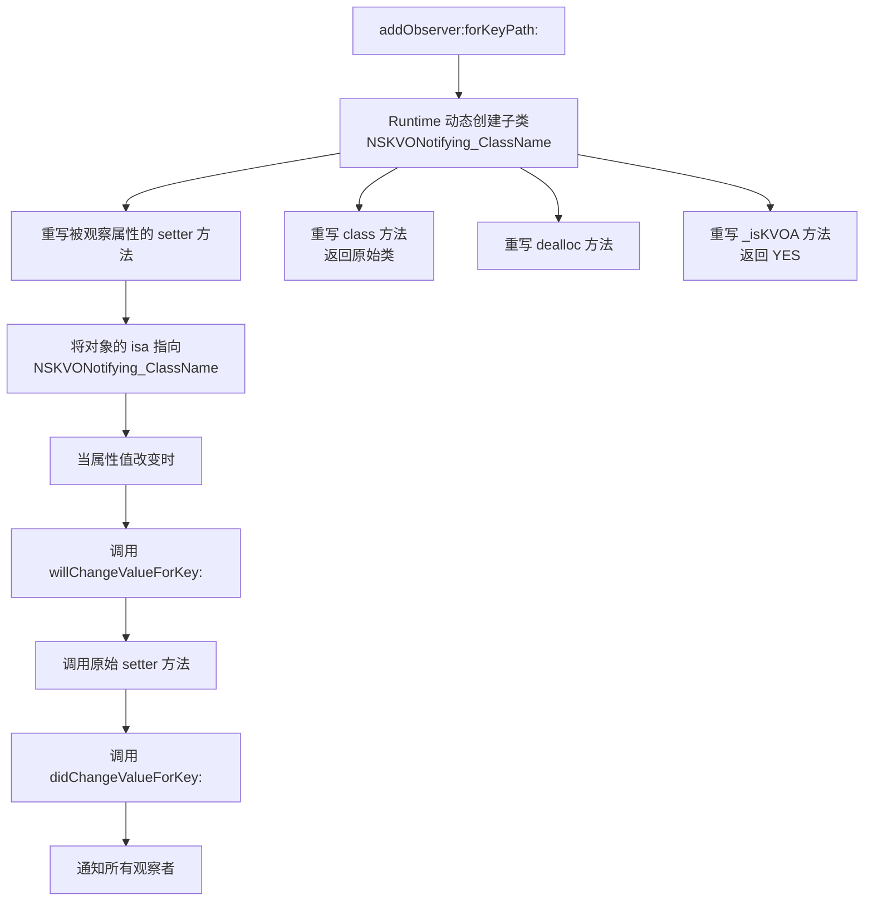

+++
title = "KVO底层原理"
date = '2026-05-02T22:32:27+08:00'
draft = false
weight = 5
tags = ["iOS", "面试", "基础"]
categories = ["iOS开发", "面试"]
+++
## 基础概念

KVO（Key-Value Observing，键值观察）是 Apple 基于 KVC 实现的一种观察者模式，允许对象监听另一个对象特定属性的变化。当被观察对象的属性值发生改变时，观察者会收到通知。

```objc
// 注册观察
[person addObserver:self
         forKeyPath:@"name"
            options:NSKeyValueObservingOptionNew | NSKeyValueObservingOptionOld
            context:nil];

// 接收通知
- (void)observeValueForKeyPath:(NSString *)keyPath
                      ofObject:(id)object
                        change:(NSDictionary<NSKeyValueChangeKey, id> *)change
                       context:(void *)context {
    if ([keyPath isEqualToString:@"name"]) {
        NSLog(@"name changed: %@ → %@", change[NSKeyValueChangeOldKey], change[NSKeyValueChangeNewKey]);
    }
}

// 移除观察
- (void)dealloc {
    [person removeObserver:self forKeyPath:@"name"];
}
```

## KVO 的底层实现原理：isa-swizzling

KVO 的核心实现机制是 **isa-swizzling**（isa 指针替换）。当对象被添加观察者时，Runtime 会在运行时动态创建该对象所属类的一个子类，并将对象的 isa 指针指向这个新的子类。

### 完整流程



### 第一步：动态创建子类

当首次对某个类的实例调用 `addObserver:forKeyPath:options:context:` 时，Runtime 会：

1. 检查是否已存在 `NSKVONotifying_ClassName` 子类，不存在则动态创建
2. 使用 `objc_allocateClassPair` 创建新类，父类为原始类
3. 使用 `objc_registerClassPair` 注册新类

```plaintext
添加观察前：
instance.isa → ClassName

添加观察后：
instance.isa → NSKVONotifying_ClassName → ClassName（superclass）
```

### 第二步：重写 setter 方法

动态子类会重写被观察属性的 setter 方法。新的 setter 实现（Foundation 框架中的 `_NSSetXXXValueAndNotify` 系列函数）的伪代码如下：

```objc
// NSKVONotifying_Person 中重写的 setName:
- (void)setName:(NSString *)name {
    [self willChangeValueForKey:@"name"];
    // 调用父类（原始类）的 setter
    [super setName:name];
    [self didChangeValueForKey:@"name"];
}
```

`didChangeValueForKey:` 内部会遍历该 key 的所有观察者，调用它们的 `observeValueForKeyPath:ofObject:change:context:` 方法。

上面的伪代码展示了重写后 setter 的逻辑流程，而实际上这个 setter 的 IMP（方法实现指针）会被替换为 Foundation 框架中预定义的 C 函数。由于不同类型的参数传递方式不同（对象通过指针传递，基本类型直接传值，结构体需要按成员传递等），Foundation 针对每种属性类型都准备了对应的内部函数：

| 属性类型 | setter 被替换为的内部函数 |
|---------|---------|
| id（对象类型） | `_NSSetObjectValueAndNotify` |
| int | `_NSSetIntValueAndNotify` |
| float | `_NSSetFloatValueAndNotify` |
| double | `_NSSetDoubleValueAndNotify` |
| BOOL | `_NSSetBoolValueAndNotify` |
| CGPoint | `_NSSetPointValueAndNotify` |
| CGSize | `_NSSetSizeValueAndNotify` |
| CGRect | `_NSSetRectValueAndNotify` |
| NSRange | `_NSSetRangeValueAndNotify` |

例如，观察 `Person` 的 `name` 属性（`NSString *` 类型）后，`NSKVONotifying_Person` 中 `setName:` 的 IMP 会指向 `_NSSetObjectValueAndNotify`；如果观察的是 `int age`，则 `setAge:` 的 IMP 会指向 `_NSSetIntValueAndNotify`。这些函数内部执行的逻辑就是上面伪代码所示的三步：`willChangeValueForKey:` → 调用原始 setter → `didChangeValueForKey:`。

#### 观察者信息的存储

每个被观察对象都有一个 `observationInfo` 属性（声明在 `NSObject` 上），它指向一个 Foundation 内部的 `NSKeyValueObservationInfo` 对象，其中维护了所有观察关系的记录。简化的内部结构如下：

```objc
@interface NSKeyValueObservationInfo : NSObject
@property (nonatomic, strong) NSArray<NSKeyValueObservance *> *observances;
@end

@interface NSKeyValueObservance : NSObject
@property (nonatomic, weak) id observer;
@property (nonatomic, copy) NSString *keyPath;
@property (nonatomic) NSKeyValueObservingOptions options;
@property (nonatomic) void *context;
@end
```

每次调用 `addObserver:forKeyPath:options:context:` 时，Foundation 会将观察者、keyPath、options、context 等信息打包为一条 `NSKeyValueObservance` 记录，存入被观察对象的 `observationInfo` 中；`removeObserver:forKeyPath:` 则从中移除对应的记录。当 `didChangeValueForKey:` 被调用时，它从 `observationInfo` 中找到该 keyPath 对应的所有观察记录，逐一回调观察者。

```objc
Person *person = [[Person alloc] init];
NSLog(@"%p", person.observationInfo); // nil（无观察者）

[person addObserver:self forKeyPath:@"name" options:0 context:nil];
NSLog(@"%@", person.observationInfo); // 输出包含观察关系的内部对象
```

### 第三步：重写 class 方法

为了对外隐藏 KVO 的实现细节，动态子类会重写 `class` 方法，使其返回原始类而非 `NSKVONotifying_` 前缀的子类：

```objc
// NSKVONotifying_Person 中重写的 class（伪代码）
- (Class)class {
    // 返回原始父类，而非 NSKVONotifying_Person
    return class_getSuperclass(object_getClass(self));
}
```

因此，调用 `[person class]` 会返回 `Person`，但通过 `object_getClass(person)` 可以获取到真实的 isa 指向 `NSKVONotifying_Person`。

```objc
Person *person = [[Person alloc] init];
[person addObserver:self forKeyPath:@"name" options:0 context:nil];

NSLog(@"%@", [person class]);              // Person（class 方法被重写）
NSLog(@"%@", object_getClass(person));     // NSKVONotifying_Person（真实 isa）
```

### 第四步：重写 dealloc 和 _isKVOA

- `dealloc`：在对象销毁时执行 KVO 相关的清理工作
- `_isKVOA`：返回 YES，标识这是一个 KVO 动态生成的类，供 Runtime 内部判断使用

## 手动触发 KVO

默认情况下，通过 setter 方法修改属性值会自动触发 KVO（自动 KVO）。也可以手动控制 KVO 的触发：

### 关闭自动 KVO

```objc
+ (BOOL)automaticallyNotifiesObserversForKey:(NSString *)key {
    if ([key isEqualToString:@"name"]) {
        return NO;  // 关闭 name 属性的自动 KVO
    }
    return [super automaticallyNotifiesObserversForKey:key];
}
```

### 手动触发

```objc
- (void)setName:(NSString *)name {
    if (![_name isEqualToString:name]) {  // 值有变化才通知
        [self willChangeValueForKey:@"name"];
        _name = name;
        [self didChangeValueForKey:@"name"];
    }
}
```

手动 KVO 的典型应用场景：
- 合并多个属性变更为一次通知，减少通知次数
- 添加条件判断，只在值真正变化时才通知
- 在非 setter 方法中修改属性时触发通知

## 直接修改实例变量能否触发 KVO？

**直接通过实例变量赋值不会触发 KVO**，因为 KVO 的通知机制依赖于 setter 方法的调用。动态子类只重写了 setter 方法，在其中插入 `willChangeValueForKey:` 和 `didChangeValueForKey:`。直接修改实例变量绕过了 setter，自然不会触发通知。

```objc
// 不会触发 KVO
person->_name = @"Tom";

// 会触发 KVO
person.name = @"Tom";       // 调用 setter
[person setName:@"Tom"];    // 调用 setter
```

但有一个例外：**通过 KVC 的 `setValue:forKey:` 修改实例变量时会触发 KVO**。即使类没有定义 setter 方法，KVC 在直接设置实例变量时也会自动调用 `willChangeValueForKey:` 和 `didChangeValueForKey:`。

```objc
// 即使没有 setter，也会触发 KVO
[person setValue:@"Tom" forKey:@"name"];
```

## KVO 的依赖键（Dependent Keys）

当一个属性的值依赖于其他属性时，可以通过 `keyPathsForValuesAffectingValueForKey:` 或 `keyPathsForValuesAffecting<Key>` 声明依赖关系，使得被依赖的属性变化时自动触发当前属性的 KVO 通知。

```objc
// fullName 依赖于 firstName 和 lastName
+ (NSSet<NSString *> *)keyPathsForValuesAffectingFullName {
    return [NSSet setWithObjects:@"firstName", @"lastName", nil];
}

- (NSString *)fullName {
    return [NSString stringWithFormat:@"%@ %@", self.firstName, self.lastName];
}
```

当 `firstName` 或 `lastName` 改变时，观察 `fullName` 的观察者也会收到通知。

## KVO 的集合观察

对 NSArray、NSSet 等集合属性进行 KVO 观察时，直接操作集合对象（如 `[array addObject:]`）不会触发 KVO。需要通过 KVC 提供的集合代理方法来触发：

```objc
// 不会触发 KVO
[self.items addObject:newItem];

// 会触发 KVO
[[self mutableArrayValueForKey:@"items"] addObject:newItem];
```

`mutableArrayValueForKey:` 返回的是一个代理数组，对它的操作会自动包裹在 `willChange:valuesAtIndexes:forKey:` 和 `didChange:valuesAtIndexes:forKey:` 之间，从而触发 KVO 通知并携带精确的变更信息（插入、删除、替换及对应的索引）。

## KVO 的注意事项

### 1. 必须移除观察者

观察者被销毁前必须调用 `removeObserver:forKeyPath:`，否则被观察对象在属性变化时会向已释放的观察者发送消息，导致野指针崩溃。

```objc
- (void)dealloc {
    [_person removeObserver:self forKeyPath:@"name"];
}
```

### 2. 不能重复移除

对同一个 keyPath 调用多次 `removeObserver:` 会抛出异常。建议使用标志位或 `@try/@catch` 保护。

### 3. 缺乏类型安全

KVO 的 keyPath 是字符串，拼写错误不会有编译期警告。可以使用 `NSStringFromSelector(@selector(name))` 或 Swift 的 `#keyPath()` 来提高安全性。

### 4. context 参数的正确使用

当父类和子类同时观察相同 keyPath 时，应使用 context 来区分通知：

```objc
static void *MyContext = &MyContext;

[person addObserver:self forKeyPath:@"name" options:0 context:MyContext];

- (void)observeValueForKeyPath:(NSString *)keyPath
                      ofObject:(id)object
                        change:(NSDictionary *)change
                       context:(void *)context {
    if (context == MyContext) {
        // 处理自己的观察
    } else {
        [super observeValueForKeyPath:keyPath ofObject:object change:change context:context];
    }
}
```

### 5. 线程安全

KVO 的通知是在属性变化所在的线程上同步发送的，不一定在主线程。如果在通知回调中更新 UI，需要手动切换到主线程。


## Swift 中的 KVO

在 Swift 中使用 KVO 需要满足以下条件：

1. 被观察的类必须继承自 `NSObject`
2. 被观察的属性必须标记为 `@objc dynamic`

```swift
class Person: NSObject {
    @objc dynamic var name: String = ""
}

// 使用 block-based API（推荐）
let observation = person.observe(\.name, options: [.new, .old]) { person, change in
    print("name changed: \(change.oldValue ?? "") → \(change.newValue ?? "")")
}

// observation 被销毁时自动移除观察，无需手动 removeObserver
```

Swift 的 block-based KVO API 相比 Objective-C 有几个优势：
- 使用 `\keyPath` 语法，编译期检查 keyPath 的有效性
- 返回 `NSKeyValueObservation` 对象，持有该对象即保持观察，释放后自动移除
- 无需重写 `observeValueForKeyPath:` 方法，避免集中处理多个观察的 if-else 逻辑

纯 Swift 类（不继承 NSObject）不支持 KVO，因为 KVO 依赖 Objective-C Runtime 的 isa-swizzling 机制。对于纯 Swift 场景，推荐使用 Combine 框架的 `@Published` 或 Swift Observation 框架（iOS 17+）的 `@Observable` 来替代 KVO。

## 常见面试题

### KVO 的底层原理是什么？

KVO 的底层实现基于 **isa-swizzling** 机制。

**1. 动态创建子类**

当对某个对象调用 `addObserver:forKeyPath:options:context:` 时，Runtime 会检查是否已存在 `NSKVONotifying_ClassName` 子类，不存在则通过 `objc_allocateClassPair` 动态创建，并通过 `objc_registerClassPair` 注册。随后将对象的 **isa 指针**指向这个新的子类。

```plaintext
添加观察前：instance.isa → ClassName
添加观察后：instance.isa → NSKVONotifying_ClassName → ClassName（superclass）
```

**2. 重写 setter 方法**

动态子类会重写被观察属性的 setter 方法，将 setter 的 IMP 替换为 Foundation 内部的 `_NSSetXXXValueAndNotify` 系列函数。Foundation 根据属性类型选择对应的函数，例如对象类型用 `_NSSetObjectValueAndNotify`，int 用 `_NSSetIntValueAndNotify` 等。重写后的 setter 执行逻辑如下：

```objc
- (void)setName:(NSString *)name {
    [self willChangeValueForKey:@"name"];
    [super setName:name];  // 调用原始 setter
    [self didChangeValueForKey:@"name"];
}
```

**3. 观察者的存储与通知**

观察者信息存储在被观察对象的 `observationInfo` 属性中（声明在 `NSObject` 上）。它指向 Foundation 内部的 `NSKeyValueObservationInfo` 对象，其中维护了一组 `NSKeyValueObservance` 记录，每条记录包含 observer、keyPath、options、context。每次 `addObserver:` 时添加记录，`removeObserver:` 时移除记录。当 `didChangeValueForKey:` 被调用时，从 `observationInfo` 中找到该 keyPath 的所有观察记录，逐一调用观察者的 `observeValueForKeyPath:ofObject:change:context:` 完成通知。

**4. 重写辅助方法**

- **重写 `class` 方法**：返回原始父类而非 `NSKVONotifying_` 前缀的子类，对外隐藏 KVO 实现细节。因此 `[person class]` 返回 `Person`，但 `object_getClass(person)` 能获取到真实的 `NSKVONotifying_Person`
- **重写 `dealloc`**：在对象销毁时执行 KVO 相关的清理工作
- **重写 `_isKVOA`**：返回 YES，供 Runtime 内部判断这是 KVO 动态生成的类

**补充要点：**

- 直接修改实例变量（`person->_name = @"Tom"`）**不会**触发 KVO，因为绕过了 setter。但通过 KVC 的 `setValue:forKey:` 修改即使没有 setter 也会触发，因为 KVC 内部会自动调用 `willChangeValueForKey:` 和 `didChangeValueForKey:`
- 可以通过重写 `automaticallyNotifiesObserversForKey:` 返回 NO 来关闭自动 KVO，改为手动调用 `willChangeValueForKey:` / `didChangeValueForKey:` 控制通知时机，典型场景如合并多次变更为一次通知、添加条件判断只在值真正变化时才通知
- 集合类型属性（NSArray、NSSet 等）直接操作不会触发 KVO，需要通过NSObject上声明的 `mutableArrayValueForKey:` 等代理方法操作，代理方法会自动包裹 `willChange:valuesAtIndexes:forKey:` 和 `didChange:valuesAtIndexes:forKey:` 来触发通知
