+++
title = "Mach-O的链接、装载与库"
date = '2026-05-02T22:32:27+08:00'
draft = false
weight = 6
tags = ["iOS", "面试", "基础"]
categories = ["iOS开发", "面试"]
+++
本文深入介绍iOS/macOS开发中的Mach-O文件格式、动态库与静态库，帮助理解程序的链接、装载过程，以及Rebase/Bind的底层原理。

---

## 一、基础概念

在深入学习之前，先了解几个核心概念。

### 1.0 从源代码到可执行文件

一段源代码要变成可执行文件，需要经历以下几个阶段：

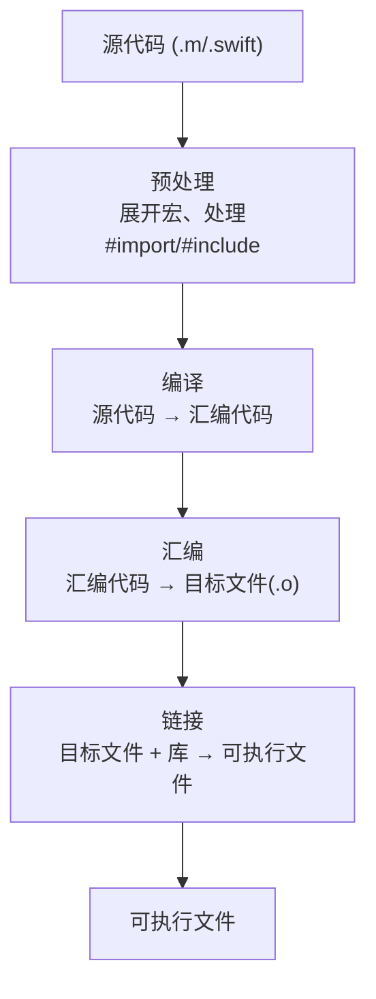

### 1.1 什么是符号（Symbol）

符号是程序中函数、变量、类等实体的**名称标识**。当你写下一个函数调用时，编译器需要知道这个函数在哪里，符号就是用来定位它的。

```objc
// 这段代码中包含多个符号
void myFunction(void) {           // 定义了符号 _myFunction
    NSLog(@"Hello");              // 引用了外部符号 _NSLog
}

int globalVar = 10;               // 定义了符号 _globalVar
```

符号分为两类：
- **已定义符号**：在当前编译单元（即当前源文件编译生成的.o文件）中有具体代码或数据定义的符号（如上例中的 `_myFunction` 和 `_globalVar`）
- **未定义符号**：当前编译单元只是引用，实际定义在其他编译单元或库中的符号（如上例中的 `_NSLog`），需要在链接时解析

### 1.2 什么是链接（Linking）

链接是将多个编译后的目标文件（.o）组合成一个可执行文件的过程。链接器的核心工作是**符号解析**——把所有"未定义符号"与其他编译单元中的"已定义符号"关联起来。

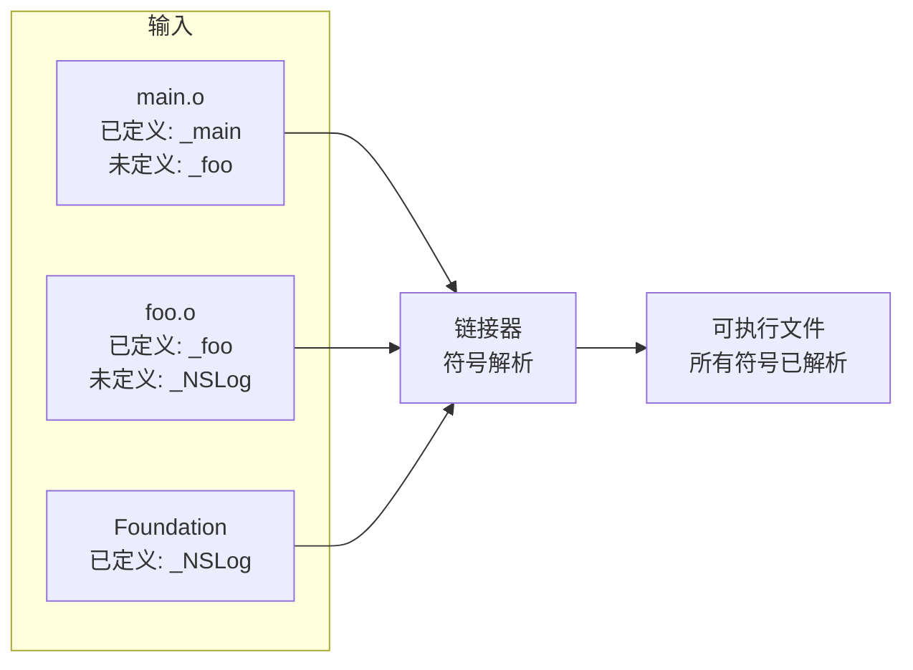

#### 符号解析的过程

链接器会遍历所有输入的目标文件和库，执行以下步骤：

1. **收集符号信息**：扫描每个.o文件的符号表，记录所有已定义符号和未定义符号
2. **匹配符号**：对于每个未定义符号，在其他编译单元或库中查找同名的已定义符号
3. **记录引用关系**：建立符号引用与符号定义之间的对应关系
4. **检查错误**：
   - 如果某个未定义符号找不到定义 → **链接错误**：`Undefined symbol: _xxx`
   - 如果同一个符号有多个定义 → **链接错误**：`Duplicate symbol: _xxx`

```bash
# 常见的链接错误示例
Undefined symbols for architecture arm64:
  "_myFunction", referenced from:
      _main in main.o
ld: symbol(s) not found for architecture arm64

duplicate symbol '_globalVar' in:
    foo.o
    bar.o
```

符号解析完成后，链接器知道了每个符号引用应该指向哪个地址，接下来需要将地址信息写入代码中：

- **静态链接**：执行[重定位（Relocation）](#33-静态链接中的重定位relocation)，直接将地址写入可执行文件
- **动态链接**：记录符号引用信息，运行时由 dyld 执行 [Bind](#43-rebase-与-bind) 操作填入实际地址

### 1.3 静态链接 vs 动态链接

链接有两种方式，它们的核心区别在于**何时**将库的代码合并到可执行文件中：

| 特性 | 静态链接 | 动态链接 |
|-----|---------|---------|
| 链接时机 | 编译时 | 运行时 |
| 代码位置 | 复制到可执行文件中 | 保留在独立的库文件中 |
| 文件体积 | 较大 | 较小 |
| 内存占用 | 每个程序各有一份 | 多个程序共享一份 |
| 更新方式 | 需重新编译 | 替换库文件即可 |

---

## 二、Mach-O 文件格式

无论是可执行文件、动态库还是静态库中的目标文件，都是Mach-O格式。

### 2.1 什么是Mach-O

Mach-O（Mach Object）是Apple平台的可执行文件格式，类似于Windows的PE格式和Linux的ELF格式。

```bash
# 查看文件类型
$ file /bin/ls
/bin/ls: Mach-O universal binary with 2 architectures

# 常见的Mach-O类型
MH_EXECUTE    # 可执行文件（App的主二进制）
MH_DYLIB      # 动态库（.dylib, .framework）
MH_OBJECT     # 目标文件（.o，静态库中的单元）
MH_BUNDLE     # Bundle（插件）
```

### 2.2 Mach-O 的结构

Mach-O文件由三部分组成：

```plaintext
┌──────────────────────────┐
│           Header         │  ← 文件的"身份证"
├──────────────────────────┤
│       Load Commands      │  ← 文件的"目录"
├──────────────────────────┤
│            Data          │  ← 实际的代码和数据
└──────────────────────────┘
```

**Header（头部）**：描述文件的基本信息

```c
struct mach_header_64 {
    uint32_t      magic;         // 魔数，标识文件格式
    cpu_type_t    cputype;       // CPU类型：ARM64, X86_64
    uint32_t      filetype;      // 文件类型：可执行文件、动态库等
    uint32_t      ncmds;         // Load Commands的数量
    // ...
};
```

**Load Commands（加载命令）**：描述文件的布局和依赖关系

```plaintext
Load Commands 示例：
├── LC_SEGMENT_64 (__TEXT)      → 代码段的位置和大小
├── LC_SEGMENT_64 (__DATA)      → 数据段的位置和大小
├── LC_LOAD_DYLIB (Foundation)  → 依赖Foundation框架
├── LC_LOAD_DYLIB (UIKit)       → 依赖UIKit框架
└── LC_SYMTAB                   → 符号表的位置
```

**Data（数据区）**：实际存储代码和数据，按Segment和Section组织

### 2.3 Segment 详解

#### Segment 与 Section 的关系

Segment（段）和 Section（节）是 Mach-O 中组织数据的两级结构：

```plaintext
Mach-O Data 区组织结构

┌─────────────────────────────────────────────────────────┐
│                     Segment（段）                        │
│  - 是内存映射的基本单位                                    │
│  - 定义内存保护属性（可读/可写/可执行）                      │
│  - 页对齐（通常 16KB）                                    │
│                                                        │
│  ┌─────────────────────────────────────────────────┐   │
│  │               Section（节）                      │   │
│  │  - 是数据组织的逻辑单位                            │   │
│  │  - 同一 Segment 内的多个 Section 共享内存属性       │   │
│  │  - 存放特定类型的数据                              │   │
│  └─────────────────────────────────────────────────┘   │
└────────────────────────────────────────────────────────┘
```

以 `__TEXT` Segment 为例：

```plaintext
__TEXT Segment（可读、可执行）
│
├── __text Section      ← 编译后的机器码
├── __stubs Section     ← 动态库调用桩
├── __cstring Section   ← C字符串常量
└── __const Section     ← 常量数据

所有这些 Section 都继承 __TEXT 的权限：可读、可执行、不可写
```

**为什么需要这种两级结构？**

| 层级 | 作用 | 示例 |
|------|------|------|
| Segment | 内存管理单位，定义权限和映射方式 | `__TEXT` 设置为可执行，`__DATA` 设置为可写 |
| Section | 逻辑组织单位，区分不同类型的数据 | 将方法名（`__objc_methname`）和机器码（`__text`）分开存放 |

这种设计使得：
- **安全性**：操作系统可以按 Segment 设置内存保护，防止代码被修改（W^X 原则）
- **灵活性**：链接器可以按 Section 精细操作，如合并多个目标文件的同名 Section
- **效率**：运行时只需按 Segment 映射，无需处理每个 Section 的权限

#### 常见的 Segment

Mach-O中常见的Segment有以下几种：

| Segment | 权限 | 说明 |
|---------|------|------|
| __PAGEZERO | 不可访问 | 空指针陷阱区，捕获NULL指针访问 |
| __TEXT | 可读、可执行 | 代码和只读数据 |
| __DATA | 可读、可写 | 可读写数据 |
| __DATA_CONST | 可读、可写→只读（动态变化） | 运行时常量数据（iOS 13+） |
| __DATA_DIRTY | 可读、可写 | 一定会被修改的数据（iOS 13+） |
| __LINKEDIT | 可读 | 链接器使用的信息 |

**__PAGEZERO**：位于虚拟地址空间的最开始（地址0x0），是一个**不可读、不可写、不可执行**的特殊段。在64位系统上，其大小通常为4GB（0x100000000字节）。

这个段的核心作用是**捕获空指针访问**。由于C/Objective-C中NULL指针的值为0，任何对NULL指针的解引用操作都会访问到这个范围内的地址。因为__PAGEZERO被标记为不可访问，操作系统会立即产生段错误（SIGSEGV/EXC_BAD_ACCESS），而不是让程序继续执行产生不可预知的行为。

```objc
// 以下代码都会因访问__PAGEZERO而崩溃
NSString *str = nil;
NSLog(@"%c", str[0]);      // 访问地址0x0，崩溃

int *ptr = NULL;
*ptr = 42;                  // 写入地址0x0，崩溃

// 即使偏移一定量，仍在4GB范围内
char *p = (char *)0x1000;
*p = 'a';                   // 访问地址0x1000，仍在__PAGEZERO范围内，崩溃
```

**__TEXT**：存放代码和只读数据

```plaintext
__TEXT Segment（可读、可执行）
├── __text           编译后的机器码（ObjC和Swift）
├── __stubs          动态库函数调用的桩代码
├── __stub_helper    辅助延迟绑定的代码
├── __cstring        C字符串常量 "Hello World"
├── __const          const修饰的常量数据
│
├── [ObjC相关]
│   ├── __objc_methname  ObjC方法名 "viewDidLoad"
│   ├── __objc_classname ObjC类名 "UIViewController"
│   └── __objc_methtype  方法类型编码 "v@:"
│
└── [Swift相关]
    ├── __swift5_typeref  Swift类型引用（mangled名称字符串）
    ├── __swift5_reflstr  Swift反射字符串（属性名、枚举case名）
    └── __swift5_entry    Swift入口点信息
```

**__DATA系列**：存放可读写数据。iOS 13+对__DATA进行了细分以优化内存：

```plaintext
__DATA_CONST（可读写→只读，启动后变为只读）
├── __got              非延迟绑定的符号指针
├── __const            运行时确定的常量
│
├── [ObjC相关]
│   ├── __objc_classlist   ObjC类列表指针
│   ├── __objc_protolist   ObjC协议列表指针
│   └── __objc_imageinfo   ObjC镜像信息
│
└── [Swift相关]
    ├── __swift5_proto     Swift协议描述符
    └── __swift5_types     Swift类型描述符（struct/class/enum元数据）

__DATA（可读写）
├── __la_symbol_ptr    延迟绑定的符号指针
├── __data             已初始化的全局/静态变量
├── __bss              未初始化的全局/静态变量
├── __common           未初始化的外部全局变量
│
├── [ObjC相关]
│   └── __objc_ivar        ObjC实例变量
│
└── [Swift相关]
    ├── __swift5_fieldmd   Swift字段元数据（属性类型和偏移）
    ├── __swift5_assocty   Swift关联类型信息
    └── __swift5_protos    Swift协议一致性记录

__DATA_DIRTY（一定会被写入的数据）
└── 运行时一定会修改的数据，单独分页以优化COW
```

**__LINKEDIT**：存放静态链接器（ld）和动态链接器（dyld）使用的元信息

```plaintext
__LINKEDIT Segment（只读）
├── 符号表 (Symbol Table)      函数、变量的名称和地址
├── 字符串表 (String Table)    符号名称的字符串
├── 间接符号表                  用于动态链接
├── 重定位信息                  Rebase/Bind需要的信息
├── 代码签名                    Code Signature
└── 函数起始地址表              用于栈回溯
```

### 2.4 为什么iOS 13+要拆分__DATA？

传统的__DATA段混合了"启动后不再修改的数据"和"运行时会修改的数据"。

**优化前（iOS 13之前）：**

```plaintext
__DATA段（整个段都是可读写的）
├── __got              ← 启动时写入一次，之后不变
├── __objc_classlist   ← 启动时写入一次，之后不变
├── __la_symbol_ptr    ← 运行时可能修改
└── __data             ← 运行时可能修改

问题：整个__DATA段都不能在进程间共享
```

**优化后（iOS 13+）：**

```plaintext
__DATA_CONST（启动后变为只读）
├── __got              可以在多进程间共享
└── __objc_classlist   可以在多进程间共享

__DATA（保持可读写）
├── __la_symbol_ptr
└── __data
```

这样`__DATA_CONST`在启动完成后可以被多个进程共享，减少内存占用。

### 2.5 查看Mach-O信息

```bash
# 查看依赖的动态库
$ otool -L MyApp
MyApp:
    /System/Library/Frameworks/Foundation.framework/Foundation
    /System/Library/Frameworks/UIKit.framework/UIKit
    /usr/lib/libobjc.A.dylib

# 查看Load Commands
$ otool -l MyApp

# 查看符号表
$ nm -m MyApp
(undefined) external _NSLog              # 未定义，需要从Foundation导入
(__TEXT,__text) external _main           # 已定义，在代码段
```

---

## 三、静态库（Static Library）

### 3.1 什么是静态库

静态库是**目标文件（.o）的打包集合**。在链接阶段，链接器从静态库中提取需要的目标文件，将代码**复制**到最终的可执行文件中。

iOS/macOS中静态库的形式：
- `.a` 文件：传统的静态库格式（Archive）
- `.framework`：静态库形式的Framework
- `.xcframework`：支持多平台多架构的现代分发格式（详见[6.5 XCFramework](#65-xcframework)）

```bash
# 静态库本质是.o文件的归档
$ ar -t libMyStatic.a
MyClass.o
MyHelper.o
MyUtils.o
```

### 3.2 静态库的链接过程

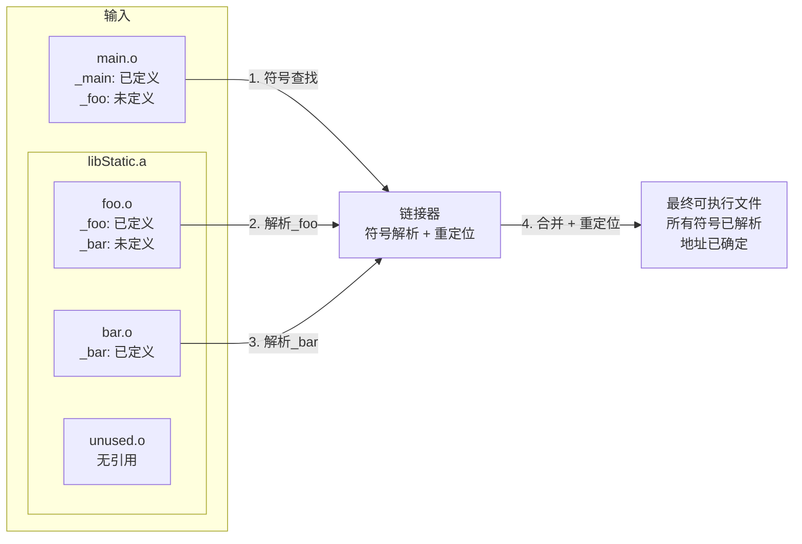

关键点：
- 静态库的代码在**编译时**就被复制到可执行文件中
- 只有被引用的目标文件才会被链接，未使用的不会增加体积
- 链接完成后，运行时不再需要静态库文件

### 3.3 静态链接中的重定位（Relocation）

在静态链接过程中，链接器除了符号解析，还需要执行**重定位（Relocation）**操作。

#### 为什么需要重定位？

每个.o文件在编译时都假设自己的代码从地址0开始。当多个.o文件合并成一个可执行文件时，它们会被放置在不同的地址位置，因此需要修正代码中的地址引用。

```plaintext
编译时（各自从0开始）：

main.o:                    foo.o:
0x0000: _main              0x0000: _foo
0x0020: call _foo          0x0010: call _bar
        ↓ 指向0x????               ↓ 指向0x????

链接后（合并到统一地址空间）：

可执行文件:
0x1000: _main
0x1020: call _foo  → 修正为 call 0x2000
        ...
0x2000: _foo
0x2010: call _bar  → 修正为 call 0x2100
        ...
0x2100: _bar
```

### 3.4 静态库的优缺点

| 优点 | 缺点 |
|-----|------|
| 运行时无需额外加载，启动快 | 增大可执行文件体积 |
| 部署简单，无依赖问题 | 多个App使用同一库会重复占用磁盘和内存 |
| 支持链接时优化（LTO） | 更新库需要重新编译整个App |

### 3.5 创建和使用静态库

```bash
# 1. 编译源文件为目标文件
clang -c MyClass.m -o MyClass.o

# 2. 打包为静态库
ar rcs libMyStatic.a MyClass.o MyHelper.o

# 3. 链接静态库
clang main.m -L. -lMyStatic -o main
```

---

## 四、动态库与运行时加载

### 4.1 什么是动态库

动态库是在**程序运行时**才被加载的库。与静态库不同，动态库的代码不会被复制到可执行文件中，而是保持独立，在运行时由动态链接器（dyld）加载。

iOS/macOS中动态库的形式：
- `.dylib` 文件：动态链接库
- `.framework`：动态库形式的Framework
- `.xcframework`：支持多平台多架构的现代分发格式（详见[6.5 XCFramework](#65-xcframework)）
- `.tbd` 文件：动态库的文本存根（仅包含符号信息，用于编译）

### 4.2 ASLR 与地址修正

在理解动态库加载之前，需要先理解一个关键问题：程序中的指针地址是如何确定的？

#### 什么是ASLR

ASLR（Address Space Layout Randomization，地址空间布局随机化）是一种安全机制。每次程序启动时，系统会随机选择一个基地址来加载程序，防止攻击者预测代码位置。

```plaintext
编译时假设的基地址：0x100000000

第一次运行：实际加载地址 = 0x100000000 + 0x5000 (随机偏移)
第二次运行：实际加载地址 = 0x100000000 + 0x8000 (不同的随机偏移)
```

这个随机偏移量称为**slide**。

由于ASLR，编译时写入Mach-O文件的指针地址在运行时是错误的：

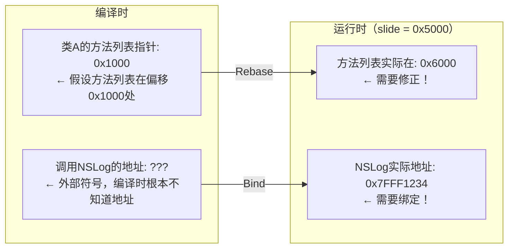

### 4.3 Rebase 与 Bind

dyld（动态链接器）在加载程序时会执行两种地址修正操作：

#### Rebase（重定位）

Rebase 修正指向**Mach-O内部**的指针。这些指针在编译时被写入一个假设的基地址（如0x100000000），但由于ASLR，实际加载地址会有一个随机偏移（slide），因此需要将所有内部指针加上这个偏移值。

**需要Rebase的指针类型：**

```plaintext
- ObjC类的方法列表指针（指向__TEXT段的方法名）
- ObjC类的父类指针（指向父类的Class结构）
- 全局变量的初始化指针（如 NSString *str = @"hello" 中的字符串地址）
- Block的函数指针（指向Block的invoke函数）
- C++虚函数表指针
- Swift类型的元数据指针
```

**Rebase的计算方式：**

```plaintext
实际地址 = 编译时地址 + slide

示例：
编译时假设基地址: 0x100000000
实际加载基地址:   0x100005000  (slide = 0x5000)

某ObjC类的方法列表指针:
  编译时值: 0x100001000
  Rebase后: 0x100001000 + 0x5000 = 0x100006000
```

#### Bind（绑定）

Bind 修正指向**Mach-O外部**（其他动态库）的指针。这些外部符号的地址在编译时是未知的，只记录了符号名称，需要在运行时由dyld查找符号表来确定实际地址。

**需要Bind的指针类型：**

```plaintext
- 调用系统函数的指针（_NSLog, _objc_msgSend, _malloc, _dispatch_async）
- 引用系统类的指针（_OBJC_CLASS_$_NSObject, _OBJC_CLASS_$_UIView）
- 引用其他动态库中全局变量的指针
- Swift标准库函数的指针
```

**Bind的解析过程：**

```plaintext
1. dyld读取Mach-O中的绑定信息，获取符号名（如"_NSLog"）和目标库（如Foundation）
2. 在目标库的符号表中查找该符号的地址
3. 将找到的地址写入对应的指针位置（通常在__DATA段的__got或__la_symbol_ptr）

示例：
符号名: _NSLog
目标库: Foundation
查找结果: 0x7FFF20123456
写入位置: __DATA,__got 中的 _NSLog 条目
```

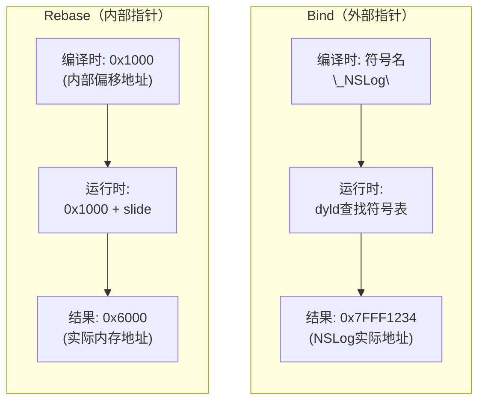

#### Rebase/Bind vs 静态链接重定位

前面在[3.3 静态链接中的重定位](#33-静态链接中的重定位relocation)中介绍了静态链接时的重定位，这里对比一下两者的区别：

| 特性 | 重定位（Relocation） | Rebase/Bind |
|-----|---------------------|-------------|
| 执行时机 | 编译时（静态链接） | 运行时（动态链接） |
| 执行者 | 静态链接器（ld） | 动态链接器（dyld） |
| 修正内容 | .o文件合并时的地址引用 | ASLR偏移和外部符号地址 |
| 结果持久性 | 写入最终可执行文件 | 每次启动都要执行 |

静态链接的重定位是**一次性**的，完成后地址就固定在可执行文件中。而Rebase/Bind是**每次启动**都要执行的，因为ASLR每次都会产生不同的随机偏移。

#### Lazy Binding（延迟绑定）

为了加快启动速度，大部分外部函数符号使用延迟绑定——只在**首次调用时**才解析地址：

**首次调用NSLog的流程：**

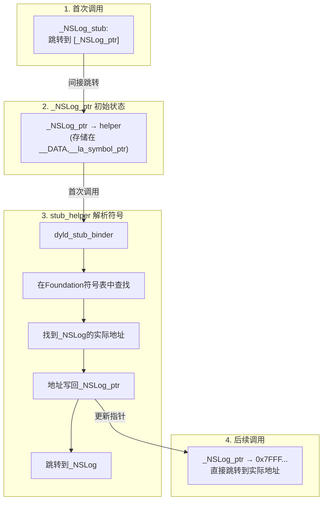

#### 查看Rebase/Bind信息

```bash
# 查看Rebase信息
$ xcrun dyldinfo -rebase MyApp
rebase information:
segment  section          address     type
__DATA   __objc_classlist 0x100008000 pointer
__DATA   __data           0x100008020 pointer

# 查看Bind信息
$ xcrun dyldinfo -bind MyApp
bind information:
segment  section  address        dylib       symbol
__DATA   __got    0x100008000    libSystem   _malloc
__DATA   __got    0x100008008    libobjc     _objc_msgSend

# 查看Lazy Bind信息
$ xcrun dyldinfo -lazy_bind MyApp
lazy binding information:
segment  section          address        dylib       symbol
__DATA   __la_symbol_ptr  0x100008100    Foundation  _NSLog
```

### 4.4 dyld 加载流程

现在我们可以完整理解App启动时dyld的工作流程（更详细的启动流程分析请参考[App启动流程](./App启动流程.md)）：

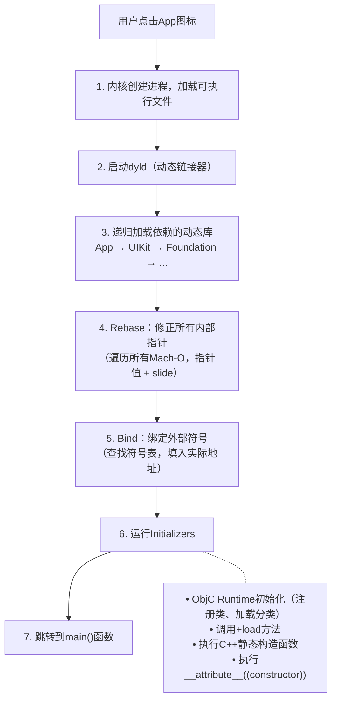

#### dyld 版本演进

**dyld 3（iOS 13+）引入Launch Closure：**

Launch Closure 将解析 Mach-O 元数据的结果缓存起来，避免每次启动都重复解析。

```plaintext
缓存的内容（与slide无关）：
├── 需要Rebase的指针位置列表
├── 需要Bind的符号及其目标位置
├── 依赖库的加载顺序
└── Initializer的调用顺序

不缓存的内容：
├── slide值（每次启动由ASLR随机生成）
└── 最终的指针地址值
```

```plaintext
首次启动：解析Mach-O → 分析Rebase/Bind位置 → 缓存到磁盘 → 执行Rebase/Bind
后续启动：读取缓存 → 跳过解析步骤 → 直接执行Rebase/Bind（更快）
```

注意：Launch Closure 优化的是**解析元数据的开销**，Rebase/Bind 操作本身仍然需要执行，因为 slide 每次启动都不同。

**dyld 4（iOS 15+）引入Chained Fixups：**

Chained Fixups 是一种更高效的地址修正方案，改变了 Rebase/Bind 信息的存储和处理方式。

**传统Fixup的工作方式：**

在传统方式中，`__LINKEDIT` 段存储了所有需要修正的地址列表：

```plaintext
__LINKEDIT段中的Rebase信息：
┌─────────────────────────────────────────────────┐
│ 位置1: 0x8000  │ 位置2: 0x8008  │ 位置3: 0x8010 │ ...
└─────────────────────────────────────────────────┘
        ↓               ↓               ↓
     需要Rebase      需要Rebase      需要Rebase

dyld启动时：
1. 读取__LINKEDIT中的地址列表
2. 跳转到0x8000，执行 *0x8000 += slide
3. 跳转到0x8008，执行 *0x8008 += slide
4. 跳转到0x8010，执行 *0x8010 += slide
... 重复数千次
```

**传统方式的问题：**

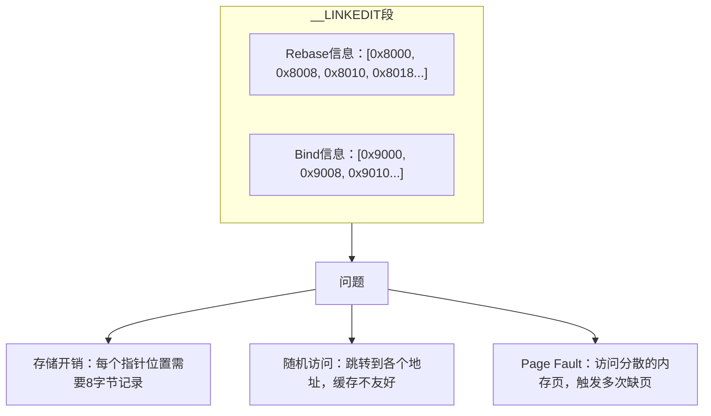

**Chained Fixups的核心思想：**

将修正信息直接**编码在指针值本身**中，指针之间通过 `next` 字段形成链表，不再需要单独的地址列表。

```plaintext
传统方式：
__LINKEDIT: [0x8000, 0x8008, 0x8010]  ← 单独存储位置列表
__DATA:     [指针A] [指针B] [指针C]    ← 实际指针值

Chained Fixups：
__LINKEDIT: [链表起始位置: 0x8000]    ← 只需记录起点
__DATA:     [指针A|next=2] [指针B|next=2] [指针C|next=0]
                   ↓              ↓              ↓
                 +8字节         +8字节           结束
```

**链表结构示意：**

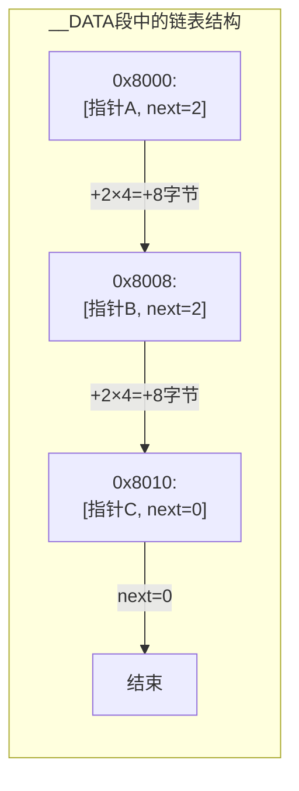

dyld 只需要知道链表的起始位置（0x8000），然后顺序遍历：`0x8000 → 0x8008 → 0x8010 → 结束`

**Chained Fixups的处理流程：**

```plaintext
1. dyld读取链表起始位置（从__LINKEDIT的少量元数据中获取）
2. 从起始位置开始遍历：
   a. 读取当前指针值
   b. 解析bind标志：
      - bind=0: 执行Rebase，新值 = target + slide
      - bind=1: 执行Bind，新值 = 符号表[ordinal]的地址
   c. 解析next字段，跳转到下一个指针
   d. 重复直到next=0
3. 所有修正完成
```

**Chained Fixups的优势：**

| 方面 | 传统方式 | Chained Fixups |
|-----|---------|----------------|
| 存储空间 | 每个指针位置需要8字节记录 | 信息编码在指针高位，几乎无额外开销 |
| 访问模式 | 随机跳转到各个地址 | 顺序遍历链表，CPU缓存友好 |
| __LINKEDIT大小 | 存储完整地址列表 | 只需存储少量元数据 |
| Page Fault | 访问分散，可能触发多次缺页 | 顺序访问，减少缺页中断 |
| Rebase/Bind区分 | 分开存储和处理 | 统一处理，通过bind标志区分 |

**实际效果：**

- 减少约5-15%的 `__LINKEDIT` 段大小
- 顺序访问内存，提升 CPU 缓存命中率
- 减少 Page Fault 次数，提升 Rebase/Bind 阶段的执行速度
- 对于大型 App（指针数量多）效果更明显

### 4.5 动态库的优缺点

| 优点 | 缺点 |
|-----|------|
| 减小可执行文件体积 | 运行时需要加载，增加启动时间 |
| 多个程序共享同一份代码和内存 | 需要处理版本兼容性 |
| 可独立更新，无需重新编译App | 部署时需要确保库存在 |
| 支持插件化架构 | 符号解析有运行时开销 |

### 4.6 系统动态库共享缓存（dyld shared cache）

Apple将所有系统动态库预先链接成一个巨大的缓存文件，这是一个重要的优化：

```plaintext
dyld shared cache 位置：
/System/Library/dyld/dyld_shared_cache_arm64e（常见路径，具体文件名会随系统版本和架构变化）

包含的库：Foundation, UIKit, CoreFoundation, libobjc 等数百个系统库
```

优势：
1. **预先链接**：系统库之间的符号已经预先解析，无需运行时查找
2. **共享内存**：所有App共享同一份物理内存中的系统库
3. **优化布局**：代码按访问模式优化排列，提高缓存命中率

### 4.7 动态加载API

除了启动时自动加载，还可以在运行时手动加载动态库：

```objc
#import <dlfcn.h>

// 动态加载库
void *handle = dlopen("/path/to/library.dylib", RTLD_NOW);

// 查找符号
typedef void (*FunctionType)(void);
FunctionType func = (FunctionType)dlsym(handle, "myFunction");
if (func) {
    func();  // 调用动态库中的函数
}

// 卸载库
dlclose(handle);
```

注意：iOS的代码签名机制限制了dlopen的使用，App只能加载系统库或嵌入App Bundle中的已签名动态库。

---

## 五、符号进阶知识

### 5.1 符号名修饰（Name Mangling）

不同语言对符号名有不同的修饰规则：

```plaintext
C语言：
  void foo()  →  _foo

Objective-C：
  +[MyClass doSomething]  →  +[MyClass doSomething]
  -[MyClass doSomething]  →  -[MyClass doSomething]

C++（需要编码参数类型以支持重载）：
  void foo(int)  →  __Z3fooi
  void foo(float)  →  __Z3foof

Swift（复杂的修饰方案，编码了模块、类型、函数签名等信息）：
  func foo()  →  $s4Main3fooyyF
```

**ObjC 符号的全局命名空间问题**：

注意 ObjC 的符号没有包含模块信息，类名直接作为符号名的一部分。这意味着**整个 App 中（包括所有链接的库）不能有同名的 ObjC 类**，即使它们在不同的 Clang Module 中。

```plaintext
// FrameworkA 中的类
@interface MyClass : NSObject  →  符号: _OBJC_CLASS_$_MyClass
@end

// FrameworkB 中的类（同名）
@interface MyClass : NSObject  →  符号: _OBJC_CLASS_$_MyClass  ← 冲突！
@end
```

冲突可能发生在两个阶段：
- **静态链接时**（静态库）：链接器报错 `duplicate symbol '_OBJC_CLASS_$_MyClass'`
- **运行时**（动态库）：ObjC Runtime 注册类时发现同名类，行为未定义（可能使用其中一个，也可能崩溃）

这就是为什么 ObjC 社区有**类名前缀**的约定（如 `NS`、`UI`、`AF`、`SD`）：

```plaintext
NSObject      → Foundation框架
UIView        → UIKit框架
AFHTTPClient  → AFNetworking库
SDWebImage    → SDWebImage库
```

相比之下，Swift 的符号包含模块名，因此不同模块可以有同名类型：

```plaintext
// ModuleA 中
class MyClass {}  →  符号: $s7ModuleA7MyClassC...

// ModuleB 中
class MyClass {}  →  符号: $s7ModuleB7MyClassC...  ← 不冲突
```

**Swift符号名解析**：

Swift使用复杂的mangling方案来编码完整的类型信息：

```plaintext
$s4Main3fooyyF
│ │    │   │││
│ │    │   ││└── F = 函数
│ │    │   │└─── y = Void返回类型
│ │    │   └──── y = 无参数
│ │    └─────── foo = 函数名（3个字符）
│ └──────────── Main = 模块名（4个字符）
└────────────── $s = Swift符号前缀

更复杂的例子：
$s4Main6PersonC4name3ageSSSi_tcfc
→ Main.Person.init(name: String, age: Int)
```

可以使用`swift-demangle`工具解析Swift符号：

```bash
$ swift demangle '$s4Main3fooyyF'
$s4Main3fooyyF ---> Main.foo() -> ()
```

### 5.2 符号可见性

符号可见性（Symbol Visibility）控制符号是否被导出到动态库的符号表中，影响库的接口大小、链接性能和安全性。

#### 可见性级别

```plaintext
default（默认）：符号被导出，外部可见，可以被其他模块链接
hidden（隐藏）：符号不导出，仅内部可见，外部无法链接
```

#### 为什么要控制符号可见性？

| 方面 | 导出过多符号的问题 |
|-----|------------------|
| 二进制大小 | 符号表占用 `__LINKEDIT` 空间，导出符号越多，体积越大 |
| 链接性能 | dyld 需要处理更多符号，增加 Bind 时间 |
| 安全性 | 导出的符号暴露了内部实现细节，可能被恶意利用 |
| API 稳定性 | 导出的符号成为公开 API，后续修改会破坏兼容性 |

#### C/ObjC 中控制符号可见性

**方法1：使用 `__attribute__((visibility))`**

```objc
// 显式导出（默认行为）
__attribute__((visibility("default")))
void publicFunction(void);

// 隐藏符号，不导出
__attribute__((visibility("hidden")))
void privateFunction(void);

// ObjC类也可以设置可见性
__attribute__((visibility("hidden")))
@interface InternalHelper : NSObject
@end
```

**方法2：使用宏简化**

```objc
// 定义导出宏（通常在框架的头文件中）
#define MY_EXPORT __attribute__((visibility("default")))
#define MY_HIDDEN __attribute__((visibility("hidden")))

MY_EXPORT void publicAPI(void);
MY_HIDDEN void internalHelper(void);
```

**方法3：Xcode Build Settings**

```plaintext
Build Settings:
├── Symbols Hidden by Default = YES    ← 默认隐藏所有符号
└── 然后用 __attribute__((visibility("default"))) 显式导出需要公开的符号
```

这是推荐的做法：**默认隐藏，显式导出**。

#### Swift 中的符号可见性

Swift 通过访问控制关键字自动管理符号可见性：

```swift
public func publicAPI() {}      // 导出，外部模块可访问
internal func internalFunc() {} // 不导出，仅当前模块可访问（默认）
private func privateFunc() {}   // 不导出，仅当前文件可访问
```

Swift 的 `public` 和 `open` 会导出符号，其他访问级别不会导出。

#### 查看符号导出情况

```bash
# 查看导出的符号
$ nm -gU MyFramework.framework/MyFramework
0000000000001000 T _publicFunction      # T = 已导出的代码符号

# 查看所有符号（包括未导出的）
$ nm -a MyFramework.framework/MyFramework
0000000000001000 T _publicFunction
0000000000001100 t _privateFunction     # t = 未导出的代码符号（小写）
```

符号类型字母的大小写表示可见性：
- 大写（如 `T`、`D`）：外部可见（导出）
- 小写（如 `t`、`d`）：内部可见（未导出）

### 5.3 Two-Level Namespace

Apple平台使用Two-Level Namespace来避免符号冲突：

```plaintext
传统Unix（Flat Namespace）：
  所有动态库的符号在同一命名空间 → 可能冲突

Two-Level Namespace：
  符号 = 库名 + 符号名
  _NSLog@Foundation  vs  _NSLog@MyLibrary  → 不冲突
```

**Two-Level Namespace 无法解决 ObjC 类名冲突**

Two-Level Namespace 工作在**动态链接器（dyld）层**，解决的是符号查找时"从哪个库导入"的问题。但 ObjC 类名冲突发生在 **ObjC Runtime 层**：

```plaintext
App启动时：
1. dyld 加载所有动态库（Two-Level Namespace 在这里工作）
2. ObjC Runtime 遍历所有类，注册到全局类表（以类名为 key）
   → 同名类在这里冲突，与 Two-Level Namespace 无关
```

ObjC 的消息发送通过类名字符串查找类：`objc_getClass("MyClass")`，无法指定来自哪个库。因此 ObjC 仍然需要依赖**类名前缀约定**来避免冲突。

---

## 六、Framework

Framework是Apple推荐的代码分发方式，它将库文件与头文件、资源文件打包在一起。

### 6.1 Framework 结构

```plaintext
MyFramework.framework/
├── MyFramework           # 库二进制（可以是动态库或静态库）
├── Headers/              # 公开头文件
│   └── MyFramework.h
├── Modules/              # 模块定义
│   └── module.modulemap
├── Info.plist            # 框架信息
└── Resources/            # 资源文件（可选）
```

### 6.2 静态Framework vs 动态Framework

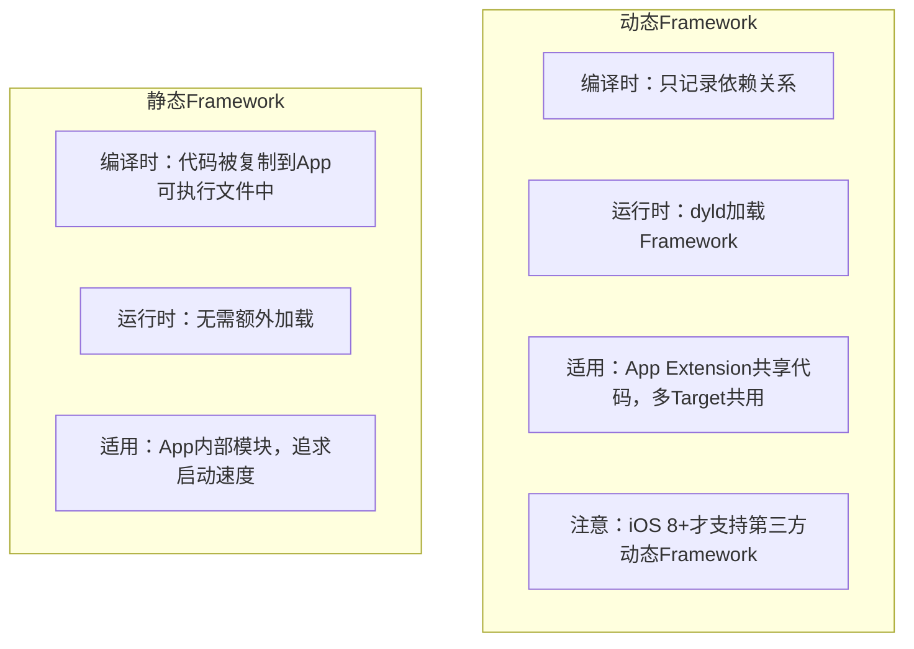

### 6.3 iOS中动态库的适用场景

对于iOS项目来说，动态库的适用场景**非常有限**。

#### iOS动态库的限制

**1. 代码签名限制**

iOS要求所有可执行代码必须经过签名验证，App只能加载：
- 系统动态库（Apple签名）
- 嵌入App Bundle中的动态库（与App一起签名）

这意味着**无法实现真正的"热更新"**——更新动态库需要重新提交App Store审核。

**2. 启动性能开销**

每个动态库都会增加：
- dyld加载和解析开销
- Rebase/Bind开销
- 初始化开销

Apple官方建议：**自定义动态库数量不要超过6个**。

**3. 无法跨App共享内存**

与macOS不同，iOS每个App是独立沙盒，不同App之间无法共享动态库代码。动态库"多进程共享内存"的优势在iOS上不存在。

#### iOS动态库的实际使用场景

只有以下**少数场景**适合使用动态库：

| 场景 | 说明 |
|------|------|
| App Extension共享代码 | 主App和Extension（Widget、Share Extension等）共享同一个动态Framework，避免代码重复打包 |
| 多Target共享代码 | 同一项目中多个App Target共享代码 |
| 超大型App的按需加载 | 极少数情况，将不常用功能做成动态库延迟加载 |

#### iOS项目的实际建议

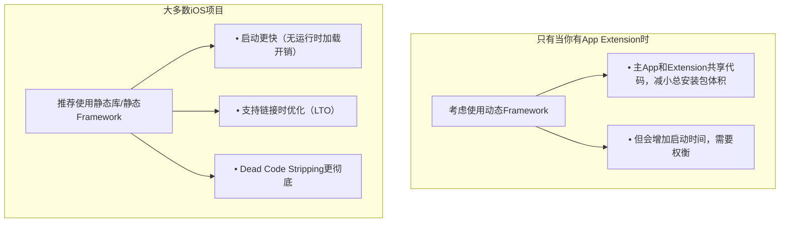

这也是为什么CocoaPods从1.9版本开始默认使用静态库（`use_frameworks! :linkage => :static`）的原因。

### 6.4 CocoaPods中的库链接方式

CocoaPods是iOS最常用的依赖管理工具，理解它如何处理静态库和动态库对项目配置很重要。

#### Podfile配置详解

**不使用use_frameworks!（传统静态库方式）**

```ruby
# Podfile
platform :ios, '13.0'

target 'MyApp' do
  pod 'AFNetworking'
  pod 'SDWebImage'
end
```

**产物结构：**
```
Pods/
├── libPods-MyApp.a              ← 所有Pod合并成一个静态库
├── AFNetworking/
│   └── 源码
└── SDWebImage/
    └── 源码
```

**链接方式：**


限制：**纯ObjC项目可用，但Swift Pod不支持**（Swift需要Module）

**使用use_frameworks!（动态Framework方式）**

```ruby
# Podfile
platform :ios, '13.0'
use_frameworks!

target 'MyApp' do
  pod 'Alamofire'     # Swift库
  pod 'SDWebImage'    # ObjC库
end
```

**产物结构：**
```
Pods/
├── Alamofire.framework/         ← 每个Pod一个动态Framework
├── SDWebImage.framework/
└── Pods_MyApp.framework/        ← 伞Framework
```

**链接方式：**

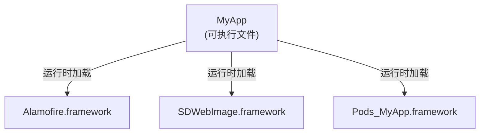

问题：每个Pod都是动态库，**启动时间显著增加**

**use_frameworks! :linkage => :static（静态Framework，推荐）**

```ruby
# Podfile
platform :ios, '13.0'
use_frameworks! :linkage => :static

target 'MyApp' do
  pod 'Alamofire'
  pod 'SDWebImage'
end
```

**产物结构：**
```
Pods/
├── Alamofire.framework/         ← 静态Framework（有Module支持）
├── SDWebImage.framework/        ← 静态Framework
└── ...
```

**链接方式：**

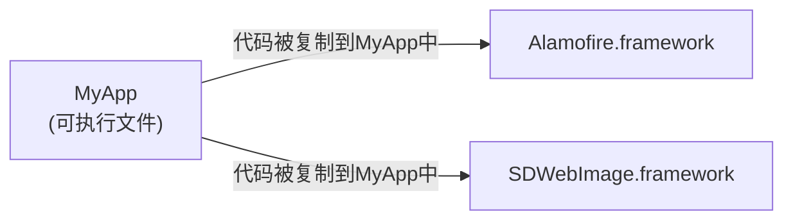

优点：
- 支持Swift（有Module）
- 启动快（静态链接，无运行时加载）
- 支持LTO优化

#### use_modular_headers!

`use_modular_headers!`用于在**不使用use_frameworks!**的情况下，为静态库生成Module支持。

**什么是Module？**

Module是Clang引入的模块化头文件机制，通过`module.modulemap`文件定义模块的公开接口（更详细的介绍请参考[Objective-C中import详解](./Objective-C中import详解.md)）：

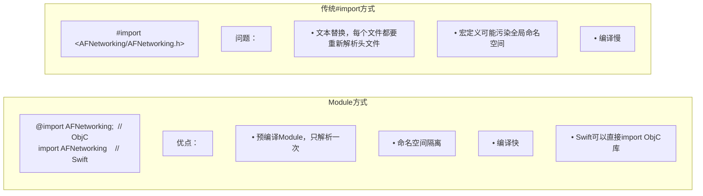

**为什么需要use_modular_headers!？**

```ruby
# 场景：想用静态库（启动快），又需要在Swift中使用ObjC的Pod

# 方案1：use_frameworks!（动态库，启动慢）
use_frameworks!

# 方案2：use_modular_headers!（静态库 + Module支持）
use_modular_headers!

target 'MyApp' do
  pod 'AFNetworking'  # ObjC库，现在Swift可以import了
end
```

**配置方式：**

```ruby
# 全局启用
use_modular_headers!

# 或者只对特定Pod启用
pod 'AFNetworking', :modular_headers => true

# 或者全局启用，排除特定Pod
use_modular_headers!
pod 'SomeLegacyPod', :modular_headers => false
```

#### 配置方式对比

| 配置 | 链接方式 | Module支持 | Swift支持 | 启动速度 | 推荐场景 |
|-----|---------|-----------|----------|---------|---------|
| 默认（无配置） | 静态库(.a) | 无 | 不支持 | 最快 | 纯ObjC项目 |
| `use_frameworks!` | 动态Framework | 有 | 支持 | 慢 | 需要动态库特性 |
| `use_frameworks! :linkage => :static` | 静态Framework | 有 | 支持 | 快 | **大多数项目推荐** |
| `use_modular_headers!` | 静态库(.a) | 有 | 支持 | 最快 | 混编项目，追求极致启动速度 |

### 6.5 XCFramework

在XCFramework出现之前，分发支持多架构的Framework通常使用**Fat Framework**（也叫Universal Framework），它将多个架构的二进制合并到一个文件中：

```bash
# Fat Framework结构
$ lipo -info MyFramework.framework/MyFramework
Architectures in the fat file: armv7 arm64 x86_64 i386
```

**Fat Framework的问题：**

| 问题 | 说明 |
|-----|------|
| 架构冲突 | iOS真机和模拟器都可能包含arm64架构（Apple Silicon Mac的模拟器），无法区分 |
| 提交App Store失败 | 包含模拟器架构（x86_64/i386）会被拒绝，需要手动strip |
| 不支持多平台 | 无法同时包含iOS和macOS版本 |
| 体积浪费 | 开发时需要所有架构，发布时需要手动移除 |

```bash
# 提交前需要手动移除模拟器架构
lipo -remove x86_64 -remove i386 MyFramework -output MyFramework_device
```

**XCFramework的解决方案：**

XCFramework是Apple在Xcode 11（2019）引入的新格式，它不是将架构合并，而是将不同变体**并列存放**：

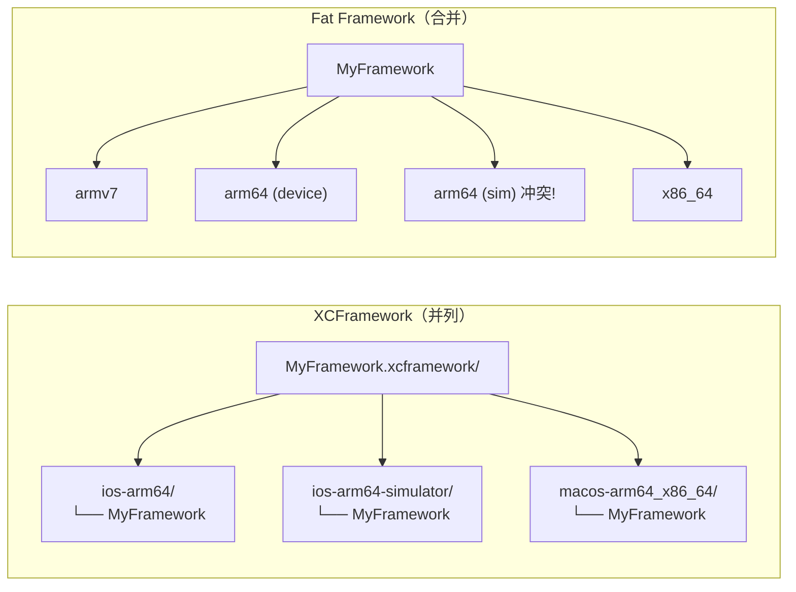

#### XCFramework结构详解

```plaintext
MyFramework.xcframework/
├── Info.plist                          # 描述所有变体的元信息
├── ios-arm64/                          # iOS真机（arm64）
│   └── MyFramework.framework/
│       ├── MyFramework                 # 二进制
│       ├── Headers/
│       ├── Modules/
│       └── Info.plist
├── ios-arm64_x86_64-simulator/         # iOS模拟器（支持Intel和Apple Silicon Mac）
│   └── MyFramework.framework/
│       └── ...
├── macos-arm64_x86_64/                 # macOS（Universal Binary）
│   └── MyFramework.framework/
│       └── ...
└── watchos-arm64_32_armv7k/            # watchOS
    └── MyFramework.framework/
        └── ...
```

#### XCFramework vs Fat Framework

| 特性 | Fat Framework | XCFramework |
|-----|---------------|-------------|
| 架构存储方式 | 合并到单个二进制 | 分目录存放 |
| 真机/模拟器arm64 | 冲突，无法共存 | 可以共存 |
| 多平台支持 | 不支持 | 支持iOS/macOS/watchOS/tvOS |
| App Store提交 | 需要手动strip模拟器架构 | 自动选择正确架构 |
| Swift版本兼容 | 需要相同Swift版本 | 支持Module Stability |
| Xcode支持 | 所有版本 | Xcode 11+ |

#### XCFramework最佳实践

1. **始终启用BUILD_LIBRARY_FOR_DISTRIBUTION**：确保Swift ABI稳定性（详见[Swift二进制兼容性](./Swift二进制兼容性.md)）

2. **包含所有需要的平台变体**：
   - iOS真机：`ios-arm64`
   - iOS模拟器：`ios-arm64_x86_64-simulator`（同时支持Intel和Apple Silicon Mac）
   - macOS：`macos-arm64_x86_64`（如果支持Mac Catalyst或macOS）

3. **静态库 vs 动态库**：XCFramework内部可以是静态库或动态库
   - 静态库：启动更快，但会增加App体积
   - 动态库：适合App Extension共享，但增加启动时间

4. **版本管理**：在Info.plist中包含版本信息，便于调试和问题追踪

---

## 七、常见面试问题

### Q1: Mach-O文件由哪几部分组成？

Mach-O文件由三部分组成：

```plaintext
┌──────────────────────────┐
│           Header         │  ← 文件的"身份证"
├──────────────────────────┤
│       Load Commands      │  ← 文件的"目录"
├──────────────────────────┤
│            Data          │  ← 实际的代码和数据
└──────────────────────────┘
```

- **Header（头部）**：描述文件的基本信息，包括魔数（标识文件格式）、CPU类型、文件类型（可执行文件、动态库等）、Load Commands的数量等

- **Load Commands（加载命令）**：描述文件的布局和依赖关系，常见的Load Commands包括：
  - `LC_SEGMENT_64`：定义Segment的位置、大小和权限（如`__TEXT`、`__DATA`）
  - `LC_LOAD_DYLIB`：声明依赖的动态库（如Foundation、UIKit）
  - `LC_SYMTAB`：符号表的位置和大小
  - `LC_DYSYMTAB`：动态符号表信息
  - `LC_MAIN`：程序入口点（main函数地址）
  - `LC_CODE_SIGNATURE`：代码签名信息的位置

- **Data（数据区）**：实际存储代码和数据，按Segment和Section两级结构组织：
  - **Segment（段）**：内存映射的基本单位，定义内存保护属性（可读/可写/可执行）
  - **Section（节）**：数据组织的逻辑单位，同一Segment内的多个Section共享内存属性

  常见的Segment及其包含的Section：
  
  | Segment | 权限 | 包含的Section |
  |---------|------|--------------|
  | `__PAGEZERO` | 不可访问 | 无（位于地址0x0起始的保护区域，任何对NULL指针的解引用都会访问到此区域，立即触发EXC_BAD_ACCESS崩溃） |
  | `__TEXT` | 可读、可执行 | `__text`（机器码）、`__stubs`（桩代码）、`__cstring`（C字符串）、`__objc_methname`（ObjC方法名）、`__swift5_typeref`（Swift类型引用） |
  | `__DATA_CONST` | 可读写→只读 | `__got`（非延迟绑定指针）、`__const`（运行时常量）、`__objc_classlist`（ObjC类列表）、`__swift5_proto`（Swift协议描述符） |
  | `__DATA` | 可读、可写 | `__data`（已初始化全局变量）、`__bss`（未初始化全局变量）、`__swift5_types`（Swift类型元数据）、`__la_symbol_ptr`（延迟绑定指针） |
  | `__DATA_DIRTY` | 可读、可写 | 运行时一定会修改的数据（单独分页以优化COW） |
  | `__LINKEDIT` | 可读 | 符号表、字符串表、代码签名等链接信息 |
  
  注：`__DATA_CONST`和`__DATA_DIRTY`是iOS 13+对`__DATA`的细分优化，`__DATA_CONST`在启动完成后变为只读，可被多进程共享。

### Q2: Segment和Section是什么关系？

Segment（段）和Section（节）是Mach-O中组织数据的**两级结构**：

**关系说明：**
- **Segment是Section的容器**：一个Segment可以包含多个Section
- **Segment是内存映射的基本单位**：定义内存保护属性（可读/可写/可执行），页对齐（通常16KB）
- **Section是数据组织的逻辑单位**：同一Segment内的多个Section共享内存属性，存放特定类型的数据

```plaintext
示例：__TEXT Segment（可读、可执行）
├── __text Section      ← 编译后的机器码
├── __stubs Section     ← 动态库调用桩
├── __cstring Section   ← C字符串常量
└── __const Section     ← 常量数据

所有这些Section都继承__TEXT的权限：可读、可执行、不可写
```

### Q3: 为什么iOS App不能使用dlopen加载任意动态库？

iOS的代码签名机制要求所有可执行代码必须经过签名验证。App只能加载：
- 系统动态库（已由Apple签名）
- 嵌入App Bundle中的动态库（与App一起签名）

### Q4: Rebase和Bind哪个开销更大？

通常**Bind开销更大**：
- Rebase只需简单的加法运算（地址 + slide）
- Bind需要查找符号表，进行字符串比较

### Q5: ObjC和Swift的符号名有什么区别？

ObjC和Swift使用不同的符号命名规则（Name Mangling），主要区别如下：

| 特性 | Objective-C | Swift |
|-----|-------------|-------|
| **命名规则** | 简单直接，类名/方法名作为符号的一部分 | 复杂的mangling方案，编码模块、类型、函数签名等完整信息 |
| **模块信息** | 不包含模块名 | 包含模块名 |
| **类名冲突** | 全局命名空间，整个App不能有同名类 | 不同模块可以有同名类型 |
| **解决冲突方式** | 依赖类名前缀约定（如NS、UI、AF） | 通过模块名自动区分 |

**符号示例对比：**

```plaintext
Objective-C:
  +[MyClass doSomething]  →  +[MyClass doSomething]
  -[MyClass doSomething]  →  -[MyClass doSomething]
  类符号                   →  _OBJC_CLASS_$_MyClass

Swift:
  func foo()              →  $s4Main3fooyyF
  MyModule.MyClass        →  $s8MyModule7MyClassC...
```

**ObjC的类名冲突问题：**

由于ObjC符号不包含模块信息，不同库中的同名类会产生符号冲突：
- **静态链接时**：链接器报错 `duplicate symbol '_OBJC_CLASS_$_MyClass'`
- **运行时**（动态库）：ObjC Runtime注册类时发现同名，行为未定义

这就是为什么ObjC社区有类名前缀约定（NSObject、UIView、AFHTTPClient等）。

**Swift符号的解析：**

可以使用`swift-demangle`工具解析Swift符号：

```bash
$ swift demangle '$s4Main3fooyyF'
$s4Main3fooyyF ---> Main.foo() -> ()

$ swift demangle '$s4Main6PersonC4name3ageSSSi_tcfc'
... ---> Main.Person.init(name: String, age: Int)
```

### Q6: XCFramework解决了什么问题？

XCFramework是Apple在Xcode 11引入的新格式，主要解决了传统Fat Framework的以下问题：

| 问题 | Fat Framework | XCFramework |
|-----|---------------|-------------|
| **架构冲突** | iOS真机和模拟器都可能包含arm64架构（Apple Silicon Mac的模拟器），无法区分 | 不同变体分目录存放，可以共存 |
| **提交App Store** | 包含模拟器架构会被拒绝，需要手动strip | 自动选择正确架构，无需手动处理 |
| **多平台支持** | 无法同时包含iOS和macOS版本 | 支持iOS/macOS/watchOS/tvOS等多平台 |
| **Swift版本兼容** | 需要相同Swift版本编译 | 支持Module Stability，可跨Swift版本使用 |

**XCFramework的目录结构示例：**

```plaintext
MyFramework.xcframework/
├── Info.plist                          # 描述所有变体的元信息
├── ios-arm64/                          # iOS真机
│   └── MyFramework.framework/
├── ios-arm64_x86_64-simulator/         # iOS模拟器（支持Intel和Apple Silicon Mac）
│   └── MyFramework.framework/
└── macos-arm64_x86_64/                 # macOS
    └── MyFramework.framework/
```

### Q7: CocoaPods有哪些库的链接方式？各有什么优缺点？

CocoaPods支持多种链接配置，主要通过Podfile中的选项控制：

| 配置方式 | 产物类型 | 链接方式 | 优点 | 缺点 |
|---------|---------|---------|------|------|
| 默认（无选项） | `.a`静态库 | 静态链接 | 体积小、启动快 | 不支持Module，Swift Pod不可用 |
| `use_frameworks!` | `.framework`动态库 | 动态链接 | 支持Swift、自带Module、资源打包方便 | 启动慢、可能触发动态库数量限制 |
| `use_frameworks! :linkage => :static` | `.framework`静态库 | 静态链接 | 启动快、支持Swift、自带Module、兼容性好 | 体积略大于纯`.a` |
| `use_modular_headers!` | `.a` + `module.modulemap` | 静态链接 | 体积最小、启动快、支持Module | 部分Pod不兼容、资源处理需额外配置 |

### Q8: 静态链接和动态链接有什么区别？

| 对比维度 | 静态链接 | 动态链接 |
|---------|---------|---------|
| **链接时机** | 编译期完成 | 运行时由dyld完成 |
| **符号解析** | 链接器直接执行重定位，将地址写入可执行文件 | 记录符号引用信息，运行时通过Bind操作填入实际地址 |
| **代码位置** | 库代码被复制到可执行文件中 | 库代码保留在独立的.dylib/.framework文件中 |
| **App体积** | 系统库无需打包；第三方库代码合并到可执行文件 | 系统库无需打包；第三方动态库需打包到ipa，体积相近甚至略大（含额外元数据） |
| **内存占用** | 每个进程各有一份库代码 | 系统动态库可跨进程共享物理内存（通过dyld shared cache）；App内嵌的动态库仍是每个进程各一份 |
| **启动速度** | 较快（无需运行时符号解析） | 较慢（需要执行Rebase和Bind） |
