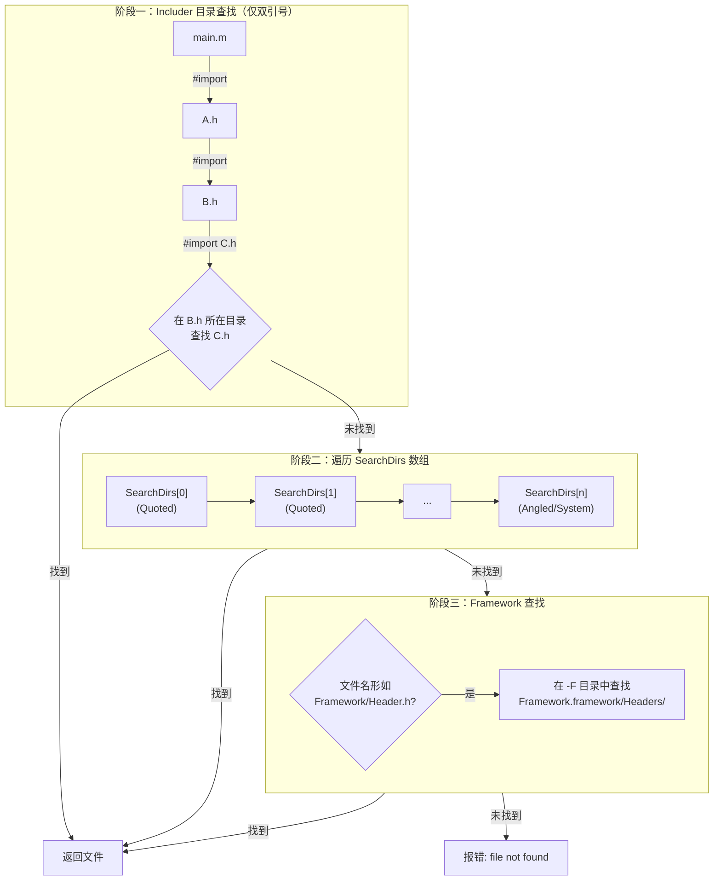
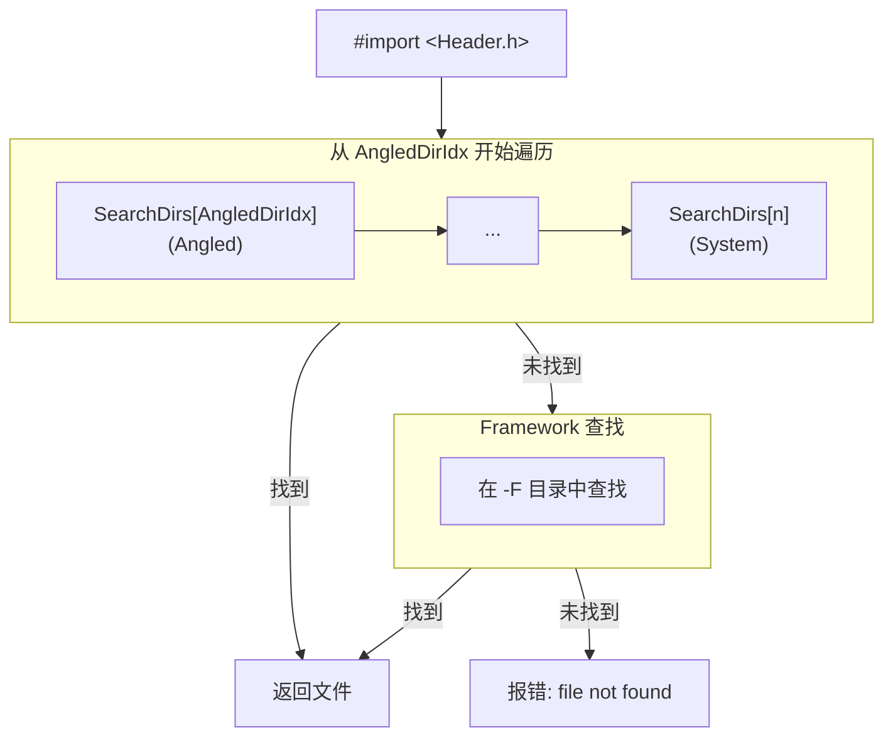
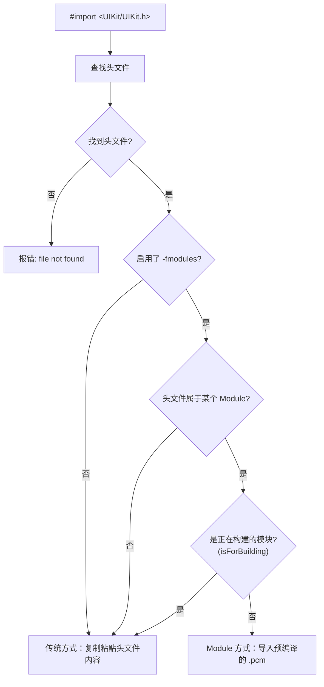
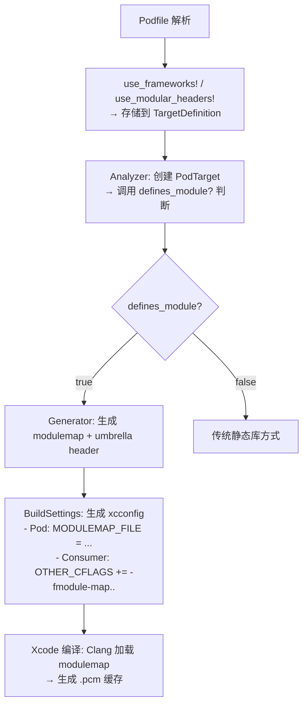

+++
title = "iOS中import详解"
date = '2026-06-08T23:06:52+08:00'
draft = false
weight = 8
tags = ["iOS", "面试", "基础"]
categories = ["iOS开发", "面试"]
+++
> **源码版本说明**：本文涉及的源码基于 **LLVM/Clang 23.0.0** 开发版本（llvm-project main分支，commit: `301c0d91b558`，2026-01-16）。不同版本的实现细节可能略有差异，但核心机制保持一致。

在Objective-C开发中，头文件引用是日常开发中最基础的操作之一。本文将从Clang编译器的角度，深入讲解iOS中各种import方式的区别、底层查找原理以及最佳实践。

| 引用方式 | 语法示例 | 适用场景 |
|---------|---------|---------|
| #include | `#include "Header.h"` | C/C++传统方式 |
| #import | `#import "Header.h"` | Objective-C项目内部引用 |
| #import | `#import <Framework/Header.h>` | 系统/第三方Framework |
| @import | `@import Foundation;` | Clang Modules方式 |
| PCH | Prefix Header文件 | 预编译公共头文件 |

## #include vs #import

### #include的工作原理

`#include`是C/C++中的头文件引用方式，它的工作原理非常简单：**预处理器会将目标头文件的内容原封不动地复制粘贴到当前文件中**。

这种方式存在一个问题：**重复引用**。如果多个文件都include了同一个头文件，或者存在循环引用，会导致编译错误。传统的解决方案是使用**Include Guard**：

```c
// Header.h
#ifndef HEADER_H
#define HEADER_H
// 头文件内容
#endif
```

现代编译器还支持`#pragma once`指令，功能相同但更简洁：

```c
// Header.h
#pragma once
// 头文件内容
```

### #import的增强

`#import`是Objective-C对`#include`的封装和增强。它在`#include`的基础上增加了一层**判重逻辑**，自动防止同一个头文件被重复引用。

```objective-c
// BClass.m
#import "AClass.h"
#import "AClass.h"  // 第二次import会被自动忽略
```

### 双引号 vs 尖括号

在日常开发中，我们经常会看到两种不同的引用方式：

```objective-c
#import "MyClass.h"              // 双引号形式
#import <UIKit/UIKit.h>          // 尖括号形式
```

它们的核心区别在于**搜索路径的范围不同**：

| 引用方式 | 搜索范围 | 典型用途 |
|---------|---------|---------|
| `"..."` | Includer目录 + Quoted/Angled/System；Framework形式还会查`-F` | 项目内部头文件 |
| `<...>` | Angled/System；Framework形式还会查`-F` | 系统库、第三方Framework |

那么 Clang 具体是如何查找头文件的？搜索路径又是怎么配置的？

## 头文件查找机制

当 Xcode 执行编译时，会将 Build Settings 中的配置转换为 Clang 编译器参数。Clang 解析这些参数后，将所有搜索路径组织到一个统一的 `SearchDirs` 数组中，按照特定顺序进行查找。

### SearchDirs 数组的内部结构

`SearchDirs` 是 Clang 存储所有搜索路径的核心数据结构。理解它的内部组织方式，是理解头文件查找机制的关键。

```text
SearchDirs 数组结构：

┌─────────────────────────────────────────────────────────────────────┐
│  Index:    0    1    2    3    4    5    6    7    8    9   ...     │
├─────────────────────────────────────────────────────────────────────┤
│           ├─ Quoted ─┤├───── Angled ─────┤├──────── System ────────┤│
│           │  -iquote │|       -I         ||  -isystem + 内置路径    |│
│           │          │|                  ||                        |│
│           ↑          ↑                   ↑                          │
│           0    AngledDirIdx         SystemDirIdx                    │
└─────────────────────────────────────────────────────────────────────┘

查找范围：
  • #import "..."  → 从 index 0 开始，搜索整个数组
  • #import <...>  → 从 AngledDirIdx 开始，跳过 Quoted 区间
```

Clang 使用两个索引值将数组划分为三个区间：

| 区间 | 索引范围 | 对应参数 | Xcode Build Setting |
|------|---------|---------|---------------------|
| Quoted | `[0, AngledDirIdx)` | `-iquote` | User Header Search Paths |
| Angled | `[AngledDirIdx, SystemDirIdx)` | `-I` | Header Search Paths |
| System | `[SystemDirIdx, end)` | `-isystem` | System Header Search Paths |

> **Framework 路径**（`-F` 参数）不在 `SearchDirs` 数组中，而是单独存储在 `FrameworkMap` 中，仅在处理 `<Framework/Header.h>` 形式的引用时使用。

### 从 Xcode 配置到 Clang 命令

以下示例展示 Xcode Build Settings 如何转换为 Clang 编译参数：

**Xcode Build Settings 配置：**

| Build Setting | 配置值 |
|---------------|-------|
| User Header Search Paths | `$(SRCROOT)/Headers` |
| Header Search Paths | `$(SRCROOT)/ThirdParty/include` |
| System Header Search Paths | `/opt/custom/include` |
| Framework Search Paths | `$(SRCROOT)/Frameworks` |
| Use Header Maps | YES |

> **注意**：使用 CocoaPods 的项目中，这些搜索路径通常由 CocoaPods 通过 `.xcconfig` 文件自动配置。执行 `pod install` 后，CocoaPods 会在 `Pods/Target Support Files/` 目录下生成 xcconfig 文件，典型配置如下：
> ```text
> HEADER_SEARCH_PATHS = $(inherited) "${PODS_ROOT}/Headers/Public" "${PODS_ROOT}/Headers/Public/AFNetworking"
> FRAMEWORK_SEARCH_PATHS = $(inherited) "${PODS_CONFIGURATION_BUILD_DIR}/AFNetworking"
> ```
> 这些配置会导致 `${PODS_ROOT}/Headers/Public` 被添加到 Angled 区间（`-I` 参数），因此你可以用 `#import "AFNetworking.h"` 或 `#import <AFNetworking.h>` 两种方式引用 Pod 库的头文件。CocoaPods 还会在该目录下为每个 Pod 的公开头文件创建符号链接，配合 Header Map 机制，使得扁平化引用（如 `#import "AFNetworking.h"`）能够正确解析。

**生成的 Clang 编译命令：**

```bash
clang -x objective-c \
    -iquote /path/to/MyProject-generated-files.hmap \
    -iquote /path/to/MyProject-project-headers.hmap \
    -iquote /Users/dev/MyProject/Headers \
    -I /path/to/MyProject-own-target-headers.hmap \
    -I /Users/dev/MyProject/ThirdParty/include \
    -isystem /opt/custom/include \
    -F /Users/dev/MyProject/Frameworks \
    -c main.m -o main.o
```

**对应的 SearchDirs 数组：**

```text
SearchDirs[0] = MyProject-generated-files.hmap     ─┐
SearchDirs[1] = MyProject-project-headers.hmap      ├─ Quoted (仅 "..." 可用)
SearchDirs[2] = /Users/dev/MyProject/Headers       ─┘
                                                    ← AngledDirIdx = 3
SearchDirs[3] = MyProject-own-target-headers.hmap  ─┐
SearchDirs[4] = /Users/dev/MyProject/ThirdParty/... ├─ Angled ("..." 和 <...> 都可用)
                                                   ─┘
                                                    ← SystemDirIdx = 5
SearchDirs[5] = /opt/custom/include                ─┐
SearchDirs[6] = /Applications/Xcode.app/.../include ├─ System ("..." 和 <...> 都可用)
...                                                ─┘
```

### 双引号 vs 尖括号：查找范围的差异

双引号和尖括号的核心区别在于**查找的起始位置不同**：

```cpp
// HeaderSearch.cpp 第1085-1086行
ConstSearchDirIterator It =
    isAngled ? angled_dir_begin() : search_dir_begin();
```

- `search_dir_begin()` 返回索引 0（数组开头）
- `angled_dir_begin()` 返回 `AngledDirIdx`（跳过 Quoted 区间）

**具体差异：**

| 引用方式 | 起始位置 | 搜索范围 |
|---------|---------|---------|
| `#import "..."` | 当前目录 + index 0 | 全部路径 |
| `#import <...>` | AngledDirIdx | Angled + System |

**实际影响示例：**

假设项目结构如下：

```text
MyProject/
├── Headers/
│   └── MyUtils.h          # 项目内部工具类
├── ThirdParty/
│   └── include/
│       └── json.h         # 第三方库头文件
└── Sources/
    └── main.m
```

配置：

```text
User Header Search Paths: $(SRCROOT)/Headers      → -iquote → Quoted 区间
Header Search Paths: $(SRCROOT)/ThirdParty/include → -I     → Angled 区间
```

在 `main.m` 中的查找结果：

```objective-c
// 能找到：双引号从 index 0 开始，会搜索 Quoted 区间（包含 Headers 目录）
#import "MyUtils.h"

// 找不到！尖括号从 AngledDirIdx 开始，跳过了 Quoted 区间
#import <MyUtils.h>  // error: 'MyUtils.h' file not found

// 都能找到：Angled 区间对双引号和尖括号都可用
#import "json.h"
#import <json.h>
```

**解决方案**：如果需要 `<MyUtils.h>` 也能找到，将路径添加到 `Header Search Paths`（`-I`），使其进入 Angled 区间。

### #import "..." 完整查找流程

双引号形式的查找分为三个阶段：**Includer 目录查找** + **SearchDirs 遍历** + **Framework 查找**。



**阶段一：Includer 目录查找**

"Includer"是指执行 `#import` 指令的文件，而非被编译的源文件。

```cpp
// HeaderSearch.cpp 第1000-1080行
if (!Includers.empty() && !isAngled) {
    // 在 includer 的目录中查找
}
```

例如：当 `B.h` 中写 `#import "C.h"` 时，首先在 `B.h` 所在目录查找，而非 `main.m` 所在目录。

**阶段二：遍历 SearchDirs**

从 index 0 开始，依次检查每个搜索路径。每个位置可能是：
- **普通目录**：直接在目录中查找文件
- **Header Map**：查询映射表，可能触发二次查找（详见 Header Map 章节）

**阶段三：Framework 查找**

如果文件名形如 `Framework/Header.h`，会在 `-F` 指定的 Framework 目录中查找。

### #import <...> 完整查找流程

尖括号形式跳过 Includer 目录和 Quoted 区间，直接从 Angled 区间开始：



这意味着：
- 即使 Header Map 通过 `-iquote` 传递，尖括号形式也不会使用它
- 尖括号更适合引用"外部"头文件（系统库、第三方 Framework）

### Framework 目录的特殊处理

当路径形如 `<FrameworkName/Header.h>` 时，Clang 会进行特殊的路径转换：

```cpp
// HeaderSearch.cpp 第689-715行 DoFrameworkLookup
// 首先尝试 Headers 目录
FrameworkName += "Headers/";
auto File = FileMgr.getOptionalFileRef(FrameworkName, ...);

if (!File) {
  // 未找到时，尝试 PrivateHeaders 目录
  const char *Private = "Private";
  FrameworkName.insert(..., Private, ...);
  File = FileMgr.getOptionalFileRef(FrameworkName, ...);
}
```

**完整查找顺序：**

```text
#import <UIKit/UIView.h> 的查找路径：

1. 在 -F 指定的每个目录中查找：
   └── UIKit.framework/Headers/UIView.h        ← 首先尝试

2. 如果 Headers 中未找到：
   └── UIKit.framework/PrivateHeaders/UIView.h ← 其次尝试
```

> **注意**：`PrivateHeaders` 目录用于存放 Framework 的私有头文件，这些头文件不应该被外部代码直接引用。

### 验证方法：查看搜索路径和查找过程

**方法一：使用 -v 参数查看搜索路径**

```bash
clang -v -c main.m 2>&1 | grep -A 20 "search starts here"
```

输出示例：

```text
#include "..." search starts here:
 /Users/dev/MyProject/Headers                      # Quoted 区间
#include <...> search starts here:
 /Users/dev/MyProject/ThirdParty/include           # Angled 区间
 /opt/custom/include                               # System 区间
 /Applications/Xcode.app/.../SDKs/.../usr/include  # 编译器内置
End of search list.
```

**方法二：使用 -H 参数查看头文件包含层级**

```bash
clang -H -c main.m
```

输出示例：

```text
. /Users/dev/MyProject/Headers/MyUtils.h
.. /Applications/Xcode.app/.../Foundation.h
... /Applications/Xcode.app/.../NSObjCRuntime.h
```

**在 Xcode 中使用**：Build Settings -> Other C Flags 添加 `-v` 或 `-H`，然后查看编译日志。

## Header Map机制

Header Map是Xcode/Clang提供的一种优化机制，解决两个问题：

1. **简化引用路径**：无需指定完整目录路径，例如头文件位于`/Project/Network/HTTPClient.h`，无需写`#import "Network/HTTPClient.h"`，直接`#import "HTTPClient.h"`即可
2. **提升查找效率**：避免大量文件系统IO操作

> Headermaps are used by the Xcode build system to communicate where those header files are.  
> —— WWDC2018 Behind the Scenes of the Xcode Build Process

### 工作原理

1. **生成映射文件**：Xcode在编译前生成`.hmap`二进制文件，包含头文件名到绝对路径的映射
2. **快速查找**：Clang优先查询hmap文件，避免文件系统IO
3. **自动启用**：Xcode Build Settings中`Use Header Map`选项默认开启

可以使用[hmap工具](https://github.com/milend/hmap)查看hmap文件的内容：

```bash
brew install milend/taps/hmap
hmap print /path/to/ProjectName-project-headers.hmap
```

```text
// hmap文件内容示例（逻辑结构）
{
    "AClass.h" -> "/Users/xxx/Project/Sources/AClass.h",
    "NetworkManager.h" -> "/Users/xxx/Project/Network/NetworkManager.h"
}
```

### Xcode生成的hmap文件

当`USE_HEADERMAP=YES`时，Xcode会生成多个hmap文件：

```bash
clang … -iquote /path/to/ProjectName-generated-files.hmap \
        -iquote /path/to/ProjectName-project-headers.hmap \
        -I /path/to/ProjectName-own-target-headers.hmap \
        …
```

- **通过`-iquote`传递的hmap**：仅用于`#import "..."`
- **通过`-I`传递的hmap**：同时用于`#import "..."`和`#import <...>`

### 扁平化映射

当`HEADERMAP_INCLUDES_FLAT_ENTRIES_FOR_TARGET_BEING_BUILT=YES`（默认）时，当前target的所有头文件会以**扁平化方式**加入Header Map。

**原理**：扁平化映射会为同一个头文件创建**两种形式的 key**——不带目录的文件名和带目录的相对路径，它们都指向同一个绝对路径：

```text
// 假设项目结构：/Project/Network/HTTPClient.h

// Header Map 中会包含两条映射：
{
    "HTTPClient.h"         -> "/Project/Network/HTTPClient.h",  // 扁平化 key
    "Network/HTTPClient.h" -> "/Project/Network/HTTPClient.h"   // 完整路径 key
}
```

这意味着无论头文件实际存放在项目的哪个子目录中，你都可以直接用**文件名**来引用它：

```objective-c
// 项目结构：/Project/Network/HTTPClient.h

// 以下两种写法都能找到：
#import "HTTPClient.h"           // 扁平化key
#import "Network/HTTPClient.h"   // 完整路径key
```

### 同名文件的处理

当**项目中存在多个同名头文件**时（例如不同模块下都有`Config.h`），Header Map 在构建索引时遵循**先出现优先**的原则：

```cpp
// HeaderSearch.cpp 第405-427行 indexInitialHeaderMaps
auto Callback = [&](StringRef Filename) {
  Index.try_emplace(Filename.lower(), i);  // try_emplace只在key不存在时插入
};
```

`try_emplace`方法只在 key 不存在时才会插入，所以先被索引的 hmap 中的映射会"占位"，后续同名的 key 会被忽略。

**具体场景示例**：

假设项目中有两个不同模块的配置文件：
- `/Project/ModuleA/Config.h`
- `/Project/ModuleB/Config.h`

Xcode 生成的编译命令可能是：
```bash
clang -iquote /path/to/ProjectName-project-headers.hmap \
      -I /path/to/ProjectName-own-target-headers.hmap \
      ...
```

如果两个 hmap 文件中都包含`Config.h`的映射：
- `-iquote`传递的 hmap：`"Config.h"` -> `/Project/ModuleA/Config.h`
- `-I`传递的 hmap：`"Config.h"` -> `/Project/ModuleB/Config.h`

由于`-iquote`的 hmap 先被处理，`#import "Config.h"`会解析到 ModuleA 的`Config.h`，而 ModuleB 的映射会被忽略。

这也是 Objective-C 中建议使用文件前缀（如 XXClass.h、YYManager.h）的原因之一。

### Framework 风格映射

当 `HEADERMAP_INCLUDES_FRAMEWORK_ENTRIES_FOR_ALL_PRODUCT_TYPES` 启用时（默认 YES），Xcode 会为**当前 Target 的头文件**创建 Framework 风格的映射：

- **适用对象**：当前正在构建的 Target 中的头文件（通常是 Public/Project 可见性的头文件）
- **映射格式**：`HeaderName.h` -> `TargetName/HeaderName.h`（相对路径）

例如，假设你有一个名为 `MyFramework` 的 Target，包含 `MyClass.h` 头文件，Xcode 生成的 hmap 中会包含：

```text
{
    "MyClass.h"            -> "MyFramework/MyClass.h",     // Framework 风格相对路径
    "MyFramework/MyClass.h" -> "/absolute/path/MyClass.h"  // 绝对路径
}
```

当 Header Map 返回第一条相对路径时，Clang 会用这个路径作为新文件名进行**二次查找**：

```cpp
// HeaderSearch.cpp DirectoryLookup::LookupFile 方法
// Check if the headermap maps the filename to a framework include
// ("Foo.h" -> "Foo/Foo.h"), in which case continue header lookup using the
// framework include.
if (llvm::sys::path::is_relative(Dest)) {
  MappedName.append(Dest.begin(), Dest.end());
  Filename = StringRef(MappedName.begin(), MappedName.size());
  Dest = HM->lookupFilename(Filename, Path);  // 二次查找
}
```

这个机制可以让你用简单的 `#import "MyClass.h"` 引用**当前 Target** 的头文件，Clang 会自动将其转换为 Framework 风格的 `MyFramework/MyClass.h`，从而与 Framework 的标准引用方式保持一致，并能正确触发 Clang Module。

### 性能优化机制

**Header Map索引**：Clang会预先索引所有Header Map的key，查找时直接定位，避免逐个遍历。

**查找缓存**：Clang使用`LookupFileCache`缓存查找结果，对同一文件名的重复查找直接使用缓存。

```cpp
// HeaderSearch.cpp 第1097行
LookupFileCacheInfo &CacheLookup = LookupFileCache[Filename];
```

## 预编译头文件（PCH）

前面我们详细讨论了 Clang 如何**查找**头文件——从 SearchDirs 数组到 Header Map 优化。但传统的 `#include`/`#import` 方式还存在以下核心问题：

1. **编译性能**：每个源文件都需要重新解析头文件。假设项目有 100 个 `.m` 文件都引用了 `Foundation.h`，那么 `Foundation.h` 及其依赖的头文件会被解析 100 次。Header Map 只是加速了"找到文件"的过程，但"解析文件内容"的开销依然存在。

2. **宏污染**：头文件中的宏定义会影响后续代码。例如：

```objective-c
// SomeHeader.h
#define MAX 100

// MyClass.m
#import "SomeHeader.h"
#import <SomeFramework/SomeFramework.h>  // 这个Framework中如果有MAX变量/方法，会被替换为100

int MAX = 50;  // 编译错误：被替换为 int 100 = 50;
```

3. **依赖顺序**：头文件的引用顺序可能影响编译结果。不同的 `#import` 顺序可能导致不同的宏定义覆盖，产生难以调试的问题。

为了解决这些问题，Clang 提供了两种预编译机制：
- **PCH（Precompiled Header）**：早期方案，本节介绍
- **Clang Modules**：现代方案，下一节介绍

### PCH 的核心思想

PCH 的核心思想是：**将一组常用的头文件预先编译成二进制格式，后续编译时直接加载这个预编译结果，而不需要重新解析这些头文件的文本内容**。

```text
传统编译流程:
源文件A.m → #import <Foundation/Foundation.h> → 解析头文件 → AST → 代码生成
源文件B.m → #import <Foundation/Foundation.h> → 解析头文件 → AST → 代码生成
                          ↑ 重复解析！

PCH 编译流程:
Step1: 生成 PCH
Prefix.pch (#import <Foundation/Foundation.h>) → 解析 → 序列化 AST → Prefix.pch.gch

Step2: 使用 PCH  
源文件A.m + Prefix.pch.gch → 反序列化 AST (极快) → 代码生成
源文件B.m + Prefix.pch.gch → 反序列化 AST (极快) → 代码生成
                ↑ 无需重复解析！
```

### PCH 的工作原理

#### 1. 生成阶段

当使用 `-emit-pch` 选项编译头文件时

```bash
# 生成 PCH 文件
clang -x objective-c-header -emit-pch Prefix.pch -o Prefix.pch.gch
```

Clang 会：

1. 完整解析头文件及其所有依赖
2. 构建完整的 AST（抽象语法树）
3. 将 AST 序列化成二进制格式保存到 `.pch` 或 `.gch` 文件

```cpp
// clang/lib/Serialization/ASTWriter.cpp
// PCH 文件头标识为 "CPCH"
Stream.Emit((unsigned)'C', 8);
Stream.Emit((unsigned)'P', 8);
Stream.Emit((unsigned)'C', 8);
Stream.Emit((unsigned)'H', 8);
```

#### 2. 使用阶段

编译源文件时，使用 `-include-pch` 选项加载预编译头：

```bash
# 使用 PCH 文件编译
clang -include-pch Prefix.pch.gch main.m -o main.o
```

Clang 会反序列化 PCH 文件中的 AST，恢复到解析完头文件后的编译器状态。

### PCH 存储的内容

根据 `clang/include/clang/Serialization/ASTBitCodes.h` 中的定义，PCH 文件使用 LLVM Bitstream 格式，包含以下主要内容块：

| 内容块 | 说明 |
|-------|------|
| CONTROL_BLOCK | 控制信息（验证编译选项兼容性） |
| AST_BLOCK | AST 主块（类型、声明等） |
| SOURCE_MANAGER_BLOCK | 源码位置管理 |
| PREPROCESSOR_BLOCK | 预处理器状态（宏定义等） |
| INPUT_FILES_BLOCK | 输入文件列表（用于验证文件是否修改） |

#### 头文件状态的保存

PCH 不仅保存 AST，还会保存头文件的状态信息（`HeaderFileInfo`），包括：

```cpp
// clang/include/clang/Lex/HeaderSearch.h
struct HeaderFileInfo {
  unsigned isImport : 1;           // 是否被 #import（ObjC）
  unsigned isPragmaOnce : 1;       // 是否有 #pragma once
  unsigned isModuleHeader : 1;     // 是否是模块头文件
  
  // 头文件的 include guard 宏
  LazyIdentifierInfoPtr LazyControllingMacro;
};
```

这意味着，如果某个头文件已经在 PCH 中被 `#import` 过，当源文件再次 `#import` 它时，Clang 可以直接从缓存中得知"这个文件已经被引入过了"，从而实现防重复引入的判断。

### 懒加载（Lazy Deserialization）机制

PCH 的一个关键优化是**懒加载**：加载 PCH 时并不会立即反序列化所有内容，而是按需加载。

> Clang's AST files are loaded "lazily" from disk. When an AST file is initially loaded, Clang reads only a small amount of data from the AST file to establish where certain important data structures are stored.  
> —— clang/docs/PCHInternals.rst

这意味着：
- 类型和声明只在被引用时才反序列化
- 宏定义只在被使用时才加载
- 未使用的部分不会占用编译时间

#### 懒加载的实现原理

PCH 既然已经是预编译的二进制文件，为什么还能做到"按需加载"？关键在于 **PCH 文件的内部结构设计**——它并不是一个需要"全部加载或全不加载"的整体，而是一个**带索引的分块结构**，支持随机访问。

**PCH 文件的内部结构**：

```text
┌────────────────────────────────────────┐
│  PCH 文件结构                           │
├────────────────────────────────────────┤
│  CONTROL_BLOCK（控制信息）    ← 立即加载  │
│  - 编译选项验证                          │
│  - 文件修改时间检查                      │
├───────────────────────────────────────┤
│  索引表 / 查找表              ← 立即加载  │
│  - 标识符 → 偏移量映射                   │
│  - 类型ID → 偏移量映射                   │
│  - 声明ID → 偏移量映射                   │
├───────────────────────────────────────┤
│  AST_BLOCK（实际数据）        ← 按需加载  │
│  - 类型定义（在偏移量 X）                 │
│  - 声明数据（在偏移量 Y）                 │
│  - ...                                 │
└────────────────────────────────────────┘
```

**两阶段加载过程**：

1. **初始加载阶段**：Clang 只读取控制信息和索引表，建立"名字 → 文件偏移量"的映射，但**不读取实际的 AST 数据**。这个过程非常快，因为只涉及少量数据。

2. **按需加载阶段**：当编译过程中代码引用了某个类型或声明时，Clang 通过索引表查到对应的文件偏移量，然后用 `seek` 跳到那个位置，只反序列化需要的那一小块数据。

**Clang 源码实现**：

Clang 使用了"外部 AST 源"（External AST Source）的设计模式。以声明的懒加载为例：

```cpp
// clang/lib/Serialization/ASTReader.cpp（简化示意）
class ASTReader {
    // 延迟加载的声明：只存储 ID 和偏移量
    DenseMap<DeclID, uint64_t> DeclOffsets;
    
    // 当需要某个声明时才真正读取
    Decl *GetDecl(DeclID ID) {
        if (已在缓存中) return 缓存的声明;
        
        // 跳到文件中的对应位置
        uint64_t offset = DeclOffsets[ID];
        Stream.JumpToBit(offset);
        
        // 只反序列化这一个声明
        return ReadDeclRecord(ID);
    }
};
```

可以把 PCH 想象成一本**带详细目录的字典**：打开字典时，你只看目录（索引表）；当你需要查"UIView"这个词时，通过目录找到页码，直接翻到那一页；你不需要从第一页读到最后一页。

这就是"二进制文件 + 懒加载"能够共存的原因：**二进制格式便于快速定位和随机访问，索引结构支持按需读取**。

#### 验证懒加载效果

使用 `-print-stats` 选项可以查看实际加载了多少内容：

```text
*** AST File Statistics:
    895/39981 source location entries read (2.238563%)
    19/15315 types read (0.124061%)
    20/82685 declarations read (0.024188%)
    154/58070 identifiers read (0.265197%)
    4/8400 macros read (0.047619%)
```

对于一个简单的程序，可能只需要加载 PCH 中 2-3% 的内容。即使 PCH 包含了整个 `<UIKit/UIKit.h>` 的所有内容（几万个声明），但如果你的源文件只用到了 `UIView` 和 `NSString`，那编译器只会反序列化这两个相关的声明及其依赖，其他 99% 的内容根本不会被读取。

### Xcode 中的 PCH 配置

在 Xcode 中，PCH 通过以下 Build Settings 配置：

| 设置项 | 说明 |
|-------|------|
| `Prefix Header` (GCC_PREFIX_HEADER) | PCH 文件路径 |
| `Precompile Prefix Header` (GCC_PRECOMPILE_PREFIX_HEADER) | 是否启用预编译（YES/NO） |

典型的 Prefix Header 文件内容：

```objective-c
// ProjectName-Prefix.pch
#ifdef __OBJC__
    #import <UIKit/UIKit.h>
    #import <Foundation/Foundation.h>
    // 其他常用头文件
#endif
```
### PCH 的局限性

虽然 PCH 能够显著提升编译速度，但它也有明显的局限性：

1. **只能有一个**：每个编译单元只能使用一个 PCH，且必须在文件开头引入
2. **必须完全匹配**：编译 PCH 时的编译选项必须与使用时完全一致
3. **修改代价高**：PCH 中任何头文件的修改都需要重新生成整个 PCH
4. **无法解决宏污染**：PCH 中的宏定义仍然会影响源文件
5. **维护成本**：需要手动维护哪些头文件应该放入 PCH

正是因为 PCH 存在这些局限性，Clang 后来引入了更先进的 **Clang Modules** 机制。从实现角度看，Modules 是 PCH 的泛化和增强。

> Modules, as implemented in Clang, use the same mechanisms as precompiled headers to save a serialized AST file (one per module) and use those AST modules. From an implementation standpoint, modules are a generalization of precompiled headers, lifting a number of restrictions placed on precompiled headers.  
> —— clang/docs/PCHInternals.rst

## Clang Modules

Clang Modules 是 LLVM/Clang 编译器提供的一种现代化的代码组织和引用机制，是 PCH 的进化版本，旨在彻底解决传统 `#include`/`#import` 方式存在的诸多问题。

**核心思想**：将头文件预编译成一种高效的二进制格式（`.pcm` 文件，即 Precompiled Module），编译器可以直接加载这个二进制文件，而不需要每次都重新解析文本形式的头文件。与 PCH 不同的是，每个 Module 是独立的、可复用的编译单元。

### Modules的优势（相比 PCH）

1. **预编译缓存**：与 PCH 类似，Module只需编译一次，编译结果会被缓存，可被多个源文件复用。但 Module 支持**多个独立缓存**，而 PCH 只能有一个。缓存位置通常在：
   - 系统Module：`~/Library/Developer/Xcode/DerivedData/ModuleCache.noindex/`
   - 项目Module：`DerivedData/ProjectName/Build/Intermediates.noindex/`
   
2. **隔离性**：这是 Module 相对于 PCH 的最大改进。Module内部的宏不会泄露到外部，Module就像一个"密封盒子"，内部定义的`#define`不会影响外部代码，反之亦然。而 PCH 中的宏定义仍然会污染后续代码。

3. **语义化引用**：通过Module名称引用，而非文件路径。编译器能够理解模块之间的依赖关系，而不仅仅是文本替换。

4. **自动链接**：使用`@import`时会自动链接对应的Framework，无需在Build Phases中手动添加。例如`@import CoreLocation;`会自动链接CoreLocation.framework。

5. **灵活的依赖关系**：PCH 只能形成线性的依赖链，而 Module 支持 DAG（有向无环图）形式的依赖，更符合实际项目的依赖结构。

### @import语法

```objective-c
@import UIKit;           // 导入整个模块
@import UIKit.UIView;    // 导入子模块
```

### @import的查找流程

```text
1. 解析Module名称
2. 查找Module缓存 -> 命中则直接使用
3. 在Framework Search Paths中查找
   └── 查找 ModuleName.framework 目录
4. 查找Module Map文件
5. 解析Module Map，缓存Module
```

### Module Map文件

Module Map是一个文本文件，定义了Module的结构和对外暴露的接口：

```text
framework module MyFramework {
    umbrella header "MyFramework.h"
    export *
    module * { export * }
}
```

**各字段含义**：

| 字段 | 说明 |
|-----|------|
| `framework module` | 声明这是一个Framework模块（相对于普通的`module`） |
| `MyFramework` | Module的名称，必须与Framework目录名一致 |
| `umbrella header` | 指定"伞头文件"，该头文件中`#import`的所有其他头文件都会被包含在Module中 |
| `export *` | 将所有子模块的内容重新导出，使用者可以直接访问 |
| `module * { export * }` | 为umbrella header中的每个头文件自动创建子模块 |

**更完整的Module Map示例**：

```text
framework module MyFramework {
    umbrella header "MyFramework.h"
    
    export *
    module * { export * }
    
    // 显式声明某些头文件
    explicit module Advanced {
        header "MyAdvancedFeature.h"
        export *
    }
    
    // 私有头文件
    private header "MyFramework_Internal.h"
}
```

**查找顺序**（基于`HeaderSearch.cpp lookupModuleMapFile`方法）：

1. `Framework.framework/Modules/module.modulemap`（推荐位置）
2. `Framework.framework/module.map`（已废弃，会产生警告）
3. `Framework.framework/Modules/module.private.modulemap`（用于私有模块）

### 启用Clang Modules

在Xcode中设置：
- Build Settings -> Enable Modules (C and Objective-C) -> Yes
- Build Settings -> Link Frameworks Automatically -> Yes

启用后，即使使用`#import <Framework/Header.h>`语法，编译器也会自动转换为Module引用。

### #import 自动转换为 Module 引用的原理

当启用 Clang Modules 后，`#import <Framework/Header.h>` 并不是简单地按传统方式查找和复制头文件内容，而是会被**自动转换为 Module 引用**。这个转换过程发生在预处理阶段。

**转换的核心判断逻辑**：

Clang 在处理 `#include`/`#import` 指令时，会判断是否应该将其转换为 Module 导入。核心代码在 `PPDirectives.cpp` 中：

```cpp
// clang/lib/Lex/PPDirectives.cpp HandleIncludeDirective 方法
// 第2388-2391行
Module *ModuleToImport = SuggestedModule.getModule();

bool MaybeTranslateInclude = Action == Enter && File && ModuleToImport &&
                             !ModuleToImport->isForBuilding(getLangOpts());
```

转换需要同时满足以下条件：

| 条件 | 说明 |
|------|------|
| `Action == Enter` | 确认是要进入（处理）这个头文件，而非跳过 |
| `File` | 成功找到了对应的头文件 |
| `ModuleToImport` | 该头文件属于某个已知的 Module |
| `!isForBuilding()` | 该 Module 不是当前正在构建的模块（避免自引用） |

**Module 匹配的过程**：

当 Clang 查找到头文件后，会尝试将其与已知的 Module 进行匹配。这个过程在 `HeaderSearch::LookupFile` 中完成：

```cpp
// clang/lib/Lex/HeaderSearch.cpp 第1000-1010行（简化）
if (SuggestedModule) {
  // 尝试查找这个头文件属于哪个 Module
  Module *M = findModuleForHeader(File);
  if (M) {
    *SuggestedModule = M;  // 记录建议使用的 Module
  }
}
```

Clang 通过以下方式判断头文件属于哪个 Module：
1. 检查头文件路径是否在某个 Framework 的 `Headers/` 或 `PrivateHeaders/` 目录下
2. 查找对应的 `module.modulemap` 文件
3. 解析 modulemap，确认该头文件是否被声明为 Module 的一部分

**转换执行**：

当确认可以转换后，Clang 会执行实际的 Module 导入，而非传统的文本复制：

```cpp
// clang/lib/Lex/PPDirectives.cpp 第2450-2460行（简化）
if (MaybeTranslateInclude) {
  // 不再以文本方式包含头文件
  // 而是作为 Module 导入
  ImportModule(ModuleToImport);
  return;  // 提前返回，不执行传统的 #include 处理
}
```

**流程图**：



### Clang Modules 相关编译器参数

Xcode 的 Build Settings 最终会转换为 Clang 编译器参数。启用 Modules 后，Xcode 生成的编译命令类似：

```bash
clang -fmodules -fmodules-cache-path=/path/to/ModuleCache ...
```

**主要编译器参数说明**：

| 参数 | 说明 | Xcode 对应设置 |
|-----|------|---------------|
| `-fmodules` | 启用 Clang Modules 功能，允许 `@import` 语法，并将 `#import` 自动转换为模块导入 | Enable Modules (C and Objective-C) |
| `-fmodules-cache-path=<path>` | 指定 `.pcm` 模块缓存的存储路径 | 默认在 DerivedData 下 |
| `-fmodule-map-file=<file>` | 显式指定要加载的 modulemap 文件（CocoaPods 常用） | - |
| `-fmodule-name=<name>` | 指定当前正在构建的模块名称（用于模块自引用检测） | - |
| `-fimplicit-modules` | 允许编译器自动发现和构建模块（默认开启） | - |
| `-fno-implicit-modules` | 禁用隐式模块构建，需要显式预构建所有模块 | - |

**验证 Modules 是否启用**：

可以通过查看 Xcode 的编译日志来确认：

```bash
# 在 Xcode Build Log 中搜索 -fmodules
# 或者在终端手动编译时添加 -v 查看完整命令
clang -v -fmodules -c main.m
```

如果看到 `-fmodules` 参数，说明 Clang Modules 已启用。

### 验证Module引用

可以通过宏污染测试来验证是否真正使用了Module方式引入：

**测试步骤**：

1. 首先，确认目标Framework中有一个名为`eat`的方法：

```objective-c
// FrameworkAClassA.h（Framework中的头文件）
@interface FrameworkAClassA : NSObject
- (void)eat;  // 有一个eat方法
@end
```

2. 在你的代码中，故意定义一个同名的宏，然后import该Framework：

```objective-c
// BClass.m
#define eat  // 定义一个空的宏，会把所有"eat"替换为空

#import "FrameworkAClassA.h"

@implementation BClass
- (void)test {
    FrameworkAClassA *obj = [[FrameworkAClassA alloc] init];
    [obj eat];  // 关键测试点
}
@end
```

**结果分析**：

- **如果是传统的复制粘贴引入**：`FrameworkAClassA.h`的内容会被直接粘贴到`#define eat`之后，头文件中的`- (void)eat;`会被替换为`- (void);`（语法错误），编译失败。

- **如果是Module引入**：Module是独立编译的，你代码中的`#define eat`不会影响Framework Module内部的代码，`eat`方法声明保持正常，编译通过。

因此，如果编译通过且`eat`方法正常工作，说明是通过Clang Module引入的。

> **注意**：Xcode的Preprocess功能（Product -> Perform Action -> Preprocess）可能显示不正确的结果，它会认为`#import "..."`总是以复制粘贴方式引入，但实际编译时Clang可能会以Module方式引入。要准确验证，应该以实际编译结果为准。

## Objective-C 与 Swift 混编

在 Swift 与 Objective-C 混编项目中，两种语言需要相互调用对方的代码。本节介绍 Objective-C 侧的 import 机制。

### Objective-C 调用 Swift 代码

Objective-C 调用 Swift 代码有两种方式，取决于项目是否启用了 Modules：

#### 方式一：传统头文件方式

```objective-c
#import "ProjectName-Swift.h"  // 文件名格式：TargetName-Swift.h

MySwiftClass *obj = [[MySwiftClass alloc] init];
```

这种方式直接导入 Xcode 生成的 `-Swift.h` 头文件，走的是普通的头文件查找和解析流程。

#### 方式二：Clang Module 方式

当项目启用了 Modules（`DEFINES_MODULE = YES`）时，Swift 代码会被编译成一个 Clang Module，Objective-C 可以通过 `@import` 语法导入：

```objective-c
@import MyFramework;  // 导入包含 Swift 代码的模块

MySwiftClass *obj = [[MySwiftClass alloc] init];
```

**Module 方式的工作原理**：

Xcode 在构建包含 Swift 代码的 Framework 时，会生成以下文件：

1. **`-Swift.h` 头文件**：Swift 接口的 Objective-C 表示
2. **`module.modulemap` 文件**：定义模块结构，引用 `-Swift.h`

生成的 Module Map 结构类似：

```text
framework module MyFramework {
    umbrella header "MyFramework.h"
    export *
    module * { export * }
}

module MyFramework.Swift {
    header "MyFramework-Swift.h"
    requires objc
}
```

当使用 `@import MyFramework;` 时，Clang 会通过 Module 机制加载，享受 Module 的所有优势：
- **编译缓存**：Module 只需编译一次，后续直接使用缓存
- **宏隔离**：Swift 代码不会受到 Objective-C 侧宏定义的污染
- **自动链接**：无需手动添加 Framework 依赖

#### 模块自引用限制：为什么同一 Pod 或 Framework 内部不能用 @import？

在实际开发中，你可能会发现一个现象：

- **跨模块引用**：PodA 的 Objective-C 代码可以通过 `@import PodB;` 引用 PodB 的 Swift 代码
- **模块内部引用**：PodA 的 Objective-C 代码**只能**通过 `#import "PodA-Swift.h"` 引用 PodA 内部的 Swift 代码，不能使用 `@import PodA;`

这是 Clang 的**模块自引用限制**（Module Self-Import Restriction）。当正在构建某个模块时，该模块内部的代码不能通过 `@import` 导入自己。

**Clang 源码实现**：

判断是否为"正在构建的模块"的核心逻辑在 `Module::isForBuilding()` 方法中：

```cpp
// clang/lib/Basic/Module.cpp 第155-169行
bool Module::isForBuilding(const LangOptions &LangOpts) const {
  StringRef TopLevelName = getTopLevelModuleName();
  StringRef CurrentModule = LangOpts.CurrentModule;

  // 当构建 Framework Foo 的实现时，确保 Foo 和 Foo_Private
  // 都以文本方式包含，而不是构建模块
  if (!LangOpts.isCompilingModule() && getTopLevelModule()->IsFramework &&
      CurrentModule == LangOpts.ModuleName &&
      !CurrentModule.ends_with("_Private") &&
      TopLevelName.ends_with("_Private"))
    TopLevelName = TopLevelName.drop_back(8);

  return TopLevelName == CurrentModule;  // 如果模块名匹配，说明正在构建该模块
}
```

当 `isForBuilding()` 返回 `true` 时，Clang 会禁止将 `#include`/`#import` 转换为模块导入：

```cpp
// clang/lib/Lex/PPDirectives.cpp 第2388-2391行
Module *ModuleToImport = SuggestedModule.getModule();

bool MaybeTranslateInclude = Action == Enter && File && ModuleToImport &&
                             !ModuleToImport->isForBuilding(getLangOpts());
// 当 isForBuilding() 为 true 时，MaybeTranslateInclude 为 false
// 此时不会将 #include 转换为模块导入，而是以文本方式包含
```

如果强行使用 `@import` 导入正在构建的模块，Clang 会报错：

```cpp
// clang/lib/Sema/SemaModule.cpp 第671-680行
if (Mod->isForBuilding(getLangOpts())) {
  Diag(ImportLoc, getLangOpts().isCompilingModule()
                      ? diag::err_module_self_import
                      : diag::err_module_import_in_implementation)
      << Mod->getFullModuleName() << getLangOpts().CurrentModule;
}
```

对应的错误信息定义在 `DiagnosticSemaKinds.td` 中：

```text
err_module_self_import: "import of module '%0' appears within same top-level module '%1'"
err_module_import_in_implementation: "@import of module '%0' in implementation of '%1'; use #import"
```

**设计原因**：

这个限制的存在有合理的原因：
1. **避免循环依赖**：如果模块 A 正在构建，此时 A 内部又要导入 A，会形成循环
2. **构建顺序**：模块必须先完成构建，才能被其他代码作为模块导入；正在构建时，模块还不存在
3. **一致性保证**：模块内部的代码应该看到完整的、正在构建的源码，而不是可能过时的缓存模块

> **注意事项**：
> - `-Swift.h` 文件是编译时自动生成的，在项目目录中找不到实际文件
> - Swift 类需要继承自 `NSObject` 或标记为 `@objc` 才能被 Objective-C 调用
> - 如果 Target 名称包含特殊字符（如 `-`、`.`），会被替换为 `_`

关于 `-Swift.h` 头文件的生成原理，涉及 Swift 编译器的 PrintAsClang 模块，详见：[Swift中import详解]()

### Swift 调用 Objective-C 代码

Swift 代码通过 Bridging Header 来访问 Objective-C 代码。这部分主要由 Swift 编译器处理，但 Clang 仍然参与 Bridging Header 中头文件的解析工作。

```objective-c
// ProjectName-Bridging-Header.h
// 在这里 import 的所有 Objective-C 头文件，Swift 都可以直接使用
#import "MyObjCClass.h"
#import "LegacyNetworkManager.h"
```

> **配置方法**：Build Settings -> Swift Compiler - General -> Objective-C Bridging Header，填入 Bridging Header 的路径。首次在 Swift 项目中创建 Objective-C 文件时，Xcode 会提示自动创建。

## CocoaPods 与 Clang Module

CocoaPods 是 iOS 开发中最流行的依赖管理工具。它通过 `use_modular_headers!` 和 `use_frameworks!` 等配置选项，为 Pod 库开启 Clang Module 支持。

CocoaPods 默认不会为静态库 Pod 生成 modulemap 文件（即不支持 Clang Module）。可以通过以下配置启用：

```ruby
# Podfile

# 方式一：全局启用，为所有 Pod 生成 Module
use_modular_headers!

# 方式二：仅为特定 Pod 启用 Module
pod 'AFNetworking', :modular_headers => true

# 方式三：使用 use_frameworks!（将 Pod 构建为 Framework）
use_frameworks!                        # 动态 Framework
use_frameworks! :linkage => :static    # 静态 Framework（推荐）
```

### 两种配置方式对比

| 特性 | use_frameworks! | use_modular_headers! |
|------|-----------------|---------------------|
| 打包方式 | Framework (.framework) | 静态库 (.a) |
| 链接方式 | 可选 static/dynamic | static |
| Module 支持 | 自动支持 | 需要生成 modulemap |
| 启动性能 | dynamic 较慢 | 较快 |

### 核心机制：defines_module? 判断

CocoaPods 通过 `PodTarget#defines_module?` 方法决定是否为某个 Pod 生成 Module。判断优先级如下：

```ruby
# cocoapods/lib/cocoapods/target/pod_target.rb
def defines_module?
  # 优先级 1: 使用 Swift → 必须定义 Module
  return true if uses_swift?
  
  # 优先级 2: 构建为 Framework → 必须定义 Module
  return true if build_as_framework?
  
  # 优先级 3: Podfile 中配置了 use_modular_headers! 或 :modular_headers => true
  return true if target_definitions.all? { |td| td.build_pod_as_module?(pod_name) }
  
  # 优先级 4: Podspec 中显式设置 DEFINES_MODULE = YES
  return library_specs.any? { |s| 
    s.consumer(platform).pod_target_xcconfig['DEFINES_MODULE'] == 'YES' 
  }
end
```

当 `defines_module?` 返回 `true` 时，CocoaPods 会：
1. 生成 `module.modulemap` 文件
2. 生成 Umbrella Header（`PodName.h`）
3. 配置相应的 Build Settings

### 问题：DEFINES_MODULE=NO 但 Module 仍然生效？

你可能会观察到一个申请的现象：使用 `use_modular_headers!` 后，Pod 的 `DEFINES_MODULE` 仍然是 `NO`，但 Clang Module 却能正常工作。

**原因**：CocoaPods 区分了两个概念：

| 概念 | 实现方式 | 作用对象 |
|------|---------|---------|
| Pod "定义" Module | `DEFINES_MODULE = YES` | Pod 自身 |
| 使用方 "使用" Module | `-fmodule-map-file` 编译器标志 | App / 依赖方 |

CocoaPods 的做法是：**不修改 Pod 自身的 DEFINES_MODULE，而是在使用方（App 或依赖它的其他模块）的编译参数中添加 -fmodule-map-file 标志**。

查看生成的 xcconfig 文件可以验证：

```bash
# Pod 自身的 xcconfig（DEFINES_MODULE 可能是 NO）
cat Pods/Target\ Support\ Files/AFNetworking/AFNetworking.debug.xcconfig

# 使用方的 xcconfig（包含 -fmodule-map-file）
cat Pods/Target\ Support\ Files/Pods-MyApp/Pods-MyApp.debug.xcconfig
# 会看到：
# OTHER_CFLAGS = $(inherited) -fmodule-map-file="${PODS_ROOT}/Headers/Public/AFNetworking/AFNetworking.modulemap"
```

**这种设计的好处**：
- 向后兼容：Pod 仍作为普通静态库编译
- 灵活性：同一 Pod 在不同项目中可以有不同的 Module 行为
- 隔离性：modulemap 只对需要它的使用方可见

### 完整流程图



## 常见面试问题

### Q1: #import报找不到头文件的原因可能有？

**可能原因**：
1. Header Search Paths配置不正确
2. 头文件未添加到Xcode项目（仅在文件系统中存在）
3. Framework Search Paths配置不正确，或Framework未被加入当前Target
4. `Use Header Map`被禁用

**排查方法**：
1. 在clang命令后添加`-v`参数查看搜索路径
2. 在Xcode中：Build Settings -> Other C Flags 添加 `-v`，然后查看编译日志
3. 使用`-H`参数可以打印出所有被include的头文件及其嵌套层级

### Q2: #include、#import ""、#import <>、@import的区别？

- `#include`：C/C++的文本包含，可能重复包含，需要自己写 include guard 或 `#pragma once`
- `#import`：Objective-C的文本包含，会自动防止同一个头文件被重复包含
- `#import "..."`：优先找当前引用者所在目录和用户头文件路径，常用于项目内部头文件
- `#import <...>`：不找当前引用者目录和 Quoted 路径，常用于系统库、第三方库、Framework
- `@import`：导入 Clang Module，不是简单复制头文件，支持模块缓存、宏隔离和自动链接 Framework

| 写法 | 本质 | 主要搜索范围 | 是否防重复 | 是否自动链接Framework |
|-----|------|-------------|-----------|----------------------|
| `#include "A.h"` / `#include <A.h>` | C预处理器文本包含 | 取决于双引号或尖括号 | 否 | 否 |
| `#import "A.h"` | Objective-C文本包含 | Includer目录 + Quoted + Angled + System；如果是`Framework/Header.h`还会查`-F` | 是 | 否 |
| `#import <A.h>` | Objective-C文本包含 | Angled + System；如果是`Framework/Header.h`还会查`-F` | 是 | 否 |
| `@import UIKit;` | Clang Module导入 | Module Map + Framework Search Paths + 编译器内置Module | 是 | 是 |

**搜索路径**：
- **Includer目录**：写下这句`#import "A.h"`的那个文件所在目录，只对双引号形式生效
- **Quoted路径**：`-iquote`指定的路径，对应Xcode的User Header Search Paths，只给双引号形式使用
- **Angled路径**：`-I`指定的路径，对应Xcode的Header Search Paths，双引号和尖括号都会搜索
- **System路径**：`-isystem`指定的路径，对应Xcode的System Header Search Paths，加上SDK和编译器内置头文件路径
- **Framework路径**：`-F`指定的路径，对应Xcode的Framework Search Paths，用于查找`Framework.framework/Headers/Header.h`和`Framework.framework/Modules/module.modulemap`
- **Module路径**：`-fmodule-map-file`指定的modulemap文件、Framework目录中的`Modules/module.modulemap`、编译器内置Module路径

### Q3: Clang Module只能通过@import使用吗？

**不是的**。`#import <Framework/Header.h>`在启用Modules后会自动转换为Module引用，`#import "FrameworkHeader.h"`通过Header Map映射后也可能触发Module引用。

### Q4: 为什么同一个头文件，用双引号能找到，用尖括号找不到？

这是因为两种引用方式的搜索范围不同：
- 双引号`"..."`会搜索所有路径（Quoted + Angled + System）
- 尖括号`<...>`只搜索Angled和System路径

如果头文件只在`-iquote`指定的路径中，尖括号就找不到它。解决方法是将路径同时添加到Header Search Paths（对应`-I`参数）。

### Q5: Clang Module的作用是什么？解决了什么问题？

**Clang Module的作用**：

Clang Module是一种现代化的代码组织和引用机制，将头文件预编译成高效的二进制格式（`.pcm`文件），编译器可以直接加载使用，而不需要每次重新解析文本形式的头文件。

**解决的核心问题**：

1. **编译效率问题**：传统`#include`/`#import`每次编译都需要重新解析头文件。Module只需编译一次，结果被缓存为`.pcm`文件，可被多个源文件复用。

2. **宏污染问题**：传统方式中，头文件A定义的宏会影响后续引入的头文件B。Module提供了**隔离性**，内部的宏不会泄露到外部，反之亦然。

3. **编译顺序依赖**：传统方式下，头文件的引入顺序可能影响编译结果。Module是独立的编译单元，不受引入顺序影响。

4. **手动链接问题**：使用`@import`时会自动链接对应的Framework，无需在Build Phases中手动添加。

5. **PCH文件的局限性**：
   - PCH只能有一个，Module支持多个独立缓存
   - PCH只支持线性依赖，Module支持DAG形式的依赖
   - PCH修改任何头文件需要全部重新生成，Module的增量编译更高效

### Q6 为什么修改 PCH 后编译很慢？

PCH 是一个单一的预编译文件，包含了所有放入其中的头文件的完整 AST。当 PCH 中的任何头文件发生修改时：

1. 整个 PCH 需要重新生成
2. 所有依赖这个 PCH 的源文件都需要重新编译

这就是 PCH 的主要缺点之一。解决方案：
- 只将**几乎不会修改**的头文件放入 PCH
- 项目自己的头文件不要放入 PCH
- 考虑迁移到 Clang Modules，它的增量编译更加高效

### Q7: CocoaPods 是如何支持 Clang Module 的？

CocoaPods 默认不会为静态库 Pod 生成 modulemap。启用方式：

```ruby
use_modular_headers!                          # 全局启用
pod 'AFNetworking', :modular_headers => true  # 特定 Pod 启用
use_frameworks!                               # 构建为 Framework，自动支持
```

**实现机制**：

- **use_frameworks!**：将 Pod 构建为 Framework，Framework 本身就支持 Module（设置 `DEFINES_MODULE = YES`，modulemap 在 Framework 目录结构中）
- **use_modular_headers!**：Pod 仍然是静态库（`.a`），CocoaPods 会生成 `module.modulemap` 和 Umbrella Header，然后在使用方的 xcconfig 中添加 `-fmodule-map-file` 编译器标志指向该 modulemap。这样 Pod 自身的 `DEFINES_MODULE` 保持为 NO，但使用方仍能以 Module 方式引用

### Q8: 为什么 #import "" 也能引用到 Pod 库里的 Objective-C 文件？

CocoaPods 在执行 `pod install` 时会：
1. 在 `Pods/Headers/Public/` 目录下为每个 Pod 的公开头文件创建**符号链接**
2. 在生成的 xcconfig 文件中添加 `HEADER_SEARCH_PATHS`，将 `${PODS_ROOT}/Headers/Public` 等路径加入搜索范围

```text
HEADER_SEARCH_PATHS = $(inherited) "${PODS_ROOT}/Headers/Public" "${PODS_ROOT}/Headers/Public/AFNetworking"
```

当你写 `#import "AFNetworking.h"` 时：
1. Clang 首先在 includer 所在目录查找，找不到
2. 然后遍历 SearchDirs 数组，在 `${PODS_ROOT}/Headers/Public/AFNetworking/` 目录中找到符号链接
3. 通过符号链接定位到实际的头文件
