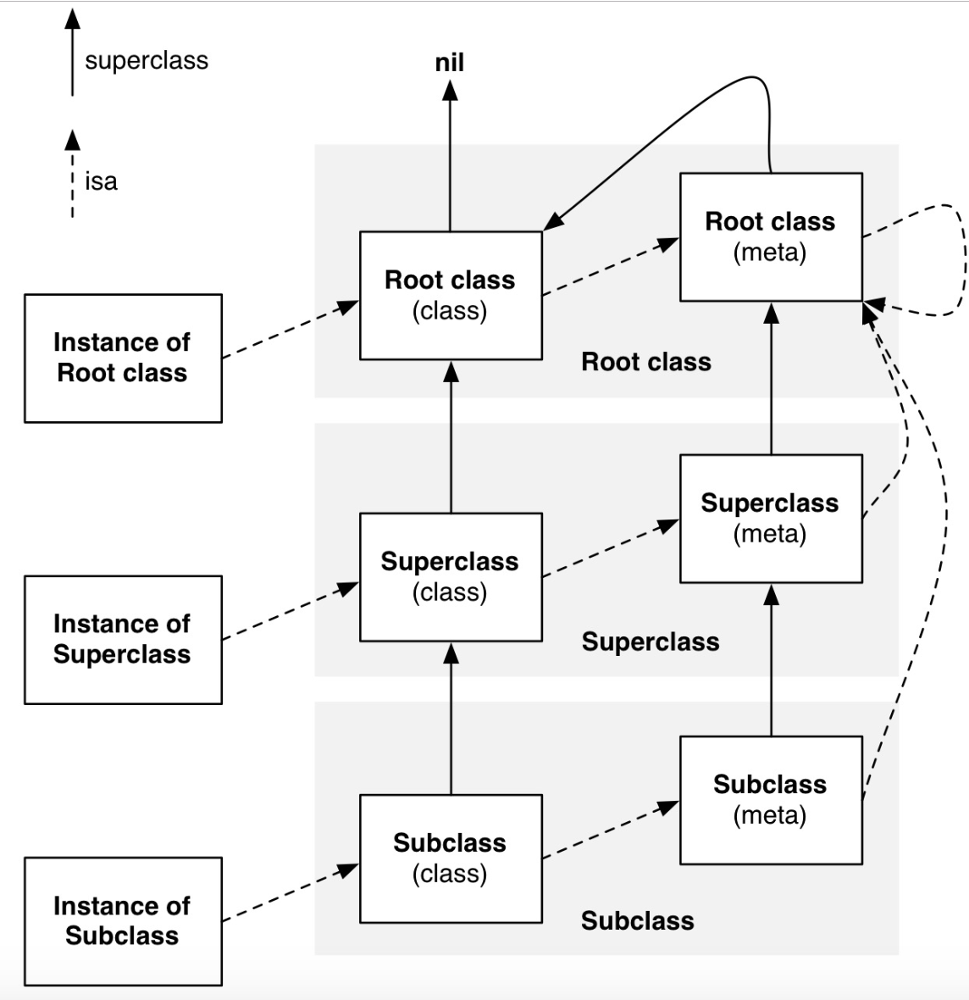

+++
title = "Objective-C底层原理 - NSObject"
date = '2026-05-02T22:32:27+08:00'
draft = false
weight = 9
tags = ["iOS", "面试", "基础"]
categories = ["iOS开发", "面试"]
+++
本文将深入探讨`Objective-C`中所有对象的基类`NSObject`的底层实现原理，涵盖对象本质、isa指针机制、Tagged Pointer、引用计数、内存布局等核心概念。

## NSObject 的本质：C 结构体

在`Objective-C`的底层实现中，`NSObject`的本质是一个`C`结构体。在苹果运行时源码中可以看到：

```c
// 底层运行时定义
struct objc_object {
    Class isa;  // 指向对象所属类的指针
};

// 类型别名定义
typedef struct objc_object NSObject;
```

这意味着，当我们通过`NSObject *obj = [[NSObject alloc] init];`创建一个 NSObject 实例时，实际上在堆上分配了一个`struct objc_object`结构体，而变量`obj`只是一个指向该结构体的指针。

```objc
// 这行代码在底层实际上做了类似下面的事情：
NSObject *obj = [[NSObject alloc] init];

// 等效的伪C代码:
// 1. 调用 alloc 类方法，其核心是调用 malloc 在堆上分配一块足够大的内存
//    大小至少是 sizeof(struct objc_object)，即一个isa指针的大小
NSObject *obj = (NSObject *)malloc(sizeof(struct objc_object));

// 2. 初始化这块内存，最重要的是设置 isa 指针，让它指向 NSObject 这个类
obj->isa = [NSObject class]; // 实际过程更复杂，但本质如此

// 3. 其他初始化工作 (init)
```

那么这里提到的`isa`指针是什么呢？

## isa

通俗的讲，`isa`是对象与其类的连接。每个`Objective-C`对象结构体的第一个成员都是一个`isa`指针。它指向对象的类（Class），类中包含了对象的元数据（方法列表、属性列表、协议列表等），这是`Objective-C`动态消息派发的基石。关于消息发送和消息转发的详细机制，请参考 [Runtime]()。

### 传统isa指针

在传统的运行时系统（主要在32位系统时代），`isa`的设计非常简单直接：

```c
typedef struct objc_class *Class;

struct objc_object {
    Class isa;
};
```

在这种设计下，`isa`就是一个普通的指针，直接指向对象的类（`objc_class`结构体）。

### 优化的isa指针（Non-Pointer isa）

为了在64位系统中提高性能和节省内存，苹果引入了**非指针isa**（Non-pointer isa）的概念。由于64位地址空间非常大，对象地址并不需要全部64位来表示，苹果巧妙地利用剩余的位来存储对象的元信息。

在理解Non-Pointer isa的具体实现之前，需要先了解两个关键的C语言底层概念：**联合体**和**位域**。

#### 前置知识：联合体（union）

联合体是C语言中一种特殊的数据类型，它的所有成员**共享同一块内存**，大小由最大的成员决定。由于所有成员占用的是同一块内存地址，当往其中一个成员写入值时，其他成员的值就会被覆盖，因此在任一时刻只有一个成员的值是有效的。

```c
union Example {
    int    intValue;    // 4 字节
    float  floatValue;  // 4 字节
};
// 整个 union 大小 = 4 字节，两个成员共享这块内存

union Example u;
u.intValue = 42;       // 此时 intValue 有效，floatValue 的值无意义
u.floatValue = 3.14f;  // 此时 floatValue 有效，intValue 被覆盖，值无意义
```

不过在底层编程中，联合体更常见的用法是**类型双关**（type punning）——不是先后写入不同成员，而是对同一块内存提供不同的解读视角。`isa_t`正是这种用法。

#### 前置知识：位域（Bit Field）

位域是C语言中一种特殊的结构体成员声明方式，允许精确地指定一个成员占用多少个**二进制位（bit）**，而不是占用完整的字节。

**语法：** `类型 成员名 : 位数;`

```c
struct Flags {
    unsigned int isVisible  : 1;  // 只占 1 bit，取值 0 或 1
    unsigned int isEnabled  : 1;  // 只占 1 bit
    unsigned int state      : 3;  // 占 3 bits，取值 0~7
    unsigned int priority   : 4;  // 占 4 bits，取值 0~15
};
// 以上 4 个字段总共只需要 9 bits
```

**为什么需要位域？** 通常一个`BOOL`变量至少占1字节（8位），但实际上只需要1个bit就能表示`0`或`1`，剩下的7个bit都是浪费。位域允许多个字段共享同一块内存中的不同位，从而极大地压缩存储空间。

编译器会自动为位域字段生成位运算代码来进行读写。例如要读取上例中`state`的值，编译器生成的操作类似于：

```c
unsigned int state = (flags_value >> 2) & 0x7;  // 右移2位，掩码取低3位
```

#### isa_t 的实现

理解了联合体和位域之后，来看`isa_t`的实际定义。在这种优化下，`isa`不再是单纯的指针，而是一个联合体`isa_t`，既可以表示类指针，也可以包含额外的对象信息：

```c
union isa_t {
    // 解读方式一：一个单纯的、未优化的 Class 指针，指向类对象
    Class cls;

    // 解读方式二：位域结构体
    // 这是非指针 isa 的核心，将 64 位的值分解为多个有意义的字段
    struct {
        uintptr_t nonpointer        : 1;  // 0: 普通指针 isa; 1: 非指针 isa（本结构体有效）
        uintptr_t has_assoc         : 1;  // 对象是否含有或曾含有关联对象。如果没有，析构时更快
        uintptr_t has_cxx_dtor      : 1;  // 对象是否有 C++/ObjC 析构函数。如果没有，析构时更快
        uintptr_t shiftcls          : 33; // 位移压缩后的类对象指针地址
        uintptr_t magic             : 6;  // 用于调试器判断对象是否完成初始化
        uintptr_t weakly_referenced : 1;  // 对象是否被弱引用指向过。如果没有，析构时更快
        uintptr_t deallocating      : 1;  // 对象是否正在被释放
        uintptr_t has_sidetable_rc  : 1;  // 引用计数是否溢出，需要用到侧表（SideTable）
        uintptr_t extra_rc          : 19; // 对象的引用计数减 1 后的值（如引用计数为 5，则 extra_rc = 4）
        // 总共 1+1+1+33+6+1+1+1+19 = 64 位
    } bits;
};
```

由于`cls`和`bits`是联合体的两个成员，它们共享同一块8字节的内存。当`nonpointer = 0`时，整块内存就是一个普通的类指针（`cls`）；当`nonpointer = 1`时，按位域方式解读（`bits`），从中提取类指针和各种元信息。

#### 位域带来的空间优势

如果不使用位域，要存储这些信息大约需要：

| 信息 | 常规存储 | 位域存储 |
|------|---------|---------|
| 6 个布尔标志 | 6 字节（每个 BOOL 至少 1 字节） | 6 bits |
| 类指针 | 8 字节 | 33 bits |
| magic 值 | 4 字节 | 6 bits |
| 引用计数 | 4~8 字节 | 19 bits |
| **合计** | **约 22~26 字节** | **64 bits = 8 字节** |

通过位域，苹果将所有信息压缩进了**一个指针大小（8字节）** 的空间，节省了近三分之二的内存。对于运行时可能存在成千上万个对象的场景，这种优化效果非常显著。

## Tagged Pointer

Non-Pointer isa 是在对象已经存在于堆上的前提下，优化 isa 指针中的空闲位来附带元信息。而 **Tagged Pointer** 则更进一步——对于某些足够小的值，直接将数据编码进"指针"本身，**根本不在堆上分配对象**。

### 问题背景

在64位系统上，一个指针占8字节。考虑一个简单的场景：

```objc
NSNumber *age = @(25);
```

如果按照常规流程，系统需要在堆上分配一个`NSNumber`对象（至少16字节：8字节isa + 8字节存储值），再让`age`指针指向它。但实际上，整数`25`只需要很少的位就能表示。为这样一个小值去做一次`malloc`、维护引用计数、最终还要`free`，开销和价值严重不成比例。

### 核心思想

Tagged Pointer 的核心思想是：**当对象的值足够小时，直接把类型标记和值一起编码在指针的64位空间里，让"指针"本身就是数据。**

这意味着这个"指针"不再指向任何堆内存，它本身就承载了完整的对象信息。运行时通过检查指针的特定标记位来判断它是一个真正的堆对象指针，还是一个 Tagged Pointer。

### 内存布局

Tagged Pointer 的64位空间被划分为三部分：

| 位范围 | 字段 | 说明 |
|--------|------|------|
| bit 63 | 标记位 | 1 = Tagged Pointer，0 = 普通指针 |
| bit 62~60 | 类型标签 | 标识对象类型（3位，可编码8种基础类型） |
| bit 59~0 | 数据载荷 | 存储实际的值（60位） |

类型标签的常见映射：

| 标签值 | 类型 |
|--------|------|
| 0 | `NSAtom`（保留） |
| 1 | 保留 |
| 2 | `NSString`（短字符串） |
| 3 | `NSNumber` |
| 4 | `NSIndexPath` |
| 5 | `NSManagedObjectID` |
| 6 | `NSDate` |
| 7 | 扩展标签（用于更多类型，此时会从数据载荷中借用额外8位作为扩展标签） |

### 示例分析

```objc
NSNumber *a = @(1);      // Tagged Pointer：值足够小，直接编码在指针中
NSNumber *b = @(42);     // Tagged Pointer
NSNumber *c = @(3.14);   // Tagged Pointer（浮点数也可以，取决于精度）
NSNumber *d = @(LONG_MAX); // 可能需要堆分配，取决于值是否超出载荷位数
```

对于`@(42)`，运行时不会调用`alloc`/`init`，而是直接构造一个编码了类型标签（`NSNumber`=3）和值（42）的特殊"指针"返回。

### 性能优势

| 维度 | 普通对象 | Tagged Pointer |
|------|---------|----------------|
| 内存分配 | 堆上分配（`malloc`） | 无需分配，值就在指针里（指针本身在栈上或寄存器中） |
| 引用计数 | 需要维护（isa中或侧表中） | 无需维护，不参与引用计数 |
| 释放 | 需要释放（`free`） | 无需释放 |
| 访问速度 | 需要解引用指针，访问堆内存 | 直接从指针中提取值，无间接访问 |
| 缓存友好性 | 堆对象分散在不同内存区域 | 值就在栈上/寄存器中，缓存命中率高 |

在一个典型的应用中，大量的`NSNumber`和短字符串都能受益于 Tagged Pointer，节省可观的堆内存和对象生命周期管理开销。

### Tagged Pointer 的运行时特殊处理

由于 Tagged Pointer 不是真正的堆对象，运行时的许多操作都需要对其做特判：

- **`retain`/`release`**：直接返回，不做任何操作（没有引用计数可维护）
- **`dealloc`**：永远不会被调用
- **弱引用**：不支持对 Tagged Pointer 创建弱引用，因为它没有侧表，也永远不会"释放"
- **`isa`访问**：Tagged Pointer 没有 isa 字段，运行时通过标签位识别类型，并返回对应的类对象

```c
inline bool objc_object::isTaggedPointer() {
    return _objc_isTaggedPointer(this);
}

static inline bool _objc_isTaggedPointer(const void * _Nullable ptr) {
    // arm64: 检查最高位是否为1
    return ((uintptr_t)ptr & _OBJC_TAG_MASK) == _OBJC_TAG_MASK;
}
```

### 安全性：指针混淆

从iOS 14 / macOS 11开始，苹果对 Tagged Pointer 的值进行了**混淆（obfuscation）** 处理。运行时会在进程启动时生成一个随机值`objc_debug_taggedpointer_obfuscator`，Tagged Pointer 在存储时与该随机值做异或运算，读取时再异或回来：

```c
static inline uintptr_t _objc_decodeTaggedPointer(const void * _Nullable ptr) {
    return (uintptr_t)ptr ^ objc_debug_taggedpointer_obfuscator;
}
```

这使得攻击者无法直接从内存中读取或伪造 Tagged Pointer 的值，提升了安全性。

## 类对象与元类对象

### 类对象（Class Object）

在`Objective-C`中"万物皆对象"，类本身也是一个对象，称为**类对象**。实例对象的`isa`指针正是指向这个类对象。

类对象是描述一个类的结构体，它存储了创建和管理该类实例所需的所有信息：

- **实例方法列表**：该类所有实例方法的实现
- **实例变量描述**：成员变量的类型、偏移量等布局信息  
- **属性列表**：属性的getter/setter方法映射
- **协议列表**：该类遵循的协议信息

那么类对象的`isa`指向的是谁呢？答案是指向的元类（meta class）。

### 元类对象（Meta-Class Object）

**元类**是描述类对象的类。既然类本身也是对象，那么类对象也需要有自己的类，这就是元类的作用。

**元类的主要职责：**
- 存储**类方法**（class methods）的实现
- 管理类方法相关的元数据信息

例如，当我们调用类方法`[NSString stringWithFormat:@"Hello"];`时，消息派发流程为：
NSString类对象 → NSString元类 → 查找类方法 → 执行实现

### isa与继承关系图

苹果官方提供的关系图清晰地展示了对象、类、元类之间的关系：



从图中可以看出，运行时存在两条核心链：

#### isa链

isa链决定了消息派发时去哪里查找方法：

1. **实例对象 → 类对象**：实例方法存储在类对象中
2. **类对象 → 元类对象**：类方法存储在元类中
3. **元类对象 → 根元类**：所有元类的isa最终指向NSObject的元类（根元类）
4. **根元类 → 根元类自身**：根元类的isa指向自己，形成闭环

#### superclass继承链

superclass链决定了方法查找时的继承回溯路径：

- **类对象继承链**：`SubClass → SuperClass → ... → NSObject → nil`
- **元类继承链**：`SubClass元类 → SuperClass元类 → ... → 根元类（NSObject元类） → NSObject类对象 → nil`

注意元类继承链的最后一环：**根元类的superclass指向的是NSObject类对象**，而不是nil。这是一个刻意的设计，目的是让NSObject的实例方法能够作为类方法调用的兜底。

例如，NSObject定义了实例方法`-description`，但没有定义类方法`+description`。当我们调用`[NSObject description]`时，查找路径为：

1. 通过isa找到根元类，查找`+description` — 未找到
2. 根元类的superclass指向NSObject类对象，继续在NSObject类对象中查找 — 找到了`-description`
3. 执行该方法

## 引用计数机制

### 引用计数的存储策略

在前面介绍isa位域时，我们提到了两个与引用计数相关的字段：`extra_rc`和`has_sidetable_rc`。这揭示了Objective-C对象引用计数的巧妙存储策略。

#### 小引用计数：isa内嵌存储

对于大多数对象，引用计数通常不会很大，苹果充分利用了isa指针中的空闲位来存储引用计数：

```c
struct {
    uintptr_t extra_rc          : X; // 对象的实际引用计数减1后的值（X位数因架构而异）
    uintptr_t has_sidetable_rc  : 1; // 引用计数是否存储在侧表中
    // ... 其他字段
} bits;
```

**存储规则：**
- `extra_rc`存储的是**引用计数减1**的值
- 例如：对象引用计数为5，则`extra_rc = 4`
- `extra_rc`的位数在不同架构下有所不同：
  - **arm64架构**：通常为19位，可存储0到524287（引用计数1到524288）
  - **x86_64架构**：通常为8位，可存储0到255（引用计数1到256）

#### 大引用计数：侧表存储

当对象的引用计数超出isa中`extra_rc`字段的存储能力时，系统会启用**侧表**（SideTable）机制：

```c
struct SideTable {
    os_unfair_lock slock;       // 锁，保证线程安全（早期 objc4 使用过 spinlock_t）
    RefcountMap refcnts;        // 引用计数哈希表
    weak_table_t weak_table;    // 弱引用表
};
```

- `has_sidetable_rc = 1`表示引用计数存储在侧表中
- 侧表使用哈希表`RefcountMap`存储对象指针到引用计数的映射
- 支持存储任意大小的引用计数值
- 对于传统的指针isa（32位），引用计数也是存储在侧表（SideTable）的哈希表中。

### 引用计数与弱引用

值得注意的是，`weakly_referenced`位域标记了对象是否被弱引用过：

```c
uintptr_t weakly_referenced : 1;  // 对象是否被弱引用指向过
```

当对象被弱引用时：
- 系统会在侧表的`weak_table`中记录弱引用关系
- 对象释放时，运行时会自动将所有指向该对象的弱引用置为nil
- 这个过程需要遍历弱引用表，因此`weakly_referenced`标志有助于优化释放性能

关于弱引用的详细实现原理，请参考[weak详解]()；关于iOS内存管理的完整介绍，请参考[iOS中的内存管理]()。

## 内存分布

### 实例对象的内存布局

一个 Objective-C 实例在堆内存中的完整布局是一个结构体。这个结构体可以分解为以下几个部分，从上到下（从低地址到高地址）依次是：

1. **isa 指针**：所有对象的起点，占用 8 字节
2. **父类实例变量**：如果这个类有父类，接下来会包含所有父类定义的实例变量
3. **本类实例变量**：本类定义的实例变量
4. **内存对齐填充**：用于内存对齐，优化 CPU 访问速度的填充字节

### 内存布局实例分析

让我们用一个具体的例子来详细分析。假设我们有这样一个继承关系：

```objc
// NSObject 是根类，它默认没有任何公开的实例变量
@interface Animal : NSObject
{
    @public
    int _legCount;
}
@end

@interface Dog : Animal
{
    @public
    NSString *_name;
    BOOL _isGoodBoy;
}
@end
```

当我们创建一个 Dog 对象时：`Dog *myDog = [[Dog alloc] init];`，它在堆上的内存结构如下： (64位环境)

| 地址偏移 (Bytes) | 内容 | 说明 |
|-----------------|------|------|
| 0x0 - 0x7 | isa_t isa | 指向 Dog 类的结构体，并包含位域信息 (extra_rc 等) |
| 0x8 - 0xB | int _legCount | 从父类 Animal 继承来的实例变量 |
| 0xC - 0xF | (对齐填充 padding) | 为了满足内存对齐要求，编译器自动插入的空白字节 |
| 0x10 - 0x17 | NSString *_name | Dog 类自己定义的实例变量（指针，占8字节） |
| 0x18 - 0x18 | BOOL _isGoodBoy | Dog 类自己定义的实例变量（占1字节） |
| 0x19 - 0x1F | (对齐填充 padding) | 为了将整个结构体大小对齐到8字节的倍数 |

**总大小：** 32字节 (0x20)

### 类对象的内存结构

#### objc_class结构体

类对象本身也是一个复杂的内存结构。在运行时源码中，类对象的结构定义如下：

```c
struct objc_class {
    Class isa;                    // 类对象的isa指向元类
    Class superclass;             // 指向父类的指针
    cache_t cache;                // 方法缓存，用于提高方法调用性能
    class_data_bits_t bits;       // 包装器，指向类的详细数据
    
    // 通过bits可以获取到类的运行时数据
    class_rw_t *data() const {
        return bits.data();
    }
};
```

**字段详解：**

- **isa**：类对象的isa指针指向对应的元类
- **superclass**：指向父类，用于建立继承关系链，支持方法继承查找
- **cache**：方法缓存，存储最近调用过的方法，显著提高后续调用效率
- **bits**：实际的类的元数据容器，是一个巧妙的包装器，通过它可以访问类的所有元信息

#### 类的元数据（Metadata）

**什么是类的元数据？**

类的元数据是描述类本身的数据，包含了类的所有结构信息：

- 类的名称、大小、版本信息
- 实例变量列表（ivars）- 决定实例对象的内存布局
- 方法列表（methods）- 包含实例方法和类方法
- 属性列表（properties）- 属性的getter/setter映射
- 协议列表（protocols）- 类遵循的协议信息
- 继承关系信息 - 父类指针等

#### 三层架构关系

Objective-C运行时采用了精巧的三层架构来组织类的元数据：

```c
objc_class (类对象)
    ↓ (通过 bits 字段)
class_rw_t (运行时可读写数据)
    ↓ (通过 ro 字段)  
class_ro_t (编译时只读数据)
```

**1. class_rw_t（可读可写）**
包含了类在运行时可被修改的信息：

```c
struct class_rw_t {
    uint32_t flags;
    uint32_t version;
    const class_ro_t *ro;        // 指向只读信息，编译时确定
    method_array_t methods;      // 方法列表（包含分类添加的方法）
    property_array_t properties; // 属性列表
    protocol_array_t protocols;  // 协议列表
    // ... ...
};
```

当运行时对类进行[realize（实现加载）]()时，会创建`class_rw_t`，并将`class_ro_t`中的`baseMethodList`作为基础方法列表。如果该类有Category，运行时会将Category中的方法**插入到方法列表的前面**，与类本身的方法合并成一份完整的方法列表。

这意味着，如果Category中定义了与类本身同名的方法，由于运行时查找方法是从前往后遍历方法列表的，会先找到Category的方法并执行，**表现上像是"覆盖"了原方法，但原方法仍然存在于列表中，并没有被真正替换或删除**。如果多个Category都定义了同名方法，最终生效的是最后参与编译的那个Category（由Xcode中Build Phases → Compile Sources的文件顺序决定），因为它的方法会被插入到列表的最前面。

**2. class_ro_t（只读）**
包含了类在编译时就已经确定的核心信息：

```c
struct class_ro_t {
    uint32_t flags;
    uint32_t instanceStart;
    uint32_t instanceSize;       // 类的实例对象的大小！
    const char * name;           // 类名
    const ivar_list_t * ivars;   // 实例变量列表（决定了实例的内存布局）
    const method_list_t * baseMethodList;
    const protocol_list_t * baseProtocols;
    const property_list_t * baseProperties;
    // ... ...
};
```

`class_ro_t`是在编译时确定的只读数据，其中的`instanceSize`（对象大小）和`ivars`（实例变量布局）都已经固化。这也说明了一个重要问题：**为什么分类不能（通过常规方式）添加实例变量？**
因此，分类被设计为只能添加**行为**（方法），而不能修改**结构**（实例变量），这确保了运行时的内存安全和对象稳定性。

不过，通过 Runtime 提供的关联对象（Associated Objects）机制，可以在 Category 中为对象动态添加存储。详细介绍请参考 [Runtime]() 中的关联对象章节

### 实例对象与类对象的内存对比

通过上面的分析，可以清晰地看到实例对象和类对象在内存层面的本质区别：

| 对比维度 | 实例对象 | 类对象 |
|---------|---------|--------|
| 底层结构体 | `objc_object`（isa + 实例变量） | `objc_class`（isa + superclass + cache + bits） |
| 存储内容 | 具体的数据值（成员变量的值） | 类的描述信息（方法列表、属性列表、实例变量描述等） |
| 内存中的数量 | 同一个类可以创建无数个实例 | 每个类在内存中只有唯一一份类对象 |
| isa 指向 | 指向类对象（用于查找实例方法） | 指向元类对象（用于查找类方法） |

两者之所以都被称为"对象"，是因为 `objc_class` 继承自 `objc_object`，它们的第一个成员都是 `isa`。这正是 Objective-C 中"万物皆对象"得以成立的底层基础 —— 无论是实例、类还是元类，运行时都可以通过 `isa` 统一进行消息派发。但在 `isa` 之后，两者的内存布局走向了完全不同的方向：实例对象紧接着存放的是各级实例变量的值，而类对象紧接着存放的是 `superclass` 指针、方法缓存和指向元数据的 `bits`。

---

## 常见面试题

### Q1: NSObject中的isa是什么？

`isa`是`NSObject`底层结构体`objc_object`的第一个成员，是每个Objective-C对象与其类之间的连接。它指向对象所属的类对象（Class），类对象中包含了对象的元数据（方法列表、属性列表、协议列表等）。类对象同样有isa，类对象的isa则指向其对应的**元类对象**（Meta-Class），用于查找类方法。

`isa`是Objective-C动态消息派发的基石——当调用一个方法（如`[obj doSomething]`）时，运行时并不是直接跳转到函数地址，而是先通过对象的`isa`找到其所属的类对象，再在类对象的方法列表中查找对应的方法实现；找不到则沿`superclass`继承链向上回溯。没有`isa`，运行时就无从知道对象属于哪个类，也就无法完成任何方法查找，因此它是整个动态派发体系的起点和基础。

在传统的32位系统中，`isa`是一个普通的`Class`指针，直接指向对象所属的类对象。在64位系统上，苹果引入了**Non-Pointer isa**优化方案，将`isa`从一个单纯的指针改为联合体`isa_t`，利用位域技术将64位空间划分为多个字段，在存储类对象指针（`shiftcls`，33位）的同时，还额外存储了引用计数（`extra_rc`，19位）、是否有关联对象（`has_assoc`）、是否被弱引用（`weakly_referenced`）等元信息。通过这种优化，将原本需要约22~26字节存储的信息压缩到了8字节，对于运行时大量对象的场景，内存节省非常显著。

### Q2: 实例对象、类对象、元类对象之间的isa和继承关系是怎样的？


**isa链：**
- 实例对象的isa指向类对象（查找实例方法）
- 类对象的isa指向元类对象（查找类方法）
- 元类对象的isa指向根元类（NSObject的元类）
- 根元类的isa指向自身，形成闭环

**superclass继承链：**
- 类对象继承链：`SubClass → SuperClass → ... → NSObject → nil`
- 元类继承链：`SubClass元类 → SuperClass元类 → ... → 根元类 → NSObject类对象 → nil`

注意：根元类的superclass指向NSObject类对象而非nil，这使得NSObject的实例方法可以作为类方法调用的兜底。例如调用`[NSObject description]`时，如果根元类中找不到`+description`，会沿superclass回溯到NSObject类对象，找到并执行`-description`。

### Q3: Objective-C对象的引用计数存储在哪里？

引用计数采用两级存储策略：

**1. isa内嵌存储（小引用计数）：** 在Non-Pointer isa模式下，`extra_rc`字段直接存储引用计数减1后的值。arm64架构下为19位，最多可表示524288的引用计数。

**2. 侧表存储（大引用计数）：** 当`extra_rc`溢出时，`has_sidetable_rc`标记为1，引用计数转存到`SideTable`结构体中的`RefcountMap`哈希表中，支持任意大小的引用计数。对于传统指针isa（32位系统），引用计数也存储在侧表中。

### Q4: Category可以添加实例变量、实例方法、类方法吗？

**实例方法和类方法：可以添加。** Category中定义的方法会在运行时被合并到类对象的`class_rw_t`方法列表中（类方法则合并到元类的`class_rw_t`中）。需要注意的是，Category的方法会被插入到方法列表的**前面**，如果定义了与类本身同名的方法，运行时会先找到Category的方法并执行，表现上像是"覆盖"了原方法，但原方法仍然存在于列表中，并没有被真正替换或删除。

**实例变量：不能添加。** 这要从类对象的元数据存储结构说起。Objective-C运行时采用三层架构来组织类对象的元数据：`objc_class` → `class_rw_t` → `class_ro_t`。其中`class_rw_t`是运行时可读可写的数据层，存储了方法列表、属性列表、协议列表等运行时可动态修改的信息；而`class_ro_t`是编译时生成的只读数据层，存储了类的实例变量列表（`ivars`）和实例大小（`instanceSize`）等在编译期就已固化的信息。

| 对比维度 | class_rw_t | class_ro_t |
|---------|-----------|-----------|
| 读写性 | 运行时可读可写 | 编译时确定，只读 |
| 创建时机 | 运行时对类进行realize时创建 | 编译期生成 |
| 方法列表 | 合并后的完整方法列表（类本身 + 分类添加的方法） | 只包含类本身编译时定义的基础方法（baseMethodList） |
| 实例变量 | 不包含 | 包含ivars列表，决定实例内存布局 |

关键在于：实例变量信息存储在只读的`class_ro_t`中，编译后无法修改。而Category是在运行时加载的，如果允许它修改实例变量布局，就会改变`instanceSize`和`ivars`，导致所有已创建对象的内存结构失效，引发内存安全问题。因此Category只能添加行为（方法），不能修改结构（实例变量）。不过可以通过Runtime提供的关联对象（Associated Objects）机制间接实现存储功能。

### Q5: 什么是Tagged Pointer？和Non-Pointer isa有什么区别？

**Tagged Pointer** 和 **Non-Pointer isa** 都是苹果在64位系统上针对指针空间的优化，但优化的对象和层次不同：

**Non-Pointer isa** 优化的是**已存在于堆上的对象的 isa 指针**。对象仍然通过`malloc`分配在堆上，只是把 isa 的64位空间拆分为位域，在存储类指针的同时附带引用计数、关联对象标志等元信息。

**Tagged Pointer** 优化的是**小值对象本身**。对于`NSNumber`、短`NSString`、`NSDate`等值足够小的对象，直接将类型标签和数据值编码在"指针"的64位空间中，**根本不在堆上分配对象**。这个"指针"不指向任何内存，它本身就是数据（指针本身在栈上或寄存器中）。

| 对比维度 | Non-Pointer isa | Tagged Pointer |
|---------|----------------|----------------|
| 优化目标 | 堆对象的 isa 指针中的空闲位 | 小值对象的指针本身 |
| 是否有堆分配 | 有 | 无 |
| 引用计数 | 需要维护（内嵌在 isa 或侧表中） | 不需要 |
| 适用对象 | 所有 ObjC 对象 | `NSNumber`、短`NSString`、`NSDate`等小值对象 |
| 判断方式 | isa 中的 `nonpointer` 位 | 指针最高位（arm64）或最低位（x86_64） |

Tagged Pointer 带来的性能收益比 Non-Pointer isa 更显著，因为它完全跳过了堆分配、引用计数管理和释放的全部流程。

**Swift 中的对应：** Swift 的值类型（`Int`、`Double`等）天然是栈分配的，不需要 Tagged Pointer。但在桥接为 OC 对象（如`NSNumber`）时仍会复用 Tagged Pointer 机制。此外，Swift 的`String`有自己的小字符串内联优化（15字节以内直接存储在结构体中），思路与 Tagged Pointer 一脉相承。

### Q6: Tagged Pointer对象能否被弱引用？对retain/release有什么影响？

**弱引用：不支持。** Tagged Pointer 不是真正的堆对象，没有侧表（SideTable），也永远不会被释放，因此无法在`weak_table`中注册弱引用关系。运行时在创建弱引用时会通过`isTaggedPointerOrNil()`检查，如果是 Tagged Pointer 则直接返回原值，不做任何弱引用注册。

**retain/release：空操作。** Tagged Pointer 没有引用计数的概念，运行时在执行`retain`和`release`时会先判断是否为 Tagged Pointer，如果是则直接返回，不做任何操作。`dealloc`也永远不会被调用。

这些特判是 Tagged Pointer 性能优势的重要来源——省去了引用计数的原子操作和侧表查找的开销。

### Q7: 实例对象和类对象在底层有什么区别？它们的内存结构分别是怎样的？

两者的底层结构体不同，但都以`isa`开头，这是Objective-C"万物皆对象"的基础。

**实例对象**的底层结构体是`objc_object`，内存从低地址到高地址依次是：

1. **isa指针**（8字节）：指向类对象，用于查找实例方法
2. **父类实例变量**：按继承链从上到下依次排列
3. **本类实例变量**：本类定义的成员变量
4. **内存对齐填充**：编译器插入的padding字节，确保整体大小为指针大小的倍数

实例对象存储的是具体的数据值，同一个类可以创建无数个实例对象。

**类对象**的底层结构体是`objc_class`（继承自`objc_object`），内存结构为：

1. **isa指针**（8字节）：指向元类对象，用于查找类方法
2. **superclass指针**（8字节）：指向父类，建立继承链
3. **cache**：方法缓存，存储最近调用过的方法以提高调用效率
4. **bits**：指向类的元数据（`class_rw_t` → `class_ro_t`），包含方法列表、属性列表、协议列表、实例变量描述等

类对象存储的是类的描述信息，每个类在内存中只有唯一一份类对象。
