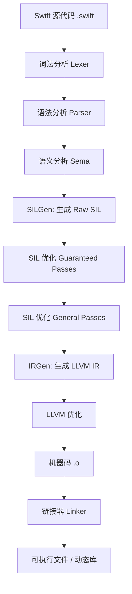
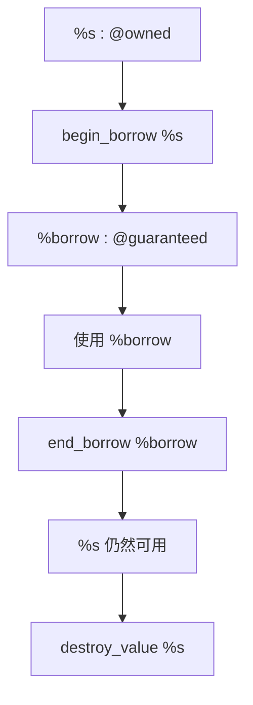
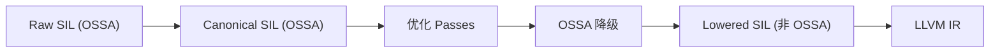

+++
title = "SIL（Swift Intermediate Language）"
date = '2026-05-02T22:32:27+08:00'
draft = false
weight = 10
tags = ["iOS", "面试", "基础"]
categories = ["iOS开发", "面试"]
+++
SIL（Swift Intermediate Language，Swift 中间语言）是 Swift 编译器在编译过程中生成的一种**中间表示**（Intermediate Representation，IR）。它位于 Swift 源码与 LLVM IR 之间，是 Swift 编译器架构中至关重要的一层。

SIL 的设计目标是：

- 对 Swift 语言的**高级语义**进行精确建模
- 在**高层抽象**的基础上执行强大的优化
- 保留足够的类型信息，用于**诊断**和**安全检查**
- 作为 Swift 特有优化的载体，弥补 LLVM IR 无法直接表达 Swift 语义的不足

> SIL 并不是给开发者日常编写的语言，而是编译器的内部表示。理解它有助于深入理解 Swift 的编译过程、性能优化原理和内存管理机制。

## Swift 编译流程概览

在了解 SIL 之前，需要先理解 Swift 的整体编译流程：



### 各阶段简述

#### 词法分析（Lexer）

编译的第一步。Lexer 逐字符扫描 `.swift` 源文件，将其切分为一系列**Token（词法单元）**，例如关键字 `func`、标识符 `add`、运算符 `+`、字面量 `42`、左右括号等。Token 是后续所有分析的最小输入单位。这一步会剥离注释和空白，但保留它们的位置信息以便后续生成精确的诊断信息（错误提示的行号和列号）。

#### 语法分析（Parser）

Parser 读取 Token 流，根据 Swift 的语法规则将其组织为 **AST（Abstract Syntax Tree，抽象语法树）**。AST 是源码的树形结构化表示——每个节点对应一个语法结构，例如函数声明、if 语句、表达式等。此时 AST 中的类型信息尚未完全确定，例如 `let x = 1 + 2` 中 `x` 的类型还没有被推断。

```
// 源码: func add(_ a: Int, _ b: Int) -> Int { return a + b }
// AST 大致结构（简化）:
FuncDecl "add"
├── ParamDecl "a" : Int
├── ParamDecl "b" : Int
├── ReturnType: Int
└── Body
    └── ReturnStmt
        └── BinaryExpr "+"
            ├── DeclRefExpr "a"
            └── DeclRefExpr "b"
```

#### 语义分析（Sema）

语义分析是整个前端中最复杂的阶段。它在 AST 上执行：

- **类型推断**：根据上下文推断变量、表达式的类型（Swift 的类型推断依赖一个**约束求解器**，Constraint Solver）
- **类型检查**：验证类型是否匹配，例如不能将 `String` 赋值给 `Int`
- **重载决议**：当存在多个同名函数时，根据参数类型选择正确的重载
- **协议一致性检查**：验证类型是否正确实现了声明遵循的协议
- **访问控制检查**：确保 `private`、`internal`、`public` 等访问级别被正确遵守

经过语义分析后，AST 中的每个表达式都有了确定的类型信息，此时称为**类型标注 AST（Type-checked AST）**。

#### SILGen

SILGen 将类型标注 AST **降低（lower）** 为 **Raw SIL**。这是从树形结构到线性指令序列的关键转换：

- AST 中的控制流结构（if/else、for、switch）被转换为**基本块（Basic Block）**和**分支指令**组成的控制流图（CFG）
- 表达式被转换为 SSA（Static Single Assignment）形式的指令序列
- 编译器**保守地**插入所有必要的 retain/release、copy/destroy 等内存管理指令
- 函数调用、方法派发、协议见证等高级语义被显式表达为 SIL 指令

Raw SIL 是语义完整但**未经优化**的——它包含大量冗余操作，但保证了与源码语义的忠实对应。

#### SIL 优化

SIL 优化分为两个阶段依次执行：

1. **Guaranteed Optimization Passes（必要 Pass）**：无论优化级别如何都会执行，包括诊断检查（确定初始化、不可达代码）、排他性检查、所有权验证等。这些 Pass 的主要目的是**发现错误**而非提升性能。
2. **General Optimization Passes（通用优化 Pass）**：在 `-O` 优化模式下执行，包括 ARC 优化、泛型特化、去虚拟化、函数内联、死代码消除、闭包优化等。这些 Pass 的目的是**提升运行时性能**。

经过优化后，Raw SIL 变为 **Canonical SIL（标准化 SIL）**，冗余操作被消除，间接调用被转为直接调用，泛型代码被特化为具体类型版本。

#### IRGen

IRGen 将优化后的 Canonical SIL **降低**为 **LLVM IR**。这一步将 Swift 特有的高级概念映射到 LLVM 的通用表示：

- SIL 的类型系统被映射为 LLVM 的类型（struct、pointer 等）
- `alloc_ref` 等堆分配指令被转换为对 Swift 运行时函数（如 `swift_allocObject`）的调用
- VTable 和 Witness Table 被转换为全局常量数组
- 引用计数操作被转换为对运行时的 `swift_retain` / `swift_release` 调用

到这一步，Swift 特有的语义信息已经完成使命，后续交给 LLVM 的通用优化流水线。

#### LLVM 优化与代码生成

LLVM 接收 IR 后执行自己的优化 Pass（指令合并、循环优化、向量化、寄存器分配等），最终生成目标平台的**机器码（.o 目标文件）**。之后由链接器（Linker）将多个目标文件和库链接为最终的可执行文件或动态库。

SIL 处于这条流水线的**中间位置**，在 AST 之后、LLVM IR 之前，是 Swift 编译器执行高级优化的核心阶段。

## 为什么需要 SIL

LLVM IR 是一种面向 C/C++ 等语言设计的通用的低级中间表示，对 C/C++ 等语言已经足够。但 Swift 拥有许多高级特性（ARC、值语义、协议见证表、泛型特化等），LLVM IR 无法直接表达这些语义。因此 Swift 编译器引入了 SIL 这一层。

### SIL 解决的核心问题

#### 1. ARC 的 retain/release 冗余消除

Swift 使用 ARC（Automatic Reference Counting）管理引用类型的内存。编译器在 SILGen 阶段会**保守地**插入大量 `strong_retain` / `strong_release` 指令，以确保语义正确。但其中很多操作是冗余的——例如一个对象在同一作用域内被多次 retain 然后又立刻 release，中间没有任何可能导致引用归零的操作。

SIL 层的 ARC 优化 Pass 会对这些引用计数指令做**数据流分析**，识别并消除那些"配对"的、不影响对象生命周期的 retain/release。这是 LLVM IR 层面无法做到的，因为 LLVM IR 并不理解"引用计数"这一概念，retain/release 在 LLVM IR 中只是普通的函数调用。

```
// 优化前（SILGen 保守插入）
strong_retain %obj : $MyClass
%fn = function_ref @useObject
apply %fn(%obj)
strong_release %obj : $MyClass
strong_release %obj : $MyClass   // 作用域结束

// 优化后（SIL ARC Optimization Pass）
%fn = function_ref @useObject
apply %fn(%obj)
strong_release %obj : $MyClass   // 合并为一次 release
```

> **与 Objective-C 的对比**：OC 同样使用 ARC，但 OC 的编译器是 Clang，不经过 SIL，其 ARC 优化由 LLVM 内置的 ObjCARCOpt Pass 在 LLVM IR 层面完成（Clang 会把 retain/release 标记为 `@llvm.objc.retain` 等 intrinsic，让 LLVM 能识别其语义）。相比之下，Swift 的 SIL 拥有完整的所有权模型（OSSA），能通过 `@owned` / `@guaranteed` 标注在编译期精确判断值的所有权归属，从而做到比 OC 更激进的 ARC 优化。

#### 2. 泛型的性能开销消除

Swift 的泛型默认通过**[值见证表（Value Witness Table）]()**进行间接操作：复制、销毁、内存布局等都通过函数指针间接调用。这保证了泛型代码对所有类型都能工作，但会带来额外的间接调用开销和阻碍内联优化。

SIL 层的**[泛型特化（Generic Specialization）]()** Pass 会分析泛型函数的调用点，当能在编译期确定具体类型时，为该类型生成一个"去泛型"的特化版本。特化后的代码直接操作具体类型，无需经过值见证表的间接调用，性能接近手写的非泛型代码。

```swift
// 泛型函数
func max<T: Comparable>(_ a: T, _ b: T) -> T {
    return a > b ? a : b
}

// 调用点
let result = max(3, 5)  // 编译器已知 T = Int
```

SIL 特化后，会生成一个 `max<Int>` 的专用版本，内部直接使用 `Builtin.Int64` 的比较指令，而非通过 Comparable 协议的见证表间接比较。

#### 3. 协议的动态派发优化

协议方法的调用在默认情况下通过 **Witness Table（见证表）** 进行间接派发，类似于 C++ 的虚函数表。这种间接调用不仅本身有开销，还会阻止编译器做内联等后续优化。

SIL 层的**去虚拟化（Devirtualization）** Pass 会分析调用点的上下文：如果编译器能确定某个协议类型的值实际上是某个具体类型（例如通过内联暴露了具体类型信息），就可以将 `witness_method` 间接调用替换为 `function_ref` 直接调用（静态派发）。对于 class 的虚方法调用（`class_method`），如果编译器能确定具体的类（例如被 `final` 修饰），也可以做同样的优化。

```
// 优化前：通过 witness table 间接派发
%method = witness_method $@opened("...") Drawable, #Drawable.draw
apply %method(...)

// 优化后：直接调用具体实现（假设编译器确定是 Circle 类型）
%fn = function_ref @Circle.draw
apply %fn(...)
```

去虚拟化成功后，还可能触发**级联优化**：直接调用使得函数体对编译器可见，进而可以做内联、常量折叠等进一步优化。

#### 4. 编译期诊断与错误检测

SIL 具备完整的控制流图（CFG）和数据流信息，使编译器能够进行精确的**静态分析**，发现源码层面难以检测的错误：

- **Definite Initialization（确定初始化）**：确保 `let` 和 `var` 在所有可能的执行路径上都在使用前被赋值。这也是 Swift 中 `struct` 的 `init` 方法必须初始化所有存储属性的检查基础。
- **不可达代码检测**：通过分析 CFG 找到永远不会执行到的代码路径，发出警告。
- **switch 穷举检查**：结合类型信息和控制流分析，确保 `switch` 语句覆盖了所有可能的 case。

这些诊断都发生在 **Guaranteed Optimization Passes** 中，无论优化级别如何（即使是 `-Onone`）都会执行。

#### 5. 内存访问安全（Exclusivity Enforcement）

Swift 的 **内存排他性法则（Law of Exclusivity）** 规定：对同一块内存的访问不能同时存在一个写入访问和另一个访问（无论读写）。SIL 通过 `begin_access` / `end_access` 指令对内存访问区间进行标记，并在此基础上做两层检查：

- **编译期检查**：SIL 层的静态分析可以在编译期发现明确违规的情况（如同一作用域内对 `inout` 参数的重叠访问）。
- **运行时检查**：对于编译期无法确定的情况（如通过闭包捕获的变量），编译器会在 SIL 中插入运行时排他性检查代码。

```swift
var x = 0
func increment(_ value: inout Int) {
    value += 1
}
// 以下代码会被编译器拒绝——同时对 x 存在两个写入访问
// increment(&x, &x)  // 编译错误
```

在 SIL 中，这对应为重叠的 `begin_access [modify]` 区间，编译器能在 SIL 层面精确检测到这种冲突。

#### 6. 函数签名优化

SIL 层的**函数签名优化（Function Signature Optimization）** Pass 会分析函数的参数和返回值使用方式，进行多种精简：

- **Dead Argument Elimination**：如果某个参数在函数体内从未被使用，优化器可以消除该参数的传递开销。
- **Owned-to-Guaranteed 转换**：如果被调用函数不需要"消费"某个引用类型参数（即不需要转移所有权），可以将参数从 `@owned` 转为 `@guaranteed`（借用语义），从而省去调用方的 retain 和被调用方的 release。
- **返回值优化**：当返回值中的某些部分从未被调用方使用时，可以消除对应的构造和传递。

```
// 优化前：参数 @owned，调用方需要 retain，被调用方需要 release
sil @process : $@convention(thin) (@owned String) -> () {
bb0(%0 : @owned $String):
  // ... 只是读取 %0，不转移所有权 ...
  destroy_value %0 : $String
  ...
}

// 优化后：参数 @guaranteed，调用方不需要额外 retain
sil @process : $@convention(thin) (@guaranteed String) -> () {
bb0(%0 : @guaranteed $String):
  // ... 直接借用 %0 ...
  ...
}
```

## 如何查看 SIL

Swift 编译器提供了多种方式来查看生成的 SIL。三者对应编译流程中的不同阶段：

```
AST ─SILGen─▶ Raw SIL ─Guaranteed Passes─▶ Canonical SIL ─General Passes(-O)─▶ Optimized SIL
                 │                               │                                    │
           -emit-silgen                      -emit-sil                          -emit-sil -O
```

### 生成 Raw SIL（未优化）

```bash
swiftc -emit-silgen example.swift -o example.rawsil
```

SILGen 从 AST 直接翻译得到的原始 SIL，最忠实于源码语义。包含大量冗余的 retain/release 和临时变量，且尚未经过诊断检查（如 Definite Initialization），适合分析 Swift 语言语义的本质。

### 生成 Canonical SIL（标准化 SIL）

```bash
swiftc -emit-sil example.swift -o example.sil
```

Raw SIL 经过 Guaranteed Optimization Passes（Definite Initialization、Exclusivity Checking、Ownership Verification 等）后的结果。语义上已合法且经过验证，但**不包含性能优化**——冗余的 retain/release 仍然存在，泛型也未被特化。

### 生成带有优化的 SIL

```bash
swiftc -emit-sil -O example.swift -o example.optimized.sil
```

Canonical SIL 再经过 General Optimization Passes（ARC 优化、泛型特化、去虚拟化、内联等）后的结果，是最接近最终产物的 SIL 形态，适合分析编译器实际做了哪些性能优化。

## SIL 语法基础

### 一个简单的例子

对于如下 Swift 代码：

```swift
func add(_ a: Int, _ b: Int) -> Int {
    return a + b
}
```

生成的 Raw SIL 大致如下（简化版）：

```
sil_stage raw

import Builtin
import Swift

// add(_:_:)
sil hidden [ossa] @$s7example3addyS2i_SitF : $@convention(thin) (Int, Int) -> Int {
bb0(%0 : $Int, %1 : $Int):
  %4 = struct_extract %0 : $Int, #Int._value       // 取出底层 Builtin.Int64
  %5 = struct_extract %1 : $Int, #Int._value
  %6 = integer_literal $Builtin.Int1, -1            // -1 表示需要溢出检查
  %7 = builtin "sadd_with_overflow_Int64"(%4 : $Builtin.Int64, %5 : $Builtin.Int64, %6 : $Builtin.Int1) : $(Builtin.Int64, Builtin.Int1)
  %8 = tuple_extract %7 : $(Builtin.Int64, Builtin.Int1), 0  // 结果
  %9 = tuple_extract %7 : $(Builtin.Int64, Builtin.Int1), 1  // 溢出标志
  cond_fail %9 : $Builtin.Int1, "arithmetic overflow"        // 溢出检查
  %11 = struct $Int (%8 : $Builtin.Int64)           // 封装回 Int
  return %11 : $Int
}
```

### SIL 的基本组成

| 元素 | 说明 | 示例 |
|------|------|------|
| **sil_stage** | 声明 SIL 所处的阶段 | `sil_stage raw` / `sil_stage canonical` |
| **sil function** | SIL 函数定义 | `sil @funcName : $funcType { ... }` |
| **basic block** | 基本块，以 `bb` 开头 | `bb0(%0 : $Int):` |
| **%N** | SSA 值（静态单赋值） | `%0`, `%1`, `%2` |
| **$Type** | 类型标注 | `$Int`, `$@convention(thin) (Int) -> Int` |
| **instruction** | SIL 指令 | `struct_extract`, `apply`, `return` |

### 函数命名规则（Name Mangling）

SIL 中的函数名经过 Swift 的 **Name Mangling** 处理。例如：

```
@$s7example3addyS2i_SitF
```

可以使用 `swift-demangle` 工具还原：

```bash
echo '$s7example3addyS2i_SitF' | swift-demangle
# 输出：example.add(Swift.Int, Swift.Int) -> Swift.Int
```

Mangling 名称的结构：

| 部分 | 含义 |
|------|------|
| `$s` | Swift 符号前缀 |
| `7example` | 模块名（长度 + 名称） |
| `3add` | 函数名（长度 + 名称） |
| `yS2i_SitF` | 参数和返回类型编码 |

## 关键 SIL 指令详解

### 内存操作指令

```
// 在栈上分配内存
%0 = alloc_stack $Int

// 向地址存储值
store %value to [trivial] %0 : $*Int

// 从地址加载值
%1 = load [trivial] %0 : $*Int

// 释放栈内存
dealloc_stack %0 : $*Int
```

```
// 在堆上分配引用类型
%0 = alloc_ref $MyClass

// 释放引用类型
strong_release %0 : $MyClass
```

### 引用计数指令（ARC 相关）

```
// 增加强引用计数
strong_retain %0 : $MyClass

// 减少强引用计数
strong_release %0 : $MyClass

// 处理无主引用
unowned_retain %0 : $@sil_unowned MyClass
unowned_release %0 : $@sil_unowned MyClass

// 弱引用通常通过 weak 存储地址读写（如 load_weak / store_weak）
```

### 函数调用指令

```
// 引用函数
%fn = function_ref @funcName : $@convention(thin) (Int) -> Int

// 调用函数
%result = apply %fn(%arg) : $@convention(thin) (Int) -> Int

// 调用可能抛出异常的函数
try_apply %fn(%arg) : $@convention(thin) (Int) throws -> Int, normal bb1, error bb2
```

### 控制流指令

```
// 无条件跳转
br bb1(%0 : $Int)

// 条件分支
cond_br %cond, bb_true, bb_false

// switch 匹配枚举
switch_enum %0 : $Optional<Int>, case #Optional.some!enumelt: bb1, case #Optional.none!enumelt: bb2

// 返回
return %0 : $Int

// 不可达
unreachable
```

## SIL 中的所有权模型（Ownership SSA / OSSA）

SIL 的指令采用 **SSA（Static Single Assignment，静态单赋值）** 形式——每个变量（`%0`、`%1` ...）只被赋值一次，不可修改。这使得编译器能够高效地进行数据流分析和优化。

从 Swift 5.1 开始，SIL 在 SSA 的基础上进一步引入了 **OSSA（Ownership SSA）** 模型，为每个 SSA 值增加了**所有权**语义。OSSA 的核心思想是：**每一个非平凡（non-trivial）的 SIL 值都有且仅有一个明确的"所有者"，所有权必须在编译期被静态验证**。

### 为什么需要 OSSA

在 OSSA 之前，SIL 的 ARC 优化依赖一系列启发式规则来匹配 `retain` / `release` 对。这种做法存在几个问题：

1. **无法在 SIL 层面保证正确性** —— retain/release 的配对是"尽力而为"的，编译器难以证明不会出现 use-after-free 或 double-free
2. **优化受限** —— 因为缺乏所有权信息，编译器只能保守地保留可能多余的引用计数操作
3. **与 move-only 类型不兼容** —— 未来的 non-copyable 类型需要严格的所有权语义

OSSA 通过在 SIL 的 SSA 值上附加所有权信息，让编译器能够**静态验证**每个值的生命周期是否正确，从而解决上述问题。

### 所有权类别

OSSA 定义了四种所有权类别，每个 SIL 值都属于其中之一：

| 所有权 | 说明 | 适用类型 | 生命周期管理 |
|--------|------|---------|-------------|
| **@owned** | 值被"消费"，当前作用域负责在末尾销毁 | 非 trivial 值（引用类型 + 非平凡值类型） | 必须恰好被 `destroy_value` 或转移一次 |
| **@guaranteed** | 借用参数，不转移所有权 | 非 trivial 值（借用） | 调用者保证存活，被调用者不得销毁 |
| **@unowned** | 无主引用语义，不保证生命周期 | 引用语义对象 | 使用前需要 `copy_value` 获得 @owned 副本 |
| **trivial** | 平凡类型，无需销毁语义 | Int、Float、Bool 等 POD 值类型 | 无需管理，可随意复制和丢弃 |

### @owned 详解

`@owned` 表示当前代码持有该值的所有权，**必须负责销毁它或将所有权转移出去**。这是最严格的所有权形式。

```swift
func consume(_ s: consuming String) {
    print(s)
    // 函数"拥有" s，负责在末尾销毁它
    // 调用者传入后就不能再使用原值了
}
```

对应 OSSA SIL：

```
sil hidden [ossa] @$s7example7consumeyySSnF : $@convention(thin) (@owned String) -> () {
bb0(%0 : @owned $String):
  debug_value %0 : $String, let, name "s"
  // ... 使用 %0 ...
  destroy_value %0 : $String              // 函数负责销毁，因为它"拥有"这个值
  %ret = tuple ()
  return %ret : $()
}
```

`@owned` 值的关键规则：

- 每条控制流路径上，值必须**恰好被销毁或转移一次**
- 如果有分支（如 if-else），每条分支都必须独立处理所有权
- 使用 `copy_value` 可以从 @owned 值创建一个新的 @owned 副本
- 使用 `move_value` 可以显式转移所有权（对应 Swift 的 `consume` 操作符）

### @guaranteed 详解

`@guaranteed` 表示"借用"语义 —— 调用者承诺在被调用者执行期间保持值存活，被调用者不需要也**不允许**销毁该值。

```swift
func greet(_ name: String) {
    print(name)
    // 函数只是"借用" name，不拥有它
    // 调用者传入后仍然可以继续使用原值
}
```

对应 OSSA SIL：

```
sil hidden [ossa] @$s7example5greetyySS : $@convention(thin) (@guaranteed String) -> () {
bb0(%0 : @guaranteed $String):
  // %0 是 @guaranteed 的，函数不拥有它，不需要也不能 destroy
  %copy = copy_value %0 : $String        // 需要传给其他 @owned 参数时先复制
  // ... 调用 print（print 可能需要 @owned 参数）...
  destroy_value %copy : $String           // 只销毁复制的副本，不能动原始值
  %ret = tuple ()
  return %ret : $()
}
```

两者从 Swift 源码看起来都是"函数里用完参数就结束了"，但关键区别在**调用侧**：

```swift
let s = "Hello"

greet(s)        // @guaranteed：s 被"借"出去，greet 返回后 s 仍然存活
print(s)        // 没问题，s 还能用

consume(s)      // @owned：s 的所有权被转移进去，consume 负责销毁
// print(s)     // 编译错误！s 已经被 consume 了，不再可用
```

可以用一个类比理解：`@guaranteed` 相当于把书**借**给别人看，看完还回来；`@owned` 相当于把书**送**给别人，对方看完后自行处理，你手里就没有了。

`@guaranteed` 的核心特点：

- 被调用者**不能 destroy** 这个值
- 如果需要将值传递给接受 @owned 参数的函数，必须先 `copy_value`
- 这是 Swift 中默认的参数传递约定（对于非 `inout`、非 `consuming` 的参数）
- 在调用侧，使用 `begin_borrow` / `end_borrow` 来创建借用作用域

### @owned 与 @guaranteed 的调用侧 SIL 对比

```swift
let s = "Hello"
greet(s)       // @guaranteed：借用，调用后 s 仍然可用
consume(s)     // @owned：转移所有权，调用后 s 不再可用
```

对应 OSSA SIL（调用侧）：

```
%s = apply %make_string() : ...                     // %s : @owned $String

// 调用 @guaranteed 参数的函数 -- 借用
%borrow = begin_borrow %s : $String                  // 开始借用
%greet = function_ref @$s7example5greetyySS : ...
apply %greet(%borrow) : ...                          // 传入借用值
end_borrow %borrow : $String                         // 结束借用，%s 仍然存活

// 调用 @owned 参数的函数 -- 转移所有权
%consume_fn = function_ref @$s7example7consumeyySS : ...
apply %consume_fn(%s) : ...                          // %s 的所有权被转移
// 此后不能再使用 %s，否则编译器报错
```

### 借用作用域（Borrow Scope）

OSSA 引入了**借用作用域**的概念，通过 `begin_borrow` 和 `end_borrow` 来显式标记借用的生命周期范围：



借用作用域的规则：

- `begin_borrow` 从 @owned 值创建一个 @guaranteed 的借用值
- 在 `end_borrow` 之前，原始 @owned 值**不能被销毁或转移**
- 借用作用域可以嵌套，但不能交叉
- 这与 Rust 的借用检查器在概念上非常相似，但 OSSA 是在 IR 层面实现的

### OSSA 与 ARC 操作的映射

在 OSSA 中，传统的 `retain` / `release` 被替换为更具语义的操作：

| 传统 ARC 操作 | OSSA 等价操作 | 语义 |
|--------------|--------------|------|
| `strong_retain` | `copy_value` | 创建一个新的 @owned 副本（引用计数 +1） |
| `strong_release` | `destroy_value` | 销毁 @owned 值（引用计数 -1，可能触发 deinit） |
| 无直接等价 | `begin_borrow` / `end_borrow` | 创建/结束借用作用域 |
| 无直接等价 | `move_value` | 显式转移所有权，原值不再可用 |

### OSSA 的降级（Lowering）

OSSA 是 Raw SIL 和 Canonical SIL 阶段使用的模型。在生成 LLVM IR 之前，编译器会将 OSSA 降级为非 OSSA 形式：



降级过程中：

- `copy_value` 被转换为 `strong_retain`
- `destroy_value` 被转换为 `strong_release`
- `begin_borrow` / `end_borrow` 被移除（它们只是编译期标记）
- `move_value` 被移除（语义已在优化阶段被利用完毕）

### 与 Swift 语言层面特性的关联

OSSA 是多个 Swift 语言特性的底层基础设施：

| Swift 特性 | OSSA 中的体现 |
|-----------|-------------|
| `consuming` 参数 | 对应 @owned 参数约定 |
| `borrowing` 参数 | 对应 @guaranteed 参数约定 |
| `consume` 操作符 | 对应 `move_value` 指令 |
| `~Copyable`（non-copyable 类型） | 禁止 `copy_value`，只允许 `move_value` |
| `discard` | 对应在不调用 deinit 的情况下销毁值 |

```swift
struct FileHandle: ~Copyable {
    consuming func close() { /* ... */ }
}

// 在 OSSA SIL 中，FileHandle 的值不允许 copy_value
// 只能通过 move_value 转移所有权，或通过 destroy_value 销毁
```

### OSSA 的意义

- **编译期验证**：编译器可以在 SIL 层面静态检查内存管理是否正确，将运行时错误提前到编译期
- **消除冗余 retain/release**：通过所有权分析，编译器能精确知道哪些 `copy_value` 是多余的，从而安全地移除
- **更精确的生命周期管理**：编译器可以准确知道值何时不再需要，将 `destroy_value` 提前到最后一次使用之后（而非作用域末尾）
- **支持 move-only 类型**：non-copyable 类型的正确性完全依赖 OSSA 的所有权验证
- **更好的优化基础**：所有权信息为后续的 ARC 优化、内联、特化等 pass 提供了更丰富的分析素材

## SIL 的优化 Pass

SIL 优化分为两大类：

### Guaranteed Optimization Passes（必要优化）

这些 pass 无论在什么优化级别下都会执行：

| Pass | 说明 |
|------|------|
| **Diagnostic Passes** | 检测未初始化变量、不可达代码等 |
| **Definite Initialization** | 确保变量在使用前已初始化 |
| **Exclusivity Checking** | 检查内存访问的排他性（Law of Exclusivity） |
| **Ownership Verification** | 验证 OSSA 的所有权规则 |

### General Optimization Passes（通用优化）

在 `-O`（优化模式）下执行的优化：

| Pass | 说明 |
|------|------|
| **ARC Optimization** | 消除冗余的 retain/release |
| **Generic Specialization** | 为具体类型生成特化版本的泛型函数 |
| **Devirtualization** | 将虚函数调用转为直接调用 |
| **Function Inlining** | 内联小函数，减少调用开销 |
| **Dead Code Elimination** | 删除不可达的代码 |
| **Copy Propagation** | 消除不必要的值复制 |
| **Closure Optimization** | 优化闭包捕获和分配 |

## 实战：通过 SIL 分析 Swift 行为

### 分析 struct vs class 的内存分配

```swift
struct Point {
    var x: Int
    var y: Int
}

class Node {
    var value: Int = 0
}

func test() {
    let p = Point(x: 1, y: 2)    // 值语义，不产生独立堆对象（不等于必然“栈分配”）
    let n = Node()                 // 引用类型实例通常在堆上分配
}
```

对应 SIL：

```
sil hidden @$s7example4testyyF : $@convention(thin) () -> () {
bb0:
  // Point: 构造值；具体落在寄存器还是栈由后续优化/寄存器分配决定
  %0 = struct $Point (%x_val : $Int, %y_val : $Int)

  // Node: 堆上分配
  %1 = alloc_ref $Node                                  // 堆分配
  // ... 初始化 ...
  strong_release %1 : $Node                              // 引用计数管理
  %ret = tuple ()
  return %ret : $()
}
```

### 分析闭包捕获

```swift
func makeCounter() -> () -> Int {
    var count = 0
    return {
        count += 1
        return count
    }
}
```

SIL 揭示闭包捕获的实现方式：

```
// 编译器将被捕获的变量提升到堆上的 box 中
%box = alloc_box ${ var Int }          // 在堆上分配一个 box 存储 count
%addr = project_box %box : ${ var Int }, 0  // 获取 box 内部地址

// 闭包通过引用 box 来访问捕获的变量
%closure = partial_apply [callee_guaranteed] %closure_fn(%box) : ...
```

> **alloc_box** 是 SIL 中专门用于闭包捕获变量的堆分配指令。当局部变量被闭包捕获后，编译器会将其从栈提升到堆上的 box 中。

### 分析 Optional 的底层实现

```swift
func unwrapOptional(_ value: Int?) -> Int {
    return value!
}
```

SIL 展示了 Optional 的枚举本质和强制解包的实现：

```
sil hidden @$s7example15unwrapOptionalySiSiSgF : $@convention(thin) (Optional<Int>) -> Int {
bb0(%0 : $Optional<Int>):
  switch_enum %0 : $Optional<Int>,
    case #Optional.some!enumelt: bb1,
    case #Optional.none!enumelt: bb2

bb1(%payload : $Int):
  return %payload : $Int

bb2:
  // 强制解包失败 —— 触发 fatalError
  unreachable
}
```

## SIL 与性能调优

理解 SIL 可以帮助做出更好的性能决策：

### 1. 使用 `final`、`private` 促进去虚拟化

```swift
// 编译器无法确定是否有子类覆盖 —— 只能通过 vtable 间接调用
class Animal {
    func speak() { }
}

// 使用 final，编译器可以直接调用 —— 生成 function_ref 而非 class_method
final class Cat {
    func speak() { }
}
```

### 2. 使用值类型减少 ARC 开销

```swift
// 引用类型 —— SIL 中会生成 retain/release
class RefPoint {
    var x: Int = 0
    var y: Int = 0
}

// 值类型本身不走引用计数；若字段里含引用类型，仍可能出现 ARC 指令
struct ValPoint {
    var x: Int = 0
    var y: Int = 0
}
```

### 3. 使用 `@inlinable` 暴露 SIL 给其他模块

```swift
@inlinable
public func fastAdd(_ a: Int, _ b: Int) -> Int {
    return a + b
}
```

`@inlinable` 会将函数体序列化到模块接口信息中（供下游编译器可见），从而允许其他模块在编译时进行内联与相关优化。

### 4. 利用 Whole Module Optimization

```bash
swiftc -whole-module-optimization example.swift
```

开启全模块优化后，编译器可以跨文件分析 SIL，执行更激进的优化（如跨文件去虚拟化、泛型特化等）。

## 常见面试题

### Q1: 什么是 SIL？SIL 存在的意义？

SIL（Swift Intermediate Language）是 Swift 编译器的中间表示，位于 AST 和 LLVM IR 之间。LLVM IR 是面向 C/C++ 等语言设计的通用低级中间表示，无法直接表达 Swift 的高级语义（如 ARC、值语义、泛型、协议见证表等）。SIL 保留了这些高级信息，使编译器能够在生成 LLVM IR 之前执行 Swift 特有的优化和安全检查。具体而言，SIL 解决了六个核心问题：

1. **ARC 的 retain/release 冗余消除**：SILGen 阶段会保守插入大量 retain/release，SIL 层通过数据流分析识别并消除配对的、不影响对象生命周期的冗余操作（LLVM IR 层面无法做到，因为 retain/release 在 LLVM IR 中只是普通函数调用）
2. **泛型性能开销消除**：泛型默认通过值见证表间接操作，SIL 层的泛型特化 Pass 在编译期确定具体类型后，生成去泛型的特化版本，直接操作具体类型，避免间接调用
3. **协议动态派发优化**：协议方法默认通过 Witness Table 间接派发，SIL 层的去虚拟化 Pass 在能确定具体类型时，将 `witness_method`（虚函数表派发） 间接调用替换为 `function_ref` 直接调用（静态派发），还可能触发内联等级联优化
4. **编译期诊断与错误检测**：基于 SIL 完整的 CFG 和数据流信息，执行确定初始化检查（Definite Initialization）、不可达代码检测、switch 穷举检查等静态分析
5. **内存访问安全检查（Exclusivity Enforcement）**：通过 `begin_access` / `end_access` 指令标记内存访问区间，在编译期检测重叠的排他性访问冲突，对编译期无法确定的情况插入运行时检查代码
6. **函数签名优化**：分析参数和返回值的使用方式，执行死参数消除、Owned-to-Guaranteed 转换（省去不必要的 retain/release）、未使用返回值消除等精简

### Q2: Swift 的完整编译流程是怎样的？各阶段分别做了什么？

1. **词法分析（Lexer）**：逐字符扫描源文件，将其切分为 Token 流（关键字、标识符、运算符、字面量等），剥离注释和空白但保留位置信息用于诊断
2. **语法分析（Parser）**：将 Token 流组织为 AST（抽象语法树），每个节点对应一个语法结构（函数声明、if 语句、表达式等），此时类型信息尚未确定
3. **语义分析（Sema）**：编译前端中最复杂的阶段，在 AST 上执行类型推断（基于约束求解器）、类型检查、重载决议、协议一致性检查、访问控制检查，产出类型标注 AST
4. **SILGen**：将类型标注 AST 降低为 Raw SIL——控制流结构转换为基本块和分支指令组成的 CFG，表达式转换为 SSA 形式的指令序列，保守插入所有必要的 retain/release
5. **SIL 优化**：分为两个阶段——Guaranteed Passes（无论优化级别都执行，负责诊断检查如确定初始化、排他性检查、所有权验证）和 General Passes（`-O` 下执行，负责 ARC 优化、泛型特化、去虚拟化、内联等性能优化），产出 Canonical SIL
6. **IRGen**：将 Canonical SIL 降低为 LLVM IR，SIL 类型映射为 LLVM 类型，堆分配指令转换为运行时函数调用（如 `swift_allocObject`），VTable/Witness Table 转换为全局常量数组
7. **LLVM 优化与代码生成**：LLVM 执行自身优化 Pass（指令合并、循环优化、向量化、寄存器分配等），生成目标平台机器码，最终由链接器链接为可执行文件或动态库

### Q3: SIL 中的 OSSA 是什么？有什么作用？

SSA（Static Single Assignment，静态单赋值）是一种 IR 设计范式，要求每个变量只被赋值一次，这使得编译器能高效地进行数据流分析和优化。OSSA（Ownership SSA）是从 Swift 5.1 开始在 SSA 基础上进一步引入的所有权模型，核心思想是每个非平凡的 SIL 值都有且仅有一个明确的"所有者"，所有权在编译期被静态验证。OSSA 定义了四种所有权类别：@owned（持有所有权，必须负责销毁或转移）、@guaranteed（借用语义，调用者保证存活，被调用者不得销毁）、@unowned（无主引用，不保证生命周期）、trivial（Int 等平凡类型，无需管理）。

在 OSSA 中，传统的 `strong_retain` / `strong_release` 被替换为语义更明确的 `copy_value` / `destroy_value`，并通过 `begin_borrow` / `end_borrow` 显式标记借用作用域。这使得编译器能够精确消除冗余的引用计数操作、实现更精确的生命周期管理（将销毁提前到最后一次使用之后），同时也是 `consuming` / `borrowing` 参数和 `~Copyable` 类型等语言特性的底层基础

### Q4: 开发者可以利用 SIL 做什么？

虽然 SIL 是编译器内部表示，但开发者可以通过 `swiftc -emit-silgen`（Raw SIL）、`-emit-sil`（Canonical SIL）、`-emit-sil -O`（优化后 SIL）来查看生成结果，从而辅助多种实际场景：

- **分析内存分配方式**：通过观察 `alloc_stack`（栈）、`alloc_ref`（堆）、`alloc_box`（闭包捕获提升到堆）等指令，判断值的实际分配位置
- **分析方法派发机制**：观察 `function_ref`（静态派发）、`class_method`（vtable 派发）、`witness_method`（协议见证表派发）来确认方法的派发方式
- **验证编译器优化效果**：对比优化前后的 SIL，确认 ARC 优化是否消除了冗余 retain/release、泛型是否被特化、虚函数调用是否被去虚拟化
- **指导性能调优**：根据 SIL 中实际生成的指令，有针对性地使用 `final`/`private`（促进去虚拟化）、值类型（减少 ARC 开销）、`@inlinable`（跨模块内联）、Whole Module Optimization（跨文件优化）等手段
- **理解 Swift 语言行为**：通过 SIL 观察 Optional 的枚举本质（`switch_enum`）、闭包捕获的 box 提升机制（`alloc_box` + `partial_apply`）、struct 与 class 的内存模型差异等底层实现细节
