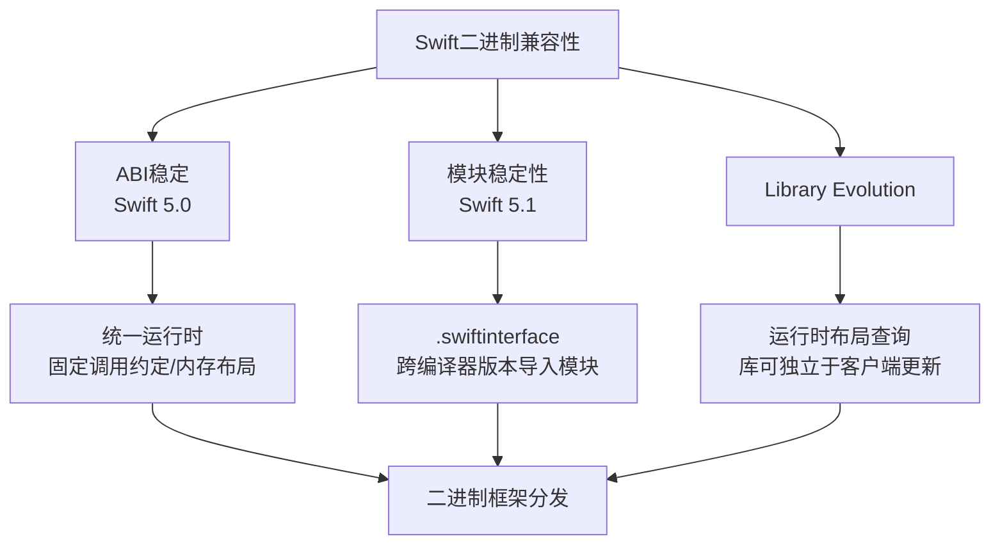

+++
title = "Swift二进制兼容性"
date = '2026-05-02T22:32:27+08:00'
draft = false
weight = 12
tags = ["iOS", "面试", "基础"]
categories = ["iOS开发", "面试"]
+++
Swift二进制兼容性是指Swift编译后的二进制代码能够跨版本、跨模块正确链接和运行的能力。它由三个核心机制组成：**ABI稳定**（Swift 5.0）、**模块稳定性**（Swift 5.1）和**Library Evolution**。这三者共同使得Swift二进制框架的分发成为可能。



## ABI稳定

### 什么是ABI

ABI（Application Binary Interface，应用程序二进制接口）定义了二进制层面的接口规范，包括：

- **数据类型的大小和对齐方式**：如Int在64位系统上是8字节
- **函数调用约定**：参数如何传递、返回值如何获取
- **名称修饰（Name Mangling）规则**：函数和类型在二进制中的命名方式
- **内存布局**：对象在内存中的结构
- **异常处理机制**：错误如何在二进制层面传播
- **运行时元数据格式**：类型信息的存储方式

### ABI vs API

| 特性 | API（源码接口） | ABI（二进制接口） |
|------|----------------|------------------|
| 层面 | 源代码层面 | 编译后的二进制层面 |
| 兼容性检查 | 编译时 | 链接时/运行时 |
| 关注点 | 函数签名、类型定义 | 内存布局、调用约定 |
| 变化影响 | 需要重新编译 | 需要重新链接或替换二进制 |

一个简单的例子：

```swift
// API层面：函数签名
func calculate(value: Int) -> Int

// ABI层面关注的是：
// - Int在内存中占多少字节
// - value参数通过哪个寄存器传递
// - 返回值通过哪个寄存器返回
// - 函数在二进制中的符号名是什么
```

### ABI不稳定时期的问题

在Swift 5.0之前，Swift的ABI是不稳定的。这意味着：

1. **每个App都需要嵌入Swift运行时库**：因为系统无法提供统一的Swift运行时
2. **不同版本Swift编译的代码无法直接链接**：Swift 4.0编译的库无法被Swift 4.2的代码直接使用
3. **App体积增大**：每个Swift App都包含完整的Swift标准库（约10-15MB）
4. **启动时间增加**：需要加载嵌入的运行时库

### Swift 5.0 ABI稳定带来的变化

Swift 5.0发布，标志着ABI稳定的实现：

**1. 系统级Swift运行时**

从iOS 12.2、macOS 10.14.4开始，Swift运行时被内置到操作系统中：

```
/usr/lib/swift/
├── libswiftCore.dylib
├── libswiftFoundation.dylib
├── libswiftDispatch.dylib
└── ...
```

**2. App体积减小**

不再需要嵌入Swift标准库，App体积可以减少约10-15MB：

```
// Swift 5.0之前的App结构
MyApp.app/
├── MyApp (可执行文件)
├── Frameworks/
│   ├── libswiftCore.dylib      // 需要嵌入
│   ├── libswiftFoundation.dylib
│   └── ...
└── ...

// Swift 5.0之后（iOS 12.2+）
MyApp.app/
├── MyApp (可执行文件)
└── ...  // 不再需要嵌入Swift库
```

**3. 启动性能提升**

系统级的Swift运行时可以被所有App共享，并且：
- 被纳入dyld shared cache（共享缓存），首次使用时可快速映射到进程地址空间
- 多个App共享同一份物理内存页，减少系统整体内存开销

**4. 二进制框架分发成为可能**

```swift
// 第三方可以分发.xcframework
// 用户无需关心框架是用哪个Swift版本编译的
import SomePrecompiledFramework

let service = SomePrecompiledFramework.Service()
service.doSomething()
```

### ABI稳定的技术实现

#### 名称修饰（Name Mangling）

Swift使用名称修饰来唯一标识符号。ABI稳定后，修饰规则固定：

```swift
// Swift代码
public func greet(name: String) -> String {
    return "Hello, \(name)"
}

// 编译后的符号名（简化示例）
// $s4main5greet4nameS2S_tF
// 包含：模块名、函数名、参数类型、返回类型等信息
```

可以使用`nm`命令查看二进制中的符号：

```bash
nm -g MyApp | grep swift
```

#### 类型元数据布局

ABI稳定定义了类型元数据的固定布局：

```c
// 类的元数据结构（简化）
struct ClassMetadata {
    void *kind;                    // 类型种类
    void *superclass;              // 父类元数据指针
    void *cacheData[2];            // 缓存数据
    size_t classSize;              // 类实例大小
    size_t classAddressPoint;      // 类地址偏移
    void *typeDescriptor;          // 类型描述符
    // ... 其他字段
};
```

#### 值见证表（Value Witness Table）

值见证表是Swift类型元数据的核心组成部分，**每个类型都有一张值见证表**（不仅限于值类型，class也有）。它记录了一个类型在内存层面"如何操作"的全部信息——大小、对齐方式、以及拷贝/销毁等生命周期操作的函数指针。

值见证表的指针存储在类型元数据（`TypeMetadata`）的固定位置（紧挨`kind`字段之前，即metadata指针 - 1个指针宽度处），运行时通过这个指针就能对任意类型执行通用操作，而无需知道具体类型是什么。

```c
struct ValueWitnessTable {
    // === 生命周期操作（函数指针） ===
    void (*initializeBufferWithCopyOfBuffer)(...);  // 在inline buffer中拷贝初始化
    void (*destroy)(...);                            // 销毁（释放引用计数等）
    void (*initializeWithCopy)(...);                 // 从源拷贝初始化到新地址
    void (*assignWithCopy)(...);                     // 拷贝赋值（先销毁旧值再拷贝）
    void (*initializeWithTake)(...);                 // 移动初始化（源不再有效）
    void (*assignWithTake)(...);                     // 移动赋值（先销毁旧值再移动）
    
    // === 布局信息 ===
    size_t size;          // 类型实例占用的字节数
    size_t stride;        // 数组中相邻元素之间的距离（size + 对齐padding）
    unsigned flags;       // 标志位（是否为POD、对齐方式、是否需要引用计数管理等）
    unsigned extraInhabitantCount;  // 额外可用的位模式数量（用于Optional优化）
};
```

**值见证表在ABI稳定中的关键角色**：ABI稳定要求值见证表的布局（字段顺序、函数指针签名）在所有Swift版本中保持一致。这样，无论库和客户端是用哪个版本的Swift编译的，运行时都能通过同样的偏移量读取到正确的函数指针和布局信息。

**值见证表在Library Evolution中的关键角色**：当启用Library Evolution时，编译器不会将类型的`size`/`stride`等信息硬编码到客户端二进制中，而是在运行时通过值见证表查询。这就是为什么库可以在不重新编译客户端的情况下修改类型的内存布局。

#### 协议见证表（Protocol Witness Table）

协议见证表记录了一个类型对某个协议的所有方法实现的函数指针。每一对（类型, 协议）关系对应一张独立的见证表：

```c
// Circle对Drawable协议的见证表（简化）
struct CircleDrawableWitnessTable {
    void (*draw)(Circle* self);              // draw方法的函数指针
    // ... 协议要求的其他方法
};
```

协议见证表与值见证表不同，它**不存储在类型元数据内部**，而是作为独立的全局符号写入Mach-O中（见证表本身在`__DATA,__const`段，协议一致性记录在`__TEXT,__swift5_proto`段）。运行时通过协议一致性记录查找到对应的见证表，然后通过固定偏移量取出函数指针进行调用。

**与ABI稳定的关系**：见证表的布局（方法槽位的排列顺序和函数指针签名）由ABI规范固定。这保证了不同Swift版本编译的代码在通过协议类型调用方法时，能从同样的偏移量取出正确的函数指针。

> 协议见证表的详细机制（存在容器、协议一致性查找、泛型特化等）可以参考[Swift底层原理-结构体、类和协议](./Swift底层原理-结构体、类和协议.md)中的见证表章节。

## 模块稳定性

ABI稳定解决了二进制兼容问题，但还有另一个问题：Swift模块使用`.swiftmodule`文件描述模块接口，这个格式在Swift 5.0时还不稳定。

Swift 5.1引入了**模块稳定性（Module Stability）**，通过`.swiftinterface`文件解决这个问题。

### 模块不稳定时期的问题

在Swift 5.1之前，模块稳定性尚未实现，这带来了以下问题：

1. **Swift版本强绑定**：`.swiftmodule`是二进制格式，包含了特定Swift编译器版本的内部数据结构。Swift 5.0编译的`.swiftmodule`无法被Swift 5.1的编译器读取，反之亦然。

2. **二进制框架分发受限**：即使有了ABI稳定，框架作者也无法直接分发预编译的二进制框架。因为用户的Xcode/Swift版本可能与框架编译时的版本不同，导致无法导入模块。

3. **必须分发源码或针对特定版本编译**：框架作者要么分发源码让用户自行编译，要么为每个Swift版本分别编译并分发多个二进制版本。

4. **CI/CD复杂度增加**：团队成员必须使用完全相同的Xcode版本，否则无法共享预编译的模块缓存，影响构建效率。

5. **Xcode升级成本高**：升级Xcode（通常会带来新的Swift版本）后，所有依赖的二进制框架都需要重新获取对应版本的编译产物。

### .swiftmodule vs .swiftinterface

```
// .swiftmodule - 二进制格式，版本相关
MyFramework.swiftmodule/
├── x86_64-apple-ios-simulator.swiftmodule  // 特定架构和Swift版本

// .swiftinterface - 文本格式，版本无关
MyFramework.swiftmodule/
├── x86_64-apple-ios-simulator.swiftinterface  // 可跨版本使用
```

### 生成Swift Interface文件

在Xcode中启用模块稳定性：

```
Build Settings -> Build Options -> Build Libraries for Distribution = YES
```

或在命令行：

```bash
swiftc -emit-module-interface -enable-library-evolution MyModule.swift
```

生成的`.swiftinterface`文件是人类可读的：

```swift
// swift-interface-format-version: 1.0
// swift-compiler-version: Apple Swift version 5.9
// swift-module-flags: -target arm64-apple-ios15.0 -enable-library-evolution

import Foundation

public struct User {
    public var name: Swift.String
    public var age: Swift.Int
    public init(name: Swift.String, age: Swift.Int)
}

public func greet(_ user: User) -> Swift.String
```

## Library Evolution

### 什么是Library Evolution

Library Evolution是Swift提供的一种机制，允许**动态库在不重新编译客户端的情况下进行更新**。

要理解它的价值，需要先明确一个关键场景：**系统动态库的更新**。

### Library Evolution的核心场景

考虑以下场景：

```
你的App编译时（iOS 15）:
  App 链接系统的 Swift 标准库
  提交 App Store

用户设备更新到 iOS 16:
  系统的 Swift 标准库被 Apple 更新了
  你的 App 没有重新编译！
  App 仍然需要正常运行 ← Library Evolution 保证这一点
```

**Apple不可能要求所有App在每次iOS更新后重新编译提交。** 这就是Library Evolution存在的根本原因。

### 没有Library Evolution会发生什么

假设Swift标准库在iOS 16中给`Array`添加了一个新的存储属性：

```swift
// iOS 15 的 Array（简化）
public struct Array<Element> {
    var buffer: ArrayBuffer<Element>  // 8字节
}

// iOS 16 的 Array（简化）
public struct Array<Element> {
    var buffer: ArrayBuffer<Element>  // 8字节
    var stats: ArrayStats             // 新增8字节，总共16字节
}
```

**没有Library Evolution**：
- 你的App在iOS 15编译时，编译器将`Array`的大小（8字节）直接硬编码到二进制中
- iOS 16上`Array`实际变成了16字节
- App只分配8字节来存储Array -> 内存布局错误 -> 崩溃

**有Library Evolution**：
- 编译器不假设`Array`的大小，而是生成代码通过Value Witness Table在运行时查询实际大小
- iOS 16上正确获取到16字节 -> 正常运行

### 对普通开发者的影响

**大多数情况下不需要**，因为：

| 场景 | 库会独立于App更新吗？ | 需要Library Evolution？ |
|------|---------------------|------------------------|
| SPM/CocoaPods源码依赖 | 否，一起编译 | 不需要 |
| 静态库（.a） | 否，链接到App | 不需要 |
| App内嵌的动态库 | 否，一起打包发布 | 不需要 |
| **系统动态库** | **是，iOS更新时升级** | **需要** |

**需要关心的场景**：当你要**分发预编译的二进制SDK**时。

虽然iOS App中SDK不会独立于App更新，但开启`BUILD_LIBRARY_FOR_DISTRIBUTION`时会同时启用：
- **Module Stability**（生成`.swiftinterface`）- 这是分发SDK的关键，让不同Swift版本都能导入
- **Library Evolution** - 附带启用，确保二进制兼容性

### 启用Library Evolution

```bash
swiftc -enable-library-evolution MyLibrary.swift
```

或在Xcode中设置`BUILD_LIBRARY_FOR_DISTRIBUTION = YES`（会自动启用）。

### @frozen属性

默认情况下，启用Library Evolution后，结构体和枚举是"非冻结"的，允许未来添加成员。使用`@frozen`可以声明类型不会改变：

```swift
// 非冻结枚举 - 允许未来添加case
public enum NetworkError: Error {
    case timeout
    case connectionLost
    case invalidResponse
}

// 客户端代码必须处理未知case
switch error {
case .timeout: handleTimeout()
case .connectionLost: handleConnectionLost()
case .invalidResponse: handleInvalidResponse()
@unknown default: handleUnknownError()  // 必须添加
}

// 冻结枚举 - 保证不会添加新case
@frozen
public enum HTTPMethod {
    case get
    case post
    case put
    case delete
}

// 客户端代码不需要@unknown default
switch method {
case .get: performGet()
case .post: performPost()
case .put: performPut()
case .delete: performDelete()
}
```

### @frozen的性能优势

```swift
// 非冻结结构体 - 通过间接方式访问
public struct FlexiblePoint {
    public var x: Double
    public var y: Double
}
// 编译器不能假设布局，需要通过Value Witness Table间接查询大小和对齐方式

// 冻结结构体 - 直接内联访问
@frozen
public struct Point {
    public var x: Double
    public var y: Double
}
// 编译器可以在编译期确定布局（16字节、8字节对齐），直接内联访问，性能更好
```

Swift标准库中大量使用了`@frozen`来保证性能，例如：
- `Int`、`Double`、`Bool`等基本类型
- `Optional<Wrapped>`
- `Array<Element>`（注意：`Array`本身是frozen的，但它内部通过引用指向堆上的buffer，所以buffer的内容仍然可以变化）
- `String`

### @inlinable和@usableFromInline

这些属性用于控制函数是否可以被内联到客户端代码：

```swift
public struct Calculator {
    @usableFromInline
    internal var value: Int
    
    public init(value: Int) {
        self.value = value
    }
    
    // 可以被内联到客户端
    @inlinable
    public func doubled() -> Int {
        return value * 2
    }
    
    // 不能被内联，通过函数调用
    public func tripled() -> Int {
        return value * 3
    }
}
```

使用注意事项：
- `@inlinable`函数的实现会被写入`.swiftinterface`文件，成为公开API的一部分
- 修改`@inlinable`函数的实现后，已编译的旧客户端仍会使用旧的内联版本，直到重新编译
- 适用于性能关键的小函数（如`@frozen`类型的简单属性访问、算术运算等）
- `@usableFromInline`使internal声明可以在`@inlinable`函数体内使用，但不会暴露为public API

### Library Evolution对生成代码的影响

以访问结构体属性为例，对比启用和不启用Library Evolution时编译器生成的代码策略：

```
未启用Library Evolution（直接访问）:
  load [对象地址 + 固定偏移量]     // 编译期确定偏移量，直接访问内存

启用Library Evolution（间接访问）:
  offset = 查询字段偏移量描述符     // 运行时通过metadata获取真实偏移
  load [对象地址 + offset]         // 间接访问内存
```

这种间接访问带来的性能开销通常很小（一次额外的内存读取），但对于极其频繁调用的热路径，可以通过`@frozen`和`@inlinable`来消除。

## 实际应用

### 创建可分发的二进制框架

```bash
# 1. 构建框架（启用Library Evolution和模块稳定性）
xcodebuild archive \
    -scheme MyFramework \
    -destination "generic/platform=iOS" \
    -archivePath ./build/MyFramework-iOS \
    SKIP_INSTALL=NO \
    BUILD_LIBRARY_FOR_DISTRIBUTION=YES

# 2. 创建XCFramework
xcodebuild -create-xcframework \
    -framework ./build/MyFramework-iOS.xcarchive/Products/Library/Frameworks/MyFramework.framework \
    -output ./MyFramework.xcframework
```

### API设计考量

分发二进制SDK时需要注意以下几点：

**1. 谨慎使用@frozen**

一旦发布，冻结的类型就不能添加新成员：

```swift
@frozen
public struct Version {
    public var major: Int
    public var minor: Int
    public var patch: Int
    // 发布后不能再添加新属性，否则会破坏已编译客户端的内存布局
}
```

**2. 枚举设计要预留扩展空间**

非frozen枚举在Library Evolution下默认是可扩展的，客户端必须使用`@unknown default`。如果枚举的case集合确实不会改变，使用`@frozen`可以改善客户端体验。

**3. @inlinable的承诺**

标记为`@inlinable`的函数实现不应轻易更改，因为旧客户端中已内联的旧实现不会自动更新。

## 常见问题

### Swift二进制兼容带来的好处是什么

**1. App体积显著减小**

ABI稳定之前，每个Swift App都需要嵌入完整的Swift标准库（约10-15MB）。ABI稳定后（iOS 12.2+），Swift运行时内置于操作系统中，App不再需要打包这部分二进制，体积直接减小。

**2. App启动速度提升**

系统级Swift运行时被纳入dyld shared cache，多个App共享同一份物理内存页，无需每个App单独加载自己嵌入的运行时库，减少了启动时的动态库加载开销。

**3. 预编译二进制框架的分发成为可能**

这是三个机制协同作用的结果：
- ABI稳定保证了不同Swift版本编译的二进制可以正确链接
- 模块稳定性通过`.swiftinterface`让不同版本的编译器都能导入模块
- Library Evolution保证库可以独立于客户端更新而不破坏兼容性

在此之前，第三方框架只能以源码形式分发（如CocoaPods、SPM源码依赖），或者为每个Swift版本单独编译。现在可以直接分发`.xcframework`二进制产物，用户无需关心框架的编译环境。

**4. 系统框架可以用Swift编写**

Apple自身也受益于二进制兼容性。iOS系统更新时，系统框架的Swift代码可以独立升级，而不会破坏用户设备上已安装的App。这使得Apple可以逐步将系统框架从Objective-C迁移到Swift（如SwiftUI、Observation框架等）。

**5. 跨团队协作效率提升**

大型项目中不同团队可以独立编译各自的模块，产出预编译的二进制产物供其他团队使用，而不要求所有团队锁定同一个Xcode/Swift版本。这降低了CI/CD复杂度和Xcode升级的协调成本。
