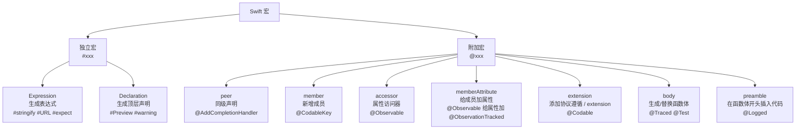
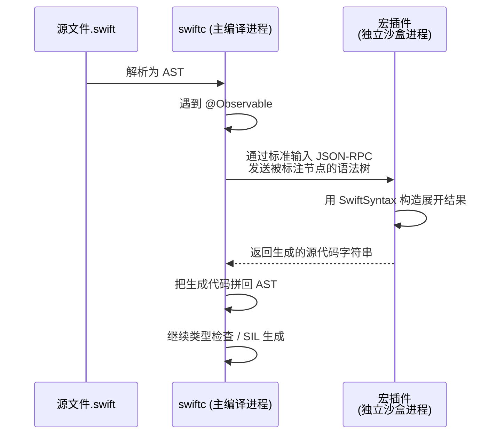
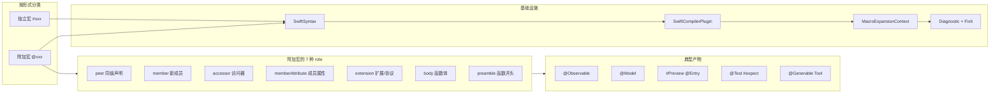

+++
title = "Swift 宏"
date = '2026-05-04T00:38:29+08:00'
draft = false
weight = 13
tags = ["iOS", "面试", "基础"]
categories = ["iOS开发", "面试"]
+++
Swift 5.9（WWDC 2023）引入的**宏（Macro）**是近几年语言层最大的一次能力扩展。它让 Swift 第一次具备了**编译期代码生成**的官方机制——你可以在源码层面写一段"能生成代码的代码"，编译器会在类型检查前把它展开成真正的 Swift 源码，再走正常的编译流程。SwiftUI 的 `#Preview`、Observation 框架的 `@Observable`、SwiftData 的 `@Model`、Swift Testing 的 `@Test` / `#expect`、FoundationModels 的 `@Generable` / `@Tool`，全都是宏。

## 一、为什么要有宏

### 1.1 Swift 之前能做什么，又差在哪

在宏之前，Swift 已经有一整套"元编程"手段，但每一种都有明显的边界：

| 机制 | 做什么 | 局限 |
|------|--------|------|
| `@propertyWrapper` | 给属性注入行为（如 `@Published`、`@State`） | 只能包属性，不能生成方法、不能生成类型、不能访问其他成员 |
| `@resultBuilder` | 把一段 DSL 收集成表达式（如 SwiftUI 的 `ViewBuilder`） | 只作用于闭包里，无法改类型定义 |
| KeyPath + Mirror | 运行时反射读写属性 | 只能读，类型安全差，性能差（见 [iOS反射](./iOS反射.md)） |
| Codable 等编译器魔法 | 自动合成 `init(from:)` / `encode(to:)` | 只有编译器内部能写，开发者写不出同等能力的东西 |
| Sourcery / SwiftGen | 文本级代码生成 | 游离于编译器之外，无类型信息、无法访问 AST |
| Objective-C `#define` | 纯文本替换 | 没有作用域、没有类型、没有卫生（hygiene），对调试器和 IDE 极不友好 |

**宏**就是要一次性补齐这块能力：在保留类型安全与 IDE 体验的前提下，把"只有 Swift 编译器团队能写的代码生成"开放给所有开发者。

### 1.2 官方动机：Swift Evolution

Swift 宏是一系列提案累积的结果，主要节点：

| 提案 | 版本 | 引入的能力 |
|------|------|-----------|
| SE-0382 | Swift 5.9 | **Expression Macros**：`#xxx()` 形式，把表达式展开成新表达式 |
| SE-0389 | Swift 5.9 | **Attached Macros**：`@xxx` 形式，附着在声明上生成新代码 |
| SE-0397 | Swift 5.9 | **Freestanding Declaration Macros**：`#xxx` 形式，直接生成声明（如 `#Preview`） |
| SE-0407 | Swift 5.10 | **Member Macro 可声明额外协议遵循** |
| SE-0389 修订 | Swift 5.10 | `conformance` 角色合并进 `extension` 角色 |
| SE-0415 | Swift 6.0 | **Function Body Macros**：能生成/替换函数体（如 `@Traced`） |
| SE-0397 扩展 | Swift 6.0 | Preamble Macros：在函数体开头注入代码 |

可以看到 Swift 团队一直在往"宏能做的事越来越多"的方向推。到 Swift 6，宏已经可以影响声明、属性、函数体、协议遵循几乎所有的代码位置。

### 1.3 和 OC `#define` 的本质区别

这是被问得最多的一个对比题：

| 维度 | OC `#define` | Swift 宏 |
|-----|-------------|---------|
| 执行阶段 | 预处理（编译前文本替换） | **类型检查前**（编译中，对 AST 操作） |
| 输入输出 | 字符串 → 字符串 | **语法树 → 语法树** |
| 类型系统 | 无（替换后才参与类型检查） | **有**（输入/输出都是合法 Swift 代码） |
| 卫生性 | 无（会污染作用域、重复求值） | **有**（标识符自动重命名避免冲突） |
| 调试 | 展开后源码丢失 | `Expand Macro` 可查看展开结果，断点可打 |
| 运行方式 | 嵌在编译器里 | **独立沙盒进程**，通过 JSON-RPC 通信 |
| 能做的事 | 只能替换 token | 生成任意合法声明/表达式 |

用一句话概括：**OC 宏是"在源文件上做查找替换"，Swift 宏是"在编译器 AST 上做变换"**。

## 二、两大类宏

Swift 宏从语法形式上分两类：**独立宏（Freestanding）** 和 **附加宏（Attached）**。



### 2.1 独立宏（Freestanding）

以 `#` 开头，可用在表达式或声明位置。

**表达式宏**：展开成一个新表达式。

```swift
// 最经典的官方示例：把一个表达式和它的字符串形式作为二元组返回
let (value, code) = #stringify(1 + 2)
// 展开为：
let (value, code) = (1 + 2, "1 + 2")
```

**声明宏**：展开成若干顶层声明，不产生值。

```swift
#Preview("Light") {
    ContentView()
}
// 展开为类似：
struct _Preview_ContentView_Light: PreviewProvider {
    static var previews: some View { ContentView() }
}
```

`#warning("TODO")` / `#error("不能这么写")` 也是独立宏（由编译器内建实现）。

### 2.2 附加宏（Attached）

以 `@` 开头，附在**一个已有声明**上。它们通过 `role` 参数声明要做的事，一个宏可以同时承担多个 role。

| Role | 能做什么 | 典型例子 |
|------|---------|---------|
| `peer` | 在被标注声明**旁边**生成新声明 | `@AddAsync` 为 completionHandler 方法生成一个 `async` 版 |
| `member` | 给 struct/class/enum **内部**加新成员 | `@Observable` 生成 `_$observationRegistrar` 等 |
| `accessor` | 给属性**加 get/set 访问器** | `@Observable` 拦截属性 getter/setter |
| `memberAttribute` | 给被标注类型的成员**加属性** | `@Observable` 给所有存储属性加 `@ObservationTracked` |
| `extension` | 生成 `extension`（含协议遵循） | `@Codable` 生成 `extension Foo: Codable {...}` |
| `body` | 生成或替换**函数体** | Swift Testing 的 `@Test` 把测试代码包装 |
| `preamble` | 只在函数体**开头**插入代码 | `@LogCalls` 在每个方法开头打日志 |

**一个宏可以同时声明多个 role**，这是 Observation 框架能用一行 `@Observable` 把整个类改造的关键：

```swift
@attached(member, names: named(_$observationRegistrar), named(access), named(withMutation))
@attached(memberAttribute)
@attached(extension, conformances: Observable)
public macro Observable() = #externalMacro(module: "ObservationMacros", type: "ObservableMacro")
```

它同时做了三件事：加成员、给每个属性加 `@ObservationTracked`、让类型遵循 `Observable`。

## 三、宏的执行模型

### 3.1 宏不是在编译器里直接运行的

这是很多人第一次看宏实现时最意外的点：



为什么要独立进程？

1. **安全沙盒**：宏代码第三方提供，直接跑在编译器里有安全风险。独立进程可限制文件/网络访问。
2. **崩溃隔离**：宏 crash 不会把整个 `swiftc` 搞挂。
3. **热更新**：宏插件可以独立编译为 `.dylib`，不用重编译整个编译器。

Xcode 首次使用第三方宏时会弹出 `Trust & Enable` 对话框，就是这个沙盒机制的一部分。

### 3.2 SwiftSyntax：宏的底层 SDK

宏实现基于 [swift-syntax](https://github.com/swiftlang/swift-syntax) 库。这个库把 Swift 源码解析成**可变、可查询、可生成**的语法树（CST，Concrete Syntax Tree，比 AST 更底层，保留所有 token 和 trivia）。

核心类型：

| 类型 | 职责 |
|------|------|
| `SyntaxProtocol` | 所有语法节点的基类 |
| `DeclSyntax` / `ExprSyntax` / `StmtSyntax` | 声明 / 表达式 / 语句 |
| `TokenSyntax` | 叶子节点（关键字、标识符、字面量等） |
| `Trivia` | 非语义的空白、注释 |
| `SyntaxRewriter` | 基于访问者模式重写树 |
| `MacroExpansionContext` | 宏展开环境：诊断、生成唯一标识符、源码位置 |

宏实现就是一个**把输入 `SyntaxProtocol` 变成 `DeclSyntax` 数组**的纯函数。

## 四、写一个宏：从零到能跑

我们实现一个经典例子：`#stringify`，把表达式展开成 `(值, 代码字符串)`。完整的 Swift Package 结构如下：

```
MyMacro/
├── Package.swift
└── Sources/
    ├── MyMacro/             ← 给用户用的 public API
    │   └── MyMacro.swift
    ├── MyMacroMacros/       ← 宏的实现（编译器插件）
    │   ├── MyMacroPlugin.swift
    │   └── StringifyMacro.swift
    └── MyMacroClient/       ← 使用示例
        └── main.swift
```

### 4.1 Package.swift：两个关键 target

```swift
// swift-tools-version: 5.9
import PackageDescription
import CompilerPluginSupport

let package = Package(
    name: "MyMacro",
    platforms: [.macOS(.v10_15), .iOS(.v13)],
    products: [
        .library(name: "MyMacro", targets: ["MyMacro"]),
    ],
    dependencies: [
        .package(url: "https://github.com/swiftlang/swift-syntax.git", from: "510.0.0"),
    ],
    targets: [
        // 1. 宏的实现（编译器插件）
        .macro(
            name: "MyMacroMacros",
            dependencies: [
                .product(name: "SwiftSyntaxMacros", package: "swift-syntax"),
                .product(name: "SwiftCompilerPlugin", package: "swift-syntax"),
            ]
        ),
        // 2. 给业务代码 import 的门面
        .target(name: "MyMacro", dependencies: ["MyMacroMacros"]),
        // 3. 使用者
        .executableTarget(name: "MyMacroClient", dependencies: ["MyMacro"]),
    ]
)
```

- `.macro(...)`：这是个特殊的 target 类型，编译产物是编译器插件（不是 App 的一部分）。
- 真正写业务代码的工程只依赖 `MyMacro`，不需要接触 SwiftSyntax。

### 4.2 宏的声明

在 `Sources/MyMacro/MyMacro.swift`：

```swift
/// 把一个表达式转成 (值, 表达式字符串) 元组。
///
///     let (value, code) = #stringify(1 + 2)
///     // value = 3, code = "1 + 2"
@freestanding(expression)
public macro stringify<T>(_ value: T) -> (T, String) =
    #externalMacro(module: "MyMacroMacros", type: "StringifyMacro")
```

几个要点：

- `@freestanding(expression)`：声明这是表达式形式的独立宏。
- `#externalMacro(module:type:)`：告诉编译器"真正的实现在 `MyMacroMacros` 模块的 `StringifyMacro` 类型里"。
- **类型签名完全正常**：`macro stringify<T>(_ value: T) -> (T, String)` 的签名就是普通函数签名，负责类型检查；实现代码只负责生成语法。
- **宏签名里的参数类型用来做类型检查**，实现代码拿到的永远是语法节点。

### 4.3 宏的实现

`Sources/MyMacroMacros/StringifyMacro.swift`：

```swift
import SwiftSyntax
import SwiftSyntaxMacros

public struct StringifyMacro: ExpressionMacro {
    public static func expansion(
        of node: some FreestandingMacroExpansionSyntax,
        in context: some MacroExpansionContext
    ) throws -> ExprSyntax {
        guard let argument = node.arguments.first?.expression else {
            throw MacroError("#stringify requires an argument")
        }
        // 直接用字符串插值构造新语法节点：SwiftSyntax 会自动把字符串解析成 ExprSyntax
        return "(\(argument), \(literal: argument.description))"
    }
}

struct MacroError: Error, CustomStringConvertible {
    let description: String
    init(_ message: String) { self.description = message }
}
```

- `ExpressionMacro` 协议只要求一个 `expansion` 静态方法。
- 入参 `node` 是宏调用节点（`#stringify(1 + 2)` 这整个语法片段）。
- `context` 提供诊断、唯一名字生成、源码位置等环境信息。
- 返回值是 `ExprSyntax`，SwiftSyntax 支持 `ExprSyntax(stringInterpolation:)`，可以直接用字符串插值构建语法树。

### 4.4 注册插件

`Sources/MyMacroMacros/MyMacroPlugin.swift`：

```swift
import SwiftCompilerPlugin
import SwiftSyntaxMacros

@main
struct MyMacroPlugin: CompilerPlugin {
    let providingMacros: [Macro.Type] = [
        StringifyMacro.self,
    ]
}
```

`@main` + `CompilerPlugin` 协议让这个 target 成为一个可执行的编译器插件。编译器启动时通过 stdin/stdout 与它通信。

### 4.5 使用

```swift
import MyMacro

let (result, source) = #stringify(2 + 3 * 4)
print(result, source)
// 输出：14 2 + 3 * 4
```

在 Xcode 里右键调用点 → `Expand Macro` 就能看到展开结果：

```swift
let (result, source) = (2 + 3 * 4, "2 + 3 * 4")
```

## 五、进阶：写一个附加宏

我们做一个真实一点的例子：`@AddAsync`，给一个带 completionHandler 的旧 API 自动生成一个 `async` 版本。

### 5.1 目标

```swift
@AddAsync
func fetchUser(id: String, completion: @escaping (Result<User, Error>) -> Void) { /* ... */ }

// 宏展开后多了一个 peer：
func fetchUser(id: String) async throws -> User {
    try await withCheckedThrowingContinuation { continuation in
        fetchUser(id: id) { result in
            continuation.resume(with: result)
        }
    }
}
```

### 5.2 声明

```swift
@attached(peer, names: overloaded)
public macro AddAsync() = #externalMacro(module: "MyMacroMacros", type: "AddAsyncMacro")
```

`names: overloaded` 告诉编译器生成的新声明会与原声明**同名**。Swift 宏对"你会生成哪些名字"要求显式声明，便于增量编译和 IDE 索引，可选的形式：

| 形式 | 含义 |
|-----|------|
| `named(foo)` | 会产生一个叫 `foo` 的声明 |
| `overloaded` | 会产生一个与原声明同名的重载 |
| `prefixed(_)` | 会产生以某前缀起头的名字 |
| `suffixed(_Observed)` | 会产生以某后缀结尾的名字 |
| `arbitrary` | 不声明（尽量避免，会伤害增量编译性能） |

### 5.3 实现要点

```swift
public struct AddAsyncMacro: PeerMacro {
    public static func expansion(
        of node: AttributeSyntax,
        providingPeersOf declaration: some DeclSyntaxProtocol,
        in context: some MacroExpansionContext
    ) throws -> [DeclSyntax] {

        // 1. 只支持函数声明
        guard let funcDecl = declaration.as(FunctionDeclSyntax.self) else {
            throw MacroError("@AddAsync only applies to functions")
        }

        // 2. 找到 completion 参数
        let params = funcDecl.signature.parameterClause.parameters
        guard let completion = params.last,
              completion.firstName.text == "completion" else {
            throw MacroError("last parameter must be named 'completion'")
        }

        // 3. 解析 completion 的类型，取出 Result<Success, Failure>
        //    ...此处省略类型解析细节...

        // 4. 生成 async 版本的函数
        let newParams = params.dropLast()
        let newFunc: DeclSyntax = """
        \(funcDecl.modifiers)func \(funcDecl.name)(\(raw: newParams.description)) async throws -> Success {
            try await withCheckedThrowingContinuation { continuation in
                \(funcDecl.name)(\(raw: callArgs)) { result in
                    continuation.resume(with: result)
                }
            }
        }
        """
        return [newFunc]
    }
}
```

这里最能体会到宏的"语法级编程"：你拿到 `FunctionDeclSyntax`，可以读它的修饰符、参数名、返回值、泛型约束；生成结果又是合法的 Swift 源码片段，拼进插值里。

### 5.4 诊断与定位

真正生产质量的宏一定要给出好的错误信息。`MacroExpansionContext` 提供了 `diagnose(_:)` 方法：

```swift
let diag = Diagnostic(
    node: Syntax(completion),
    message: SimpleDiagnosticMessage(
        message: "completion 参数类型必须是 (Result<T, Error>) -> Void",
        diagnosticID: MessageID(domain: "MyMacro", id: "badCompletion"),
        severity: .error
    )
)
context.diagnose(diag)
return []
```

抛异常是"中止展开"，`diagnose` 则可以报多条错误/警告，还能附带 `FixIt` 自动修复建议——这是现代 Swift 宏相比 OC 宏最大的体验提升。

## 六、测试宏

宏是纯函数（输入语法 → 输出语法），天生适合做单元测试。swift-syntax 官方提供了 `SwiftSyntaxMacrosTestSupport`：

```swift
import XCTest
import SwiftSyntaxMacros
import SwiftSyntaxMacrosTestSupport
@testable import MyMacroMacros

final class StringifyMacroTests: XCTestCase {
    let testMacros: [String: Macro.Type] = [
        "stringify": StringifyMacro.self,
    ]

    func testExpansion() {
        assertMacroExpansion(
            """
            let x = #stringify(1 + 2)
            """,
            expandedSource: """
            let x = (1 + 2, "1 + 2")
            """,
            macros: testMacros
        )
    }

    func testErrorDiagnostic() {
        assertMacroExpansion(
            """
            let x = #stringify()
            """,
            expandedSource: """
            let x = #stringify()
            """,
            diagnostics: [
                DiagnosticSpec(message: "#stringify requires an argument", line: 1, column: 9)
            ],
            macros: testMacros
        )
    }
}
```

好处是：不需要真跑编译器，纯 Swift 测试框架就能 TDD；CI 跑起来毫秒级。

## 七、系统与框架中的宏

Swift 宏的真正意义不在于让每个人都写宏，而在于**Apple 用它重写了很多原本靠编译器魔法的 API，让开发者能看到实现**。下面是几个代表。

### 7.1 Observation：`@Observable`

iOS 17 推出的 [Observation](https://developer.apple.com/documentation/observation) 框架替代 `ObservableObject` + `@Published`。使用端：

```swift
@Observable
class UserViewModel {
    var name: String = ""
    var age: Int = 0
}
```

`@Observable` 展开后大致（简化）：

```swift
class UserViewModel {
    @ObservationIgnored
    private let _$observationRegistrar = ObservationRegistrar()

    @ObservationTracked
    var name: String = "" {
        @storageRestrictions(initializes: _name)
        init(initialValue) { _name = initialValue }
        get { access(keyPath: \.name); return _name }
        set { withMutation(keyPath: \.name) { _name = newValue } }
    }
    private var _name: String

    // ...age 同理
}
extension UserViewModel: Observable {}
```

它同时用到了 `member`（加 `_$observationRegistrar`）、`memberAttribute`（给每个属性加 `@ObservationTracked`）、`extension`（加 `Observable` 遵循）三种 role。而 `@ObservationTracked` 本身又是一个 `accessor` 宏，拦截属性的 get/set 做依赖收集。

**换句话说，SwiftUI 视图自动订阅 ViewModel 属性变化的魔法，全部由两个宏完成，没有一行编译器魔法**。在 Xcode 里选中 `@Observable` → `Expand Macro` 就能看到完整展开。

### 7.2 SwiftData：`@Model`

```swift
@Model
class Todo {
    var title: String
    var isDone: Bool
    init(title: String) { self.title = title; self.isDone = false }
}
```

`@Model` 的职责更复杂：

- `member` role：生成 `PersistentModel` 要求的 `schemaMetadata`、`init(backingData:)` 等隐藏成员。
- `memberAttribute` role：给属性加 `@Attribute`、`@Relationship`、`@Transient` 等 SwiftData 自己的标注。
- `accessor` role：把每个存储属性改写成从 `_$backingData` 里读写，从而实现"像写普通属性一样，但背后是 Core Data 管理"。
- `extension` role：声明 `extension Todo: PersistentModel, Observable {}`。

这是 Apple 把**过去靠 KVC / runtime 动态访问实现的 Core Data**彻底替换成**编译期生成的强类型代码**的典型案例。

### 7.3 SwiftUI：`#Preview` 和 `@Entry`

```swift
#Preview("深色模式") {
    ContentView().preferredColorScheme(.dark)
}
```

`#Preview` 是 freestanding declaration 宏，展开成一个符合 `PreviewProvider` 协议的类型。Xcode 16 之前每次写 preview 都要手写一个 `PreviewProvider` 结构体，现在一行搞定。

Xcode 16 还加了 `@Entry`，让写 `EnvironmentKey` 从十行缩成一行：

```swift
// 使用
extension EnvironmentValues {
    @Entry var theme: Theme = .light
}

// 展开后大致：
extension EnvironmentValues {
    var theme: Theme {
        get { self[__Key_theme.self] }
        set { self[__Key_theme.self] = newValue }
    }
    private struct __Key_theme: EnvironmentKey {
        static let defaultValue: Theme = .light
    }
}
```

### 7.4 Swift Testing：`@Test` 和 `#expect`

Swift 6 推出的新测试框架几乎完全建立在宏之上：

```swift
import Testing

@Test("加法应满足交换律")
func addition() {
    #expect(1 + 2 == 2 + 1)
    #expect(throws: MyError.self) { try failingFunc() }
}
```

- `@Test` 是 `peer` + `body` 宏：生成一个 `__SwiftTesting_` 前缀的注册函数，把测试元数据注入运行时表。
- `#expect` 是 expression 宏：不仅计算 `1 + 2 == 2 + 1` 的结果，还把**子表达式的值都抓出来**，失败时能显示 `expected 3 (1 + 2), got 4 (2 + 2)` 级别的详细信息——这在 XCTest 里是做不到的。

### 7.5 FoundationModels：`@Generable` 和 `Tool`

iOS 26 端侧 LLM 框架（见 [FoundationModels](../ai/FoundationModels.md)）用 `@Generable` 把 Swift 类型变成模型可填的 Schema：

```swift
@Generable
struct Recipe {
    @Guide(description: "菜名")
    let name: String
    @Guide(description: "耗时，分钟", .range(5...180))
    let minutes: Int
    let ingredients: [Ingredient]
}
```

宏展开后为这个 struct 生成了 `generationSchema`、`GeneratedContent` 初始化器、`PartiallyGenerated` 等一整套样板代码。没有宏的话，这些代码每个类型都要写上百行。

## 八、社区中的宏

| 宏 / 库 | 做什么 |
|---------|-------|
| [swift-power-assert](https://github.com/kishikawakatsumi/swift-power-assert) | 类似 `#expect`，`#assert(a + b == c)` 失败时画出每个子表达式的值 |
| [Pow](https://movingparts.io/pow) | SwiftUI 转场库，内部用宏生成大量样板动画配置 |
| [MacroToolkit](https://github.com/stackotter/swift-macro-toolkit) | 给写宏的人用的工具库，封装了常见 AST 遍历 / 构造模式 |
| [Spyable](https://github.com/Matejkob/swift-spyable) | `@Spyable protocol Foo`，自动生成协议的 mock 实现 |
| [Factory](https://github.com/hmlongco/Factory) | DI 容器，`@Injected` 宏替代属性包装器 |
| [MemberwiseInit](https://github.com/gohanlon/swift-memberwise-init-macro) | 把结构体默认合成的 memberwise init 提升为 public 或加参数默认值 |
| [MetaCodable](https://github.com/SwiftyLab/MetaCodable) | 用 `@Codable` + `@CodedAt("path.to.key")` 增强 Codable |

整体趋势：**以前靠 runtime 做的事正在向"编译期宏 + SwiftSyntax"迁移**。Mock 框架、DI 框架、JSON 库、日志框架，都能因此摆脱反射，获得更好的性能与安全性。

## 九、宏的卫生性（Hygiene）

卫生性指"宏展开时不会污染用户的命名空间"。OC `#define` 完全没有卫生性，经典坑：

```objc
#define MAX(a, b) ((a) > (b) ? (a) : (b))
int x = MAX(i++, j++);  // i 或 j 被求值两次，Bug
```

Swift 宏是**部分卫生**的：

- 宏内部通过字面量引用的标识符，会被自动重命名以避免和外部冲突（`context.makeUniqueName(...)` 显式得到一个保证唯一的名字）。
- 但宏生成的代码如果要和外部作用域**互相引用**（比如 `@Observable` 要给外部属性加方法），就必须显式在 `names:` 列表里声明。

实战经验：**永远用 `context.makeUniqueName` 生成内部辅助变量**，不要硬写 `_temp`、`_value` 这种名字，否则用户如果刚好也有同名变量，行为会很诡异。

## 十、陷阱与限制

### 10.1 编译速度

每次使用一个第三方宏，编译器就要启动一个插件进程 + JSON-RPC 通信。**大量使用宏会显著拖慢增量编译**。Apple 自己的宏走特殊通道优化过，第三方宏没有这个待遇。实测一个中型项目引入 [Spyable](https://github.com/Matejkob/swift-spyable) 后 clean build 会慢 10~20 秒。

缓解手段：

- 在 `names:` 里避免 `arbitrary`，尽量显式。
- 不要滥用——能用 `extension` / `protocol` 解决的别写宏。
- CI 上开启 `--scratch-path` 复用 swift-syntax 编译产物。

### 10.2 Swift 版本与 swift-syntax 耦合

swift-syntax 的主版本**必须和 Swift 编译器版本匹配**（Swift 5.9 → swift-syntax 509.x；Swift 5.10 → 510.x；Swift 6.0 → 600.x）。Xcode 升级后经常要同步升级 `Package.swift` 里的 swift-syntax 版本，否则宏插件编译不过。

建议在 `Package.swift` 里用 `from: "509.0.0"` 这种最低版本限定，而不是锁死精确版本。

### 10.3 调试

断点可以打在宏实现里（在宿主进程或测试 target 里调试），但调试宏**展开后的代码**要靠 `Expand Macro` 功能生成临时源文件，断点命中位置可能会错位。

实用技巧：开发期在宏展开里加 `context.diagnose(...)` 打"日志"，比断点更稳。

### 10.4 和泛型、协议扩展的边界

宏**在类型检查前就展开**，这意味着：

- 宏拿到的**不是类型信息**，只是语法。它看到 `T` 就是 `T`，不知道 `T` 是不是 `Codable`。
- 无法做依赖类型的分发（"如果这个属性是 `Date` 就这么生成，是 `String` 就那么生成"——这种逻辑必须推迟到运行时或泛型见证表）。

因此很多看似能用宏解决的问题（按字段类型生成不同序列化代码），仍然要结合泛型/协议。

### 10.5 安全与信任

第三方宏是**能执行任意代码的编译插件**（虽然在沙盒里）。Xcode 会强制用户确认 `Trust & Enable Macros`，命令行下需要 `--skip-macro-validation` 或预先授权。在企业 CI 流水线上要特别注意：

- 锁定 swift-package 的 `Package.resolved`，避免宏实现被中间人替换。
- 对关键宏（如涉及代码签名、网络的）做 code review。
- 新版本 Swift 已开始支持宏的 checksums 校验。

## 十一、一张总览图



## 十二、面试问答

### Q1：Swift 宏解决的核心问题是什么？为什么说它是 Swift 元编程能力的一次补齐？

Swift 宏解决的是**编译期代码生成**问题：让开发者可以在源码层面声明一段"会生成 Swift 代码的代码"，由编译器在类型检查前展开成真正的 Swift 源码，再继续走正常的类型检查、SIL 生成和优化流程。

在 Swift 宏出现之前，Swift 虽然已经有不少元编程工具，但它们各自都有明显边界：

- `@propertyWrapper` 只能包住属性，适合给单个属性增加读写行为，比如 `@State`、`@Published`，但它不能给类型生成新方法、不能让类型自动遵循协议，也不能批量改写其他成员。
- `@resultBuilder` 主要用于把闭包里的表达式收集成 DSL，例如 SwiftUI 的 `ViewBuilder`，但它只作用在闭包内部，无法改造一个类型声明。
- `Mirror` 和 KeyPath 属于运行时反射或半反射能力，性能、类型安全和可维护性都不适合大量生成样板代码。
- `Codable` 这类自动合成能力以前属于编译器魔法，只有 Swift 编译器内部能实现，普通开发者无法写出同等能力。
- Sourcery、SwiftGen 这类工具虽然能生成代码，但它们在编译器之外运行，往往只能做文本级处理，缺少 Swift 语法树上下文，和 IDE、增量编译、诊断系统结合也不够自然。

Swift 宏的价值就在于：它把"编译器才能做的源码变换"开放给了开发者，同时仍然保留 Swift 的强类型、作用域、诊断和 IDE 展开体验。它不是运行时反射，也不是字符串模板，而是**基于 SwiftSyntax 的语法树变换**。

### Q2：Swift 宏和 Objective-C 的 `#define` 有什么本质区别？

两者都叫"宏"，但本质完全不同。

Objective-C 的 `#define` 是 C 预处理器能力，本质是**纯文本替换**。它发生在编译器真正理解代码之前，输入和输出都是 token 或字符串片段。预处理器并不知道 Swift/Objective-C 类型系统，不理解作用域，也不关心替换后的代码有没有副作用。

Swift 宏发生在 Swift 编译流程内部，源码先被解析成语法结构，编译器遇到宏调用后，把相关语法节点交给宏插件，宏插件返回新的 Swift 语法片段，再由编译器继续做类型检查。因此 Swift 宏的输入输出是**语法树到语法树**，不是字符串到字符串。

几个关键差异：

- **执行阶段不同**：`#define` 是预处理阶段；Swift 宏是在编译中、类型检查前展开。
- **操作对象不同**：`#define` 操作文本；Swift 宏操作 SwiftSyntax 语法节点。
- **类型安全不同**：`#define` 替换时完全不知道类型；Swift 宏的声明签名会参与 Swift 类型检查，展开结果也必须是合法 Swift 代码。
- **卫生性不同**：`#define` 没有卫生性，容易变量名冲突、重复求值；Swift 宏有部分卫生机制，可以通过 `context.makeUniqueName` 生成唯一名字，并要求附加宏通过 `names:` 声明生成的外部名字。
- **调试体验不同**：`#define` 展开结果对 IDE 和调试器不友好；Swift 宏可以通过 Xcode 的 `Expand Macro` 查看展开后的代码，也可以用诊断系统定位错误。
- **运行模型不同**：`#define` 属于预处理器；Swift 第三方宏以独立编译器插件进程运行，通过 JSON-RPC 与 `swiftc` 通信。

### Q3：Swift 宏分为哪两大类？附加宏有哪些常见 role？

Swift 宏从语法形式上主要分为两类：**独立宏（Freestanding Macro）**和**附加宏（Attached Macro）**。

独立宏以 `#` 开头，不依附在某个已有声明上。它又可以分为表达式宏和声明宏：

- 表达式宏用于生成一个表达式，例如 `#stringify(1 + 2)` 可以展开成 `(1 + 2, "1 + 2")`。
- 声明宏用于生成声明，例如 SwiftUI 的 `#Preview` 可以展开成预览所需的类型声明。

附加宏以 `@` 开头，附着在一个已有声明上，根据 role 决定它能生成或改写什么：

- `peer`：在被标注声明的同级位置生成新声明。比如给 completionHandler 风格方法生成一个 `async` 重载。
- `member`：给类型内部新增成员。比如 `@Observable` 生成 `_$observationRegistrar`、`access`、`withMutation` 等辅助成员。
- `accessor`：给属性生成访问器。比如 `@ObservationTracked` 改写属性的 getter/setter，用于依赖收集和变更通知。
- `memberAttribute`：给类型里的成员批量添加属性。比如 `@Observable` 给存储属性加 `@ObservationTracked`。
- `extension`：生成扩展，通常用于让类型自动遵循协议。Swift 5.10 之后，协议遵循相关能力合并到 `extension` role。
- `body`：生成或替换函数体。Swift Testing 的 `@Test`、追踪日志类宏都可能使用这类能力。
- `preamble`：在函数体开头插入代码，适合做轻量日志、埋点、权限检查等前置逻辑。

一个宏可以同时拥有多个 role。`@Observable` 就是典型例子：它不是一个单一动作，而是同时使用 `member`、`memberAttribute`、`extension` 等能力，把普通 class 改造成可观察对象。

### Q4：Swift 宏的执行流程是什么？为什么宏不能直接拿到完整类型信息？

Swift 宏的大致执行流程是：

1. 编译器读取源文件，把源码解析成 Swift 语法结构。
2. 编译器在类型检查前遇到宏调用，例如 `#stringify` 或 `@Observable`。
3. `swiftc` 启动或复用对应的宏插件进程。
4. 编译器通过 JSON-RPC 把宏调用节点、被标注声明节点等语法信息发送给插件。
5. 宏插件使用 SwiftSyntax 分析输入语法，构造新的 `ExprSyntax`、`DeclSyntax` 等结果。
6. 插件把展开后的 Swift 代码片段返回给编译器。
7. 编译器把结果拼回源码对应位置，再继续类型检查、生成 SIL、优化和产物。

这里最重要的点是：**宏在类型检查前展开**。因此宏实现里看到的是语法，不是已经解析完成的类型语义。

例如宏可以看到某个属性写成：

```swift
var name: String
var createdAt: Date
var items: [Item]
```

但它拿到的主要是 `VariableDeclSyntax`、`TypeSyntax` 这类语法节点。它知道源码里写了 `String`、`Date`、`[Item]` 这些字面语法，但不能像编译器类型检查器那样可靠判断：

- `Item` 到底是哪一个模块里的类型；
- `T` 最终会被推导成什么具体类型；
- 某个类型是否真的遵循 `Codable`、`Sendable` 或自定义协议；
- 某个表达式重载解析后会调用哪个函数。

所以，宏适合基于**声明形状**生成代码，比如"这个 struct 有哪些属性"、"这个函数最后一个参数是不是叫 completion"、"这个属性有没有显式类型标注"。但它不适合做复杂的类型系统推理，例如"如果属性类型遵循某协议就生成 A，否则生成 B"。

工程上常见做法是：宏负责生成样板代码，真正依赖类型系统的行为交给泛型约束、协议扩展、运行时值或编译器后续类型检查处理。换句话说，**宏负责把代码写出来，类型系统负责证明这些代码是否合法。**

### Q5：为什么第三方宏要跑在独立进程里？这对工程有什么影响？

第三方宏不是直接嵌在 `swiftc` 进程里运行，而是以独立的编译器插件进程运行。这样设计主要有三个原因。

第一是安全。宏本质上是编译期可执行代码，第三方宏包完全可以包含任意 Swift 逻辑。如果直接运行在编译器进程里，风险非常大。独立进程配合沙盒机制，可以限制宏插件的文件、网络等能力。Xcode 首次使用第三方宏时出现 `Trust & Enable`，就是在提醒开发者：你正在允许这个包在编译期执行代码。

第二是崩溃隔离。宏作者写错代码、触发崩溃、死循环，都不应该把整个 `swiftc` 进程直接带崩。独立进程可以把故障限制在插件侧，编译器可以给出更明确的失败信息。

第三是演进和复用。宏插件可以作为 Swift Package 的一个 `.macro` target 独立编译和分发，业务 target 只依赖暴露宏声明的普通 library target，不需要直接接触 SwiftSyntax 细节。

但这个模型也带来工程代价：

- 编译器需要启动插件进程，并通过 JSON-RPC 通信，宏用得多会增加编译耗时。
- 第三方宏通常依赖 `swift-syntax`，而 `swift-syntax` 主版本要和 Swift 编译器版本匹配，升级 Xcode 时容易牵一发动全身。
- 企业 CI 上必须管理宏的信任和供应链安全，锁定 `Package.resolved`，谨慎使用 `--skip-macro-validation`。
- 宏插件本身不进入 App 运行时产物，但它会影响编译期行为，因此 code review 不能只看业务代码，也要看宏实现。

### Q6：`@Observable` 大致做了什么？为什么说它体现了宏的组合能力？

`@Observable` 是理解 Swift 宏非常好的系统案例。开发者只写：

```swift
@Observable
class UserViewModel {
    var name: String = ""
    var age: Int = 0
}
```

宏展开后，类会被改造成一个可被 Observation 框架追踪的对象。简化来看，它做了几类事情。

第一，生成观察所需的隐藏成员。比如添加 `_$observationRegistrar`，以及 `access(keyPath:)`、`withMutation(keyPath:_:)` 这类辅助方法，用于记录读取和包裹写入。

第二，给存储属性加追踪能力。`@Observable` 会通过 `memberAttribute` 给属性加上类似 `@ObservationTracked` 的标注，而 `@ObservationTracked` 本身又是 accessor 宏，会把普通存储属性改写成带 getter/setter 的形式。

第三，让类型遵循框架协议。宏会生成扩展，让类型遵循 `Observable`，使它能进入 SwiftUI/Observation 的依赖追踪体系。

简化展开类似：

```swift
class UserViewModel {
    @ObservationIgnored
    private let _$observationRegistrar = ObservationRegistrar()

    @ObservationTracked
    var name: String = "" {
        get {
            access(keyPath: \.name)
            return _name
        }
        set {
            withMutation(keyPath: \.name) {
                _name = newValue
            }
        }
    }

    private var _name: String
}

extension UserViewModel: Observable {}
```

这个例子体现了宏的组合能力：`@Observable` 不是简单生成一段代码，而是同时使用了 `member`、`memberAttribute`、`extension` 等 role，并配合另一个 accessor 宏改写属性访问。它把过去可能依赖 runtime、KVO、属性包装器和手写样板代码的机制，迁移到了编译期生成的强类型 Swift 代码。

### Q7：使用 Swift 宏会带来哪些工程风险？什么时候不应该写宏？

Swift 宏能力很强，但不应该把它当成普通函数、协议或泛型的替代品。主要风险有四类。

第一是编译性能。第三方宏需要编译宏插件、启动插件进程、和编译器通信，还要解析和生成 SwiftSyntax。少量宏问题不大，但如果在大型项目里大量使用复杂宏，clean build 和增量编译都会受到影响。

第二是版本耦合。`swift-syntax` 的版本必须和 Swift 编译器版本匹配。Xcode 升级后，宏包依赖的 `swift-syntax` 如果还停留在旧主版本，可能直接编译失败。团队需要把 Xcode、Swift tools version、swift-syntax、宏库版本一起管理。

第三是可读性和调试成本。宏会让源文件中"看见的代码"少于"实际参与编译的代码"。如果宏生成很多复杂逻辑，后续排查问题时必须频繁查看展开结果。宏 API 设计不好时，调用端会显得简洁，维护端却非常痛苦。

第四是安全与供应链风险。宏是编译期执行代码，第三方宏包本身需要被信任。企业项目里要锁定依赖版本，对宏实现做 code review，避免随意跳过宏校验。

不适合写宏的场景包括：

- 普通函数、泛型、协议扩展就能清楚表达的逻辑。
- 只是为了少写几行代码，但会显著降低可读性的场景。
- 需要大量类型语义推理的场景，例如依赖"某个泛型实参最终是否遵循某协议"来决定生成不同代码。
- 生成代码过于复杂，且调用方很难通过 `Expand Macro` 理解实际行为的场景。
- 性能敏感的大型工程中，高频、复杂、无法明确 `names:` 的宏。

适合写宏的场景通常有共同特征：**样板代码重复、生成规则稳定、输入可以从语法结构判断、展开结果容易解释，并且生成代码能显著改善调用端 API。** 例如模型代码、测试断言、依赖注入样板、Mock/Spy 生成、预览声明、属性访问追踪等。
