+++
title = "iOS中的数据库"
date = '2026-05-02T22:32:27+08:00'
draft = false
weight = 17
tags = ["iOS", "面试", "基础"]
categories = ["iOS开发", "面试"]
+++
数据持久化是移动端开发的核心能力之一。iOS提供了从轻量级KV存储到完整关系数据库的多层次方案。本文将从底层存储原理出发，系统性地梳理iOS中各类数据库与持久化技术的设计思想、实现机制和适用场景。

## 一、iOS数据持久化方案全景

iOS中常见的数据持久化方案，按数据复杂度和使用场景可分为以下几层：

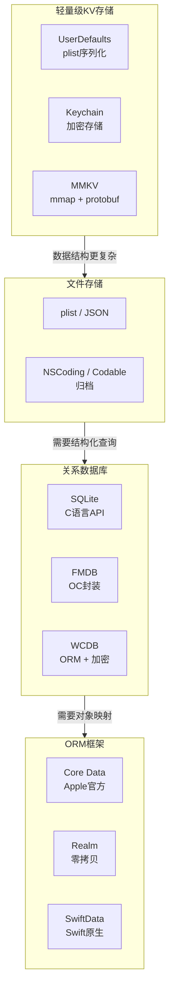

| 方案 | 数据模型 | 查询能力 | 线程安全 | 加密 | 适用场景 |
|------|---------|---------|---------|------|---------|
| UserDefaults | KV (plist类型) | Key查找 | 线程安全 | 无 | 用户偏好、简单配置 |
| Keychain | KV (Data) | Key查找 | 线程安全 | 系统加密 | 密码、Token、证书 |
| MMKV | KV (protobuf) | Key查找 | 线程安全 | 可选AES | 高频读写的KV数据 |
| plist/JSON文件 | 字典/数组 | 无 | 不安全 | 无 | 静态配置、缓存 |
| NSCoding/Codable | 对象图 | 无 | 不安全 | 无 | 对象序列化 |
| SQLite | 关系表 | SQL | 需手动处理 | 可选(SQLCipher) | 结构化数据、复杂查询 |
| FMDB | 关系表 | SQL | FMDatabaseQueue | 可选 | SQLite的OC封装 |
| WCDB | 关系表+ORM | SQL+ORM | 自动管理 | 内置 | 高性能结构化存储 |
| Core Data | 对象图 | NSPredicate | NSManagedObjectContext | 无 | 复杂对象关系 |
| Realm | 对象 | 类型安全查询 | 对象冻结 | 可选AES | 高性能对象存储 |
| SwiftData | Swift对象 | #Predicate宏 | ModelContext | 无 | Swift原生数据持久化 |

## 二、轻量级KV存储

### 2.1 UserDefaults

UserDefaults是iOS最常用的轻量级存储方案，底层将数据以plist格式序列化到磁盘。

**存储机制**：

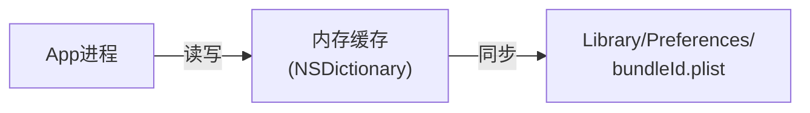

启动时，系统将整个plist文件反序列化到内存中的一个`NSDictionary`。读操作直接访问内存字典，写操作先修改内存字典，再由系统择机将整个字典序列化写回磁盘。

**支持的数据类型**：仅支持Property List类型——`NSData`、`NSString`、`NSNumber`、`NSDate`、`NSArray`、`NSDictionary`。自定义对象需要先转换为`Data`（通过`NSCoding`或`Codable`）。

```swift
// 基础类型
UserDefaults.standard.set(42, forKey: "launchCount")
UserDefaults.standard.set("zh-Hans", forKey: "language")
UserDefaults.standard.set(true, forKey: "hasOnboarded")

// Codable对象
let encoder = JSONEncoder()
if let data = try? encoder.encode(userProfile) {
    UserDefaults.standard.set(data, forKey: "userProfile")
}
```

**性能特点**：

- 首次访问时加载**整个**plist到内存，文件越大启动越慢
- 读取O(1)（内存字典查找）
- 写入时将整个字典重新序列化，单次写入的数据量与总数据量成正比
- `synchronize()`在iOS 12+已不需要手动调用，系统会自动同步

**适用边界**：UserDefaults适合存储少量简单配置数据（几KB到几十KB）。当数据量超过几百KB，或需要频繁写入时，应考虑MMKV等替代方案。

### 2.2 Keychain

Keychain是iOS提供的系统级安全存储方案，数据受iOS Data Protection机制保护——系统使用设备唯一密钥（UID Key，烧录在芯片中）和用户密码派生的密钥构成分层加密体系，对Keychain条目进行AES加密。

**核心特性**：

- 数据存储在系统级的SQLite数据库中（`/var/Keychains/keychain-2.db`），由`securityd`守护进程管理
- 支持Access Control——可要求生物认证（Face ID/Touch ID）才能读取，此时密钥操作由Secure Enclave执行
- App卸载后Keychain数据默认保留（iOS会保留非`ThisDeviceOnly`的条目，重装App后仍可访问）
- 通过Keychain Sharing可在同一开发者的不同App间共享数据

```swift
// 存储密码
func savePassword(_ password: String, for account: String) throws {
    let data = password.data(using: .utf8)!
    let query: [String: Any] = [
        kSecClass as String: kSecClassGenericPassword,
        kSecAttrAccount as String: account,
        kSecValueData as String: data,
        kSecAttrAccessible as String: kSecAttrAccessibleAfterFirstUnlock
    ]
    
    let status = SecItemAdd(query as CFDictionary, nil)
    if status == errSecDuplicateItem {
        let updateQuery: [String: Any] = [
            kSecClass as String: kSecClassGenericPassword,
            kSecAttrAccount as String: account
        ]
        let attributes: [String: Any] = [kSecValueData as String: data]
        SecItemUpdate(updateQuery as CFDictionary, attributes as CFDictionary)
    } else if status != errSecSuccess {
        throw KeychainError.saveFailed(status)
    }
}
```

**Keychain的保护级别**：

| 保护级别 | 可访问时机 | 适用场景 |
|---------|----------|---------|
| `kSecAttrAccessibleWhenUnlocked` | 设备解锁时 | 默认值，大多数场景 |
| `kSecAttrAccessibleAfterFirstUnlock` | 首次解锁后至重启前 | 后台刷新需要的Token |
| `kSecAttrAccessibleWhenPasscodeSetThisDeviceOnly` | 设备设置了密码且解锁时 | 高安全需求，密码移除则删除数据 |
| `kSecAttrAccessibleAlways` | 任何时候（已废弃） | 不推荐使用 |

### 2.3 MMKV

MMKV是微信团队开源的高性能KV存储框架，底层基于mmap内存映射和protobuf序列化。

**核心原理**：

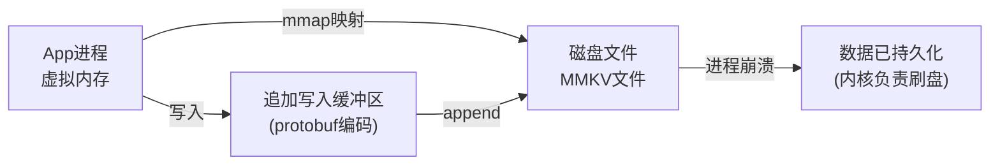

1. 使用`mmap()`将文件映射到进程的虚拟地址空间，写入内存即等同于写入文件
2. 数据以protobuf格式编码，采用**增量追加**写入策略——新数据直接追加到文件末尾
3. 当文件中同一个Key出现多次（旧值+新值），触发**全量重写**（CRC校验 + 去重压缩）

**与UserDefaults性能对比**：

| 操作 | MMKV | UserDefaults |
|------|------|-------------|
| 写入1000次int | ~3ms | ~200ms |
| 写入机制 | 增量追加，O(1) | 全量序列化plist，O(N) |
| 崩溃安全性 | mmap写入即持久化 | 可能丢失未同步数据 |
| 多进程支持 | 支持（文件锁+mmap） | 不支持 |

```swift
import MMKV

// 初始化
MMKV.initialize(rootDir: nil)
let mmkv = MMKV.default()!

// 基础类型
mmkv.set(42, forKey: "count")
mmkv.set("hello", forKey: "greeting")
mmkv.set(true, forKey: "flag")

// 读取
let count = mmkv.int32(forKey: "count")
let greeting = mmkv.string(forKey: "greeting")

// Codable对象
if let data = try? JSONEncoder().encode(user) {
    mmkv.set(data, forKey: "user")
}
```

MMKV适合替代UserDefaults处理高频读写的KV数据场景，如用户配置、AB实验参数、埋点缓存等。

## 三、SQLite——iOS数据库的基石

iOS中几乎所有的关系数据库方案（FMDB、WCDB、Core Data、SwiftData）底层都依赖SQLite。理解SQLite的工作原理，是理解整个iOS数据库生态的基础。

### 3.1 SQLite架构

SQLite是一个嵌入式的、零配置的、无服务器的关系数据库引擎，整个数据库存储在一个单独的磁盘文件中。

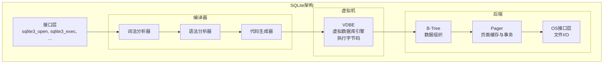

SQL语句的执行流程：

1. **词法/语法分析**：将SQL文本解析为抽象语法树（AST）
2. **代码生成**：将AST转换为VDBE字节码
3. **虚拟机执行**：VDBE逐条执行字节码指令
4. **B-Tree操作**：数据以B-Tree结构组织，支持O(log N)的查找
5. **Pager层**：管理页面缓存、处理事务（WAL/Journal模式）和锁机制
6. **OS接口**：通过VFS（Virtual File System）抽象层执行实际的文件I/O

### 3.2 B-Tree与页面结构

SQLite将数据库文件划分为固定大小的**页面**（默认4096字节），每个表和索引对应一棵B-Tree（数据表使用B+Tree变体——叶子节点存储实际数据行）。

```
数据库文件结构:
┌──────────┐
│  Page 1  │  ← 文件头 + sqlite_master表的根页面
├──────────┤
│  Page 2  │  ← 某个表的B-Tree内部节点
├──────────┤
│  Page 3  │  ← 某个表的B-Tree叶子节点（存储实际数据行）
├──────────┤
│  Page 4  │  ← 某个索引的B-Tree节点
├──────────┤
│   ...    │
└──────────┘
```

B-Tree的查找过程：

```
查找 rowid = 42:

        [10, 30, 50]          ← 内部节点（只存键）
       /     |      \
  [1..9]  [11..29] [31..49] [51..60]  ← 叶子节点（存键+数据行）
                      ↑
                  42在这个范围，找到！
```

**为什么选B-Tree而不是哈希表或平衡二叉树？**

- 哈希表不支持范围查询（`WHERE age > 20 AND age < 30`）
- 平衡二叉树每个节点只存一个键，树高更大，导致更多磁盘I/O
- B-Tree每个节点存多个键，树高低（通常3-4层即可容纳百万级数据），每次磁盘I/O读取一整页可以比较多个键

### 3.3 WAL模式与并发

SQLite支持两种日志模式，对并发性能有重大影响。

**回滚日志（Rollback Journal）模式**（默认）：

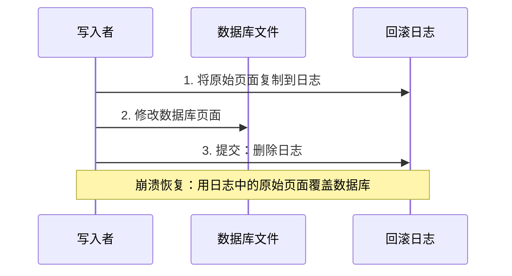

问题：**写入时会阻塞所有读取**，因为读取者可能读到写了一半的数据。

**WAL（Write-Ahead Logging）模式**：

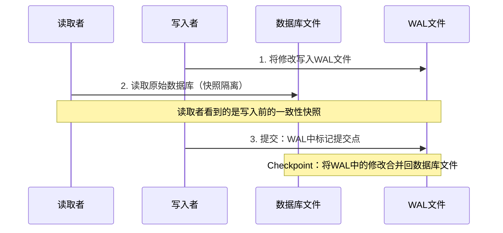

WAL模式的核心优势：**读写可以并发执行，互不阻塞**。读取者始终看到最近一次提交前的一致性快照。这是iOS开发中推荐的模式。

```swift
sqlite3_exec(db, "PRAGMA journal_mode=WAL;", nil, nil, nil)
```

但需要注意：WAL模式下**仍然只允许一个写入者**。多个写入者会串行等待。

### 3.4 SQLite在iOS中的直接使用

iOS系统自带SQLite的动态库（`libsqlite3.tbd`），可以直接使用C语言API。

```swift
import SQLite3

class SQLiteManager {
    private var db: OpaquePointer?
    
    func open(path: String) throws {
        guard sqlite3_open(path, &db) == SQLITE_OK else {
            let error = String(cString: sqlite3_errmsg(db))
            throw DatabaseError.openFailed(error)
        }
        sqlite3_exec(db, "PRAGMA journal_mode=WAL;", nil, nil, nil)
        sqlite3_exec(db, "PRAGMA foreign_keys=ON;", nil, nil, nil)
    }
    
    func createTable() throws {
        let sql = """
            CREATE TABLE IF NOT EXISTS users (
                id INTEGER PRIMARY KEY AUTOINCREMENT,
                name TEXT NOT NULL,
                email TEXT UNIQUE,
                created_at REAL DEFAULT (julianday('now'))
            );
            """
        var errMsg: UnsafeMutablePointer<CChar>?
        guard sqlite3_exec(db, sql, nil, nil, &errMsg) == SQLITE_OK else {
            let error = String(cString: errMsg!)
            sqlite3_free(errMsg)
            throw DatabaseError.executionFailed(error)
        }
    }
    
    // 使用预编译语句（Prepared Statement）防止SQL注入并提升性能
    func insertUser(name: String, email: String) throws {
        let sql = "INSERT INTO users (name, email) VALUES (?, ?);"
        var stmt: OpaquePointer?
        
        guard sqlite3_prepare_v2(db, sql, -1, &stmt, nil) == SQLITE_OK else {
            throw DatabaseError.prepareFailed
        }
        defer { sqlite3_finalize(stmt) }
        
        sqlite3_bind_text(stmt, 1, (name as NSString).utf8String, -1, nil)
        sqlite3_bind_text(stmt, 2, (email as NSString).utf8String, -1, nil)
        
        guard sqlite3_step(stmt) == SQLITE_DONE else {
            throw DatabaseError.stepFailed
        }
    }
    
    func queryUsers() throws -> [(id: Int, name: String, email: String)] {
        let sql = "SELECT id, name, email FROM users ORDER BY id;"
        var stmt: OpaquePointer?
        
        guard sqlite3_prepare_v2(db, sql, -1, &stmt, nil) == SQLITE_OK else {
            throw DatabaseError.prepareFailed
        }
        defer { sqlite3_finalize(stmt) }
        
        var results: [(id: Int, name: String, email: String)] = []
        while sqlite3_step(stmt) == SQLITE_ROW {
            let id = Int(sqlite3_column_int(stmt, 0))
            let name = String(cString: sqlite3_column_text(stmt, 1))
            let email = String(cString: sqlite3_column_text(stmt, 2))
            results.append((id, name, email))
        }
        return results
    }
    
    deinit {
        sqlite3_close(db)
    }
}
```

直接使用SQLite C API的问题是代码冗长、类型不安全、容易出错（如忘记`finalize`）。这催生了各种封装层。

## 四、FMDB——SQLite的Objective-C封装

FMDB是iOS社区使用最广泛的SQLite封装库，由Gus Mueller编写。它的目标是将SQLite的C API封装为友好的Objective-C接口，同时不隐藏SQL本身。

### 4.1 核心类

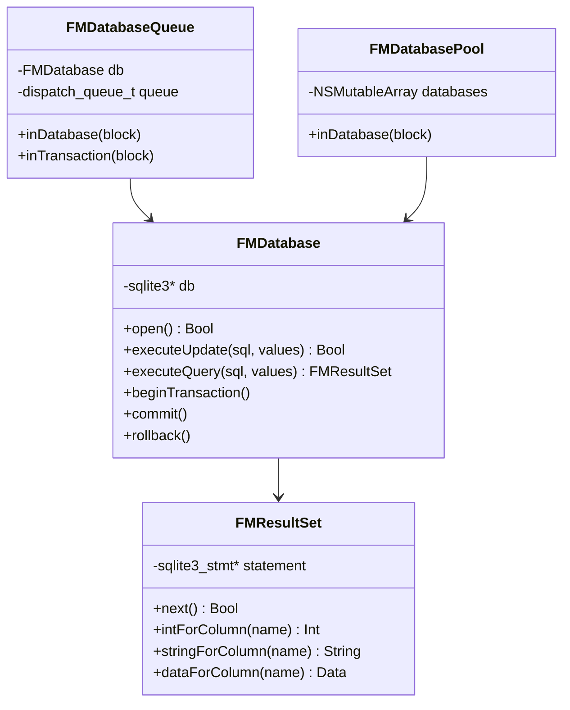

- **FMDatabase**：对`sqlite3*`的封装，提供`executeUpdate`（增删改）和`executeQuery`（查）方法
- **FMResultSet**：对`sqlite3_stmt*`的封装，提供按列名取值的方法
- **FMDatabaseQueue**：线程安全的核心——内部使用串行队列保证所有数据库操作顺序执行
- **FMDatabasePool**：数据库连接池，适用于读多写少的场景

### 4.2 线程安全策略

FMDB的`FMDatabase`本身**不是线程安全**的。在多线程环境下必须使用`FMDatabaseQueue`：

```objc
FMDatabaseQueue *queue = [FMDatabaseQueue databaseQueueWithPath:dbPath];

// 线程安全的写入
[queue inTransaction:^(FMDatabase *db, BOOL *rollback) {
    BOOL success = [db executeUpdate:@"INSERT INTO users (name, email) VALUES (?, ?)",
                    @"张三", @"zhangsan@example.com"];
    if (!success) {
        *rollback = YES;
        return;
    }
    
    success = [db executeUpdate:@"INSERT INTO orders (user_id, amount) VALUES (?, ?)",
               @(db.lastInsertRowId), @(99.9)];
    if (!success) {
        *rollback = YES;
    }
}];

// 线程安全的查询
[queue inDatabase:^(FMDatabase *db) {
    FMResultSet *rs = [db executeQuery:@"SELECT * FROM users WHERE name = ?", @"张三"];
    while ([rs next]) {
        NSString *name = [rs stringForColumn:@"name"];
        NSString *email = [rs stringForColumn:@"email"];
        NSLog(@"%@ - %@", name, email);
    }
    [rs close];
}];
```

`FMDatabaseQueue`的实现原理：内部持有一个`dispatch_queue_t`串行队列和一个`FMDatabase`实例，所有的block都被派发到这个串行队列上执行，从而保证同一时刻只有一个线程访问数据库连接。

需要注意的一个陷阱：**不要在`inDatabase:`或`inTransaction:`的block内部再次调用`inDatabase:`**，这会造成死锁（串行队列的同步调用自己）。

### 4.3 FMDB的局限

- 没有ORM能力，需要手动编写SQL和手动映射对象
- 错误处理依赖返回值检查（BOOL），容易被忽略
- 不支持数据库加密（需要自行集成SQLCipher）
- 不支持模型迁移管理

## 五、WCDB——微信的高性能数据库框架

WCDB是微信团队开源的移动端数据库框架，在SQLite基础上提供了ORM、加密（集成SQLCipher）、损坏修复和全文搜索等能力。

### 5.1 ORM映射

WCDB通过Swift的`CodingKeys`协议实现ORM映射，无需手动编写SQL建表语句：

```swift
import WCDBSwift

class User: TableCodable {
    var id: Int = 0
    var name: String = ""
    var email: String?
    var createdAt: Date = Date()
    
    enum CodingKeys: String, CodingTableKey {
        typealias Root = User
        
        case id
        case name
        case email
        case createdAt
        
        static let objectRelationalMapping = TableBinding(CodingKeys.self) {
            BindColumnConstraint(id, isPrimary: true, isAutoIncrement: true)
            BindColumnConstraint(name, isNotNull: true)
            BindIndex(email, namedWith: "idx_email", isUnique: true)
        }
    }
}
```

### 5.2 CRUD操作

WCDB的查询使用链式调用语法，提供类型安全的查询接口：

```swift
let database = Database(at: dbPath)

// 建表
try database.create(table: "users", of: User.self)

// 插入
let user = User()
user.name = "张三"
user.email = "zhangsan@example.com"
try database.insert(user, intoTable: "users")

// 查询
let users: [User] = try database.getObjects(
    fromTable: "users",
    where: User.Properties.name == "张三",
    orderBy: [User.Properties.createdAt.order(.descending)],
    limit: 10
)

// 更新
try database.update(table: "users",
                    on: User.Properties.email,
                    with: "new@example.com",
                    where: User.Properties.id == 1)

// 删除
try database.delete(fromTable: "users",
                    where: User.Properties.id == 1)
```

### 5.3 数据库加密

WCDB内置了SQLCipher加密支持，加密对上层接口完全透明：

```swift
let database = Database(at: dbPath)
database.setCipher(key: "encryption_key".data(using: .utf8)!)
```

加密机制：SQLCipher对每个数据库页面使用AES-256-CBC加密。每次读写页面时透明地加密/解密。加密后的数据库文件无法用标准SQLite工具打开。

### 5.4 损坏修复

SQLite数据库在极端情况下（如磁盘空间不足、突然断电、操作系统bug）可能损坏。WCDB提供了`Repair`功能，可以从损坏的数据库文件中尽可能恢复数据：

```swift
// 备份修复所需的元数据
database.backup()

// 数据库损坏时执行修复
database.retrieve { fraction in
    // fraction: 修复进度 (0.0 ~ 1.0)
}
```

修复原理：在数据库正常时备份B-Tree的页面结构信息（`sqlite_master`表和各B-Tree根页号），当数据库损坏时，利用备份的结构信息直接遍历未损坏的叶子页面来恢复数据行。

### 5.5 线程安全模型

WCDB的线程安全模型基于**连接池**和**自动事务**：

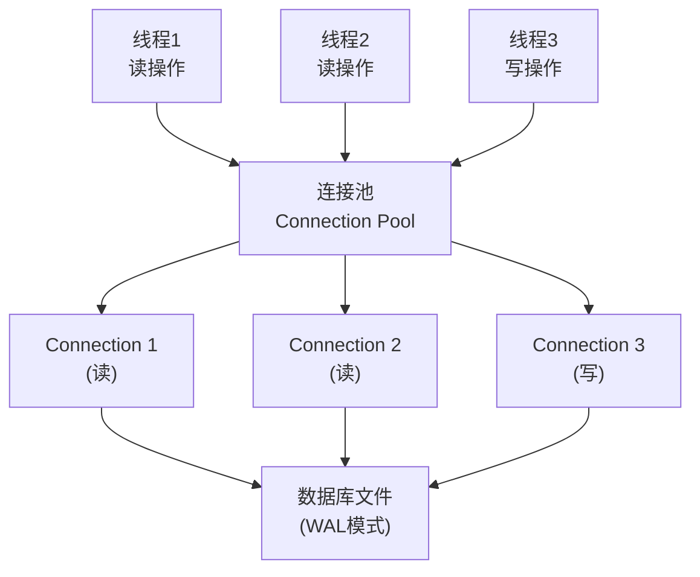

- 读操作可以并发执行（多个连接从连接池获取）
- 写操作串行执行（SQLite WAL模式的限制）
- 连接池自动管理连接的分配与回收，上层无需关心线程安全问题

## 六、Core Data——Apple官方的对象图管理框架

Core Data不仅仅是一个数据库框架——它是一个完整的**对象图管理和持久化**框架。底层默认使用SQLite作为持久化存储，但也支持内存存储和二进制文件存储。

### 6.1 核心架构

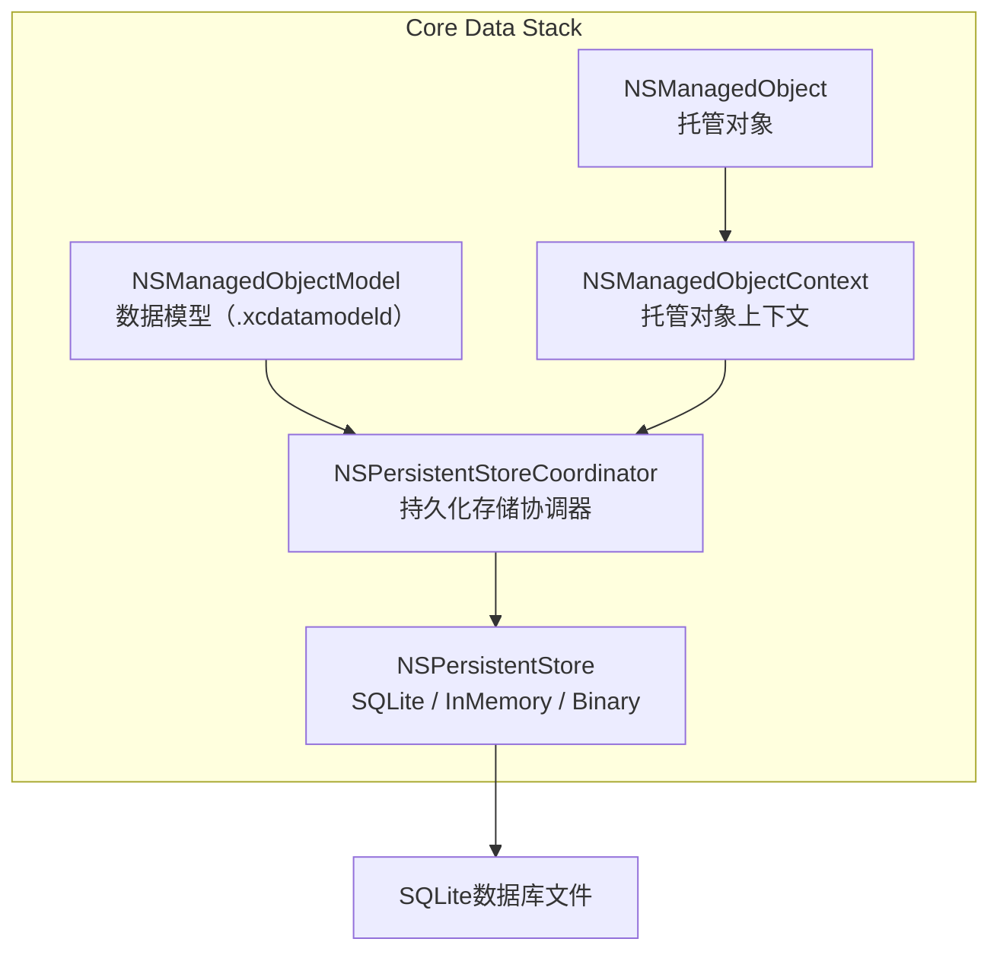

- **NSManagedObjectModel**：对应`.xcdatamodeld`文件，定义实体（Entity）、属性（Attribute）和关系（Relationship）
- **NSPersistentStoreCoordinator**：协调器，连接数据模型和持久化存储，处理数据的序列化/反序列化
- **NSManagedObjectContext**：内存中的"工作区"，所有对象的增删改都在Context中进行，调用`save()`才写入磁盘
- **NSManagedObject**：托管对象，Core Data管理的数据对象

现代iOS开发中通常使用`NSPersistentContainer`来简化Stack的初始化：

```swift
class CoreDataStack {
    static let shared = CoreDataStack()
    
    lazy var persistentContainer: NSPersistentContainer = {
        let container = NSPersistentContainer(name: "DataModel")
        container.loadPersistentStores { description, error in
            if let error = error {
                fatalError("Core Data加载失败: \(error)")
            }
        }
        container.viewContext.automaticallyMergesChangesFromParent = true
        return container
    }()
    
    var viewContext: NSManagedObjectContext {
        persistentContainer.viewContext
    }
    
    func newBackgroundContext() -> NSManagedObjectContext {
        persistentContainer.newBackgroundContext()
    }
}
```

### 6.2 多线程模型

Core Data的线程安全规则只有一条：**NSManagedObjectContext和NSManagedObject不能跨线程使用**。

Core Data提供两种并发模式：

- **mainQueueConcurrencyType**：只能在主线程使用（`viewContext`）
- **privateQueueConcurrencyType**：拥有自己的私有队列（后台Context）

```swift
// 后台写入
let context = CoreDataStack.shared.newBackgroundContext()
context.perform {
    let user = NSEntityDescription.insertNewObject(forEntityName: "User", into: context) as! UserEntity
    user.name = "张三"
    user.email = "zhangsan@example.com"
    
    do {
        try context.save()
    } catch {
        context.rollback()
    }
}

// 主线程读取（UI绑定）
let fetchRequest: NSFetchRequest<UserEntity> = UserEntity.fetchRequest()
fetchRequest.predicate = NSPredicate(format: "name CONTAINS[cd] %@", "张")
fetchRequest.sortDescriptors = [NSSortDescriptor(key: "createdAt", ascending: false)]
fetchRequest.fetchBatchSize = 20

let results = try CoreDataStack.shared.viewContext.fetch(fetchRequest)
```

**跨Context同步**：当后台Context保存数据后，`viewContext`需要知道这些变化。设置`automaticallyMergesChangesFromParent = true`后，`viewContext`会自动合并来自同一`NSPersistentStoreCoordinator`的其他Context的变化。

### 6.3 性能优化

**Faulting（惰性加载）**：

Core Data的对象默认是"fault"状态——一个轻量级占位符，只包含`objectID`。当访问对象的属性时，Core Data才从磁盘加载实际数据。这避免了一次性加载大量数据到内存。

```swift
let users = try context.fetch(fetchRequest)
// users中的对象此时可能是fault状态
// 访问 users[0].name 时才触发实际的数据加载
```

**Batch操作**：

对于大量数据的操作，逐条处理效率极低。Core Data提供了批量操作直接在SQLite层面执行，绕过Context：

```swift
// 批量删除
let deleteRequest = NSBatchDeleteRequest(fetchRequest: UserEntity.fetchRequest())
deleteRequest.resultType = .resultTypeObjectIDs
let result = try context.execute(deleteRequest) as? NSBatchDeleteResult
let objectIDs = result?.result as? [NSManagedObjectID] ?? []
NSManagedObjectContext.mergeChanges(
    fromRemoteContextSave: [NSDeletedObjectsKey: objectIDs],
    into: [context]
)

// 批量更新
let updateRequest = NSBatchUpdateRequest(entityName: "User")
updateRequest.predicate = NSPredicate(format: "isActive == NO")
updateRequest.propertiesToUpdate = ["isArchived": true]
try context.execute(updateRequest)
```

**NSFetchedResultsController**：

与`UITableView`/`UICollectionView`配合使用的利器，自动监听数据变化并驱动UI更新：

```swift
let controller = NSFetchedResultsController(
    fetchRequest: fetchRequest,
    managedObjectContext: viewContext,
    sectionNameKeyPath: nil,
    cacheName: "users"
)
controller.delegate = self
try controller.performFetch()
```

### 6.4 数据迁移

当数据模型发生变化（如添加新属性、修改关系）时，需要进行数据迁移。

**轻量级迁移（Lightweight Migration）**：对于简单的变更（添加属性、添加实体、添加可选关系等），Core Data可以自动推断迁移映射：

```swift
let description = NSPersistentStoreDescription()
description.shouldMigrateStoreAutomatically = true
description.shouldInferMappingModelAutomatically = true
container.persistentStoreDescriptions = [description]
```

**重量级迁移**：对于复杂的变更（属性重命名、数据转换、关系重构），需要创建`NSMappingModel`手动定义迁移规则。

### 6.5 Core Data的优势与局限

| 优势 | 局限 |
|------|------|
| Apple官方维护，与系统深度集成 | 学习曲线陡峭 |
| 强大的对象图管理（关系、级联删除） | NSPredicate查询语法不如SQL直观 |
| 内置变更追踪和撤销/重做 | 调试困难（SQL日志需要启动参数） |
| NSFetchedResultsController驱动UI | 多线程模型容易出错 |
| iCloud同步（NSPersistentCloudKitContainer） | 性能调优需要深入理解内部机制 |

## 七、SwiftData——Swift原生的数据持久化

SwiftData是Apple在WWDC 2023推出的全新框架，底层仍然基于Core Data，但使用Swift宏和语言特性提供了更简洁的API。

### 7.1 模型定义

SwiftData使用`@Model`宏替代`.xcdatamodeld`文件，模型定义直接用Swift代码：

```swift
import SwiftData

@Model
class User {
    var name: String
    @Attribute(.unique) var email: String
    var createdAt: Date
    
    @Relationship(deleteRule: .cascade)
    var posts: [Post] = []
    
    init(name: String, email: String) {
        self.name = name
        self.email = email
        self.createdAt = Date()
    }
}

@Model
class Post {
    var title: String
    var content: String
    var user: User?
    
    init(title: String, content: String) {
        self.title = title
        self.content = content
    }
}
```

`@Model`宏在编译期自动为类生成：`PersistentModel`协议遵循、属性的getter/setter拦截（实现惰性加载和变更追踪）、`Codable`支持等。

### 7.2 容器与上下文

```swift
// App入口配置
@main
struct MyApp: App {
    var body: some Scene {
        WindowGroup {
            ContentView()
        }
        .modelContainer(for: [User.self, Post.self])
    }
}

// SwiftUI View中使用
struct UserListView: View {
    @Environment(\.modelContext) private var context
    @Query(sort: \User.createdAt, order: .reverse) private var users: [User]
    
    var body: some View {
        List(users) { user in
            VStack(alignment: .leading) {
                Text(user.name)
                Text(user.email)
                    .foregroundStyle(.secondary)
            }
        }
    }
    
    func addUser() {
        let user = User(name: "新用户", email: "new@example.com")
        context.insert(user)
        // SwiftData自动保存，无需手动调用save()
    }
    
    func deleteUsers(at offsets: IndexSet) {
        for index in offsets {
            context.delete(users[index])
        }
    }
}
```

### 7.3 #Predicate宏

SwiftData使用`#Predicate`宏替代`NSPredicate`，提供编译期类型检查：

```swift
// 类型安全的查询——拼写错误或类型不匹配会在编译期报错
let predicate = #Predicate<User> { user in
    user.name.contains("张") && user.createdAt > someDate
}

let descriptor = FetchDescriptor<User>(
    predicate: predicate,
    sortBy: [SortDescriptor(\.createdAt, order: .reverse)]
)
descriptor.fetchLimit = 20

let users = try context.fetch(descriptor)
```

对比`NSPredicate`：

```swift
// NSPredicate——字符串拼接，运行时才能发现错误
let predicate = NSPredicate(format: "name CONTAINS[cd] %@ AND createdAt > %@", "张", someDate as NSDate)
```

### 7.4 SwiftData vs Core Data

| 对比项 | SwiftData | Core Data |
|-------|-----------|-----------|
| 模型定义 | `@Model`宏，纯Swift代码 | `.xcdatamodeld`可视化编辑器 |
| 查询语法 | `#Predicate`宏，编译期检查 | `NSPredicate`字符串 |
| SwiftUI集成 | `@Query`属性包装器 | 需要手动桥接 |
| 并发 | Actor隔离的`ModelContext` | 手动管理Context线程归属 |
| 最低版本 | iOS 17+ | iOS 3+ |
| 成熟度 | 较新，仍在演进 | 十多年的生产验证 |
| OC支持 | 不支持 | 支持 |

SwiftData适合iOS 17+的新项目，尤其是与SwiftUI深度集成的场景。但对于需要支持低版本系统或需要更精细控制的场景，Core Data仍然是更稳妥的选择。

## 八、Realm——高性能对象数据库

Realm是一个为移动端设计的对象数据库，不基于SQLite，而是自研的存储引擎。

### 8.1 存储引擎

Realm的核心特性是**零拷贝架构**：

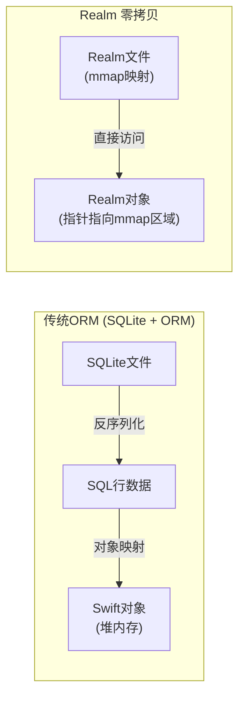

传统ORM从SQLite读取数据需要经过：磁盘读取 → SQL行解析 → 对象创建和属性赋值。Realm通过mmap将整个数据文件映射到内存，对象的属性访问直接读取mmap区域的数据，无需拷贝和转换。

这使得Realm的读取性能通常优于基于SQLite的方案，特别是在读取大量对象时。

### 8.2 基本使用

```swift
import RealmSwift

class Dog: Object {
    @Persisted(primaryKey: true) var id: ObjectId
    @Persisted var name: String = ""
    @Persisted var age: Int = 0
    @Persisted var owner: User?
}

class User: Object {
    @Persisted(primaryKey: true) var id: ObjectId
    @Persisted var name: String = ""
    @Persisted var dogs: List<Dog>
}

// 写入
let realm = try! Realm()
try! realm.write {
    let user = User()
    user.name = "张三"
    
    let dog = Dog()
    dog.name = "旺财"
    dog.age = 3
    dog.owner = user
    user.dogs.append(dog)
    
    realm.add(user)
}

// 查询——惰性求值，不会立即加载所有结果
let puppies = realm.objects(Dog.self)
    .where { $0.age < 2 }
    .sorted(byKeyPath: "name")

// 实时通知
let token = puppies.observe { changes in
    switch changes {
    case .initial(let results):
        // 初始数据加载完成
        print("当前有\(results.count)只小狗")
    case .update(let results, let deletions, let insertions, let modifications):
        // 数据发生变化
        print("新增: \(insertions), 删除: \(deletions), 修改: \(modifications)")
    case .error(let error):
        print("观察错误: \(error)")
    }
}
```

### 8.3 线程模型

Realm的线程安全规则：**Realm实例和Realm对象不能跨线程传递**。每个线程需要创建自己的Realm实例。

```swift
// 在后台线程操作
DispatchQueue.global().async {
    autoreleasepool {
        let realm = try! Realm()
        
        try! realm.write {
            let user = User()
            user.name = "后台创建的用户"
            realm.add(user)
        }
    }
}
```

Realm提供了`ThreadSafeReference`来安全地跨线程传递对象引用：

```swift
let user = realm.objects(User.self).first!
let reference = ThreadSafeReference(to: user)

DispatchQueue.global().async {
    let realm = try! Realm()
    guard let user = realm.resolve(reference) else { return }
    try! realm.write {
        user.name = "更新后的名字"
    }
}
```

Realm 10+还引入了**冻结对象（Frozen Objects）**，冻结后的对象是不可变的快照，可以安全地跨线程传递：

```swift
let frozenUser = user.freeze()
DispatchQueue.global().async {
    print(frozenUser.name)  // 安全访问
}
```

### 8.4 Realm的优势与局限

| 优势 | 局限 |
|------|------|
| 零拷贝读取，性能优异 | 不支持SQL，复杂查询能力有限 |
| 实时数据通知，响应式编程 | 对象必须继承`Object`，侵入性强 |
| 内置加密（AES-256） | 不支持跨进程访问 |
| Realm Sync云同步 | 数据库文件不能用标准工具查看 |
| 模型迁移比Core Data简单 | 不支持聚合查询（GROUP BY等） |

## 九、数据库索引原理

索引是数据库性能优化中最重要的工具。理解索引的工作原理，有助于写出高性能的数据库代码。

### 9.1 索引的本质

数据库索引类似于书籍的目录——在不翻阅整本书（全表扫描）的情况下快速定位到目标内容。

SQLite的索引是一棵独立的B-Tree，Key是被索引列的值，Value是对应数据行的rowid。

假设有一张用户表，存了8条数据：

```
表数据（按rowid顺序存储）:
rowid=1: {name:"张三", age:25, city:"北京"}
rowid=2: {name:"李四", age:30, city:"上海"}
rowid=3: {name:"王五", age:22, city:"北京"}
rowid=4: {name:"赵六", age:28, city:"广州"}
rowid=5: {name:"钱七", age:35, city:"深圳"}
rowid=6: {name:"孙八", age:22, city:"杭州"}
rowid=7: {name:"周九", age:31, city:"成都"}
rowid=8: {name:"吴十", age:28, city:"武汉"}
```

现在执行查询：`SELECT * FROM users WHERE age = 28`

**无索引——全表扫描**：数据库不知道 age=28 的行在哪里，只能从第1行开始逐行检查，直到扫完全部8行。即使第4行就找到了一条，数据库也不能停下来，因为后面可能还有——事实上 rowid=8 也符合条件。数据量越大，查询越慢，时间复杂度 O(N)。

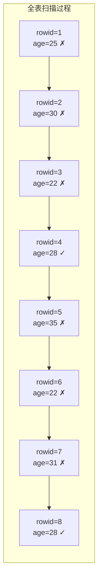

每一行都要检查，8条数据就要比较8次。如果表里有100万行，就要比较100万次。

**有索引——B-Tree查找**：对 age 列建立索引后，SQLite会构建一棵B-Tree，所有 age 值按顺序组织成树形结构：

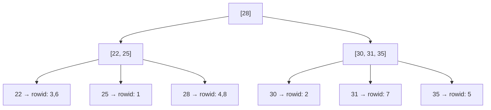

查找 age=28 的过程：
1. 从根节点开始：28 等于根节点的值28，找到了对应的叶子节点
2. 叶子节点告诉我们：age=28 的数据在 rowid=4 和 rowid=8
3. 根据 rowid 直接定位到表中的第4行和第8行取出完整数据（这步叫"回表"）

整个过程只需要 2~3 次比较就能定位到结果，无论表中有多少行数据。这就是 O(log N) 和 O(N) 的差距——100万行数据，全表扫描要比较100万次，B-Tree查找只需要约20次（log₂1000000 ≈ 20）。

**为什么B-Tree适合做索引？** 因为B-Tree的每个节点可以存储多个Key并拥有多个子节点，树的高度很低。SQLite默认的页大小是4096字节，一个索引节点通常能容纳数百个Key，所以即使是百万级数据，B-Tree的高度也只有3~4层——也就是说只需要3~4次磁盘I/O就能定位到任何一条记录。

### 9.2 复合索引与最左前缀

复合索引是对多个列建立的索引，列的顺序非常重要：

```sql
CREATE INDEX idx_city_age ON users(city, age);
```

这个索引按`(city, age)`的组合排序：

```
("北京", 25) → rowid=1
("北京", 25) → rowid=3
("广州", 28) → rowid=4
("上海", 30) → rowid=2
```

**最左前缀原则**——查询条件必须从索引最左列开始才能命中：

| 查询条件 | 是否命中索引 | 原因 |
|---------|------------|------|
| `WHERE city = '北京' AND age = 25` | 完全命中 | 两列都匹配 |
| `WHERE city = '北京'` | 部分命中 | 最左列匹配 |
| `WHERE age = 25` | 不命中 | 跳过了最左列 |
| `WHERE city = '北京' AND age > 20` | 部分命中 | city精确匹配，age范围扫描 |

### 9.3 索引的代价

索引不是免费的：

- **空间代价**：每个索引是一棵独立的B-Tree，占用额外存储空间
- **写入代价**：INSERT/UPDATE/DELETE操作需要同时更新所有相关索引
- **维护代价**：索引碎片化后需要`REINDEX`重建

### 9.4 索引实践建议

**适合建索引的场景**：

| 场景 | 示例 | 原因 |
|------|------|------|
| 频繁出现在WHERE条件中的列 | `WHERE user_id = ?` | 将全表扫描降为B-Tree查找 |
| ORDER BY / GROUP BY 的列 | `ORDER BY created_at DESC` | 索引本身有序，避免额外排序 |
| JOIN连接条件的列 | `ON a.user_id = b.user_id` | 加速表连接时的匹配查找 |
| 高选择性的列（不同值多） | 用户ID、手机号、订单号 | 每次查找能过滤掉大部分数据 |

**不适合建索引的场景**：

| 场景 | 示例 | 原因 |
|------|------|------|
| 低选择性的列 | `is_deleted`（只有0和1） | 索引几乎无法缩小扫描范围，B-Tree查找后仍需遍历约一半的数据 |
| 数据量很小的表 | 配置表（几十行） | 全表扫描本身就很快，索引的B-Tree查找反而多了一次间接寻址 |
| 写多读少的表 | 日志表（大量INSERT，很少SELECT） | 每次写入都要同时维护索引的B-Tree，拖慢写入性能 |
| 频繁大批量更新的列 | 每次请求都更新的`last_active_time` | 每次UPDATE都触发索引重排，性能损耗大于查询收益 |
| 对列使用函数或运算的查询 | `WHERE LOWER(name) = 'test'` | 索引存储的是原始值，函数运算后无法命中索引（需要建函数索引） |

## 十、数据库方案选型指南

不同的业务场景应选择不同的数据库方案：

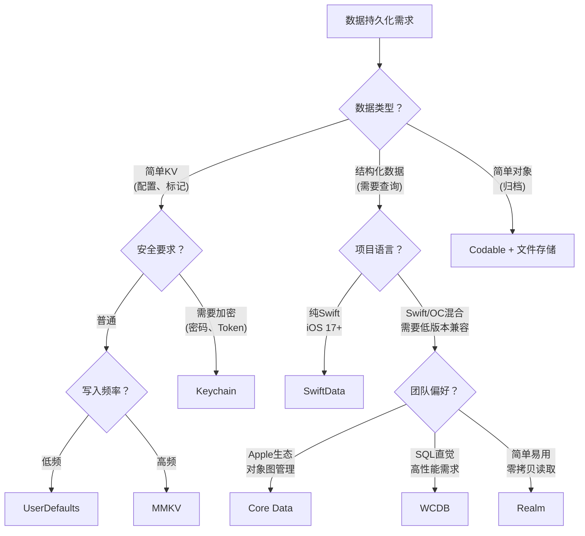

| 场景 | 推荐方案 | 理由 |
|------|---------|------|
| 用户偏好设置 | UserDefaults | 系统原生，简单可靠 |
| 高频读写的配置/缓存 | MMKV | mmap写入，性能远超UserDefaults |
| 密码、Token | Keychain | 系统级硬件加密 |
| IM消息存储 | WCDB | 高写入性能，加密支持，损坏修复 |
| 复杂对象关系（社交关系图等） | Core Data | 对象图管理，关系维护 |
| SwiftUI新项目 | SwiftData | Swift原生，与SwiftUI深度集成 |
| 跨平台项目 | Realm | 支持iOS/Android/Web |
| 只读的本地数据集 | SQLite直接使用 | 简单直接，无需ORM开销 |

## 十一、常见面试问题

**Q: SQLite的WAL模式是什么？为什么推荐使用？**

WAL（Write-Ahead Logging）是SQLite的一种日志模式。与默认的回滚日志模式不同，WAL将修改先写入WAL文件而不是直接修改数据库文件。核心优势是读写可以并发执行——读取者看到的是最近一次提交前的一致性快照，写入者的操作不会阻塞读取。iOS上推荐使用WAL模式以获得更好的并发性能。

**Q: 数据库索引为什么能加速查询？什么时候不该建索引？**

没有索引时，数据库只能从第一行开始逐行扫描直到最后一行（全表扫描，O(N)）。索引本质是一棵独立的B-Tree，将被索引列的值按顺序组织成树形结构。由于B-Tree每个节点可容纳数百个Key，树高度极低（百万级数据通常只有3~4层），查找任意值只需3~4次节点比较即可定位，时间复杂度O(log N)。例如100万行数据，全表扫描最坏需要100万次比较，B-Tree查找只需约20次。不该建索引的情况：低选择性的列（如`is_deleted`只有0和1，索引无法有效缩小范围）、数据量很小的表（全表扫描本身就很快）、写多读少的表（每次写入都要维护索引B-Tree）、频繁更新的列（每次UPDATE都触发索引重排）、以及查询条件中对列使用了函数的情况（如`WHERE LOWER(name) = 'test'`，索引存的是原始值无法命中）。

**Q: Realm的零拷贝是怎么实现的？**

Realm使用mmap将数据文件映射到进程的虚拟地址空间。Realm对象的属性访问实际上是通过计算属性直接读取mmap区域中对应偏移量的数据，不需要将数据从磁盘复制到中间缓冲区再复制到对象属性中。这消除了传统ORM的"读取行 → 解析 → 创建对象 → 赋值属性"的多次内存拷贝过程。

**Q: MMKV相比UserDefaults的性能优势在哪里？**

UserDefaults每次写入都需要将整个plist字典重新序列化并写入磁盘，时间复杂度与总数据量成正比。MMKV基于mmap内存映射和protobuf序列化，使用增量追加写入策略——新数据直接追加到文件末尾，单次写入时间与写入数据量成正比，与总数据量无关。同时mmap写入由操作系统内核负责异步刷盘，即使进程崩溃也不会丢失数据。
