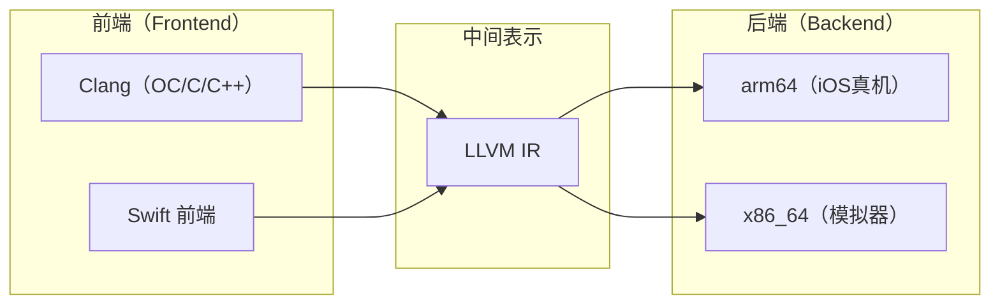
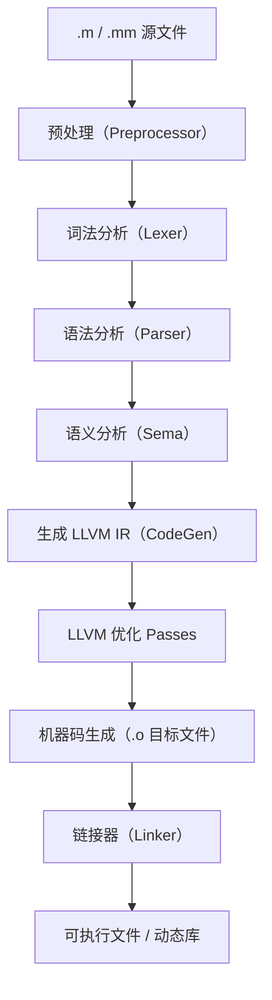
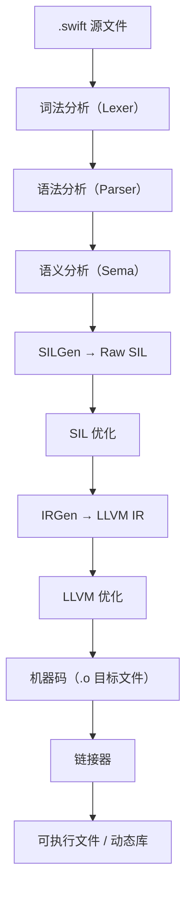
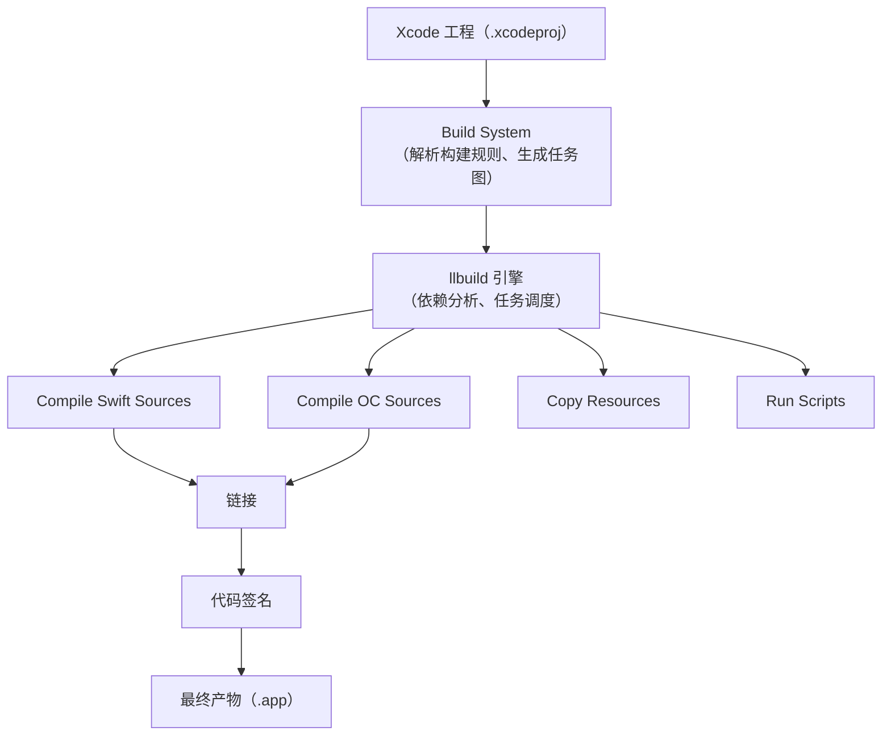
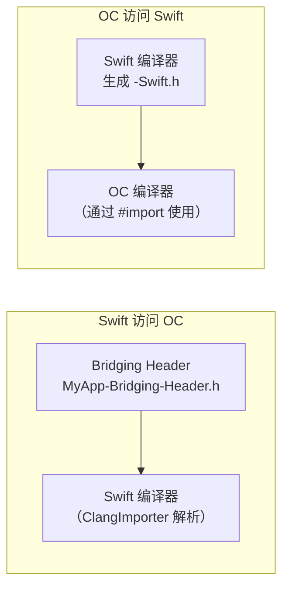
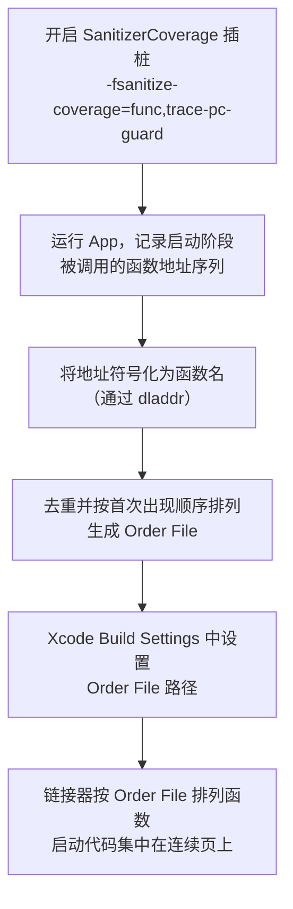
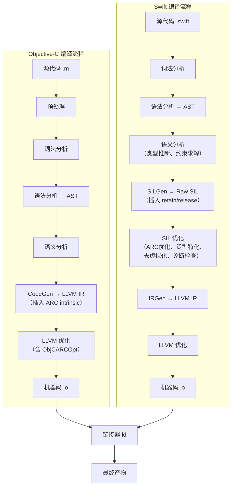

+++
title = "iOS编译原理"
date = '2026-05-02T22:32:27+08:00'
draft = false
weight = 19
tags = ["iOS", "面试", "基础"]
categories = ["iOS开发", "面试"]
+++
## 编译器架构：LLVM 与 Clang

iOS 开发中的两种主要语言 Objective-C 和 Swift 都基于 LLVM 编译器基础设施。理解 LLVM 的架构是理解 iOS 编译原理的基础。

### LLVM 的三段式架构

LLVM 采用经典的**前端-中间表示-后端**三段式设计，将编译过程解耦为三个独立的阶段：



| 阶段 | 职责 | iOS 中的实现 |
|------|------|------------|
| **前端（Frontend）** | 词法分析、语法分析、语义分析，将源码转换为中间表示 | Clang（OC/C/C++）、Swift 前端 |
| **中间表示（IR）** | 与语言无关、与平台无关的中间形式，承载优化 | LLVM IR（Swift 还有额外的 SIL 层） |
| **后端（Backend）** | 将 IR 转换为目标平台的机器码 | arm64（真机）、x86_64（Intel 模拟器） |

三段式架构的核心优势是**解耦**：新增一门语言只需实现一个前端，新增一个目标平台只需实现一个后端，所有语言和平台共享同一套优化基础设施。这正是 Apple 能同时支持 OC 和 Swift 两种语言、多种架构（arm64、x86_64）的技术基础。

### Clang：OC/C/C++ 的前端

Clang 是 LLVM 项目中面向 C 系语言（C/C++/Objective-C/Objective-C++）的编译器前端。Apple 从 Xcode 5 开始将 Clang 作为默认编译器，替代了之前的 GCC。

Clang 相比 GCC 的核心优势：

- **编译速度更快**：模块化架构，支持增量编译和预编译模块（PCM）
- **诊断信息更精确**：错误提示包含列号、代码片段和 Fix-it 建议
- **与 IDE 深度集成**：提供 libclang 和 AST 接口，支持代码补全、重构
- **更好的标准兼容性**：对 C/C++/OC 标准的支持更加完整

### Swift 编译器

Swift 有独立于 Clang 的编译器前端，但最终也输出 LLVM IR，复用 LLVM 后端。Swift 编译器在 AST 和 LLVM IR 之间额外引入了 **SIL（Swift Intermediate Language）** 层，用于执行 Swift 特有的优化和安全检查。

关于 Swift 编译流程和 SIL 的详细内容，参见 [SIL](./SIL.md)。

---

## Objective-C 编译流程

### 整体流程

OC 源文件（`.m`/`.mm`）经过 Clang 前端处理后，生成 LLVM IR，再由 LLVM 后端生成目标机器码：



### 预处理（Preprocessing）

预处理是编译的第一步，发生在词法分析之前。预处理器是一个**文本替换引擎**，不理解 C/OC 的语法语义，只做基于文本的宏展开和文件拼接。

预处理器的主要工作：

| 指令 | 作用 | 示例 |
|------|------|------|
| `#include`/`#import` | 将头文件内容**文本插入**到当前位置 | `#import <UIKit/UIKit.h>` |
| `#define` | 定义宏（文本替换规则） | `#define MAX(a,b) ((a)>(b)?(a):(b))` |
| `#ifdef`/`#ifndef`/`#if` | 条件编译，选择性地包含或排除代码段 | `#ifdef DEBUG ... #endif` |
| `#pragma` | 编译器指令 | `#pragma mark -` |

**宏展开**是预处理阶段的核心。宏分为两类：

- **对象宏（Object-like Macro）**：简单的文本替换，如 `#define PI 3.14159`
- **函数宏（Function-like Macro）**：带参数的文本替换，如 `#define MAX(a,b) ((a)>(b)?(a):(b))`

函数宏的参数不做任何类型检查，只是纯文本替换，因此容易产生意料之外的行为（如参数有副作用时被多次求值）。

预处理完成后的输出称为**翻译单元（Translation Unit）**——它是一个完整的、不含预处理指令的源文件，包含了所有被展开的宏、插入的头文件内容，是后续编译阶段的输入。

可以通过以下命令查看预处理结果：

```bash
clang -E main.m -o main.i
```

### 词法分析（Lexical Analysis）

词法分析器（Lexer）扫描预处理后的翻译单元，将字符流切分为**Token（词法单元）**序列。Token 是编译器能识别的最小有意义单位。

```objc
// 源码
int count = 42;
```

```
// Token序列
keyword    : int
identifier : count
operator   : =
literal    : 42
punctuation: ;
```

Token 的主要类型：

| Token 类型 | 示例 |
|-----------|------|
| 关键字（Keyword） | `int`, `if`, `@interface`, `@property` |
| 标识符（Identifier） | `myClass`, `viewDidLoad`, `count` |
| 字面量（Literal） | `42`, `3.14`, `@"hello"`, `YES` |
| 运算符（Operator） | `+`, `==`, `->`, `?:` |
| 标点符号（Punctuation） | `{`, `}`, `(`, `)`, `;`, `,` |

Lexer 在生成 Token 的同时会记录每个 Token 的**源码位置**（文件名、行号、列号），这些信息在后续阶段用于生成精确的错误诊断信息。

### 语法分析（Parsing）

语法分析器（Parser）读取 Token 流，根据 OC 的语法规则将其组织为 **AST（Abstract Syntax Tree，抽象语法树）**。AST 是源码的树状结构化表示，每个节点对应一个语法结构。

```objc
// 源码
@interface Person : NSObject
@property (nonatomic, copy) NSString *name;
- (void)greet;
@end
```

```
// AST 大致结构（简化）
ObjCInterfaceDecl "Person" : NSObject
├── ObjCPropertyDecl "name" : NSString*
│   ├── ObjCPropertyAttribute: nonatomic
│   └── ObjCPropertyAttribute: copy
└── ObjCMethodDecl "-greet" : void
```

OC 的 AST 中有一些独特的节点类型：

| AST 节点类型 | 说明 |
|-------------|------|
| `ObjCInterfaceDecl` | @interface 声明 |
| `ObjCCategoryDecl` | Category 声明 |
| `ObjCProtocolDecl` | Protocol 声明 |
| `ObjCPropertyDecl` | @property 声明 |
| `ObjCMethodDecl` | 方法声明（实例方法`-`或类方法`+`） |
| `ObjCMessageExpr` | 消息发送表达式 `[obj method]` |

可以通过以下命令查看 AST：

```bash
clang -Xclang -ast-dump -fsyntax-only main.m
```

### 语义分析（Semantic Analysis）

语义分析（Sema）在 AST 上执行类型检查和语义验证，确保代码在语义上是合法的。这是编译前端中发现大部分编译错误的阶段。

语义分析的主要工作：

- **类型检查**：验证表达式中的类型是否匹配，例如不能将 `NSString*` 赋值给 `int`
- **方法签名验证**：检查 `@implementation` 中的方法签名是否与 `@interface` 声明一致
- **协议一致性检查**：验证遵循协议的类是否实现了所有 `@required` 方法
- **属性特性验证**：检查 `@property` 的属性组合是否合法（如 `copy` 只能用于实现了 `NSCopying` 的对象类型）
- **ARC 语义检查**：在 ARC 模式下检查内存管理语义（如 `__bridge` 转换是否正确）
- **隐式转换插入**：自动插入必要的类型转换，如 `int` 到 `NSInteger`、C 数组到指针的退化

OC 特有的一个语义特性是**消息发送的宽松检查**：由于 OC 的动态性，编译器对消息发送的类型检查相对宽松。当接收者类型为 `id` 时，编译器几乎不做方法存在性检查，将发现推迟到运行时。这是 OC 灵活性的来源，也是 `unrecognized selector` 崩溃的根源。

### IR 生成（CodeGen）

语义分析通过后，Clang 的代码生成器（CodeGen）将 AST 转换为 **LLVM IR**。这一步会将 OC 的高级语义映射到 LLVM 的通用表示。

OC 语义到 LLVM IR 的关键映射：

| OC 语义 | LLVM IR 表示 |
|---------|-------------|
| `[obj method]` | `call @objc_msgSend(obj, sel, ...)` |
| `@property` 的 getter/setter | 自动合成的 C 函数 |
| `@try/@catch` | LLVM 异常处理 intrinsics |
| ARC 的 retain/release | `call @objc_retain` / `call @objc_release` |
| Block 字面量 | 结构体 + 捕获变量 + 函数指针 |
| `@synchronized` | `call @objc_sync_enter` / `call @objc_sync_exit` |

ARC 是在 CodeGen 阶段实现的——编译器分析对象的生命周期，在合适的位置插入 `objc_retain`、`objc_release`、`objc_autoreleaseReturnValue` 等 Runtime 调用。这些调用在 LLVM IR 中表现为普通的函数调用，但会被标记为 ARC 相关的 intrinsic，让 LLVM 后续的优化 Pass 能够识别并优化它们。

### LLVM 优化

LLVM 接收 IR 后，通过一系列 **Optimization Pass** 对其进行优化。每个 Pass 执行一种特定的优化变换：

| 优化 Pass | 说明 |
|-----------|------|
| **Dead Code Elimination** | 删除永远不会执行的代码 |
| **Constant Folding** | 编译期计算常量表达式（如 `3 + 5` 直接替换为 `8`） |
| **Function Inlining** | 将小函数的函数体展开到调用点 |
| **Loop Optimization** | 循环展开、循环不变量外提、循环向量化 |
| **Instruction Combining** | 合并多条指令为更高效的等价指令 |
| **ObjCARCOpt** | 消除冗余的 `objc_retain`/`objc_release` 配对 |
| **Tail Call Optimization** | 将尾调用优化为跳转，避免栈帧增长 |
| **SCCP** | 稀疏条件常量传播，追踪常量值的传播路径 |
| **GVN** | 全局值编号，消除冗余计算 |

**ObjCARCOpt** 是 LLVM 中专门为 OC ARC 设计的优化 Pass。它利用 ARC intrinsic 的标记信息，分析 `objc_retain`/`objc_release` 调用的数据流关系，消除那些"配对"的、不影响对象生命周期的冗余引用计数操作。这是 OC ARC 性能接近手动内存管理的关键。

Xcode 中的优化级别对应不同的 Pass 组合：

| Xcode 设置 | 编译器标志 | 说明 |
|-----------|----------|------|
| None | `-O0` | 不做优化，编译最快，调试信息最完整 |
| Fast | `-O1` | 基础优化，编译速度和运行效率的平衡 |
| Faster | `-O2` | 更激进的优化，大部分 Release 构建的默认选择 |
| Fastest, Smallest | `-Os` | 在 `-O2` 基础上优先优化代码体积（Apple 推荐用于 iOS） |
| Fastest, Aggressive | `-O3` | 最激进的优化，可能增大代码体积 |

### 机器码生成与链接

LLVM 后端将优化后的 IR 转换为目标平台的机器码，输出 `.o` 目标文件。每个源文件生成一个 `.o` 文件。

最后由链接器（ld64 / ld-prime）将所有 `.o` 文件、静态库（`.a`）、动态库（`.dylib`/`.tbd`）链接为最终产物（可执行文件或动态库）。链接器的主要工作：

- **符号解析**：将每个未定义符号（如函数调用、全局变量引用）与其他目标文件或库中的定义匹配
- **重定位**：将代码和数据中的地址引用修正为最终的虚拟地址
- **生成 Mach-O**：按照 Mach-O 格式组织最终产物，包含 Header、Load Commands、Segments/Sections、符号表、代码签名等

关于 Mach-O 文件格式和链接的详细内容，参见 [Mach-O的链接、装载与库](./Mach-O的链接、装载与库.md)。

---

## Swift 编译流程

Swift 的编译流程与 OC 有显著不同，主要体现在额外的 SIL 层和模块化设计：



### 与 OC 编译流程的关键差异

| 差异点 | Objective-C | Swift |
|--------|-------------|-------|
| **预处理** | 有预处理阶段（宏展开、头文件插入） | 无预处理阶段（Swift 5.9 引入的 Macro 是编译期代码转换，不是文本替换） |
| **中间表示** | 直接生成 LLVM IR | 先生成 SIL，优化后再转为 LLVM IR |
| **模块系统** | 基于头文件 + Clang Module（`.pcm`） | 原生模块系统（`.swiftmodule`） |
| **类型检查强度** | 相对宽松（`id` 类型绕过检查） | 严格的编译期类型检查 |
| **ARC 实现位置** | CodeGen 阶段插入 intrinsic，ObjCARCOpt Pass 优化 | SILGen 阶段保守插入，SIL 层 OSSA 优化 |
| **全模块优化** | 无此概念 | 支持 WMO（Whole Module Optimization） |

### SIL 层的意义

Swift 在 AST 和 LLVM IR 之间引入 SIL 这一中间层，是因为 LLVM IR 无法表达 Swift 的许多高级语义。SIL 承担了以下职责：

- **ARC 优化**：基于所有权模型（OSSA）精确消除冗余的 retain/release
- **泛型特化**：为具体类型生成去泛型的特化版本
- **去虚拟化**：将间接调用替换为直接调用
- **编译期诊断**：确定初始化检查、内存排他性检查等

关于 SIL 和 Swift 编译流程各阶段的详细内容，参见 [SIL](./SIL.md)。

---

## Xcode 构建系统

### Xcode Build System 架构

从 Xcode 10 开始，Apple 使用**新构建系统（New Build System）** 替代了之前基于 GNU Make 的旧系统。新构建系统基于 **llbuild**（Low-Level Build System）构建引擎，提供更好的并行化和增量构建能力。



Xcode Build System 的职责：

1. **解析项目配置**：读取 `.xcodeproj`、Build Settings、Build Phases
2. **生成任务依赖图**：分析源文件、资源、脚本之间的依赖关系
3. **调度并行编译**：基于依赖图最大化并行度，独立的编译任务同时执行
4. **增量构建**：仅重新编译发生变更的文件及其依赖

### Build Phases

Xcode 将构建过程组织为若干 **Build Phases**，按顺序（部分可并行）执行：

| Build Phase | 说明 | 对应操作 |
|-------------|------|---------|
| **Dependencies** | 构建依赖的其他 Target | 先编译 Framework Target |
| **Compile Sources** | 编译源代码 | clang/swiftc 编译 .m/.swift |
| **Link Binary With Libraries** | 链接库 | ld 链接 .o + 库 → 可执行文件 |
| **Copy Bundle Resources** | 复制资源文件 | 图片、XIB、Storyboard、JSON 等 |
| **Run Script** | 执行自定义脚本 | SwiftLint、CocoaPods、代码生成 |
| **Copy Files** | 复制文件到指定目录 | 嵌入动态库（Embed Frameworks） |
| **Code Signing** | 代码签名 | codesign 签名 |

### 单个源文件的编译过程

当 Xcode 编译一个 `.m` 文件时，实际执行的命令类似：

```bash
clang -x objective-c \
  -arch arm64 \
  -isysroot /path/to/iPhoneOS.sdk \
  -I/path/to/headers \
  -F/path/to/frameworks \
  -fobjc-arc \
  -fmodules \
  -O2 \
  -c ViewController.m \
  -o ViewController.o
```

主要参数的含义：

| 参数 | 说明 |
|------|------|
| `-x objective-c` | 指定源文件语言 |
| `-arch arm64` | 目标架构 |
| `-isysroot` | SDK 路径（包含系统头文件和库） |
| `-I` / `-F` | 头文件搜索路径 / Framework 搜索路径 |
| `-fobjc-arc` | 启用 ARC |
| `-fmodules` | 启用 Clang Modules |
| `-O2` | 优化级别 |
| `-c` | 只编译不链接，生成 `.o` 文件 |

编译 `.swift` 文件时，使用 `swiftc`：

```bash
swiftc -module-name MyApp \
  -sdk /path/to/iPhoneOS.sdk \
  -target arm64-apple-ios15.0 \
  -import-objc-header MyApp-Bridging-Header.h \
  -O \
  -emit-module \
  -emit-object \
  ViewController.swift \
  -o ViewController.o
```

### 增量编译与依赖分析

Xcode 的增量编译基于**文件级别的依赖追踪**：

**OC 的增量编译**：

OC 的编译单元是**单个 `.m` 文件加上它包含的所有头文件**。当一个 `.m` 文件或它依赖的任何头文件发生变化时，只有这个 `.m` 文件需要重新编译。Clang 在编译每个 `.m` 文件时会记录它依赖的头文件列表（`.d` 依赖文件），Xcode 基于此判断哪些文件需要重编。

**Swift 的增量编译**：

Swift 的增量编译更加复杂，因为 Swift 模块内的文件之间可能存在隐式依赖（同模块的类型声明无需 import 即可互相引用）。Swift 编译器会生成 **`.swiftdeps` 依赖文件**，记录每个文件提供和使用的声明。当某个文件发生变化时，编译器通过依赖图分析**级联影响**——如果文件 A 修改了一个被文件 B 使用的公开 API，那么文件 B 也需要重新编译。

Swift 还有一个**跨模块增量编译**的限制：当 OC Bridging Header 发生变化时，所有 Swift 文件都需要重新编译，因为编译器无法精确追踪桥接头文件中哪些声明被哪些 Swift 文件使用。

### 混编项目的编译顺序

OC/Swift 混编项目中，两种语言的互操作通过以下机制实现：



| 互操作方向 | 机制 | 生成时机 |
|-----------|------|---------|
| **Swift 调用 OC** | Bridging Header（`MyApp-Bridging-Header.h`） | 开发者手动维护 |
| **OC 调用 Swift** | Generated Header（`MyApp-Swift.h`） | Swift 编译完成后自动生成 |

这意味着编译存在**顺序约束**：OC 文件中如果使用了 Swift 类型（通过 `#import "MyApp-Swift.h"`），必须等 Swift 文件编译完成后才能编译。Xcode 的构建系统会自动处理这种依赖关系。

---

## 编译优化技术

### OC 侧的编译优化

#### Clang Module 缓存

启用 Clang Modules 后（`-fmodules`），编译器会将已解析的模块缓存为 **`.pcm`（Precompiled Module）** 文件。同一模块在第一次编译时被解析和缓存，后续编译直接复用缓存结果，避免重复解析大量头文件。

#### PCH（Precompiled Header）

PCH 将常用但不常变动的头文件预编译为二进制格式，编译每个 `.m` 文件时直接加载 PCH 而非重新解析。但 PCH 有明显的缺陷——修改 PCH 中的任何头文件会导致所有 `.m` 文件重新编译。Clang Module 是 PCH 的现代替代方案。

关于 Clang Module 和 PCH 的详细对比，参见 [Objective-C中import详解](./Objective-C中import详解.md)。

#### LTO（Link-Time Optimization）

LTO 将优化推迟到链接阶段，此时链接器拥有整个程序的全局视图，能够执行跨编译单元的优化：

| LTO 类型 | 说明 | 编译体积影响 |
|---------|------|------------|
| **Full LTO** | 所有 `.o` 文件的 IR 合并为一个模块后统一优化 | 大幅减小，但链接耗时长 |
| **Thin LTO** | 各模块独立优化，但共享全局摘要信息以指导优化决策 | 接近 Full LTO 效果，链接更快 |

LTO 能够实现的优化包括：

- 跨文件的函数内联
- 跨文件的死代码消除（链接器可以移除整个程序中没有被引用的函数）
- 跨文件的常量传播

在 Xcode 中通过 **Build Settings → Link-Time Optimization** 设置：

| 设置 | 说明 |
|------|------|
| No | 关闭 LTO |
| Monolithic | Full LTO |
| Incremental | Thin LTO（推荐） |

### Swift 侧的编译优化

#### WMO（Whole Module Optimization）

WMO 是 Swift 编译器特有的优化模式。默认情况下 Swift 以文件为单位单独编译（单文件模式），编译器只能看到当前文件中的信息。开启 WMO 后，编译器将整个模块的所有 `.swift` 文件作为一个编译单元处理，能够执行更激进的优化：

| 优化类型 | 单文件模式 | WMO 模式 |
|---------|-----------|---------|
| 去虚拟化 | 仅限 `final`/`private` 标记的方法 | 可分析整个模块确认是否有子类覆盖 |
| 泛型特化 | 仅限当前文件中的调用 | 可为跨文件的泛型调用生成特化版本 |
| 函数内联 | 仅限当前文件中的函数 | 可内联其他文件中的函数 |
| 死代码消除 | 文件级别 | 模块级别，消除整个模块中未使用的代码 |

开启 WMO 的方式：

```bash
swiftc -whole-module-optimization main.swift utils.swift
```

或在 Xcode Build Settings 中设置 **Compilation Mode = Whole Module**。

WMO 的代价是**失去增量编译能力**——模块内任何一个文件变动都会触发整个模块的重新编译。因此通常的做法是：Debug 用单文件模式（增量编译快），Release 用 WMO（运行时性能好）。

关于 WMO 的更多细节和 SIL 层面的优化，参见 [SIL](./SIL.md)。

#### Library Evolution / 模块稳定性

Swift 5.0 引入 ABI 稳定性，Swift 5.1 引入模块稳定性。启用 Library Evolution 后，Swift 编译器会生成 `.swiftinterface` 文本文件（类似 OC 的头文件），使得不同 Swift 版本编译的二进制能够互相链接。

这对编译产物有以下影响：

- 编译器会对开启 Library Evolution 的模块采用**不透明布局**（Opaque Layout）：结构体的字段偏移量在运行时通过元数据查询，而非编译期硬编码。这保证了新增字段不会破坏已编译的客户端，但会带来一定的运行时开销
- 未开启 Library Evolution 的模块使用**固定布局**（Frozen Layout），字段偏移量在编译期确定，性能更好但不允许在不破坏 ABI 的情况下修改结构体布局

关于 Swift 二进制兼容性和 Library Evolution 的详细内容，参见 [Swift二进制兼容性](./Swift二进制兼容性.md)。

---

## 编译插桩（Instrumentation）

编译插桩是在编译期间由编译器自动向代码中注入额外指令的技术。这些注入的指令不改变原有程序逻辑，但能在运行时收集函数调用、分支覆盖、内存访问等信息。插桩是代码覆盖率统计、性能分析、二进制重排等能力的底层基础。

### 插桩的基本原理

编译器在生成代码时，根据指定的插桩选项，在函数入口/出口、基本块边界、条件分支等位置插入额外的回调或计数指令。这些插入发生在 LLVM IR 层（通过 Instrumentation Pass），对开发者的源码透明。


### Sanitizer 插桩

LLVM 提供了一系列 Sanitizer 工具，通过编译插桩在运行时检测各类内存和并发错误。Xcode 直接集成了这些工具。

| Sanitizer | 编译标志 | 检测目标 | 插桩方式 |
|-----------|---------|---------|---------|
| **ASan（Address Sanitizer）** | `-fsanitize=address` | 内存越界、use-after-free、double-free、栈缓冲区溢出 | 在每次内存读写操作前插入边界检查代码，使用 Shadow Memory 映射追踪内存的合法访问区域 |
| **TSan（Thread Sanitizer）** | `-fsanitize=thread` | 数据竞争（Data Race） | 在每次内存访问和同步操作处插入记录指令，运行时通过 happens-before 算法检测竞争 |
| **UBSan（Undefined Behavior Sanitizer）** | `-fsanitize=undefined` | 未定义行为（整数溢出、空指针解引用、类型转换错误等） | 在可能触发 UB 的操作前插入检查指令 |

以 ASan 为例，对于如下内存访问：

```c
int arr[10];
arr[i] = 42;
```

ASan 插桩后等效的逻辑为：

```c
int arr[10];
// ASan 插入的检查
if (IsPoisoned(&arr[i])) {
    ReportError(&arr[i], kWrite, 4);
}
arr[i] = 42;
```

ASan 的**Shadow Memory** 机制：将应用程序的每 8 字节内存映射到 Shadow Memory 的 1 字节，该字节记录原始 8 字节中哪些是可访问的。数组前后会被标记为"红区"（Redzone），任何对红区的访问都会被检测到。

在 Xcode 中启用 Sanitizer：**Product → Scheme → Edit Scheme → Diagnostics** 面板，勾选对应的 Sanitizer。注意 ASan 和 TSan 不能同时启用。

### SanitizerCoverage（代码覆盖率插桩）

SanitizerCoverage 是 LLVM 提供的通用覆盖率插桩框架（`-fsanitize-coverage=...`），通过在编译期插入回调函数，让开发者在运行时获取程序的执行路径信息。

SanitizerCoverage 支持多种插桩粒度：

| 粒度 | 编译标志 | 说明 |
|------|---------|------|
| **函数级** | `-fsanitize-coverage=func` | 在每个函数入口插入回调 |
| **基本块级** | `-fsanitize-coverage=bb` | 在每个基本块（Basic Block）入口插入回调 |
| **边级** | `-fsanitize-coverage=edge` | 在控制流图的每条边上插入回调 |
| **Trace PC Guard** | `-fsanitize-coverage=trace-pc-guard` | 在每个边上插入带 guard 变量的回调（最常用） |

以 `trace-pc-guard` 为例，编译器会做两件事：

1. **初始化回调**：在模块加载时调用 `__sanitizer_cov_trace_pc_guard_init(uint32_t *start, uint32_t *stop)`，传入该模块所有 guard 变量的起止地址
2. **执行回调**：在每个插桩点插入 `__sanitizer_cov_trace_pc_guard(uint32_t *guard)` 调用

开发者需要自行实现这两个函数来收集数据：

```c
void __sanitizer_cov_trace_pc_guard_init(uint32_t *start, uint32_t *stop) {
    static uint64_t N;
    if (start == stop || *start) return;
    for (uint32_t *x = start; x < stop; x++) {
        *x = ++N;
    }
}

void __sanitizer_cov_trace_pc_guard(uint32_t *guard) {
    if (!*guard) return;

    // 通过 __builtin_return_address(0) 获取调用者地址
    void *PC = __builtin_return_address(0);
    // 记录 PC 地址，后续可通过符号化还原为函数名
}
```

### 二进制重排中的插桩应用

SanitizerCoverage 在 iOS 中最典型的应用场景是**启动阶段的二进制重排**。

**问题背景**：App 启动时，代码分布在不同的内存页上。当 CPU 执行到尚未加载的页时会触发 **Page Fault**（缺页中断），由内核将对应页从磁盘加载到物理内存。启动阶段如果代码分布分散，会产生大量 Page Fault，增加启动耗时。

**解决思路**：通过插桩收集启动阶段实际被执行的函数顺序，然后生成 **Order File**，让链接器按此顺序排列函数，使启动阶段的代码集中在连续的内存页上，减少 Page Fault。



收集启动阶段函数调用顺序的实现要点：

```c
#include <dlfcn.h>
#include <libkern/OSAtomicQueue.h>

typedef struct {
    void *pc;
    void *next;
} PCNode;

static OSQueueHead queue = OS_ATOMIC_QUEUE_INIT;

void __sanitizer_cov_trace_pc_guard(uint32_t *guard) {
    if (!*guard) return;
    *guard = 0; // 每个位置只记录一次

    PCNode *node = malloc(sizeof(PCNode));
    node->pc = __builtin_return_address(0);
    // 使用原子队列保证线程安全
    OSAtomicEnqueue(&queue, node, offsetof(PCNode, next));
}
```

启动完成后（如 `didFinishLaunchingWithOptions` 末尾），将队列中的地址取出、符号化、去重，写入文件即为 Order File。

在 Xcode 中配置 Order File：**Build Settings → Linking → Order File** 设置文件路径，链接器（ld）在链接阶段会按文件中的顺序排列函数符号。

关于二进制重排的更多实践细节，参见 [启动优化-二进制重排](../ios-advanced/启动优化/启动优化-二进制重排.md)。

### 代码覆盖率（Code Coverage）

Xcode 内置的代码覆盖率功能基于 LLVM 的 Source-based Code Coverage，原理同样是编译插桩。

开启方式：**Product → Scheme → Edit Scheme → Test → Options → Code Coverage** 勾选。编译标志为 `-fprofile-instr-generate -fcoverage-mapping`。

插桩机制：

1. **`-fprofile-instr-generate`**：在每个函数入口和基本块边界插入计数器（counter），运行时记录每个代码区域被执行的次数。程序退出时将计数数据写入 `.profraw` 文件
2. **`-fcoverage-mapping`**：在编译产物中嵌入**覆盖率映射表**（Coverage Mapping），记录每个计数器对应的源码区域（文件、行号、列号范围）


Xcode 的覆盖率统计会自动完成上述流程，在 Report Navigator 中展示行级别的覆盖率数据。

### PGO（Profile-Guided Optimization）

PGO 利用插桩收集的运行时 Profile 数据指导编译器做更精准的优化决策。它是覆盖率插桩技术在编译优化领域的直接应用。

PGO 的三阶段流程：

| 阶段 | 操作 | 说明 |
|------|------|------|
| **1. Instrumented Build** | 使用 `-fprofile-instr-generate` 编译 | 生成插桩版本的二进制 |
| **2. Training Run** | 运行典型的使用场景 | 收集运行时 Profile 数据（`.profraw`） |
| **3. Optimized Build** | 使用 `-fprofile-instr-use=file.profdata` 编译 | 编译器利用 Profile 数据做针对性优化 |

PGO 能指导编译器做出以下更优的决策：

- **分支预测优化**：将热路径（高频执行路径）排列在 fall-through 位置，减少分支跳转
- **函数内联决策**：对高频调用的函数更积极地内联，对冷函数避免内联以减小代码体积
- **基本块排布**：将热基本块排列在一起，提高指令缓存（I-Cache）命中率
- **函数排布**：将互相调用频繁的函数排列在相邻位置

在 Xcode 中可通过 **Build Settings → Use Optimization Profile** 配置 PGO。

### 插桩对性能的影响

插桩会引入额外的运行时开销，不同类型的插桩影响差异显著：

| 插桩类型 | 运行时开销 | 内存开销 | 适用场景 |
|---------|-----------|---------|---------|
| ASan | 约 2x 减速 | 约 2-3x 内存增加 | Debug 构建、CI 测试 |
| TSan | 约 5-15x 减速 | 约 5-10x 内存增加 | 多线程问题排查 |
| UBSan | 较小（<20%） | 较小 | Debug 构建、CI 测试 |
| Coverage | 较小（<20%） | 较小（计数器开销） | 单元测试 |
| SanitizerCoverage | 较小 | 取决于回调实现 | 数据采集（如二进制重排） |

因此插桩通常仅在 Debug/测试构建中开启，Release 构建应关闭所有插桩（PGO 除外——PGO 的最终产物不包含插桩）。

---

## OC 和 Swift 编译流程对比



| 对比维度 | Objective-C | Swift |
|---------|-------------|-------|
| **预处理** | 有（宏展开、头文件插入） | 无（Swift 5.9 Macro 是编译期代码转换，非文本替换预处理） |
| **模块系统** | 头文件 + Clang Module（`.pcm`） | 原生模块（`.swiftmodule` + `.swiftinterface`） |
| **类型安全** | 弱类型检查（`id` 绕过） | 强类型检查（编译期类型推断和验证） |
| **特有中间表示** | 无 | SIL（用于 Swift 特有优化） |
| **ARC 优化位置** | LLVM 层（ObjCARCOpt Pass） | SIL 层（OSSA 所有权模型） |
| **ARC 优化能力** | 基于 intrinsic 标记做数据流分析 | 基于所有权语义精确追踪每个值的生命周期 |
| **泛型** | 不支持（使用 `id` + Protocol 的运行时多态） | 编译期泛型 + SIL 层特化优化 |
| **全模块优化** | 依赖 LTO（链接阶段） | 原生支持 WMO（编译阶段） |
| **增量编译粒度** | 单文件（`.m` + 依赖头文件） | 单文件 + 声明级依赖分析 |
| **编译速度** | 通常更快（语言简单，预编译模块缓存） | 通常更慢（类型推断、约束求解、SIL 优化） |

---

## 编译加速实践

### 通用优化

| 策略 | 说明 | 适用场景 |
|------|------|---------|
| **减少头文件包含** | OC 中使用 `@class` 前置声明替代 `#import`（在 `.h` 中声明，在 `.m` 中 `#import`） | OC 项目 |
| **启用 Clang Module** | 避免重复解析头文件 | OC 项目 |
| **模块化构建** | 将大项目拆分为多个 Framework/静态库，独立编译各模块 | 大型项目 |
| **预编译二进制** | 依赖库使用预编译的 `.xcframework` 而非源码编译 | 三方依赖多的项目 |
| **减少 Bridging Header 大小** | 只在桥接头文件中暴露必要的 OC 声明，减少 Swift 重编范围 | 混编项目 |
| **Xcode 并行构建** | 设置合理的并行编译任务数 | 所有项目 |

### Debug 构建优化

| 策略 | 说明 |
|------|------|
| 使用 `-O0`（不优化） | 加快编译速度，保留完整调试信息 |
| Swift 使用单文件编译模式 | 保留增量编译能力 |
| 启用 Eager Linking | Xcode 15+ 加速链接 |
| 使用 Debug 信息格式 `dwarf` | 不生成 dSYM 文件（Debug 不需要） |

### Release 构建优化

| 策略 | 说明 |
|------|------|
| 使用 `-Os` 优化级别 | Apple 推荐的 iOS 优化级别（体积和速度的平衡） |
| Swift 使用 WMO | 开启全模块优化 |
| 启用 LTO（建议 Thin LTO） | 跨模块优化 |
| 启用 Dead Code Stripping | 移除未使用的代码（`-dead_strip`） |
| 生成 Bitcode（已弃用） | iOS 16+ 不再需要 Bitcode |

---

## 常见面试题

### Q1: iOS 的编译器架构是怎样的？LLVM 的三段式设计有什么优势？

LLVM 采用前端-中间表示-后端的三段式架构。前端负责将源码转换为中间表示（LLVM IR），后端负责将 IR 转换为目标平台的机器码。iOS 中有两个前端：Clang 处理 OC/C/C++，Swift 编译器处理 Swift，两者最终都输出 LLVM IR，共享 LLVM 后端。

三段式设计的核心优势是解耦：新增一门语言只需实现前端，新增一个目标平台只需实现后端，所有语言和平台共享同一套优化基础设施（LLVM 的 Optimization Passes）。这使得 Apple 能用统一的后端同时支持 OC 和 Swift、多种 CPU 架构（arm64、x86_64），而不需要为每种语言-架构组合各写一套编译器。

### Q2: OC 的编译流程是怎样的？各阶段做了什么？

OC 的编译流程为：预处理 → 词法分析 → 语法分析 → 语义分析 → IR 生成 → LLVM 优化 → 机器码生成 → 链接。

1. **预处理**：文本替换引擎，展开宏（`#define`）、插入头文件（`#import`）、处理条件编译（`#ifdef`），输出翻译单元
2. **词法分析**：将字符流切分为 Token 序列（关键字、标识符、字面量、运算符等），同时记录源码位置信息
3. **语法分析**：将 Token 流组织为 AST（抽象语法树），包含 OC 特有的节点类型如 `ObjCMessageExpr`（消息发送）、`ObjCPropertyDecl`（属性声明）等
4. **语义分析**：在 AST 上执行类型检查、协议一致性检查、ARC 语义检查等，发现大部分编译错误
5. **IR 生成（CodeGen）**：将 AST 转为 LLVM IR。消息发送 `[obj method]` 变为 `call @objc_msgSend`，ARC 在此阶段插入 `objc_retain`/`objc_release` 等 intrinsic
6. **LLVM 优化**：通过一系列 Pass 优化 IR，包括通用优化（死代码消除、常量折叠、内联等）和 OC 专用的 ObjCARCOpt Pass（消除冗余的 retain/release 配对）
7. **机器码生成**：LLVM 后端将 IR 转为目标架构的机器码（`.o` 文件）
8. **链接**：链接器将所有 `.o` 文件和库链接为最终的 Mach-O 可执行文件

### Q3: OC 和 Swift 的编译流程有什么核心区别？

核心区别有五点：

1. **预处理**：OC 有预处理阶段（宏展开、头文件插入），Swift 没有预处理器，没有文本替换宏（Swift 5.9 引入的 Macro 是编译期 AST 转换，本质不同）
2. **中间表示**：OC 直接从 AST 生成 LLVM IR；Swift 在两者之间额外引入 SIL 层，用于执行 ARC 优化、泛型特化、去虚拟化等 Swift 特有优化
3. **ARC 实现**：OC 的 ARC 在 CodeGen 阶段插入 intrinsic，由 LLVM 的 ObjCARCOpt Pass 优化；Swift 的 ARC 在 SILGen 阶段保守插入 retain/release，由 SIL 层的 OSSA 所有权模型精确优化，优化效果更激进
4. **模块系统**：OC 基于头文件 + Clang Module（`.pcm`），Swift 使用原生模块系统（`.swiftmodule`），无需头文件
5. **全模块优化**：OC 依赖链接阶段的 LTO 做跨文件优化；Swift 原生支持编译阶段的 WMO，能在更高层次（SIL）上做跨文件优化

### Q4: 什么是 LTO？它能做什么优化？

LTO（Link-Time Optimization，链接时优化）将编译器优化推迟到链接阶段执行。传统编译中，每个源文件独立编译为 `.o` 文件，编译器只能看到当前文件的信息。LTO 模式下，编译器输出的 `.o` 文件包含 LLVM IR（而非机器码），链接器在链接时将所有 IR 合并后统一优化，此时拥有整个程序的全局视图。

LTO 能实现的优化包括：跨文件的函数内联（文件 A 中的函数可以被内联到文件 B 的调用点）、跨文件的死代码消除（移除整个程序中没有被任何地方引用的函数和全局变量）、跨文件的常量传播（将文件 A 中定义的常量直接替换到文件 B 的使用处）。

LTO 分两种：Full LTO 将所有模块合并为一个后统一优化，效果最好但链接慢；Thin LTO 各模块独立优化但共享全局摘要信息，效果接近 Full LTO 但链接更快，是 Apple 推荐的方式。

### Q5: WMO 和 LTO 有什么区别？

两者都是跨文件优化技术，但工作层次和适用范围不同：

| 对比维度 | WMO | LTO |
|---------|-----|-----|
| **所属编译器** | Swift 编译器 | LLVM（OC/Swift 共享） |
| **工作阶段** | 编译阶段（SIL 层） | 链接阶段（LLVM IR 层） |
| **优化范围** | 单个 Swift 模块内的所有文件 | 整个程序的所有编译单元 |
| **优化类型** | Swift 特有优化（泛型特化、去虚拟化、OSSA ARC 优化等） | 通用 LLVM 优化（内联、死代码消除、常量传播等） |
| **增量编译影响** | 丧失模块内增量编译能力 | 丧失链接阶段的增量能力 |

两者不冲突，可以同时开启。Swift 项目中 WMO 先在 SIL 层完成模块内的 Swift 特有优化，然后 LTO 再在链接阶段完成跨模块的通用优化。

### Q6: 什么是编译插桩？在 iOS 中有哪些应用场景？

编译插桩是编译器在生成代码时自动注入额外指令的技术，这些指令不改变程序逻辑，但能在运行时收集执行信息。插桩发生在 LLVM IR 层，通过 Instrumentation Pass 实现，对源码透明。

iOS 中的主要应用场景：

1. **Sanitizer 运行时检测**：ASan 在每次内存访问前插入边界检查（通过 Shadow Memory 追踪合法区域）；TSan 在内存访问和同步操作处插入记录指令检测数据竞争；UBSan 在可能触发未定义行为的操作前插入检查
2. **二进制重排**：通过 SanitizerCoverage（`-fsanitize-coverage=func,trace-pc-guard`）在每个函数入口插入回调，收集启动阶段的函数调用顺序，生成 Order File 指导链接器将启动代码集中排列，减少 Page Fault
3. **代码覆盖率**：`-fprofile-instr-generate` 在基本块边界插入计数器记录执行次数，`-fcoverage-mapping` 嵌入映射表关联计数器与源码位置，用于测试覆盖率统计
4. **PGO（Profile-Guided Optimization）**：先用插桩版本收集运行时热路径数据，再用 Profile 数据指导重新编译，优化分支预测、函数内联和基本块排布

插桩会带来运行时开销（ASan 约 2x、TSan 约 5-15x），因此通常仅在 Debug/测试环境使用。PGO 是例外——最终 Release 产物不包含插桩。

### Q7: 混编项目中 OC 和 Swift 是如何互操作的？对编译有什么影响？

Swift 调用 OC 通过 **Bridging Header**：开发者在 `MyApp-Bridging-Header.h` 中 `#import` 需要暴露给 Swift 的 OC 头文件，Swift 编译器通过内置的 ClangImporter 解析这些头文件，将 OC 的类型声明映射为 Swift 可用的类型。

OC 调用 Swift 通过 **Generated Header**：Swift 编译器在编译完成后自动生成 `MyApp-Swift.h` 头文件，将标记为 `@objc` 的 Swift 声明转换为 OC 头文件格式，OC 文件通过 `#import "MyApp-Swift.h"` 使用。

对编译的影响：由于 `MyApp-Swift.h` 在 Swift 编译完成后才生成，使用 Swift 类型的 OC 文件必须等 Swift 编译完成后才能开始编译，这引入了编译顺序约束。此外，Bridging Header 的变更会导致所有 Swift 文件重新编译，因此应该尽量控制桥接头文件的大小。
