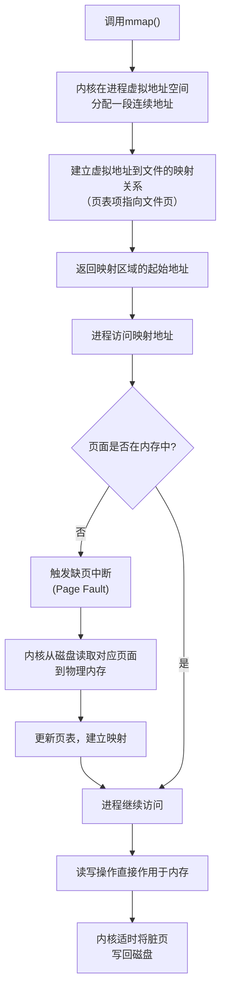

+++
title = "mmap详解"
date = '2026-05-07T10:26:09+08:00'
draft = false
weight = 21
tags = ["iOS", "面试", "基础"]
categories = ["iOS开发", "面试"]
+++
mmap（Memory-mapped file，内存映射文件）是一种将文件或设备映射到进程地址空间的技术。通过mmap，可以像操作内存一样操作文件，是iOS开发中实现高性能IO的重要手段。

---

## 基本概念

### 什么是mmap

mmap是一个POSIX系统调用，它在进程的虚拟地址空间中创建一个映射，将文件内容映射到内存地址。映射建立后，对该内存区域的读写操作会直接反映到文件上。

- **文件映射**：将磁盘上的普通文件映射到内存，用于高效读写文件内容（iOS开发中最常用）
- **设备映射**：将硬件设备的I/O内存（如显卡显存、网卡缓冲区）映射到用户空间，让程序可以像读写内存一样直接与硬件交互，常用于驱动开发和嵌入式系统


| 方式 | 数据流向 | 拷贝次数 |
|-----|---------|---------|
| 传统IO | 磁盘 → 内核缓冲 → 用户缓冲 | 2次 |
| mmap | 磁盘 ↔ 映射区域（直接访问） | 0次 |

### mmap的工作原理



---

## API详解

### mmap函数原型

```c
#include <sys/mman.h>

void *mmap(
    void *addr,      // 建议的映射起始地址，通常传NULL让系统决定
    size_t length,   // 映射区域的长度（字节）
    int prot,        // 内存保护标志（可读/可写/可执行）
    int flags,       // 映射类型标志
    int fd,          // 文件描述符
    off_t offset     // 文件偏移量（必须是页大小的整数倍）
);

// 返回值：成功返回映射区域的起始地址，失败返回MAP_FAILED
```

### 参数详解

**prot（内存保护标志）**：

| 标志 | 值 | 说明 |
|-----|---|------|
| PROT_NONE | 0 | 页面不可访问 |
| PROT_READ | 1 | 页面可读 |
| PROT_WRITE | 2 | 页面可写 |
| PROT_EXEC | 4 | 页面可执行 |

**flags（映射类型标志）**：

| 标志 | 说明 |
|-----|------|
| MAP_SHARED | 共享映射，对映射区域的修改会写回文件，其他映射该文件的进程可见 |
| MAP_PRIVATE | 私有映射，对映射区域的修改不会写回文件（写时复制） |
| MAP_FIXED | 强制使用指定的addr地址，如果不可用则失败 |
| MAP_ANONYMOUS | 匿名映射，不关联文件，fd应为-1 |
| MAP_FILE | 文件映射（默认值） |

### munmap函数

```c
int munmap(void *addr, size_t length);

// 解除映射
// addr: mmap返回的地址
// length: 映射长度
// 返回值：成功返回0，失败返回-1
```

### msync函数

```c
int msync(void *addr, size_t length, int flags);

// 将映射区域的修改同步到文件
// flags:
//   MS_ASYNC  - 异步同步，立即返回
//   MS_SYNC   - 同步等待，直到写入完成
//   MS_INVALIDATE - 使其他映射失效
```

---

## 基本使用示例

### 读取文件

```c
#include <sys/mman.h>
#include <sys/stat.h>
#include <fcntl.h>
#include <unistd.h>
#include <stdio.h>

void read_file_with_mmap(const char *path) {
    // 1. 打开文件
    int fd = open(path, O_RDONLY);
    if (fd < 0) {
        perror("open");
        return;
    }
    
    // 2. 获取文件大小
    struct stat sb;
    if (fstat(fd, &sb) < 0) {
        perror("fstat");
        close(fd);
        return;
    }
    
    // 3. 创建只读映射
    char *mapped = mmap(
        NULL,           // 让系统选择地址
        sb.st_size,     // 映射整个文件
        PROT_READ,      // 只读
        MAP_PRIVATE,    // 私有映射
        fd,             // 文件描述符
        0               // 从文件开头开始
    );
    
    if (mapped == MAP_FAILED) {
        perror("mmap");
        close(fd);
        return;
    }
    
    // 4. 可以关闭fd了，映射仍然有效
    close(fd);
    
    // 5. 直接访问文件内容
    printf("File content:\n%.*s\n", (int)sb.st_size, mapped);
    
    // 6. 解除映射
    munmap(mapped, sb.st_size);
}
```

### 写入文件

```c
void write_file_with_mmap(const char *path, size_t size) {
    // 1. 打开或创建文件
    int fd = open(path, O_RDWR | O_CREAT | O_TRUNC, 0644);
    if (fd < 0) {
        perror("open");
        return;
    }
    
    // 2. 设置文件大小（mmap要求文件有足够空间）
    if (ftruncate(fd, size) < 0) {
        perror("ftruncate");
        close(fd);
        return;
    }
    
    // 3. 创建可读写的共享映射
    char *mapped = mmap(
        NULL,
        size,
        PROT_READ | PROT_WRITE,  // 可读可写
        MAP_SHARED,               // 共享映射，修改会写回文件
        fd,
        0
    );
    
    if (mapped == MAP_FAILED) {
        perror("mmap");
        close(fd);
        return;
    }
    
    close(fd);
    
    // 4. 直接写入数据
    const char *data = "Hello, mmap!";
    for (int i = 0; data[i]; i++) {
        mapped[i] = data[i];
    }
    
    // 5. 可选：强制同步到磁盘
    msync(mapped, size, MS_SYNC);
    
    // 6. 解除映射
    munmap(mapped, size);
}
```

### 匿名映射（分配内存）

```c
// 使用mmap分配内存（类似malloc，但更底层）
void *allocate_with_mmap(size_t size) {
    void *ptr = mmap(
        NULL,
        size,
        PROT_READ | PROT_WRITE,
        MAP_PRIVATE | MAP_ANONYMOUS,  // 匿名映射，不关联文件
        -1,                            // fd为-1
        0
    );
    
    if (ptr == MAP_FAILED) {
        return NULL;
    }
    
    return ptr;
}

void free_mmap(void *ptr, size_t size) {
    munmap(ptr, size);
}
```

---

## iOS中的mmap应用

### 1. APM现场缓存与崩溃上下文

mmap在APM里更适合做**崩溃前的现场缓存**，例如breadcrumbs、最近页面路径、最近网络请求摘要、轻量日志、FPS/CPU采样等高频上下文。它的价值是：App正常运行时预先建立一块固定大小的文件映射，后续写入只是在已有映射内做内存写入，开销低，适合ring buffer。

但要注意：**mmap不等于Crash Report主写入方案，也不能保证崩溃数据绝对不丢失**。成熟Crash SDK通常仍会在Crash handler中写一个独立的崩溃报告文件，mmap只作为补充上下文。以Sentry Cocoa为例，它的Crash链路是`onCrash -> sentrycrashreport_writeStandardReport -> openBufferedWriter -> write`，breadcrumbs则是内存ring buffer，并没有把Crash Report本身做成mmap文件。

```c
// APM现场缓存的mmap结构：用于记录崩溃前的breadcrumbs/页面/网络摘要
typedef struct {
    int fd;
    char *mapped_addr;
    size_t mapped_size;
    size_t write_offset;
} APMContextMmap;

static APMContextMmap g_apm_context = {-1, NULL, 0, 0};

// App启动时初始化
bool init_apm_context_mmap(const char *path) {
    int fd = open(path, O_RDWR | O_CREAT, 0644);
    if (fd < 0) return false;
    
    size_t size = 64 * 1024;  // 64KB
    ftruncate(fd, size);
    
    char *addr = mmap(NULL, size, PROT_READ | PROT_WRITE, MAP_SHARED, fd, 0);
    if (addr == MAP_FAILED) {
        close(fd);
        return false;
    }
    
    g_apm_context.fd = fd;
    g_apm_context.mapped_addr = addr;
    g_apm_context.mapped_size = size;
    g_apm_context.write_offset = 0;
    
    return true;
}

// 正常运行时持续写入轻量上下文
void apm_context_write(const char *data, size_t len) {
    if (!g_apm_context.mapped_addr) return;
    if (g_apm_context.write_offset + len > g_apm_context.mapped_size) return;
    
    char *dst = g_apm_context.mapped_addr + g_apm_context.write_offset;
    for (size_t i = 0; i < len; i++) {
        dst[i] = data[i];
    }
    g_apm_context.write_offset += len;
}
```

**mmap在崩溃场景中的正确位置**

```plaintext
推荐：
1. App正常运行时预先mmap一块文件，作为APM上下文ring buffer
2. 高频写入breadcrumbs、页面路径、网络摘要、轻量日志
3. Crash发生时，handler只写最小Crash Report文件
4. 下次启动读取Crash Report + mmap上下文，合并上报

不推荐：
1. Crash handler里临时open + mmap + munmap
2. Crash handler里调用msync
3. 只依赖mmap承载完整Crash Report
4. 宣称mmap能保证崩溃数据绝对不丢
```

Crash handler里最保守的做法仍然是：使用预分配buffer和已知路径，尽量只调用`open`、`write`、`close`这类低层系统调用，写入最小崩溃现场；复杂解析、符号化、上下文合并、网络上报都放到下次启动后完成。

### 2. MMKV高性能存储

腾讯开源的MMKV使用mmap实现高性能的key-value存储：

```objc
// MMKV的核心原理（简化版）
@interface SimpleMMKV : NSObject {
    int _fd;
    char *_mapped;
    size_t _size;
    size_t _actualSize;  // 实际数据大小
}
@end

@implementation SimpleMMKV

- (instancetype)initWithPath:(NSString *)path {
    self = [super init];
    if (self) {
        _fd = open(path.UTF8String, O_RDWR | O_CREAT, 0644);
        if (_fd < 0) return nil;
        
        // 初始大小4KB，后续可扩容
        _size = 4 * 1024;
        ftruncate(_fd, _size);
        
        _mapped = mmap(NULL, _size, PROT_READ | PROT_WRITE, MAP_SHARED, _fd, 0);
        if (_mapped == MAP_FAILED) {
            close(_fd);
            return nil;
        }
        
        // 读取实际数据大小（存储在文件头部）
        _actualSize = *(size_t *)_mapped;
    }
    return self;
}

- (void)setObject:(NSData *)data forKey:(NSString *)key {
    // 序列化key-value
    NSData *keyData = [key dataUsingEncoding:NSUTF8StringEncoding];
    
    // 计算需要的空间
    size_t needed = sizeof(uint32_t) + keyData.length + sizeof(uint32_t) + data.length;
    
    // 检查是否需要扩容
    if (_actualSize + needed + sizeof(size_t) > _size) {
        [self expand];
    }
    
    // 写入数据（追加方式）
    char *ptr = _mapped + sizeof(size_t) + _actualSize;
    
    // 写入key长度和内容
    *(uint32_t *)ptr = (uint32_t)keyData.length;
    ptr += sizeof(uint32_t);
    memcpy(ptr, keyData.bytes, keyData.length);
    ptr += keyData.length;
    
    // 写入value长度和内容
    *(uint32_t *)ptr = (uint32_t)data.length;
    ptr += sizeof(uint32_t);
    memcpy(ptr, data.bytes, data.length);
    
    // 更新实际大小
    _actualSize += needed;
    *(size_t *)_mapped = _actualSize;
}

- (void)expand {
    size_t newSize = _size * 2;
    
    // 解除旧映射
    munmap(_mapped, _size);
    
    // 扩展文件
    ftruncate(_fd, newSize);
    
    // 重新映射
    _mapped = mmap(NULL, newSize, PROT_READ | PROT_WRITE, MAP_SHARED, _fd, 0);
    _size = newSize;
}

- (void)dealloc {
    if (_mapped) munmap(_mapped, _size);
    if (_fd >= 0) close(_fd);
}

@end
```

**MMKV vs NSUserDefaults**：

| 特性 | MMKV | NSUserDefaults |
|-----|------|----------------|
| 写入方式 | mmap，减少用户态拷贝和频繁系统调用 | plist文件，需要同步 |
| 性能 | 极高（内存操作） | 较低（文件IO） |
| 崩溃恢复 | 较好（已写入映射页的数据通常更容易恢复） | 较弱（可能丢失未同步数据） |
| 多进程支持 | 支持 | 不支持 |
| 增量更新 | 支持 | 不支持（全量写入） |

### 3. 大文件处理

处理大文件时，mmap可以避免一次性将整个文件加载到内存：

```objc
// 使用mmap处理大文件（如日志分析）
- (void)processLargeFile:(NSString *)path {
    int fd = open(path.UTF8String, O_RDONLY);
    if (fd < 0) return;
    
    struct stat sb;
    fstat(fd, &sb);
    
    // 映射整个文件（但不会立即加载到内存）
    char *mapped = mmap(NULL, sb.st_size, PROT_READ, MAP_PRIVATE, fd, 0);
    close(fd);
    
    if (mapped == MAP_FAILED) return;
    
    // 提示系统我们将顺序访问
    madvise(mapped, sb.st_size, MADV_SEQUENTIAL);
    
    // 逐行处理（只有访问到的页面才会加载）
    char *line_start = mapped;
    char *end = mapped + sb.st_size;
    
    while (line_start < end) {
        char *line_end = memchr(line_start, '\n', end - line_start);
        if (!line_end) line_end = end;
        
        // 处理一行
        [self processLine:line_start length:(line_end - line_start)];
        
        line_start = line_end + 1;
    }
    
    munmap(mapped, sb.st_size);
}
```

### 4. WebView离线包资源加载

WebView离线包通常包含HTML、CSS、JS、图片等静态资源，使用mmap可以显著优化加载性能：

```objc
// 离线包资源加载器（简化版）
@interface OfflinePackageLoader : NSObject {
    int _fd;
    char *_mappedData;
    size_t _mappedSize;
    NSDictionary<NSString *, NSValue *> *_resourceIndex;  // 资源路径 -> NSRange
}
@end

@implementation OfflinePackageLoader

- (instancetype)initWithPackagePath:(NSString *)path {
    self = [super init];
    if (self) {
        _fd = open(path.UTF8String, O_RDONLY);
        if (_fd < 0) return nil;
        
        struct stat sb;
        fstat(_fd, &sb);
        _mappedSize = sb.st_size;
        
        // 只读私有映射，资源页面为Clean Memory
        _mappedData = mmap(NULL, _mappedSize, PROT_READ, MAP_PRIVATE, _fd, 0);
        if (_mappedData == MAP_FAILED) {
            close(_fd);
            return nil;
        }
        
        // 提示系统可能随机访问（用户可能访问任意页面）
        madvise(_mappedData, _mappedSize, MADV_RANDOM);
        
        // 解析包头部的资源索引（假设索引存储在包的开头）
        [self parseResourceIndex];
    }
    return self;
}

- (void)parseResourceIndex {
    // 包格式示例：
    // [4字节索引数量][索引项1][索引项2]...[资源数据区]
    // 索引项：[路径长度][路径][偏移量][长度]
    
    NSMutableDictionary *index = [NSMutableDictionary dictionary];
    char *ptr = _mappedData;
    
    uint32_t count = *(uint32_t *)ptr;
    ptr += sizeof(uint32_t);
    
    for (uint32_t i = 0; i < count; i++) {
        uint32_t pathLen = *(uint32_t *)ptr;
        ptr += sizeof(uint32_t);
        
        NSString *path = [[NSString alloc] initWithBytes:ptr 
                                                  length:pathLen 
                                                encoding:NSUTF8StringEncoding];
        ptr += pathLen;
        
        uint64_t offset = *(uint64_t *)ptr;
        ptr += sizeof(uint64_t);
        
        uint64_t length = *(uint64_t *)ptr;
        ptr += sizeof(uint64_t);
        
        index[path] = [NSValue valueWithRange:NSMakeRange(offset, length)];
    }
    
    _resourceIndex = [index copy];
}

// 加载资源 - 零拷贝
- (NSData *)loadResource:(NSString *)path {
    NSValue *rangeValue = _resourceIndex[path];
    if (!rangeValue) return nil;
    
    NSRange range = rangeValue.rangeValue;
    
    // 直接返回映射区域的切片，不拷贝数据
    // 只有访问这块数据时，对应的页面才会加载到物理内存
    return [NSData dataWithBytesNoCopy:_mappedData + range.location
                                length:range.length
                          freeWhenDone:NO];
}

// 预加载首屏资源
- (void)preloadResources:(NSArray<NSString *> *)paths {
    for (NSString *path in paths) {
        NSValue *rangeValue = _resourceIndex[path];
        if (!rangeValue) continue;
        
        NSRange range = rangeValue.rangeValue;
        // 提示内核预加载这些页面
        madvise(_mappedData + range.location, range.length, MADV_WILLNEED);
    }
}

- (void)dealloc {
    if (_mappedData && _mappedData != MAP_FAILED) {
        munmap(_mappedData, _mappedSize);
    }
    if (_fd >= 0) {
        close(_fd);
    }
}

@end
```

**注意事项**：
- 离线包格式需要设计为连续存储（标准zip需要跳转读取，不太适合mmap直接使用）
- 如需压缩，可以对单个资源独立压缩，保持索引结构不压缩
- 更新包时需要先`munmap`，否则映射的是旧内容

---

## madvise优化

madvise用于向内核提供内存访问模式的建议，帮助内核优化页面管理：

```c
int madvise(void *addr, size_t length, int advice);
```

**常用advice值**：

| advice | 说明 |
|--------|------|
| MADV_NORMAL | 默认行为 |
| MADV_SEQUENTIAL | 顺序访问，内核会预读后续页面 |
| MADV_RANDOM | 随机访问，禁用预读 |
| MADV_WILLNEED | 即将访问，建议预加载 |
| MADV_DONTNEED | 不再需要，可以释放物理内存 |
| MADV_FREE | 页面可以被回收（iOS/macOS） |

```c
// 示例：顺序读取大文件
void *mapped = mmap(...);
madvise(mapped, size, MADV_SEQUENTIAL);  // 提示顺序访问

// 示例：释放不再需要的页面
madvise(mapped + processed_offset, processed_size, MADV_DONTNEED);
```

---

## 注意事项与最佳实践

### 1. 文件大小

```plaintext
mmap要求：
• 映射前文件必须有足够的大小
• 使用ftruncate()预先设置文件大小
• offset参数必须是页大小的整数倍（通常4KB）

// 获取页大小
long page_size = sysconf(_SC_PAGESIZE);  // 通常是4096
```

### 2. 内存管理

```plaintext
注意事项：
• mmap分配的是虚拟内存，物理内存按需分配
• 大量映射会消耗虚拟地址空间
• 32位系统虚拟地址空间有限（4GB），需要注意
• 64位系统虚拟地址空间充足，但仍需合理使用
```

### 3. 同步与一致性

```c
// MAP_SHARED映射的同步
// 方式1：显式同步到文件系统缓存/存储设备
msync(mapped, size, MS_SYNC);

// 方式2：解除映射时内核会处理脏页，但不应把它当成强持久化边界
munmap(mapped, size);

// 方式3：进程退出后脏页通常仍由内核管理并适时写回

// 注意：MAP_PRIVATE映射的修改不会写回文件
```

`MAP_SHARED`表示修改会回写到映射文件，但“回写”不等于“立刻落到稳定存储”。如果业务要求强一致或强持久化，仍然要在正常上下文中设计`msync`、`fsync`、WAL、校验和等机制。Crash handler中不要把`msync`当成可靠补救手段。

### 4. 错误处理

```c
void *mapped = mmap(NULL, size, PROT_READ | PROT_WRITE, MAP_SHARED, fd, 0);

if (mapped == MAP_FAILED) {
    // 检查errno
    switch (errno) {
        case EACCES:
            // 权限不足
            break;
        case EAGAIN:
            // 文件被锁定
            break;
        case EINVAL:
            // 参数无效（如offset未对齐）
            break;
        case ENOMEM:
            // 内存不足或超出映射限制
            break;
        case ENODEV:
            // 文件系统不支持mmap
            break;
    }
}
```

### 5. 信号安全

```plaintext
在Signal Handler中使用mmap：

相对低风险：
• 对已预映射、已校验地址范围的内存做简单赋值
• 更新预分配的原子偏移或固定长度字段

不建议使用：
• mmap()（可能使用锁）
• munmap()（可能使用锁）
• msync()（可能阻塞，不是async-signal-safe的可靠选择）
• malloc/free/Objective-C/Swift调用/网络请求/复杂日志系统

最佳实践：
• 在正常运行时预先创建映射
• 崩溃前持续写入ring buffer上下文
• 崩溃时只写最小Crash Report，并尽量使用低层系统调用
• 下次启动后再合并Crash Report和mmap上下文
```

---

## 常见问题

### Q1: mmap有哪些优势？适用于哪些场景？

**mmap的核心优势：**

1. **零拷贝（Zero-Copy）**
   - 传统IO：磁盘 → 内核缓冲区 → 用户缓冲区（2次拷贝）
   - mmap：磁盘 ↔ 映射区域（直接访问，0次拷贝）
   - 减少CPU开销和内存占用

2. **按需加载（Lazy Loading）**
   - 映射时不会立即加载整个文件
   - 只有访问到的页面才触发缺页中断，从磁盘加载
   - 适合处理大文件，内存占用与访问量成正比

3. **简化编程模型**
   - 像操作内存一样操作文件
   - 无需管理缓冲区、处理分块读取
   - 随机访问无需seek

4. **多进程共享**
   - MAP_SHARED映射的内存可被多个进程共享
   - iOS中主要用于App与Extension（Widget、Share Extension等）之间的数据共享

5. **崩溃上下文恢复**
   - 预映射ring buffer适合记录崩溃前的轻量现场
   - 进程崩溃后，已写入的映射页通常比用户态缓冲区更容易恢复
   - 但它不保证绝对持久化，完整Crash Report仍建议写独立文件

**适用场景：**

| 场景 | 说明 |
|-----|------|
| APM现场缓存 | 崩溃前写入预映射ring buffer，记录breadcrumbs、页面、网络摘要 |
| 高性能KV存储 | 如MMKV，减少序列化和频繁文件IO，性能远超NSUserDefaults |
| 大文件处理 | 如日志分析、视频处理，无需一次性加载到内存 |
| 离线资源包 | WebView离线包、游戏资源包的快速加载 |
| 数据库实现 | SQLite等数据库使用mmap加速文件访问 |
| 进程间共享 | App与Extension共享数据，如MMKV支持App Group共享 |

**不适用场景：**

| 场景 | 原因 |
|-----|------|
| 小文件频繁创建/删除 | mmap有创建开销，小文件不划算 |
| 需要追加写入的文件 | mmap需要预先指定大小 |

### Q2: mmap可以映射比物理内存大的文件吗？

可以。mmap只是建立虚拟地址映射，物理内存按需分配。只有访问到的页面才会加载到物理内存，系统会自动换出不常用的页面。

### Q3: mmap映射的文件被删除会怎样？

映射仍然有效。文件被删除后，映射区域仍可访问，数据保存在内存中，munmap后数据丢失，这是Unix文件系统的特性（引用计数）。
