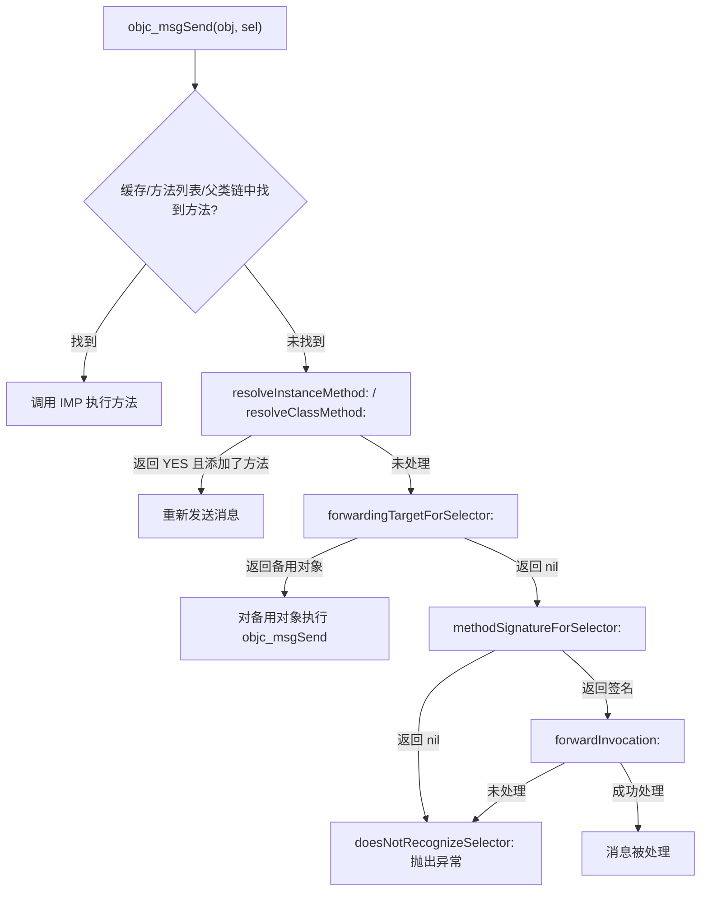

+++
title = "Runtime"
date = '2026-05-02T22:32:27+08:00'
draft = false
weight = 23
tags = ["iOS", "面试", "基础"]
categories = ["iOS开发", "面试"]
+++
## 什么是 Runtime

Runtime 是 Objective-C 的运行时系统，是一套底层的 C 语言 API。Objective-C 是一门动态语言，很多操作都是在运行时而非编译时决定的，这一切都依赖于 Runtime。

Runtime 提供的核心能力：
- 消息发送与转发
- 方法交换（Method Swizzling）
- 关联对象（Associated Objects）
- 动态创建类和对象
- 动态添加和修改方法、属性

> 关于对象、类、isa 指针等底层数据结构的详细介绍，请参考 [Objective-C底层原理-NSObject]()。本文专注于 Runtime 的动态能力和实际应用。

## 消息发送机制

Objective-C 的消息发送机制是其动态性的核心体现。与 Swift 支持静态派发不同，Objective-C 的方法调用都是动态消息派发。更多关于两者的对比，请参考 [Objective-C与Swift区别]()。

### objc_msgSend

Objective-C 的方法调用本质上是消息发送，编译器会将方法调用转换为 `objc_msgSend` 函数：

```objc
// 源代码
[obj doSomething];

// 编译后
objc_msgSend(obj, @selector(doSomething));
```

### 消息发送流程

```
1. 检查 receiver 是否为 nil，如果是则直接返回
2. 通过 isa 找到 receiver 的类对象
3. 在类对象的方法缓存（cache_t）中查找方法
4. 如果缓存命中，直接调用方法实现（IMP）
5. 如果缓存未命中，在类对象的方法列表中查找
6. 如果找到，缓存方法并调用
7. 如果未找到，沿着 superclass 链向上查找
8. 如果最终未找到，进入消息转发流程
```

### 方法缓存

为了提高消息发送效率，Runtime 在类对象中使用哈希表缓存最近调用的方法：

> 下面是便于理解的简化示意。`cache_t`/`bucket_t` 的真实布局和访问细节会随 objc4 版本与架构变化。

```c
struct cache_t {
    struct bucket_t *_buckets;  // 哈希表数组
    mask_t _mask;               // 数组长度减1（用于哈希计算）
    uint16_t _occupied;         // 已缓存的方法数量
};

struct bucket_t {
    SEL _sel;   // Key：方法选择器
    IMP _imp;   // Value：方法实现
};
```

**缓存查找过程：**

```c
// 1. 用 selector 和 _mask 做位与运算得到索引（比取模更快）
mask_t index = (mask_t)(selector & cache->_mask);

// 2. 在对应位置查找
bucket_t *bucket = cache->_buckets[index];

// 3. 比对 SEL 是否匹配
if (bucket->_sel == selector) {
    return bucket->_imp;  // 命中
}

// 4. 哈希冲突时，使用开放寻址法线性探测下一个位置
```

由于 SEL 是指针值，数值很大，通过 `& _mask` 将其映射到有限的数组范围内。当发生哈希冲突时，采用开放寻址法向前探测空位。

### SEL 与 IMP

**SEL** 是方法的唯一标识符。类型定义为 `typedef struct objc_selector *SEL`（不透明指针），但在 runtime 实际实现中，SEL 的值就是方法名 C 字符串的地址（`sel_getName()` 只是将 SEL 强转为 `const char *`）。Runtime 通过全局注册表保证同名方法只对应唯一一个 SEL 地址，因此可以用指针比较（`==`）代替字符串比较来高效匹配：

```objc
SEL sel = @selector(doSomething);
SEL sel2 = sel_registerName("doSomething");
```

**IMP** 是函数指针，指向方法的具体实现：

```objc
// 获取 IMP
IMP imp = [obj methodForSelector:@selector(doSomething)];

// 直接调用 IMP（绕过消息发送，性能更高）
imp(obj, @selector(doSomething));
```

## 消息转发机制

当对象收到无法识别的消息时，Runtime 不会立即崩溃，而是按顺序走过三个阶段，每个阶段都给开发者一次介入的机会。这三个阶段并不是"出了 bug 再补救"的容错手段，而是 Runtime 有意提供的**扩展点**，各自有明确的设计用途：

| 阶段 | 方法 | 设计用途 |
|------|------|---------|
| 动态方法解析 | `resolveInstanceMethod:` / `resolveClassMethod:` | 动态生成方法实现（如 CoreData 的 `@dynamic` 属性） |
| 快速转发 | `forwardingTargetForSelector:` | 把消息转交给另一个对象处理（如组合模式、简单代理） |
| 完整转发 | `methodSignatureForSelector:` + `forwardInvocation:` | 完全控制调用过程（如多播代理、NSUndoManager） |

只有当三个阶段都没有处理该消息时，Runtime 才会调用 `doesNotRecognizeSelector:` 抛出 `unrecognized selector` 异常。

上述所有方法都定义在 `NSObject` 中（声明在 `<objc/NSObject.h>` 头文件里），默认实现都是"不处理"（返回 NO / 返回 nil / 抛异常）。只要你的类继承自 `NSObject`，就可以通过重写对应方法来介入转发流程。日常开发中大多数类不需要实现这些方法，只有在你明确需要上述能力时，才在对应的类中重写。

### 第一阶段：动态方法解析

Runtime 会在类对象上调用以下两个**类方法**，根据找不到的方法类型决定调用哪一个：

- `+ (BOOL)resolveInstanceMethod:(SEL)sel` — 当**实例方法**找不到时被调用
- `+ (BOOL)resolveClassMethod:(SEL)sel` — 当**类方法**找不到时被调用

这两个方法本身都是类方法，区别在于它们各自负责解析的目标不同。在方法内部，你可以通过 `class_addMethod` 动态添加缺失的方法实现。

```objc
// 当实例方法找不到时，Runtime 调用这个类方法
+ (BOOL)resolveInstanceMethod:(SEL)sel {
    if (sel == @selector(dynamicMethod)) {
        // 动态添加方法实现，"v@:" 是类型编码（返回void，参数为id和SEL）
        class_addMethod(self, sel, (IMP)dynamicMethodIMP, "v@:");
        return YES;  // 返回 YES 后，Runtime 会重新发送消息
    }
    return [super resolveInstanceMethod:sel];
}

void dynamicMethodIMP(id self, SEL _cmd) {
    NSLog(@"动态添加的方法被调用");
}
```

**适用场景**：

在 Objective-C 中，属性默认会用 `@synthesize` 自动生成 getter/setter。但如果你声明属性时使用了 `@dynamic`，就是告诉编译器："不要自动生成，我会在运行时自己提供实现"。此时编译期不会报错，但运行时调用该属性的 getter/setter 就会触发"找不到方法"的流程。

CoreData 的 `NSManagedObject` 就是典型例子。它的属性（如 `name`、`age`）都用 `@dynamic` 声明。当运行时调用这些属性的 getter/setter 时，Runtime 在子类中找不到方法，就会沿着继承链向上查找，最终由父类 `NSManagedObject` 内部重写的 `resolveInstanceMethod:` 来动态生成对应的 getter/setter，将属性的读写映射到 CoreData 的存储层。

```objc
// CoreData 模型类中的典型写法
@interface Person : NSManagedObject
@property (nonatomic, copy) NSString *name;
@end

@implementation Person
@dynamic name;  // 不生成 getter/setter，由 CoreData 在运行时通过动态方法解析提供
// 父类 NSManagedObject 重写了resolveInstanceMethod：，会在运行时动态生成 name 的 getter/setter
@end
```

### 第二阶段：快速转发

如果动态方法解析没有处理该消息（`resolveInstanceMethod:` / `resolveClassMethod:` 返回 NO，或者返回 YES 但仍未添加对应的方法实现），Runtime 会调用以下**实例方法**：

- `- (id)forwardingTargetForSelector:(SEL)aSelector` — 返回一个备用对象来接收该消息，返回 `nil` 则表示不处理，继续进入第三阶段

这个方法允许你将消息"转嫁"给另一个对象。Runtime 拿到返回的备用对象后，会直接对它执行 `objc_msgSend`，相当于把原始消息原封不动地重新发送给备用对象，整个过程不涉及 `NSInvocation` 的创建，因此效率很高。

```objc
- (id)forwardingTargetForSelector:(SEL)aSelector {
    if (aSelector == @selector(someMethod)) {
        return self.anotherObject;  // 让 anotherObject 处理这个消息
    }
    return [super forwardingTargetForSelector:aSelector];
}
```

**注意事项**：

- 返回的备用对象不能是 `self`，Runtime 内部虽然会对 `self` 做保护（等同于返回 `nil`，进入第三阶段），但依赖这一行为不是好的编程习惯，应当显式返回 `nil`
- 无法修改消息的参数或返回值（如果需要修改，应使用第三阶段的完整转发）
- 无法将一条消息转发给多个对象（同样需要第三阶段）
- 备用对象必须能响应该消息，否则备用对象自身会再走一遍消息转发流程

**适用场景**：

快速转发最典型的用途是**组合模式（Composition）**——当一个对象内部持有另一个对象，希望对外暴露内部对象的部分能力，但又不想逐个手写包装方法时，可以通过快速转发将消息直接转交给内部对象。

例如，你有一个 `TeamLeader` 对象，内部持有一个 `Coder` 对象。外部希望 `TeamLeader` 也能响应 `writeCode` 消息，但 `TeamLeader` 本身没有实现这个方法。通过快速转发，可以自动把 `writeCode` 交给内部的 `Coder` 处理：

```objc
@interface Coder : NSObject
- (void)writeCode;
- (void)fixBug;
@end

@implementation Coder
- (void)writeCode { NSLog(@"Coder: 写代码中..."); }
- (void)fixBug   { NSLog(@"Coder: 修 bug 中..."); }
@end

@interface TeamLeader : NSObject
@property (nonatomic, strong) Coder *coder;
- (void)reviewCode;
@end

@implementation TeamLeader

- (instancetype)init {
    if (self = [super init]) {
        _coder = [[Coder alloc] init];
    }
    return self;
}

- (void)reviewCode { NSLog(@"TeamLeader: 审查代码中..."); }

// 自己处理不了的消息，转交给 coder
- (id)forwardingTargetForSelector:(SEL)aSelector {
    if ([self.coder respondsToSelector:aSelector]) {
        return self.coder;
    }
    return [super forwardingTargetForSelector:aSelector];
}

@end
```

这种方式比手动为每个方法都写一个包装方法（如 `- (void)writeCode { [self.coder writeCode]; }`）更简洁，尤其当内部对象的方法很多时，快速转发可以一次性覆盖所有消息，避免大量模板代码。

### 第三阶段：完整转发

如果快速转发返回 `nil`（即 `forwardingTargetForSelector:` 没有提供备用对象），Runtime 会进入最后一个阶段——完整转发。这个阶段需要依次实现两个**实例方法**：

- `- (NSMethodSignature *)methodSignatureForSelector:(SEL)aSelector` — Runtime 先调用这个方法获取方法签名，用于构建 `NSInvocation` 对象。如果返回 `nil`，Runtime 直接调用 `doesNotRecognizeSelector:` 抛出异常，不会进入下一步
- `- (void)forwardInvocation:(NSInvocation *)anInvocation` — 拿到封装了完整调用信息的 `NSInvocation` 对象后，你可以自由决定如何处理这条消息

两个方法的职责不同：`methodSignatureForSelector:` 负责"描述消息长什么样"（参数类型、返回值类型），`forwardInvocation:` 负责"决定消息怎么处理"。

**关于 NSInvocation**：

`NSInvocation` 是对一次 Objective-C 方法调用的完整封装。当你在 `forwardInvocation:` 中拿到它时，里面已经包含了 target（原始消息的接收者）、selector、所有参数。相比快速转发只能原封不动地把消息转交给另一个对象，`NSInvocation` 让你可以：

- 读取和修改每一个参数（`getArgument:atIndex:` / `setArgument:atIndex:`）
- 更换目标对象（`invokeWithTarget:`）
- 多次调用，转发给多个对象
- 调用后读取返回值（`getReturnValue:`）

```objc
- (NSMethodSignature *)methodSignatureForSelector:(SEL)aSelector {
    if (aSelector == @selector(someMethod)) {
        // "v@:" 表示返回 void，参数为 id(self) 和 SEL(_cmd)
        return [NSMethodSignature signatureWithObjCTypes:"v@:"];
    }
    return [super methodSignatureForSelector:aSelector];
}

- (void)forwardInvocation:(NSInvocation *)anInvocation {
    SEL sel = [anInvocation selector];
    
    // 可以转发给多个对象、修改参数、记录日志等
    if ([self.target respondsToSelector:sel]) {
        [anInvocation invokeWithTarget:self.target];
    } else {
        [self doesNotRecognizeSelector:sel];
    }
}
```

**注意事项**：

- `methodSignatureForSelector:` 返回的签名必须与实际方法匹配，否则参数传递会出错
- 如果 `methodSignatureForSelector:` 返回 `nil`，`forwardInvocation:` 不会被调用，直接崩溃
- 完整转发的性能开销比快速转发大很多，因为需要创建 `NSInvocation` 对象并封装所有参数。对于简单的消息转交，应优先使用快速转发

**适用场景**：

完整转发的典型用途是需要对调用过程进行**精细控制**的场景。以 `NSUndoManager` 为例，它的 `prepareWithInvocationTarget:` 方法就利用了完整转发来记录撤销操作：

```objc
// NSUndoManager 的使用方式
- (void)setName:(NSString *)name {
    [[self.undoManager prepareWithInvocationTarget:self] setName:_name];
    _name = name;
}
```

`prepareWithInvocationTarget:` 返回的是一个代理对象。当你对这个代理对象调用 `setName:` 时，它并不会真正执行，而是通过完整转发捕获这个 `NSInvocation`，将其保存到撤销栈中。用户点击撤销时，`NSUndoManager` 再 invoke 这个保存的 `NSInvocation`，就能恢复到之前的值。这正是利用了完整转发"拦截并保存调用信息"的能力。

再看一个消息日志记录的实际例子——在调用前后插入日志，且不影响原有逻辑：

```objc
@interface LoggingProxy : NSObject
@property (nonatomic, strong) id realObject;
+ (instancetype)proxyWithObject:(id)object;
@end

@implementation LoggingProxy

+ (instancetype)proxyWithObject:(id)object {
    LoggingProxy *proxy = [[LoggingProxy alloc] init];
    proxy.realObject = object;
    return proxy;
}

- (NSMethodSignature *)methodSignatureForSelector:(SEL)aSelector {
    return [self.realObject methodSignatureForSelector:aSelector];
}

- (void)forwardInvocation:(NSInvocation *)anInvocation {
    SEL sel = anInvocation.selector;
    NSLog(@"[LOG] 即将调用: -[%@ %@]", NSStringFromClass([self.realObject class]), NSStringFromSelector(sel));
    
    [anInvocation invokeWithTarget:self.realObject];
    
    NSLog(@"[LOG] 调用完成: -[%@ %@]", NSStringFromClass([self.realObject class]), NSStringFromSelector(sel));
}

@end

// 使用：包裹任意对象，自动为所有方法调用添加日志
id loggedArray = [LoggingProxy proxyWithObject:[@[@"a", @"b", @"c"] mutableCopy]];
[loggedArray addObject:@"d"];
// 输出:
// [LOG] 即将调用: -[__NSArrayM addObject:]
// [LOG] 调用完成: -[__NSArrayM addObject:]
```

如果三个阶段都未处理，最终调用 `doesNotRecognizeSelector:` 抛出 `unrecognized selector` 异常。

### 消息转发流程图



### NSProxy 的消息转发

`NSProxy` 是专门为消息转发设计的抽象基类，它的转发流程与 `NSObject` 不同：

| | NSObject | NSProxy |
|---|----------|---------|
| 转发流程 | 三个阶段 | 直接进入完整转发 |
| 基础方法 | 实现了大量方法（如 `retain`、`release`、`isEqual:`、`hash`、`isKindOfClass:` 等） | 几乎不实现任何方法 |
| 代理伪装能力 | 弱 — `isKindOfClass:` 等内省方法会被自身消费，不会转发 | 强 — 几乎所有消息都会转发给真实对象 |

因为 `NSObject` 自身实现了 `isKindOfClass:`、`respondsToSelector:` 等方法，当外界对代理对象调用这些方法时，`NSObject` 会直接处理并返回结果，消息不会转发给被代理的真实对象。这导致外界可以识别出它只是一个代理，而非真实对象。

`NSProxy` 则相反，它几乎没有实现任何方法，所以包括 `isKindOfClass:` 在内的消息都会进入转发流程，最终由真实对象来回答。这使得外界无法区分代理对象和真实对象。

```objc
// 假设 Dog 类有一个 bark 方法，我们分别用 NSObject 子类和 NSProxy 子类来代理它

// --- NSObject 子类做代理 ---
DogProxyA *proxyA = ...;  // 继承自 NSObject，内部持有一个 Dog 实例

[proxyA bark];                               // ✅ bark 未实现，触发转发 → Dog 处理
[proxyA isKindOfClass:[Dog class]];          // ❌ 返回 NO — NSObject 自身实现了该方法，直接返回，不会转发
[proxyA respondsToSelector:@selector(bark)]; // ❌ 返回 NO — 同上，NSObject 直接返回，不会转发

// --- NSProxy 子类做代理 ---
DogProxyB *proxyB = ...;  // 继承自 NSProxy，内部持有一个 Dog 实例

[proxyB bark];                               // ✅ 转发 → Dog 处理
[proxyB isKindOfClass:[Dog class]];          // ✅ 转发 → Dog 回答 YES
[proxyB respondsToSelector:@selector(bark)]; // ✅ 转发 → Dog 回答 YES
```

两种代理方式各有适用场景：

- **NSProxy（强伪装）**：适合需要透明代理的场景。例如用 `WeakProxy` 打破 `NSTimer` 循环引用时，`NSTimer` 内部会调用 `respondsToSelector:` 检查 target，`NSProxy` 能正确转发并返回 YES，保证行为正常。缺点是代理对象本身难以添加额外逻辑。
- **NSObject 子类（弱伪装）**：适合需要在代理层增加拦截、日志、缓存等额外逻辑的场景，代理和真实对象身份明确，便于调试。缺点是内省方法会暴露代理身份，如果被代理的框架依赖这些方法做判断，可能出现异常。

**NSProxy 的典型实现：**

```objc
@interface WeakProxy : NSProxy
@property (nonatomic, weak) id target;
+ (instancetype)proxyWithTarget:(id)target;
@end

@implementation WeakProxy

+ (instancetype)proxyWithTarget:(id)target {
    WeakProxy *proxy = [WeakProxy alloc];
    proxy.target = target;
    return proxy;
}

// NSProxy 直接进入这两个方法，跳过动态解析和快速转发
- (NSMethodSignature *)methodSignatureForSelector:(SEL)sel {
    return [self.target methodSignatureForSelector:sel];
}

- (void)forwardInvocation:(NSInvocation *)invocation {
    if (self.target) {
        [invocation invokeWithTarget:self.target];
    }
}

@end
```

**NSProxy 的使用场景：**

1. **解决 NSTimer/CADisplayLink 循环引用**

```objc
// 直接使用会循环引用：self -> timer -> self
self.timer = [NSTimer scheduledTimerWithTimeInterval:1.0
                                              target:self  // 强引用 self
                                            selector:@selector(tick)
                                            userInfo:nil
                                             repeats:YES];

// 使用 WeakProxy 打破循环：self -> timer -> proxy --weak--> self
self.timer = [NSTimer scheduledTimerWithTimeInterval:1.0
                                              target:[WeakProxy proxyWithTarget:self]
                                            selector:@selector(tick)
                                            userInfo:nil
                                             repeats:YES];
```

2. **多播代理** — 将同一条消息转发给多个对象

```objc
@interface MulticastProxy : NSProxy
@property (nonatomic, strong) NSArray *targets;
@end

@implementation MulticastProxy

- (void)forwardInvocation:(NSInvocation *)invocation {
    for (id target in self.targets) {
        if ([target methodSignatureForSelector:invocation.selector]) {
            [invocation invokeWithTarget:target];
        }
    }
}

- (NSMethodSignature *)methodSignatureForSelector:(SEL)sel {
    for (id target in self.targets) {
        NSMethodSignature *sig = [target methodSignatureForSelector:sel];
        if (sig) return sig;
    }
    return nil;
}

@end

// 使用：一个 scrollView 的滚动事件同时通知多个对象
MulticastProxy *proxy = [MulticastProxy alloc];
proxy.targets = @[handlerA, handlerB, handlerC];
scrollView.delegate = (id)proxy;
// handlerA、handlerB、handlerC 都会收到 scrollViewDidScroll: 等回调
```

## Method Swizzling

Method Swizzling 是在运行时交换两个方法实现的技术，常用于 Hook 系统方法、AOP 编程等场景。

### 基本实现

```objc
#import <objc/runtime.h>

@implementation UIViewController (Swizzling)

+ (void)load {
    Class class = [self class];
    
    SEL originalSelector = @selector(viewWillAppear:);
    SEL swizzledSelector = @selector(swizzled_viewWillAppear:);
    
    Method originalMethod = class_getInstanceMethod(class, originalSelector);
    Method swizzledMethod = class_getInstanceMethod(class, swizzledSelector);
    
    // 先尝试添加方法，防止父类方法被交换
    BOOL didAddMethod = class_addMethod(class,
                                        originalSelector,
                                        method_getImplementation(swizzledMethod),
                                        method_getTypeEncoding(swizzledMethod));
    
    if (didAddMethod) {
        class_replaceMethod(class,
                           swizzledSelector,
                           method_getImplementation(originalMethod),
                           method_getTypeEncoding(originalMethod));
    } else {
        method_exchangeImplementations(originalMethod, swizzledMethod);
    }
}

- (void)swizzled_viewWillAppear:(BOOL)animated {
    // 由于方法已交换，这里调用的是原始的 viewWillAppear:
    [self swizzled_viewWillAppear:animated];
    
    NSLog(@"页面即将显示: %@", NSStringFromClass([self class]));
}

@end
```

### 注意事项

- 在 `+load` 方法中执行，确保在类加载时完成交换
- 先尝试添加方法，避免交换父类的实现
- 调用原方法时使用 swizzled 方法名（因为已经交换）

## 关联对象

关联对象允许在运行时为对象动态添加存储，常用于在 Category 中添加属性。关于为什么分类不能直接添加实例变量，详见 [Objective-C底层原理-NSObject]() 。

### 基本用法

```objc
#import <objc/runtime.h>

@interface NSObject (AssociatedObject)
@property (nonatomic, copy) NSString *customProperty;
@end

@implementation NSObject (AssociatedObject)

static const void *CustomPropertyKey = &CustomPropertyKey;

- (void)setCustomProperty:(NSString *)customProperty {
    objc_setAssociatedObject(self, 
                             CustomPropertyKey, 
                             customProperty, 
                             OBJC_ASSOCIATION_COPY_NONATOMIC);
}

- (NSString *)customProperty {
    return objc_getAssociatedObject(self, CustomPropertyKey);
}

@end
```

### 关联策略

| 策略 | 等价属性 | 说明 |
|------|----------|------|
| OBJC_ASSOCIATION_ASSIGN | assign | 弱引用 |
| OBJC_ASSOCIATION_RETAIN_NONATOMIC | strong, nonatomic | 强引用 |
| OBJC_ASSOCIATION_COPY_NONATOMIC | copy, nonatomic | 拷贝 |
| OBJC_ASSOCIATION_RETAIN | strong, atomic | 强引用，原子 |
| OBJC_ASSOCIATION_COPY | copy, atomic | 拷贝，原子 |

### 存储原理

关联对象存储在全局的 `AssociationsManager` 哈希表中，以对象地址为 key。当对象释放时，Runtime 会检查 isa 中的 `has_assoc` 标志位，如果为真则移除所有关联对象。

## 动态创建类

Runtime 支持在运行时动态创建新的类：

```objc
// 1. 创建类
Class MyClass = objc_allocateClassPair([NSObject class], "MyClass", 0);

// 2. 添加成员变量（必须在注册前）
class_addIvar(MyClass, "_name", sizeof(NSString *), log2(sizeof(NSString *)), @encode(NSString *));

// 3. 添加方法
class_addMethod(MyClass, @selector(sayHello), (IMP)sayHelloIMP, "v@:");

// 4. 注册类
objc_registerClassPair(MyClass);

// 5. 使用
id obj = [[MyClass alloc] init];
[obj sayHello];

// 6. 销毁（不再需要时）
// objc_disposeClassPair(MyClass);

void sayHelloIMP(id self, SEL _cmd) {
    NSLog(@"Hello from dynamically created class!");
}
```

## 常用 Runtime API

### 类操作

```objc
// 获取类信息
const char *class_getName(Class cls);
Class class_getSuperclass(Class cls);
BOOL class_isMetaClass(Class cls);
size_t class_getInstanceSize(Class cls);

// 动态创建类
Class objc_allocateClassPair(Class superclass, const char *name, size_t extraBytes);
void objc_registerClassPair(Class cls);
void objc_disposeClassPair(Class cls);
```

### 方法操作

```objc
// 获取方法
Method class_getInstanceMethod(Class cls, SEL name);
Method class_getClassMethod(Class cls, SEL name);
Method *class_copyMethodList(Class cls, unsigned int *outCount);

// 添加/替换/交换方法
BOOL class_addMethod(Class cls, SEL name, IMP imp, const char *types);
IMP class_replaceMethod(Class cls, SEL name, IMP imp, const char *types);
void method_exchangeImplementations(Method m1, Method m2);

// 获取/设置方法实现
IMP method_getImplementation(Method m);
IMP method_setImplementation(Method m, IMP imp);
```

### 属性和成员变量

```objc
// 属性
objc_property_t *class_copyPropertyList(Class cls, unsigned int *outCount);
objc_property_t class_getProperty(Class cls, const char *name);

// 成员变量
Ivar *class_copyIvarList(Class cls, unsigned int *outCount);
Ivar class_getInstanceVariable(Class cls, const char *name);
id object_getIvar(id obj, Ivar ivar);
void object_setIvar(id obj, Ivar ivar, id value);
```

## 实际应用场景

前面介绍了 Runtime 的核心能力（消息发送与转发、Method Swizzling、关联对象、动态创建类等），这些能力在实际开发中有非常广泛的应用。下面列举几个典型场景，展示如何将这些底层能力转化为解决实际问题的方案。

### 1. 字典转模型

在网络请求返回 JSON 数据后，通常需要将字典（`NSDictionary`）转换为模型对象。手动为每个属性逐一赋值既繁琐又难以维护。利用 Runtime 的 `class_copyIvarList` 可以在运行时获取类的所有成员变量列表，再结合 KVC（`setValue:forKey:`）自动完成映射，从而实现一个通用的字典转模型方法：

```objc
+ (instancetype)modelWithDict:(NSDictionary *)dict {
    id obj = [[self alloc] init];
    
    unsigned int count;
    Ivar *ivars = class_copyIvarList(self, &count);
    
    for (int i = 0; i < count; i++) {
        Ivar ivar = ivars[i];
        // ivar_getName 返回的成员变量名带下划线前缀（如 "_name"）
        NSString *name = [NSString stringWithUTF8String:ivar_getName(ivar)];
        NSString *key = [name substringFromIndex:1];  // 去掉下划线前缀，得到属性名
        
        id value = dict[key];
        if (value) {
            [obj setValue:value forKey:key];
        }
    }
    
    free(ivars);  // class_copyIvarList 内部使用 malloc 分配内存，需手动释放
    return obj;
}
```

这就是 MJExtension、YYModel 等 JSON 转模型框架的核心思路。实际框架还需要处理类型转换（如 NSString -> NSNumber）、嵌套模型、数组泛型、属性名与 JSON key 不一致等问题，但底层都依赖 Runtime 的反射能力来实现自动化映射。

### 2. 防止数组越界崩溃

数组越界是 iOS 开发中最常见的崩溃之一。`NSArray` 的 `objectAtIndex:` 在索引越界时会直接抛出 `NSRangeException`，导致应用闪退。

利用 Method Swizzling，可以在不修改业务代码的前提下，全局替换 `objectAtIndex:` 的实现，在调用前增加边界检查。需要注意的是，`NSArray` 是类簇（Class Cluster），实际创建的对象是私有子类（如不可变数组对应 `__NSArrayI`，可变数组对应 `__NSArrayM`），因此 swizzle 的目标必须是真实的私有子类，而非 `NSArray` 本身：

```objc
@implementation NSArray (Safe)

+ (void)load {
    static dispatch_once_t onceToken;
    dispatch_once(&onceToken, ^{
        // 注意：NSArray 是类簇，真实类是 __NSArrayI
        Class cls = NSClassFromString(@"__NSArrayI");
        
        Method originalMethod = class_getInstanceMethod(cls, @selector(objectAtIndex:));
        Method swizzledMethod = class_getInstanceMethod(cls, @selector(safe_objectAtIndex:));
        
        method_exchangeImplementations(originalMethod, swizzledMethod);
    });
}

- (id)safe_objectAtIndex:(NSUInteger)index {
    if (index < self.count) {
        return [self safe_objectAtIndex:index];  // 方法已交换，实际调用原始实现
    }
    NSLog(@"数组越界：index = %lu, count = %lu", index, self.count);
    return nil;  // 越界时返回 nil 而非崩溃
}

@end
```

这种方式常用于线上应用的防崩溃保护。但需要注意，将越界从"崩溃"变为"静默返回 nil"可能会掩盖潜在的逻辑错误，建议在 Debug 环境下仍然抛出异常以便尽早发现问题，仅在 Release 环境下启用保护。

### 3. 无侵入埋点统计

在大型项目中，页面浏览（PV）埋点是最基础的数据需求。如果在每个 `UIViewController` 的 `viewDidAppear:` 中手动添加埋点代码，不仅工作量大，而且与业务代码高度耦合，后续修改埋点方案时需要逐个页面调整。

利用 Method Swizzling 可以实现 AOP（面向切面编程）风格的无侵入埋点：通过 hook `UIViewController` 的生命周期方法，在不修改任何业务代码的情况下，自动为所有页面添加 PV 统计：

```objc
@implementation UIViewController (Statistics)

+ (void)load {
    static dispatch_once_t onceToken;
    dispatch_once(&onceToken, ^{
        Method original = class_getInstanceMethod(self, @selector(viewDidAppear:));
        Method swizzled = class_getInstanceMethod(self, @selector(statistics_viewDidAppear:));
        method_exchangeImplementations(original, swizzled);
    });
}

- (void)statistics_viewDidAppear:(BOOL)animated {
    [self statistics_viewDidAppear:animated];  // 调用原始实现，保证生命周期正常
    
    // 自动记录页面名（类名）作为 PV 事件
    NSString *pageName = NSStringFromClass([self class]);
    [[StatisticsManager shared] trackPageView:pageName];
}

@end
```

这种方式的优势在于：埋点逻辑集中在一个 Category 中，与业务代码完全解耦；新增页面无需额外操作即可自动获得埋点能力。实际项目中还可以结合配置表（将页面类名映射为可读的页面标识）实现更灵活的埋点管理。这也是 AOP 思想在 iOS 中最典型的应用之一，更多关于 AOP 的内容可参考 [OOP-POP-AOP]()。

### 4. 实现多播代理

在 iOS 中，delegate 模式默认是一对一的关系（一个 `UIScrollView` 只能有一个 `delegate`）。但有时我们希望多个对象同时监听同一个事件源，例如 `UIScrollView` 的滚动事件需要同时通知导航栏、悬浮按钮、数据加载器等多个模块。

多播代理正是利用消息转发（完整转发阶段）来实现一对多的消息分发。前面在 [NSProxy 的消息转发](#nsproxy-的消息转发) 一节中已经展示了基于 `NSProxy` 的 `MulticastProxy` 实现。这里给出一个基于 `NSObject` 的版本，主要区别在于使用 `NSHashTable` 弱引用持有 delegate 列表，避免循环引用，并提供了动态增删 delegate 的接口，更适合实际项目使用：

```objc
@interface MulticastDelegate : NSObject
- (void)addDelegate:(id)delegate;
- (void)removeDelegate:(id)delegate;
@end

@implementation MulticastDelegate {
    NSHashTable *_delegates;  // 弱引用表，delegate 释放后自动移除
}

- (instancetype)init {
    if (self = [super init]) {
        _delegates = [NSHashTable weakObjectsHashTable];
    }
    return self;
}

- (void)addDelegate:(id)delegate {
    [_delegates addObject:delegate];
}

- (void)removeDelegate:(id)delegate {
    [_delegates removeObject:delegate];
}

// 完整转发：从 delegate 列表中获取方法签名
- (NSMethodSignature *)methodSignatureForSelector:(SEL)sel {
    for (id delegate in _delegates) {
        NSMethodSignature *sig = [delegate methodSignatureForSelector:sel];
        if (sig) return sig;
    }
    return [super methodSignatureForSelector:sel];
}

// 完整转发：将消息逐一分发给所有能响应的 delegate
- (void)forwardInvocation:(NSInvocation *)invocation {
    for (id delegate in _delegates) {
        if ([delegate respondsToSelector:invocation.selector]) {
            [invocation invokeWithTarget:delegate];
        }
    }
}

@end
```

两种实现方式的选择取决于场景：如果需要代理对象在 `isKindOfClass:`、`respondsToSelector:` 等内省方法上表现得与真实对象一致（即"透明代理"），应选择 `NSProxy`；如果只需要消息分发功能，且希望在代理层添加额外逻辑（如日志、权限检查），`NSObject` 子类更灵活。

## 常见面试题

### Q1: objc_msgSend 的执行流程？

1. 检查 receiver 是否为 nil，如果是则直接返回
2. 通过 isa 找到 receiver 的类对象
3. 在类对象的方法缓存（cache_t）中查找方法
4. 如果缓存命中，直接调用方法实现（IMP）
5. 如果缓存未命中，在类对象的方法列表中查找
6. 如果找到，缓存方法并调用
7. 如果未找到，沿着 superclass 链向上查找
8. 如果最终未找到，进入消息转发流程

### Q2: 消息转发的三个阶段？

**第一阶段：动态方法解析（Dynamic Method Resolution）**

Runtime 调用类方法 `+resolveInstanceMethod:`（实例方法缺失时）或 `+resolveClassMethod:`（类方法缺失时），开发者可以在方法内部通过 `class_addMethod` 动态添加方法实现。如果返回 YES 且成功添加了方法，Runtime 会重新发送消息。

**第二阶段：快速转发（Fast Forwarding）**

如果动态方法解析未处理，Runtime 调用实例方法 `-forwardingTargetForSelector:`，开发者返回一个备用对象来接收该消息。Runtime 会直接对备用对象执行 `objc_msgSend`，不涉及 `NSInvocation` 的创建，因此效率很高。但限制是无法修改消息的参数、返回值，也无法将消息转发给多个对象。

**第三阶段：完整转发（Normal Forwarding）**

如果快速转发返回 nil，Runtime 先调用 `-methodSignatureForSelector:` 获取方法签名（返回 nil 则直接崩溃），再调用 `-forwardInvocation:`，传入封装了完整调用信息的 `NSInvocation` 对象。开发者可以自由修改参数、更换 target、转发给多个对象、保存调用信息以供后续使用。性能开销最大，但灵活性最高。

三个阶段都未处理时，Runtime 调用 `doesNotRecognizeSelector:` 抛出 `unrecognized selector` 异常。

### Q3: Method Swizzling 的注意事项？

- 在 `+load` 中执行
- 若放在 `+load` 中，通常天然只执行一次，`dispatch_once` 主要用于防御性编程；
- 先尝试 `class_addMethod`，避免交换父类方法
- swizzled 方法中用 swizzled 方法名调用原实现

### Q4: 如何给分类（Category）添加成员变量？

分类在编译期的结构体 `category_t` 中没有 `ivar_list`，因此无法直接添加实例变量。但可以通过 **关联对象（Associated Objects）** 间接实现：

```objc
#import <objc/runtime.h>

static const void *kNameKey = &kNameKey;

@implementation UIView (Extension)

- (void)setName:(NSString *)name {
    objc_setAssociatedObject(self, kNameKey, name, OBJC_ASSOCIATION_COPY_NONATOMIC);
}

- (NSString *)name {
    return objc_getAssociatedObject(self, kNameKey);
}

@end
```

**关联对象的存储结构：**

关联对象并不存储在对象本身的内存中，而是由 Runtime 维护的一个全局哈希表（`AssociationsManager` → `AssociationsHashMap`）管理。其结构为：

```
AssociationsHashMap: { 对象指针 → ObjectAssociationMap }
ObjectAssociationMap: { key → ObjcAssociation(policy, value) }
```

- `objc_setAssociatedObject`：以对象指针为 key 在全局哈希表中找到（或创建）对应的 `ObjectAssociationMap`，再以传入的 key 存储 value 和内存管理策略
- `objc_getAssociatedObject`：按相同路径取出 value
- `objc_removeAssociatedObjects`：移除该对象的所有关联对象
- 当对象 `dealloc` 时，Runtime 会自动检查并清理其所有关联对象，不会造成内存泄漏

### Q5: Runtime 有哪些实际应用？

**1. 字典转模型**

利用 `class_copyIvarList` 获取类的所有成员变量，结合 KVC 自动完成字典到模型的映射。这是 MJExtension、YYModel 等框架的核心思路。

**2. 防止数组越界崩溃**

通过 Method Swizzling hook `NSArray` 类簇的私有子类（`__NSArrayI`）的 `objectAtIndex:` 方法，在调用前增加边界检查，越界时返回 nil 而非崩溃。建议仅在 Release 环境下启用保护，Debug 环境仍抛出异常以便尽早发现问题。

**3. 无侵入埋点统计（AOP）**

通过 Method Swizzling hook `UIViewController` 的 `viewDidAppear:` 等生命周期方法，在不修改业务代码的情况下自动为所有页面添加 PV 统计，实现 AOP 风格的埋点。埋点逻辑集中在一个 Category 中，与业务代码完全解耦。

**4. 多播代理**

利用消息转发（完整转发阶段）实现一对多的消息分发，让多个对象同时监听同一个事件源。可基于 `NSProxy`（透明代理）或 `NSObject` 子类（更灵活）实现。

### Q6: NSProxy 和 NSObject 的区别？

`NSProxy` 和 `NSObject` 都是 Objective-C 的根类，但设计目的不同：`NSObject` 是绝大多数 OC 类的根类，提供了完整的对象生命周期管理和消息处理机制；`NSProxy` 是专门为消息转发设计的抽象基类，子类必须重写 `methodSignatureForSelector:` 和 `forwardInvocation:`。

| | NSObject | NSProxy |
|---|----------|---------|
| 转发流程 | 三个阶段（动态解析 → 快速转发 → 完整转发） | 跳过前两个阶段，直接进入完整转发 |
| 基础方法 | 实现了大量方法（`retain`、`release`、`isKindOfClass:`、`respondsToSelector:` 等） | 几乎不实现任何方法 |
| 代理伪装能力 | 弱 — 内省方法被自身消费，不会转发 | 强 — 几乎所有消息都会转发给真实对象 |

**消息转发流程差异：**

- **NSObject**：收到未知消息后，依次经历三个阶段——动态方法解析（`resolveInstanceMethod:`）→ 快速转发（`forwardingTargetForSelector:`）→ 完整转发（`methodSignatureForSelector:` + `forwardInvocation:`）。只有三个阶段都未处理，才会抛出 `unrecognized selector` 异常
- **NSProxy**：收到消息后跳过动态解析和快速转发，直接进入完整转发阶段（`methodSignatureForSelector:` → `forwardInvocation:`）。这也是为什么 `NSProxy` 子类只需要重写这两个方法就能完成代理

**内省方法表现差异：**

`NSObject` 自身实现了 `isKindOfClass:`、`respondsToSelector:` 等方法，当外界对代理对象调用这些方法时会直接处理并返回结果，消息不会转发给真实对象，外界可以识别出它只是一个代理。而 `NSProxy` 几乎没有实现任何方法，包括 `isKindOfClass:` 在内的消息都会进入转发流程，最终由真实对象来回答，外界无法区分代理和真实对象。

```objc
// --- NSObject 子类做代理 ---
DogProxyA *proxyA = ...;  // 继承自 NSObject，内部持有一个 Dog 实例

[proxyA bark];                               // ✅ bark 未实现，触发转发 → Dog 处理
[proxyA isKindOfClass:[Dog class]];          // ❌ 返回 NO — NSObject 自身实现了该方法，直接返回，不会转发
[proxyA respondsToSelector:@selector(bark)]; // ❌ 返回 NO — 同上

// --- NSProxy 子类做代理 ---
DogProxyB *proxyB = ...;  // 继承自 NSProxy，内部持有一个 Dog 实例

[proxyB bark];                               // ✅ 转发 → Dog 处理
[proxyB isKindOfClass:[Dog class]];          // ✅ 转发 → Dog 回答 YES
[proxyB respondsToSelector:@selector(bark)]; // ✅ 转发 → Dog 回答 YES
```
