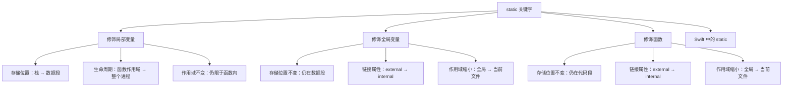
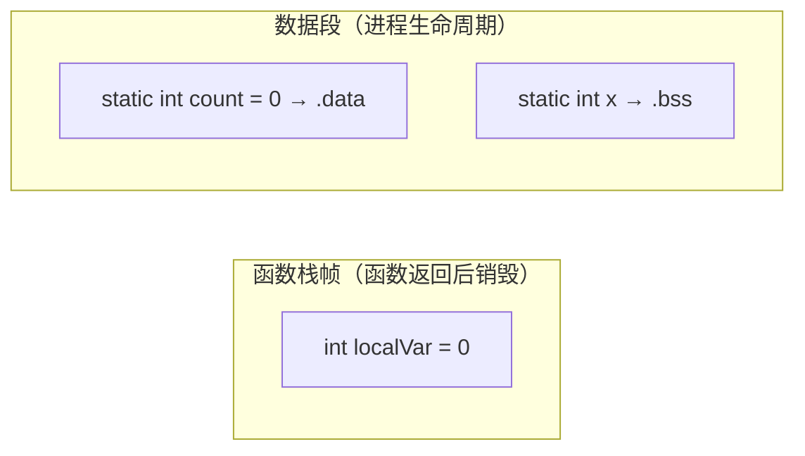
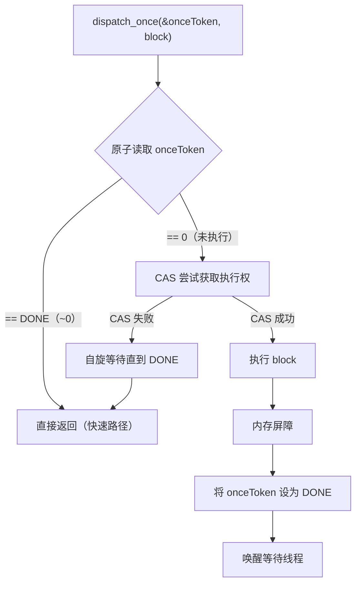

+++
title = "static关键字详解"
date = '2026-05-03T23:11:47+08:00'
draft = false
weight = 24
tags = ["iOS", "面试", "基础"]
categories = ["iOS开发", "面试"]
+++
## 基础概念

`static` 是 C 语言定义的存储类说明符（Storage Class Specifier），Objective-C 和 Swift 中均有使用，但语义有所扩展。它的核心作用可以归纳为两点：

1. **改变存储位置**：将局部变量从栈区移到数据段，使其在函数返回后依然存活
2. **限制链接可见性**：将全局变量或函数的链接属性从 external 改为 internal，使其仅在当前编译单元（`.m` 文件）内可见



## 一、静态局部变量

### 基本用法

在函数或方法内部用 `static` 修饰局部变量，使其只初始化一次，后续调用保留上次的值。

```objc
- (NSInteger)callCount {
    static NSInteger count = 0;
    count++;
    return count;
}

// 第一次调用：返回 1
// 第二次调用：返回 2
// 第三次调用：返回 3
```

### 底层原理

普通局部变量在栈上分配，函数返回时随栈帧一起销毁；静态局部变量存储在数据段，程序启动时即完成内存分配，生命周期与进程相同。



具体存储规则：

| 条件 | 存储段 | 说明 |
|------|--------|------|
| 有非零初始值 | `.data` | 已初始化数据段，值直接写入可执行文件 |
| 初始值为零或未显式初始化 | `.bss` | 未初始化数据段，仅记录大小，运行时清零 |

编译器通过**名称修饰（Name Mangling）**来避免不同函数中同名静态变量的冲突。例如上面的 `count` 在符号表中可能被编码为 `_callCount.count`，从而与其他函数中的同名变量区分开。

### 与 Block 捕获的关系

Block 捕获 `static` 局部变量时，捕获的是**变量的指针**（而非值拷贝），因此 Block 内部可以读写该变量的最新值：

```objc
- (void)demo {
    static int count = 0;
    void (^block)(void) = ^{
        count++;  // 通过指针直接修改原始变量
        NSLog(@"count = %d", count);
    };
    block(); // count = 1
    block(); // count = 2
}
```

底层原因：`static` 变量的地址在编译期就已确定（位于数据段的固定偏移），Block 结构体中存储的是这个地址，不需要像普通局部变量那样拷贝值或使用 `__block` 包装。

## 二、静态全局变量

### 基本用法

在文件顶层（函数/方法外部）用 `static` 修饰全局变量，将其可见性限制在当前 `.m` 文件内：

```objc
// NetworkManager.m
static NSString *const kBaseURL = @"https://api.example.com";
static NSTimeInterval const kTimeout = 30.0;

@implementation NetworkManager
- (void)request {
    // kBaseURL 和 kTimeout 只在本文件内可见
    NSURL *url = [NSURL URLWithString:kBaseURL];
}
@end
```

### 底层原理

不加 `static` 的全局变量默认具有 **external linkage**，其符号会被导出到符号表，链接器在链接所有 `.o` 文件时可以看到它。如果两个 `.m` 文件定义了同名的全局变量，就会产生链接冲突（duplicate symbol）。

加了 `static` 后，变量的链接属性变为 **internal linkage**，编译器将其标记为**本地符号（Local Symbol）**，链接器不会将它导出。因此不同文件中可以定义同名的 `static` 全局变量，互不干扰。

可以用 `nm` 命令验证：

```bash
# 编译为目标文件
clang -c NetworkManager.m -o NetworkManager.o

# 查看符号表
nm NetworkManager.o
# 输出示例：
# 0000000000000008 s _kBaseURL      ← 小写 s 表示 local symbol（static）
# 0000000000000010 S _gSharedURL    ← 大写 S 表示 global symbol（非 static）
```

### static 全局变量 vs extern 全局变量

| 特性 | `static` 全局变量 | `extern` 全局变量 |
|------|-------------------|-------------------|
| 链接属性 | internal（本文件） | external（跨文件） |
| 符号类型 | Local Symbol | Global Symbol |
| 同名冲突 | 不冲突，各文件独立 | 冲突（duplicate symbol） |
| 跨文件访问 | 不可以 | 可以（通过 extern 声明） |
| 典型用途 | 文件内私有常量 | 跨模块共享常量 |

### 常见模式：OC 中定义文件内私有常量

```objc
// .m 文件中
static NSString *const kCellIdentifier = @"MyCell";
static CGFloat const kHeaderHeight = 44.0;
static NSInteger const kMaxRetryCount = 3;
```

这是 OC 中替代 `#define` 宏定义常量的推荐做法，优势在于：
- 有类型信息，编译器可以做类型检查
- 有符号信息，调试时可以看到变量名
- 不会污染其他文件的命名空间

## 三、静态函数

### 基本用法

用 `static` 修饰 C 函数，限制其可见性为当前文件：

```objc
// Utils.m
static NSString *formatDate(NSDate *date) {
    NSDateFormatter *formatter = [[NSDateFormatter alloc] init];
    formatter.dateFormat = @"yyyy-MM-dd";
    return [formatter stringFromDate:date];
}

@implementation Utils
- (void)doSomething {
    NSString *str = formatDate([NSDate date]); // 仅本文件可调用
}
@end
```

### 底层原理

与静态全局变量的机制相同：函数代码存储在代码段（`.text`），`static` 将其符号标记为 local，链接器不导出。

额外的优化：编译器确定 `static` 函数不会被外部调用，可以更激进地执行**内联优化（Inline）**，将函数调用替换为函数体本身，消除函数调用的开销。

### 注意：OC 的类方法不是 static 方法

OC 中以 `+` 开头的类方法与 C/C++/Java 中的 `static` 方法完全不同：

```objc
+ (instancetype)sharedInstance; // 这不是 static 方法
```

OC 的类方法通过 `objc_msgSend` 向**类对象**发送消息实现，支持继承、重写和动态派发。而 C 的 `static` 函数是编译期确定地址的静态调用。

## 四、dispatch_once 与 static 的配合

单例模式是 `static` 最经典的应用场景之一：

```objc
+ (instancetype)sharedInstance {
    static MyManager *instance = nil;
    static dispatch_once_t onceToken;
    dispatch_once(&onceToken, ^{
        instance = [[MyManager alloc] init];
    });
    return instance;
}
```

### 底层原理

这里有两个 `static` 局部变量：

1. **`instance`**：指向单例对象的指针，存储在 `.bss` 段（初始值为 nil/0），在 Block 中通过指针捕获直接修改
2. **`onceToken`**：`dispatch_once_t` 本质是 `long` 类型，初始值为 0，存储在 `.bss` 段

`dispatch_once` 的执行流程：



关键点：
- `static` 保证 `onceToken` 在整个进程生命周期内存在且地址固定
- `dispatch_once` 内部使用**原子操作（CAS）+ 内存屏障**保证线程安全
- 首次执行后 `onceToken` 被标记为完成状态（`DLOCK_ONCE_DONE`，值为 `~0`），后续调用只需一次原子读即可判断，几乎零开销

## 五、Swift 中的 static

Swift 中 `static` 的含义发生了显著变化，不再是 C 语言的存储类说明符，而是**类型级别的声明修饰符**。

### 静态属性和方法

```swift
struct Config {
    static let maxRetry = 3              // 类型存储属性
    static var requestCount = 0          // 类型存储属性（可变）
    static func reset() { requestCount = 0 } // 类型方法
}

Config.maxRetry         // 通过类型名访问
Config.requestCount += 1
Config.reset()
```

### static vs class

在类（class）中，`static` 和 `class` 都可以声明类型级别的成员，区别在于能否被子类重写：

```swift
class Animal {
    static func species() -> String { "Animal" }   // 不可重写
    class func sound() -> String { "..." }          // 可被子类重写
}

class Dog: Animal {
    // override static func species() { } // 编译报错
    override class func sound() -> String { "Woof" } // OK
}
```

底层派发差异：
- `static func`：编译器在编译期确定调用地址，使用**静态派发**，可内联优化
- `class func`：通过类的 vtable 进行**虚函数表派发**，支持多态

### 静态属性的惰性初始化

Swift 的 `static let` / `static var` 具有**自动惰性初始化 + 线程安全**的特性：

```swift
class DatabaseManager {
    static let shared = DatabaseManager()
    private init() {}
}
```

底层实现基于 `swift_once`（最终调用 `dispatch_once`），无需手动编写 `dispatch_once` 代码。编译器为每个静态属性生成一个对应的 `once_token`，首次访问时执行初始化，后续访问直接返回已初始化的值。

这也是 Swift 中单例模式比 OC 简洁得多的原因——语言层面已经内置了 `static` + `dispatch_once` 的行为。

## 六、内存布局总览

```
┌──────────────────────────┐  高地址
│        Stack（栈）        │  ← 普通局部变量、函数参数
├──────────────────────────┤
│        Heap（堆）         │  ← alloc/malloc 分配的对象
├──────────────────────────┤
│    .bss（未初始化数据）    │  ← static int x;（值为0/nil）
├──────────────────────────┤
│    .data（已初始化数据）   │  ← static int x = 42;
├──────────────────────────┤
│    .rodata（只读数据）    │  ← 字符串字面量
├──────────────────────────┤
│    .text（代码段）        │  ← 函数/方法的机器码
└──────────────────────────┘  低地址
```

各种变量的存储位置对比：

| 变量类型 | 存储位置 | 作用域 | 生命周期 | 链接属性 |
|---------|---------|--------|---------|---------|
| 普通局部变量 | 栈（Stack） | 函数内 | 函数调用期间 | 无 |
| 静态局部变量 | .data / .bss | 函数内 | 整个进程 | 无（局部符号） |
| 普通全局变量 | .data / .bss | 全局可见 | 整个进程 | external |
| 静态全局变量 | .data / .bss | 当前文件 | 整个进程 | internal |
| 静态函数 | .text | 当前文件 | 整个进程 | internal |
| 普通函数 | .text | 全局可见 | 整个进程 | external |

## 七、面试常见问题

### Q: static 局部变量和普通局部变量有什么区别？

| 对比项 | 普通局部变量 | static 局部变量 |
|--------|------------|----------------|
| 存储位置 | 栈 | 数据段（.data/.bss） |
| 初始化次数 | 每次函数调用 | 仅一次（程序启动时） |
| 生命周期 | 函数调用期间 | 整个进程 |
| 默认初始值 | 不确定（垃圾值） | 0 / nil / NULL |
| 作用域 | 函数内 | 函数内（不变） |

在 Block 捕获场景下：

| 对比项 | 普通局部变量 | static 局部变量 |
|--------|------------|----------------|
| 捕获方式 | 值拷贝（const copy） | 指针捕获 |
| Block 内可修改 | 不可以（需 `__block`） | 可以 |
| 原因 | 值已拷贝到 Block 结构体 | 地址固定在数据段，直接通过指针访问 |

### Q: 不同 .m 文件中定义了同名的 static 全局变量会冲突吗？

不会。核心原因在于 `static` 改变了变量的**链接属性（Linkage）**：

- **不加 `static`**：全局变量默认具有 **external linkage**，符号被导出到全局符号表。如果两个 `.m` 文件定义了同名全局变量，链接器在合并所有 `.o` 文件时会发现重复符号，报 `duplicate symbol` 错误。
- **加了 `static`**：链接属性变为 **internal linkage**，编译器将其标记为**本地符号（Local Symbol）**，不会导出到全局符号表。每个文件中的同名变量在符号表中是各自独立的条目，链接器不会尝试合并它们，在内存中也是各自独立的存储空间。
