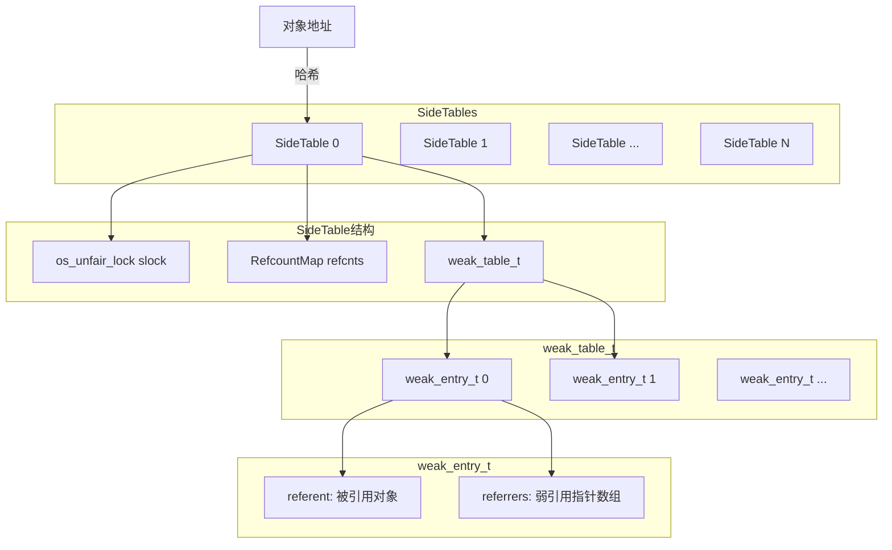
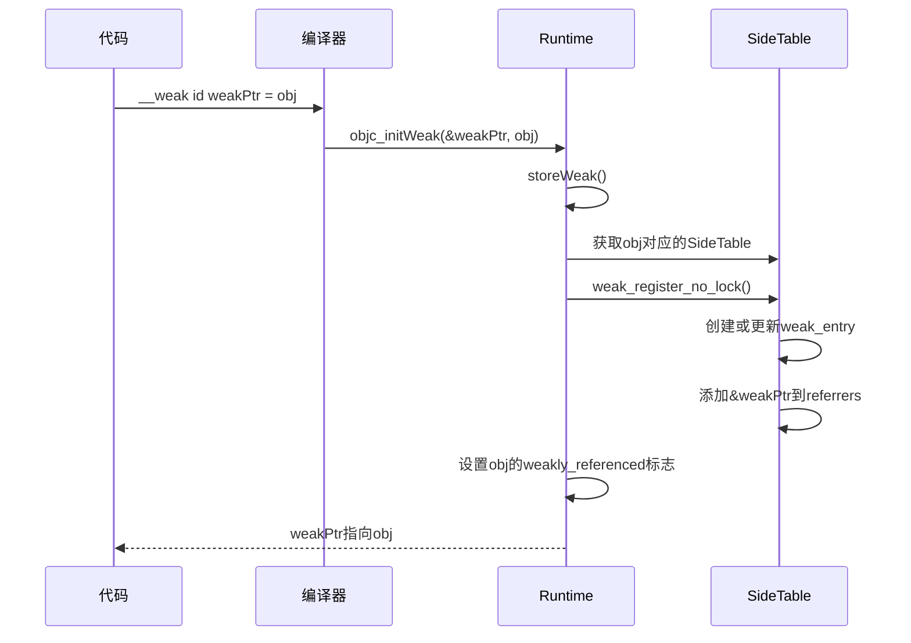
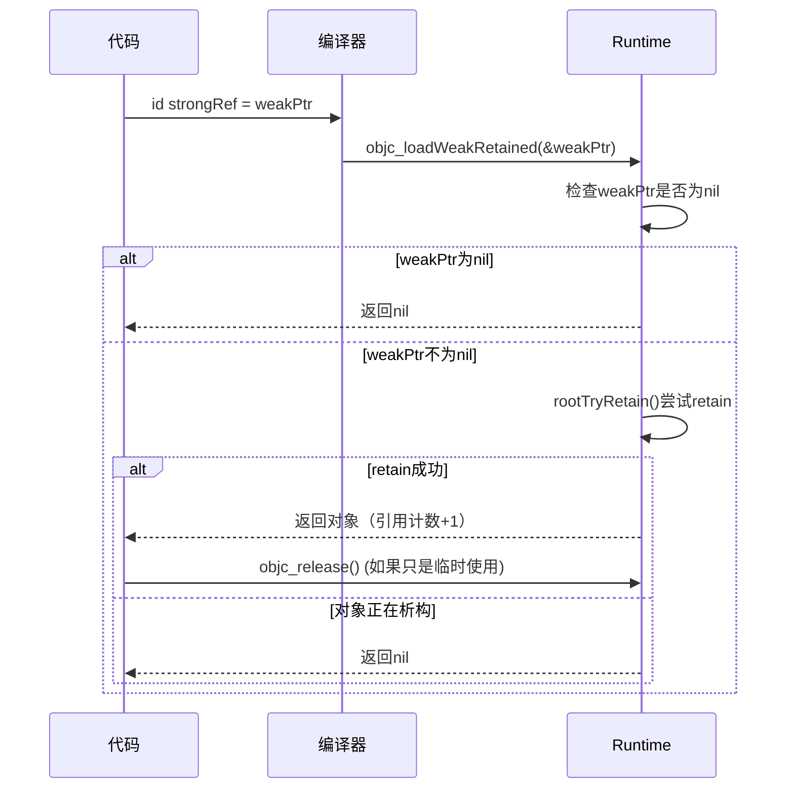
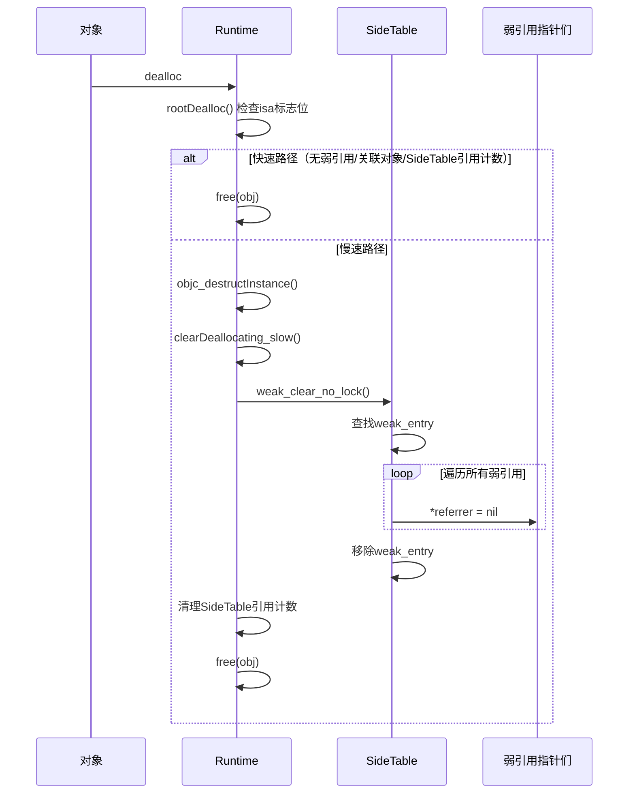

+++
title = "weak详解"
date = '2026-05-02T22:32:27+08:00'
draft = false
weight = 25
tags = ["iOS", "面试", "基础"]
categories = ["iOS开发", "面试"]
+++
本文将深入探讨iOS中`weak`引用的实现原理，包括底层数据结构、核心函数实现、生命周期管理，以及`weak`、`unowned`、`unsafe_unretained`三者的对比。

## weak的基本概念

`weak`是一种弱引用修饰符，它**不会增加对象的引用计数**，也就是说不会持有对象。当对象被释放时，所有指向该对象的`weak`引用会**自动被置为nil**，这是`weak`最核心的特性。

```objc
// Objective-C中使用weak
@property (nonatomic, weak) id<SomeDelegate> delegate;

__weak NSObject *weakObj = strongObj;
```

```swift
// Swift中使用weak
weak var delegate: SomeDelegate?

weak var weakObj = strongObj
```

## weak的底层数据结构

要理解`weak`的实现原理，首先需要了解几个核心数据结构。

### SideTable

`SideTable`是Runtime中非常重要的数据结构。关于SideTable在引用计数存储中的作用，请参考[iOS中的内存管理-侧表存储](#侧表存储sidetable)。

```c
struct SideTable {
    os_unfair_lock slock;       // 锁，保证线程安全
    RefcountMap refcnts;        // 引用计数哈希表
    weak_table_t weak_table;    // 弱引用表
};
```

系统维护了一个**固定大小**的`SideTable`数组，称为`StripedMap`。通过对对象地址做哈希和取模来定位对应的`SideTable`：

```c
// 通过对象地址获取对应的SideTable
static SideTable& table = SideTables()[obj];

// 内部等效逻辑：index = hash(obj) % StripeCount
// StripeCount为StripedMap的大小
```

由于对象数量远大于`SideTable`数量，**多个对象会被映射到同一个`SideTable`**，这类似于哈希表中的哈希冲突。这种设计的核心目的是**分散锁竞争**——每个`SideTable`拥有独立的锁，不同`SideTable`上的操作可以并行执行，相比单一全局表大幅提升了多线程性能。

### weak_table_t

`weak_table_t`是存储弱引用关系的哈希表，采用 **开放寻址法（线性探测）** 解决哈希冲突：

```c
struct weak_table_t {
    weak_entry_t *weak_entries; // 连续分配的数组，作为开放寻址哈希表的底层存储
    size_t num_entries;         // 当前已使用的条目数量
    uintptr_t mask;             // 容量掩码（= 数组容量 - 1），用于 hash & mask 快速取模
    uintptr_t max_hash_displacement; // 最大哈希冲突偏移量
};
```

虽然 `weak_entries` 的类型是 `weak_entry_t *`（即一块连续内存），但元素**不是按顺序填入**的——插入时通过 `hash(referent地址) & mask` 计算目标槽位，冲突时向后线性探测。因此它本质上是一个**用数组实现的开放寻址哈希表**，而非普通的顺序数组。

**查找过程**：以被弱引用对象的地址作为key，通过 `hash(referent) & mask` 计算初始索引，若该槽位已被其他对象占据，则依次向后探测（`index = (index + 1) & mask`），直到找到目标entry或遇到空槽。`max_hash_displacement` 记录了当前表中最大的探测偏移量，查找时如果偏移超过该值即可确定目标不存在，避免遍历整个数组。

**扩容机制**：当 `num_entries` 达到容量的 3/4 时触发扩容，容量翻倍；当 `num_entries` 小于容量的 1/16 时触发缩容，容量减半。扩缩容都会重新分配数组并rehash所有entry。

### weak_entry_t

`weak_entry_t`记录了**一个对象**的所有弱引用：

```c
struct weak_entry_t {
    DisguisedPtr<objc_object> referent; // 被弱引用的对象地址
    
    union {
        struct {
            weak_referrer_t *referrers;        // 动态数组，存储弱引用指针的地址
            uintptr_t out_of_line_ness : 2;    // 是否使用动态数组
            uintptr_t num_refs : PTR_MINUS_2;  // 弱引用数量
            uintptr_t mask;                    // 容量掩码
            uintptr_t max_hash_displacement;   // 最大哈希冲突偏移
        };
        struct {
            // 内联存储，当弱引用数量较少时使用，避免额外内存分配
            weak_referrer_t inline_referrers[WEAK_INLINE_COUNT]; // 通常是4个
        };
    };
};
```

这里采用了**内联优化**策略，通过 `out_of_line_ness` 标志位区分两种存储模式：

- **内联模式**（`out_of_line_ness == 0`）：弱引用数量不超过`WEAK_INLINE_COUNT`（通常是4）时使用，直接在结构体内部的固定数组中存储，无需额外内存分配。
- **动态模式**（`out_of_line_ness != 0`）：当弱引用数量超过4个时，`append_referrer` 函数会分配一个独立的哈希表（初始容量8），将内联数组中的已有引用迁移过去，后续新增的弱引用也插入该哈希表。动态模式下同样采用开放寻址法，当负载超过 3/4 时容量翻倍并rehash。

这种分层设计使得绝大多数对象（弱引用数 <= 4）只需极低的内存和查找开销，只有少量被大量弱引用的对象才会付出动态哈希表的代价。

### 数据结构关系图



## weak引用的核心函数

### objc_initWeak

当声明一个`weak`变量时，编译器会插入`objc_initWeak`调用：

```objc
// 源代码
__weak id weakPtr = obj;

// 编译后等效于
id weakPtr;
objc_initWeak(&weakPtr, obj);
```

`objc_initWeak`的实现：

```c
id objc_initWeak(id *location, id newObj) {
    if (!newObj) {
        *location = nil;
        return nil;
    }
    
    return storeWeak<DontHaveOld, DoHaveNew, DoCrashIfDeallocating>
        (location, (objc_object*)newObj);
}
```

### objc_storeWeak（核心函数）

`storeWeak`是weak实现的核心，负责将弱引用注册到对象的`weak_table`中。

**加锁策略**：旧值和新值可能属于不同的`SideTable`，因此 `storeWeak` 可能需要同时持有两把锁。为了避免死锁，Runtime 采用**基于地址排序的加锁顺序**——始终先锁地址较小的 `SideTable`，再锁地址较大的。如果旧值和新值碰巧在同一个 `SideTable`，则只需加一次锁。

此外，`storeWeak` 内部包含一个**重试循环**：加锁后会重新读取 `*location` 确认旧值没有被其他线程修改，如果发现旧值已改变，则解锁、重新计算对应的 `SideTable` 并重新加锁，确保操作的正确性。

```c
template <HaveOld haveOld, HaveNew haveNew, CrashIfDeallocating crashIfDeallocating>
static id storeWeak(id *location, objc_object *newObj) {
    // 加锁（可能涉及两个SideTable，按地址顺序加锁以避免死锁）
    // 重试循环：加锁后校验旧值是否被其他线程修改，若已改变则重新加锁

    // 1. 如果有旧值，需要先从旧对象的weak_table中移除
    if (haveOld) {
        weak_unregister_no_lock(&oldTable->weak_table, oldObj, location);
    }
    
    // 2. 如果有新值，将弱引用注册到新对象的weak_table中
    if (haveNew) {
        newObj = (objc_object *)weak_register_no_lock(
            &newTable->weak_table, 
            (id)newObj, 
            location, 
            crashIfDeallocating ? CrashIfDeallocating : ReturnNilIfDeallocating
        );
        
        // 3. 设置对象的weakly_referenced标志位
        if (!newObj->isTaggedPointerOrNil()) {
            newObj->setWeaklyReferenced_nolock();
        }
        
        // 4. 更新弱引用指针的值
        *location = (id)newObj;
    }
    
    // 解锁
    return (id)newObj;
}
```

### weak_register_no_lock

将弱引用注册到`weak_table`：

```c
id weak_register_no_lock(weak_table_t *weak_table, id referent_id, 
                         id *referrer_id, WeakRegisterDeallocatingOptions deallocatingOptions) {
    objc_object *referent = (objc_object *)referent_id;
    objc_object **referrer = (objc_object **)referrer_id;
    
    // 1. 检查对象是否正在析构
    if (deallocating) {
        if (deallocatingOptions == CrashIfDeallocating) {
            _objc_fatal("Cannot form weak reference to instance (%p) of "
                       "class %s. It is possible that this object was "
                       "over-released, or is in the process of deallocation.",
                       (void*)referent, object_getClassName((id)referent));
        } else {
            return nil;
        }
    }
    
    // 2. 在weak_table中查找或创建该对象的weak_entry
    weak_entry_t *entry;
    if ((entry = weak_entry_for_referent(weak_table, referent))) {
        // 找到已存在的entry，添加新的弱引用
        append_referrer(entry, referrer);
    } else {
        // 创建新的entry
        weak_entry_t new_entry(referent, referrer);
        weak_grow_maybe(weak_table);
        weak_entry_insert(weak_table, &new_entry);
    }
    
    return referent_id;
}
```

### objc_loadWeakRetained

当访问`weak`变量时，编译器会插入`objc_loadWeakRetained`：

```objc
// 源代码
id obj = weakPtr;

// 编译后等效于
id obj = objc_loadWeakRetained(&weakPtr);
// 编译器会根据obj的后续使用情况决定何时release
// 如果obj只是临时使用，可能会很快release
// 如果obj被赋值给其他变量，则会在适当时机release
```

这个函数会尝试对弱引用指向的对象进行`retain`，其核心是一个 do-while 重试循环：

```c
id objc_loadWeakRetained(id *location) {
    id obj;
    id result;
    
    do {
        obj = *location;
        if (obj == nil) return nil;
        if (obj->isTaggedPointerOrNil()) return obj;
        
        result = obj->rootTryRetain() ? obj : nil;
    } while (result == nil  &&  *location != nil);
    
    return result;
}
```

**为什么需要重试循环？** 考虑以下并发场景：

1. 线程A读取 `*location` 得到对象指针 `obj`
2. 在线程A尝试 `rootTryRetain()` 之前，线程B将该对象释放，`rootTryRetain()` 返回 `false`
3. 但与此同时，线程C可能已经将 `*location` 指向了另一个**新对象**（通过 `objc_storeWeak` 重新赋值）
4. 此时 `*location != nil` 成立，说明 weak 指针已指向新对象，需要重试读取

如果 `rootTryRetain()` 失败且 `*location` 也已被置为 `nil`（对象析构时 `weak_clear_no_lock` 的结果），则循环终止并返回 `nil`。

这种**无锁重试**设计避免了读取 weak 指针时加 SideTable 锁，在无竞争的常见路径上只需一次 `rootTryRetain` 即可完成，性能优于加锁方案。

### weak_clear_no_lock

当对象析构时，需要将所有指向它的弱引用置为nil：

```c
void weak_clear_no_lock(weak_table_t *weak_table, id referent_id) {
    objc_object *referent = (objc_object *)referent_id;
    
    // 1. 查找对象的weak_entry
    weak_entry_t *entry = weak_entry_for_referent(weak_table, referent);
    if (entry == nil) {
        return;
    }
    
    // 2. 遍历所有弱引用，将它们置为nil
    weak_referrer_t *referrers;
    size_t count;
    
    if (entry->out_of_line()) {
        referrers = entry->referrers;
        count = TABLE_SIZE(entry);
    } else {
        referrers = entry->inline_referrers;
        count = WEAK_INLINE_COUNT;
    }
    
    for (size_t i = 0; i < count; ++i) {
        objc_object **referrer = referrers[i];
        if (referrer) {
            if (*referrer == referent) {
                *referrer = nil;  // 核心：将弱引用置为nil
            }
        }
    }
    
    // 3. 从weak_table中移除该entry
    weak_entry_remove(weak_table, entry);
}
```

## weak引用的生命周期

### 创建阶段



### 访问阶段



### 对象析构阶段

从 `dealloc` 到弱引用被清理，经过以下完整调用链：

```
-[NSObject dealloc]
  └── _objc_rootDealloc(self)
        └── rootDealloc()
              ├── 快速路径：isa.fast_dealloc（无弱引用、无关联对象、无SideTable引用计数等）
              │     └── free(obj)  // 直接释放
              └── 慢速路径：object_dispose(obj)
                    └── objc_destructInstance(obj)
                          ├── 1. C++析构函数（如果有）
                          ├── 2. 移除关联对象（如果有）
                          └── 3. clearDeallocating()
                                └── clearDeallocating_slow()
                                      ├── weak_clear_no_lock()   // 清理弱引用
                                      └── refcnts.erase()        // 清理SideTable中的引用计数
```

关键在于 `rootDealloc()` 中的**快速路径判断**：通过检查 isa 中的 `weakly_referenced`、`has_assoc`、`has_sidetable_rc` 等标志位，如果都为 false，说明无需清理额外数据，可以跳过 `objc_destructInstance` 直接释放内存。只有当 `weakly_referenced` 标志为 true 时，才会走慢速路径进入 `weak_clear_no_lock` 清理弱引用。



## weak的线程安全

### 锁保护

每个`SideTable`拥有独立的`os_unfair_lock`，所有对该表的读写操作都需要先加锁：

```c
SideTable& table = SideTables()[obj];
table.lock();
// 执行weak_table操作...
table.unlock();
```

### 为什么使用 os_unfair_lock？

> **注意**：`os_unfair_lock` **不是自旋锁**。它是 Apple 在 iOS 10 引入的一种**轻量级互斥锁**，用于替代因优先级反转问题而被废弃的 `OSSpinLock`。竞争时线程会被内核挂起（而非忙等/busy-wait），但其用户态实现比 `pthread_mutex` 更轻量。名称中的 "unfair" 表示**不保证获锁公平性**（不保证先等先得），以换取更高性能。

| 特性 | `os_unfair_lock` | `pthread_mutex` | `OSSpinLock`（已废弃） |
|------|--------|--------|--------|
| 等待方式 | 竞争时挂起等待（内核调度） | 竞争时休眠等待 | 忙等（busy-wait） |
| 优先级反转 | 已解决 | 已解决 | **存在此问题** |
| 适用场景 | 锁持有时间很短 | 通用场景 | — |
| 性能 | 最优 | 较好 | — |
| 公平性 | 不公平（不保证先等先得） | 通常公平 | 不公平 |

`weak`操作通常非常快速（仅涉及哈希表操作），使用 `os_unfair_lock` 可以在保证线程安全的同时获得最佳性能。

> 关于各种锁的详细对比和使用场景，请参阅 [iOS多线程编程 - 锁](#os_unfair_lockios-10)。

### weak操作的线程安全总结

weak 的不同操作采用了不同层次的线程安全策略：

| 操作 | 线程安全机制 | 说明 |
|------|------------|------|
| `storeWeak`（创建/重赋值） | SideTable锁 + 按地址排序的双锁策略 + 重试循环 | 旧值和新值可能在不同SideTable，需要避免死锁 |
| `weak_register_no_lock` / `weak_unregister_no_lock` | 调用方已持有SideTable锁 | 函数名中的 `no_lock` 表示自身不加锁 |
| `objc_loadWeakRetained`（读取） | 无锁 + `rootTryRetain` + do-while重试 | 读取是热路径，避免加锁以获得最佳性能 |
| `weak_clear_no_lock`（析构清理） | 调用方已持有SideTable锁 | 在 `clearDeallocating_slow` 中加锁后调用 |

## weak vs unowned vs unsafe_unretained

iOS中有三种不增加引用计数的引用方式，它们各有特点：

### 对比表

| 特性 | weak | unowned | unsafe_unretained |
|------|------|---------|-------------------|
| 语言 | OC/Swift | Swift | OC |
| 是否置nil | 是 | 否 | 否 |
| 类型要求 | Optional | Non-Optional | 任意 |
| 性能开销 | 较高 | 较低 | 最低 |
| 安全性 | 最高 | 中等 | 最低 |
| 访问已释放对象 | 返回nil | 崩溃（可预测） | 野指针（不可预测） |

### weak

```swift
class Child {
    weak var parent: Parent?  // 必须是Optional类型
    
    func doSomething() {
        // 访问时可能为nil
        parent?.performAction()
        
        // 或者使用可选绑定
        if let parent = parent {
            parent.performAction()
        }
    }
}
```

**适用场景**：
- 引用的对象可能随时被释放
- delegate模式
- 不确定对象生命周期的场景

### unowned

```swift
class Customer {
    let name: String
    var card: CreditCard?
    
    init(name: String) {
        self.name = name
    }
}

class CreditCard {
    let number: UInt64
    unowned let customer: Customer  // 不需要Optional
    
    init(number: UInt64, customer: Customer) {
        self.number = number
        self.customer = customer
    }
}
```

**适用场景**：
- 确定引用对象的生命周期**大于等于**当前对象
- 两个对象需要相互引用，但有明确的生命周期依赖关系
- 希望避免Optional解包的场景

**注意**：访问已释放的`unowned`引用会导致运行时崩溃，但这是可预测的崩溃，便于调试。

### unsafe_unretained

```objc
@property (nonatomic, unsafe_unretained) id unsafeDelegate;
```

**适用场景**：
- MRC代码兼容
- 极端性能优化（不推荐）
- 与C API交互

**注意**：访问已释放的`unsafe_unretained`引用会导致**野指针访问**，可能产生不可预测的行为（崩溃、数据损坏等）。

### 性能对比

| 引用方式 | 创建开销 | 访问开销 | 对象释放时开销 |
|---------|---------|---------|-------------|
| weak | 注册到weak_table | `objc_loadWeakRetained` + retain/release | 遍历weak_entry并置nil |
| unowned(safe) | 无额外开销 | 运行时检查对象是否已释放 | 无 |
| unowned(unsafe) / unsafe_unretained | 无 | 无 | 无 |

## Swift中weak的特殊处理

### Swift与OC的weak差异

Swift 和 Objective-C 的 weak 虽然语义相同，但底层实现路径有显著差异：

| 特性 | Objective-C | Swift（纯Swift类） |
|------|-------------|-------------------|
| 对象开头 | `isa` + 无内联引用计数（溢出到SideTable） | `HeapObject`（含 `InlineRefCounts`，内联strong/unowned引用计数） |
| 弱引用存储 | SideTable → weak_table → weak_entry | Swift 侧的 SideTable（`HeapObjectSideTableEntry`） |
| 弱引用指针 | 直接指向对象 | 指向 `WeakReference` 包装对象（存储的是 SideTable entry 指针，而非直接的对象指针） |
| 置nil时机 | 对象 dealloc 时同步置nil | 延迟到下一次读取时（load 时检查对象状态） |
| 必须Optional | 否（但推荐） | 是（编译器强制） |

### Swift类的弱引用存储

纯 Swift 类的对象布局以 `HeapObject` 为基础：

```
HeapObject {
    HeapMetadata *metadata;     // 类型元数据（等效于isa）
    InlineRefCounts refCounts;  // 内联引用计数（8字节）
}
```

`InlineRefCounts` 是一个 8 字节（64 位）的结构，通过最高位（bit 63，UseSlowRC 标志）在两种模式之间切换：**内联模式**下，bit 0-31 存储 unowned 引用计数，bit 32 为 isDeiniting 标志，bit 33-62 存储 strong 引用计数；**SideTable 模式**下，这 8 字节存储一个指向 `HeapObjectSideTableEntry` 的指针（当需要 weak 引用或引用计数溢出时触发切换，且不可逆）。

当首次对一个纯 Swift 对象创建 weak 引用时：
1. Runtime 分配一个 `HeapObjectSideTableEntry`，其中包含完整的引用计数（strong、unowned、weak）和指向原对象的指针
2. 对象的 `InlineRefCounts` 被替换为指向该 SideTable entry 的指针（通过标志位区分是内联计数还是 SideTable 指针）
3. weak 引用变量实际存储的是指向该 SideTable entry 的指针，而非直接指向对象

这意味着读取 Swift weak 变量时，需要先通过 SideTable entry 获取对象指针，再检查 strong 引用计数是否 > 0。如果对象已释放（strong count == 0），返回 nil。

### native 与 non-native Swift 对象

Swift Runtime 区分两类对象：

- **native Swift 对象**（纯 Swift 类）：使用上述 `HeapObject` + `InlineRefCounts` + `HeapObjectSideTableEntry` 路径
- **non-native 对象**（继承自 NSObject 或 OC 类的 Swift 类）：退回到 Objective-C Runtime 的 SideTable + weak_table 路径，行为与 OC weak 完全一致

编译器会根据类的继承关系在编译期决定使用哪条路径。

### unowned(safe) vs unowned(unsafe)

Swift中`unowned`默认是`unowned(safe)`，还提供了`unowned(unsafe)`变体：

```swift
unowned let safeRef: SomeClass           // 默认，访问已释放对象触发确定性崩溃
unowned(unsafe) let unsafeRef: SomeClass // 等同于OC的unsafe_unretained，不做检查
```

`unowned(safe)`的实现依赖Swift对象头部的**弱引用计数（unowned reference count）**：对象被`dealloc`后不会立刻释放内存，而是保留为"僵尸状态"，直到所有`unowned`引用也消失后才真正回收。这使得访问已释放对象时能可靠地检测并触发崩溃，而非产生野指针。

## 面试常见问题

### Q1: weak的实现原理是什么？

A: weak通过Runtime的**SideTable + weak_table + weak_entry**三层结构实现。

**数据结构层面**：系统维护一个固定大小的`SideTable`数组（`StripedMap`），通过对象地址哈希取模定位到其中一个`SideTable`。由于对象数量远大于`SideTable`数量，多个对象会映射到同一个`SideTable`——这样设计的核心目的是**分散锁竞争**，每个`SideTable`拥有独立的`os_unfair_lock`，不同`SideTable`上的操作可以并行执行。每个`SideTable`内含一个`weak_table_t`——这是一个以对象地址为key的开放寻址哈希表（线性探测，用`mask`做快速取模，用`max_hash_displacement`限制探测范围）。表中每个`weak_entry_t`对应一个被弱引用的对象，记录了指向该对象的所有弱引用指针地址（≤4个时内联存储，超过则切换为动态哈希表）。

**创建 weak 引用**：编译器将`__weak id weakPtr = obj`转换为`objc_initWeak(&weakPtr, obj)`，内部调用`storeWeak`。`storeWeak`通过对象地址哈希定位`SideTable`并加锁，然后调用`weak_register_no_lock`在`weak_table`中查找或创建该对象的`weak_entry`，将`&weakPtr`添加到entry的referrers中，并设置对象isa中的`weakly_referenced`标志位。

**读取 weak 引用**：编译器将`id obj = weakPtr`转换为`objc_loadWeakRetained(&weakPtr)`，内部通过无锁的do-while重试循环读取指针并尝试`rootTryRetain()`，成功则返回对象（调用方稍后release），失败且`*location`已被置nil则返回nil。

**对象析构时清理**：`dealloc` → `rootDealloc`（检查isa标志位）→ 慢速路径 → `clearDeallocating_slow` → `weak_clear_no_lock`。该函数查找对象的`weak_entry`，遍历所有弱引用指针执行`*referrer = nil`，最后移除该entry。

### Q2: weak变量在对象释放后为什么能自动变成nil？

A: 这依赖于对象析构时Runtime的主动清理机制，完整调用链如下：

```
-[NSObject dealloc]
  → _objc_rootDealloc → rootDealloc()
    ├── 快速路径：isa标志位全为false（无弱引用/关联对象/SideTable引用计数）→ 直接free
    └── 慢速路径：object_dispose → objc_destructInstance
          → clearDeallocating() → clearDeallocating_slow()
                ├── weak_clear_no_lock()  // 清理弱引用
                └── refcnts.erase()       // 清理SideTable引用计数
```

关键在于`rootDealloc()`中的**快速路径判断**：通过检查isa中的`weakly_referenced`标志位，只有该标志为true时才会走慢速路径进入`weak_clear_no_lock`。

`weak_clear_no_lock`的具体操作：
1. 以对象地址为key，在`weak_table`中通过哈希查找对应的`weak_entry`
2. 根据entry的`out_of_line_ness`标志判断使用内联数组还是动态数组
3. 遍历所有弱引用指针地址，校验`*referrer == referent`后执行`*referrer = nil`
4. 从`weak_table`中移除该entry

整个清理过程在`SideTable`锁的保护下进行，保证了与其他线程的`storeWeak`、`objc_loadWeakRetained`等操作的线程安全。

### Q3: weak和unowned的区别是什么？分别适用于什么场景？

A: 两者都不增加引用计数，核心区别在于：
- **weak**：对象释放后自动置nil，必须声明为Optional，有注册/清理的额外开销。适用于对象可能随时被释放的场景（如delegate）。
- **unowned**：对象释放后不置nil，不需要Optional。默认的`unowned(safe)`在访问已释放对象时触发确定性崩溃（而非野指针），依赖Swift对象头中的unowned引用计数实现"僵尸状态"检测。适用于确定被引用对象生命周期 >= 当前对象的场景。

### Q4: Swift纯Swift类的weak实现和OC有什么不同？

A: 两者在对象布局、弱引用存储方式和置nil时机上都有显著差异。

**对象布局不同**：OC对象以`isa`开头，引用计数溢出时才存入SideTable；纯Swift类以`HeapObject`为基础，包含`metadata`（等效isa）和`InlineRefCounts`（8字节，内联编码strong/unowned引用计数）。

**弱引用存储路径不同**：
- OC：对象地址 → `StripedMap`哈希 → `SideTable` → `weak_table` → `weak_entry`，weak指针直接指向对象
- Swift：首次创建weak引用时，Runtime分配`HeapObjectSideTableEntry`（包含完整引用计数和对象指针），将对象的`InlineRefCounts`替换为指向该entry的指针。weak变量存储的是entry指针而非对象指针，读取时需通过entry间接获取对象

**置nil时机不同**：
- OC：对象`dealloc`时**同步**遍历`weak_entry`将所有弱引用指针置nil
- Swift：**延迟置nil**——`dealloc`时不主动清理，而是在下一次读取weak变量时检查strong count是否为0，如果已释放则返回nil

**native vs non-native**：编译器根据类的继承关系在编译期决定路径——纯Swift类走上述`HeapObject`路径，继承自NSObject或OC类的Swift类则退回到OC的SideTable + weak_table路径，行为与OC weak完全一致。
