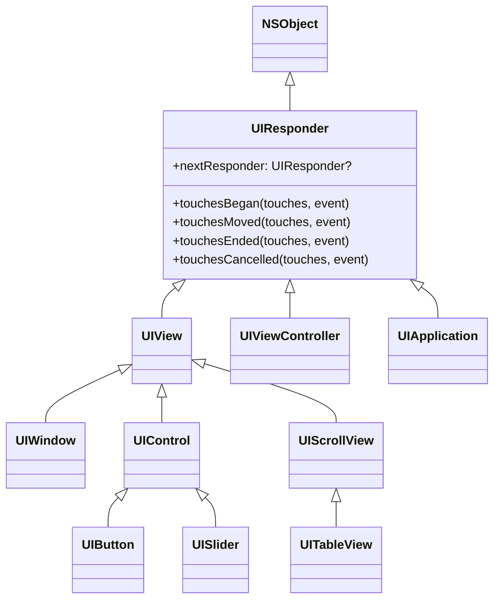
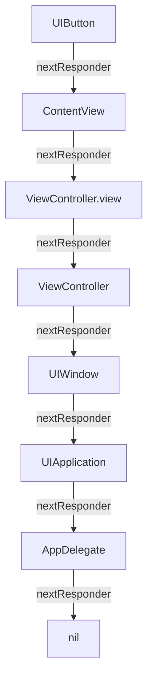
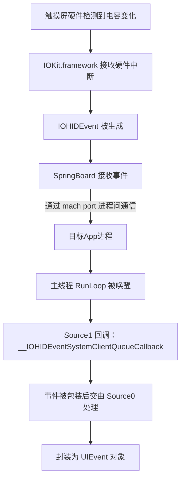
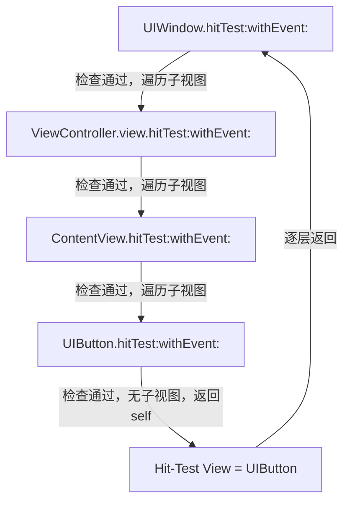
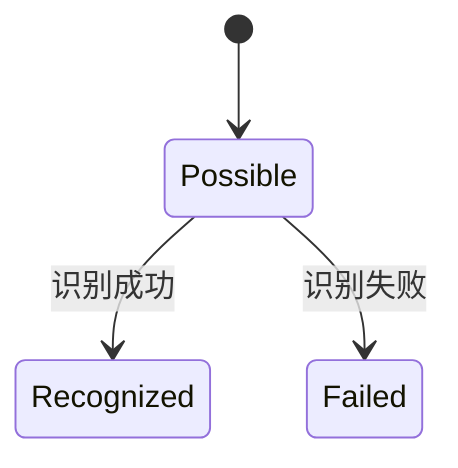
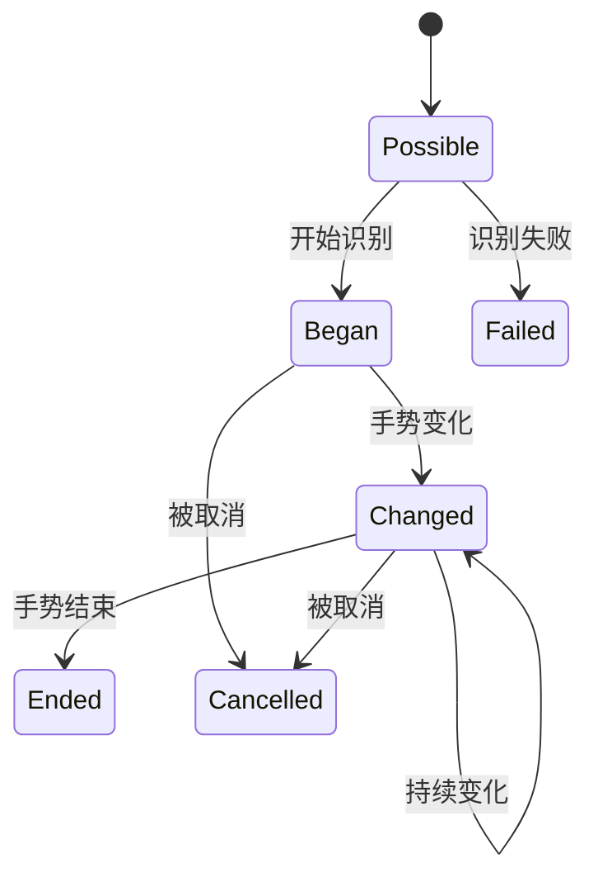
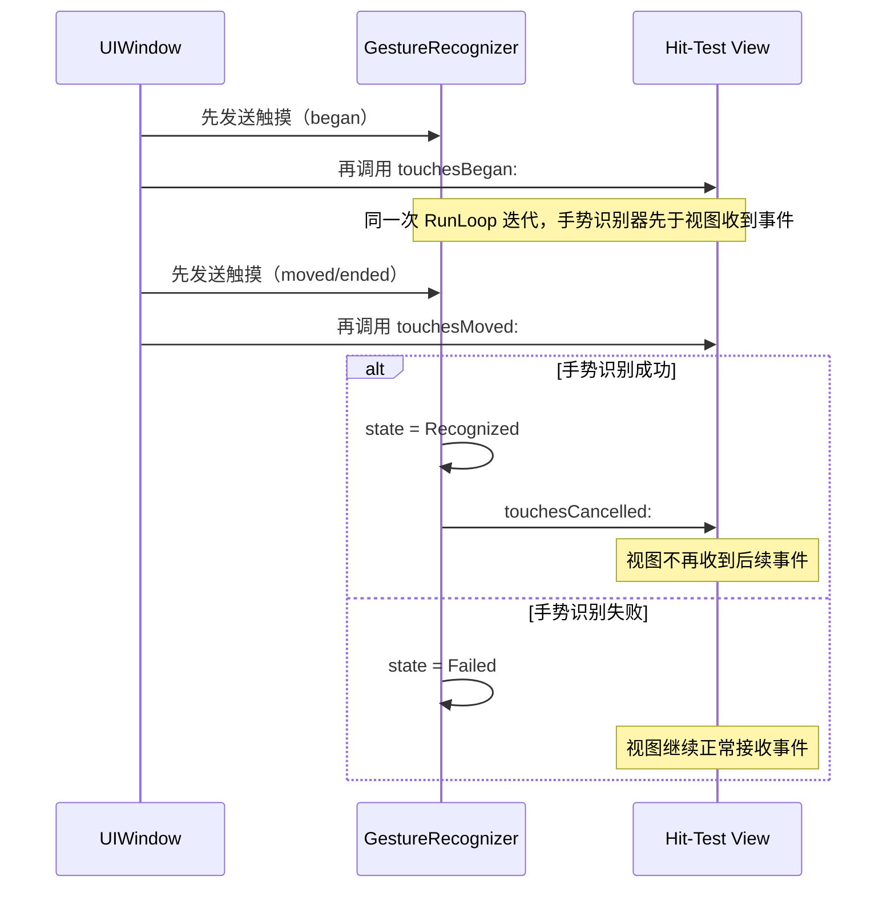
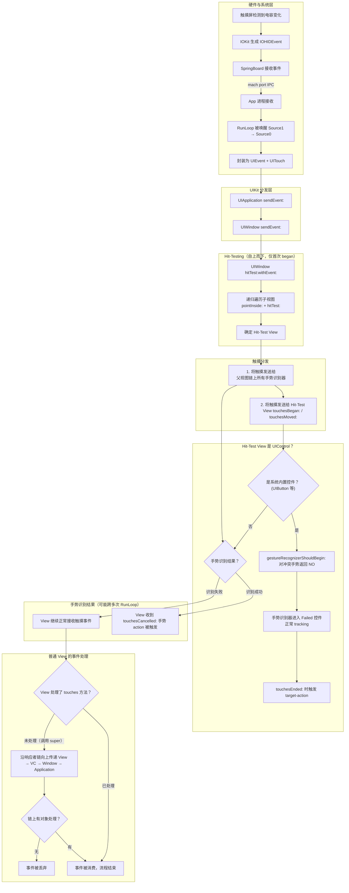

+++
title = "iOS响应者链与事件处理机制"
date = '2026-05-02T22:32:27+08:00'
draft = false
weight = 27
tags = ["iOS", "面试", "基础"]
categories = ["iOS开发", "面试"]
+++
当手指触碰iPhone屏幕上的一个按钮时，背后经历了从硬件感知、系统传递、命中测试、事件分发到最终响应的完整链路。本文将系统性地拆解iOS事件处理机制的每个环节。

## 一、响应者与响应者链

理解事件处理的前提是理解"谁有能力处理事件"。在iOS中，这个问题的答案是 **响应者（Responder）**。

### 1.1 UIResponder

所有能够接收并处理事件的对象都继承自 `UIResponder`：



`UIResponder` 定义了处理触摸事件的四个核心方法：

```objc
- (void)touchesBegan:(NSSet<UITouch *> *)touches withEvent:(UIEvent *)event;
- (void)touchesMoved:(NSSet<UITouch *> *)touches withEvent:(UIEvent *)event;
- (void)touchesEnded:(NSSet<UITouch *> *)touches withEvent:(UIEvent *)event;
- (void)touchesCancelled:(NSSet<UITouch *> *)touches withEvent:(UIEvent *)event;
```

### 1.2 nextResponder与响应者链

每个 `UIResponder` 都有一个 `nextResponder` 属性，指向"下一个响应者"。所有响应者通过这个属性串联成一条 **响应者链（Responder Chain）**。

`nextResponder` 的默认指向规则：

| 响应者类型 | nextResponder 指向 |
|---|---|
| UIView（非根视图） | 其父视图（superview） |
| UIView（VC的根视图） | 管理它的 UIViewController |
| UIViewController（有父VC） | 其 view 的父视图（即父VC中容纳它的那个视图） |
| UIViewController（根VC / presented VC） | UIWindow（根VC）或 presenting ViewController（模态呈现的VC） |
| UIWindow | UIApplication |
| UIApplication | AppDelegate（如果它继承自 UIResponder） |

以一个典型的视图层级为例：



响应者链的作用是：当某个响应者不处理事件时，事件可以沿着链向上传递，直到被某个响应者处理或到达链末端被丢弃。默认情况下，`UIResponder` 的 `touchesBegan:` 等方法的实现就是调用 `nextResponder` 的同名方法，从而实现事件的自动传递。

所谓"不处理"包括：没有重写 touches 方法（默认实现直接转发给 nextResponder），或者重写了但调用了 `super`（处理后继续传递）。反过来，事件会在以下情况被"消费"而停止传递：重写 touches 方法且不调用 `super`、手势识别器识别成功等。

## 二、触摸事件的产生与传递

### 2.1 从硬件到App

触摸事件从硬件到达App的完整路径：



几个关键细节：

- **SpringBoard** 是iOS的桌面管理程序，负责判断当前前台App并转发事件
- 事件通过 **mach port**（内核级别的进程间通信机制）从SpringBoard传递到目标App
- App主线程的 **RunLoop** 被唤醒后，先由 Source1 接收系统事件（基于port），然后将事件包装后交给 Source0（基于回调）进一步处理
- 最终事件被封装为 `UIEvent` 对象，包含一个或多个 `UITouch`

### 2.2 UIApplication分发事件

`UIEvent` 创建后，进入UIKit的分发流程：

```objc
// UIApplication 收到事件
- (void)sendEvent:(UIEvent *)event {
    [self.keyWindow sendEvent:event];
}
```

`UIWindow` 的 `sendEvent:` 方法负责将事件交给正确的视图。对于 touch began 阶段的事件，系统需要先通过 **Hit-Testing** 确定目标视图。

## 三、Hit-Testing（命中测试）

### 3.1 核心问题

屏幕上可能存在大量视图层层叠叠，当触摸发生时，系统需要找到"最合适"的视图来接收事件。这个视图需要满足两个条件：

1. 触摸点在它的范围内
2. 它是所有符合条件的视图中层级最深（最上层、最具体）的

这个寻找过程就是 **Hit-Testing**，它在 touch 的 began 阶段由系统自动执行。找到的视图称为 **Hit-Test View**，后续该触摸序列的所有事件（moved、ended、cancelled）都会直接发送给这个视图。

### 3.2 核心方法

`UIView` 提供了两个方法支持 Hit-Testing：

```objc
// 返回应该处理触摸的视图
- (UIView *)hitTest:(CGPoint)point withEvent:(UIEvent *)event;

// 判断点是否在视图范围内
- (BOOL)pointInside:(CGPoint)point withEvent:(UIEvent *)event;
```

### 3.3 hitTest:withEvent: 的默认实现

```objc
- (UIView *)hitTest:(CGPoint)point withEvent:(UIEvent *)event {
    // 1. 不能接收事件的视图直接返回nil，其子视图也不会被检查
    if (!self.userInteractionEnabled || self.hidden || self.alpha <= 0.01) {
        return nil;
    }
    
    // 2. 触摸点不在自身bounds内，返回nil
    if (![self pointInside:point withEvent:event]) {
        return nil;
    }
    
    // 3. 倒序遍历子视图（后添加的在视觉上层，优先检查）
    for (UIView *subview in [self.subviews reverseObjectEnumerator]) {
        CGPoint convertedPoint = [subview convertPoint:point fromView:self];
        UIView *hitView = [subview hitTest:convertedPoint withEvent:event];
        if (hitView) {
            return hitView;
        }
    }
    
    // 4. 没有子视图能处理，返回自身
    return self;
}
```

整个过程是一次 **从上到下的递归**：从 UIWindow 开始，逐层深入子视图，最终找到最深层能响应的视图。

### 3.4 执行流程示例

假设视图层级如下：

```
UIWindow
  └── ViewController.view
        └── ContentView
              └── UIButton [点我]   <-- 手指触摸点
```



每一层的检查逻辑相同：先判断自身能否接收事件，再判断点是否在范围内，然后倒序遍历子视图递归。

### 3.5 影响Hit-Testing的因素

| 情况 | 结果 | 说明 |
|---|---|---|
| `userInteractionEnabled = NO` | 视图及其所有子视图都无法命中 | 在父视图就停止了递归 |
| `hidden = YES` | 视图及其所有子视图都无法命中 | 同上 |
| `alpha <= 0.01` | 视图及其所有子视图都无法命中 | 同上 |
| 触摸点不在父视图bounds内 | 子视图无法命中 | 父视图的 `pointInside:` 返回 NO，不会继续遍历子视图 |

需要特别注意 **子视图超出父视图bounds** 的情况：即使子视图在视觉上可见（父视图没有设置 `clipsToBounds`），超出部分依然无法响应触摸。这是因为 Hit-Testing 的判断依据是 `pointInside:` 方法（基于 bounds），而不是视觉上是否可见。`clipsToBounds` 只控制视觉裁剪，不影响 Hit-Testing 的逻辑。

## 四、事件分发与手势识别器

Hit-Testing 找到目标视图后，`UIWindow` 的 `sendEvent:` 负责分发触摸事件——先发送给相关的 **手势识别器**，再发送给 **Hit-Test View**。

### 4.1 手势识别器的角色

在实际开发中，我们很少直接重写 `touchesBegan:` 等方法，而是使用 `UIGestureRecognizer`。它将底层触摸抽象为高级手势：

| 手势识别器 | 识别的手势 | 类型 |
|---|---|---|
| UITapGestureRecognizer | 点击 | 离散手势 |
| UILongPressGestureRecognizer | 长按 | 连续手势 |
| UIPanGestureRecognizer | 拖动 | 连续手势 |
| UISwipeGestureRecognizer | 快速滑动 | 离散手势 |
| UIPinchGestureRecognizer | 捏合缩放 | 连续手势 |
| UIRotationGestureRecognizer | 旋转 | 连续手势 |

### 4.2 手势识别器的状态机

手势识别器内部维护一个有限状态机：

离散手势（如 Tap）：



连续手势（如 Pan）：



- `Recognized` 和 `Ended` 实际上是同一个枚举值
- 离散手势从 Possible 直接跳到 Recognized 或 Failed
- 连续手势经历 Began -> Changed -> Ended 的完整生命周期

### 4.3 手势识别器与触摸事件的竞争

`UIWindow` 的 `sendEvent:` 在主线程同步执行，分发顺序是：**先将触摸发送给手势识别器**（包括 Hit-Test View 自身及其父视图链上所有关联的手势识别器），**然后再发送给 Hit-Test View** 的 `touchesBegan:` 等方法。也就是说，在同一次 RunLoop 迭代中，手势识别器总是比视图的 touches 方法更早收到触摸事件。



### 4.4 控制手势与触摸的交互

`UIGestureRecognizer` 提供三个属性控制与视图触摸事件的关系：

**cancelsTouchesInView**（默认 YES）

手势识别成功后，系统会对 Hit-Test View 调用 `touchesCancelled:`，视图不再收到后续触摸事件。设为 NO 时，手势识别成功不会影响视图的正常触摸流程。

**delaysTouchesBegan**（默认 NO）

默认情况下视图立即收到 `touchesBegan:` 和 `touchesMoved:`。设为 YES 时，系统会暂扣该触摸对象的所有事件（包括 began 和后续的 moved），等待手势识别结果——如果手势失败，才将之前积攒的 `touchesBegan:` 及后续 `touchesMoved:` 补发给视图；如果手势成功，这些触摸事件会被直接丢弃，视图不会收到任何触摸回调。

**delaysTouchesEnded**（默认 YES）

系统在手势识别结果确定前，会暂缓向视图发送 `touchesEnded:`。

### 4.5 手势冲突处理

当多个手势识别器可能同时识别时，有几种处理方式：

```objc
// 1. 设置依赖关系：单击必须等双击失败后才能识别
[singleTap requireGestureRecognizerToFail:doubleTap];

// 2. 通过代理允许同时识别
- (BOOL)gestureRecognizer:(UIGestureRecognizer *)gestureRecognizer
    shouldRecognizeSimultaneouslyWithGestureRecognizer:(UIGestureRecognizer *)other {
    return YES;
}

// 3. 控制手势是否应该开始
- (BOOL)gestureRecognizerShouldBegin:(UIGestureRecognizer *)gestureRecognizer {
    return someCondition;
}
```

## 五、UIControl的事件处理

`UIButton`、`UISlider` 等控件继承自 `UIControl`，它在 `UIView` 的基础上实现了 **Target-Action** 模式。

### 5.1 UIControl的工作方式

`UIControl` 重写了 `touchesBegan:`、`touchesMoved:`、`touchesEnded:` 等方法，在内部将底层触摸转换为控件事件：

```objc
// UIControl 内部实现（简化）
- (void)touchesBegan:(NSSet<UITouch *> *)touches withEvent:(UIEvent *)event {
    self.highlighted = YES;
    UITouch *touch = [touches anyObject];
    [self beginTrackingWithTouch:touch withEvent:event];
    [self sendActionsForControlEvents:UIControlEventTouchDown];
}

- (void)touchesEnded:(NSSet<UITouch *> *)touches withEvent:(UIEvent *)event {
    self.highlighted = NO;
    UITouch *touch = [touches anyObject];
    [self endTrackingWithTouch:touch withEvent:event];
    
    CGPoint location = [touch locationInView:self];
    if ([self pointInside:location withEvent:event]) {
        [self sendActionsForControlEvents:UIControlEventTouchUpInside];
    } else {
        [self sendActionsForControlEvents:UIControlEventTouchUpOutside];
    }
}
```

`sendActionsForControlEvents:` 最终通过 `UIApplication` 的 `sendAction:to:from:forEvent:` 将消息发送给 target。如果 target 为 nil，系统会沿着响应者链查找能响应该 action 的对象。

需要注意：虽然上面的简化代码显示 UIControl 在 `touchesBegan:` 中直接调用了 `beginTracking:`，但实际实现中 UIControl 会检查 UITouch 的 `view` 属性——该属性在 Hit-Testing 阶段就已确定，指向 Hit-Test View。只有当 `touch.view` 是 UIControl 自身或其子视图时，才会启动 tracking 流程并最终触发 target-action。

如果 UIControl 上覆盖了一个 `userInteractionEnabled = YES` 的普通 UIView，Hit-Testing 会命中该 UIView。即使该 UIView 不处理事件、事件通过响应者链传递回 UIControl 的 `touchesBegan:`，此时 `touch.view` 指向的是覆盖的 UIView 而非 UIControl 自身，UIControl 不会启动 tracking，target-action 无法触发。

```swift
let button = UIButton(type: .system)
button.addTarget(self, action: #selector(buttonTapped), for: .touchUpInside)

let overlay = UIView(frame: button.bounds)
button.addSubview(overlay)

// 点击 overlay 区域 → Hit-Test View 是 overlay，不是 button
// button 的 action 不会触发

// 解决方法：让覆盖视图不参与 Hit-Testing
overlay.isUserInteractionEnabled = false
// 此时 Hit-Test View 重新变为 button，action 正常触发
```

### 5.2 UIControl与手势识别器的关系

iOS 6.0 之后，系统内置控件（UIButton、UISwitch、UISlider 等）的默认 action 会阻止父视图链上重叠的手势识别器。例如 UIButton 的默认 action 是单击，当父视图链上任意视图有 `UITapGestureRecognizer` 时，点击按钮只会触发按钮的 action，而不会触发该手势识别器。

这个行为的实现机制是：当控件作为 hit-test view 时，`UIWindow` 会把触摸同时发送给**整个父视图链上所有关联的手势识别器**。这些手势识别器在尝试从 Possible 状态转换时，会调用 hit-test view 的 `gestureRecognizerShouldBegin:`（非手势代理方法）。系统内置控件重写了该方法，对**非自身视图上的**、**与自身默认交互方式冲突的**手势识别器返回 NO，从而阻止它们识别成功。

每个内置控件只阻止与自身操作方式冲突的手势类型，而不是阻止所有手势识别器：

| 控件 | 阻止的手势类型 | 原因 |
|------|---------------|------|
| UIButton、UISwitch、UIStepper、UISegmentedControl、UIPageControl | 单指单击 UITapGestureRecognizer | 这些控件的默认交互是单击 |
| UISlider | 沿滑动方向的单指 UISwipeGestureRecognizer | 滑动 thumb 会与 swipe 冲突 |
| UISwitch | 沿开关方向的单指 UIPanGestureRecognizer | 拨动开关会与 pan 冲突 |

对于不冲突的手势，控件不需要主动阻止。例如父视图上有 `UIPanGestureRecognizer`，用户在 UIButton 上快速点击时，pan 手势识别器本身就无法满足识别条件（需要移动距离），会自行进入 Failed 状态，无需按钮干预。

需要注意：

- 阻止的范围是**父视图链**上所有非自身的手势识别器，不限于直接父视图。但手势识别器只能添加在 UIView 上，所以这里是视图层级的父视图链，而非完整的响应者链（响应者链还包含 UIViewController 等非视图对象）
- 这是 UIButton 等**系统内置控件子类**的行为，**UIControl 基类本身不具备**这个能力。无论是直接使用 `UIControl()` 创建的实例，还是继承 UIControl 的自定义子类，都不会主动阻止父视图链上的手势识别器，因此手势识别器会照常识别并抢走触摸，导致控件的 target-action 无法触发
- 如果手势识别器直接添加在控件自身上，即使是系统内置控件也不会阻止它
- 自定义 UIControl 子类可以通过重写 `gestureRecognizerShouldBegin:` 返回 NO 来实现与 UIButton 类似的保护行为

**示例一：UIButton 自动阻止父视图手势**

```swift
let container = UIView(frame: CGRect(x: 0, y: 0, width: 300, height: 300))
let tap = UITapGestureRecognizer(target: self, action: #selector(containerTapped))
container.addGestureRecognizer(tap)

let button = UIButton(type: .system)
button.setTitle("Tap Me", for: .normal)
button.addTarget(self, action: #selector(buttonTapped), for: .touchUpInside)
container.addSubview(button)

// 点击按钮 → 只触发 buttonTapped，containerTapped 不会触发
// 点击按钮以外的区域 → 触发 containerTapped
```

**示例二：自定义 UIControl 子类无法阻止父视图手势**

```swift
class CustomControl: UIControl {}

// 同样的父视图和手势识别器
let control = CustomControl(frame: CGRect(x: 50, y: 50, width: 100, height: 44))
control.addTarget(self, action: #selector(controlTapped), for: .touchUpInside)
container.addSubview(control)

// 点击 control → 只触发 containerTapped，controlTapped 不会触发
// 父视图的手势识别器抢走了触摸，control 的 action 被吞掉
```

**示例三：自定义 UIControl 通过重写恢复保护行为**

```swift
class ProtectedControl: UIControl {
    override func gestureRecognizerShouldBegin(_ gestureRecognizer: UIGestureRecognizer) -> Bool {
        // 只阻止非自身视图上的、与自身交互冲突的手势（模仿 UIButton 的行为）
        if gestureRecognizer.view != self,
           let tap = gestureRecognizer as? UITapGestureRecognizer,
           tap.numberOfTapsRequired == 1,
           tap.numberOfTouchesRequired == 1 {
            return false
        }
        return super.gestureRecognizerShouldBegin(gestureRecognizer)
    }
}

// 点击 ProtectedControl → 只触发 controlTapped，行为与 UIButton 一致
// 父视图上的其他手势（如 pan、swipe）不受影响
```

## 六、完整流程总结

从手指触碰屏幕到事件最终被处理的完整流程如下：



其中几个环节值得注意：

- **Hit-Testing 只在 touch began 阶段执行一次**，后续的 moved/ended 直接发给已确定的 Hit-Test View
- **手势识别器始终先于 View 收到触摸**，且识别结果可能跨越多次 RunLoop 迭代才能确定（取决于手势类型）
- **`delaysTouchesBegan = YES`** 会改变上图中"视图触摸处理"的时机：View 不会立即收到 `touchesBegan:`，而是等手势识别结果出来后才决定补发或丢弃
- **系统内置控件**（UIButton 等）会通过 `gestureRecognizerShouldBegin:` 阻止与自身冲突的手势识别器，使得手势识别器直接进入 Failed 状态，控件的 target-action 正常触发

## 七、常见实践场景

### 7.1 子视图超出父视图bounds无法响应

**原因**：父视图的 `pointInside:` 返回 NO，Hit-Testing 不会继续检查子视图。

**解决**：重写父视图的 `pointInside:` 或 `hitTest:withEvent:`。

```objc
- (UIView *)hitTest:(CGPoint)point withEvent:(UIEvent *)event {
    for (UIView *subview in [self.subviews reverseObjectEnumerator]) {
        CGPoint convertedPoint = [subview convertPoint:point fromView:self];
        UIView *hitView = [subview hitTest:convertedPoint withEvent:event];
        if (hitView) {
            return hitView;
        }
    }
    return [super hitTest:point withEvent:event];
}
```

### 7.2 扩大按钮的点击区域

重写 `pointInside:` 扩大响应范围：

```objc
- (BOOL)pointInside:(CGPoint)point withEvent:(UIEvent *)event {
    CGRect expandedBounds = CGRectInset(self.bounds, -10, -10);
    return CGRectContainsPoint(expandedBounds, point);
}
```

### 7.3 穿透视图让下层响应

重写遮罩视图的 `hitTest:`，返回 nil 让事件穿透到下方的兄弟视图或父视图。注意这会导致遮罩视图及其所有子视图都无法响应事件：

```objc
- (UIView *)hitTest:(CGPoint)point withEvent:(UIEvent *)event {
    return nil;
}
```

如果遮罩层上有可交互的子视图，只希望空白区域穿透：

```objc
- (UIView *)hitTest:(CGPoint)point withEvent:(UIEvent *)event {
    UIView *hitView = [super hitTest:point withEvent:event];
    return (hitView == self) ? nil : hitView;
}
```

### 7.4 手势与控件冲突

**场景**：父视图有拖动手势，导致子按钮无法正常响应。

```objc
// 方案1：手势代理中排除UIControl
- (BOOL)gestureRecognizer:(UIGestureRecognizer *)gestureRecognizer
       shouldReceiveTouch:(UITouch *)touch {
    if ([touch.view isKindOfClass:[UIControl class]]) {
        return NO;
    }
    return YES;
}

// 方案2：不取消视图的触摸
panGesture.cancelsTouchesInView = NO;
```

## 八、常见面试问题

### Q1：描述一下 iOS 触摸事件从产生到响应的完整流程？

**硬件与系统层：**

1. 触摸屏硬件检测到电容变化（电容式触摸屏通过感应手指的电荷变化来定位触摸点），IOKit.framework 接收硬件中断并生成 IOHIDEvent（Human Interface Device 事件）
2. SpringBoard（iOS 桌面管理程序，负责管理主屏幕、App 启动等）接收事件，根据当前前台 App 的信息判断事件应该转发给哪个进程
3. 通过 mach port（内核级进程间通信机制，比用户态的通知更高效）将 IOHIDEvent 转发给目标 App 进程
4. App 主线程 RunLoop 被唤醒。事件先由 Source1（基于 port，负责接收系统内核和其他进程的消息）回调接收，然后包装后交由 Source0（基于回调，处理 App 内部事件）进一步处理
5. 事件被封装为 `UIEvent` 对象，内部包含一个或多个 `UITouch`。每个 UITouch 对应一根手指，记录了触摸的位置、阶段（began/moved/ended）、时间戳等信息

**Hit-Testing 阶段（自上而下）：**

6. `UIApplication` 调用 `sendEvent:` 将事件交给 `UIWindow`
7. `UIWindow` 调用 `hitTest:withEvent:` 开始 Hit-Testing：从自身出发，对每个子视图先调用 `pointInside:withEvent:` 判断触摸点是否在 bounds 内，再**逆序**递归子视图的 `hitTest:withEvent:`（逆序是因为后添加的子视图在视觉上更靠前，应该优先响应），最终确定层级最深的可交互视图作为 Hit-Test View
8. Hit-Testing 过程中会跳过三类视图：`hidden = YES`、`alpha <= 0.01`、`userInteractionEnabled = NO`
9. Hit-Testing 只在 touch began 阶段执行一次，后续同一触摸序列的 moved/ended 直接发给已确定的 Hit-Test View，不会因为手指移动到其他视图区域而重新寻址

**事件分发阶段（手势识别器优先）：**

10. `UIWindow` 的 `sendEvent:` 在同一次 RunLoop 迭代中，**先**将触摸发送给 Hit-Test View 自身及其父视图链上所有关联的手势识别器
11. **然后**再将触摸发送给 Hit-Test View 的 `touchesBegan:` 等方法。如果手势识别器设置了 `delaysTouchesBegan = YES`，系统会暂扣 began 及后续 moved 事件，等手势结果确定后再决定补发还是丢弃
12. 手势识别器的识别过程可能跨越多次 RunLoop 迭代，因为很多手势需要多个触摸事件才能判定（如 tap 需等到手指抬起，long press 需等待一段时间，swipe 需判断移动方向和速度）

**手势识别结果：**

13. 手势识别成功且 `cancelsTouchesInView = YES`（默认）：系统对 View 发送 `touchesCancelled:`，View 不再收到后续触摸事件，手势识别器的 action 被触发
14. 手势识别失败：View 继续正常接收后续触摸事件，手势识别器不产生任何 action

**UIControl 特殊处理：**

15. 如果 Hit-Test View 是系统内置控件（UIButton 等），父视图链上的手势识别器尝试从 Possible 状态转换时，系统会在 **Hit-Test View** 上调用 `gestureRecognizerShouldBegin:`（非手势代理方法）。内置控件对与自身交互冲突的父视图手势返回 NO（如 UIButton 阻止单击 tap，UISlider 阻止 swipe），手势识别器直接进入 Failed 状态，控件的 target-action 正常触发
16. UIControl 基类和自定义 UIControl 子类没有重写 `gestureRecognizerShouldBegin:` 实现，父视图链上的手势识别器正常识别成功后，cancel 掉控件的触摸，导致 target-action 无法触发

**响应者链传递（自下而上）：**

17. 以上所有能接收触摸事件的对象（UIView、UIViewController、UIWindow、UIApplication）都继承自 `UIResponder`，`touchesBegan:withEvent:` 等触摸回调方法正是 `UIResponder` 定义的。如果 Hit-Test View 不处理事件（触摸回调中调用了 super），事件通过 `UIResponder` 的 `nextResponder` 属性沿响应者链向上传递：Hit-Test View → 父 View → ... → UIViewController → UIViewController 的父 VC（如有）→ UIWindow → UIApplication → UIApplicationDelegate
18. 链上任意响应者重写了触摸回调且未调用 super，传递终止。如果到达链末端仍无人处理，事件被丢弃

### Q2：父视图添加了 UITapGestureRecognizer，点击子视图 UIButton 或自定义 UIControl，分别会发生什么？

**UIButton：只触发按钮的 action，手势不会触发。** UIButton 重写了 `gestureRecognizerShouldBegin:`，对非自身视图上的单指单击 UITapGestureRecognizer 返回 NO，手势识别器直接进入 Failed 状态，按钮的 target-action 正常触发。

**自定义 UIControl：手势会触发，控件的 action 不会触发。** UIControl 基类没有重写 `gestureRecognizerShouldBegin:`，父视图链上的手势识别器正常识别成功后，cancel 掉控件的触摸，导致 target-action 无法触发。解决方法是在自定义控件中重写 `gestureRecognizerShouldBegin:` 对冲突手势返回 NO。

### Q3：UIButton 上添加了一个 UIView，点击该 UIView，UIButton 的 action 会触发吗？

**不会触发。** 虽然 UIControl 重写了 `touchesBegan:`，但其内部实现会检查 `touch.view` 是否是自身——UITouch 的 `view` 属性在 Hit-Testing 阶段就已确定，指向 Hit-Test View。覆盖在上面的 UIView（默认 `userInteractionEnabled = YES`）会成为 Hit-Test View，即使 UIView 不处理事件、事件通过响应者链传回 UIButton 的 `touchesBegan:`，此时 `touch.view` 指向的是覆盖的 UIView，UIButton 不会启动 tracking 流程，action 无法触发。

解决方法是将覆盖视图的 `isUserInteractionEnabled` 设为 `false`，使其在 Hit-Testing 中被跳过，Hit-Test View 重新落到 UIButton 上。

### Q4：有哪些常见的应用场景需要利用响应者链和 Hit-Testing 机制？

**扩大按钮的点击区域**：按钮太小不好点击时，重写 `pointInside:withEvent:`，将判定范围扩大到 bounds 之外（例如四周各扩大 10pt），不需要改变按钮的实际 frame。

**子视图超出父视图 bounds 仍可点击**：默认情况下父视图的 `pointInside:` 返回 NO 会导致 Hit-Testing 提前终止，子视图即使可见也无法响应。重写父视图的 `hitTest:withEvent:`，跳过 `pointInside:` 的限制，直接对子视图坐标转换后递归检查。

**穿透遮罩层让下层响应**：全屏半透明遮罩层覆盖在内容上，希望空白区域的点击穿透到下方。重写遮罩层的 `hitTest:withEvent:`，当命中的是自身时返回 nil（穿透），命中子视图时正常返回（遮罩上的关闭按钮等仍可交互）。

**利用响应者链实现跨层级通信**：`UIApplication` 的 `sendAction:to:from:forEvent:` 中 target 为 nil 时，action 会沿响应者链向上查找第一个能响应该 selector 的对象。可以用来实现深层嵌套 Cell 中的按钮事件传递给 ViewController，无需逐层 delegate 或闭包回调。

**手势与控件冲突处理**：父视图有拖动手势导致子按钮无法响应时，可以通过手势代理的 `gestureRecognizer:shouldReceiveTouch:` 排除 UIControl 区域，或设置 `cancelsTouchesInView = NO` 让手势和控件同时响应。

**全局点击收起键盘**：在根视图或 Window 上添加 UITapGestureRecognizer 并设置 `cancelsTouchesInView = NO`，点击空白区域时调用 `endEditing:` 收起键盘，同时不影响其他控件的正常交互。
