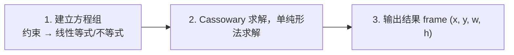
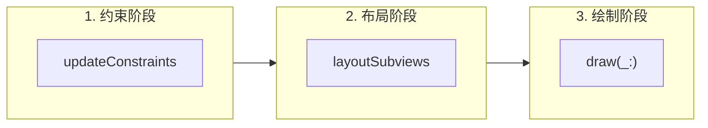
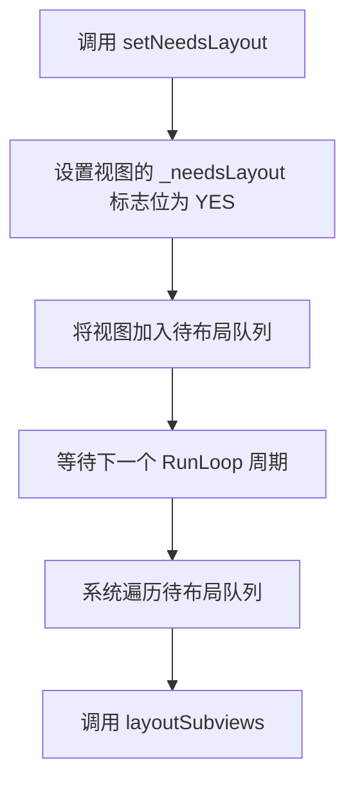
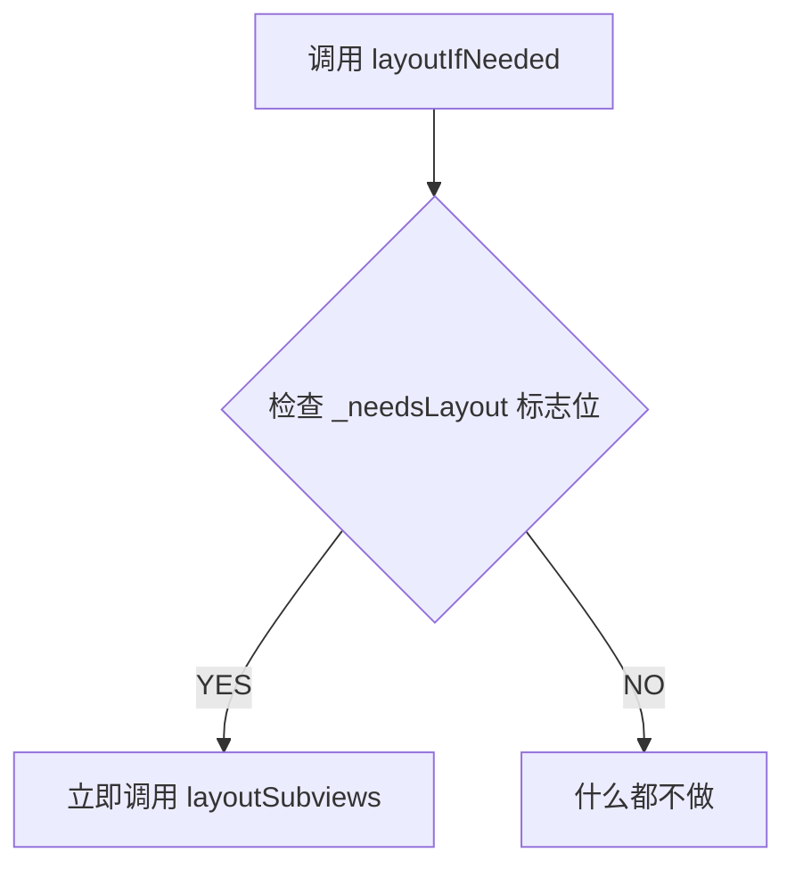
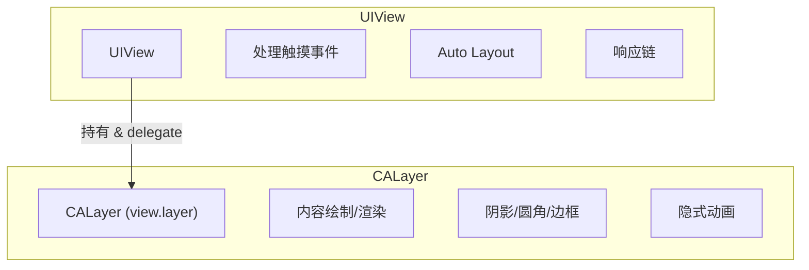
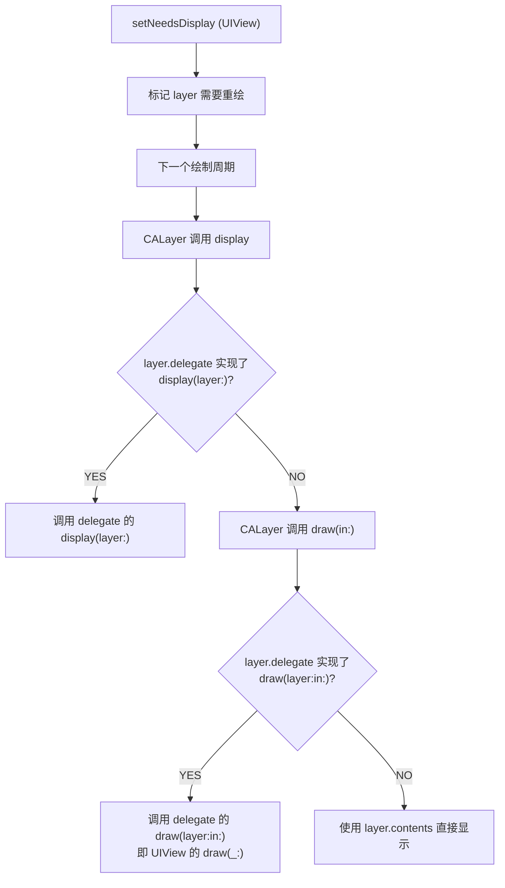

+++
title = "布局方法详解"
date = '2026-05-02T22:32:27+08:00'
draft = false
weight = 29
tags = ["iOS", "面试", "基础"]
categories = ["iOS开发", "面试"]
+++
本文详细介绍 iOS 中三种布局方式（Frame、Auto Layout、UIStackView）的原理和对比，视图更新的三个阶段（约束、布局、绘制），UIView 与 CALayer 的关系和区别，以及 `updateConstraints`、`layoutSubviews`、`setNeedsLayout`、`layoutIfNeeded`、`setNeedsDisplay` 等相关方法的作用、调用时机和区别。

## iOS 布局方式

iOS 提供了三种主要的布局方式，按出现时间排列：

| 布局方式 | 引入版本 | 核心思想 | API |
|---------|---------|---------|-----|
| Frame 布局 | iOS 2 | 直接指定视图的位置和大小 | frame、bounds、center |
| Auto Layout | iOS 6 | 通过约束描述视图间关系，系统自动计算 frame | NSLayoutConstraint、Anchor API |
| UIStackView | iOS 9 | 线性排列子视图，自动管理约束 | UIStackView |

### Frame 布局

直接通过设置 `frame` 属性来确定视图的位置和大小，是最基础的布局方式。

```swift
let label = UILabel()
label.frame = CGRect(x: 20, y: 100, width: 200, height: 44)
view.addSubview(label)
```

**优点**：性能最好（无需约束求解），逻辑直观，完全可控。

**缺点**：需要手动计算所有数值，难以适配不同屏幕尺寸和动态内容，维护成本高。

**适用场景**：简单固定布局、性能敏感的场景（如 `UITableViewCell` 内大量视图手动布局）、需要频繁更新 frame 的动画。

### Auto Layout

Auto Layout 是基于 **约束（Constraint）** 的布局系统。开发者不直接设置 frame，而是描述视图之间的关系（如"A 的左边距 B 右边 16pt"），系统通过求解约束方程组自动计算出每个视图的 frame。

```swift
let label = UILabel()
label.translatesAutoresizingMaskIntoConstraints = false
view.addSubview(label)

NSLayoutConstraint.activate([
    label.leadingAnchor.constraint(equalTo: view.leadingAnchor, constant: 20),
    label.topAnchor.constraint(equalTo: view.topAnchor, constant: 100),
    label.widthAnchor.constraint(equalToConstant: 200),
    label.heightAnchor.constraint(equalToConstant: 44)
])
```

#### Auto Layout 工作原理

Auto Layout 的核心是 **Cassowary 约束求解算法**，整个过程分为三步：



**1) 约束转化为方程**

每个约束本质上是一个线性等式或不等式：

```
view1.attribute = multiplier × view2.attribute + constant
```

例如 `label.leading = 1.0 × view.leading + 20` 对应 `label.leadingAnchor.constraint(equalTo: view.leadingAnchor, constant: 20)`。

所有约束组合成一个**线性方程组**，每个视图有 4 个未知数（x、y、width、height）。

**2) Cassowary 算法求解**

Cassowary 是一种基于 **单纯形法（Simplex Method）** 的增量式约束求解算法，特点：

- **增量求解**：不是每次从头计算，而是在已有解的基础上增量更新，修改一个约束不需要重新求解所有方程
- **优先级支持**：约束分为 Required（1000）和 Optional（1-999），Required 约束必须满足，Optional 约束尽量满足
- **处理冲突**：当约束冲突时，低优先级约束被打破，系统输出警告

**3) 约束优先级与固有尺寸**

```swift
// 约束优先级
constraint.priority = .defaultHigh  // 750
constraint.priority = .defaultLow   // 250
constraint.priority = .required     // 1000（不可打破）

// Content Hugging：抗拉伸，优先级越高越不容易被拉伸
label.setContentHuggingPriority(.defaultHigh, for: .horizontal)

// Compression Resistance：抗压缩，优先级越高越不容易被压缩
label.setContentCompressionResistancePriority(.required, for: .horizontal)
```

UILabel、UIButton 等控件拥有 `intrinsicContentSize`（固有尺寸），Auto Layout 会为其自动生成宽高约束（优先级为 Content Hugging / Compression Resistance 的值），因此这些控件不需要显式设置宽高约束。

#### Auto Layout 性能

Auto Layout 的性能开销主要来自约束求解：

- 视图数量少时（<30 个约束），性能开销可忽略
- 约束数量与求解时间大致呈**线性关系**（得益于增量求解），但在某些病态情况下可能退化
- 嵌套层级过深、大量不等式约束会增加求解复杂度
- 频繁增删约束比修改 `constant` 代价更大（修改 constant 只是增量更新）

### UIStackView

UIStackView 是对 Auto Layout 的**高层封装**，用于在水平或垂直方向上线性排列子视图。它内部自动创建和管理约束，开发者只需配置排列属性。

```swift
let stack = UIStackView(arrangedSubviews: [label1, label2, label3])
stack.axis = .vertical
stack.spacing = 12
stack.alignment = .fill
stack.distribution = .fill
view.addSubview(stack)
```

#### 核心属性

| 属性 | 作用 | 常用值 |
|-----|------|-------|
| axis | 排列方向 | .horizontal / .vertical |
| spacing | 子视图间距 | CGFloat 值 |
| alignment | 垂直于 axis 方向的对齐 | .fill / .center / .leading / .trailing |
| distribution | 沿 axis 方向的分布 | .fill / .fillEqually / .fillProportionally / .equalSpacing / .equalCentering |

#### 工作原理

UIStackView **不直接渲染内容**（它的 `CALayer` 不会执行绑定渲染，`drawRect:` 不会被调用），它本质是一个约束管理器：

- 添加 arrangedSubview 时，UIStackView 自动在子视图之间创建约束
- 修改 axis、spacing、alignment、distribution 等属性时，UIStackView 更新内部约束
- 移除 arrangedSubview 时，UIStackView 自动移除相关约束

### 三种布局方式对比

| 对比维度 | Frame 布局 | Auto Layout | UIStackView |
|---------|-----------|-------------|-------------|
| 布局方式 | 手动计算 frame | 声明约束关系 | 配置排列属性 |
| 屏幕适配 | 需手动处理 | 自动适配 | 自动适配 |
| 动态内容 | 需手动更新 | 自动响应 | 自动响应 |
| 代码量 | 中等（计算逻辑多） | 较多（约束声明） | 最少 |
| 性能 | 最好 | 良好（约束求解有开销） | 良好（底层是 Auto Layout） |
| 可维护性 | 低（修改需重算） | 高 | 最高 |
| 灵活性 | 最高 | 高 | 受限于线性排列 |

**实际开发中的选择**：
- 大部分 UI 使用 **Auto Layout**，兼顾灵活性和适配能力
- 线性排列的场景优先用 **UIStackView**，减少样板代码
- 性能敏感或需要精确控制的场景使用 **Frame 布局**
- 三者可以混合使用，例如在 Auto Layout 为主的页面中，对某些复杂 cell 使用 frame 布局优化性能

## 视图更新三阶段

iOS 的视图更新分为**约束（Constraints）、布局（Layout）、绘制（Display）**三个阶段，在每个 [RunLoop](runloop.md) 周期中按顺序依次执行：



| 阶段 | 做什么 | 方向 | 标记方法 | 立即执行方法 | 系统回调 |
|------|-------|------|---------|------------|---------|
| 约束 | 根据约束计算视图的 frame | 叶子→根（由内到外） | setNeedsUpdateConstraints | updateConstraintsIfNeeded | updateConstraints |
| 布局 | 将计算结果应用到视图的 frame | 根→叶子（由外到内） | setNeedsLayout | layoutIfNeeded | layoutSubviews |
| 绘制 | 将视图内容渲染为像素 | 根→叶子（由外到内） | setNeedsDisplay | — | draw(_:) |

每个阶段都遵循相同的**延迟执行**模式：**标记 → 等待 RunLoop → 批量执行**。这种设计的优势：
- 避免重复计算：多次修改属性只触发一次更新
- 性能优化：批量处理更新
- 动画支持：配合动画系统平滑过渡

## 约束阶段

### updateConstraints

`updateConstraints` 是 Auto Layout 系统中用于更新约束的回调方法，在约束阶段由系统调用。

```swift
class CustomView: UIView {
    private var widthConstraint: NSLayoutConstraint!
    var isExpanded = false {
        didSet {
            setNeedsUpdateConstraints()
        }
    }
    
    override func updateConstraints() {
        widthConstraint.constant = isExpanded ? 200 : 100
        super.updateConstraints()  // 必须调用super
    }
}
```

### setNeedsUpdateConstraints

标记视图的约束需要更新（异步）：

```swift
view.setNeedsUpdateConstraints()
```

### updateConstraintsIfNeeded

立即更新约束（如果需要）：

```swift
view.updateConstraintsIfNeeded()
```

## 布局阶段

### layoutSubviews

`layoutSubviews` 是布局系统的核心回调方法，负责实际的布局计算和子视图位置调整。

```swift
class CustomView: UIView {
    override func layoutSubviews() {
        super.layoutSubviews()
        
        let padding: CGFloat = 16
        subviewA.frame = CGRect(
            x: padding,
            y: padding,
            width: bounds.width - padding * 2,
            height: 44
        )
    }
}
```

#### 调用时机

`layoutSubviews` 会在以下情况被系统自动调用：

| 触发条件 | 说明 |
|---------|------|
| 视图首次显示 | addSubview后首次渲染 |
| bounds改变 | size或origin变化时都会触发（frame.size改变也会触发） |
| 子视图添加/移除 | addSubview、removeFromSuperview |
| 滚动 | UIScrollView滚动时 |
| 旋转 | 设备方向改变 |
| 手动触发 | setNeedsLayout + layoutIfNeeded |

#### 注意事项

```swift
// 错误示范：在layoutSubviews中修改约束
override func layoutSubviews() {
    super.layoutSubviews()
    someConstraint.constant = 100  // 危险！可能导致无限循环
}

// 正确做法：约束更新应在updateConstraints中进行
override func updateConstraints() {
    someConstraint.constant = 100
    super.updateConstraints()
}
```

### setNeedsLayout

`setNeedsLayout` 是一个**标记方法**，用于告诉系统该视图需要重新布局。

```swift
view.setNeedsLayout()
```

#### 工作原理



#### 特点

- **异步执行**：不会立即触发布局，而是在下一个布局周期执行
- **合并更新**：多次调用只会触发一次 `layoutSubviews`
- **低成本**：仅设置标志位，几乎无性能开销

```swift
// 多次调用只触发一次layoutSubviews
view.setNeedsLayout()
view.setNeedsLayout()
view.setNeedsLayout()
// layoutSubviews 只会被调用一次
```

### layoutIfNeeded

`layoutIfNeeded` 是一个**立即执行**方法，强制系统立即执行布局。

```swift
view.layoutIfNeeded()
```

#### 工作原理



#### 特点

- **同步执行**：立即执行布局计算
- **条件执行**：检查视图层级中是否有待处理的布局请求（约束变更、`setNeedsLayout` 等都会自动标记），有则执行，无则跳过
- **递归执行**：以接收者为根，对整个子视图树执行布局

### setNeedsLayout vs layoutIfNeeded

这两个方法经常配合使用，理解它们的区别至关重要：

| 特性 | setNeedsLayout | layoutIfNeeded |
|-----|----------------|----------------|
| 执行时机 | 下一个布局周期（异步） | 立即执行（同步） |
| 主要作用 | 标记需要布局 | 强制执行布局 |
| 性能开销 | 极低 | 可能较高 |
| 使用场景 | 普通布局更新 | 动画、需要立即获取frame |

#### 动画中的应用

```swift
// 约束动画的标准写法
someConstraint.constant = 100

UIView.animate(withDuration: 0.3) {
    view.layoutIfNeeded()  // 在动画block中立即执行
}
```

这种写法的原理：
1. 修改约束后，系统自动将相关视图标记为需要布局
2. 在动画block中调用 `layoutIfNeeded`，此时布局计算被动画系统捕获
3. 动画系统对frame的变化进行插值，产生平滑动画

```swift
// 错误示范：动画不生效
UIView.animate(withDuration: 0.3) {
    someConstraint.constant = 100
    // 缺少 layoutIfNeeded()，约束值变了但布局没有立即执行
    // 动画block结束后才会在下一个RunLoop周期布局，导致无动画效果
}
```

## 绘制阶段

### setNeedsDisplay

`setNeedsDisplay` 用于标记视图需要重绘，与布局方法类似，采用延迟执行机制。

```swift
view.setNeedsDisplay()

// 标记特定区域需要重绘
view.setNeedsDisplay(CGRect(x: 0, y: 0, width: 100, height: 100))
```

### draw(_:)

调用 `setNeedsDisplay` 后，系统会在下一个绘制周期调用 `draw(_:)` 方法：

```swift
class CustomDrawView: UIView {
    var progress: CGFloat = 0 {
        didSet {
            setNeedsDisplay()
        }
    }
    
    override func draw(_ rect: CGRect) {
        guard let context = UIGraphicsGetCurrentContext() else { return }
        
        context.setFillColor(UIColor.blue.cgColor)
        context.fill(CGRect(x: 0, y: 0, width: bounds.width * progress, height: bounds.height))
    }
}
```

### setNeedsLayout vs setNeedsDisplay

| 方法 | 触发的回调 | 用途 |
|-----|-----------|------|
| setNeedsLayout | layoutSubviews | 更新子视图位置和大小 |
| setNeedsDisplay | draw(_:) | 重新绘制视图内容 |

注意：布局流程和绘制流程是**独立的**，`setNeedsDisplay` 不会在布局完成后自动调用，需要手动触发或由特定属性变化触发。

## UIView 与 CALayer

### 基本关系

每个 UIView 内部都持有一个 CALayer（通过 `view.layer` 访问），两者是**一对一绑定**的关系。UIView 是 CALayer 的 `delegate`，负责将用户交互和高层 API 桥接到底层的图层渲染。



### 职责分工

| 对比维度 | UIView | CALayer |
|---------|--------|---------|
| 所属框架 | UIKit | Core Animation |
| 继承链 | UIResponder → NSObject | NSObject |
| 内容显示 | 通过内部 layer 实现 | 直接管理位图内容（contents） |
| 事件处理 | 支持（hitTest、手势等） | 不支持 |
| 响应链 | 参与 | 不参与 |
| Auto Layout | 支持 | 不支持 |
| 隐式动画 | 不支持（默认禁用） | 支持（独立 layer 修改可动画属性自动产生动画） |
| 坐标属性 | frame、bounds、center | frame、bounds、position、anchorPoint |
| 圆角/阴影/边框 | 需通过 layer 设置 | 直接支持（cornerRadius、shadow*、border*） |

### 为什么要设计两套体系

UIView 和 CALayer 分离是经典的**职责分离**设计：

- **CALayer** 负责纯粹的视觉呈现，它在 macOS（AppKit）和 iOS（UIKit）之间是共享的
- **UIView** 负责封装用户交互逻辑（触摸事件、手势、响应链），这部分是 iOS 平台特有的
- macOS 中对应的是 **NSView**，它同样包装了 CALayer，但事件处理模型不同（鼠标、键盘）

这种设计使得 Core Animation 框架可以跨平台复用，而平台特定的交互逻辑各自封装。

### 隐式动画

独立创建的 CALayer（非 UIView 的 backing layer）修改可动画属性时会自动产生 0.25s 的隐式动画：

```swift
let layer = CALayer()
layer.frame = CGRect(x: 50, y: 50, width: 100, height: 100)
layer.backgroundColor = UIColor.red.cgColor
view.layer.addSublayer(layer)

// 修改可动画属性，自动产生隐式动画
layer.backgroundColor = UIColor.blue.cgColor  // 颜色渐变动画
layer.position = CGPoint(x: 200, y: 200)      // 位移动画
```

UIView 的 backing layer 默认禁用隐式动画（UIView 在 delegate 方法中返回 `NSNull` 来阻止）。要为 UIView 添加动画，需使用 `UIView.animate` 或显式的 `CAAnimation`。

### position 与 anchorPoint

CALayer 使用 `position` + `anchorPoint` 来定位，而 UIView 使用 `center`：

```
position = frame.origin + (frame.size * anchorPoint)
```

`anchorPoint` 取值范围为 `(0,0)` 到 `(1,1)`，默认 `(0.5, 0.5)` 即中心点。此时 `position` 等同于 UIView 的 `center`。

```swift
// anchorPoint 为 (0.5, 0.5)，position 就是中心点
layer.position  // 等于 view.center

// 修改 anchorPoint 会改变 position 的参考点，但不影响 position 的值
// 因此视觉上 layer 的位置会发生偏移
layer.anchorPoint = CGPoint(x: 0, y: 0)
// position 不变，但 frame.origin 变了（视图看起来移动了）
```

### 绘制流程中的协作

在视图更新的绘制阶段，UIView 和 CALayer 的协作关系：



调用 `UIView.setNeedsDisplay()` 实际上是调用 `layer.setNeedsDisplay()`，最终由 CALayer 驱动绘制流程，UIView 作为 delegate 参与其中。

## 方法对比汇总

### 约束相关方法

| 方法 | 类型 | 执行时机 | 作用 |
|-----|------|---------|------|
| updateConstraints | 回调 | 系统调用 | 更新约束 |
| setNeedsUpdateConstraints | 标记 | 立即返回 | 标记需要更新约束 |
| updateConstraintsIfNeeded | 执行 | 同步执行 | 立即更新约束 |

### 布局相关方法

| 方法 | 类型 | 执行时机 | 作用 |
|-----|------|---------|------|
| layoutSubviews | 回调 | 系统调用 | 执行实际布局 |
| setNeedsLayout | 标记 | 立即返回 | 标记需要布局 |
| layoutIfNeeded | 执行 | 同步执行 | 立即执行布局 |

### 绘制相关方法

| 方法 | 类型 | 执行时机 | 作用 |
|-----|------|---------|------|
| draw(_:) | 回调 | 系统调用 | 执行绘制 |
| setNeedsDisplay | 标记 | 立即返回 | 标记需要重绘 |

## 实际应用场景

### 场景1：动态调整子视图布局

```swift
class DynamicLayoutView: UIView {
    private let containerView = UIView()
    private var items: [UIView] = []
    
    func addItem(_ item: UIView) {
        items.append(item)
        containerView.addSubview(item)
        setNeedsLayout()
    }
    
    override func layoutSubviews() {
        super.layoutSubviews()
        
        var yOffset: CGFloat = 0
        for item in items {
            item.frame = CGRect(
                x: 0,
                y: yOffset,
                width: bounds.width,
                height: 44
            )
            yOffset += 44 + 8
        }
        containerView.frame = CGRect(
            x: 0,
            y: 0,
            width: bounds.width,
            height: yOffset
        )
    }
}
```

### 场景2：获取布局后的frame

```swift
func setupSubview() {
    let label = UILabel()
    label.text = "Hello World"
    label.translatesAutoresizingMaskIntoConstraints = false
    view.addSubview(label)
    
    NSLayoutConstraint.activate([
        label.centerXAnchor.constraint(equalTo: view.centerXAnchor),
        label.centerYAnchor.constraint(equalTo: view.centerYAnchor)
    ])
    
    // 此时label.frame还是.zero
    print(label.frame)  // (0, 0, 0, 0)
    
    // 强制布局后才能获取正确的frame
    // addSubview和activate约束时，系统已自动标记需要布局
    view.layoutIfNeeded()
    print(label.frame)  // 正确的frame值
}
```

### 场景3：约束动画

```swift
class AnimatedView: UIView {
    private var heightConstraint: NSLayoutConstraint!
    
    func expand() {
        heightConstraint.constant = 200
        
        UIView.animate(withDuration: 0.3, delay: 0, options: .curveEaseInOut) {
            self.superview?.layoutIfNeeded()
        }
    }
    
    func collapse() {
        heightConstraint.constant = 50
        
        UIView.animate(withDuration: 0.3, delay: 0, options: .curveEaseInOut) {
            self.superview?.layoutIfNeeded()
        }
    }
}
```

### 场景4：批量更新优化

```swift
class BatchUpdateView: UIView {
    func updateMultipleProperties() {
        subviewA.isHidden = false
        subviewB.backgroundColor = .red
        someConstraint.constant = 100
        anotherConstraint.constant = 200
        
        // 只需要标记一次
        setNeedsLayout()
        // layoutSubviews只会被调用一次，性能最优
    }
}
```

## 常见面试题

### Q1：setNeedsLayout 和 layoutIfNeeded 的区别是什么？

`setNeedsLayout` 是异步标记方法，仅设置标志位，在下一个 RunLoop 周期才执行 `layoutSubviews`；`layoutIfNeeded` 是同步执行方法，如果存在待处理的布局标记，会立即触发 `layoutSubviews`。两者经常配合使用，比如约束动画中先修改约束（系统自动标记），再在动画 block 中调用 `layoutIfNeeded` 让布局变化被动画系统捕获。

### Q2：为什么约束动画要在动画 block 中调用 layoutIfNeeded，而不是修改约束？

```swift
// 正确写法
someConstraint.constant = 100
UIView.animate(withDuration: 0.3) {
    self.view.layoutIfNeeded()
}

// 错误写法
UIView.animate(withDuration: 0.3) {
    someConstraint.constant = 100
}
```

修改约束只是更新约束对象的值并标记视图需要布局，并不会产生可动画的属性变化。真正改变 `frame` 的是 `layoutSubviews`（由 `layoutIfNeeded` 触发）。动画系统只能捕获 block 内发生的可动画属性（如 frame）变化，所以必须在 block 内调用 `layoutIfNeeded` 来让 frame 变化发生在动画上下文中。

### Q3：layoutSubviews 在什么时候会被调用？

- 视图首次被添加到视图层级并显示时
- 视图的 `bounds` 发生变化时（包括 `frame.size` 改变）
- 添加或移除子视图时
- `UIScrollView` 滚动时（`contentOffset` 变化导致 `bounds.origin` 变化）
- 设备旋转导致父视图大小变化时
- 调用 `setNeedsLayout` 后的下一个布局周期
- 调用 `layoutIfNeeded` 时（如果有待处理的布局标记）

### Q4：为什么不能在 layoutSubviews 中修改约束？

在 `layoutSubviews` 中修改约束会导致系统重新标记视图需要布局，从而再次触发 `layoutSubviews`，形成**无限循环**。约束的更新应放在 `updateConstraints` 中，通过 `setNeedsUpdateConstraints` 标记触发，这样约束更新在布局之前完成，不会产生循环依赖。

### Q5：setNeedsDisplay 和 setNeedsLayout 的区别是什么？

| 对比维度 | setNeedsDisplay | setNeedsLayout |
|---------|----------------|----------------|
| 触发回调 | `draw(_:)` | `layoutSubviews` |
| 所属阶段 | 绘制阶段 | 布局阶段 |
| 用途 | 重新绘制视图内容（颜色、形状等） | 重新计算子视图的位置和大小 |
| 是否互相触发 | 否，两者独立 | 否，两者独立 |

它们属于不同的更新阶段，互不影响。如果同时需要重新布局和重绘，需要分别调用两个方法。

### Q6：三个阶段（约束、布局、绘制）的执行顺序和方向分别是什么？

- **约束阶段**：从叶子节点到根节点（由内到外），先计算子视图的约束，再计算父视图
- **布局阶段**：从根节点到叶子节点（由外到内），先布局父视图，再布局子视图
- **绘制阶段**：从根节点到叶子节点（由外到内），先绘制父视图，再绘制子视图

约束阶段由内到外是因为父视图的布局可能依赖子视图的固有尺寸（intrinsicContentSize）；布局和绘制阶段由外到内是因为子视图的位置和大小依赖父视图的 bounds。

### Q7：Auto Layout 的工作原理是什么？

Auto Layout 的核心是 Cassowary 约束求解算法。每个约束被转化为线性等式或不等式（`view1.attr = m × view2.attr + c`），所有约束组成一个线性方程组，每个视图有 x、y、width、height 四个未知数。Cassowary 使用单纯形法进行**增量求解**——修改一个约束不需要从头计算，只在已有解基础上增量更新。约束有优先级（1-1000），Required（1000）必须满足，Optional 尽量满足，冲突时低优先级约束被打破。UILabel 等控件通过 intrinsicContentSize 自动提供宽高约束（由 Content Hugging 和 Compression Resistance 优先级控制）。

### Q8：Frame 布局、Auto Layout 和 UIStackView 分别在什么场景下使用？

**Frame 布局**适合性能敏感场景（如复杂 cell 手动布局）和需要精确控制的动画；**Auto Layout** 适合大部分 UI，能自动适配不同屏幕和动态内容；**UIStackView** 适合线性排列场景（垂直/水平列表），它本质是 Auto Layout 的高层封装，内部自动创建和管理约束。实际开发中三者经常混合使用，以 Auto Layout 为主，局部用 StackView 简化代码，性能热点用 frame 优化。

### Q9：UIView 和 CALayer 的区别是什么？

UIView 属于 UIKit，继承自 UIResponder，负责事件处理（触摸、手势）、响应链和 Auto Layout；CALayer 属于 Core Animation，继承自 NSObject，负责视觉内容的渲染（位图管理、圆角、阴影、边框、动画等）。每个 UIView 内部持有一个 CALayer，UIView 是这个 layer 的 delegate。两者分离的核心原因是职责分离：CALayer 可以在 iOS（UIKit）和 macOS（AppKit）间共享，平台特有的交互逻辑由各自的 View 层封装。

### Q10：CALayer 的隐式动画是什么？为什么 UIView 的 layer 没有隐式动画？

独立创建的 CALayer 修改可动画属性（backgroundColor、position、opacity 等）时会自动产生 0.25s 的过渡动画，这就是隐式动画。UIView 的 backing layer 之所以没有隐式动画，是因为 UIView 作为 layer 的 delegate，在 `action(for:forKey:)` 方法中返回了 `NSNull`，阻止了默认的动画行为。要为 UIView 添加动画，需要使用 `UIView.animate` 系列方法或显式的 `CAAnimation`。

### Q11：如何在添加约束后立即获取视图的 frame？

```swift
let label = UILabel()
label.translatesAutoresizingMaskIntoConstraints = false
view.addSubview(label)
NSLayoutConstraint.activate([...])

// 此时 label.frame 为 .zero，因为布局尚未执行
print(label.frame)  // (0, 0, 0, 0)

// 调用 layoutIfNeeded 强制立即执行布局
view.layoutIfNeeded()
print(label.frame)  // 正确的值
```

添加约束后系统只是标记了视图需要布局，要在下一个 RunLoop 周期才会执行。调用 `layoutIfNeeded` 可以同步触发布局计算，之后就能获取到正确的 frame。
