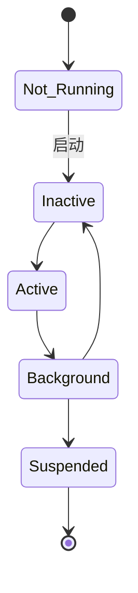
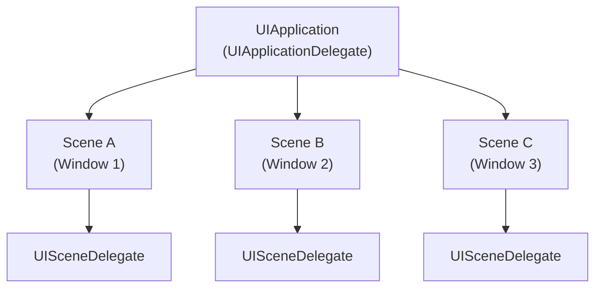
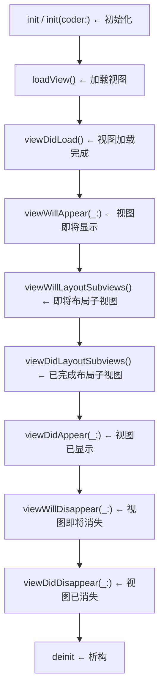
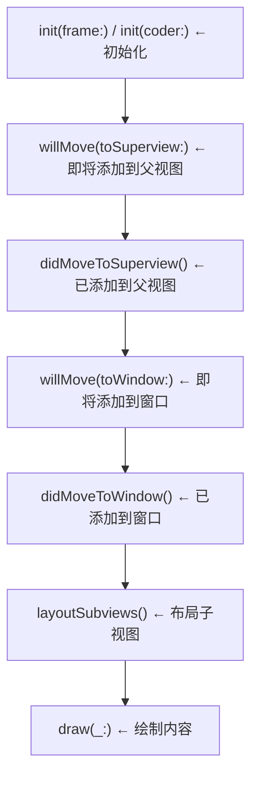

+++
title = "iOS中的生命周期"
date = '2026-05-05T00:41:41+08:00'
draft = false
weight = 30
tags = ["iOS", "面试", "基础"]
categories = ["iOS开发", "面试"]
+++
iOS开发中，理解各种生命周期是非常重要的基础知识。本文将详细介绍应用生命周期、UIViewController生命周期、UIView生命周期，以及其他常见的生命周期。

## 应用生命周期（App Lifecycle）

### 应用状态

iOS应用有五种运行状态：

| 状态 | 描述 |
|------|------|
| Not Running | 应用未启动或已被系统终止 |
| Inactive | 应用在前台运行但未接收事件（如来电、锁屏时的过渡状态） |
| Active | 应用在前台运行并接收事件，这是应用的正常运行状态 |
| Background | 应用在后台执行代码，通常只有短暂的执行时间 |
| Suspended | 应用在后台但不执行代码，系统会在内存不足时自动终止该状态的应用 |

### 状态转换图



### UIApplicationDelegate 方法（iOS 12及之前）

在iOS 12及之前的版本中，应用生命周期主要通过`UIApplicationDelegate`协议来管理：

```swift
// 应用启动完成
func application(_ application: UIApplication, 
                 didFinishLaunchingWithOptions launchOptions: [UIApplication.LaunchOptionsKey: Any]?) -> Bool {
    // 初始化配置、第三方SDK等
    return true
}

// 应用即将进入非活动状态
func applicationWillResignActive(_ application: UIApplication) {
    // 暂停正在进行的任务、禁用定时器
    // 游戏应该在此暂停
}

// 应用已进入后台
func applicationDidEnterBackground(_ application: UIApplication) {
    // 释放共享资源、保存用户数据
    // 可以请求额外的后台执行时间
}

// 应用即将进入前台
func applicationWillEnterForeground(_ application: UIApplication) {
    // 撤销进入后台时所做的更改
}

// 应用已变为活动状态
func applicationDidBecomeActive(_ application: UIApplication) {
    // 重启被暂停的任务
    // 如果应用之前在后台，可以刷新UI
}

// 应用即将终止
func applicationWillTerminate(_ application: UIApplication) {
    // 保存数据、清理资源
    // 注意：如果应用从Suspended状态被终止，此方法不会被调用
}
```

### UISceneDelegate 方法（iOS 13+）

从iOS 13开始，Apple引入了Scene-based生命周期，支持多窗口场景。

#### 为什么引入Scene架构

在iOS 13之前，一个App只能有一个UI实例，App的生命周期和UI的生命周期是绑定在一起的。但随着iPadOS支持多窗口（Split View、Slide Over），同一个App可以同时显示多个窗口，每个窗口都需要独立管理自己的生命周期。

Scene架构将App的生命周期和UI的生命周期分离：

- **UIApplicationDelegate**：负责App级别的事件，如启动、终止、处理远程通知等
- **UISceneDelegate**：负责单个窗口（Scene）的UI生命周期

#### 多窗口架构图



#### UISceneDelegate 核心方法

```swift
// Scene连接到应用
func scene(_ scene: UIScene, 
           willConnectTo session: UISceneSession, 
           options connectionOptions: UIScene.ConnectionOptions) {
    // 配置和附加UIWindow到UIWindowScene
}

// Scene即将进入前台
func sceneWillEnterForeground(_ scene: UIScene) {
    // 当Scene从后台转换到前台时调用
}

// Scene已变为活动状态
func sceneDidBecomeActive(_ scene: UIScene) {
    // Scene已变为活动状态，开始响应用户事件
}

// Scene即将进入非活动状态
func sceneWillResignActive(_ scene: UIScene) {
    // Scene即将从活动状态转换
}

// Scene已进入后台
func sceneDidEnterBackground(_ scene: UIScene) {
    // Scene已进入后台
}

// Scene断开连接
func sceneDidDisconnect(_ scene: UIScene) {
    // 当Scene被系统释放时调用
    // 注意：Scene可能会重新连接
}
```

#### Scene的状态

每个Scene都有独立的激活状态：

| 状态 | 描述 |
|------|------|
| Unattached | Scene已创建但尚未连接到App |
| Foreground Inactive | Scene在前台但未接收事件 |
| Foreground Active | Scene在前台且正在接收事件 |
| Background | Scene在后台运行 |
| Suspended | Scene在后台且被挂起 |

#### 多窗口场景下的注意事项

```swift
class SceneDelegate: UIResponder, UIWindowSceneDelegate {
    
    var window: UIWindow?
    
    func scene(_ scene: UIScene, willConnectTo session: UISceneSession, 
               options connectionOptions: UIScene.ConnectionOptions) {
        guard let windowScene = (scene as? UIWindowScene) else { return }
        
        // 每个Scene都有自己的UIWindow
        window = UIWindow(windowScene: windowScene)
        window?.rootViewController = createRootViewController()
        window?.makeKeyAndVisible()
        
        // 恢复用户活动状态（如果有）
        if let userActivity = connectionOptions.userActivities.first {
            restoreState(from: userActivity)
        }
    }
    
    // 保存Scene状态，以便后续恢复
    func stateRestorationActivity(for scene: UIScene) -> NSUserActivity? {
        return scene.userActivity
    }
    
    func sceneDidDisconnect(_ scene: UIScene) {
        // Scene被断开时，释放与该Scene相关的资源
        // 注意：不要在这里释放共享数据，因为Scene可能会重新连接
    }
}
```

#### 在AppDelegate中处理Scene配置

```swift
class AppDelegate: UIResponder, UIApplicationDelegate {
    
    // 返回Scene的配置
    func application(_ application: UIApplication, 
                     configurationForConnecting connectingSceneSession: UISceneSession,
                     options: UIScene.ConnectionOptions) -> UISceneConfiguration {
        // 可以根据不同场景返回不同配置
        return UISceneConfiguration(name: "Default Configuration", 
                                    sessionRole: connectingSceneSession.role)
    }
    
    // Scene被用户关闭时调用
    func application(_ application: UIApplication, 
                     didDiscardSceneSessions sceneSessions: Set<UISceneSession>) {
        // 清理与被关闭Scene相关的数据
        for session in sceneSessions {
            // 删除该Scene的用户数据
        }
    }
}
```

### SwiftUI App生命周期

在SwiftUI中，可以使用`@Environment(\.scenePhase)`来监听应用状态变化：

```swift
@main
struct MyApp: App {
    @Environment(\.scenePhase) private var scenePhase
    
    var body: some Scene {
        WindowGroup {
            ContentView()
        }
        .onChange(of: scenePhase) { oldPhase, newPhase in
            switch newPhase {
            case .active:
                print("App is active")
            case .inactive:
                print("App is inactive")
            case .background:
                print("App is in background")
            @unknown default:
                break
            }
        }
    }
}
```

## UIViewController生命周期

UIViewController是iOS开发中最核心的组件之一，理解其生命周期对于正确管理视图和资源至关重要。

### 生命周期方法调用顺序



### 常见场景下的调用顺序

#### Push进入新页面

```plaintext
新ViewController: viewDidLoad
新ViewController: viewWillAppear
旧ViewController: viewWillDisappear
新ViewController: viewWillLayoutSubviews
新ViewController: viewDidLayoutSubviews
新ViewController: viewDidAppear
旧ViewController: viewDidDisappear
```

#### Pop返回上一页

```plaintext
当前ViewController: viewWillDisappear
上一个ViewController: viewWillAppear
上一个ViewController: viewWillLayoutSubviews
上一个ViewController: viewDidLayoutSubviews
当前ViewController: viewDidDisappear
上一个ViewController: viewDidAppear
当前ViewController: deinit（如果没有循环引用）
```

#### Present模态视图

```plaintext
新ViewController: viewDidLoad
新ViewController: viewWillAppear
旧ViewController: viewWillDisappear（取决于modalPresentationStyle）
新ViewController: viewWillLayoutSubviews
新ViewController: viewDidLayoutSubviews
新ViewController: viewDidAppear
旧ViewController: viewDidDisappear（取决于modalPresentationStyle）
```

`modalPresentationStyle`对旧ViewController生命周期的影响：

| 样式 | 旧VC是否触发Disappear | 说明 |
|------|----------------------|------|
| `.fullScreen` | 是 | 完全覆盖，旧VC从视图层级移除 |
| `.pageSheet` / `.formSheet` | 否 | iOS 13+默认样式，卡片式呈现 |
| `.overFullScreen` / `.overCurrentContext` | 否 | 覆盖但旧VC保留在视图层级 |

iOS 13之后默认的`modalPresentationStyle`是`.automatic`（通常表现为`.pageSheet`），旧VC不会触发`viewWillDisappear`和`viewDidDisappear`。如果需要触发，需显式设置为`.fullScreen`。

## UIView生命周期

UIView也有自己的生命周期，了解这些方法对于自定义视图开发非常重要。

### 生命周期流程图



### 视图层次结构变化顺序

当视图被添加到父视图时：

```plaintext
willMove(toSuperview:) - newSuperview不为nil
didMoveToSuperview()
willMove(toWindow:) - newWindow不为nil（如果父视图在窗口中）
didMoveToWindow()
layoutSubviews()
draw(_:)
```

当视图从父视图移除时：

```plaintext
willMove(toWindow:) - newWindow为nil
didMoveToWindow()
willMove(toSuperview:) - newSuperview为nil
didMoveToSuperview()
```

## 其他生命周期

### UITableViewCell / UICollectionViewCell 生命周期

```swift
class CustomCell: UITableViewCell {
    
    override func awakeFromNib() {
        super.awakeFromNib()
        // 从NIB加载后调用，只调用一次
        // 适合：初始化UI
    }
    
    override func prepareForReuse() {
        super.prepareForReuse()
        // Cell即将被重用时调用
        // 适合：重置Cell状态、取消图片下载等
    }
    
    override func setSelected(_ selected: Bool, animated: Bool) {
        super.setSelected(selected, animated: animated)
        // 选中状态改变时调用
    }
    
    override func setHighlighted(_ highlighted: Bool, animated: Bool) {
        super.setHighlighted(highlighted, animated: animated)
        // 高亮状态改变时调用
    }
}
```

### UINavigationController 生命周期

UINavigationController作为容器控制器，其子控制器的生命周期调用有特殊之处：

```swift
class MyNavigationController: UINavigationController, UINavigationControllerDelegate {
    
    override func viewDidLoad() {
        super.viewDidLoad()
        delegate = self
    }
    
    // MARK: - UINavigationControllerDelegate
    
    func navigationController(_ navigationController: UINavigationController, 
                              willShow viewController: UIViewController, 
                              animated: Bool) {
        // 即将显示某个ViewController
    }
    
    func navigationController(_ navigationController: UINavigationController, 
                              didShow viewController: UIViewController, 
                              animated: Bool) {
        // 已显示某个ViewController
    }
}
```

### 内存警告

```swift
class MyViewController: UIViewController {
    
    override func didReceiveMemoryWarning() {
        super.didReceiveMemoryWarning()
        // 收到内存警告时调用
        // 适合：释放可重建的资源
        
        // 如果视图不在屏幕上，可以释放视图
        if isViewLoaded && view.window == nil {
            // 释放不需要的资源
        }
    }
}

// 也可以通过通知监听
NotificationCenter.default.addObserver(
    self,
    selector: #selector(handleMemoryWarning),
    name: UIApplication.didReceiveMemoryWarningNotification,
    object: nil
)
```

### 键盘生命周期

```swift
// 键盘即将显示
NotificationCenter.default.addObserver(
    self,
    selector: #selector(keyboardWillShow(_:)),
    name: UIResponder.keyboardWillShowNotification,
    object: nil
)

// 键盘已显示
NotificationCenter.default.addObserver(
    self,
    selector: #selector(keyboardDidShow(_:)),
    name: UIResponder.keyboardDidShowNotification,
    object: nil
)

// 键盘即将隐藏
NotificationCenter.default.addObserver(
    self,
    selector: #selector(keyboardWillHide(_:)),
    name: UIResponder.keyboardWillHideNotification,
    object: nil
)

// 键盘已隐藏
NotificationCenter.default.addObserver(
    self,
    selector: #selector(keyboardDidHide(_:)),
    name: UIResponder.keyboardDidHideNotification,
    object: nil
)

// 键盘frame即将改变
NotificationCenter.default.addObserver(
    self,
    selector: #selector(keyboardWillChangeFrame(_:)),
    name: UIResponder.keyboardWillChangeFrameNotification,
    object: nil
)
```

## 常见面试题目

### Q1: loadView的作用是什么？什么时候需要重写它？

`loadView`负责创建视图控制器的`view`属性。系统在访问`self.view`时，如果`view`为nil，会自动调用`loadView`。

默认行为：
- 如果有对应的Storyboard/XIB，从中加载视图
- 如果没有，创建一个空的`UIView`

需要重写的场景：当你想用自定义视图完全替换默认的`self.view`时：

```swift
override func loadView() {
    // 不要调用 super.loadView()
    let customView = MyCustomView()
    self.view = customView
}
```

注意：重写`loadView`时**不要调用`super.loadView()`**，否则会白白创建一个默认的UIView然后被丢弃。

### Q2: iOS 13之后为什么Present默认不再触发viewWillDisappear？

iOS 13之前，`modalPresentationStyle`默认是`.fullScreen`，新页面完全覆盖旧页面，旧VC会从视图层级中移除，因此触发`viewWillDisappear`和`viewDidDisappear`。

iOS 13之后，默认值变为`.automatic`（通常表现为`.pageSheet`），新页面以卡片式呈现，底部仍可见旧页面的一部分，旧VC并未从视图层级移除，所以**不会触发Disappear回调**。

这会导致的实际问题：如果你在`viewWillAppear`/`viewWillDisappear`中做了成对的操作（如注册/注销通知、开始/停止定位），在iOS 13+上可能出现逻辑异常。

解决方案：
- 显式设置 `vc.modalPresentationStyle = .fullScreen`
- 或使用dismiss的completion回调来替代Disappear中的逻辑

### Q3: UIView的layoutSubviews在什么时机被调用？

`layoutSubviews`会在视图需要重新布局子视图时被系统调用。它不是立即调用的方法，而是在视图被标记为需要布局后，在后续布局周期中触发。

常见调用时机：

1. **视图第一次显示时**：视图加入窗口并参与布局，系统会进行一次布局计算。
2. **当前视图的尺寸发生变化时**：例如`bounds`变化，或`frame.size`变化。
3. **添加或移除子视图时**：例如调用`addSubview`、`removeFromSuperview`后，父视图的子视图结构变化，父视图通常会重新布局。
4. **修改约束时**：Auto Layout重新计算布局后，相关视图可能触发`layoutSubviews`。
5. **调用`setNeedsLayout`时**：标记当前视图需要重新布局，在下一个布局周期调用。
6. **调用`layoutIfNeeded`时**：如果当前视图或其子树存在待更新布局，会立即触发布局。
7. **设备旋转、窗口大小变化、Safe Area变化时**：外层尺寸变化会导致视图层级重新布局。
8. **`UIScrollView`滚动时**：滚动会改变`bounds.origin`，因此`UIScrollView`可能频繁触发`layoutSubviews`。

需要注意的是，`layoutSubviews`的含义是“当前视图布局自己的子视图”。因此，当执行：

```swift
parentView.addSubview(childView)
```

更直接触发的是`parentView`的布局，因为父视图的子视图集合发生了变化；`childView`的`layoutSubviews`是否调用，取决于它自身是否也需要重新布局，例如它的`bounds`变化、内部还有子视图需要布局，或被显式调用了`setNeedsLayout`。

重要注意点：
- 不要直接调用`layoutSubviews`，应该调用`setNeedsLayout`（异步）或`layoutIfNeeded`（同步）
- `layoutSubviews`可能被调用多次，其中的操作要保证幂等性
- 在`layoutSubviews`中可以获取到准确的frame值，适合做依赖frame的布局计算
