+++
title = "计算机网络"
date = '2026-05-03T23:11:47+08:00'
draft = false
weight = 32
tags = ["iOS", "面试", "基础"]
categories = ["iOS开发", "面试"]
+++
## 网络分层模型

### OSI七层模型

OSI（Open Systems Interconnection）是国际标准化组织提出的网络通信参考模型：

| 层级 | 名称 | 功能 | 协议/设备举例 |
|------|------|------|-------------|
| 7 | 应用层 | 为应用程序提供网络服务 | HTTP, FTP, DNS, SMTP |
| 6 | 表示层 | 数据格式转换、加密/解密 | SSL/TLS, JPEG, ASCII |
| 5 | 会话层 | 建立、管理和终止会话 | RPC, SQL |
| 4 | 传输层 | 端到端的可靠数据传输 | TCP, UDP |
| 3 | 网络层 | 路由选择与IP寻址 | IP, ICMP, ARP |
| 2 | 数据链路层 | 帧的封装与MAC寻址 | Ethernet, Wi-Fi |
| 1 | 物理层 | 比特流的物理传输 | 光纤, 双绞线 |

### TCP/IP四层模型

实际工程中更常用的是TCP/IP四层模型，它将OSI的上三层合并为应用层，下两层合并为网络接口层：

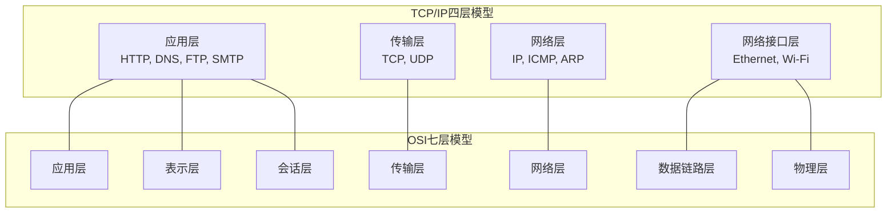
```mermaid
graph TB
    subgraph "TCP/IP四层模型"
        A["应用层<br/>HTTP, DNS, FTP, SMTP"]
        B["传输层<br/>TCP, UDP"]
        C["网络层<br/>IP, ICMP, ARP"]
        D["网络接口层<br/>Ethernet, Wi-Fi"]
    end
    
    subgraph "OSI七层模型"
        E["应用层"]
        F["表示层"]
        G["会话层"]
        H["传输层"]
        I["网络层"]
        J["数据链路层"]
        K["物理层"]
    end
    
    A --- E
    A --- F
    A --- G
    B --- H
    C --- I
    D --- J
    D --- K
```

### 数据封装与解封装

数据在发送方从上到下逐层封装，每一层都将上层传来的数据视为**载荷（Payload）**，在其前面添加本层的头部信息（部分层还会添加尾部信息），然后交给下一层处理。接收方则从下到上逐层解封装，每一层剥离本层头部后将载荷交给上层。

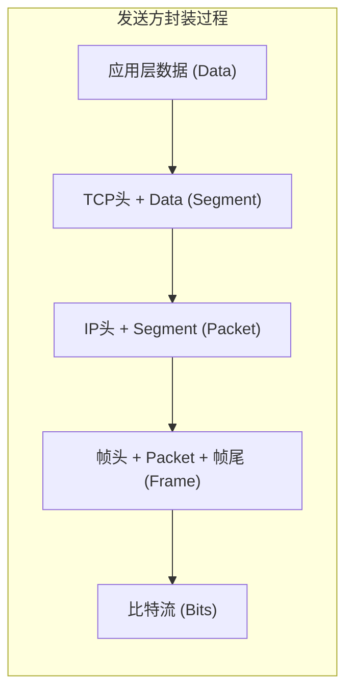
```mermaid
graph LR
    subgraph "发送方封装过程"
        direction TB
        A1["应用层数据 (Data)"] --> A2["TCP头 + Data (Segment)"]
        A2 --> A3["IP头 + Segment (Packet)"]
        A3 --> A4["帧头 + Packet + 帧尾 (Frame)"]
        A4 --> A5["比特流 (Bits)"]
    end
```

以一次 HTTP 请求为例，发送方的封装过程如下：

**1. 应用层 — 生成HTTP报文**

应用程序构造HTTP请求报文（请求行 + 请求头 + 请求体），作为原始数据交给传输层：

```
GET /index.html HTTP/1.1\r\n
Host: www.example.com\r\n
\r\n
```

**2. 传输层 — 封装为TCP段（Segment）**

传输层在应用层数据前添加**TCP首部**（20~60字节），包含源端口、目的端口、序列号、确认号、窗口大小等信息。如果应用层数据过大（超过MSS，通常为1460字节），会在这一层进行**分段**：

```
+------------------+-------------------------+
|    TCP首部(20B)   |    HTTP报文(应用层数据)    |
|  源端口 目的端口    |  GET /index.html ...    |
|  序列号 确认号      |                         |
|  窗口大小 校验和    |                         |
+------------------+-------------------------+
          ← TCP段（Segment）→
```

**3. 网络层 — 封装为IP数据包（Packet）**

网络层在TCP段前添加**IP首部**（20~60字节），包含源IP地址、目的IP地址、TTL、协议类型等信息。如果TCP段加上IP首部超过链路的MTU（通常为1500字节），会在这一层进行**分片**：

```
+------------------+------------------+-------------------+
|    IP首部(20B)    |    TCP首部(20B)   |    HTTP报文        |
|  源IP  目的IP     |  源端口 目的端口    |  GET /index ...   |
|  TTL  协议类型     |  序列号 确认号      |                   |
+------------------+------------------+-------------------+
                ← IP数据包（Packet）→
```

**4. 数据链路层 — 封装为帧（Frame）**

数据链路层在IP数据包前后分别添加**帧头**和**帧尾**。帧头包含源MAC地址、目的MAC地址和类型字段；帧尾包含FCS（帧校验序列）用于错误检测：

```
+------------------+------------------+--------+-----+-----------+
|    帧头(14B)      |    IP首部(20B)    | TCP首部 | HTTP |  帧尾(4B)  |
|  目的MAC  源MAC    |  源IP  目的IP     |  ...   | ...  |   FCS     |
|  类型(0x0800=IP)  |  TTL  协议类型     |        |      |  校验序列  |
+------------------+------------------+--------+-----+-----------+
                      ← 以太网帧（Frame）→
```

**5. 物理层 — 转换为比特流**

物理层将帧转换为电信号（有线）或电磁波（无线），通过物理介质传输到下一跳设备。

**接收方的解封装过程与之完全相反**：物理层将信号还原为帧 -> 数据链路层校验FCS并剥离帧头帧尾，取出IP数据包 -> 网络层校验并剥离IP首部，取出TCP段 -> 传输层校验并剥离TCP首部，重组数据交给应用层 -> 应用层解析HTTP报文。

这种分层封装/解封装机制的核心价值在于**各层独立演进**：应用层可以将HTTP换成gRPC，传输层可以将TCP换成UDP，网络层可以将IPv4换成IPv6，数据链路层可以将以太网换成Wi-Fi——只要每层的接口契约不变，其他层完全不受影响。

## TCP协议

### TCP概述

TCP（Transmission Control Protocol，传输控制协议）是一种**面向连接的、可靠的、基于字节流**的传输层协议。

TCP报文段的首部格式：

| 字段 | 大小 | 说明 |
|------|------|------|
| 源端口号 | 16位 | 发送方端口 |
| 目的端口号 | 16位 | 接收方端口 |
| 序号 (Sequence Number) | 32位 | 本报文段数据的第一个字节的编号 |
| 确认号 (Acknowledgment Number) | 32位 | 期望收到的下一个字节的编号 |
| 数据偏移 | 4位 | TCP首部长度（以4字节为单位） |
| 保留 | 6位 | 保留，置零 |
| 标志位 | 6位 | URG, ACK, PSH, RST, SYN, FIN |
| 窗口大小 | 16位 | 接收窗口大小，用于流量控制 |
| 校验和 | 16位 | 检验首部和数据 |
| 紧急指针 | 16位 | 紧急数据的末尾位置 |

### 三次握手

TCP建立连接需要三次握手（Three-Way Handshake），目的是**同步双方的序列号和确认号，并交换TCP窗口大小信息**。

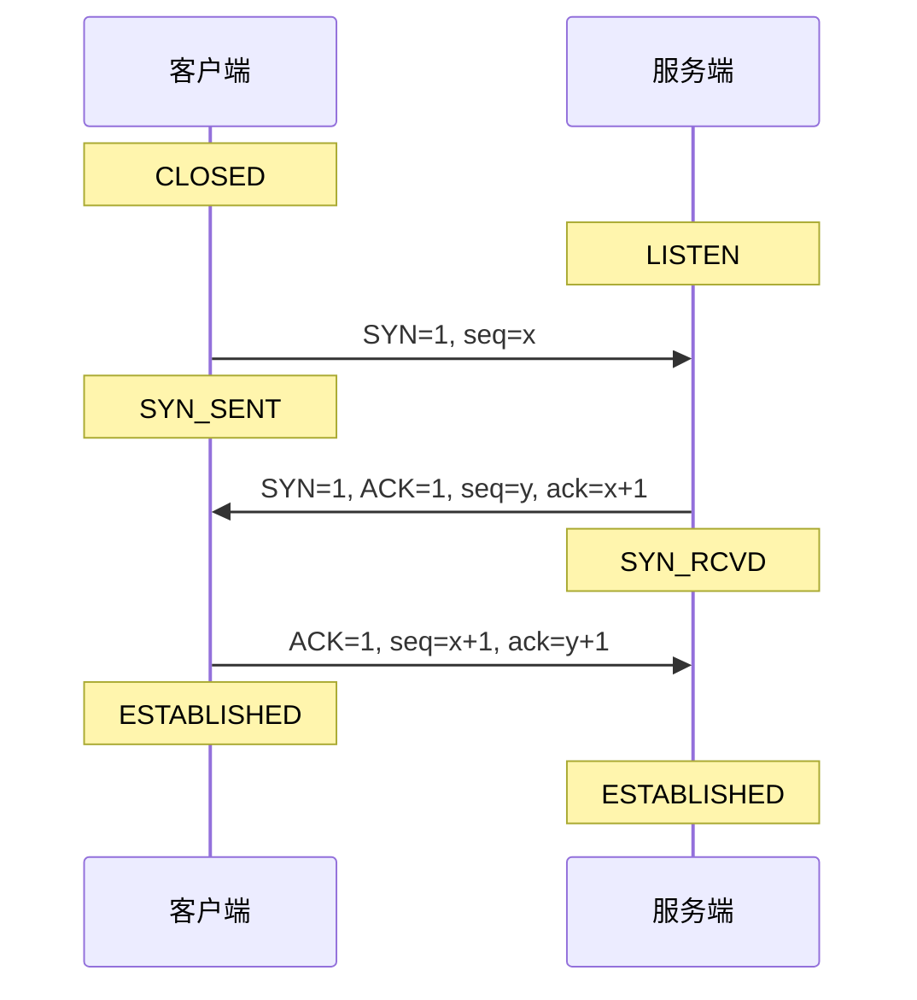
```mermaid
sequenceDiagram
    participant C as 客户端
    participant S as 服务端
    
    Note over C: CLOSED
    Note over S: LISTEN
    
    C->>S: SYN=1, seq=x
    Note over C: SYN_SENT
    
    S->>C: SYN=1, ACK=1, seq=y, ack=x+1
    Note over S: SYN_RCVD
    
    C->>S: ACK=1, seq=x+1, ack=y+1
    Note over C: ESTABLISHED
    Note over S: ESTABLISHED
```

**各步骤详解：**

1. **第一次握手**：客户端发送SYN报文（SYN=1, seq=x），进入SYN_SENT状态，等待服务端确认
2. **第二次握手**：服务端收到SYN后，发送SYN+ACK报文（SYN=1, ACK=1, seq=y, ack=x+1），进入SYN_RCVD状态
3. **第三次握手**：客户端收到SYN+ACK后，发送ACK报文（ACK=1, seq=x+1, ack=y+1），双方进入ESTABLISHED状态

**为什么需要三次握手而不是两次？**

两次握手存在的问题：假设客户端发送的一个SYN报文在网络中滞留，客户端超时后重发SYN并成功建立连接、传输数据、关闭连接。此后，滞留的SYN到达服务端，服务端误以为是新连接请求，返回SYN+ACK。如果只有两次握手，服务端就会直接进入ESTABLISHED状态，分配资源等待数据，但客户端并不会发送数据，造成资源浪费。三次握手中，客户端不会对这个过期的SYN+ACK进行确认，服务端收不到ACK就不会建立连接。

### 四次挥手

TCP断开连接需要四次挥手（Four-Way Handshake），因为TCP是全双工的，每个方向都需要单独关闭。

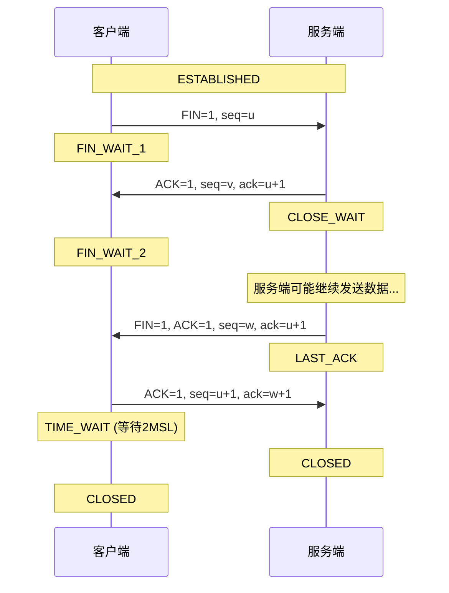
```mermaid
sequenceDiagram
    participant C as 客户端
    participant S as 服务端
    
    Note over C,S: ESTABLISHED
    
    C->>S: FIN=1, seq=u
    Note over C: FIN_WAIT_1
    
    S->>C: ACK=1, seq=v, ack=u+1
    Note over S: CLOSE_WAIT
    Note over C: FIN_WAIT_2
    
    Note over S: 服务端可能继续发送数据...
    
    S->>C: FIN=1, ACK=1, seq=w, ack=u+1
    Note over S: LAST_ACK
    
    C->>S: ACK=1, seq=u+1, ack=w+1
    Note over C: TIME_WAIT (等待2MSL)
    Note over S: CLOSED
    
    Note over C: CLOSED
```

**各步骤详解：**

1. **第一次挥手**：客户端发送FIN报文，表示不再发送数据，进入FIN_WAIT_1
2. **第二次挥手**：服务端收到FIN，回复ACK，进入CLOSE_WAIT。此时服务端可能仍有数据要发送
3. **第三次挥手**：服务端数据发送完毕，发送FIN报文，进入LAST_ACK
4. **第四次挥手**：客户端收到FIN，回复ACK，进入TIME_WAIT状态，等待2MSL（Maximum Segment Lifetime，最大报文段生存时间）后关闭

**为什么需要TIME_WAIT等待2MSL？**

- **确保最后的ACK到达服务端**：如果ACK丢失，服务端会重发FIN，客户端需要在TIME_WAIT期间内能重新发送ACK
- **让旧连接的报文在网络中消失**：防止旧连接中残留的报文干扰新连接

### TCP可靠传输机制

TCP通过多种机制保证数据的可靠传输：

#### 1. 序列号与确认应答

每个字节都有唯一的序列号，接收方通过ACK确认已接收到的数据。发送方如果在超时时间内未收到ACK，就会重传数据。

#### 2. 滑动窗口

滑动窗口机制实现了流量控制和高效传输：

```
发送窗口示意图：

已发送已确认 | 已发送未确认  |  可发送未发送  | 不可发送
-----------+-------------+-------------+---------
   ...     |  seq=100    |  seq=200    |  seq=300
           |  seq=150    |  seq=250    |   ...
           |-------------------------------|
           |<---------- 发送窗口 ---------->|
```

- 窗口大小由接收方通过TCP头部的**窗口大小**字段通告
- 发送方根据窗口大小控制发送速率，避免接收方缓冲区溢出
- 窗口会随着ACK的到来向右滑动

#### 3. 拥塞控制

TCP拥塞控制防止过多数据注入网络导致网络拥塞，主要包含四个算法：

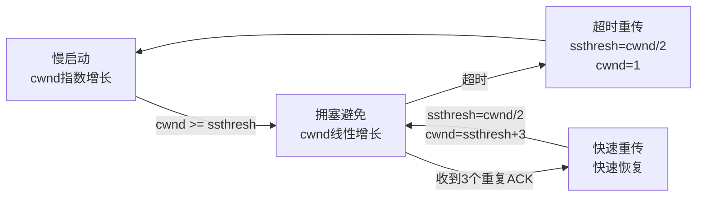
```mermaid
graph LR
    A["慢启动<br/>cwnd指数增长"] -->|cwnd >= ssthresh| B["拥塞避免<br/>cwnd线性增长"]
    B -->|超时| C["超时重传<br/>ssthresh=cwnd/2<br/>cwnd=1"]
    B -->|收到3个重复ACK| D["快速重传<br/>快速恢复"]
    C --> A
    D -->|"ssthresh=cwnd/2<br/>cwnd=ssthresh+3"| B
```

- **慢启动（Slow Start）**：连接建立初期，拥塞窗口（cwnd）从1个MSS开始，每收到一个ACK就将cwnd翻倍（指数增长）
- **拥塞避免（Congestion Avoidance）**：当cwnd达到慢启动阈值（ssthresh）后，每个RTT将cwnd增加1个MSS（线性增长）
- **快速重传（Fast Retransmit）**：收到3个重复ACK时，立即重传丢失的报文段，而不用等待超时
- **快速恢复（Fast Recovery）**：快速重传后，将ssthresh设为cwnd的一半，cwnd设为ssthresh+3，直接进入拥塞避免阶段

### TCP与UDP对比

| 特性 | TCP | UDP |
|------|-----|-----|
| 连接方式 | 面向连接 | 无连接 |
| 可靠性 | 可靠传输（确认、重传、排序） | 不可靠传输 |
| 传输方式 | 字节流 | 数据报 |
| 传输效率 | 较低（开销大） | 较高（开销小） |
| 首部大小 | 20-60字节 | 8字节 |
| 流量控制 | 有（滑动窗口） | 无 |
| 拥塞控制 | 有 | 无 |
| 连接模式 | 一对一 | 一对一、一对多、多对多 |
| 适用场景 | 文件传输、网页浏览、邮件 | 视频流、DNS查询、游戏 |

## HTTP协议

### HTTP概述

HTTP（HyperText Transfer Protocol，超文本传输协议）是应用层协议，基于TCP，采用请求-响应模型。

#### HTTP请求报文

```
GET /api/user?id=123 HTTP/1.1       ← 请求行（方法 URI 版本）
Host: www.example.com               ← 请求头
Content-Type: application/json
Accept: application/json
Authorization: Bearer token123
                                     ← 空行
{"name": "test"}                     ← 请求体（GET通常没有）
```

#### HTTP响应报文

```
HTTP/1.1 200 OK                      ← 状态行（版本 状态码 原因短语）
Content-Type: application/json       ← 响应头
Content-Length: 27
Cache-Control: max-age=3600
                                     ← 空行
{"id": 123, "name": "test"}         ← 响应体
```

### HTTP方法

| 方法 | 描述 | 幂等性 | 安全性 |
|------|------|--------|--------|
| GET | 获取资源 | 是 | 是 |
| POST | 创建资源/提交数据 | 否 | 否 |
| PUT | 替换/更新资源 | 是 | 否 |
| DELETE | 删除资源 | 是 | 否 |
| PATCH | 部分更新资源 | 否 | 否 |
| HEAD | 获取响应头（不含响应体） | 是 | 是 |
| OPTIONS | 获取服务器支持的方法 | 是 | 是 |

**幂等性**：同一请求执行多次，效果与执行一次相同。

**GET与POST的区别：**

| 对比项 | GET | POST |
|--------|-----|------|
| 参数位置 | URL的Query String中 | 请求体中 |
| 参数长度 | 受URL长度限制（浏览器限制，非协议限制） | 无限制 |
| 缓存 | 可被缓存 | 一般不被缓存 |
| 幂等性 | 幂等 | 非幂等 |
| 编码方式 | URL编码 | 支持多种编码 |
| 浏览器历史 | 参数保留在历史记录中 | 不保留 |
| TCP数据包 | 1个（header和data一起发送） | 可能2个（先发header，收到100 Continue后再发data） |

### HTTP状态码

| 分类 | 描述 | 常见状态码 |
|------|------|-----------|
| 1xx | 信息性 | 100 Continue, 101 Switching Protocols |
| 2xx | 成功 | 200 OK, 201 Created, 204 No Content |
| 3xx | 重定向 | 301 Moved Permanently, 302 Found, 304 Not Modified |
| 4xx | 客户端错误 | 400 Bad Request, 401 Unauthorized, 403 Forbidden, 404 Not Found |
| 5xx | 服务器错误 | 500 Internal Server Error, 502 Bad Gateway, 503 Service Unavailable |

重点区分：

- **301 vs 302**：301是永久重定向，浏览器会缓存新地址；302是临时重定向，下次仍访问原地址
- **401 vs 403**：401是未认证（需要登录）；403是已认证但无权限
- **502 vs 504**：502是网关收到了上游的无效响应；504是网关等待上游超时

### HTTP版本演进

#### HTTP/1.0

每个请求都需要新建一个TCP连接，请求完毕后立即断开。这带来了大量连接建立和断开的开销。

#### HTTP/1.1

- **持久连接（Keep-Alive）**：默认复用TCP连接，通过`Connection: keep-alive`头部控制
- **管道化（Pipelining）**：允许在一个TCP连接上连续发送多个请求，不需要等待上一个响应。但响应必须按请求顺序返回，存在**队头阻塞（Head-of-Line Blocking）** 问题
- **分块传输编码**：`Transfer-Encoding: chunked`，服务端可以边生成边发送数据
- **Host头部**：支持虚拟主机，一个IP可以托管多个域名

#### HTTP/2

- **二进制分帧层**：将HTTP消息分割为更小的帧（Frame），帧是HTTP/2通信的最小单位
- **多路复用（Multiplexing）**：在一个TCP连接上可以并行交错发送多个请求和响应，彻底解决了HTTP层的队头阻塞
- **头部压缩（HPACK）**：使用静态表、动态表和Huffman编码压缩请求头，减少冗余传输
- **服务器推送（Server Push）**：服务端可以主动推送资源给客户端
- **流优先级**：客户端可以指定请求的优先级，服务端根据优先级分配资源

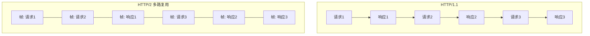
```mermaid
graph TB
    subgraph "HTTP/1.1"
        direction LR
        A1["请求1"] --> B1["响应1"]
        B1 --> A2["请求2"]
        A2 --> B2["响应2"]
        B2 --> A3["请求3"]
        A3 --> B3["响应3"]
    end
    
    subgraph "HTTP/2 多路复用"
        direction LR
        C1["帧: 请求1"]
        C2["帧: 请求2"]
        C3["帧: 响应1"]
        C4["帧: 请求3"]
        C5["帧: 响应2"]
        C6["帧: 响应3"]
        C1 --- C2 --- C3 --- C4 --- C5 --- C6
    end
```

#### HTTP/3

HTTP/3使用QUIC协议替代TCP作为传输层协议：

- **基于UDP**：QUIC运行在UDP之上，避免了TCP的队头阻塞（TCP层丢包会阻塞所有流）
- **内置TLS 1.3**：加密默认开启，握手时间更短
- **0-RTT连接建立**：对于已知服务器，可以在第一个数据包中就携带应用数据
- **连接迁移**：使用Connection ID标识连接而非四元组（源IP、源端口、目的IP、目的端口），网络切换（如Wi-Fi切换到蜂窝网络）时无需重新建立连接

### HTTP断点续传

断点续传是指在文件下载/上传过程中，如果因网络中断或用户暂停而停止传输，恢复时能够从中断的位置继续传输，而不需要重新开始。该机制基于HTTP/1.1引入的**范围请求（Range Request）** 实现。

#### 核心HTTP头部

| 头部 | 方向 | 说明 |
|------|------|------|
| `Range` | 请求 | 指定请求资源的字节范围，如 `Range: bytes=1024-2047` |
| `Content-Range` | 响应 | 返回内容在整个资源中的位置，如 `Content-Range: bytes 1024-2047/10240` |
| `Accept-Ranges` | 响应 | 服务端声明是否支持范围请求，值为 `bytes` 或 `none` |
| `ETag` | 响应 | 资源的唯一标识，用于验证资源是否在中断期间被修改 |
| `If-Range` | 请求 | 携带ETag或Last-Modified，条件性发起范围请求 |

#### 断点续传流程

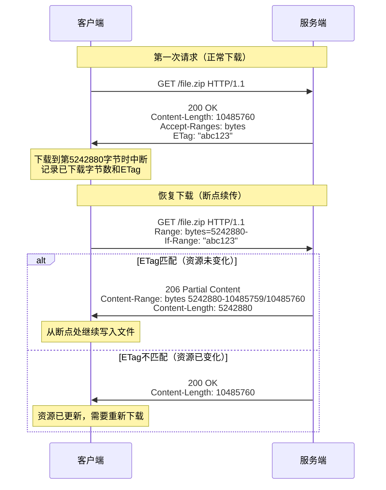
```mermaid
sequenceDiagram
    participant C as 客户端
    participant S as 服务端
    
    Note over C,S: 第一次请求（正常下载）
    C->>S: GET /file.zip HTTP/1.1
    S->>C: 200 OK<br/>Content-Length: 10485760<br/>Accept-Ranges: bytes<br/>ETag: "abc123"
    Note over C: 下载到第5242880字节时中断<br/>记录已下载字节数和ETag
    
    Note over C,S: 恢复下载（断点续传）
    C->>S: GET /file.zip HTTP/1.1<br/>Range: bytes=5242880-<br/>If-Range: "abc123"
    
    alt ETag匹配（资源未变化）
        S->>C: 206 Partial Content<br/>Content-Range: bytes 5242880-10485759/10485760<br/>Content-Length: 5242880
        Note over C: 从断点处继续写入文件
    else ETag不匹配（资源已变化）
        S->>C: 200 OK<br/>Content-Length: 10485760
        Note over C: 资源已更新，需要重新下载
    end
```

关键状态码：

- **206 Partial Content**：服务端成功处理了范围请求，返回指定范围的数据
- **200 OK**：服务端忽略了Range头（不支持或资源已变更），返回完整资源
- **416 Range Not Satisfiable**：请求的范围超出资源大小

#### 大文件分片上传

断点续传的思想同样适用于大文件上传。将文件切分为固定大小的分片，逐片上传，每片上传成功后记录进度，中断后从未完成的分片继续：

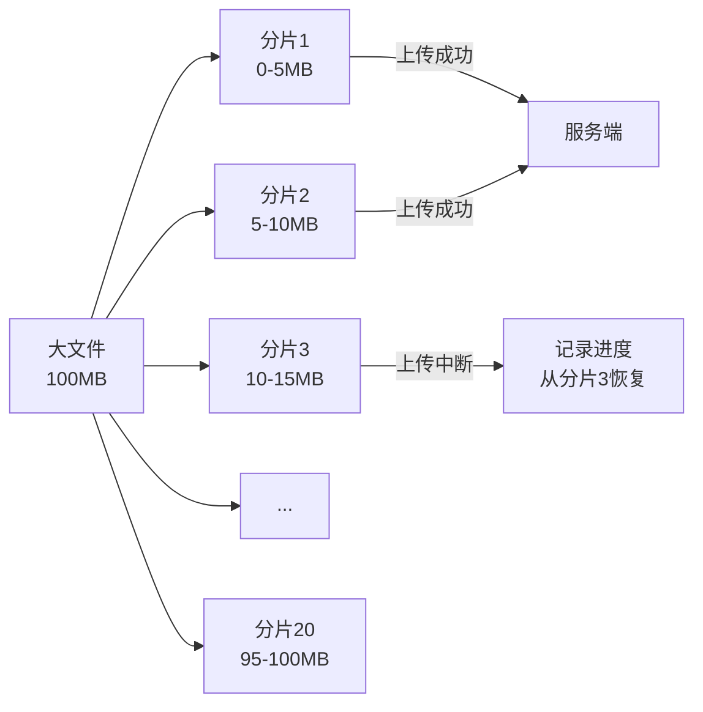
```mermaid
graph LR
    A["大文件<br/>100MB"] --> B["分片1<br/>0-5MB"]
    A --> C["分片2<br/>5-10MB"]
    A --> D["分片3<br/>10-15MB"]
    A --> E["..."]
    A --> F["分片20<br/>95-100MB"]
    
    B -->|上传成功| G["服务端"]
    C -->|上传成功| G
    D -->|上传中断| H["记录进度<br/>从分片3恢复"]
```

分片上传的一般流程：

1. **计算文件MD5/SHA**：作为文件唯一标识，用于服务端校验和秒传判断
2. **请求上传初始化**：向服务端申请上传任务，服务端返回已接收的分片列表（用于断点恢复）
3. **分片上传**：跳过已上传的分片，从第一个未完成的分片开始上传
4. **合并请求**：所有分片上传完成后，通知服务端合并文件

## RPC

### RPC概述

RPC（Remote Procedure Call，远程过程调用）是一种进程间通信方式，允许程序像调用本地函数一样调用远端服务器上的函数，网络通信细节对调用方透明。

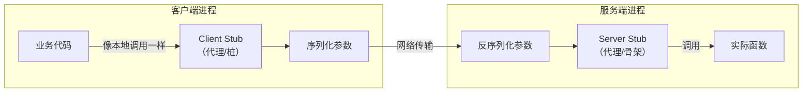
```mermaid
graph LR
    subgraph "客户端进程"
        A["业务代码"] -->|"像本地调用一样"| B["Client Stub<br/>（代理/桩）"]
        B --> C["序列化参数"]
    end
    
    C -->|网络传输| D["反序列化参数"]
    
    subgraph "服务端进程"
        D --> E["Server Stub<br/>（代理/骨架）"]
        E -->|调用| F["实际函数"]
    end
```

**RPC调用流程：**

1. 客户端调用 Client Stub（本地代理），就像调用本地方法一样
2. Client Stub 将方法名和参数**序列化**（编码）为二进制或文本数据
3. 通过网络将数据发送到服务端
4. 服务端 Server Stub 将数据**反序列化**（解码）为方法名和参数
5. Server Stub 调用服务端的实际函数，获取返回值
6. 返回值按相同路径原路返回给客户端

### REST vs RPC

REST 和 RPC 是两种主流的远程通信范式，设计理念有本质区别：

| 对比项 | REST | RPC |
|--------|------|-----|
| 核心抽象 | **资源**（名词）：对资源做CRUD | **动作**（动词）：调用远程函数 |
| API风格 | `GET /users/123` | `getUser(123)` |
| 协议 | 基于HTTP语义（方法、状态码、URI） | 协议无关（可基于HTTP、TCP、UDP） |
| 数据格式 | 通常JSON/XML（文本） | 二进制（Protobuf等）或文本（JSON） |
| 耦合度 | 松耦合（客户端只需知道资源URL） | 紧耦合（客户端需要知道函数签名） |
| 可读性 | 好（HTTP语义自解释） | 依赖文档 |
| 性能 | 一般（HTTP头部开销、文本序列化） | 高（二进制序列化、长连接复用） |
| 适用场景 | 公开API、Web服务、CRUD | 内部微服务通信、高性能场景 |

**选择建议：**

- **对外暴露的公开API**：REST，因为通用性强，客户端（浏览器、移动端、第三方）无需特殊SDK即可调用
- **内部微服务之间的通信**：RPC，因为性能高、类型安全、接口定义严格

### 常见RPC框架

| 框架 | 开发方 | 序列化格式 | 传输协议 | 语言支持 | 特点 |
|------|--------|-----------|----------|----------|------|
| gRPC | Google | Protobuf | HTTP/2 | 多语言 | 高性能、强类型、流式支持 |
| Thrift | Facebook/Apache | Thrift二进制 | TCP | 多语言 | 灵活的序列化和传输层 |
| Dubbo | 阿里巴巴 | Hessian/Protobuf | TCP | Java为主 | Java生态成熟、服务治理完善 |
| JSON-RPC | 社区标准 | JSON | HTTP/TCP | 多语言 | 简单轻量 |

### gRPC

gRPC 是当前最主流的 RPC 框架，由 Google 开发并开源，基于 HTTP/2 和 Protocol Buffers（Protobuf）。

#### 核心特性

- **基于HTTP/2**：天然支持多路复用、头部压缩、双向流
- **Protocol Buffers**：高效的二进制序列化格式，体积小、解析快、强类型
- **IDL定义接口**：通过 `.proto` 文件定义服务接口和消息结构，由工具自动生成各语言的客户端和服务端代码
- **四种通信模式**：覆盖所有交互场景

#### Proto文件示例

```protobuf
syntax = "proto3";

package user;

service UserService {
  rpc GetUser (GetUserRequest) returns (UserResponse);             // 一元RPC
  rpc ListUsers (ListUsersRequest) returns (stream UserResponse);  // 服务端流
  rpc UploadLogs (stream LogEntry) returns (UploadResult);         // 客户端流
  rpc Chat (stream ChatMessage) returns (stream ChatMessage);      // 双向流
}

message GetUserRequest {
  int64 user_id = 1;
}

message UserResponse {
  int64 user_id = 1;
  string name = 2;
  string email = 3;
}
```

#### 四种通信模式

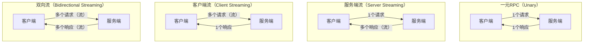
```mermaid
graph TB
    subgraph "一元RPC（Unary）"
        direction LR
        A1["客户端"] -->|1个请求| B1["服务端"]
        B1 -->|1个响应| A1
    end
    
    subgraph "服务端流（Server Streaming）"
        direction LR
        A2["客户端"] -->|1个请求| B2["服务端"]
        B2 -->|多个响应（流）| A2
    end
    
    subgraph "客户端流（Client Streaming）"
        direction LR
        A3["客户端"] -->|多个请求（流）| B3["服务端"]
        B3 -->|1个响应| A3
    end
    
    subgraph "双向流（Bidirectional Streaming）"
        direction LR
        A4["客户端"] -->|多个请求（流）| B4["服务端"]
        B4 -->|多个响应（流）| A4
    end
```

| 模式 | 描述 | 典型场景 |
|------|------|----------|
| 一元 RPC | 请求-响应，与普通函数调用一致 | 查询用户信息、提交表单 |
| 服务端流 | 客户端发一个请求，服务端返回一个流 | AI流式生成、大量数据分批返回 |
| 客户端流 | 客户端发送一个流，服务端返回一个响应 | 文件上传、日志批量上报 |
| 双向流 | 双方都可以随时发送流数据 | 即时通讯、实时协同 |

#### Protobuf序列化原理

Protobuf 的高性能来自其紧凑的二进制编码：

| 特性 | JSON | Protobuf |
|------|------|----------|
| 格式 | 文本（人类可读） | 二进制（机器友好） |
| 字段标识 | 字段名字符串（如 `"name"`） | 字段编号（如 `1`, `2`, `3`） |
| 类型信息 | 无（弱类型） | 内置类型系统（强类型） |
| 体积 | 大（冗余的键名和引号） | 小（通常为JSON的30%~50%） |
| 解析速度 | 慢（文本解析） | 快（直接读取二进制偏移） |
| 可读性 | 好 | 差（需要Proto文件才能解码） |

Protobuf编码采用 **Tag-Length-Value（TLV）** 结构：

```
字段编号 << 3 | wire_type  |  [长度]  |  值
         Tag（Varint）      Length    Value
```

- **Tag**：包含字段编号和 wire type（标识值的编码方式）
- **Varint编码**：对整数使用变长编码，小整数占更少字节（如值为1只占1字节，而JSON的 `"user_id": 1` 占14字节）
- **不传输字段名**：用编号代替字段名，`name=2` 编码时只传数字2而非字符串 `"name"`

#### gRPC vs REST 性能对比

```
同一份用户数据的传输体积对比：

JSON (REST):
{"user_id":123,"name":"Alice","email":"alice@example.com","age":28}
→ 68字节

Protobuf (gRPC):
08 7B 12 05 41 6C 69 63 65 1A 11 61 6C 69 63 65 40 ...
→ 约30字节（不到JSON的一半）
```

加上 HTTP/2 的头部压缩和连接复用，gRPC 在微服务间的通信性能通常是 REST 的 2~10 倍。

### JSON-RPC

JSON-RPC 是一种轻量级的 RPC 协议，使用 JSON 作为数据格式。它非常简单——整个规范只有几页，核心就是约定了请求和响应的 JSON 结构。MCP 协议的消息格式就是基于 JSON-RPC 2.0。

#### 请求格式

```json
{
  "jsonrpc": "2.0",
  "method": "getUser",
  "params": {"user_id": 123},
  "id": 1
}
```

#### 响应格式

```json
// 成功
{
  "jsonrpc": "2.0",
  "result": {"user_id": 123, "name": "Alice"},
  "id": 1
}

// 失败
{
  "jsonrpc": "2.0",
  "error": {"code": -32601, "message": "Method not found"},
  "id": 1
}
```

#### 通知（无需响应）

```json
{
  "jsonrpc": "2.0",
  "method": "log",
  "params": {"level": "info", "message": "something happened"}
}
```

当请求中没有 `id` 字段时，表示这是一个通知，服务端不需要返回响应。

JSON-RPC 与 REST 的关键区别在于：REST 是面向资源的，不同操作用不同的 HTTP 方法（GET/POST/PUT/DELETE）和 URL 路径区分；JSON-RPC 是面向动作的，所有请求都 POST 到同一个端点，用 `method` 字段区分操作。

## HTTPS

### HTTPS概述

HTTPS = HTTP + TLS/SSL，在HTTP与TCP之间增加了TLS（Transport Layer Security）加密层，确保数据传输的安全性。

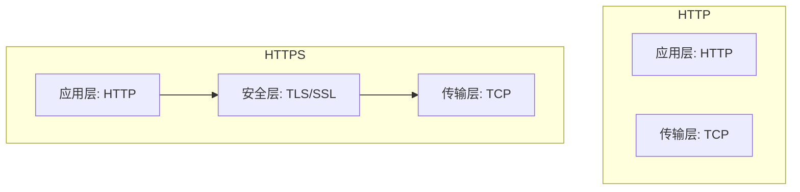
```mermaid
graph TB
    subgraph "HTTP"
        A["应用层: HTTP"]
        B["传输层: TCP"]
    end
    
    subgraph "HTTPS"
        C["应用层: HTTP"]
        D["安全层: TLS/SSL"]
        E["传输层: TCP"]
        C --> D --> E
    end
```

### 加密方式

HTTPS综合使用了三种加密方式：

| 加密方式 | 算法举例 | 用途 | 特点 |
|----------|----------|------|------|
| 对称加密 | AES, ChaCha20 | 加密传输数据 | 速度快，双方使用相同密钥 |
| 非对称加密 | RSA, ECDHE | 密钥交换 | 速度慢，公钥加密私钥解密 |
| 哈希算法 | SHA-256 | 数据完整性校验 | 不可逆，用于数字签名 |

### TLS 1.2握手过程

TLS 1.2握手需要 **2个RTT** 才能完成，整个过程分为四个阶段。以最常用的 ECDHE 密钥交换为例：

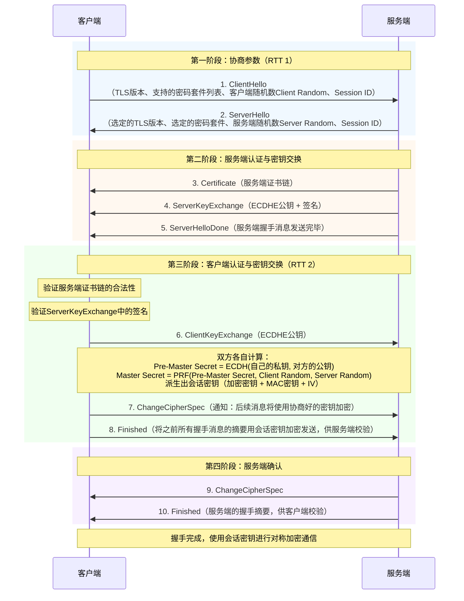
```mermaid
sequenceDiagram
    participant C as 客户端
    participant S as 服务端
    
    rect rgb(240, 248, 255)
    Note over C,S: 第一阶段：协商参数（RTT 1）
    C->>S: 1. ClientHello<br/>（TLS版本、支持的密码套件列表、客户端随机数Client Random、Session ID）
    S->>C: 2. ServerHello<br/>（选定的TLS版本、选定的密码套件、服务端随机数Server Random、Session ID）
    end
    
    rect rgb(255, 248, 240)
    Note over C,S: 第二阶段：服务端认证与密钥交换
    S->>C: 3. Certificate（服务端证书链）
    S->>C: 4. ServerKeyExchange（ECDHE公钥 + 签名）
    S->>C: 5. ServerHelloDone（服务端握手消息发送完毕）
    end
    
    rect rgb(240, 255, 240)
    Note over C,S: 第三阶段：客户端认证与密钥交换（RTT 2）
    Note over C: 验证服务端证书链的合法性
    Note over C: 验证ServerKeyExchange中的签名
    C->>S: 6. ClientKeyExchange（ECDHE公钥）
    Note over C,S: 双方各自计算：<br/>Pre-Master Secret = ECDH(自己的私钥, 对方的公钥)<br/>Master Secret = PRF(Pre-Master Secret, Client Random, Server Random)<br/>派生出会话密钥（加密密钥 + MAC密钥 + IV）
    C->>S: 7. ChangeCipherSpec（通知：后续消息将使用协商好的密钥加密）
    C->>S: 8. Finished（将之前所有握手消息的摘要用会话密钥加密发送，供服务端校验）
    end
    
    rect rgb(248, 240, 255)
    Note over C,S: 第四阶段：服务端确认
    S->>C: 9. ChangeCipherSpec
    S->>C: 10. Finished（服务端的握手摘要，供客户端校验）
    end
    
    Note over C,S: 握手完成，使用会话密钥进行对称加密通信
```

**各步骤详解：**

**1. ClientHello — 客户端发起握手**

客户端发送支持的能力参数，供服务端选择：

| 字段 | 说明 |
|------|------|
| Version | 客户端支持的最高TLS版本（如 TLS 1.2） |
| Client Random | 32字节随机数，参与后续密钥生成 |
| Session ID | 用于会话恢复，首次连接为空 |
| Cipher Suites | 支持的密码套件列表，按优先级排序 |
| Compression Methods | 支持的压缩算法（TLS 1.3已废弃压缩） |
| Extensions | 扩展字段，如 SNI（Server Name Indication）、supported_groups 等 |

密码套件的命名格式如 `TLS_ECDHE_RSA_WITH_AES_128_GCM_SHA256`，含义为：

```
TLS_ECDHE_RSA_WITH_AES_128_GCM_SHA256
     |     |        |    |    |    |
     |     |        |    |    |    └── PRF使用的哈希算法
     |     |        |    |    └─────── AEAD模式
     |     |        |    └──────────── 对称加密密钥长度
     |     |        └───────────────── 对称加密算法
     |     └────────────────────────── 签名/认证算法
     └──────────────────────────────── 密钥交换算法
```

**2. ServerHello — 服务端选定参数**

服务端从 ClientHello 提供的列表中选定双方都支持的最优参数组合，返回选定的TLS版本、密码套件和服务端随机数（Server Random）。

**3. Certificate — 发送证书链**

服务端将自己的数字证书链（服务端证书 + 中间CA证书）发送给客户端。证书中包含服务端的公钥（RSA或ECDSA公钥），后续用于验证 ServerKeyExchange 中的签名。

**4. ServerKeyExchange — 密钥交换参数**

服务端生成临时的 ECDHE 密钥对（每次握手生成新的），将 ECDHE 公钥和椭圆曲线参数发送给客户端。同时用自己的RSA/ECDSA私钥对这些参数做签名，防止被中间人篡改。

这一步是**前向保密**的关键——即使服务端的长期私钥将来被泄露，攻击者也无法还原这次会话的临时 ECDHE 私钥，因此无法解密历史通信。

如果使用的是 RSA 密钥交换（非 ECDHE），则不需要 ServerKeyExchange 步骤——客户端直接用证书中的 RSA 公钥加密 Pre-Master Secret。但 RSA 密钥交换不具备前向保密性，TLS 1.3 已将其移除。

**5. ServerHelloDone — 服务端握手消息发送完毕**

通知客户端，服务端的握手参数已全部发送完毕，客户端可以开始处理。

**6. ClientKeyExchange — 客户端密钥交换参数**

客户端验证完服务端证书后，同样生成临时的 ECDHE 密钥对，将 ECDHE 公钥发送给服务端。

此时双方都拥有了对方的 ECDHE 公钥和自己的 ECDHE 私钥，各自独立计算出相同的 **Pre-Master Secret**（ECDH 算法的数学特性保证了这一点）。

**7-8. ChangeCipherSpec + Finished — 客户端切换加密**

密钥派生过程如下：

```
Pre-Master Secret（ECDHE协商）
        ↓
Master Secret = PRF(Pre-Master Secret, "master secret", Client Random + Server Random)
        ↓ 继续用PRF展开
+-------------------+-------------------+-------------------+
| client_write_key  | server_write_key  | client_write_IV   |
| (客户端加密密钥)    | (服务端加密密钥)    | (客户端初始向量)    |
+-------------------+-------------------+-------------------+
| server_write_IV   | client_write_MAC  | server_write_MAC  |
| (服务端初始向量)    | (客户端MAC密钥)    | (服务端MAC密钥)    |
+-------------------+-------------------+-------------------+
```

客户端发送 ChangeCipherSpec 通知服务端"从现在起我用会话密钥加密"，随后发送 Finished 消息——将之前所有握手消息的哈希摘要用刚生成的会话密钥加密发送。服务端解密并验证摘要，确认双方生成的密钥一致且握手过程未被篡改。

**9-10. ChangeCipherSpec + Finished — 服务端切换加密**

服务端也发送 ChangeCipherSpec 和 Finished，双方互相验证通过后，握手完成。

#### TLS 1.2 会话恢复

完整握手需要 2-RTT，开销较大。TLS 1.2 提供了两种会话恢复机制，可在后续连接中将握手缩短为 **1-RTT**：

**Session ID 恢复**：首次握手完成后，服务端将会话状态（主密钥等）缓存在内存中，并通过 Session ID 标识。客户端再次连接时在 ClientHello 中携带 Session ID，服务端查找到缓存后跳过证书验证和密钥交换，直接用已有的主密钥派生新的会话密钥。缺点是服务端需要维护大量会话状态，且在多服务器负载均衡场景下需要共享会话缓存。

**Session Ticket 恢复**：服务端将会话状态加密后作为 Ticket 发送给客户端保存，服务端本身不需要存储任何状态。客户端再次连接时在 ClientHello 的扩展中携带 Ticket，服务端解密后恢复会话。这种方式解决了服务端存储压力的问题，但 Ticket 加密密钥的安全管理是关键。

### TLS 1.3握手过程

TLS 1.3 对握手流程进行了大幅简化，将完整握手从 **2-RTT 缩短到 1-RTT**，并支持 **0-RTT** 恢复连接。

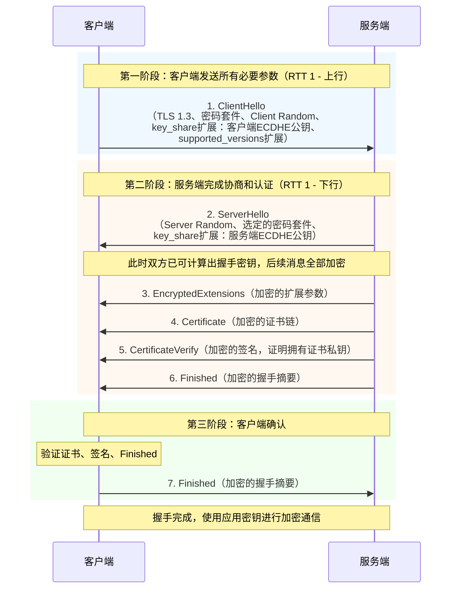
```mermaid
sequenceDiagram
    participant C as 客户端
    participant S as 服务端
    
    rect rgb(240, 248, 255)
    Note over C,S: 第一阶段：客户端发送所有必要参数（RTT 1 - 上行）
    C->>S: 1. ClientHello<br/>（TLS 1.3、密码套件、Client Random、<br/>key_share扩展：客户端ECDHE公钥、<br/>supported_versions扩展）
    end
    
    rect rgb(255, 248, 240)
    Note over C,S: 第二阶段：服务端完成协商和认证（RTT 1 - 下行）
    S->>C: 2. ServerHello<br/>（Server Random、选定的密码套件、<br/>key_share扩展：服务端ECDHE公钥）
    Note over C,S: 此时双方已可计算出握手密钥，后续消息全部加密
    S->>C: 3. EncryptedExtensions（加密的扩展参数）
    S->>C: 4. Certificate（加密的证书链）
    S->>C: 5. CertificateVerify（加密的签名，证明拥有证书私钥）
    S->>C: 6. Finished（加密的握手摘要）
    end
    
    rect rgb(240, 255, 240)
    Note over C,S: 第三阶段：客户端确认
    Note over C: 验证证书、签名、Finished
    C->>S: 7. Finished（加密的握手摘要）
    end
    
    Note over C,S: 握手完成，使用应用密钥进行加密通信
```

**TLS 1.3 握手为什么只需要 1-RTT？**

核心改进在于：客户端在 ClientHello 中就直接发送了 ECDHE 公钥（通过 `key_share` 扩展），而不是等到服务端回复后才发送。这意味着服务端收到 ClientHello 后就可以立即计算出共享密钥，并在同一个 RTT 的回程中完成密钥交换、发送证书和验证——将原来需要两个来回的工作压缩到了一个来回。

```
TLS 1.2（2-RTT）：
客户端 ──ClientHello──────────────→ 服务端      ┐
客户端 ←──ServerHello+证书+DH参数── 服务端      ┤ RTT 1
客户端 ──ClientKeyExchange+Finished→ 服务端      ┐
客户端 ←──Finished──────────────── 服务端      ┤ RTT 2
客户端 ──应用数据──────────────────→ 服务端

TLS 1.3（1-RTT）：
客户端 ──ClientHello+key_share────→ 服务端      ┐
客户端 ←──ServerHello+证书+Finished─ 服务端      ┤ RTT 1
客户端 ──Finished+应用数据─────────→ 服务端
```

**TLS 1.3 密钥派生体系（HKDF）：**

TLS 1.3 使用 **HKDF（HMAC-based Key Derivation Function）** 替代了 TLS 1.2 的 PRF，密钥派生更加规范和安全：

```
ECDHE协商 → 共享密钥
              ↓ HKDF-Extract
         Early Secret（用于0-RTT）
              ↓ Derive-Secret
         Handshake Secret（用于加密握手消息）
              ↓ Derive-Secret
         Master Secret（用于派生应用数据密钥）
              ↓ Derive-Secret
         +--------------------+--------------------+
         | client_app_key     | server_app_key     |
         | (客户端应用加密密钥)  | (服务端应用加密密钥)  |
         +--------------------+--------------------+
```

与 TLS 1.2 不同，TLS 1.3 从 ServerHello 之后的所有握手消息都已加密传输（使用 Handshake Secret 派生的密钥），窃听者甚至无法看到服务端的证书内容，进一步提升了隐私性。

#### TLS 1.3 的 0-RTT 恢复

对于之前已经成功握手过的服务器，TLS 1.3 支持 **0-RTT（Early Data）**——客户端可以在第一个握手消息中就携带应用数据，无需等待握手完成：

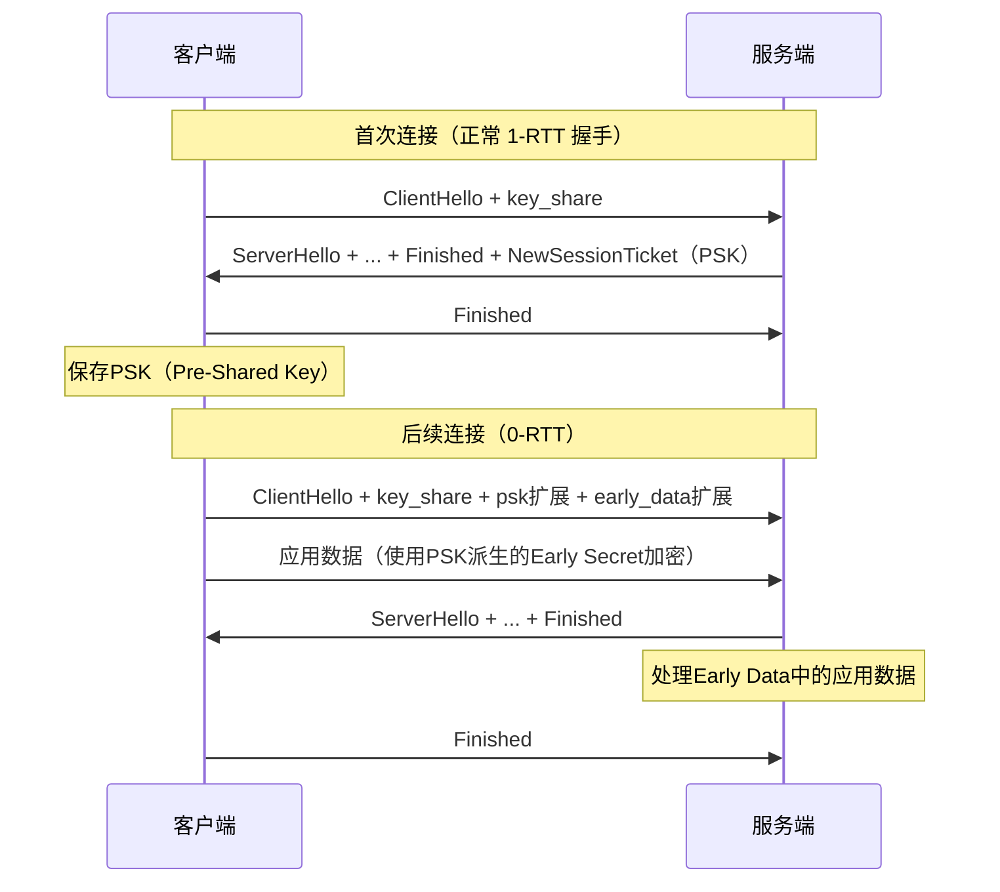
```mermaid
sequenceDiagram
    participant C as 客户端
    participant S as 服务端
    
    Note over C,S: 首次连接（正常 1-RTT 握手）
    C->>S: ClientHello + key_share
    S->>C: ServerHello + ... + Finished + NewSessionTicket（PSK）
    C->>S: Finished
    Note over C: 保存PSK（Pre-Shared Key）
    
    Note over C,S: 后续连接（0-RTT）
    C->>S: ClientHello + key_share + psk扩展 + early_data扩展
    C->>S: 应用数据（使用PSK派生的Early Secret加密）
    S->>C: ServerHello + ... + Finished
    Note over S: 处理Early Data中的应用数据
    C->>S: Finished
```

0-RTT 的代价是失去了**重放保护（Replay Protection）**——攻击者可以截获并重放 0-RTT 数据包。因此 0-RTT 只适用于幂等操作（如 GET 请求），不应用于非幂等操作（如支付、状态变更）。服务端需要自行实现防重放机制（如一次性Token）。

### TLS 1.3 vs TLS 1.2 对比

| 对比项 | TLS 1.2 | TLS 1.3 |
|--------|---------|---------|
| 握手RTT | 2-RTT（会话恢复1-RTT） | 1-RTT（0-RTT恢复） |
| 密钥交换 | RSA、DHE、ECDHE | 仅 ECDHE / DHE（强制前向保密） |
| 对称加密 | AES-CBC、AES-GCM、RC4等 | 仅 AEAD（AES-GCM、ChaCha20-Poly1305） |
| 握手消息加密 | 明文（ServerHello之后不加密） | ServerHello 之后全部加密 |
| 密钥派生 | PRF（伪随机函数） | HKDF（更规范、更安全） |
| 压缩 | 支持（存在CRIME攻击风险） | 移除 |
| 会话恢复 | Session ID / Session Ticket | PSK（Pre-Shared Key） |
| 前向保密 | 可选（取决于密码套件） | 强制 |
| 0-RTT | 不支持 | 支持（需注意重放风险） |

### 证书验证

数字证书由CA（Certificate Authority，证书颁发机构）签发，客户端通过**证书链**验证服务端身份：

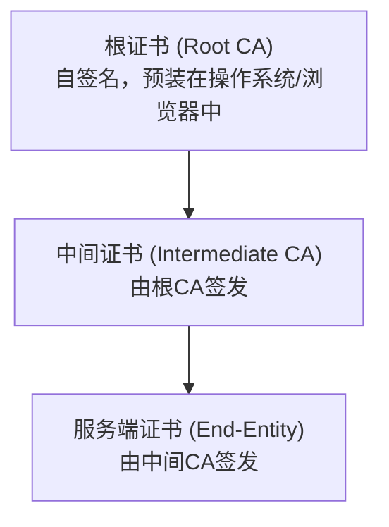
```mermaid
graph TB
    A["根证书 (Root CA)<br/>自签名，预装在操作系统/浏览器中"] --> B["中间证书 (Intermediate CA)<br/>由根CA签发"]
    B --> C["服务端证书 (End-Entity)<br/>由中间CA签发"]
```

**验证步骤：**

1. 检查证书是否在有效期内
2. 检查证书的域名是否与请求的域名匹配
3. 用上级CA的公钥验证证书的数字签名
4. 递归验证直到根证书（根证书是系统预装的，作为信任锚点）
5. 检查证书是否被吊销（CRL或OCSP）

## 实时通信协议

传统HTTP是"请求-响应"模型，客户端不发请求就收不到数据。但很多场景需要服务端主动向客户端推送数据（如即时通讯、实时行情、AI流式输出）。主流的实时通信方案有以下几种：

| 方案 | 协议基础 | 通信方向 | 连接方式 | 典型场景 |
|------|----------|----------|----------|----------|
| 短轮询（Short Polling） | HTTP | 客户端 -> 服务端 | 反复建立短连接 | 简单通知（不推荐） |
| 长轮询（Long Polling） | HTTP | 服务端 -> 客户端 | 保持HTTP连接等待响应 | 兼容性要求高的场景 |
| SSE | HTTP | 服务端 -> 客户端（单向） | 持久HTTP连接 | AI流式输出、新闻推送 |
| WebSocket | TCP（经HTTP升级） | 双向 | 持久TCP连接 | 即时通讯、实时游戏 |

### 短轮询与长轮询

**短轮询**：客户端按固定间隔（如每3秒）向服务端发送HTTP请求，询问是否有新数据。简单但低效——大部分请求得到的是"无新数据"的空响应，浪费带宽和服务端资源。

**长轮询**：客户端发送请求后，服务端不立即返回，而是**挂起连接**，直到有新数据或超时才响应。客户端收到响应后立即发起下一次请求。相比短轮询减少了无效请求，但每次推送后都需要重新建立请求，且服务端需要维护大量挂起的连接。

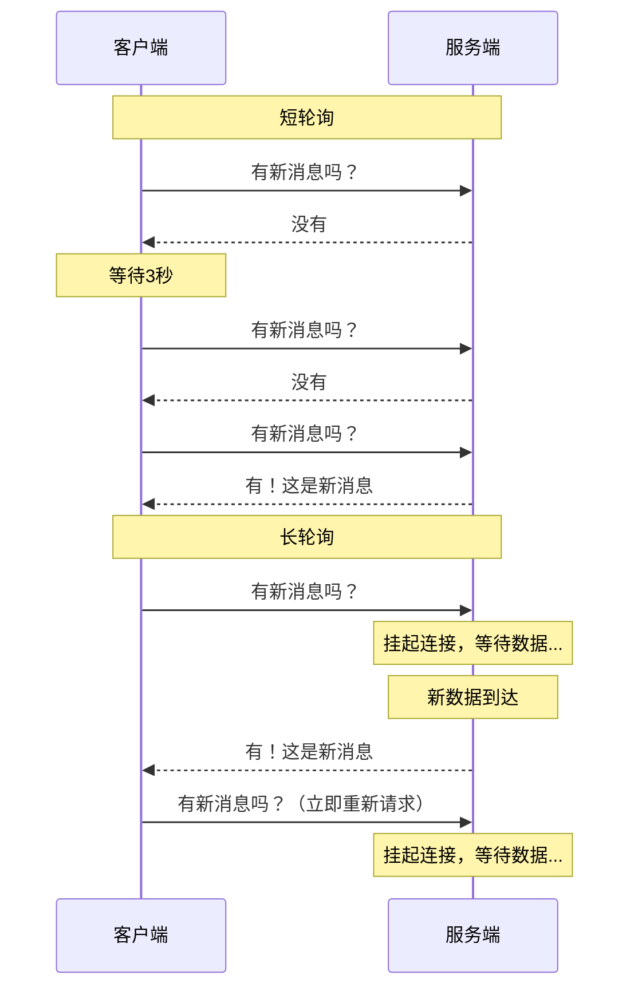
```mermaid
sequenceDiagram
    participant C as 客户端
    participant S as 服务端
    
    Note over C,S: 短轮询
    C->>S: 有新消息吗？
    S-->>C: 没有
    Note over C: 等待3秒
    C->>S: 有新消息吗？
    S-->>C: 没有
    C->>S: 有新消息吗？
    S-->>C: 有！这是新消息
    
    Note over C,S: 长轮询
    C->>S: 有新消息吗？
    Note over S: 挂起连接，等待数据...
    Note over S: 新数据到达
    S-->>C: 有！这是新消息
    C->>S: 有新消息吗？（立即重新请求）
    Note over S: 挂起连接，等待数据...
```

### WebSocket

WebSocket是一种在单个TCP连接上提供**全双工**通信的应用层协议（RFC 6455）。连接建立后，客户端和服务端可以随时互相发送数据，无需等待对方先发起。

#### 连接建立的完整过程

WebSocket 连接的建立涉及三个层面：TCP连接 → TLS握手（wss场景）→ WebSocket握手。只有三层都完成后，双方才能开始收发 WebSocket 帧：

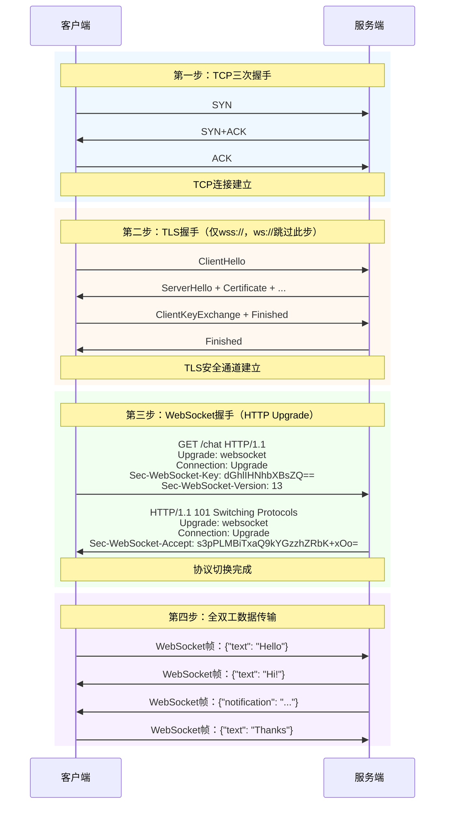
```mermaid
sequenceDiagram
    participant C as 客户端
    participant S as 服务端
    
    rect rgb(240, 248, 255)
    Note over C,S: 第一步：TCP三次握手
    C->>S: SYN
    S->>C: SYN+ACK
    C->>S: ACK
    Note over C,S: TCP连接建立
    end
    
    rect rgb(255, 248, 240)
    Note over C,S: 第二步：TLS握手（仅wss://，ws://跳过此步）
    C->>S: ClientHello
    S->>C: ServerHello + Certificate + ...
    C->>S: ClientKeyExchange + Finished
    S->>C: Finished
    Note over C,S: TLS安全通道建立
    end
    
    rect rgb(240, 255, 240)
    Note over C,S: 第三步：WebSocket握手（HTTP Upgrade）
    C->>S: GET /chat HTTP/1.1<br/>Upgrade: websocket<br/>Connection: Upgrade<br/>Sec-WebSocket-Key: dGhlIHNhbXBsZQ==<br/>Sec-WebSocket-Version: 13
    S->>C: HTTP/1.1 101 Switching Protocols<br/>Upgrade: websocket<br/>Connection: Upgrade<br/>Sec-WebSocket-Accept: s3pPLMBiTxaQ9kYGzzhZRbK+xOo=
    Note over C,S: 协议切换完成
    end
    
    rect rgb(248, 240, 255)
    Note over C,S: 第四步：全双工数据传输
    C->>S: WebSocket帧：{"text": "Hello"}
    S->>C: WebSocket帧：{"text": "Hi!"}
    S->>C: WebSocket帧：{"notification": "..."}
    C->>S: WebSocket帧：{"text": "Thanks"}
    end
```

`ws://` 对应不加密的 WebSocket（底层是裸TCP），`wss://` 对应加密的 WebSocket（底层是 TLS + TCP），类似于 HTTP 与 HTTPS 的关系。生产环境中应始终使用 `wss://`。

#### 握手过程详解

WebSocket握手复用了HTTP协议——客户端发送一个带有特殊头部的HTTP GET请求，服务端同意后返回 `101 Switching Protocols`，此后底层TCP连接不再承载HTTP报文，改为承载WebSocket帧。

**客户端握手请求：**

```
GET /chat HTTP/1.1
Host: server.example.com
Upgrade: websocket
Connection: Upgrade
Sec-WebSocket-Key: dGhlIHNhbXBsZQ==
Sec-WebSocket-Version: 13
Origin: http://example.com
Sec-WebSocket-Protocol: chat, superchat
Sec-WebSocket-Extensions: permessage-deflate
```

| 头部 | 说明 |
|------|------|
| `Upgrade: websocket` | 请求将协议升级为WebSocket |
| `Connection: Upgrade` | 表示这是一个升级请求 |
| `Sec-WebSocket-Key` | 16字节随机值的Base64编码，用于握手验证 |
| `Sec-WebSocket-Version` | WebSocket协议版本，当前标准为13 |
| `Origin` | 请求来源，服务端可据此做跨域校验 |
| `Sec-WebSocket-Protocol` | 客户端支持的子协议列表（可选），如 `chat`、`graphql-ws` |
| `Sec-WebSocket-Extensions` | 客户端支持的扩展（可选），如 `permessage-deflate`（消息压缩） |

**服务端握手响应：**

```
HTTP/1.1 101 Switching Protocols
Upgrade: websocket
Connection: Upgrade
Sec-WebSocket-Accept: s3pPLMBiTxaQ9kYGzzhZRbK+xOo=
Sec-WebSocket-Protocol: chat
```

**`Sec-WebSocket-Accept` 的计算过程：**

```
1. 取客户端发送的 Sec-WebSocket-Key：
   "dGhlIHNhbXBsZQ=="

2. 拼接固定的 Magic GUID：
   "dGhlIHNhbXBsZQ==" + "258EAFA5-E914-47DA-95CA-C5AB0DC85B11"

3. 对拼接结果做 SHA-1 哈希：
   → 0xb3 0x7a 0x4f 0x2c 0xc0 0x62 0x4f 0x16 ...

4. 对哈希结果做 Base64 编码：
   → "s3pPLMBiTxaQ9kYGzzhZRbK+xOo="
```

这个验证机制的目的**不是安全性**（不提供加密或身份认证），而是：
- 确认服务端确实理解 WebSocket 协议，而不是一个普通的 HTTP 服务器误处理了 Upgrade 请求
- 防止HTTP缓存代理将 WebSocket 握手响应缓存并复放给其他客户端
- 阻止非 WebSocket 客户端（如普通HTTP客户端）意外建立 WebSocket 连接

如果握手失败（服务端不支持WebSocket、认证失败等），服务端返回标准的HTTP错误响应（如 403 Forbidden、400 Bad Request），不返回 101，客户端不会升级协议。

#### WebSocket帧格式

握手完成后，HTTP的角色就结束了。此后TCP连接上传输的不再是HTTP报文，而是紧凑的 WebSocket 二进制帧：

```
 0                   1                   2                   3
 0 1 2 3 4 5 6 7 8 9 0 1 2 3 4 5 6 7 8 9 0 1 2 3 4 5 6 7 8 9 0 1
+-+-+-+-+-------+-+-------------+-------------------------------+
|F|R|R|R| opcode|M| Payload len |    Extended payload length    |
|I|S|S|S|  (4)  |A|     (7)     |           (16/64)             |
|N|V|V|V|       |S|             |   (if payload len == 126/127) |
| |1|2|3|       |K|             |                               |
+-+-+-+-+-------+-+-------------+-------------------------------+
|     Extended payload length continued, if payload len == 127  |
+-------------------------------+-------------------------------+
|                               |  Masking-key, if MASK set to 1|
+-------------------------------+-------------------------------+
| Masking-key (continued)       |          Payload Data         |
+-------------------------------+-------------------------------+
|                     Payload Data continued ...                |
+---------------------------------------------------------------+
```

| 字段 | 大小 | 说明 |
|------|------|------|
| FIN | 1位 | 1=这是消息的最后一帧；0=后续还有延续帧 |
| RSV1/2/3 | 各1位 | 保留位，扩展使用（如 permessage-deflate 使用 RSV1 标记压缩） |
| Opcode | 4位 | 帧类型，见下表 |
| MASK | 1位 | 1=载荷已掩码。客户端→服务端必须掩码，服务端→客户端不掩码 |
| Payload Length | 7位 | 载荷长度。0~125=实际长度；126=后续2字节为长度；127=后续8字节为长度 |
| Masking Key | 0或4字节 | 掩码密钥，MASK=1时存在 |
| Payload Data | 变长 | 实际传输的数据 |

**Opcode 类型：**

| Opcode | 类型 | 说明 |
|--------|------|------|
| 0x0 | 延续帧 | 消息分片时，后续帧使用此Opcode |
| 0x1 | 文本帧 | 载荷为UTF-8编码的文本 |
| 0x2 | 二进制帧 | 载荷为任意二进制数据 |
| 0x8 | 关闭帧 | 发起连接关闭，载荷可携带关闭原因码 |
| 0x9 | Ping帧 | 心跳探测 |
| 0xA | Pong帧 | 心跳响应 |

**为什么客户端发送的帧必须掩码？**

这是为了防止**缓存投毒攻击（Cache Poisoning）**。攻击场景如下：恶意网页中的JavaScript通过WebSocket向目标服务器发送精心构造的数据，如果中间存在不理解WebSocket协议的HTTP代理，代理可能将WebSocket帧误认为HTTP请求/响应并缓存。掩码使得每次发送的帧在比特层面都不同（即使载荷相同），让代理无法将其与HTTP流量混淆。掩码算法很简单——将载荷的每个字节与 Masking Key 做异或：

```
masked_payload[i] = original_payload[i] XOR masking_key[i % 4]
```

这不是加密（Masking Key是明文传输的），纯粹是协议层面的安全防护。

#### 消息分片

一条逻辑消息可以被拆分为多个帧传输，适用于大消息或流式生成的场景。分片规则：第一帧的 Opcode 为实际类型（0x1文本或0x2二进制），FIN=0；中间帧的 Opcode=0x0（延续帧），FIN=0；最后一帧 Opcode=0x0，FIN=1：

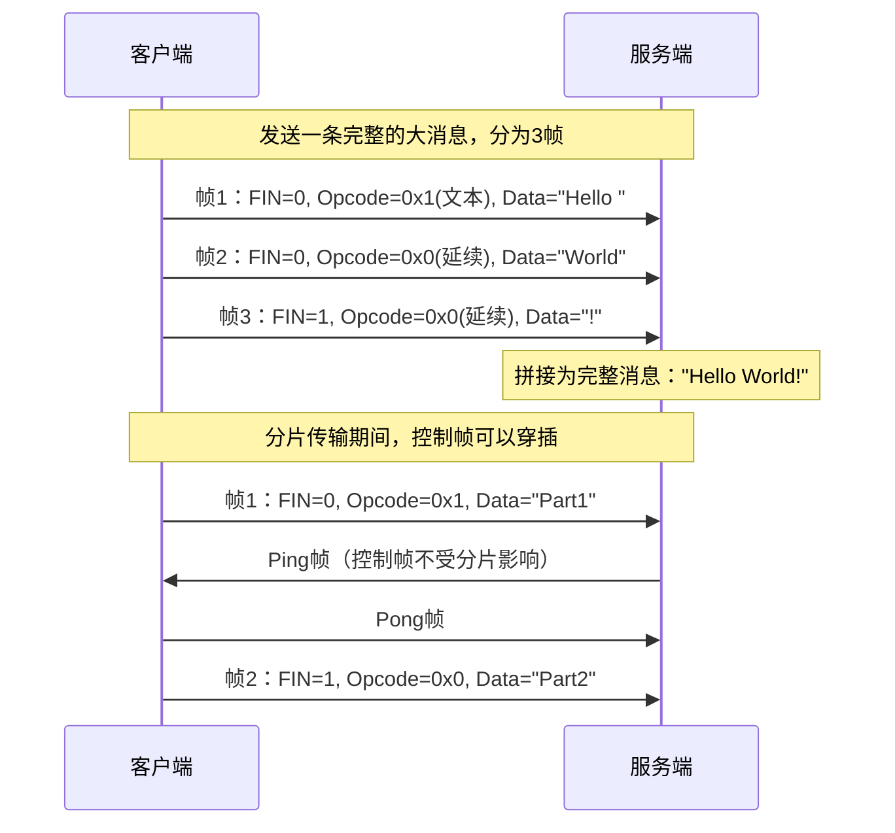
```mermaid
sequenceDiagram
    participant C as 客户端
    participant S as 服务端
    
    Note over C,S: 发送一条完整的大消息，分为3帧
    C->>S: 帧1：FIN=0, Opcode=0x1(文本), Data="Hello "
    C->>S: 帧2：FIN=0, Opcode=0x0(延续), Data="World"
    C->>S: 帧3：FIN=1, Opcode=0x0(延续), Data="!"
    Note over S: 拼接为完整消息："Hello World!"
    
    Note over C,S: 分片传输期间，控制帧可以穿插
    C->>S: 帧1：FIN=0, Opcode=0x1, Data="Part1"
    S->>C: Ping帧（控制帧不受分片影响）
    C->>S: Pong帧
    C->>S: 帧2：FIN=1, Opcode=0x0, Data="Part2"
```

控制帧（Ping/Pong/Close）不能被分片，且可以穿插在数据帧的分片序列之间，因为它们的 Opcode 不是 0x0，接收方可以明确区分。

#### 心跳机制

WebSocket通过 Ping/Pong 帧维持连接活性并检测死连接：

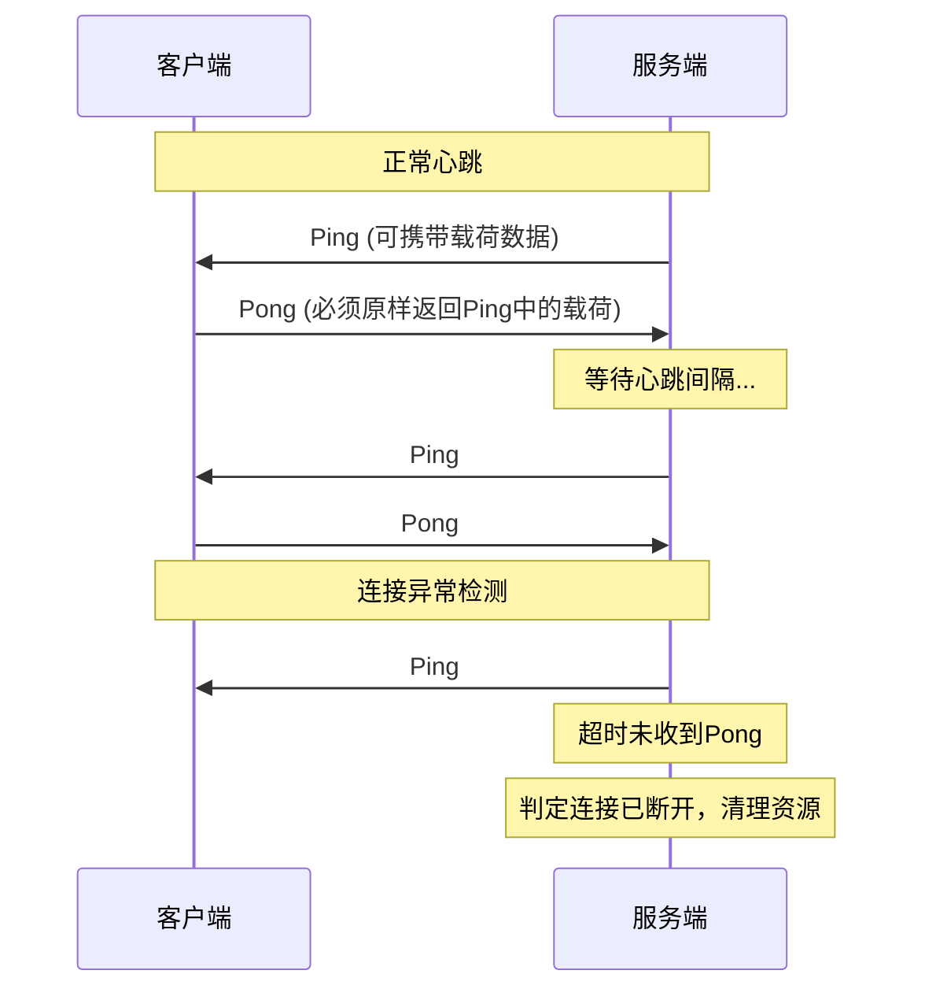
```mermaid
sequenceDiagram
    participant C as 客户端
    participant S as 服务端
    
    Note over C,S: 正常心跳
    S->>C: Ping (可携带载荷数据)
    C->>S: Pong (必须原样返回Ping中的载荷)
    
    Note over S: 等待心跳间隔...
    S->>C: Ping
    C->>S: Pong
    
    Note over C,S: 连接异常检测
    S->>C: Ping
    Note over S: 超时未收到Pong
    Note over S: 判定连接已断开，清理资源
```

**心跳机制的关键规则：**

- 任何一方都可以发送 Ping，对方**必须**尽快回复 Pong
- Pong 帧必须原样返回 Ping 帧中携带的载荷数据（用于匹配请求和响应）
- 如果收到 Ping 之前还没来得及回复上一个 Pong，只需回复最新的 Pong 即可（中间的可以跳过）
- 一方可以主动发送未经请求的 Pong（单向心跳），RFC 6455 允许但对方不需要回复

典型的心跳策略是服务端每 30~60 秒发送一次 Ping，如果连续 2~3 次未收到 Pong 则关闭连接。客户端也可以主动发送 Ping 来检测连接状态。

#### 连接关闭

WebSocket 定义了一套优雅的关闭流程——**关闭握手（Closing Handshake）**，确保双方有序地结束通信：

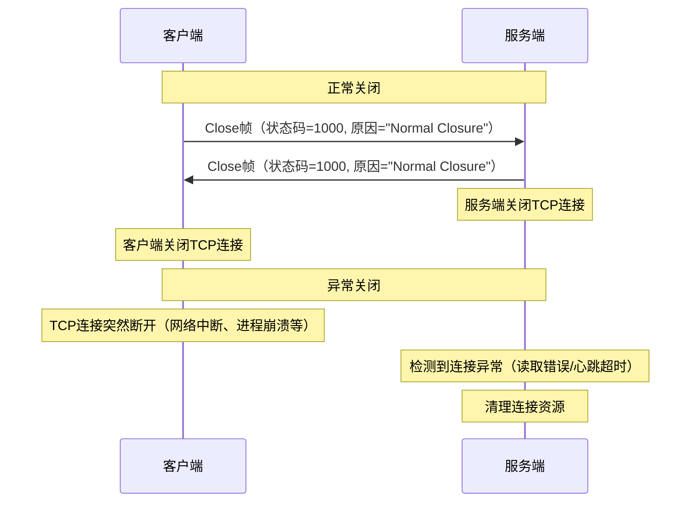
```mermaid
sequenceDiagram
    participant C as 客户端
    participant S as 服务端
    
    Note over C,S: 正常关闭
    C->>S: Close帧（状态码=1000, 原因="Normal Closure"）
    S->>C: Close帧（状态码=1000, 原因="Normal Closure"）
    Note over S: 服务端关闭TCP连接
    Note over C: 客户端关闭TCP连接
    
    Note over C,S: 异常关闭
    Note over C: TCP连接突然断开（网络中断、进程崩溃等）
    Note over S: 检测到连接异常（读取错误/心跳超时）
    Note over S: 清理连接资源
```

**关闭帧的载荷格式：**

```
+------------------+------------------+
|  状态码 (2字节)   |  关闭原因 (变长)   |
+------------------+------------------+
```

**常见状态码：**

| 状态码 | 含义 | 场景 |
|--------|------|------|
| 1000 | 正常关闭 | 通信正常完成 |
| 1001 | 离开 | 服务端关机或浏览器页面跳转 |
| 1002 | 协议错误 | 收到了不符合协议规范的帧 |
| 1003 | 数据类型不支持 | 收到了不支持的数据类型（如只支持文本却收到二进制） |
| 1006 | 异常关闭 | 连接异常断开，无Close帧（不会出现在Close帧中，仅API层面使用） |
| 1008 | 策略违规 | 消息违反了服务端策略 |
| 1009 | 消息过大 | 收到的消息超过了处理能力 |
| 1011 | 服务端内部错误 | 服务端遇到了不可预期的错误 |

**关闭流程的关键规则：**

- 收到 Close 帧后，**必须**回复一个 Close 帧（关闭握手）
- 回复 Close 帧后，不应再发送任何数据帧
- 发起关闭的一方在发送 Close 帧后，仍需继续读取数据直到收到对方的 Close 帧
- 关闭握手完成后，由服务端负责关闭底层TCP连接（客户端等待服务端关闭）。这样做是因为服务端关闭TCP连接可以避免 TIME_WAIT 状态积累在客户端

#### WebSocket 与 HTTP 的关系

WebSocket 和 HTTP 是平级的应用层协议，WebSocket 仅在握手阶段"借用"了 HTTP，一旦连接建立就与 HTTP 无关了：

```
HTTP请求/响应（握手阶段）
        ↓ 101 Switching Protocols
WebSocket帧（数据传输阶段）
        ↓
底层TCP连接（始终是同一条）
```

| 对比项 | HTTP | WebSocket |
|--------|------|-----------|
| 通信模式 | 请求-响应（半双工） | 全双工 |
| 连接生命周期 | 短连接或Keep-Alive | 持久长连接 |
| 数据格式 | 文本报文（Header + Body） | 轻量二进制帧 |
| 头部开销 | 每次请求携带完整头部（几百字节~几KB） | 帧头仅2~14字节 |
| 服务端推送 | 不支持（需轮询或SSE） | 原生支持 |
| 协议标识 | `http://` / `https://` | `ws://` / `wss://` |
| 默认端口 | 80（HTTP）/ 443（HTTPS） | 80（ws）/ 443（wss），与HTTP共用 |

共用端口80/443是WebSocket的一个设计亮点——它可以穿透大多数防火墙和代理，因为这些中间设备通常放行 80/443 端口的流量。

### SSE（Server-Sent Events）

SSE是一种基于HTTP的**服务端单向推送**技术（W3C标准）。客户端通过一个普通的HTTP请求建立持久连接，服务端通过这个连接持续推送事件流。SSE天然支持自动重连和事件ID追踪。

#### SSE vs WebSocket

| 对比项 | SSE | WebSocket |
|--------|-----|-----------|
| 通信方向 | 服务端 -> 客户端（单向） | 双向 |
| 协议基础 | 标准HTTP | 独立协议（经HTTP升级） |
| 数据格式 | 纯文本（UTF-8） | 文本和二进制 |
| 自动重连 | 内置支持 | 需要手动实现 |
| 浏览器兼容 | 大部分现代浏览器 | 所有现代浏览器 |
| 代理/防火墙 | 友好（标准HTTP流量） | 可能被阻断 |
| 最大连接数 | HTTP/1.1下每域名6个 | 无此限制 |
| 适用场景 | AI流式输出、通知推送、实时日志 | 即时通讯、协同编辑、实时游戏 |

**选择建议**：如果只需要服务端向客户端推送数据（如ChatGPT的流式回复、股票行情、新闻推送），SSE更简单轻量；如果需要双向实时交互（如聊天、游戏），选择WebSocket。

#### SSE数据格式

SSE响应的 `Content-Type` 为 `text/event-stream`，数据由一系列事件组成，每个事件由若干字段构成：

```
HTTP/1.1 200 OK
Content-Type: text/event-stream
Cache-Control: no-cache
Connection: keep-alive

event: message
id: 1
retry: 3000
data: {"text": "Hello"}

event: message
id: 2
data: {"text": " World"}

event: done
id: 3
data: [DONE]
```

各字段含义：

| 字段 | 说明 |
|------|------|
| `event` | 事件类型，客户端可据此分类处理。默认为 `message` |
| `data` | 事件数据，可以多行（每行以 `data:` 开头，接收时用换行符拼接） |
| `id` | 事件ID，客户端断线重连时通过 `Last-Event-ID` 头部发送，服务端据此恢复推送位置 |
| `retry` | 建议的重连间隔（毫秒），客户端断线后按此间隔自动重连 |

事件之间用**空行**（`\n\n`）分隔，字段之间用换行符（`\n`）分隔。

#### SSE断线重连机制

SSE内置了自动重连机制，客户端无需手动处理：

```mermaid
sequenceDiagram
    participant C as 客户端
    participant S as 服务端
    
    C->>S: GET /stream HTTP/1.1<br/>Accept: text/event-stream
    S->>C: event: msg<br/>id: 42<br/>data: Hello
    S->>C: event: msg<br/>id: 43<br/>data: World
    
    Note over C,S: 连接中断
    
    Note over C: 等待retry指定的时间后自动重连
    C->>S: GET /stream HTTP/1.1<br/>Accept: text/event-stream<br/>Last-Event-ID: 43
    Note over S: 从id=43之后的事件开始推送
    S->>C: event: msg<br/>id: 44<br/>data: Reconnected!
```

### Streamable HTTP

Streamable HTTP 是 MCP（Model Context Protocol，模型上下文协议）在 2025 年引入的新传输机制，用于替代之前基于 SSE 的传输方式。它的核心思想是：**用标准的 HTTP 请求/响应作为基础，按需升级为 SSE 流式推送**，兼顾了简单场景的轻量性和复杂场景的流式能力。

#### 背景：为什么需要 Streamable HTTP

MCP 最初定义了两种传输方式：`stdio`（本地进程间通信）和 `HTTP + SSE`。其中 `HTTP + SSE` 方案要求（注意这里是 MCP 对 SSE 的特定用法，不是 SSE 协议本身）：

- 客户端先向服务端的 `/sse` 端点发起 GET 请求，建立一个**持久的 SSE 连接**用于接收服务端消息
- 客户端通过另一个端点的 POST 请求向服务端发送 JSON-RPC 消息（因为 SSE 本身是单向的，客户端无法通过 SSE 连接发送数据），服务端的响应通过前面建立的 SSE 连接推送回来

这种设计存在几个问题：

| 问题 | 具体表现 |
|------|----------|
| 部署复杂 | 需要维护两个通道（POST + SSE），服务端需要在两者之间关联会话状态 |
| 基础设施不友好 | 长连接的 SSE 通道不利于负载均衡、CDN、API 网关等中间件的处理 |
| 简单场景过重 | 即使是一次性的请求-响应（如获取工具列表），也必须先建立 SSE 连接 |
| 断线恢复困难 | SSE 连接断开后，正在进行的交互状态丢失，恢复逻辑复杂 |

Streamable HTTP 的设计目标就是解决这些问题：**简单场景用普通 HTTP，复杂场景按需升级为 SSE**。

#### 工作原理

Streamable HTTP 只暴露一个 HTTP 端点（如 `/mcp`），所有通信都通过这个端点完成。根据交互的复杂度，服务端可以选择不同的响应方式：

```mermaid
sequenceDiagram
    participant C as 客户端
    participant S as 服务端 (/mcp)
    
    Note over C,S: 场景1：简单请求-响应
    C->>S: POST /mcp<br/>Content-Type: application/json<br/>{"method": "tools/list"}
    S->>C: 200 OK<br/>Content-Type: application/json<br/>{"tools": [...]}
    
    Note over C,S: 场景2：流式响应（服务端按需升级为SSE）
    C->>S: POST /mcp<br/>Content-Type: application/json<br/>{"method": "chat/complete", "params": {...}}
    S->>C: 200 OK<br/>Content-Type: text/event-stream
    S->>C: event: message<br/>data: {"content": "Hello"}
    S->>C: event: message<br/>data: {"content": " World"}
    S->>C: event: message<br/>data: {"done": true}
    
    Note over C,S: 场景3：客户端开启接收通道（可选）
    C->>S: GET /mcp<br/>Accept: text/event-stream
    Note over S: 打开SSE流，用于服务端主动推送
    S->>C: event: notification<br/>data: {"type": "progress", "value": 50}
    S->>C: event: notification<br/>data: {"type": "progress", "value": 100}
```

**核心规则：**

- **POST 请求**：客户端发送 JSON-RPC 消息。服务端可以返回普通 JSON 响应（简单场景），也可以返回 `text/event-stream`（流式场景）
- **GET 请求**（可选）：客户端主动打开一个 SSE 流，用于接收服务端的主动通知。不需要主动推送的服务端可以不实现此端点
- **会话管理**：通过 `Mcp-Session-Id` 响应头标识会话，客户端在后续请求中携带该头部

#### 与纯 SSE 方案的对比

| 对比项 | 旧方案（HTTP + SSE） | Streamable HTTP |
|--------|----------------------|-----------------|
| 端点数量 | 2个（`/sse` + POST端点） | 1个（`/mcp`） |
| 建立连接 | 必须先建立SSE长连接 | 按需，可以只用普通HTTP |
| 简单请求 | 仍需经过SSE通道 | 直接返回JSON，无需SSE |
| 流式响应 | 通过预建立的SSE通道 | POST响应按需升级为SSE |
| 服务端推送 | 通过持久SSE连接 | 可选的GET SSE通道 |
| 无状态支持 | 不支持（依赖长连接） | 支持（单次请求即可完成） |
| 负载均衡 | 困难（长连接亲和性） | 友好（每个请求可独立路由） |
| 可恢复性 | SSE断开后难以恢复 | 每个请求独立，天然可恢复 |

#### Streamable HTTP 的渐进式设计

Streamable HTTP 最巧妙的地方在于其**渐进式**特性——服务端可以根据自身能力选择实现的复杂度：

```mermaid
graph TB
    A["最简实现<br/>纯 HTTP 请求-响应"] -->|需要流式输出| B["中级实现<br/>POST 响应升级为 SSE"]
    B -->|需要服务端主动推送| C["完整实现<br/>支持 GET SSE 通道"]
```

- **最简实现**：只处理 POST 请求，返回普通 JSON。适合简单的工具调用、资源查询等场景。实现成本与普通 REST API 几乎相同
- **中级实现**：POST 请求的响应可以是 SSE 流。适合需要流式输出的场景（如 AI 对话）
- **完整实现**：额外支持 GET 端点打开 SSE 通道，接收服务端主动推送。适合需要双向通信的复杂场景

这种设计让一个简单的 HTTP 服务器就能成为 MCP 服务端，无需强制引入 WebSocket 或长连接的复杂性。

### 实时通信方案选型

```mermaid
graph TD
    A["需要实时通信"] --> B{"需要双向通信？"}
    B -->|是| C{"需要低延迟？"}
    C -->|是| D["WebSocket"]
    C -->|否| E["长轮询"]
    B -->|否| F{"数据格式？"}
    F -->|纯文本| G{"需要按需升级？"}
    F -->|二进制| D
    G -->|是| H["Streamable HTTP"]
    G -->|否| I["SSE"]
```

| 场景 | 推荐方案 | 理由 |
|------|----------|------|
| AI对话流式输出 | SSE | 单向推送，文本数据，天然适配 |
| 即时通讯/聊天 | WebSocket | 双向交互，低延迟 |
| 股票实时行情 | WebSocket | 高频双向数据推送 |
| 新闻/通知推送 | SSE | 单向推送，自动重连 |
| 协同编辑 | WebSocket | 双向同步，实时性要求高 |
| 简单状态轮询 | 长轮询 | 实现简单，兼容性好 |
| AI Agent/MCP工具调用 | Streamable HTTP | 简单请求用HTTP，流式输出按需升级为SSE |

## DNS解析

### DNS概述

DNS（Domain Name System，域名系统）是互联网的"电话簿"，负责将人类可读的域名（如 `www.example.com`）翻译为机器可识别的IP地址（如 `93.184.216.34`）。DNS使用UDP协议（端口53），当响应数据超过512字节时会切换到TCP。

域名采用分层结构，从右到左依次为：

```
www.example.com.
 |     |     |  |
 |     |     |  └── 根域（通常省略末尾的点）
 |     |     └───── 顶级域（TLD）：.com
 |     └─────────── 二级域：example
 └───────────────── 三级域（子域/主机名）：www
```

### DNS解析流程

当应用程序需要将域名（如 `www.example.com`）解析为IP地址时，会经历以下多级查找过程：

```mermaid
sequenceDiagram
    participant App as 应用程序
    participant Local as 本地DNS缓存
    participant LDNS as 本地DNS服务器
    participant Root as 根DNS服务器
    participant TLD as TLD DNS服务器
    participant Auth as 权威DNS服务器
    
    App->>Local: 1. 查询 www.example.com
    Local-->>App: 缓存命中则返回
    
    App->>LDNS: 2. 缓存未命中，查询本地DNS服务器
    LDNS-->>App: 缓存命中则返回
    
    LDNS->>Root: 3. 查询根服务器
    Root-->>LDNS: 返回 .com TLD服务器地址
    
    LDNS->>TLD: 4. 查询TLD服务器
    TLD-->>LDNS: 返回 example.com 权威服务器地址
    
    LDNS->>Auth: 5. 查询权威服务器
    Auth-->>LDNS: 返回 www.example.com 的IP地址
    
    LDNS-->>App: 6. 返回IP地址（并缓存）
```

**各步骤详解：**

**1. 查找本地缓存**

应用程序发起DNS查询时，系统会按以下顺序逐级检查本地缓存：

- **浏览器DNS缓存**（如果是浏览器发起的请求）：浏览器维护自己的DNS缓存，Chrome中可通过 `chrome://net-internals/#dns` 查看
- **操作系统DNS缓存**：操作系统内核维护的DNS缓存。iOS/macOS使用 `mDNSResponder` 守护进程管理DNS缓存
- **hosts文件**：`/etc/hosts` 文件中的静态映射，优先级高于远程DNS查询

任一层命中缓存则直接返回，不再向下查找。

**2. 查询本地DNS服务器（Local DNS Server）**

本地缓存全部未命中时，系统向本地DNS服务器（也叫递归解析器）发送**递归查询**请求。本地DNS服务器通常由ISP（互联网服务提供商）提供，也可以手动配置为公共DNS（如 114.114.114.114、8.8.8.8）。本地DNS服务器自身也有缓存，如果命中则直接返回。

**3. 查询根DNS服务器**

本地DNS服务器缓存未命中时，开始向外发起**迭代查询**。首先查询根DNS服务器（全球共13组根服务器，标记为A~M）。根服务器不直接知道 `www.example.com` 的IP，但它知道 `.com` 顶级域由哪些TLD服务器管理，于是返回 `.com` TLD服务器的地址。

**4. 查询TLD（顶级域）DNS服务器**

本地DNS服务器拿到TLD服务器地址后，向 `.com` TLD服务器发起查询。TLD服务器管理该顶级域下所有二级域名的NS记录，返回 `example.com` 的权威DNS服务器地址。

常见顶级域分类：

| 分类 | 示例 |
|------|------|
| 通用顶级域（gTLD） | .com, .org, .net, .io |
| 国家顶级域（ccTLD） | .cn, .jp, .uk, .us |
| 新通用顶级域 | .app, .dev, .cloud |

**5. 查询权威DNS服务器**

本地DNS服务器向 `example.com` 的权威DNS服务器发起查询。权威DNS服务器是域名记录的最终持有者（由域名注册商或自建DNS管理），它存储了该域名的所有DNS记录（A记录、CNAME记录等），返回 `www.example.com` 对应的IP地址。

**6. 返回结果并缓存**

本地DNS服务器将查询结果返回给应用程序，同时将结果缓存。缓存的有效期由DNS记录中的**TTL（Time To Live）** 字段决定，TTL过期后需要重新查询。

**DNS查询方式：**

- **递归查询**：客户端只发一次请求，DNS服务器负责追查到底并返回最终结果。客户端到本地DNS服务器之间使用递归查询
- **迭代查询**：DNS服务器返回"下一步去找谁"的地址，由请求方自己去查。本地DNS服务器到根服务器、TLD服务器、权威服务器之间使用迭代查询

两种方式的核心区别在于"谁来负责追查"——递归查询中由被查询方负责，迭代查询中由查询发起方负责。

### DNS记录类型

| 类型 | 描述 | 示例 |
|------|------|------|
| A | 域名 -> IPv4地址 | example.com -> 93.184.216.34 |
| AAAA | 域名 -> IPv6地址 | example.com -> 2606:2800:220:1:... |
| CNAME | 域名别名 | www.example.com -> example.com |
| MX | 邮件交换记录 | example.com -> mail.example.com |
| NS | 域名服务器记录 | example.com -> ns1.example.com |
| TXT | 文本记录 | 用于SPF、域名验证等 |

### DNS劫持

DNS劫持是指攻击者通过某种手段篡改DNS解析过程，使域名被解析到错误的IP地址，从而将用户引导到恶意网站或广告页面。

#### 劫持方式

**1. LocalDNS劫持（运营商劫持）**

最常见的劫持方式。部分运营商的LocalDNS服务器会篡改解析结果，将用户请求的域名指向自己的缓存服务器或广告服务器：

```mermaid
sequenceDiagram
    participant App as 用户App
    participant LDNS as 运营商LocalDNS
    participant Ad as 广告/缓存服务器
    participant Real as 真实服务器

    App->>LDNS: 查询 www.example.com
    Note over LDNS: 篡改解析结果
    LDNS-->>App: 返回广告服务器IP（而非真实IP）
    App->>Ad: 请求发送到了错误的服务器
    App-xReal: 真实服务器未被访问
```

运营商这样做的动机通常是插入广告（利润）或节省带宽（使用本地缓存服务器代替源站）。

**2. 中间人劫持（DNS欺骗/DNS Spoofing）**

攻击者在网络链路上监听DNS查询报文，抢先伪造DNS响应返回给客户端。由于DNS基于UDP协议且没有内置的身份验证机制，客户端无法区分真假响应——谁的回复先到达就采纳谁的结果：

```mermaid
sequenceDiagram
    participant App as 用户App
    participant Attacker as 攻击者
    participant LDNS as LocalDNS

    App->>LDNS: 查询 www.bank.com（UDP明文）
    Note over Attacker: 监听到查询报文
    Attacker-->>App: 抢先伪造响应：www.bank.com -> 恶意IP
    LDNS-->>App: 真实响应（已被忽略，因为伪造响应先到达）
    Note over App: 用户访问了钓鱼网站
```

**3. 路由器DNS劫持**

攻击者入侵家庭/企业路由器（利用弱密码或漏洞），将路由器的DNS服务器设置修改为恶意DNS服务器。所有通过该路由器上网的设备都会受到影响。

**4. hosts文件篡改**

恶意软件修改本地 `/etc/hosts` 文件，添加域名到恶意IP的静态映射。由于hosts文件优先级高于远程DNS查询，被篡改后直接生效。

**5. DNS缓存投毒（Cache Poisoning）**

攻击者向LocalDNS服务器注入伪造的DNS记录，污染其缓存。此后所有向该DNS服务器查询同一域名的用户都会得到错误的IP地址，影响范围远大于单一用户：

```mermaid
graph LR
    A["攻击者"] -->|注入伪造记录| B["LocalDNS缓存<br/>www.bank.com -> 恶意IP"]
    B -->|所有用户查询| C["用户A"]
    B --> D["用户B"]
    B --> E["用户C"]
    C --> F["恶意网站"]
    D --> F
    E --> F
```

#### DNS劫持的防御手段

| 防御手段 | 原理 | 适用场景 |
|----------|------|----------|
| HTTPDNS | 通过HTTP/HTTPS协议获取DNS解析结果，绕过LocalDNS | 移动App（推荐） |
| DoH（DNS over HTTPS） | 将DNS查询封装在HTTPS中，加密且防篡改 | 浏览器、系统级 |
| DoT（DNS over TLS） | 将DNS查询封装在TLS中（端口853） | 系统级 |
| DNSSEC | DNS安全扩展，对DNS记录进行数字签名，验证真实性 | DNS基础设施 |
| 使用可信DNS | 使用Google（8.8.8.8）、Cloudflare（1.1.1.1）等公共DNS | 所有场景 |
| 证书校验 | HTTPS的证书验证机制可在应用层发现域名与证书不匹配 | Web/App |

对于iOS开发而言，**HTTPDNS + 证书校验**是最实用的组合方案。

### iOS中的DNS优化

iOS开发中常用的DNS优化策略：

#### HTTPDNS

传统DNS解析依赖运营商提供的LocalDNS服务器，存在DNS劫持、解析不准确（跨网调度）、缓存不及时等问题。HTTPDNS通过HTTP协议直接向HTTPDNS服务端发起域名解析请求，绕过了LocalDNS，从根源上解决了这些问题。

**传统DNS vs HTTPDNS：**

```mermaid
graph LR
    subgraph "传统DNS"
        direction TB
        A1["App"] -->|UDP 53端口| B1["LocalDNS<br/>(运营商)"]
        B1 -->|迭代查询| C1["根/TLD/权威DNS"]
    end

    subgraph "HTTPDNS"
        direction TB
        A2["App"] -->|HTTP/HTTPS请求| B2["HTTPDNS服务端<br/>(阿里云/腾讯云等)"]
        B2 -->|直接返回| A2
    end
```

**HTTPDNS工作流程：**

1. **App发起解析请求**：App将待解析的域名通过HTTP/HTTPS请求发送给HTTPDNS服务端（如 `https://httpdns.aliyuncs.com/resolve?host=www.example.com`）
2. **服务端解析并返回**：HTTPDNS服务端维护着精确的DNS解析数据和调度策略，根据客户端的出口IP判断其所在网络和地区，返回最优的IP地址列表
3. **App缓存解析结果**：App将结果缓存在本地（内存或磁盘），并根据TTL管理缓存过期
4. **使用IP直连发起业务请求**：App拿到IP地址后，直接用IP替换域名发起网络请求

**HTTPDNS解决的问题：**

| 问题 | 传统DNS | HTTPDNS |
|------|---------|---------|
| DNS劫持 | LocalDNS可能被运营商劫持，返回错误IP（插入广告等） | 通过HTTPS加密通信，无法被中间人劫持 |
| 解析不准确 | LocalDNS可能转发请求，导致权威DNS无法判断用户真实位置，返回非最优IP | 服务端根据客户端真实出口IP进行精准调度 |
| 解析生效慢 | LocalDNS缓存TTL不可控，域名变更后可能长时间不生效 | App端自行管理缓存，TTL可控 |
| 解析耗时长 | 完整递归查询可能需要数百毫秒 | HTTP请求直达，通常几十毫秒内返回 |

**使用HTTPDNS时需要注意的问题：**

- **HTTPS的SNI问题**：使用IP直连发起HTTPS请求时，TLS握手阶段的SNI（Server Name Indication）字段中携带的是IP而非域名，导致服务端无法根据域名选择正确的证书。解决方案是自定义TLS验证逻辑，在SNI中手动设置原始域名
- **Cookie的域名匹配**：Cookie是基于域名存储的，IP直连后Cookie可能无法正确携带，需要手动管理Cookie的domain字段
- **降级策略**：HTTPDNS服务本身不可用时，需要降级回传统DNS解析，保证业务可用性

#### DNS预解析

在App启动时预先解析常用域名，减少首次请求的等待时间。

#### IP直连

直接使用IP地址发起请求，跳过DNS解析，但需要处理HTTPS证书域名校验问题（同HTTPDNS的SNI问题）。

## Socket编程

### Socket概述

Socket（套接字）是操作系统提供的**进程间网络通信的编程接口（API）**，位于应用层和传输层之间。应用程序不直接操作TCP/IP协议栈，而是通过Socket API间接使用传输层的能力。

```
+-------------------+
|     应用程序       |  ← 你写的代码
+-------------------+
|    Socket API     |  ← 操作系统提供的接口（socket、bind、listen、connect、send、recv...）
+-------------------+
|  传输层 (TCP/UDP)  |  ← 操作系统内核实现
+-------------------+
|  网络层 (IP)       |
+-------------------+
|  数据链路层/物理层   |
+-------------------+
```

一个 Socket 由一个**五元组**唯一标识：`(协议, 本地IP, 本地端口, 远端IP, 远端端口)`。操作系统内核通过这个五元组将收到的网络数据包分发到正确的 Socket。

### Socket的类型

| 类型 | 常量 | 对应协议 | 特点 |
|------|------|----------|------|
| 流式Socket | SOCK_STREAM | TCP | 面向连接、可靠、有序的字节流 |
| 数据报Socket | SOCK_DGRAM | UDP | 无连接、不可靠、保留消息边界 |
| 原始Socket | SOCK_RAW | IP层直接访问 | 可构造自定义协议头，需要root权限 |

### TCP Socket通信流程

```mermaid
sequenceDiagram
    participant C as 客户端
    participant S as 服务端
    
    rect rgb(255, 248, 240)
    Note over S: 服务端初始化
    Note over S: socket() — 创建套接字（指定TCP）
    Note over S: bind() — 绑定IP地址和端口
    Note over S: listen() — 标记为被动Socket，开始监听
    end
    
    rect rgb(240, 248, 255)
    Note over C: 客户端初始化
    Note over C: socket() — 创建套接字
    end
    
    rect rgb(240, 255, 240)
    Note over C,S: 建立连接
    C->>S: connect() — 触发TCP三次握手
    Note over S: accept() — 从已完成连接队列取出连接<br/>返回一个新的已连接Socket
    end
    
    rect rgb(248, 240, 255)
    Note over C,S: 数据传输（全双工，双方可同时收发）
    C->>S: send()/write() — 发送数据
    S->>C: recv()/read() — 接收数据
    S->>C: send()/write() — 发送数据
    C->>S: recv()/read() — 接收数据
    end
    
    rect rgb(255, 240, 240)
    Note over C,S: 关闭连接
    C->>S: close()/shutdown() — 触发TCP四次挥手
    Note over S: close() — 关闭连接
    end
```

#### 各API详解

**1. socket() — 创建套接字**

```c
int sockfd = socket(AF_INET, SOCK_STREAM, 0);
//                  ↑ 地址族    ↑ Socket类型  ↑ 协议（0=自动选择）
```

| 参数 | 说明 |
|------|------|
| `AF_INET` | IPv4 地址族。`AF_INET6` 为 IPv6 |
| `SOCK_STREAM` | TCP 流式Socket。`SOCK_DGRAM` 为 UDP |
| `0` | 自动选择协议（SOCK_STREAM 对应 TCP，SOCK_DGRAM 对应 UDP） |

`socket()` 返回一个**文件描述符（File Descriptor）**。在Unix/Linux哲学中"一切皆文件"，Socket也不例外——后续通过这个文件描述符进行所有操作（读、写、关闭）。

**2. bind() — 绑定地址和端口**

```c
struct sockaddr_in addr;
addr.sin_family = AF_INET;
addr.sin_port = htons(8080);          // 端口号（网络字节序）
addr.sin_addr.s_addr = INADDR_ANY;    // 绑定所有网卡的IP

bind(sockfd, (struct sockaddr *)&addr, sizeof(addr));
```

服务端必须调用 `bind()` 绑定一个众所周知的端口（如80、443、8080），客户端才能找到它。客户端通常不需要调用 `bind()`，操作系统会在 `connect()` 时自动分配一个临时端口（ephemeral port，通常在49152~65535范围内）。

**3. listen() — 开始监听**

```c
listen(sockfd, 128);
//             ↑ backlog：已完成连接队列的最大长度
```

`listen()` 将 Socket 从主动模式切换为**被动模式**——它不会主动发起连接，而是等待客户端连接。操作系统内核为监听Socket维护两个队列：

```
                   客户端 connect()
                        ↓
              +-------------------+
              |  SYN队列（半连接）  |  ← 收到SYN，已回复SYN+ACK，等待客户端ACK
              |  （SYN_RCVD状态）  |
              +-------------------+
                        ↓ 收到客户端ACK，三次握手完成
              +-------------------+
              | Accept队列（全连接）|  ← 三次握手完成，等待应用程序accept()取走
              | （ESTABLISHED状态）|
              +-------------------+
                        ↓ accept()
              返回已连接Socket给应用程序
```

`backlog` 参数控制 Accept 队列的最大长度。队列满时，新的连接请求会被丢弃或收到 RST。

**4. accept() — 接受连接**

```c
struct sockaddr_in client_addr;
socklen_t addr_len = sizeof(client_addr);
int conn_fd = accept(sockfd, (struct sockaddr *)&client_addr, &addr_len);
//  ↑ 新的Socket    ↑ 监听Socket
```

`accept()` 是阻塞调用——如果 Accept 队列为空，调用线程会被挂起直到有新连接到达。它从 Accept 队列中取出一个已完成三次握手的连接，返回一个**新的 Socket 文件描述符**（`conn_fd`），专门用于与该客户端通信。

原来的监听 Socket（`sockfd`）不参与数据传输，它继续监听新的连接请求。这就是为什么一个服务端进程可以同时处理成千上万个客户端连接——每个连接都有自己独立的 Socket。

**5. connect() — 发起连接**

```c
struct sockaddr_in server_addr;
server_addr.sin_family = AF_INET;
server_addr.sin_port = htons(8080);
inet_pton(AF_INET, "192.168.1.100", &server_addr.sin_addr);

connect(sockfd, (struct sockaddr *)&server_addr, sizeof(server_addr));
```

客户端调用 `connect()` 会触发TCP三次握手。这也是一个阻塞调用——直到三次握手完成（或失败/超时）才返回。

**6. send()/recv() — 数据传输**

```c
send(conn_fd, "Hello", 5, 0);    // 发送数据

char buf[1024];
int n = recv(conn_fd, buf, sizeof(buf), 0);  // 接收数据，返回实际读取的字节数
```

需要注意的是，TCP 是**字节流**协议，没有消息边界的概念：

- `send()` 不保证一次调用就发送完所有数据——可能只发送了一部分，需要循环发送
- `recv()` 不保证一次调用就能读到一条完整消息——可能只读到一部分，也可能读到多条消息粘在一起

这就是常见的**TCP粘包/拆包**问题，需要应用层自己定义消息边界（定长、分隔符、长度前缀等），详见后文。

**7. close()/shutdown() — 关闭连接**

```c
shutdown(sockfd, SHUT_WR);   // 关闭写端（发送FIN），仍可接收数据（半关闭）
close(sockfd);                // 完全关闭Socket，释放文件描述符
```

`shutdown()` 和 `close()` 的区别：

| 操作 | 说明 |
|------|------|
| `shutdown(fd, SHUT_WR)` | 半关闭——关闭写端，触发 FIN，但仍可读取对方发来的数据 |
| `shutdown(fd, SHUT_RD)` | 关闭读端，后续收到的数据会被丢弃 |
| `shutdown(fd, SHUT_RDWR)` | 关闭读写两端 |
| `close(fd)` | 关闭文件描述符。如果没有其他进程引用该Socket，触发连接关闭 |

### UDP Socket通信流程

UDP是无连接的，不需要 `listen()`、`accept()`、`connect()`（connect在UDP中是可选的），流程更简单：

```mermaid
sequenceDiagram
    participant C as 客户端
    participant S as 服务端
    
    Note over S: socket(AF_INET, SOCK_DGRAM, 0)
    Note over S: bind() — 绑定端口
    
    Note over C: socket(AF_INET, SOCK_DGRAM, 0)
    
    C->>S: sendto(data, server_addr) — 直接发送，无需建立连接
    S->>C: recvfrom() — 接收数据，同时获取发送方地址
    
    S->>C: sendto(response, client_addr)
    C->>S: recvfrom()
    
    Note over C: close()
    Note over S: close()
```

UDP 与 TCP Socket 的核心区别：

| 对比项 | TCP Socket | UDP Socket |
|--------|------------|------------|
| Socket类型 | SOCK_STREAM | SOCK_DGRAM |
| 建立连接 | 需要connect/accept | 不需要（sendto直接指定目标地址） |
| 数据边界 | 无边界（字节流） | 保留边界（每个sendto对应一个recvfrom） |
| 可靠性 | 保证到达、有序 | 不保证到达、可能乱序 |
| 一对多 | 需要为每个客户端创建独立Socket | 一个Socket可服务多个客户端 |

### TCP粘包与拆包

TCP是字节流协议，数据像水流一样连续传输，没有天然的消息边界。发送方调用两次 `send()` 发送了"Hello"和"World"，接收方一次 `recv()` 可能读到"HelloWorld"（粘包），也可能分多次读到"Hel"、"loWorld"（拆包）：

```
发送方：
  send("Hello")  →  ┐
  send("World")  →  ┤ TCP发送缓冲区 → 网络传输 → TCP接收缓冲区
                     ┘

接收方可能出现的情况：
  情况1（正常）：   recv() → "Hello"      recv() → "World"
  情况2（粘包）：   recv() → "HelloWorld"
  情况3（拆包）：   recv() → "Hel"        recv() → "loWorld"
  情况4（粘包+拆包）：recv() → "HelloWor"   recv() → "ld"
```

**产生原因：**

- **发送方**：TCP 的 Nagle 算法会将多个小数据包合并成一个发送，减少网络开销
- **接收方**：应用程序从接收缓冲区读取数据的速度与数据到达的速度不同步
- **MSS/MTU限制**：一个大消息可能被TCP分成多个段传输

**解决方案：**

| 方案 | 原理 | 示例 |
|------|------|------|
| 固定长度 | 每条消息固定N字节，不足补零 | 每条消息固定1024字节 |
| 分隔符 | 用特殊字符标记消息边界 | HTTP用 `\r\n\r\n` 分隔头部和正文 |
| 长度前缀 | 消息头部携带消息体的长度 | 前4字节为长度，后续为消息体 |
| 自描述协议 | 使用有自描述能力的序列化格式 | Protobuf、JSON |

实践中**长度前缀**是最常用的方案，也叫 TLV（Type-Length-Value）格式：

```
+--------+--------+-----------------------------+
| Type   | Length |         Value               |
| (1-2B) | (2-4B) |    (Length字节的数据)         |
+--------+--------+-----------------------------+
```

接收方先读取固定长度的头部，解析出消息体长度，再精确读取对应字节数的消息体，从而完美分割每条消息。

### I/O多路复用

一个服务端需要同时处理大量客户端连接。最朴素的做法是为每个连接创建一个线程，但线程创建和切换的开销很大，连接数一多就撑不住。**I/O多路复用**允许一个线程同时监控多个Socket，当某个Socket有数据可读/可写时再去处理，避免了每个连接一个线程的模型。

```mermaid
graph LR
    subgraph "一连接一线程模型"
        direction TB
        A1["线程1"] --- B1["Socket1"]
        A2["线程2"] --- B2["Socket2"]
        A3["线程3"] --- B3["Socket3"]
        A4["..."] --- B4["..."]
    end
    
    subgraph "I/O多路复用模型"
        direction TB
        C1["单线程"] --- D["select/poll/epoll"]
        D --- E1["Socket1"]
        D --- E2["Socket2"]
        D --- E3["Socket3"]
        D --- E4["..."]
    end
```

Linux 下有三种I/O多路复用机制：

| 机制 | 最大连接数 | 实现方式 | 性能 | 说明 |
|------|-----------|----------|------|------|
| select | 1024（FD_SETSIZE） | 遍历整个fd集合 | O(n) | 最古老，跨平台 |
| poll | 无限制 | 遍历整个fd数组 | O(n) | 改进了select的fd数量限制 |
| epoll | 无限制 | 事件驱动（回调） | O(1)就绪事件 | Linux专有，高性能服务器首选 |

macOS/iOS 使用 **kqueue** 作为高性能I/O多路复用机制，功能与 epoll 类似，基于事件驱动。

**epoll 的工作流程：**

```c
// 1. 创建 epoll 实例
int epfd = epoll_create1(0);

// 2. 注册要监控的 Socket
struct epoll_event ev;
ev.events = EPOLLIN;          // 监控可读事件
ev.data.fd = listen_fd;
epoll_ctl(epfd, EPOLL_CTL_ADD, listen_fd, &ev);

// 3. 等待事件（阻塞直到有Socket就绪）
struct epoll_event events[MAX_EVENTS];
int nfds = epoll_wait(epfd, events, MAX_EVENTS, timeout);

// 4. 只处理就绪的Socket（不需要遍历所有Socket）
for (int i = 0; i < nfds; i++) {
    if (events[i].data.fd == listen_fd) {
        // 新连接到达，accept()
    } else {
        // 已有连接有数据可读，recv()
    }
}
```

epoll 之所以高效，核心在于它不需要每次调用都传入全部Socket列表并遍历——内核通过回调机制维护一个**就绪列表**，`epoll_wait()` 只返回有事件的Socket，数量通常远小于总连接数。

#### epoll 的两种触发模式

| 模式 | 说明 | 特点 |
|------|------|------|
| LT（水平触发） | 只要Socket缓冲区有数据可读，每次 `epoll_wait()` 都会通知 | 默认模式，编程简单，不容易丢数据 |
| ET（边缘触发） | 仅在状态变化时通知一次（从无数据变为有数据），之后不再重复通知 | 高性能但编程复杂，必须一次读完所有数据 |

ET 模式配合非阻塞I/O是高性能服务器（如 Nginx）的标准做法——减少了内核到用户空间的事件通知次数。

## 常见面试问题

**Q1：OSI七层模型与TCP/IP四层模型的对应关系是什么？各层的作用？**

OSI七层模型从下到上依次为：物理层、数据链路层、网络层、传输层、会话层、表示层、应用层。TCP/IP四层模型将其简化为：网络接口层（对应物理层+数据链路层）、网络层、传输层、应用层（对应会话层+表示层+应用层）。

各层核心作用：
- **物理层**：比特流的物理传输，定义电气特性、传输介质（光纤、双绞线）
- **数据链路层**：帧的封装与MAC寻址，负责相邻节点间的可靠传输（Ethernet、Wi-Fi）
- **网络层**：路由选择与IP寻址，负责跨网络的端到端数据包传输（IP、ICMP、ARP）
- **传输层**：端到端的可靠数据传输，提供进程级通信（TCP、UDP）
- **应用层**：为应用程序提供网络服务（HTTP、DNS、FTP）

**Q2：数据从发送方到接收方经历了怎样的封装与解封装过程？**

以一次HTTP请求为例，发送方封装过程：

1. **应用层**：构造HTTP请求报文（请求行 + 请求头 + 请求体），作为原始数据交给传输层
2. **传输层**：在应用层数据前添加TCP首部（源端口、目的端口、序列号、确认号等），封装为TCP段（Segment）。如果数据超过MSS（通常1460字节），会进行分段
3. **网络层**：在TCP段前添加IP首部（源IP、目的IP、TTL、协议类型等），封装为IP数据包（Packet）。如果超过MTU（通常1500字节），会进行分片
4. **数据链路层**：在IP数据包前后添加帧头（源MAC、目的MAC、类型）和帧尾（FCS校验序列），封装为帧（Frame）
5. **物理层**：将帧转换为比特流（电信号或电磁波）通过物理介质传输

接收方执行完全相反的解封装过程：物理层还原为帧 → 数据链路层校验FCS并剥离帧头帧尾 → 网络层校验并剥离IP首部 → 传输层校验并剥离TCP首部、重组数据 → 应用层解析HTTP报文。

这种分层机制的核心价值在于**各层独立演进**：应用层可以换协议（HTTP→gRPC），传输层可以换协议（TCP→UDP），只要接口契约不变，其他层不受影响。

**Q3：TCP三次握手的过程是怎样的？为什么需要三次而不是两次？**

三次握手过程：
1. **第一次**：客户端发送SYN报文（SYN=1, seq=x），进入SYN_SENT状态
2. **第二次**：服务端收到SYN后，发送SYN+ACK报文（SYN=1, ACK=1, seq=y, ack=x+1），进入SYN_RCVD状态
3. **第三次**：客户端收到SYN+ACK后，发送ACK报文（ACK=1, seq=x+1, ack=y+1），双方进入ESTABLISHED状态

三次握手的目的是**同步双方的序列号和确认号，并交换TCP窗口大小信息**。

为什么不是两次？假设客户端发送的一个SYN报文在网络中滞留，客户端超时后重发SYN并成功建立连接、传输数据、关闭连接。此后，滞留的SYN到达服务端，服务端误以为是新连接请求，返回SYN+ACK。如果只有两次握手，服务端就会直接进入ESTABLISHED状态，分配资源等待数据，但客户端并不会发送数据，造成**资源浪费**。三次握手中，客户端不会对这个过期的SYN+ACK进行确认，服务端收不到ACK就不会建立连接。

**Q4：TCP四次挥手的过程是怎样的？为什么需要TIME_WAIT状态？**

四次挥手过程：
1. **第一次**：客户端发送FIN报文，表示不再发送数据，进入FIN_WAIT_1
2. **第二次**：服务端收到FIN，回复ACK，进入CLOSE_WAIT。此时服务端可能仍有数据要发送
3. **第三次**：服务端数据发送完毕，发送FIN报文，进入LAST_ACK
4. **第四次**：客户端收到FIN，回复ACK，进入TIME_WAIT状态，等待2MSL后关闭

需要四次挥手的原因是TCP是**全双工**的，每个方向都需要单独关闭。客户端发送FIN只表示自己不发了，服务端可能还有数据要发，所以服务端的ACK和FIN分开发送。

TIME_WAIT等待2MSL的原因：
- **确保最后的ACK到达服务端**：如果ACK丢失，服务端会重发FIN，客户端需要在TIME_WAIT期间内能重新发送ACK
- **让旧连接的报文在网络中消失**：防止旧连接中残留的报文干扰新连接（新连接可能复用相同的四元组）

**Q5：TCP如何保证可靠传输？**

TCP通过多种机制保证可靠传输：

1. **序列号与确认应答**：每个字节都有唯一的序列号，接收方通过ACK确认已接收到的数据。发送方如果在超时时间内未收到ACK，就会重传数据
2. **滑动窗口**：实现流量控制。窗口大小由接收方通过TCP头部的窗口大小字段通告，发送方根据窗口大小控制发送速率，避免接收方缓冲区溢出
3. **拥塞控制**：包含四个算法：
   - **慢启动**：连接建立初期，cwnd从1个MSS开始，每收到一个ACK翻倍（指数增长）
   - **拥塞避免**：cwnd达到ssthresh后，每个RTT增加1个MSS（线性增长）
   - **快速重传**：收到3个重复ACK时，立即重传丢失的报文段，不用等待超时
   - **快速恢复**：快速重传后，ssthresh=cwnd/2，cwnd=ssthresh+3，直接进入拥塞避免
4. **校验和**：TCP首部包含校验和字段，用于检测传输过程中的数据错误

**Q6：TCP与UDP的区别是什么？各自适用什么场景？**

| 特性 | TCP | UDP |
|------|-----|-----|
| 连接方式 | 面向连接 | 无连接 |
| 可靠性 | 可靠（确认、重传、排序） | 不可靠 |
| 传输方式 | 字节流 | 数据报 |
| 首部大小 | 20-60字节 | 8字节 |
| 流量控制 | 有（滑动窗口） | 无 |
| 拥塞控制 | 有 | 无 |
| 连接模式 | 一对一 | 一对一、一对多、多对多 |

适用场景：
- **TCP**：文件传输、网页浏览、邮件——需要可靠传输的场景
- **UDP**：视频流、DNS查询、实时游戏——对实时性要求高、能容忍少量丢包的场景

**Q7：GET与POST的区别是什么？**

| 对比项 | GET | POST |
|--------|-----|------|
| 参数位置 | URL的Query String中 | 请求体中 |
| 参数长度 | 受URL长度限制（浏览器限制，非协议限制） | 无限制 |
| 缓存 | 可被缓存 | 一般不被缓存 |
| 幂等性 | 幂等 | 非幂等 |
| 安全性 | 只读，不修改资源 | 可能修改资源 |
| TCP数据包 | 通常1个（header和data一起发送） | 可能2个（先发header，收到100 Continue后再发data） |

**幂等性**是指同一请求执行多次，效果与执行一次相同。GET是幂等的（多次查询结果一致），POST是非幂等的（多次创建会产生多个资源）。

**Q8：HTTP/1.1、HTTP/2、HTTP/3的主要区别和演进是什么？**

**HTTP/1.1**：
- 持久连接（Keep-Alive）：默认复用TCP连接
- 管道化（Pipelining）：可连续发送多个请求，但响应必须按顺序返回，存在**队头阻塞**
- 分块传输编码、Host头部支持虚拟主机

**HTTP/2**：
- **二进制分帧层**：将HTTP消息分割为更小的帧
- **多路复用**：一个TCP连接上并行交错发送多个请求和响应，解决了HTTP层的队头阻塞
- **头部压缩（HPACK）**：使用静态表、动态表和Huffman编码压缩请求头
- **服务器推送**：服务端可主动推送资源
- **流优先级**：客户端可指定请求优先级

**HTTP/3**：
- 基于QUIC协议（UDP之上），避免了TCP层的队头阻塞（TCP丢包会阻塞所有流）
- 内置TLS 1.3，加密默认开启
- **0-RTT连接建立**：已知服务器可在第一个数据包中携带应用数据
- **连接迁移**：使用Connection ID而非四元组标识连接，网络切换无需重新建立连接

**Q9：HTTP断点续传的原理是什么？**

断点续传基于HTTP/1.1的**范围请求（Range Request）**实现。

核心头部：
- `Range: bytes=1024-2047`：请求指定字节范围
- `Content-Range: bytes 1024-2047/10240`：返回内容在整个资源中的位置
- `Accept-Ranges: bytes`：服务端声明支持范围请求
- `If-Range`：携带ETag或Last-Modified，条件性发起范围请求

流程：
1. 首次请求时，服务端返回 `Accept-Ranges: bytes` 和 `ETag`
2. 下载中断后，客户端记录已下载字节数和ETag
3. 恢复时发送 `Range: bytes=已下载-` 和 `If-Range: ETag值`
4. 如果ETag匹配（资源未变），服务端返回 `206 Partial Content`，客户端从断点继续
5. 如果ETag不匹配（资源已变），服务端返回 `200 OK`，客户端重新下载

大文件分片上传同理：将文件切分为固定大小的分片，逐片上传，记录进度，中断后从未完成的分片继续，最后合并。

**Q10：HTTPS与HTTP的区别是什么？**

**核心区别**：HTTP 是明文的应用层协议；HTTPS 本质上仍然是 HTTP，只是在 HTTP 与 TCP 之间增加了 TLS/SSL 安全层，即 **HTTPS = HTTP + TLS**。因此 HTTPS 传输的是加密后的 HTTP 报文。

| 对比项 | HTTP | HTTPS |
|--------|------|-------|
| 安全性 | 明文传输，容易被窃听、篡改、伪装 | TLS 加密传输，提供加密、身份认证、完整性校验 |
| 协议层次 | HTTP 直接运行在 TCP 之上 | HTTP 运行在 TLS 之上，TLS 再运行在 TCP 之上 |
| 默认端口 | 80 | 443 |
| 连接建立 | TCP 三次握手后即可发送 HTTP 报文 | TCP 三次握手后还要进行 TLS 握手 |
| 性能开销 | 开销较低 | 多了 TLS 握手和加解密开销，但 TLS 1.3、会话恢复、硬件加速已显著降低影响 |
| 证书要求 | 不需要证书 | 需要服务端证书，由 CA 信任链验证身份 |

HTTPS 主要解决 HTTP 的三个安全问题：

1. **机密性**：HTTP 请求头、请求体、响应内容都是明文；HTTPS 使用 AES、ChaCha20 等对称加密算法加密应用数据，即使被抓包也无法直接读取内容。
2. **身份认证**：HTTP 无法确认对端是否是真正的服务器；HTTPS 通过服务端证书链验证域名、有效期、CA 签名和吊销状态，确认客户端访问的确实是目标站点。
3. **完整性**：HTTP 报文可能被中间人篡改；HTTPS 使用哈希、MAC 或 AEAD 认证标签校验数据，篡改会在解密或校验时被发现。

HTTPS 的一次请求流程可以概括为：

1. **DNS 解析**：客户端先解析域名，得到服务器 IP。
2. **TCP 三次握手**：建立可靠的 TCP 连接，这一步与 HTTP 相同。
3. **TLS 握手**：在 TCP 连接之上建立安全通道，核心目标是完成**参数协商、身份认证、密钥交换**。以 TLS 1.3 的 ECDHE 握手为例：
   - **ClientHello**：客户端发送支持的 TLS 版本、密码套件列表、客户端随机数（Client Random），以及 ECDHE 临时公钥等密钥交换参数。
   - **ServerHello**：服务端从客户端支持的能力中选择 TLS 版本和密码套件，返回服务端随机数（Server Random）和服务端 ECDHE 临时公钥。
   - **证书认证**：服务端发送证书链，客户端校验证书是否过期、域名是否匹配、CA 签名是否合法、证书是否被吊销，以确认服务端身份。
   - **密钥生成**：客户端和服务端分别用“自己的 ECDHE 私钥 + 对方的 ECDHE 公钥”计算出相同的 Pre-Master Secret，再结合 Client Random、Server Random 派生出会话密钥。这个会话密钥不会在网络中直接传输。
   - **Finished 校验**：双方用派生出的密钥校验握手消息摘要，确认握手过程未被篡改，并切换到加密通信。
4. **加密传输 HTTP 数据**：握手完成后，后续 HTTP 请求和响应都使用会话密钥进行对称加密传输。

**Q11：WebSocket的握手过程是怎样的？帧格式是怎样的？为什么客户端发送的帧必须掩码？**

WebSocket连接建立涉及三个层面：TCP连接 → TLS握手（wss场景）→ WebSocket握手。

**WebSocket握手**（HTTP Upgrade）：
1. 客户端发送HTTP GET请求，携带特殊头部：
   - `Upgrade: websocket` / `Connection: Upgrade`：请求协议升级
   - `Sec-WebSocket-Key`：16字节随机值的Base64编码
   - `Sec-WebSocket-Version: 13`
2. 服务端返回 `101 Switching Protocols`，携带 `Sec-WebSocket-Accept`
3. `Sec-WebSocket-Accept` 的计算：SHA1(Sec-WebSocket-Key + "258EAFA5-E914-47DA-95CA-C5AB0DC85B11") 的Base64编码

这个验证机制的目的不是安全性，而是：
- 确认服务端确实理解WebSocket协议
- 防止HTTP缓存代理将握手响应缓存并复放
- 阻止非WebSocket客户端意外建立WebSocket连接

**WebSocket与HTTP的关系**：WebSocket和HTTP是平级的应用层协议。WebSocket仅在握手阶段"借用"了HTTP（通过Upgrade机制），一旦连接建立（收到101），底层TCP连接就不再承载HTTP报文，改为承载WebSocket帧。两者共用80/443端口，这使得WebSocket可以穿透大多数防火墙和代理。

**WebSocket帧格式**：采用紧凑的二进制格式，帧头仅2-14字节（HTTP头部通常几百字节到几KB）：

关键字段：
- **FIN**：1位，标记消息最后一帧
- **Opcode**：4位，帧类型（0x1=文本, 0x2=二进制, 0x8=关闭, 0x9=Ping, 0xA=Pong）
- **MASK**：1位，客户端→服务端必须为1
- **Payload Length**：7位（可扩展至16位或64位）
- **Masking Key**：4字节（MASK=1时存在）

**客户端帧必须掩码的原因**：防止**缓存投毒攻击（Cache Poisoning）**。恶意网页中的JavaScript通过WebSocket向目标服务器发送精心构造的数据，如果中间存在不理解WebSocket协议的HTTP代理，代理可能将WebSocket帧误认为HTTP请求/响应并缓存。掩码使得每次发送的帧在比特层面都不同，让代理无法将其与HTTP流量混淆。掩码算法：`masked_payload[i] = original_payload[i] XOR masking_key[i % 4]`。这不是加密（Masking Key是明文传输的），纯粹是协议层面的安全防护。

**Q12：SSE、WebSocket与Streamable HTTP的区别是什么？各自适用什么场景？**

这三者都可以用于实时通信或流式传输，但定位不同：

| 对比项 | SSE | WebSocket | Streamable HTTP |
|--------|-----|-----------|-----------------|
| 核心定位 | 服务端单向推送 | 双向实时通信 | HTTP请求/响应 + 按需流式响应 |
| 协议基础 | 标准HTTP | 独立协议，经HTTP Upgrade升级 | 标准HTTP，复杂场景可升级为SSE流 |
| 通信方向 | 服务端 -> 客户端 | 客户端 <-> 服务端 | 客户端请求为主，服务端可流式返回 |
| 连接模型 | 一个持久HTTP连接 | 一个持久TCP连接 | 简单请求可短连接，流式请求才保持连接 |
| 数据格式 | 纯文本（UTF-8） | 文本和二进制 | 普通JSON或 `text/event-stream` |
| 自动重连 | 内置支持（Last-Event-ID） | 需要业务自己实现 | 可按HTTP请求粒度恢复 |
| 代理/负载均衡 | 友好，标准HTTP流量 | 可能需要额外配置 | 最友好，请求可独立路由 |
| 典型场景 | AI流式输出、通知、实时日志 | 即时通讯、协同编辑、实时游戏 | MCP工具调用、Agent流式响应、按需流式API |

**SSE** 适合“服务端持续推送，客户端只接收”的场景。它基于普通HTTP，浏览器原生支持 `EventSource`，并且自带断线重连和事件ID追踪，所以实现简单、代理友好。但它只能服务端到客户端单向传输，且只支持文本数据。

**WebSocket** 适合“双方都要频繁发送消息”的场景。握手阶段通过HTTP Upgrade建立连接，之后就不再传输HTTP报文，而是传输WebSocket帧。它支持全双工通信和二进制数据，实时性强，但自动重连、心跳、鉴权续期、消息确认等通常需要业务自己实现。

**Streamable HTTP** 可以理解为一种渐进式的HTTP流式传输设计，MCP协议用它替代旧的HTTP+SSE传输方案。核心思想是：**简单场景就是普通HTTP请求/响应，复杂场景再按需升级为SSE流式响应**。

Streamable HTTP主要解决旧HTTP+SSE方案的几个问题：

- **部署更简单**：旧方案通常要维护POST请求通道和SSE推送通道，Streamable HTTP可以只暴露一个HTTP端点。
- **简单请求更轻量**：不需要为了一个普通请求先建立SSE长连接，可以直接返回JSON。
- **负载均衡更友好**：请求可以独立路由，不强依赖长连接亲和性。
- **恢复能力更自然**：每个请求都有明确边界，失败后可以按请求粒度重试或恢复。

选择建议：
- **只需要服务端单向推送**：优先选SSE，例如AI流式输出、通知、日志推送。
- **需要双向高频实时交互**：选WebSocket，例如聊天、协同编辑、实时游戏。
- **以HTTP请求/响应为主，部分请求需要流式返回**：选Streamable HTTP，例如MCP工具调用、Agent执行进度、流式模型输出。

**Q13：DNS解析的完整流程是怎样的？**

当应用程序需要将域名解析为IP地址时：

1. **本地缓存查找**：浏览器DNS缓存 → 操作系统DNS缓存（macOS/iOS使用mDNSResponder）→ hosts文件。任一层命中则直接返回
2. **查询本地DNS服务器**（递归查询）：向LocalDNS发起递归查询请求，LocalDNS自身有缓存则返回
3. **查询根DNS服务器**（迭代查询）：LocalDNS向根服务器查询，根服务器返回TLD服务器地址
4. **查询TLD DNS服务器**：LocalDNS向.com TLD服务器查询，返回权威DNS服务器地址
5. **查询权威DNS服务器**：LocalDNS向权威服务器查询，返回最终的IP地址
6. **返回并缓存**：结果返回给应用程序，同时按TTL缓存

递归查询 vs 迭代查询：
- **递归查询**：客户端只发一次请求，DNS服务器负责追查到底（客户端→LocalDNS）
- **迭代查询**：DNS服务器返回"下一步去找谁"（LocalDNS→根/TLD/权威）

**Q14：什么是DNS劫持？有哪些防御手段？**

DNS劫持是指攻击者篡改DNS解析过程，使域名被解析到错误的IP地址。

常见劫持方式：
- **LocalDNS劫持**：运营商篡改解析结果，插入广告或使用缓存服务器
- **DNS欺骗**：攻击者监听DNS查询报文，抢先伪造响应（UDP无身份验证，先到先得）
- **路由器DNS劫持**：入侵路由器修改DNS服务器设置
- **hosts文件篡改**：恶意软件修改本地hosts文件
- **DNS缓存投毒**：向LocalDNS注入伪造记录，影响所有用户

防御手段：
| 防御手段 | 原理 |
|----------|------|
| HTTPDNS | 通过HTTP/HTTPS获取DNS结果，绕过LocalDNS（iOS推荐） |
| DoH（DNS over HTTPS） | DNS查询封装在HTTPS中，加密防篡改 |
| DoT（DNS over TLS） | DNS查询封装在TLS中（端口853） |
| DNSSEC | DNS记录数字签名，验证真实性 |
| 证书校验 | HTTPS证书验证可在应用层发现域名与证书不匹配 |

对于iOS开发，**HTTPDNS + 证书校验**是最实用的组合方案。

**Q15：TCP Socket通信的完整流程是怎样的？**

Socket 是操作系统提供的网络通信 API，应用程序通过 Socket 间接使用 TCP/IP 协议栈。TCP Socket 使用 `SOCK_STREAM`，特点是**面向连接、可靠、有序、基于字节流**。一个 TCP Socket 连接通常可以用五元组标识：`(协议, 本地IP, 本地端口, 远端IP, 远端端口)`。

**服务端流程**：

1. **`socket()` 创建监听 Socket**：创建一个 TCP 套接字，典型参数是 `socket(AF_INET, SOCK_STREAM, 0)`。返回值是文件描述符，后续的监听、收发、关闭都围绕这个 fd 操作。
2. **`bind()` 绑定地址和端口**：服务端需要绑定固定端口，例如 80、443、8080，客户端才能通过这个地址找到服务端。常见写法是绑定 `INADDR_ANY`，表示监听本机所有网卡。
3. **`listen()` 开始监听**：将 Socket 从主动模式切换为被动模式，开始等待客户端连接。此时内核会维护两个队列：**SYN队列（半连接队列）**保存已收到 SYN、已回复 SYN+ACK、等待客户端 ACK 的连接；**Accept队列（全连接队列）**保存三次握手已完成、等待应用层 `accept()` 取走的连接。
4. **`accept()` 取出已完成连接**：`accept()` 从 Accept 队列中取出一个已完成三次握手的连接，返回一个**新的已连接 Socket**。如果队列为空，默认会阻塞等待。
5. **`send()`/`recv()` 收发数据**：服务端通过 `accept()` 返回的新 Socket 与这个客户端通信，监听 Socket 本身不负责数据传输。
6. **`close()`/`shutdown()` 关闭连接**：`close()` 关闭文件描述符，在没有其他引用时触发 TCP 四次挥手；`shutdown()` 可以只关闭读端或写端，例如 `shutdown(fd, SHUT_WR)` 表示半关闭，自己不再发送数据但仍可接收数据。

**客户端流程**：

1. **`socket()` 创建客户端 Socket**：客户端同样创建一个 TCP Socket。
2. **`connect()` 发起连接**：客户端指定服务端 IP 和端口调用 `connect()`，内核会自动分配临时端口，并触发 TCP 三次握手。
3. **三次握手完成**：握手成功后，客户端的 `connect()` 返回；服务端内核把该连接放入 Accept 队列，等待服务端应用调用 `accept()` 取走。
4. **`send()`/`recv()` 收发数据**：连接建立后，TCP 是全双工的，客户端和服务端可以同时发送和接收数据。
5. **`close()` 关闭连接**：任意一方关闭连接都会触发 TCP 连接释放流程，典型情况下对应四次挥手。

关键点：

- **`accept()` 不负责三次握手**：三次握手由内核在 `connect()` 触发后完成，`accept()` 只是从已完成连接队列中取出连接。
- **监听 Socket 和已连接 Socket 不同**：监听 Socket 继续负责接收新连接；`accept()` 返回的新 Socket 专门负责和某个客户端通信。
- **TCP 是字节流协议**：`send()` 不保证一次把数据全部写完，`recv()` 也不保证一次读到完整消息，可能出现粘包/拆包；应用层需要通过定长、分隔符或长度前缀等方式定义消息边界。
- **高并发服务需要 I/O 多路复用**：一个服务端会有一个监听 Socket 和大量已连接 Socket，通常使用 select/poll/epoll/kqueue 监控多个 fd，而不是为每个连接都创建一个线程。

**Q16：什么是TCP粘包/拆包？如何解决？**

TCP是字节流协议，没有消息边界。发送方两次 `send("Hello")` 和 `send("World")`，接收方一次 `recv()` 可能读到 `"HelloWorld"`（粘包），也可能分多次读到 `"Hel"`、`"loWorld"`（拆包）。

产生原因：
- 发送方：Nagle算法将多个小包合并发送
- 接收方：应用程序读取速度与数据到达速度不同步
- MSS/MTU限制：大消息被TCP分成多个段

解决方案：
| 方案 | 原理 | 示例 |
|------|------|------|
| 固定长度 | 每条消息固定N字节，不足补零 | 每条1024字节 |
| 分隔符 | 特殊字符标记消息边界 | HTTP用 `\r\n\r\n` 分隔头部和正文 |
| 长度前缀 | 消息头部携带消息体长度 | 前4字节为长度，后续为消息体（最常用） |
| 自描述协议 | 使用有自描述能力的序列化格式 | Protobuf、JSON |

实践中**长度前缀（TLV格式）**最常用：先读取固定长度的头部解析出消息体长度，再精确读取对应字节数。

**Q17：什么是I/O多路复用？select/poll/epoll的区别是什么？**

I/O多路复用允许**一个线程同时监控多个Socket**，当某个Socket有数据可读/可写时再去处理，避免了"一连接一线程"模型的高开销。

三种机制对比：
| 机制 | 最大连接数 | 实现方式 | 性能 |
|------|-----------|----------|------|
| select | 1024（FD_SETSIZE） | 遍历整个fd集合 | O(n) |
| poll | 无限制 | 遍历整个fd数组 | O(n) |
| epoll | 无限制 | 事件驱动（回调） | O(1)就绪事件 |

epoll高效的核心：内核通过回调机制维护**就绪列表**，`epoll_wait()`只返回有事件的Socket，不需要每次遍历全部连接。

epoll两种触发模式：
- **LT（水平触发）**：只要缓冲区有数据，每次 `epoll_wait()` 都通知。编程简单，不容易丢数据
- **ET（边缘触发）**：仅在状态变化时通知一次。高性能但编程复杂，必须一次读完所有数据，配合非阻塞I/O是Nginx等高性能服务器的标准做法

macOS/iOS使用**kqueue**作为高性能I/O多路复用机制，功能与epoll类似。

**Q18：REST与RPC的区别是什么？各自适用什么场景？**

| 对比项 | REST | RPC |
|--------|------|-----|
| 核心抽象 | **资源**（名词）：对资源做CRUD | **动作**（动词）：调用远程函数 |
| API风格 | `GET /users/123` | `getUser(123)` |
| 协议 | 基于HTTP语义 | 协议无关（HTTP、TCP、UDP） |
| 数据格式 | 通常JSON/XML（文本） | 二进制（Protobuf）或文本（JSON） |
| 耦合度 | 松耦合 | 紧耦合（需知道函数签名） |
| 性能 | 一般 | 高（二进制序列化、长连接复用） |

选择建议：
- **对外公开API**：REST，通用性强，客户端无需特殊SDK
- **内部微服务通信**：RPC，性能高、类型安全、接口定义严格

**Q19：gRPC的核心特性是什么？Protobuf为什么比JSON高效？**

gRPC核心特性：
- 基于HTTP/2：多路复用、头部压缩、双向流
- Protocol Buffers：高效二进制序列化
- IDL定义接口：`.proto`文件定义服务，自动生成各语言代码
- 四种通信模式：一元RPC、服务端流、客户端流、双向流

Protobuf比JSON高效的原因：
- **字段编号代替字段名**：`name=2`编码时只传数字2而非字符串`"name"`
- **Varint编码**：整数使用变长编码，小整数占更少字节（值为1只占1字节，JSON的`"user_id": 1`占14字节）
- **二进制格式**：直接读取二进制偏移，无需文本解析
- **体积**：通常为JSON的30%~50%

同一份用户数据，JSON约68字节，Protobuf约30字节。加上HTTP/2的头部压缩和连接复用，gRPC在微服务间通信性能通常是REST的2~10倍。
