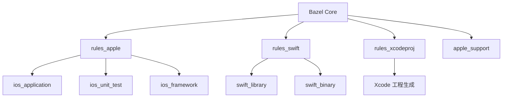
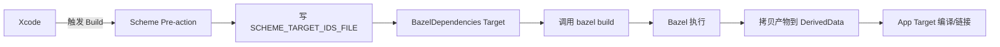
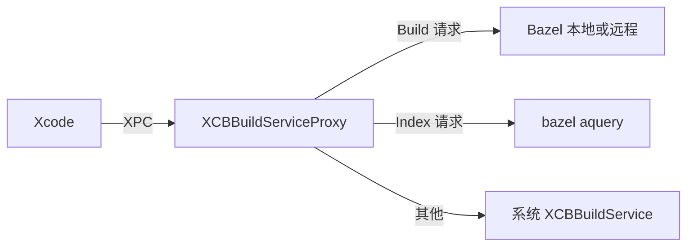
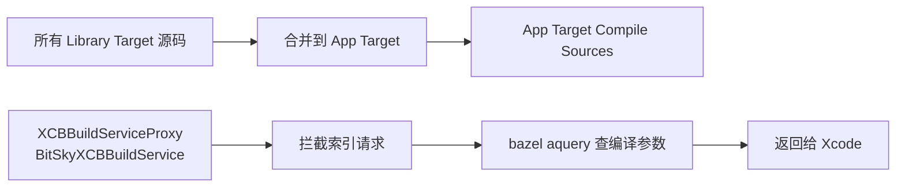
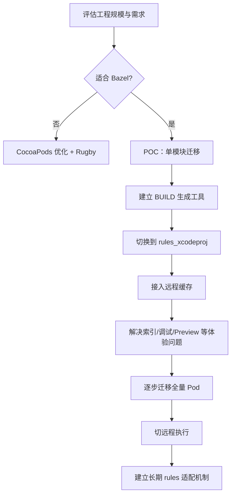

+++
title = "编译优化-Bazel方案"
date = '2026-05-02T22:32:27+08:00'
draft = false
weight = 1
tags = ["iOS", "工程化", "编译"]
categories = ["iOS开发", "工程化"]
+++
当 iOS 工程的规模突破 CocoaPods / Xcode 原生构建体系的舒适区，Bazel 就成为下一代构建系统的首选。字节跳动的头条、抖音、Airbnb、Uber、Lyft、Pinterest、Square、Bilibili 等都已把 iOS 工程迁到 Bazel。本文介绍 Bazel 的核心原理、在 iOS 上的生态（rules_apple / rules_swift / rules_xcodeproj）以及大厂落地实践。

---

## 为什么是 Bazel

CocoaPods + Xcode 在超大工程上的固有瓶颈：

- **粗粒度依赖**：以 Pod / Target 为单位，增量编译颗粒粗
- **隐式依赖**：Build Phases 隐含顺序，难以沙箱化
- **难以远程缓存**：编译环境非 hermetic，hash 易变
- **难以远程执行**：Xcode Build System 绑定本地 macOS

Bazel 针对这些问题从设计之初就提供了：

| 能力 | Bazel | Xcode/CocoaPods |
|-----|-------|-----------------|
| 依赖粒度 | 文件级 | Target 级 |
| 依赖显式化 | 必须声明 | 部分隐式 |
| Sandbox | 默认开启 | 无 |
| 远程缓存 | 原生 | 需第三方（ccache/Rugby） |
| 远程执行 | 原生 | 不支持 |
| 跨语言 | 一流（Swift/OC/C++/Go/Rust/JS） | 主要 Apple 平台 |
| 多平台 | 天生 | iOS/macOS 为主 |

---

## Bazel 核心概念

### Workspace 与 Package

```text
WORKSPACE                     # 仓库根，声明外部依赖
foo/
├── BUILD.bazel               # package，本目录的构建声明
├── main.swift
└── util/
    └── BUILD.bazel           # 子 package
```

- **Workspace**：整个 Bazel 仓库，一个 WORKSPACE 文件一个仓
- **Package**：任何包含 `BUILD.bazel` 的目录
- **Target**：BUILD 文件里的一个 rule 调用，比如 `swift_library(name = "foo")`
- **Label**：Target 的全局 ID，形如 `//foo/util:util`

### Rule

Rule 是构建函数，输入 sources + deps，输出 artifacts：

```starlark
swift_library(
    name = "network",
    srcs = glob(["*.swift"]),
    module_name = "Network",
    deps = [
        "//core:logger",
        "@cocoapods//Alamofire",
    ],
    visibility = ["//visibility:public"],
)
```

Rule 之间通过 label 显式声明依赖，构成 DAG。

### Action

Rule 内部会生成一个或多个 Action：

```text
Action: (inputs, outputs, mnemonic, cmd, env, tools)
```

Action 的 hash 用于缓存查找：输入相同 → 输出相同 → 命中缓存。

### Sandbox

Bazel 默认在 Linux namespace / macOS sandbox-exec 里跑每个 Action：

- 只有显式 inputs 能访问
- 必须显式产出 outputs
- 断绝网络（除非 rule 声明需要）

这种 hermetic 特性是远程缓存命中率的基础。

---

## iOS 上的 Bazel 生态



### rules_apple

由 `bazelbuild/rules_apple` 维护，提供 Apple 平台特有的构建规则：

- `ios_application` / `ios_framework` / `ios_extension`
- `ios_unit_test` / `ios_ui_test`
- 处理 `entitlements`、`provisioning_profile`、`signing`、`asset catalog`

### rules_swift

对应 Swift 编译：
- `swift_library` / `swift_binary`
- 原生支持 WMO、Explicit Modules、Macros
- 对接 `swift-driver` 做增量编译

### rules_xcodeproj

**关键中间件**：把 Bazel 工程生成为 `.xcodeproj`，让开发者依然用 Xcode 编辑/调试，底层跑 Bazel。

2023 年 2 月 rules_xcodeproj 发布正式版，Tulsi（旧方案）宣布停止维护，成为 iOS Bazel 开发的事实标准。

### apple_support

处理 toolchain、SDK 路径、xcrun 等 Apple 特定基础设施。

---

## 构建模式

rules_xcodeproj 提供两种模式：

### Build with Xcode

Xcode 自己接管构建，Bazel 仅负责生成工程。只在 Bazel 6 以下支持，**已弃用**。

### Build with Bazel



实际上 Xcode 仅充当"IDE 外壳"，真正的构建交给 Bazel。优点是所有 Bazel 能力（增量、沙箱、远程缓存、远程执行）都能发挥。

### Build with Proxy

未来方案，基于 `XCBBuildServiceProxy`：



优势：
- 无需 BazelDependencies 占位 Target
- 可以过滤重复的 warning/error
- 索引更稳定
- 进度条细节更丰富

字节 BitSky 已经采用类似方案。代价是每个 Xcode 版本都要适配私有协议，工程量不小。

---

## 字节跳动头条实践

字节公开的 [Monorepo — 基于 Bazel 的 Xcode 性能优化实践](https://developer.volcengine.com/articles/7599494361223299091) 记录了从 Tulsi 迁到 rules_xcodeproj 的实际收益（MacBook Pro M1 Pro 32GB）：

| 指标 | Tulsi | rules_xcodeproj 原生 | rules_xcodeproj + 源码合并 |
|-----|-------|---------------------|--------------------------|
| 工程首次冷启 | 47s | 22s | **16s** |
| 二次启动 | 33s | 16s | **12s** |
| 文件新增 | 20s | 13s | **8s** |
| 文件删除 | 23s | 11s | **6s** |

### 为什么 rules_xcodeproj 更快

Tulsi 工程的卡顿主要来自两点：
1. 保留 Target 间依赖关系（索引需要，但构建不需要）
2. 全源码构建，大量 Target 同时参与索引

rules_xcodeproj 的突破：
- **完全移除 Target 间依赖**，转而让所有 Target 依赖一个 `BazelDependencies` Target
- 索引需要的中间产物（`.swiftmodule`、`.hmap`）通过 Bazel 的 `OutputGroupInfo` 机制一次性生成

### 源码合并方案

纯 rules_xcodeproj 有个副作用：移除 Target 依赖后，"多 Target 共用源文件" 的语法高亮会错乱。字节的补救方案：



两步：
1. **源码合并**：几百个 Library Target 的源码都挂到 App Target 的 Compile Sources
2. **索引参数接管**：XCBBuildServiceProxy 拦截 Xcode 的索引请求，走 Bazel aquery 返回真正参数

最终效果：`project.pbxproj` 行数从 45 万降到 35 万，工程操作耗时减少 60%+。

---

## 其他大厂

### Airbnb

首批把 iOS 切到 Bazel 的公司之一，做了大量 rules_swift / rules_apple 的基础贡献。

### Lyft

在 2019 年就公开了 Bazel iOS 迁移的完整方案，把本地增量构建从 90s 降到 10s。

### Pinterest

贡献了 rules_xcodeproj 的早期版本（PodToBUILD 工具），解决了 CocoaPods 向 Bazel 迁移的主要痛点。

### Bilibili

在 Bazel 基础上做了自有的 Polyrepo 改造，解决了底层库修改成本高、代码共享繁琐的问题。

### Uber

大规模远程执行集群，把单次构建分发到数百台 mac mini，CI 中位数降到 3 分钟以内。

---

## 远程缓存与远程执行

Bazel 最大的差异化优势：

### Remote Cache

```text
build --remote_cache=grpc://cache.internal:8980
build --remote_upload_local_results=true
```

- CI 构建的每个 Action 结果上传到缓存
- 开发者本地触发构建时优先查缓存命中
- 一次 clean build 后续团队全员受益

典型命中率 70–90%，与代码改动频率成反比。

### Remote Execution

```text
build --remote_executor=grpc://rbe.internal:8980
build --extra_execution_platforms=//platforms:linux_x86_64
```

- Action 不在本地执行，推送到远端集群
- 需要工具链可重定位（toolchain resolution）
- macOS 远程执行依赖 Apple 的 SLA（苹果硬件集群）

---

## 从 CocoaPods 迁移

### PodToBUILD

Pinterest 开源的 [`PodToBUILD`](https://github.com/pinterest/PodToBUILD) 自动把 podspec 转成 Bazel rules：

```text
# Podspec
Pod::Spec.new do |s|
  s.source_files = 'AFNetworking/*.{h,m}'
  s.public_header_files = 'AFNetworking/AFNetworking.h'
  s.frameworks = 'MobileCoreServices', 'SystemConfiguration'
end

# 生成的 BUILD
objc_library(
  name = "AFNetworking",
  srcs = glob(["AFNetworking/*.m"]),
  hdrs = glob(["AFNetworking/*.h"]),
  sdk_frameworks = [
    "MobileCoreServices",
    "SystemConfiguration",
  ],
)
```

### rules_cocoapods

部分团队也选择 `rules_cocoapods`，在 WORKSPACE 级用 Bazel 直接消费 CocoaPods。

---

## 取舍

Bazel 不是免费午餐，引入成本不低：

### 代价

- **学习曲线**：Starlark DSL、BUILD 文件维护
- **迁移成本**：几万个 Pod/Target 的 BUILD 生成与维护
- **Xcode 体验**：工程生成延迟、索引延迟、调试体验微调
- **生态适配**：SwiftUI Preview、XCTest、Asset Catalog 都需要特殊适配
- **Xcode 版本适配**：每次 Xcode 升级 rules 可能需要对应升级

### 适合场景

| 工程规模 | Bazel? |
|---------|--------|
| < 50 个 Pod | 不推荐，收益小于成本 |
| 50–200 Pod | 可评估，优先 Rugby + CocoaPods 优化 |
| 200+ Pod | 推荐，但要有专职工程化团队 |
| 多端统一代码（iOS+Android+Web） | 强烈推荐 |
| 大规模 CI + 远程执行需求 | 必须 |

---

## 实施路径



每一步都会暴露一批新问题，工程化团队至少要 2–3 人全职支撑。

---

## 总结

Bazel 是 iOS 编译优化的"终极方案"，但也要求组织具备以下条件：

1. 超大工程规模（200+ Pod 或多人/多团队协作）
2. 有专职工程化团队长期维护
3. 愿意接受 Xcode 工具链的深度改造
4. CI 基础设施足以支撑远程缓存/执行

满足条件的组织，Bazel 能带来数量级的编译加速；不满足条件，坚持用 CocoaPods 优化 + 二进制化 + 编译缓存的组合方案往往是更务实的选择。
