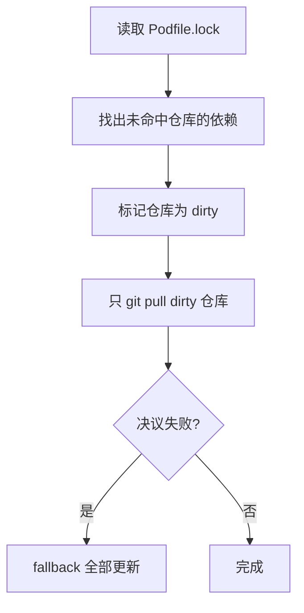
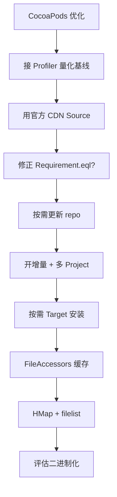

+++
title = "编译优化-CocoaPods优化"
date = '2026-05-02T22:32:27+08:00'
draft = false
weight = 2
tags = ["iOS", "工程化", "编译"]
categories = ["iOS开发", "工程化"]
+++
在 iOS 生态中，CocoaPods 依然是大多数中大型工程的依赖管理工具。当 Pod 数量达到几百个子组件上千个时，`pod install` 的耗时会变成研发流程里的硬性卡点。抖音在其 `seer-optimize` 项目中系统化地优化了 CocoaPods 的整个生命周期，全量 Pod Install 耗时减少 50%、增量减少 65%。本文系统介绍这些优化背后的原理。

关于 CocoaPods 整体架构的深度介绍可以参考 [CocoaPods源码导读-架构总览]()。

---

## Pod Install 耗时构成

`Installer#install!` 的六个阶段：


抖音公开的典型耗时分布：

| 阶段 | 典型耗时 | 说明 |
|-----|---------|------|
| prepare | < 0.01s | 初始化 |
| **resolve_dependencies** | 数秒到数分钟 | 依赖决议，瓶颈 |
| **download_dependencies** | 数秒到数分钟 | 依赖下载，IO 密集 |
| validate_targets | 0.1s | 校验 |
| **generate_pods_project** | 数秒到数十秒 | 生成 xcodeproj |
| integrate_user_project | 0.01s | 集成主工程 |

---

## resolve_dependencies 优化

### Source 仓库更新

默认 CocoaPods 在 `pod install --repo-update` 时会更新**所有** source 仓库。抖音改造为：



**按需更新**能把 10+ 个私有 source 的大工程 source 更新从 30s 压到 3s。

### 并发同步锁

CI 上并发执行 Pod 命令会出现 Git 仓库锁冲突，表现为 `Cannot lock ref` 或 Pod Install 直接失败。解决：

```ruby
File.open(repo_lock_path, File::RDWR | File::CREAT) do |f|
  f.flock(File::LOCK_EX)
  update_repo!
end
```

- `flock` 使用 OS 级文件锁保证进程间互斥
- 比"每个 CI 单独一份 `CP_REPOS_DIR`"节省磁盘
- 比"机器串行"保留并发度

### Specification 缓存

CocoaPods 1.8.0 已经引入 specification 缓存，但存在 BUG：缓存 key 用 `Pod::Requirement` 对象，而该类未实现 `eql?`，导致缓存命中率极低。

修复：

```ruby
module Pod::Requirement
  def eql?(other)
    @requirements.eql? other.requirements
  end
end
```

加上这四行 monkey patch，Molinillo 决议速度在大工程上可提升数倍。

### 简化决议

`Molinillo` 基于 DAG 做回溯求解，能处理版本约束冲突、自动降级等复杂场景。但大部分"本地开发 pod install"场景，Podfile.lock 已经锁定了决议结果，不需要重新跑 Molinillo：

```ruby
class Pod::Installer
  def quick_install!
    prepare
    quick_resolve_dependencies   # 直接使用 Podfile.lock
    download_dependencies
    ...
  end
end
```

线性决议的时间复杂度从 O(V×E) 降到 O(V)，增量安装时收益明显。

### 循环依赖定位

原生 CocoaPods 的循环依赖报错：

```text
There is a circular dependency between A/S1 and D/S1
```

只知道起止，中间链路得靠人肉 grep。抖音改造成深度优先搜索所有可能路径：

```text
There is a circular dependency between A/S1 and D/S1
Possible Paths:
  A/S1 → B → C → D/S2 → D/S1 → A/S1
  A/S1 → B → C → C2 → D/S2 → D/S1 → A/S1
```

原理是基于 Molinillo 的 `DependencyGraph` 再跑一次 `find_all_paths`，对定位效率是数量级提升。

---

## download_dependencies 优化

### 并发下载

默认 CocoaPods 串行下载依赖，瓶颈是网络延迟而非带宽。并发下载：

```ruby
require 'concurrent'
pool = Concurrent::FixedThreadPool.new(8)
pods.each do |pod|
  pool.post { download(pod) }
end
pool.shutdown
pool.wait_for_termination
```

抖音的数据：并发后下载时间减少 60% 以上。

### HTTP API 替代 Git

对于 Git 源的依赖，CocoaPods 默认 `git clone`，会：
- 下载完整 Git 历史（对大仓库是灾难）
- 做大量 ref 处理和校验

改造：基于 GitLab / GitHub API 把 Git 地址转成 HTTPS 归档下载：

```ruby
# GitLab API
https://gitlab.com/api/v4/projects/:id/repository/archive.tar.gz?sha=COMMIT

# GitHub API
https://api.github.com/repos/:owner/:repo/tarball/COMMIT
```

带来的好处：
- 避免下载 Git 历史（有时比代码还大）
- 用上 HTTP 缓存和 CDN
- 稳定性好于 git clone

### 软链接替代拷贝

CocoaPods 默认把 `$HOME/Library/Caches/CocoaPods/` 里的缓存**拷贝**到 `Pods/` 沙盒。对于多工程用户、超大工程，这一步耗时可观。

抖音改成：

```ruby
FileUtils.ln_s(cache_path, sandbox_path)
```

用符号链接替代拷贝：
- 消除 60s 左右的拷贝耗时
- 减少磁盘占用
- 所有工程共享同一份缓存

注意事项：对 Xcode Workspace 配置的影响、用户不要手动改 Pods 文件。

### 缓存有效性

CocoaPods 存在一个低级 BUG：`path.sub_ext('.podspec.json')` 会把版本号里的 `.8-5cd57` 误识别为扩展名：

```ruby
# Before
Pods/SDWebImage/0.1.8-5cd57 → 0.1.podspec.json  # 错误！

# After
Pods/SDWebImage/0.1.8-5cd57 → 0.1.8-5cd57.podspec.json
```

这会导致部分新版本的缓存被误判为旧版本，出现下载失败后缓存仍然"有效"的诡异问题。修复：

```ruby
def path_for_spec(request, slug_opts = {})
  path = root + 'Specs' + request.slug(slug_opts)
  Pathname.new(path.to_path + '.podspec.json')
end
```

---

## generate_pods_project 优化

### 增量安装

CocoaPods 1.7+ 提供了两个关键 Feature：

```ruby
install! 'cocoapods',
  :generate_multiple_pod_projects => true,
  :incremental_installation => true
```

- **multiple_pod_projects**：每个 Pod 一个独立的 `.xcodeproj`，Xcode 索引更快
- **incremental_installation**：基于上次缓存只重新生成变化的 Pod

抖音数据：二次 Pod Install（增量）耗时约为首次的 40%。

### 单 Target / Configuration 安装

大工程一般有多个 Target（主 App、Watch、Extension、UI Test...）和多个 Build Configuration（Debug/Release/Beta...）。默认 CocoaPods 全量安装所有 Target、所有 Configuration。

但本地开发只用其中一个 Target × 一个 Configuration。按需安装：

```ruby
# Podfile
install! 'cocoapods', :target_mode => :development_active_only
```

收益：
- 跳过其他 Target 依赖的下载、生成、集成
- 工程文件规模减小，Xcode 索引快 60%
- 提前发现链接依赖遗漏（原生 OC 消息转发会把问题推到运行时）

### FileAccessors 缓存

CocoaPods 在生成 Pods 工程时要扫描每个 Pod 目录：

- `glob_cache`：按 spec 的 `source_files` / `headers` / `resources` 配置 glob 文件
- 静态库检测：分析二进制判断是 dylib 还是 static
- 目录遍历

这些扫描数据对固定版本的 Pod 是稳定的，可以缓存：

```ruby
# $HOME/Library/Caches/CocoaPods/FileAccessors/<podname>/<version>.json
{
  "source_files": [...],
  "public_headers": [...],
  "resources": [...],
  ...
}
```

抖音数据：Clean Install 减少 36%，No-clean Install 减少 42%。

这一层缓存还顺带解决了一类稳定性问题：如果用户不小心删了缓存里的某些文件（比如二进制库），CocoaPods 默认不会发现，只会在链接阶段爆 Symbol Not Found。缓存层可以做完整性校验，提前触发重新下载。

### 提高编译并发度

CocoaPods 会给每个 Pod Target 加上 target dependency，保证依赖被先编译。但**静态库 Pod 之间其实不需要产物依赖**（链接时才真正合并），强行依赖会减少编译并发度。

抖音改造：

```ruby
post_install do |installer|
  installer.pod_targets.each do |pod_target|
    next unless pod_target.static_library?
    pod_target.remove_dependencies  # 只对静态库 Target 生效
  end
end
```

生效后 Xcode 构建图更宽，CPU 利用率显著提升。注意：

- 只能对**静态库** Target 做（动态库需要 `.dylib` 产物）
- 清理 Dependent Pod Subproject 也能减少 Xcode 索引混乱

---

## integrate_user_project 优化

### Arguments Too Long

超大工程链接失败的经典错误 `Arguments Too Long` 根因是 `Build Settings` 里的 `HEADER_SEARCH_PATHS` / `FRAMEWORK_SEARCH_PATHS` / `LIBRARY_SEARCH_PATHS` / `OTHER_LDFLAGS` 累积超过 Unix `ARG_MAX`。

解决参见：
- [编译优化-头文件与HMap]()：用 HMap 合并 Header Search Path
- [编译优化-链接优化]()：用 filelist 合并链接参数

### 新增文件免 pod install

组件 A 新增了一个 `.h`，依赖它的组件 B 编译时会报 `file not found`，因为：

- A 的 `public_headers` 通过 `Pods/Headers/Public/A/` 符号链接索引
- 新增头没有被索引到，B 的 `HEADER_SEARCH_PATH` 找不到

传统解决：重新跑一次 `pod install`。抖音改造：

```ruby
# 编译期 hook
pre_compile_hook do |target|
  A.public_headers.each do |header|
    symlink(header, "Pods/Headers/Public/A/#{header.basename}")
  end
end
```

在编译 hook 里自动补全符号链接，无需 pod install。这类小改动 DX 提升巨大。

### Lockfile-only 生成

某些 CI 场景只需要验证 `Podfile.lock`（比如 `pod check`）不需要完整 install：

```ruby
class Pod::Installer
  def quick_generate_lockfile!
    quick_prepare_env
    quick_resolve_dependencies
    quick_write_lockfiles
  end
end
```

执行时间从分钟级降到秒级。

---

## Profiler

优化前先观测，抖音做了一套阶段 Profiler：

```text
install! consume              : 5.376132s
  prepare consume             : 0.002049s
  resolve_dependencies consume: 4.065177s
  download_dependencies       : 0.001196s
  validate_targets consume    : 0.037846s
  generate_pods_project       : 0.697412s
  integrate_user_project      : 0.009258s
```

原理是在 CocoaPods 的关键方法（`Pod::Installer#install!`、`Downloader#download` 等）上 monkey patch 打点，通过 `Process.clock_gettime(Process::CLOCK_MONOTONIC)` 记录起止，同时按"阶段 → 步骤 → 子步骤"树形上报。

上报到远端后可以做：
- 趋势监控（每日 P50/P90）
- 异常告警（耗时陡增）
- 稳定性（失败率与错误日志）

详见 [编译优化-观测]()。

---

## CDN Source

CocoaPods 1.9+ 支持 [CDN Specs](https://cdn.cocoapods.org/)：

```ruby
source 'https://cdn.cocoapods.org/'
```

CDN Source 的优势：
- **不克隆 Git 仓库**：按需 HTTP GET 某个 podspec
- **无并发锁问题**：没有本地 .git 目录
- **首次 Pod Install 更快**：不下载几 GB 的 Specs Git 历史
- **跨机器易复制**：CI 镜像更小

对大型内部私有仓，抖音也在从 Git Source 迁到自建 CDN Source，架构收益显著。

---

## 落地清单



从易到难依次推进，每一步都配合 Profiler 验证收益。最终大工程的 Pod Install 从数分钟降到数十秒是完全可以做到的。抖音 `seer-optimize` 目前尚未开源，但其思路已成为业内共识，可以直接作为自研优化的蓝本。
