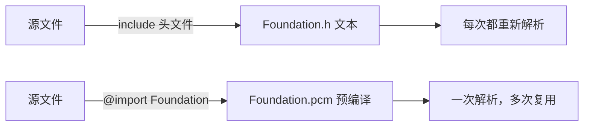
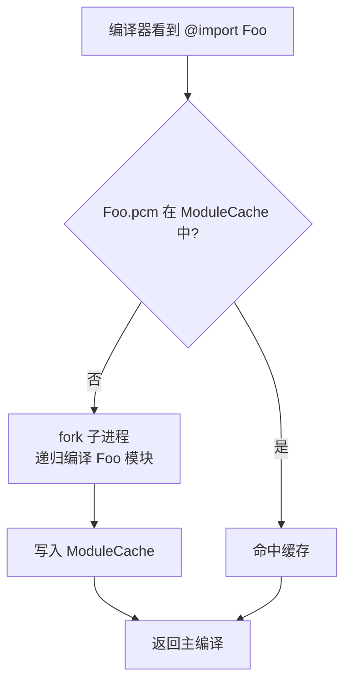
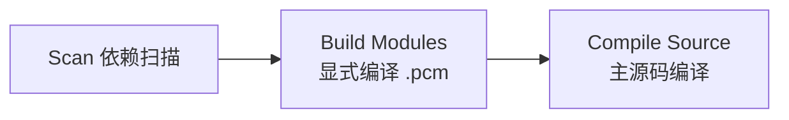
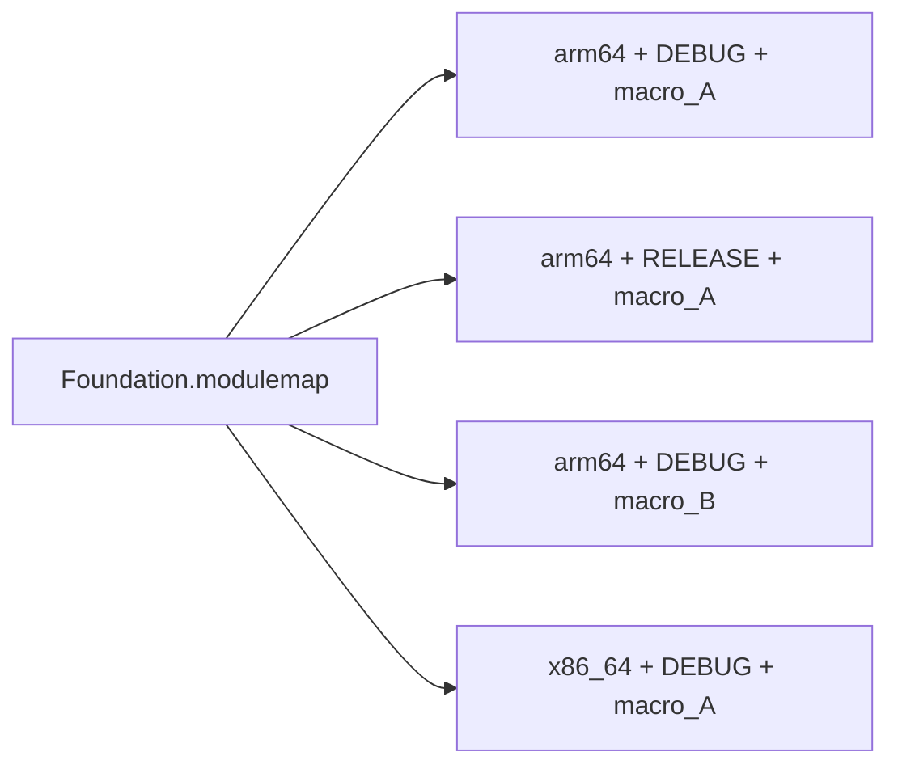
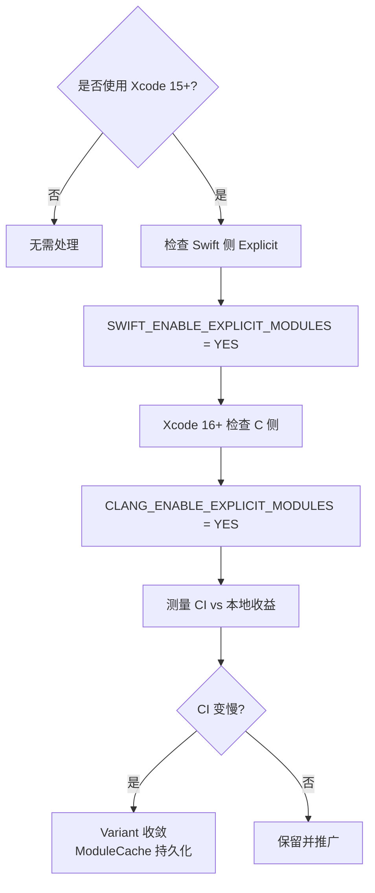

+++
title = "编译优化-Explicit Modules"
date = '2026-05-05T00:41:41+08:00'
draft = false
weight = 3
tags = ["iOS", "工程化", "编译"]
categories = ["iOS开发", "工程化"]
+++
Apple 从 Xcode 15 开始在 Swift 上引入 Explicit Modules，Xcode 16 在 C/C++/Objective-C 上全面铺开，Xcode 17 进一步默认启用并与细粒度依赖追踪结合。这是近五年 Apple 构建系统最重要的一次变革，直接影响到大部分项目的编译模型。

---

## 模块（Module）基础

### 为什么需要模块

C 家族语言的 `#include` 机制有两个致命问题：

1. **文本替换**：头文件是纯文本替换，每个源文件都要重新解析一遍所有包含的头文件
2. **宏污染**：先引入的头文件宏会影响后续头文件的行为，没有隔离

Clang 在 2012 年引入 **Clang Modules**，用一个预编译的二进制模块（`.pcm`）替代文本包含，同一 module 在一次构建里只解析一次。Swift 的 `.swiftmodule` 从设计之初就是模块化的。



### 模块的组成

| 类型 | 载体 | 描述 |
|-----|------|------|
| Clang Module | `.pcm` | C/OC 模块的序列化 AST |
| Swift Module | `.swiftmodule` | Swift 模块的接口 + SIL |
| Swift Interface | `.swiftinterface` | 可被不同 Swift 版本解析的文本接口 |
| Module Map | `module.modulemap` | 描述哪些头文件构成某个 module |

---

## Implicit Modules 的问题

### 原理

在 Xcode 16 之前，Clang Modules 以 **隐式** 方式工作：



`ModuleCache`（MCP）是一个全局 on-disk LRU 缓存（位于 `DerivedData/ModuleCache.noindex`）。问题在于：

1. **变体爆炸**：同一个模块在不同上下文（宏、架构、优化级别）下产生不同的 `.pcm`，每个都独立编译并占用缓存
2. **锁竞争**：多个 clang 进程并发要写 MCP，要加文件锁
3. **隐式 fork**：编译中途 fork 出子编译器，无法被 Xcode Build Timeline 观测到
4. **锯齿式 CPU**：主编译 → fork module 编译 → 主编译 → fork…… CPU 曲线抖动严重

对于一个几百模块的大工程，ModuleCache 常常涨到几个 GB，且命中率在 CI 冷启动时几乎为 0。

---

## Explicit Modules 的核心思想

Explicit Modules 把"在主编译里临时 fork 模块编译"改成"先统一规划、再显式执行"，把编译流程拆成 3 个阶段：



| 阶段 | 工具 | 产物 |
|-----|------|------|
| Scan | `clang-scan-deps` / Swift Driver | 依赖图 JSON |
| Build Modules | `clang -emit-module` / `swift-frontend -emit-pcm` | `.pcm` / `.swiftmodule` |
| Compile Source | 主 `clang` / `swift-frontend` | `.o` |

### Scan 阶段

Clang 新增 `clang-scan-deps` 工具，它以最小代价预扫描源文件，输出类似：

```json
{
  "translation-units": [{
    "file-deps": ["/path/main.m"],
    "commands": [{
      "clang-module-deps": [
        { "module-name": "Foundation", "context-hash": "ABC123..." },
        { "module-name": "UIKit", "context-hash": "ABC123..." }
      ]
    }]
  }]
}
```

context-hash 把所有影响模块编译结果的参数（target、宏、SDK、deployment target…）哈希到一起。相同 hash 的同名模块在一次构建里就能共享同一个 `.pcm`。

### Build Modules 阶段

Xcode Build System 把 Scan 得到的模块依赖图注入 llbuild，作为**普通的 task**插入到 DAG 中。`.pcm` 的编译：

- 可以与无关的主编译并行
- 在 Build Timeline 可见（透明度清晰）
- 所有参数由显式命令控制，不再隐式 fork

### Compile Source 阶段

主编译器不再有权生成 `.pcm`，必须通过 `-fmodule-file=` 显式喂入已经编译好的模块：

```bash
clang -c main.m \
  -fmodule-file=Foundation=/path/Foundation-abc.pcm \
  -fmodule-file=UIKit=/path/UIKit-abc.pcm \
  ...
```

---

## Swift 侧的 Explicit Modules

Swift Driver 从 5.7 开始支持 Explicit Modules，Xcode 15+ 默认开启。流程类似：

1. Driver 发出 scan 任务，扫描源文件的 `import` 图（含间接依赖）
2. 为每个依赖模块生成 `-emit-pcm`（Clang 依赖）或 `-compile-module-from-interface`（Swift 依赖）任务
3. 主编译任务用 `-explicit-swift-module-map-file` 传入模块映射表

Swift 的特殊之处在于 Swift module 可以有 Clang overlay（`@_exported import Foundation`），scan 要同时在 Swift 和 Clang 两个维度展开。

---

## 收益与代价

### 收益

- **并行度更高**：`.pcm` 编译完全与主编译错开，CI 上典型 clean build 有 10–30% 的加速
- **可观测**：Build Timeline 能清楚看到每个模块的编译时机
- **缓存更稳**：`.pcm` 落盘在 `DerivedData/ModuleCache`，重复利用性明显改善
- **与 sandbox 兼容**：所有 input/output 显式化，便于 Bazel/Tuist 等远程执行系统利用

### 代价

Medium 上有作者统计 Xcode 17 上线后 CI clean build 变慢：

| 场景 | Implicit | Explicit | 变化 |
|-----|---------|---------|------|
| 本地增量 | 基准 | 快 20–40% | 改善 |
| 本地 clean | 基准 | 快 5–10% | 改善 |
| CI clean（缓存冷） | 基准 | 慢 10–20% | 劣化 |

**原因**：CI 上 `DerivedData` 每次都从零开始，Explicit Modules 要求把每个 Variant 都显式编译一遍，而 Implicit 下只会在被用到时才编译。

---

## 减少模块变体

Explicit Modules 的性能高度取决于模块变体（variant）数量。相同模块在不同编译单元上下文下会被切成多份：



每一种（架构 × 配置 × 宏集合）都产生独立 `.pcm`。减少变体是 Apple 官方的第一优化建议：

### 统一编译参数

多个 Target 如果 `Preprocessor Macros`、`C Language Dialect`、`Swift Active Compilation Conditions` 等设置不同，就会切出不同 variant。

典型做法：

- 把业务宏尽可能从 Build Settings 下沉到代码（`#if DEBUG` 对应 `DEBUG=1` 标准宏已足够）
- 用共享 `.xcconfig` 统一 Pod 的参数
- 对 CocoaPods：利用 `post_install` hook 扫描并对齐各 Pod 的 Other C Flags

### 关闭不必要的架构

Xcode 15+ 在 Apple Silicon 上默认编译 `arm64` + `x86_64`。如果本地只用 M 系列，设置 `ONLY_ACTIVE_ARCH=YES` 能减半 variant 数量。

### 合并相似 Target

CocoaPods 多 Pod 导致的 Target 爆炸会让 variant 爆炸。合并 Pod（如抖音的"大 Pod"策略）或通过 Bazel 统一 build graph 都能显著缓解。

---

## Xcode 17 的进一步改进

Xcode 17 在 Explicit Modules 基础上引入了更细粒度的依赖：

1. **细粒度 Swift 模块依赖**：把 swiftmodule 内部的 symbol 拆解为更小的 unit，只有真正使用的 symbol 改变才传播
2. **更好的 scan 结果复用**：scan 结果会被缓存在 build cache 里，相同输入不再重扫
3. **Swift 6.2 并发 + Explicit Modules**：concurrency check 的诊断信息被编码进 module interface，增量正确性进一步提升

Apple 官方数据：中等规模项目 clean build 25–40% 更快，但大厂反馈 CI clean 的首次构建仍有劣化。

---

## 实践建议



可落地的检查清单：

1. **Xcode 15+**：打开 Build Settings 的 `Enable Explicit Modules`（Swift/Clang 各一个）
2. **统一宏**：`grep -r "GCC_PREPROCESSOR_DEFINITIONS" ./Pods` 找出差异
3. **统一 SDK/Deployment**：保证所有 Pod 的 `IPHONEOS_DEPLOYMENT_TARGET` 一致
4. **持久化缓存**：CI 将 `DerivedData/ModuleCache.noindex` 纳入缓存（GitHub Actions `actions/cache`、Bitrise Cache Pull 等）
5. **观测**：用 [编译优化-观测]() 中的方法对比开启前后的 clean / incremental 耗时

Explicit Modules 是一个需要综合评估的优化——在本地开发机、CI 冷启动、CI 带缓存三种场景下表现截然不同，不能跟风默认打开，务必先量化再决定。
