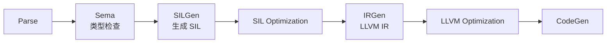
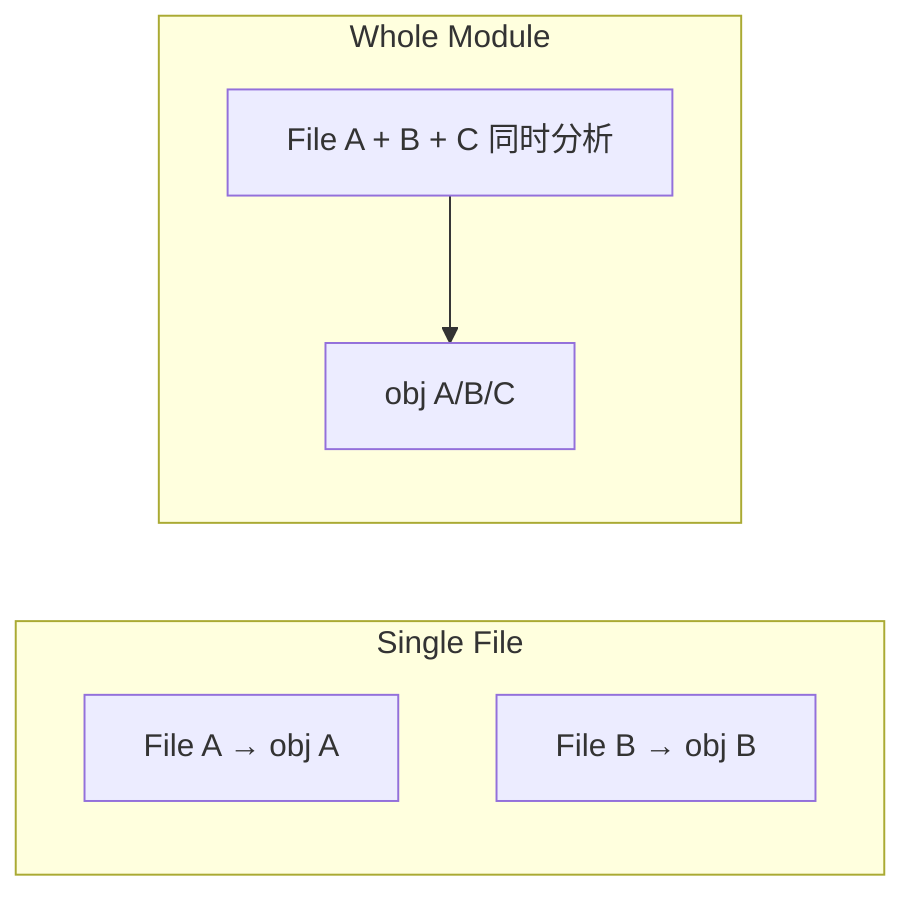
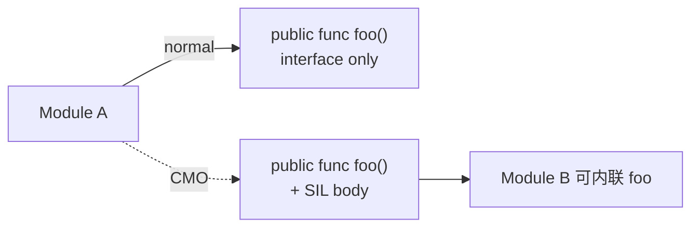
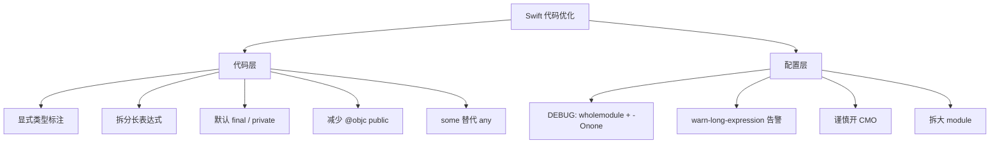

+++
title = "编译优化-Swift编译优化"
date = '2026-05-02T22:32:27+08:00'
draft = false
weight = 4
tags = ["iOS", "工程化", "编译"]
categories = ["iOS开发", "工程化"]
+++
Swift 的类型推导、泛型约束求解、WMO / CMO 是编译性能的核心影响因素。理解它们能让源码层面的小改动带来显著的编译加速。本文聚焦"代码写法 + 编译开关"两方面的优化。

---

## Swift 编译流程速览

相比 C/OC，Swift 编译多出大量工作：



其中 **Sema（语义分析）** 阶段负责类型推导，是 Swift 特有的性能热点。`-debug-time-compilation` 看到的 "Type checking" 时间基本都集中在这里。

---

## 类型推导与 "Too Complex" 错误

### 约束求解

Swift 的类型系统比大多数语言复杂：

- 函数重载 + 运算符重载
- 隐式字面量类型（`Int`、`Double`、`Float80`…）
- 泛型 + 协议 + 关联类型
- 闭包参数类型推导
- SwiftUI 风格的 ViewBuilder / Result Builders

遇到表达式 `let x = a + b * c - d`，编译器需要给 `+ * -` 每个运算符枚举所有可能的重载，在多个候选里做约束传播。当候选组合爆炸时，Sema 会放弃并抛出：

```text
Expression was too complex to be solved in reasonable time;
consider breaking up the expression into distinct sub-expressions
```

Apple 默认的超时阈值约 15 秒。一旦触发，即使最终构建成功，也意味着该表达式消耗了大量 CPU。

### 典型触发点

```swift
// 1. 多运算符链
let total = [1, 2, 3]
    .map { String($0) }
    .compactMap { Int($0) }
    .reduce(0, +)

// 2. 字面量推导
let price: Double = 1 + 2 * 3 / 4 - 5

// 3. SwiftUI 链式
VStack {
    if condition {
        Text("a")
    } else if other {
        Text("b")
    } else {
        Text("c")
    }
}.padding().background(.red).cornerRadius(10)
```

### 优化手法

```swift
let strings: [String] = [1, 2, 3].map { String($0) }
let ints: [Int] = strings.compactMap { Int($0) }
let total: Int = ints.reduce(0, +)

let a: Double = 1
let b: Double = 2 * 3
let price: Double = a + b / 4 - 5

@ViewBuilder
var body: some View {
    if condition {
        Text("a")
    } else if other {
        Text("b")
    } else {
        Text("c")
    }
}
```

**核心原则**：

1. **显式类型标注**，减少字面量推导路径
2. **拆分长链**，每个子表达式独立类型推导
3. **抽取闭包参数类型**，避免闭包内再次重载推导
4. **`@ViewBuilder` 拆子视图**，避免单个 body 承载过多分支

### 告警阈值

配合 [编译优化-观测](./编译优化-观测.md) 中的参数，开启：

```text
-Xfrontend -warn-long-expression-type-checking=100
-Xfrontend -warn-long-function-bodies=200
```

让所有超过 100ms 的表达式以 warning 暴露出来，在 CI 上作为硬指标治理。

---

## Whole Module Optimization (WMO)

### 原理

WMO（又叫 `wholemodule`）让 swiftc 一次看到整个 module 的所有源文件，相比 single-file / batch 模式：



收益：

- **跨文件内联**：inline 小函数到调用方
- **泛型特化**：把泛型实例化成具体类型的特化版本
- **死代码消除**：未被调用的 internal 函数直接去掉
- **属性访问优化**：访问 ObjC-nonvisible 的 Swift 属性不再走动态派发

Apple 官方数据：WMO 在 CPU 密集场景可以带来 **2–5 倍** 运行时性能提升。

### Mode vs Optimization Level

Xcode 里有两个容易混淆的设置：

| Build Setting | 作用 | 可选值 |
|--------------|------|-------|
| `SWIFT_COMPILATION_MODE` | 编译单元划分 | `singlefile` / `wholemodule` |
| `SWIFT_OPTIMIZATION_LEVEL` | 优化强度 | `-Onone` / `-O` / `-Osize` |

四种常见组合：

```text
DEBUG       : singlefile + -Onone   -> 编译快, 运行慢, 增量友好
RELEASE(旧) : wholemodule + -O      -> 运行最快, 增量差
DEBUG(推荐) : wholemodule + -Onone  -> 编译中等, 运行中等, 跨模块 import 快
RELEASE     : wholemodule + -O      -> 默认
```

### WMO + Incremental

Swift 5.1+ 支持 `wholemodule + incremental`：只要 module 接口没变，driver 不会重编整个 module，只重编改动文件。这是 Xcode 15 默认 DEBUG 也开启 `wholemodule` 的理论前提。

实际项目里大 module 仍然容易触发全量重编，优化手段：
- 拆分过大的 framework
- 用 `internal` / `private` 隔离接口
- 避免 `@inlinable` / `@usableFromInline` 滥用

---

## Cross Module Optimization (CMO)

WMO 的"module"边界是一个 framework / static library。默认 Swift 不会跨 module 做内联。**CMO**（`-cross-module-optimization`）开启后，允许 Swift 把 internal 的函数体序列化到 `.swiftmodule` 的 SIL 区，下游模块可以在编译期内联。



配置：

```text
SWIFT_ENABLE_CMO = YES
-Xfrontend -cross-module-optimization
```

**代价**：

- `.swiftmodule` 文件明显变大
- 改 A 的 internal 代码会触发 B 重新编译（增量劣化）
- 社区有 issue 报告 `-cross-module-optimization` 让 `SimplifyCFG` 卡死，对模板/泛型密集代码要实测

CMO 通常只在 Release 开启，并要配合 [编译优化-二进制化](./编译优化-二进制化.md) 一起评估。

---

## 访问控制与增量编译

Swift 的增量编译粒度取决于可见性边界：

| 修饰符 | 影响范围 | 改动传播 |
|-------|---------|---------|
| `private` / `fileprivate` | 当前文件 | 只重编该文件 |
| `internal` | 当前 module | 重编 module 内依赖方 |
| `public` / `open` | 所有 import 方 | 传播到所有下游 module |

**实践**：

- **默认写 `private`**，需要 `internal` 时再显式加
- `public` / `open` 一定要慎用，尤其在 framework 中
- 用 `@_spi(SubsystemName)` 暴露"内部 public"，避免纳入正式 ABI

每一个 `public` 的增加都相当于给整张模块依赖图增加了一条传染边。

---

## 泛型与协议

### 泛型特化

Swift 泛型默认走 "reabstraction thunk"（类型擦除调用）方式编译，运行时通过 VWT（Value Witness Table）动态分发。开启优化后，编译器对具体类型使用点做**特化（specialization）**，生成专门版本。

- **`@inlinable` + public generics**：允许跨 module 特化
- **`@_specialize(where T == Foo)`**：显式让编译器生成某个特化版本
- **避免过度泛型**：通用的 "Any-hashable" 参数会退化为动态分发，性能差且编译慢

### 协议与存在类型

协议类型（existential）`any Protocol` 比泛型约束 `some Protocol` 昂贵：前者走动态分发，后者可被特化。Swift 5.7+ 要求 `any` 关键字让这一区别显式化：

```swift
func slow(_ x: any Drawable) { x.draw() }
func fast<T: Drawable>(_ x: T) { x.draw() }
func alsoFast(_ x: some Drawable) { x.draw() }
```

---

## 混编优化（ObjC ↔ Swift）

### 生成的桥接

每个混编 target 会产生：

- `Module-Swift.h`：Swift 导出给 OC 的声明
- `Module.swiftmodule`：Swift 导出给 Swift 的接口

`Module-Swift.h` 是 **所有 `@objc public` API 的集合**，任何 Swift public 变动都会改动它，导致所有 #import 它的 OC 文件重编。

优化手段：

1. **减少 `@objc public`**：只把必须给 OC 用的加
2. **拆分对外接口**：把 OC 需要的部分单独放到一个 `*.swift` 文件里
3. **用桥接专用 framework**：把暴露给 OC 的 Swift 代码抽出独立 framework，隔离重编范围

### 桥接头文件

`SWIFT_OBJC_BRIDGING_HEADER` 是给 Swift 看 OC API 的入口。它会被每个 Swift 编译单元重解析，所以：

- 尽量少包含头文件
- 避免在里面引入大型框架（改用 `@import` ObjC module）

---

## 静态分发与 final

Swift 类方法默认 **动态分发**（vtable），结构体是 **静态分发**。`final` 和 `private` 能让编译器优化为静态分发，既加速运行时又减少 Sema 开销（不用再考虑子类重写）。

```swift
final class Logger { ... }

class Parent {
    private func helper() { ... }  // private 隐含可去虚拟化
}
```

对 App 层（非 framework）的类，建议默认加 `final`。

---

## 宏（Swift Macros）

Swift 5.9+ 引入的宏系统会触发 swift-frontend 额外启动宏插件进程展开。宏对编译速度是双刃剑：

- **减少重复代码**：自动生成样板，避免人工维护
- **增加前端耗时**：每个使用点都要跑宏插件
- **影响增量**：宏实现变化会污染所有使用方

实践建议：

- 宏实现要打到独立 plugin target
- 保证宏插件 pre-built（Xcode 15.1+ 会缓存）
- 高频使用的宏应评估展开产物大小，避免放大编译单元

更多可见 [Swift宏](../../ios-basics/Swift宏.md)。

---

## 可落地的优化清单



Swift 源码层的微观优化很多不是为了"编译更快"，而是为了"避免编译更慢"。一个没加类型标注的字典字面量可能消耗数秒的 Sema，而加一行类型就回到毫秒级。把它作为 code review checklist 比事后补救高效得多。
