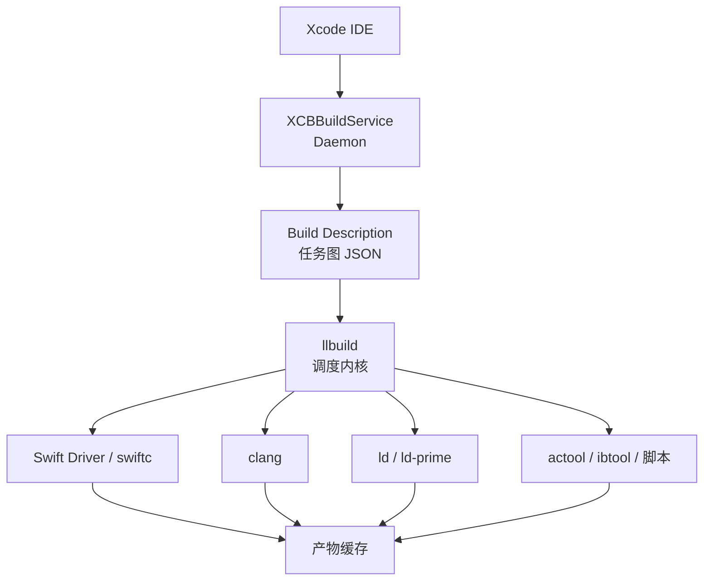
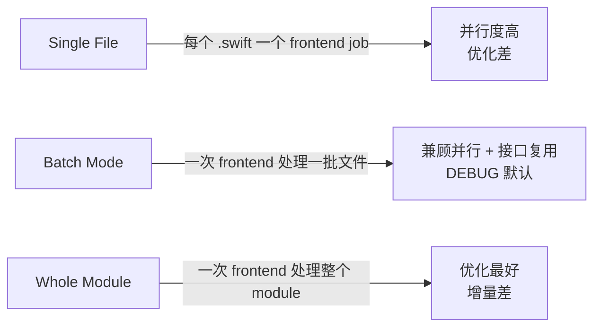
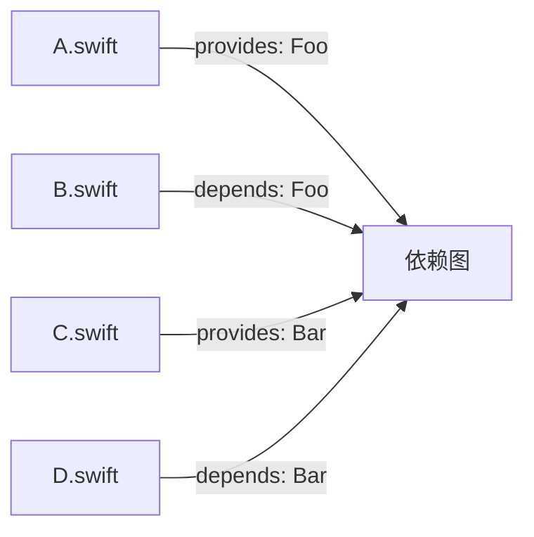
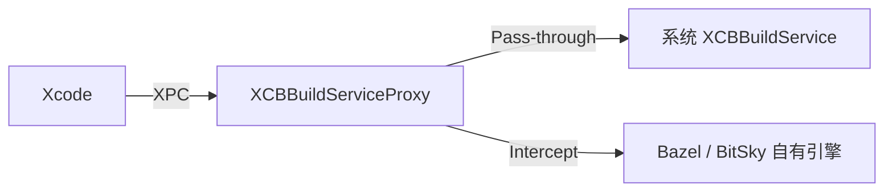

+++
title = "编译优化-Xcode构建系统"
date = '2026-05-02T22:32:27+08:00'
draft = false
weight = 5
tags = ["iOS", "工程化", "编译"]
categories = ["iOS开发", "工程化"]
+++
Xcode 的构建系统由多个组件协同完成，从 `Cmd+B` 到生成 `.app` 经历了完整的任务图构建、依赖分析、并行调度流程。理解这套体系是后续一切优化的基础。

---

## 构建系统组成

Xcode 10 之后默认采用 **Swift Build System**（基于 llbuild），整体架构如下：



| 组件 | 职责 |
|-----|------|
| `XCBBuildService` | 独立进程，为 Xcode / xcodebuild 提供构建 RPC 服务 |
| Build Description | 根据 Scheme、Target、Build Settings 生成的任务图 |
| `llbuild` | 通用构建引擎，执行任务图、做增量与并行调度 |
| `swift-driver` | Swift 编译驱动，生成 frontend job 并驱动 swiftc |
| `clang` / `swift-frontend` | 真正的编译器前端 |
| `ld` / `ld-prime` | 链接器 |

### XCBBuildService

Xcode 和 `xcodebuild` 都是**客户端**，真正的构建逻辑在 `XCBBuildService` 这个独立进程。它通过 XPC 接收请求，生成并执行任务。社区工具 [`XCBBuildServiceProxy`](https://github.com/target/XCBBuildServiceProxy) 利用这一架构在中间插一层代理，实现自定义构建（Bazel、远程执行等）。字节 `BitSky`、Tuist Cloud 都基于此类模式。

---

## 任务图与依赖追踪

llbuild 的核心抽象是 **BuildEngine**，一切构建动作都被表达为：

```text
Task: 输入集合 → 输出集合, 产出 key
```

每个 Task 都有：
- **Inputs**：源文件、头文件、依赖产物
- **Outputs**：目标文件、中间产物
- **Signature**：所有输入的哈希，决定是否需要重新执行

llbuild 会把所有 Task 组成有向无环图（DAG），按拓扑顺序、在无依赖冲突的地方并行执行。增量构建的正确性完全依赖于输入集合的完整性——如果一个文件被使用但没有声明为 Input，就会出现"改了没生效"或"改了未触发"的 bug。

### 细粒度依赖

传统上 Xcode 以 **目标** 为单位做依赖追踪：只要 Target 的任何文件变化，依赖它的 Target 就要重新编译。Xcode 17 引入了 **文件级细粒度依赖**，把 Swift module 的接口分解为更小的 unit，只有真正使用的 symbol 变化才会传播。Apple 官方数据：中等规模项目 clean build 加速 25–40%。

---

## Swift Driver

### 从 Integrated 到 Standalone

2020 年 Apple 用 Swift 重写了原先 C++ 的 `swift` driver，成为独立的 `swift-driver` 可执行文件，提供：

- 完整的 LLBuild 集成，由 driver 生成子任务交给 llbuild 执行
- 更精确的增量依赖图（跨文件类型使用追踪）
- 与 Xcode Build System 的原生协作

### 单文件 vs 批量 vs WMO

Swift 的编译粒度分三种：



| 模式 | 触发条件 | 特点 |
|-----|---------|------|
| Single-File | `SWIFT_COMPILATION_MODE=singlefile` | 并行度最高，但每个 job 都要重复解析接口，总耗时最长 |
| Batch Mode | DEBUG 默认 | 把文件分批，每批开一个 frontend 进程，接口解析复用 |
| Whole Module | RELEASE 默认 / `wholemodule` | 跨函数内联、泛型特化最充分，但改一个文件要重编整个 module |

注意 WMO 与增量并不完全互斥：开启 WMO 的同时可以启用增量（`-incremental`），driver 会在模块级做最小重编单元的判断，但现实中大型 module 改动触发全量是常态。

---

## 并行度

### 并行的本质

llbuild 会按 DAG 拓扑并行执行 task，并行度受以下因素影响：

1. **任务图的宽度**——拓扑层次上"同层"的 task 数量
2. **Job 的 CPU/IO 特性**——Swift 编译偏 CPU，资源处理偏 IO
3. **机器可用核数**——默认并行度 = 物理核数

实际观察中，大型 iOS 工程在 Xcode 上往往只能吃满 40–60% 的 CPU，原因通常是：
- Target 串行依赖过深（链条长度 >> 宽度）
- 某些"老大哥" Target 的编译耗时远超其他，成为关键路径
- 串行脚本阶段（Run Script Phase）阻塞

### 优化手段

- **模块拆分**：把大 Target 拆成多个平级小 Target，让 DAG 更宽
- **消除伪依赖**：CocoaPods 生成的 Static Library 之间其实不需要产物依赖，抖音通过移除这些依赖提升了并行度
- **PRELINK_STATIC_LIBS** / **MERGEABLE_LIBRARY**：Xcode 15 新增能力，把多个静态库合并为一个 framework 减少链接次数
- **并发脚本**：Run Script Phase 设置 `Based on dependency analysis` 并显式声明 input/output

### Xcode 15+ 的 Mergeable Libraries

Apple 从 Xcode 15 推出 Mergeable Libraries：多个动态库在链接阶段合并为一个，运行时按动态库加载，但分发时只是一个二进制。本质是在动态库的模块化开发和静态库的启动性能之间取中间值，同时带来更宽的构建并行度。

---

## 增量编译

### 原理

Swift Driver 维护 `.swiftdeps`（文件级）和 `.swiftmodule` 摘要，记录：

- 本文件 `provides` 的 symbol
- 本文件 `depends on` 的 symbol
- 本文件 `depends on` 的 external 文件



当 `A.swift` 修改，driver 会：
1. 对比旧的 `.swiftdeps`，判断 `A.provides` 是否真实变化
2. 若变化，将依赖 `Foo` 的 `B.swift` 标记为 dirty
3. 递归传播直到稳定
4. 调度受影响的 frontend job

### 常见翻车点

- **接口变更**：`public` 方法签名变化会污染整个依赖链
- **隐式重导出**：`@_exported import` 链路上任意变化都会传播
- **编译器版本变化**：swiftmodule 格式变化会导致所有依赖方全量失效
- **宏（Swift Macro）展开**：Xcode 15+ 宏会导致 frontend 进一步 fork，未正确缓存时会拖慢

---

## XCBBuildServiceProxy 与代理模式

字节 `BitSky` 和 Bazel `rules_xcodeproj` 新模式都采用"代理模式"扩展构建系统：



主要收益：
- **绕过 Xcode Build System**，使用 Bazel 的沙盒 / 远程执行
- **原生 UI 体验**：进度条、错误高亮、索引等仍由 Xcode 提供
- **可按需拦截**：索引请求路由到 `bazel aquery`，构建请求路由到 `bazel build`

风险：
- Xcode 每次大版本都可能破坏 XCBBuildService 的私有协议
- 注入环境变量启动 Xcode 会被签名校验拦截，通常需要影子 Xcode 或 CLT 配合

---

## 常用优化参数

最后汇总一些直接可用的 Build Settings：

| 配置 | 推荐值 | 作用 |
|-----|-------|------|
| `COMPILER_INDEX_STORE_ENABLE` | `NO`（CI）| CI 不需要索引，关闭可省 15% 左右 |
| `DEBUG_INFORMATION_FORMAT` | `dwarf`（DEBUG）/ `dwarf-with-dsym`（RELEASE）| DEBUG 不生成 dSYM |
| `ONLY_ACTIVE_ARCH` | `YES`（DEBUG）| DEBUG 只编当前架构 |
| `SWIFT_COMPILATION_MODE` | `incremental`（DEBUG）/ `wholemodule`（RELEASE）| 平衡增量与优化 |
| `SWIFT_OPTIMIZATION_LEVEL` | `-Onone`（DEBUG）/ `-O`（RELEASE）| DEBUG 关闭优化加快编译 |
| `GCC_OPTIMIZATION_LEVEL` | `0`（DEBUG）| C/OC 关闭优化 |
| `ENABLE_BITCODE` | `NO` | Xcode 14+ 已废弃，必须关闭 |
| `SWIFT_USE_INTEGRATED_DRIVER` | `YES` | 确保使用新的 swift-driver |

这些是每个工程都该检查的基线配置，在此基础上再叠加本系列后续文章提到的进阶方案。
