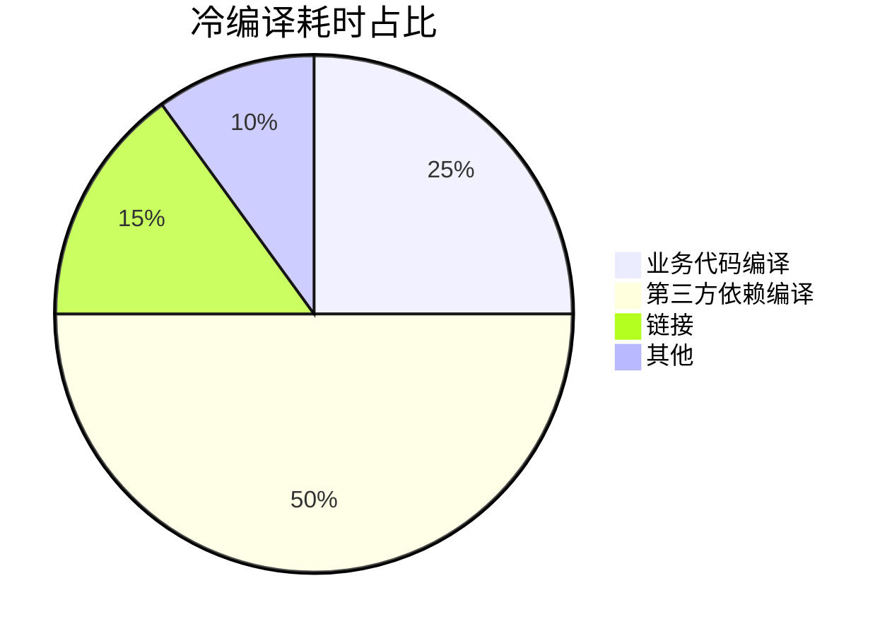
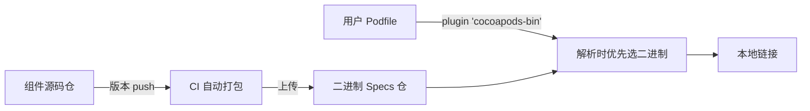
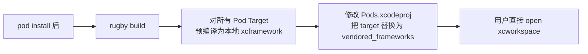
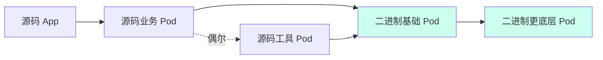
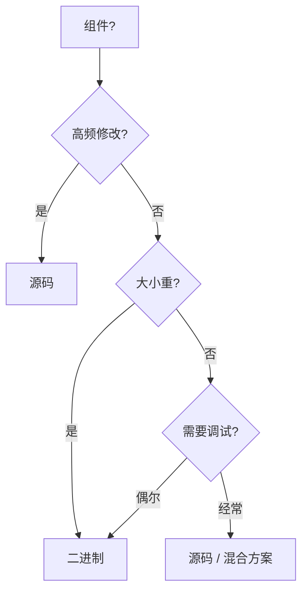

+++
title = "编译优化-二进制化"
date = '2026-05-02T22:32:27+08:00'
draft = false
weight = 6
tags = ["iOS", "工程化", "编译"]
categories = ["iOS开发", "工程化"]
+++
二进制化是大型 iOS 工程编译加速的"银弹"：把组件从源码编译改成预编译产物链接，在本地无需再跑 Swift/Clang 前端，直接链接已有的 `.a` / `.framework` / `.xcframework`。美团在 `cocoapods-hmap-prebuilt` 之外，还通过二进制化把整体编译速度提升 50%+。本文系统介绍二进制化的原理、实现方式与工具链。

---

## 为什么能加速

典型项目的编译时间分布（抖音量级）：



**超过一半的时间都花在编译 "不会改" 的依赖上**。把依赖预编译成二进制，本地只需要链接，这部分耗时直接归零。再配合远程缓存，第一次拉代码的同学也能命中他人产物。

---

## 二进制产物形态

### 静态库（.a）

最传统的形态：

```text
libSDWebImage.a
SDWebImage/Headers/
├── SDWebImage.h
└── ...
```

特点：
- 最小体积，Mach-O 里没有 LC_SEGMENT_64 / LC_LOAD_DYLIB 负担
- 启动最快，无 dyld 成本
- 静态链接时整合到主可执行
- 不支持资源文件（需要单独管理 bundle）

### Framework（.framework）

Apple 推荐的打包形态：

```text
SDWebImage.framework/
├── SDWebImage           # 二进制（静态或动态）
├── Headers/             # 公开头文件
├── Modules/             # modulemap、swiftmodule
│   ├── module.modulemap
│   └── SDWebImage.swiftmodule/
│       ├── arm64-apple-ios.swiftmodule
│       └── arm64-apple-ios.swiftinterface
└── Info.plist
```

通过 `Mach-O Type` 设置决定内部是静态还是动态库：
- **Static Framework**：链接时合并到主二进制
- **Dynamic Framework**：运行时由 dyld 加载

### XCFramework（.xcframework）

Xcode 11 引入的现代封装，支持多平台、多架构并存：

```text
SDWebImage.xcframework/
├── Info.plist
├── ios-arm64/SDWebImage.framework/       # 真机
├── ios-arm64_x86_64-simulator/           # 模拟器
└── macos-arm64_x86_64/                   # Mac Catalyst
```

相比 Fat Framework（用 `lipo` 合并多架构）的优势：
- Apple Silicon Mac 模拟器与 iOS 真机 `arm64` 架构冲突问题可解
- 单一产物分发，不需要按环境拆
- 支持 Swift `swiftinterface` 做 ABI 稳定
- Xcode 默认支持拖入使用

Swift Package 5.5+ 也原生支持 `binaryTarget` 指向 XCFramework。

---

## 打包关键配置

### BUILD_LIBRARY_FOR_DISTRIBUTION

必须设置为 `YES`，否则：
- Swift module 不会生成 `.swiftinterface`
- 消费方若用不同 Swift 编译器版本会链接失败

### SKIP_INSTALL

必须设置为 `NO`（或默认），否则 `xcodebuild archive` 不会把产物放到归档位置。

### DEFINES_MODULE

设置为 `YES`，自动生成 `module.modulemap`，否则消费方必须手动写 `.modulemap`。

### BITCODE

Xcode 14+ 已废弃 Bitcode，必须 `ENABLE_BITCODE = NO`。老框架如果还夹带 Bitcode 会导致体积异常且 Xcode 直接报错。

### ONLY_ACTIVE_ARCH

打包脚本必须跑两遍（iOS + Simulator），每遍都要关闭 `ONLY_ACTIVE_ARCH`，否则漏架构。

---

## 自动化打包脚本

典型的 XCFramework 打包命令：

```bash
#!/bin/bash
SCHEME="SDWebImage"
OUTPUT="build"

# 1. iOS 真机
xcodebuild archive \
  -scheme $SCHEME \
  -destination "generic/platform=iOS" \
  -archivePath "$OUTPUT/ios.xcarchive" \
  SKIP_INSTALL=NO \
  BUILD_LIBRARY_FOR_DISTRIBUTION=YES

# 2. iOS 模拟器
xcodebuild archive \
  -scheme $SCHEME \
  -destination "generic/platform=iOS Simulator" \
  -archivePath "$OUTPUT/sim.xcarchive" \
  SKIP_INSTALL=NO \
  BUILD_LIBRARY_FOR_DISTRIBUTION=YES

# 3. 合并
xcodebuild -create-xcframework \
  -framework "$OUTPUT/ios.xcarchive/Products/Library/Frameworks/$SCHEME.framework" \
  -framework "$OUTPUT/sim.xcarchive/Products/Library/Frameworks/$SCHEME.framework" \
  -output "$OUTPUT/$SCHEME.xcframework"
```

---

## CocoaPods 二进制化

### cocoapods-bin

开源插件 [cocoapods-bin](https://github.com/tripleCC/cocoapods-bin) 是社区二进制化的经典方案：



典型 Podfile：

```ruby
plugin 'cocoapods-bin'

source 'https://github.com/CocoaPods/Specs.git'
source 'https://your.internal/BinarySpecs.git'

use_binaries!   # 全局默认二进制

target 'App' do
  pod 'AFNetworking'       # 二进制
  pod 'MyModule', :source => true  # 强制源码
end
```

核心改造点：
- 每个版本 push 时 CI 打包 `.framework` / `.xcframework`，生成 binary podspec
- binary podspec 的 `source` 指向产物 zip
- binary podspec 的 `vendored_frameworks` 指向解压后的 framework
- 插件在 Analyzer 阶段替换 specification

### 源码/二进制自由切换

美团的 `zsource` 在二进制化基础上追加"快速切回源码调试"能力：

```bash
# 切换到源码模式
pod zsource SDWebImage
```

原理：
1. 在二进制打包时，把源码路径作为 DWARF debug info 打入 framework
2. `zsource` 命令通过改写 Podfile 或 Workspace 让某个组件临时变回源码
3. 不需要重新跑完整 `pod install`，大幅提升调试效率

美团技术团队博客《美团 iOS 工程 zsource 命令背后的那些事儿》详细介绍了实现。

---

## Rugby

[swiftyfinch/Rugby](https://github.com/swiftyfinch/Rugby) 是 Swift 写的 CocoaPods 编译加速 CLI。核心思路类似 cocoapods-bin 但更轻量：



特性：
- 不修改 Podfile、不修改 Podfile.lock
- 不是一个 Pod 依赖，只是可选的"后处理器"
- 支持远程缓存（S3、Git LFS、GitHub Releases 等）
- 精细粒度：可以按 Target 选择哪些预编译、哪些保留源码

使用：

```bash
brew install swiftyfinch/tap/rugby
rugby cache --remote --url https://your.cache.com
rugby          # 执行本地缓存 + 产物替换
```

---

## SPM 二进制化

Swift Package Manager 在 5.3+ 原生支持 `binaryTarget`：

```swift
let package = Package(
    name: "SDK",
    products: [...],
    dependencies: [],
    targets: [
        .binaryTarget(
            name: "MyBinary",
            url: "https://cdn.example.com/MyBinary-1.0.0.xcframework.zip",
            checksum: "abc123..."
        ),
    ]
)
```

要求：
- 产物必须是 XCFramework（不支持裸 framework / .a）
- 必须 `BUILD_LIBRARY_FOR_DISTRIBUTION=YES` 构建
- 必须提供 sha256 校验和

优势：原生、免插件；缺点：不支持"源码/二进制自由切换"。

---

## Bazel 场景

Bazel 本身就是基于显式产物缓存的构建系统，二进制化是其原生能力：

- **rules_apple** 的 `apple_dynamic_framework_import` / `apple_static_framework_import` 可以直接消费 `.framework`
- **rules_swift** 的 `swift_import` 可以消费预编译 swiftmodule
- 所有构建产物天然进入 Bazel 的 content-addressable 缓存，远程缓存命中率通常 > 80%

见 [编译优化-Bazel方案]()。

---

## 二进制化的代价

不是银弹，需要评估：

### 维护成本

- 需要一套打包 CI 流水
- 需要一个"二进制 Specs 仓"和版本管理机制
- 组件作者发版时要等 CI 完成（通常 10–30 分钟）
- 需要解决"源码调试怎么办"

### ABI 稳定性

Swift 模块在 `BUILD_LIBRARY_FOR_DISTRIBUTION=YES` 时保留 `.swiftinterface`，理论上跨 Swift 版本可解析，但：

- 不同 Xcode 版本的 Swift 编译器会报 module import 错误（需要同版本打包）
- OC-Swift 混编 framework 的 `Module-Swift.h` 会随 Swift 版本变化
- 社区常见做法：每个 Xcode 版本维护一条二进制流水

### 下载/缓存存储

大量版本的 XCFramework 累积占用可观：
- 典型项目一年能积累数百 GB
- 要有过期清理机制
- 远程缓存需要 CDN

---

## 常见的坑与解决方案

二进制化落地最痛的不是打包，而是各种"本地跑得好好的，别人机器上一换就炸"。下面按类型梳理近两年社区（CocoaPods、Tuist、Rugby、facebook-ios-sdk、Apple DTS）反复出现的问题。

### 1. Swift Module 版本绑架

**现象**：`module compiled with Swift 5.x cannot be imported by the Swift 5.y compiler` / `failed to build module 'XXX'`。

**根因**：Swift 的 `.swiftmodule` 是强版本绑定的二进制产物，只在完全相同的编译器版本下可用；`.swiftinterface` 虽然是 ABI 稳定文本，但 Xcode 会在消费端"重建 swiftmodule"，这一步需要能在消费者机器上成功跑完前端。

**解决方案**：
- 打包时必须 `BUILD_LIBRARY_FOR_DISTRIBUTION=YES`，产出 `.swiftinterface`，否则换 Xcode 版本必炸
- 追加 `OTHER_SWIFT_FLAGS="-Xfrontend -module-interface-preserve-types-as-written"`，避免 typealias 被展开成内部符号导致 interface 重建失败
- CI 按 Xcode 大版本拆产物，例如 `xcf-16.2/`、`xcf-16.3/`，Podfile 里根据 `ENV['XCODE_VERSION']` 切 source
- 打包机和开发机的 Xcode 版本通过公司 MDM 或 `xcodes` 工具强制对齐

### 2. XCFramework 的 umbrella header / modulemap 重复

**现象**：Xcode 26 开启 Explicitly Built Modules 后报 `redefinition of module 'X'` 或 `out of date module cache`；facebook-ios-sdk 的 issue #3424 是典型案例。

**根因**：一个 XCFramework 里同名 module 的多个 slice（`ios-arm64`、`ios-arm64_x86_64-simulator`）都各自拷贝一份 `module.modulemap` / umbrella header 到 `BUILT_PRODUCTS_DIR`，Xcode 的新模块系统会看到同名 module 多次声明。

**解决方案**：
- 临时：`SWIFT_ENABLE_EXPLICIT_MODULES=NO` 关闭显式模块（只是把问题盖住）
- 正解：升级到最新 CocoaPods（1.16+ 修了部分 copy 逻辑），并在 post_install 里去重：

```ruby
post_install do |installer|
  installer.pods_project.targets.each do |t|
    t.build_configurations.each do |c|
      c.build_settings['SWIFT_ENABLE_EXPLICIT_MODULES'] = 'NO' if ENV['XCODE_26_WORKAROUND']
    end
  end
end
```

- 长期：打包时用 `-create-xcframework` 的 `-headers` 参数显式指定单份 umbrella，避免多 slice 各带一份

### 3. -ObjC、分类方法"找不到"

**现象**：运行时 `unrecognized selector sent to instance`，但源码模式下完全正常。

**根因**：静态库/静态 framework 里只含分类、不含类本体时，链接器不会把 `.o` 拖进主二进制。CocoaPods 源码模式会通过 `PodName-dummy.m` 生成空类把 `.o` 拽进来；换成 vendored binary 后这个保险没了。

**解决方案**：
- Podfile 里为使用分类的 pod 打开 `-ObjC`：

```ruby
pod 'SDWebImageWebPCoder', :binary => true
# Podfile
post_install do |installer|
  installer.aggregate_targets.each do |agg|
    agg.user_project.targets.each do |t|
      t.build_configurations.each do |c|
        flags = c.build_settings['OTHER_LDFLAGS'] || ['$(inherited)']
        flags << '-ObjC' unless flags.include?('-ObjC')
        c.build_settings['OTHER_LDFLAGS'] = flags
      end
    end
  end
end
```

- 对"只有分类"的库用 `-force_load path/to/libX.a`，避免 `-all_load` 带来的 duplicate symbol
- 打包脚本里主动保留一个占位空类（等同于 CocoaPods 的 dummy.m 思路）

### 4. 静态 XCFramework 的传递依赖失效

**现象**：`App → DynamicFramework → StaticXCFramework` 链路下，主工程 `Missing required module 'InnerModule'`；Swift Forums 和 tuist#8056 反复出现。

**根因**：静态 XCFramework 的符号在中间动态 framework 打包时已被吞掉，但它的 `modulemap` 不会自动冒泡到主 target 的 search path。Swift 前端找不到 module，即使符号已存在。

**解决方案**：
- 打包侧：把静态依赖声明为 `@_implementationOnly import InnerModule`，接口上不暴露，Xcode 就不要求消费方再解析该 module
- 消费侧：把叶子静态 XCFramework 也显式加到主 target 的 `Framework Search Paths`，虽然不参与链接但能让 `modulemap` 可见
- 架构侧：同一依赖链上尽量不要混用 static / dynamic；美团 / 抖音的做法是"二进制产物统一静态 framework + 主工程一次链接"

### 5. Xcode 15/16 的 XCFramework 签名校验

**现象**：`XCFramework 'X.xcframework' requires a valid signature` / `code object is not signed at all`（Xcode 15+）、`duplicated signature for X`（Xcode 15 + CocoaPods 开发 pod 依赖 xcf）。

**根因**：Xcode 15 起强制要求商用 SDK 级 XCFramework 有签名；CocoaPods 的 `Pods-xxx-frameworks.sh` 在拷贝时还会重签一次，和内部已签名产生冲突。

**解决方案**：
- 打包时加签：`codesign --timestamp -v --sign "Apple Development: xxx" X.xcframework`
- 遇到重复签名，用 RevenueCat 提供的构建阶段脚本清理 stale signature：

```bash
if [ "${XCODE_VERSION_MAJOR}" = "1500" ]; then
  find "$BUILD_DIR" -type f -name "*.signature" -exec rm {} \;
fi
```

- 内部分发可接受未签名，消费方 Podfile 里关掉校验：`ENABLE_USER_SCRIPT_SANDBOXING=NO` 配合 `DISABLE_XCFRAMEWORK_SIGNATURE_VALIDATION=YES`（仅限私有产物）

### 6. PrivacyInfo.xcprivacy 隐私清单

**现象**：App Store Connect 上传后收到 `ITMS-91053` 邮件，提示未声明 Required Reason API；或第三方 SDK 被 Apple 从 2025-02-12 起强制要求清单。

**根因**：Apple 要求 XCFramework / SPM / Xcode Project 形式分发的 SDK 携带 `PrivacyInfo.xcprivacy`。很多老二进制产物完全没有。

**解决方案**：
- iOS/tvOS：放在 `X.framework/PrivacyInfo.xcprivacy`
- macOS / Catalyst：放在 `X.framework/Versions/A/Resources/PrivacyInfo.xcprivacy`
- Podspec 里显式声明为资源，避免被当成代码编译：

```ruby
s.resource_bundles = {
  'MyModule_Privacy' => ['Sources/PrivacyInfo.xcprivacy']
}
```

- CI 里加校验：`xcrun privacy-check X.xcframework` 或简易 `find X.xcframework -name 'PrivacyInfo.xcprivacy'`

### 7. Bitcode、ENABLE_USER_SCRIPT_SANDBOXING、Mac Catalyst 架构

- **Bitcode**：Xcode 14+ 废弃；老二进制如果 `otool -l | grep LLVM` 还有段就会臃肿且 Xcode 15 直接报错。打包加 `ENABLE_BITCODE=NO` 并 `bitcode_strip -r` 二次清理
- **User Script Sandboxing**：Xcode 15 默认开启，Pods 的 rsync 脚本会沙箱拒绝。解决：`ENABLE_USER_SCRIPT_SANDBOXING=NO` 或升级 CocoaPods 1.13+
- **visionOS / Mac Catalyst slice 缺失**：打包脚本要枚举 `xros / xrsimulator / macosx / maccatalyst`，否则上线后在新平台直接 link 失败

### 8. 资源 bundle 与同名冲突

**现象**：`Multiple commands produce '.../X.bundle'`。

**根因**：XCFramework 内部带 resource bundle 时，Xcode 会在 `BUILT_PRODUCTS_DIR` 产出一份；如果主工程或其他 pod 也有同名 bundle 就冲突。

**解决方案**：
- 打包时用 `resource_bundles`（而非 `resources`）并加命名空间前缀：`XYZSDK_Assets` 而不是 `Assets`
- 多个 Lottie / 嵌套资源冲突见 [Pod 资源命名冲突排查](../../../.claude/skills/pod-resource-naming-conflict/SKILL.md) 的处理思路

### 9. 打包环境与产物的"幂等性"坑

- **日志时间戳污染**：打包机每次产物哈希不同，二进制缓存命中率暴跌。Rugby 文档强调"先跑完所有 codegen（SwiftGen、R.swift）再调用 rugby"，否则 hash mismatch
- **SOURCE_ROOT 绝对路径**：DWARF 里带了 `/Users/buildbot/...`，消费方断点跳转失败。打包时加 `-debug-prefix-map "$PWD=."` 或 `DEBUG_INFORMATION_FORMAT=dwarf` + `-gdwarf-5`
- **deterministic_uuids**：多 slice XCFramework header 重名引起 pod install 失败，在 Podfile 里 `install! 'cocoapods', :deterministic_uuids => false` 规避（见 CocoaPods#12787）

### 10. 调试体验退化

二进制化后最常见抱怨："断不进点了 / 看不到源码"。对策：
- 产物里保留 `.dSYM`，CI 上传到 Crash 平台和对象存储，pod install 时再拉回本地
- `zsource` 一类工具做"单组件切源码"，避免整包回退
- Rugby 的 `--ignore <Targets>` / cocoapods-bin 的 `:source => true` 都支持按 target 例外

---

## 源码 Pod 与二进制 Pod 互相引用的问题

真实项目里几乎不存在"全源码"或"全二进制"的极端状态，必然混用。以下列出两种互引方向各自的典型坑。

### 源码库引用二进制库

**场景**：业务 `FeatureA`（源码）依赖基础库 `NetworkKit`（二进制 XCFramework）。

#### 坑 1：Module 找不到

**现象**：`FeatureA` 里 `import NetworkKit` 报 `No such module`。

**根因**：源码 Pod 的 `HEADER_SEARCH_PATHS` / `FRAMEWORK_SEARCH_PATHS` 没自动带上 vendored XCFramework 的路径，特别是跨 slice 时。

**解决**：
- 在二进制 podspec 里确保 `s.vendored_frameworks = 'X.xcframework'` 且产物目录正确
- 源码 pod 的 podspec 必须显式 `s.dependency 'NetworkKit'`，由 CocoaPods 自动补 search path
- Podfile 开启 `use_frameworks! :linkage => :static`，源码与二进制统一以 framework 形态消费

#### 坑 2：Swift / OC 混编 bridging 符号丢失

**现象**：源码 `FeatureA.swift` 调用 `NetworkKit` 里的 OC 类，链接期 `Undefined symbol: _OBJC_CLASS_$_NKClient`。

**根因**：静态 XCFramework 内部 OC 符号没被 `-ObjC` 拉进来。

**解决**：参考前文"-ObjC、分类方法找不到"，加 `OTHER_LDFLAGS = -ObjC` 或 `-force_load`。

#### 坑 3：二进制打包时的 Swift 版本和源码 Pod 不匹配

**现象**：源码 pod 是 Swift 5.10，但 `NetworkKit` 用 Swift 5.9 编译，`FeatureA` 编译报 `module compiled with Swift 5.9 cannot be imported by 5.10`。

**根因**：`.swiftinterface` 在消费端重建 swiftmodule 时，前端会检查 tools-version。部分 Swift 特性跨版本不兼容。

**解决**：
- 最稳妥：`NetworkKit` 按消费端 Xcode 版本矩阵重新打包
- 临时：打包时加 `-enable-library-evolution -swift-version 5`，且 `SWIFT_VERSION` 显式写入 build setting
- 治本：公司内部强制所有二进制流水绑 Xcode 大版本

#### 坑 4：传递依赖未声明

**现象**：`FeatureA` 只声明 `NetworkKit`，但 `NetworkKit` 内部用了 `Alamofire`，主工程找不到 `Alamofire` 模块。

**根因**：二进制产物不会把其内部 spec 依赖暴露给消费者，必须在 binary podspec 里完整写 `s.dependency`。

**解决**：打包脚本自动把源码 podspec 的 `dependency` 原样复制到 binary podspec；CI 校验二者 `dependencies` 数组一致。

### 二进制库引用源码库

**场景**：已经二进制化的 `UIKitExtension`（XCFramework）依赖 `Foundation+Util`（源码 pod，因为还在频繁修改）。

#### 坑 1：打包时就失败

**现象**：CI 打 `UIKitExtension` 时报 `No such module 'Foundation+Util'`。

**根因**：二进制打包通常在独立工程里跑 `xcodebuild archive`，该工程没集成源码依赖。

**解决**：
- 打包脚本先 `pod install` 生成完整 workspace，再对目标 target 单独 archive
- 或把源码依赖也临时二进制化（CI 内部先跑一轮预编译）
- cocoapods-bin 的经典做法：打包每个 Pod 时都 `pod install` 一个 demo 工程，Podfile 里标 `:source => true` 把依赖拉进来

#### 坑 2：ABI 稳定性被源码依赖破坏

**现象**：`UIKitExtension` 自身 `BUILD_LIBRARY_FOR_DISTRIBUTION=YES`，但依赖的源码 pod 没开这个开关；消费方换 Xcode 后 `UIKitExtension` import 失败。

**根因**：Library Evolution 是"全链路"要求，只要依赖链上有一环未开启就破功。CocoaPods#11153 就是典型。

**解决**：
- Podfile 里强制给所有 target 开 Library Evolution：

```ruby
post_install do |installer|
  installer.pods_project.targets.each do |t|
    t.build_configurations.each do |c|
      c.build_settings['BUILD_LIBRARY_FOR_DISTRIBUTION'] = 'YES'
    end
  end
end
```

- 二进制库尽量不要依赖"还在动"的源码库，否则每次源码改动都要重发二进制；反模式

#### 坑 3：符号重复

**现象**：链接报 `duplicate symbol _OBJC_CLASS_$_FUUtility`。

**根因**：`Foundation+Util` 以源码形式被主工程编进主二进制的同时，又被 `UIKitExtension` 打包时静态链接了一份进 XCFramework，最终链接阶段两份符号相撞。

**解决**：
- 二进制库打包时把下游依赖标记为 `external`/动态：`MACH_O_TYPE=mh_object` + `OTHER_LDFLAGS="-undefined dynamic_lookup"`，不把符号吞进自身
- cocoapods-bin、Rugby 都假设依赖会由消费方最终统一链接，打包时需要严格区分 "embed" 与 "link only"
- 提供 private `s.dependency` 给 binary podspec，确保消费端能看到并参与去重

#### 坑 4：源码依赖的头文件可见性

**现象**：`UIKitExtension` 公开 API 里返回 `FUUtility` 类型，但消费方 `import UIKitExtension` 后找不到 `FUUtility`。

**根因**：binary 产物的 `swiftinterface` 会引用 `FUUtility`，消费端需要能解析它的 module；如果源码 pod 没以 modular 方式引入（`use_modular_headers!` 或 `use_frameworks!`），Swift 前端看不到。

**解决**：
- 二进制公开 API 尽量只用 `@_implementationOnly import` 内的类型，接口只暴露 Foundation / 自有类型
- 或把源码依赖也在消费端以 `use_modular_headers!` 的方式集成
- 设计原则："二进制库不让源码依赖的类型出现在公开签名里"，避免把消费方绑架

### 混用时的整体建议



经验法则：
- **依赖方向**：上层可源码、底层建议二进制；二进制不要反向依赖源码
- **分层打包**：基础层整批打包、每个 Xcode 版本一套；业务层按需
- **API 稳定性**：被二进制化的库要保证接口 ABI 稳定，否则每次改 API 都要重新串联打所有下游
- **混用校验**：CI 定期跑 "全二进制" + "全源码" 两种模式，确保 podspec 的依赖声明完整一致
- **灰度策略**：关键基础库先只在 CI 开启二进制，开发机保留源码一段时间观察

---

## 源码 vs 二进制决策



常见策略：
- 公共基础库、第三方库：**二进制**
- 业务迭代组件：**源码**
- 组件作者本地开发该组件时：通过 `pod zsource` 或 Rugby 的 skip 能力切回源码

---

## 总结

二进制化是大型项目编译加速最直接、收益最高的手段之一，但落地复杂度也最高：

| 规模 | 建议 |
|-----|------|
| < 50 个 Pod | 简单的 `use_frameworks! :linkage => :static` 即可，不必上二进制化 |
| 50–200 Pod | Rugby 或 cocoapods-bin，远程缓存 |
| 200+ Pod | 自研 pipeline（参考抖音 seer-optimize + 美团 zsource 思路） |
| 超大工程 | Bazel + 远程缓存 + 远程执行 |

推进时务必和 [编译优化-观测]() 配套，度量"源码编译 / 二进制链接 / 总耗时"三个指标的变化，避免跟风造成维护成本过高却收益有限。
