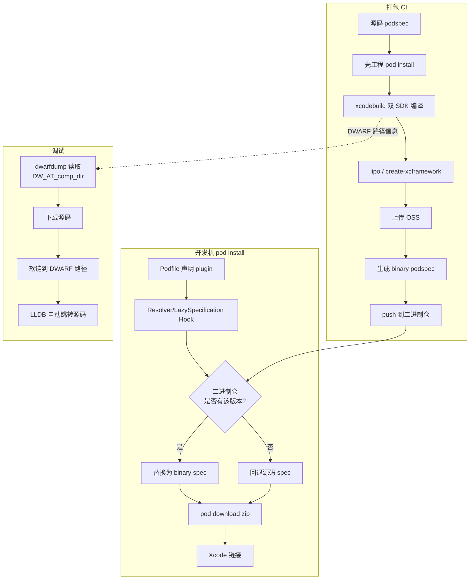
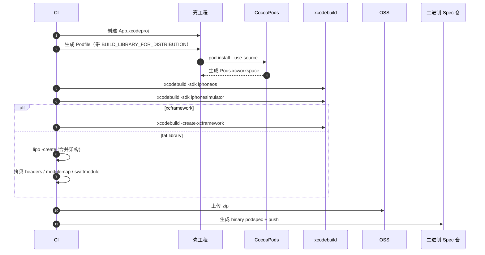

+++
title = "编译优化-二进制化实现原理"
date = '2026-05-08T22:56:38+08:00'
draft = false
weight = 7
tags = ["iOS", "工程化", "编译"]
categories = ["iOS开发", "工程化"]
+++
本文结合 [cocoapods-bin](https://github.com/tripleCC/cocoapods-bin)（社区最成熟的二进制化插件）拆解"Pod 二进制化"背后的工程机制：集成时如何透明替换 spec、打包时如何还原 Xcode 产物、调试时如何跳回源码。文末给出"自研一套二进制系统"的落地 checklist。

想先了解二进制化的整体背景、坑点和适用场景，可以先看 [编译优化-二进制化]()；想了解 pod install 阶段本身的优化（HMap、并发下载等）见 [编译优化-CocoaPods优化]()。

---

## 总体架构

一套完整的 Pod 二进制化系统由三层组成：



关键设计点：

1. **两个 Spec 仓并存**：源码仓（正常私有源）+ 二进制仓（OSS 地址指向 zip），完全独立
2. **二进制仓对用户透明**：插件在解析阶段动态替换 spec，不需要改 Podfile
3. **回退容错**：二进制仓没有的版本自动用源码，保证永远能跑
4. **锁文件一致性**：`Podfile.lock` 只记录源码依赖，避免二进制切换污染锁文件
5. **调试软链**：打包时保留 DWARF 的源码绝对路径，调试命令把下载的源码软链到该路径

---

## 集成阶段：Spec 动态替换

二进制化最精妙的地方就在"用户写的是 `pod 'A', '1.0'`，CocoaPods 解析时却拿到二进制 podspec"。两套主流实现选了不同的 Hook 点。

### 方案一：cocoapods-bin 在 Resolver 阶段替换

cocoapods-bin 在 `Pod::Resolver#resolver_specs_by_target` 里切入，等 CocoaPods 先用源码解析完整依赖树，再整体替换。核心代码：

```ruby
old_resolver_specs_by_target = instance_method(:resolver_specs_by_target)
define_method(:resolver_specs_by_target) do
  specs_by_target = old_resolver_specs_by_target.bind(self).call

  sources_manager = Config.instance.sources_manager
  use_source_pods = podfile.use_source_pods
  missing_binary_specs = []

  specs_by_target.each do |target, rspecs|
    use_binary_rspecs = if podfile.use_binaries? || podfile.use_binaries_selector
      rspecs.select do |rspec|
        ([rspec.name, rspec.root.name] & use_source_pods).empty? &&
          (podfile.use_binaries_selector.nil? || podfile.use_binaries_selector.call(rspec.spec))
      end
    else
      []
    end

    specs_by_target[target] = rspecs.map do |rspec|
      next rspec unless rspec.spec.respond_to?(:spec_source) && rspec.spec.spec_source

      use_binary = use_binary_rspecs.include?(rspec)
      source = use_binary ? sources_manager.binary_source : sources_manager.code_source

      begin
        specification = source.specification(rspec.root.name, rspec.spec.version)
        specification = specification.subspec_by_name(rspec.name, false, true) if rspec.spec.subspec?
        ResolverSpecification.new(specification, rspec.used_by_non_library_targets_only, source)
      rescue Pod::StandardError
        missing_binary_specs << rspec.spec if use_binary
        rspec
      end
    end.compact
  end

  specs_by_target
end
```

Podfile DSL 入口：

```ruby
plugin 'cocoapods-bin'

use_binaries!                              # 全局默认二进制
# 或按需选择
use_binaries_with_spec_selector! { |spec| spec.name != 'FeatureA' }
```

优点：
- 源码解析结果是"真的可以装起来的完整图"，再去替换二进制，逻辑直观
- 解析失败直接回退源码（`rescue Pod::StandardError`），健壮

代价：
- 源码和二进制仓必须保持 spec 完全同步（版本、子 spec 列表一致），否则 `subspec_by_name` 返回 nil 就会漏掉
- 解析阶段跑了两次，稍慢

### 方案二：另一种思路是在 LazySpecification 阶段替换

还有一种解法是选更早的位置——`Pod::Specification::Set::LazySpecification#initialize`，即 CocoaPods 构造 spec 懒引用的那一瞬间就把 `@spec_source` 换掉：

```ruby
module Pod
  class Specification
    class Set
      class LazySpecification
        alias old_initialize_for_binary_source initialize
        def initialize(name, version, spec_source)
          old_initialize_for_binary_source(name, version, spec_source)
          hook_binary_source
        end

        private

        def hook_binary_source
          return unless integrator.should_replace_binary_source
          return if integrator.use_source_for_pod?(name)

          binary_source = search_in_binary_sources
          @spec_source = if binary_source
                           binary_source
                         else
                           integrator.add_missing_binary_spec(name) unless integrator.missing_binary_specs.include?(name)
                           UI.warn "在二进制源中没有找到`#{name} #{version}`, 将使用源码的源`#{spec_source}`"
                           spec_source
                         end
        end

        def search_in_binary_sources
          binary_sources.map(&:pod_source).find do |binary_source|
            SourceHelper.include_pod_in_source?(name, version, binary_source)
          end
        end
      end
    end
  end
end
```

和 cocoapods-bin 不同的是，这类方案会跑**两遍 analyze**，中间切换状态：

```ruby
alias old_analyze_for_binary_source analyze
def analyze(analyzer = create_analyzer)
  old_analyze_for_binary_source(analyzer)      # 第一遍：纯源码解析，生成完整 lockfile
  @source_pod_lockfile = generate_lockfile     # 保存源码 lockfile，后面用来还原

  BinaryIntegrator.instance.should_replace_binary_source = true
  analyzer.result = nil
  old_analyze_for_binary_source(analyzer)      # 第二遍：LazySpecification Hook 生效，替换为二进制
end
```

这个设计的精妙之处：
- 第一遍解析拿到一份"纯源码 lockfile"，写回 `Podfile.lock`，这样**二进制切换不会污染 lock 文件**，团队任何人用源码 / 二进制看到的 lock 都一致
- 第二遍解析替换 spec，真实生成 Pods 沙盒
- 真实沙盒状态写入单独的 binary lockfile 和 binary manifest

锁文件还原：

```ruby
alias old_write_lockfiles_for_binary_source write_lockfiles
def write_lockfiles
  old_write_lockfiles_for_binary_source
  return if @source_pod_lockfile.nil?

  # Podfile.lock / Manifest.lock 还原为纯源码版本
  @source_pod_lockfile.write_to_disk(config.lockfile_path)
  @source_pod_lockfile.write_to_disk(config.sandbox.source_manifest_path)

  # 真实沙盒快照单独保存
  lockfile.write_to_disk(integrator.binary_lockfile_path)        # Podfile.binary.lock
  lockfile.write_to_disk(integrator.sandbox.manifest_path)       # Manifest.binary.lock
end
```

并重写 sandbox 的 `manifest_path`，让"CocoaPods 判断沙盒是否过期"这件事去读 binary manifest，否则源码 / 二进制切换时 CocoaPods 会误判"lock 已变化"而全量重装：

```ruby
module Pod
  class Sandbox
    alias old_manifest_path manifest_path
    def manifest_path
      BinaryIntegrator.instance.sandbox.manifest_path   # Manifest.binary.lock
    end
  end
end
```

### 两种 Hook 对比

| 维度 | cocoapods-bin | 另一种思路 |
|------|---------------|--------|
| Hook 点 | `Resolver#resolver_specs_by_target`（后期） | `LazySpecification#initialize`（前期） |
| 解析次数 | 1 次 | 2 次 |
| Lock 文件 | 含二进制源 | 还原为源码 lock，另存 binary lock |
| 不存在时处理 | `rescue` 回退 | 显式搜索回退 |
| 对子 spec 容忍度 | 需要二进制 spec 完整对齐 subspec | 对 subspec 差异更宽容 |
| 适用团队 | 二进制仓维护严格、spec 对齐良好 | 希望"切换不改 lock"、团队规模大 |

自研时可以结合两者：**Resolver 阶段替换 + Lockfile 还原**。

---

## 打包阶段：从源码生成二进制产物

打包流程在概念上统一，实现细节差别很大。下面按一个典型的 `BinaryPodBuilder` 实现主线讲解。

### 流程总览



### 壳工程：最小化可构建 Xcode 工程

打包第一步是造一个**能 pod install 进来的空壳 Xcode 工程**。常见策略是：

```ruby
APP = 'App'.freeze
APP_XCPROJ = "#{APP}.xcodeproj".freeze
APP_XCWORKSPACE = "#{APP}.xcworkspace".freeze
DEFAULT_ANALYZE_OUTPUT_PATH = '/usr/local/opt/binary_builder'.freeze   # 打包目录
```

选 `/usr/local/opt` 有个关键考量——**这个路径会写进二进制产物的 DWARF 里作为源码绝对路径**，调试时就能以这个已知路径为锚做软链。抖音 / 美团的方案都会刻意把打包路径固定，方便后续 `zsource`。

壳工程本身是一份**预制模板**（`xcodeproj/` 目录），每次构建复制过去：

```ruby
class ProjectGenerator
  XCODEPROJ_PATH = Pathname.new(__FILE__).join('../../../xcodeproj')

  def generate
    prepare_sandbox          # 清理上次产物
    prepare_shell_xcproj     # 拷贝 App.xcodeproj 模板到当前目录
    prepare_podfile          # 写入 Podfile
  end
end
```

### Podfile 生成：关键 build setting

这段是**所有二进制打包的核心配置**：

```ruby
def podfile_content
  <<-PODFILE
source '#{COMPANY_CODE_SOURCE_URL}'
source '#{COCOAPODS_SOURCE_URL}'

target 'App' do
  #{library_type}         # xcframework: use_frameworks! :linkage => :static
                          # fat_library: use_modular_headers!
  pod '#{pod.name}', '#{pod.version}'
end

post_install do |installer|
  installer.pods_project.targets.each do |target|
    target.build_configurations.each do |config|
      # 区分源码 / 二进制模式下 OC 引用 Swift 头文件的方式
      config.build_settings['GCC_PREPROCESSOR_DEFINITIONS'] ||= ['$(inherited)', 'BINARY_FRAMEWORK=1']
      if target.name != 'App'
        config.build_settings['BUILD_LIBRARY_FOR_DISTRIBUTION'] = 'YES'
        config.build_settings['EXCLUDED_ARCHS'] = 'i386'
      end
    end
  end
end
  PODFILE
end
```

要点：
- `BUILD_LIBRARY_FOR_DISTRIBUTION=YES` 让 Swift 产出 `.swiftinterface`，跨编译器版本可用
- `EXCLUDED_ARCHS = i386` 关掉已废弃架构
- `use_frameworks! :linkage => :static` 产生静态 framework（XCFramework 打包要用）
- `use_modular_headers!` 保留传统静态库 + modulemap 的形式（fat library 打包）
- `BINARY_FRAMEWORK=1` 宏让组件代码里能通过 `#if BINARY_FRAMEWORK` 区分"被二进制引入"与"源码"的头文件路径差异

### xcodebuild 双 SDK 编译

CocoaPods 负责把壳工程配好，接下来就是标准的 `xcodebuild`：

```ruby
def xcodebuild_with_sdk(sdk, arch = nil)
  cmd = "xcodebuild -workspace #{workspace}" \
        " -scheme #{scheme} -configuration Debug" \
        " -sdk #{sdk}"
  cmd += " -arch #{arch}" if arch
  cmd += " -derivedDataPath #{DERIVED_DATA_PATH}"
  cmd += ' CODE_SIGN_IDENTITY="" CODE_SIGNING_REQUIRED="NO" CODE_SIGN_ENTITLEMENTS="" CODE_SIGNING_ALLOWED="NO"'
  system(cmd) or raise '编译失败'
end

xcodebuild_with_sdk(SDK::IPHONEOS)
xcodebuild_with_sdk(SDK::IPHONESIMULATOR, simulator_arch)
```

细节：
- Debug 而非 Release：保留调试符号，便于后续调试命令接入源码
- 关掉签名：`CODE_SIGN_IDENTITY=""` 等四件套避免 CI 不必要的签名依赖
- `simulator_arch`：XCFramework 打包时不限制（保留 arm64 + x86_64），Fat library 仅保留 x86_64，避免与真机 arm64 切片冲突

### XCFramework 产物生成

XCFramework 几乎是"官方路径"，一行 `-create-xcframework` 搞定：

```ruby
def generate
  framework_name = @pod.module_name || @pod.name   # module_name 可能被 spec 指定
  framework_path = "#{@pod.name}/#{framework_name}.framework"

  cmd = 'xcodebuild -create-xcframework' \
        " -framework #{iphoneos_product_path}/#{framework_path}" \
        " -framework #{simulator_product_path}/#{framework_path}" \
        " -output #{@pod.name}.xcframework"
  system(cmd) or raise '生成 XCFramework 失败'
end
```

注意点：
- `module_name` 不一定等于 `pod name`，例如 AnyCodable-FlightSchool 这种 spec 指定了 `module_name = AnyCodable`，要用 module_name 去找 framework 产物
- 多子 spec（subspec）时需要合并产物到一个 framework（见下文"subspec 处理"）

### Fat Library（静态库）产物生成

fat library 是"旧世界"的方案，但对 OC 项目仍然便捷；工程实现通常会对 OC 和 Swift 分两条路径。

#### OC：`.a` + dummy 源文件

```ruby
class FatLibraryObjc
  def pack_binary_files
    copy_static_library
    copy_headers
    copy_resource
    create_dummy_source_file          # 关键：解决 -ObjC 分类不加载问题
  end

  def copy_static_library
    # 合并真机和模拟器架构
    cmd = "lipo -create #{iphoneos_lib_path} #{iphonesimulator_lib_path} -output #{static_lib_path}"
    system(cmd) or raise 'lipo 失败'

    # 删除 CocoaPods 自动生成的 <Pod>-dummy.o，避免二进制里有两个 dummy
    system("sh fat_delete_object.sh #{static_lib_path} #{@pod.module_name}-dummy.o")
  end

  def create_dummy_source_file
    File.open("#{@binary_path}/#{@pod.module_name}-BinaryPodDummy.m", 'w') do |f|
      f.write("// I'm dummy!")
    end
  end
end
```

**为什么要写一个 dummy 源文件？**

OC 静态库如果只有分类（Category）、没有实类，链接器不会把 `.o` 拖进主二进制，分类方法会"找不到"。CocoaPods 源码模式通过 `PodName-dummy.m` 生成一个空类来绕过；换成 vendored static lib 后这个保护没了。

一种常见做法：
1. 打包时先 `lipo -remove` 掉 CocoaPods 原来生成的 `<Pod>-dummy.o`，避免二进制里夹带源码路径
2. 打包产物里 ship 一个新的 `<Pod>-BinaryPodDummy.m`
3. Binary podspec 的 `source_files` 把这个 dummy 源文件重新编进去，相当于在**消费端**保留一份 dummy

```ruby
def append_bin_info(podspec)
  podspec['vendored_libraries'] = lib_name
  podspec['source_files'] = cocoapods_array_append(
    podspec['source_files'],
    ["#{@pod.module_name}-BinaryPodDummy.m"]
  )
end
```

这样无论消费方开没开 `-ObjC`，dummy 类都能把 `.a` 里的分类拖进主二进制。

#### Swift：手工拼 framework

Swift 的二进制产物复杂得多，也可以选择**直接构造 `.framework` 目录**，而不是用 xcodebuild archive：

```ruby
class FatLibrarySwift
  def pack_binary_files
    copy_static_library       # lipo 合并成 framework 里的 Mach-O
    copy_headers              # Public + Private headers
    copy_modules              # module.modulemap + .swiftmodule
    copy_resource
  end
end
```

几个关键点。

**1. Swift Compatibility Header 合并**

Xcode 把 OC 能用的 Swift 接口写在 `<Module>-Swift.h` 里，真机和模拟器这个文件可能不一样（因为可用 API / `#if targetEnvironment` 差异）。一种合并方案：

```ruby
os_context = File.read(os_swift_header_path)
simulator_context = File.read(simulator_swift_header_path)
File.open(swift_header_path, 'w') do |f|
  f.write(os_context)
  f.write("\n#if defined(__x86_64__) && __x86_64__\n")
  f.write(simulator_context)
  f.write("#endif\n")
end
```

在运行时用 `__x86_64__` 宏区分模拟器切片。XCFramework 天然多 slice 不需要这招，fat library 必须手工合并。

**2. modulemap 构造**

Swift module 需要一份标准 modulemap：

```modulemap
framework module YourModule {
  umbrella header "YourPod-umbrella.h"
  export *
  module * { export * }
}

module YourModule.Swift {
  header "YourModule-Swift.h"
  requires objc
}
```

后半段 `YourModule.Swift` 子模块是为了让 OC 能以 `@import YourModule.Swift;` 方式拿到 Swift 导出的 API。

**3. swiftmodule 拷贝**

```ruby
def copy_swiftmodule
  os_path = "#{iphoneos_product_path}/#{pod.name}/#{pod.module_name}.swiftmodule"
  sim_path = "#{simulator_product_path}/#{pod.name}/#{pod.module_name}.swiftmodule"
  target = "#{modules_path}/#{pod.module_name}.swiftmodule"
  FileUtils.copy_entry(os_path, target) if Dir.exist?(os_path)
  FileUtils.copy_entry(sim_path, target) if Dir.exist?(sim_path)
end
```

把两端的 `*.swiftmodule`（含 `.swiftinterface`、`.swiftdoc`、`.abi.json` 等）统统拷进同一个 `.swiftmodule` 文件夹，Swift 前端会按文件名自动匹配架构：`arm64-apple-ios.swiftinterface`、`x86_64-apple-ios-simulator.swiftinterface`。

### subspec 的 WholeBinary / FatBinary 方案

一个经典难题：**源码 pod 有 subspecs 切分（如 Core、UI、Network），二进制产物却是一整块 framework**，怎么让消费方还能 `pod 'X/Core'`？

还有一种方案是**反过来的 subspec 结构**：保留所有 subspec 声明，但每个 subspec 都加一条 "依赖 `X/WholeBinary`" 的边；WholeBinary 这个额外 subspec 才真正 ship 二进制。

```ruby
def generate_podspec(oss_path)
  podspec = @pod.code_source_spec_json
  # 删除所有源码相关字段
  %w(source source_files module_map header_dir vendored_frameworks ...).each { |k| podspec.delete(k) }

  subspecs = podspec['subspecs']
  if subspecs.nil?
    append_binary_info(podspec)               # 无 subspec 直接挂到 root
  else
    whole_binary = { 'name' => 'WholeBinary' }
    whole_binary['dependencies'] = whole_binary_external_dependencies(podspec)
    append_binary_info(whole_binary)          # vendored_frameworks = X.xcframework

    subspecs.each do |subspec|
      subspec['dependencies']["#{@pod.name}/WholeBinary"] = []  # 每个 subspec 依赖 WholeBinary
      %w(source_files public_header_files ...).each { |k| subspec.delete(k) }
    end
    subspecs.push(whole_binary)
  end
  podspec
end
```

效果：
- 用户写 `pod 'X'` → 依赖 X 的所有 subspec → 所有 subspec 都依赖 `X/WholeBinary` → 拉进完整二进制
- 用户写 `pod 'X/Core'` → Core 依赖 `X/WholeBinary` → 仍然拉完整二进制（虽然只用 Core 的接口）

对二进制场景这是合理的权衡——源码按需要裁切意义重大，但二进制产物本身是一体的，拆不开。

### Binary Podspec 字段清理

从源码 podspec 转成 binary podspec 需要删一大批字段，否则字段冲突或解析错误：

```ruby
ignore_keys = [
  'source', 'source_files', 'module_name', 'module_map',
  'header_dir', 'header_mappings_dir',
  'public_header_files', 'project_header_files', 'private_header_files',
  'exclude_files', 'preserve_paths',
  'static_framework', 'frameworks', 'weak_frameworks',
  'vendored_frameworks', 'vendored_libraries',
  'prepare_command', 'script_phases',
  'testspecs'
]
```

分类说明：
- **源码相关**：`source_files` / `public_header_files` 等全删，binary 只保留 `vendored_frameworks`
- **模块相关**：`module_name` / `module_map` 交给 framework 内部的 modulemap，podspec 里保留反而会冲突
- **链接相关**：`frameworks` / `weak_frameworks` 需要保留吗？—— 有的方案会删掉，因为这些信息已经由 binary 内部的 modulemap 描述；cocoapods-bin / packager 选保留
- **脚本相关**：`prepare_command` / `script_phases` 都是源码阶段才有意义
- **测试**：`testspecs` 只对源码消费者有意义

重新添加的：
- `source` → 指向 OSS zip 的 http 地址
- `vendored_frameworks` / `vendored_libraries`
- 以及一堆 EXCLUDED_ARCHS 设置：

```ruby
podspec['pod_target_xcconfig'] ||= {}
podspec['pod_target_xcconfig']['EXCLUDED_ARCHS[sdk=iphonesimulator*]'] = 'arm64'
podspec['user_target_xcconfig'] ||= {}
podspec['user_target_xcconfig']['EXCLUDED_ARCHS[sdk=iphonesimulator*]'] = 'arm64'
```

在 Apple Silicon Mac 上运行模拟器时，用 fat library 必须排除 arm64 模拟器架构（老 lipo 没法同时包含真机 arm64 + 模拟器 arm64）。XCFramework 不需要这步。

---

## 发布阶段：OSS + 二进制 Spec 仓

打包产物是一个 zip（framework 或 `.a` + 头文件），发布分两步。

### 上传 OSS

```ruby
# publisher.rb
def publish(&create_podspec_block)
  case @pod.binary_type
  when :xcframework
    oss_folder = "#{@pod.name}/xcframework/#{@pod.version}"
  when :fat_library
    oss_folder = "#{@pod.name}/fat_library/#{@pod.version}"
  end
  uploader = OSSUploader.new(@zip_path, oss_folder)
  oss_path = uploader.upload                                # 返回 http URL
  podspec_path = create_podspec_block.call(oss_path)        # 用这个 URL 生成 binary podspec
  PodRepo.push(podspec_path, @source_name)                  # pod repo push 到二进制 spec 仓
end
```

关键设计：
- OSS 路径按 `pod名/二进制类型/版本/` 三级拆分，天然支持 fat library 和 XCFramework 并存
- 公司内可以用 OSS（阿里云/七牛/S3/内网对象存储），私有化可以用 Gitlab Releases / GitHub Releases
- 生成的 binary podspec 里 `source = { 'http' => oss_path }`，CocoaPods 自动会 download & unzip

### Push 到二进制 Spec 仓

`pod repo push` 本身是 CocoaPods 标准流程，打包系统只是把它自动化：

```ruby
class PodRepo
  def self.push(spec_path, source_name)
    system("pod repo push #{source_name} #{spec_path} --allow-warnings --skip-import-validation --skip-tests")
  end
end
```

选项解释：
- `--allow-warnings`：binary spec 会有一些因删字段产生的 warning
- `--skip-import-validation`：跳过"实际 import 一遍"，因为二进制 import 需要真机/模拟器环境
- `--skip-tests`：没有测试代码可跑

---

## 调试阶段：DWARF 软链原理

二进制化最大的抱怨："断不进点了，看不到源码"。一种常见解法是**在打包时把源码绝对路径固化进 DWARF，消费端把源码软链到该路径**。

### 固化打包路径

前面提到打包目录固定为 `/usr/local/opt/binary_builder/<pod>/<version>/`。Xcode 编译时会把每个 `.o` 的 `DW_AT_comp_dir`（DWARF 的 compilation directory）设成这个绝对路径，二进制里自带了"我是从这里编出来的"信息。

### dwarfdump 读取路径

```bash
$ dwarfdump --debug-info libYourPod.a | grep DW_AT_comp_dir | head -1
    DW_AT_comp_dir ("/usr/local/opt/binary_builder/YourPod/1.0.0")
```

调试工具就靠这个：

```ruby
def link(target_path, pod_name)
  dwarf_debug_dir = `dwarfdump --debug-info "#{@framework_path}" | grep "DW_AT_comp_dir" | head -1 | cut -d \\" -f2 | tr -d '\n'`
  raise Error, '找不到二进制包中的 DW_AT_comp_dir' if dwarf_debug_dir.empty?

  dir = "#{dwarf_debug_dir}/#{pod_name}"
  FileUtils.rm_rf(dir)
  FileUtils.mkdir_p(dir)
  `ln -s #{target_path}/* #{dir}`
end
```

### 下载源码 + 创建软链

用户执行调试命令：

1. 根据当前 lockfile 找到该 pod 的源码 spec
2. 用 `Pod::Downloader.download` 拉源码到本地缓存目录
3. 用 `dwarfdump` 读出二进制里的 `DW_AT_comp_dir`
4. 在该路径下软链源码文件

当 LLDB 遇到断点需要解析源码时，会访问二进制里记录的路径，恰好能通过软链找到源码文件，断点照样跳进去。

优点：
- 完全不改变二进制产物
- 不影响 Xcode 工程结构
- 想恢复纯二进制就执行清理命令删掉软链

代价：
- 打包机的路径不能变
- Dev 机要能写 `/usr/local/opt`（Homebrew 目录，正常都可写）

### 抖音 / 美团的扩展

社区在此基础上还有更先进的做法：
- **字节 Sandwich**：打包时用 `-debug-prefix-map` 把路径映射为抽象标识，消费端读 lockfile 对应版本自动下源码
- **美团 zsource**：命令行工具，可以只对单个 pod 切回源码（临时修改 Podfile 中该 pod 为 `:path =>`），比软链更彻底
- **直接改 Xcode Workspace**：在 Pods 工程里把某个 target 的 source 替换为 local source tree，LLDB 不需要任何软链

---

## 打包系统的工程化细节

生产级二进制系统的 20% 实现体现在"能跑的代码"，80% 在各种 corner case。以下是这类方案常见的工程化设计。

### 黑名单

有些 pod 天生就不能二进制化（例如只存在于 Swift 源码 `@inlinable` 里的实现、超大的 Lottie 资源），可以用一份 YAML 维护：

```ruby
BLACK_LIST_URL = 'https://...builder_black_list.yml/raw?ref=master'

def filter_blacklist_pods
  black_list = YAML.load(download_black_list)
  @pods.reject { |p| black_list.any? { |b| b['name'] == p.name } }
end
```

### Checker

```ruby
class Checker
  def filter_original_binary_pods     # pod 本身已经是二进制（只有 vendored_frameworks 的那种）
  def filter_blacklist_pods           # 黑名单
  def filter_binarized_pods           # 二进制仓已有同版本
end
```

### Analyze：批量二进制化

批量处理通常可以拆成 analyze 和 build 两步：

```ruby
def fix_podfile
  podfile = Pod::Podfile.from_file(Pathname.new('Podfile'))
  sandbox = Pod::Config.instance.sandbox
  analyzer = Pod::Installer::Analyzer.new(sandbox, podfile, nil, nil, true, false)
  @analyze_specs = analyzer.analyze.specifications
  # 根据 lockfile 的完整依赖图，生成覆盖所有依赖的 Podfile
  setup_podfile_content
end
```

思路：用 CocoaPods 的 Analyzer 直接解析项目 Podfile + Podfile.lock，拿到真实要打包的 spec 列表，然后批量走打包流水。

### 特例修正

无论如何都有"魔改过的 pod"需要硬编码特殊处理：

```ruby
def multiple_specs_pods
  # 这些 pod 被内部 fork 魔改过，不能改名字和版本号，所以源码仓里多个 spec 同名
  @multiple_specs_pods ||= ['Protobuf', 'SSZipArchive']
end

module FatLibraryFix
  def self.fix_podspec!(podspec)
    prepare_command = podspec['prepare_command']
    # 去掉打包时无意义的 mock 生成脚本
    podspec.delete('prepare_command') if prepare_command =~ /touch .+generated\.swift/
  end

  def self.fix_podfile_dependencies!(pod, file)
    case pod.name
    when 'YFDCommonLog' then file.write "  pod 'Mantle', '~> 1.5'\n"
    when 'ClippingBezier' then file.write "  pod 'PerformanceBezier', '1.0.9'\n"
    end
  end
end
```

这种"特例名单"是所有生产级系统的宿命——代价、维护成本的主要来源也在这里。

### 锁文件冲突与环境统一

还可以在 CLI 层统一 CocoaPods 的版本：

```ruby
spec.add_dependency 'cocoapods', '= 1.10.0'   # 锁死 pod 版本
```

并在 Gem 安装时要求删掉用户 Gemfile 里对 cocoapods 的约束。配合团队的 Gemfile.lock 进入版本管理，所有人用同一版本 CocoaPods + 同一版本打包工具 + 同一 Xcode（靠 xcodes），二进制就能复用。

### 打包失败回退

`cocoapods-bin` 的优雅之处：打包失败 / 二进制仓没有时**自动降级到源码**（`rescue Pod::StandardError`）。这保证了：
- 新加的 pod 还没来得及跑打包流水，用户仍能正常 `pod install`
- 某个 Xcode 版本下打包失败（例如 Swift 版本不兼容），用户能用源码顶上

这是"二进制化永远可以安全合入"的保障。

---

## 其他主流方案速览

### Rugby：pod install 后处理

Rugby（Swift 写的 CLI）不改 Podfile、不改 pod install 流程，而是**事后处理**：

1. 用户照常 `pod install`
2. `rugby build` 扫描 Pods.xcodeproj，对所有 Pod target 调 `xcodebuild` 编译
3. 把编译产物缓存到本地 / 远端（S3 / GitHub Releases）
4. 用 Xcodeproj Gem 修改 Pods.xcodeproj：把 target 改为指向 vendored framework

优势：
- 零侵入 Podfile
- 可以用 hash（基于源码 + 编译 flag 算）自动判断缓存命中
- 按 target 粒度精细控制

局限：
- 开发者机上的 Pods.xcodeproj 每次会被 Rugby 改动，可能与 CocoaPods 默认生成冲突
- 远程缓存命中要求所有前置工具（SwiftGen、R.swift）产物完全一致，需要 `rugby build pre` 先 finalize

### cocoapods-packager：原始归档工具

Apple 官方样板 [cocoapods-packager](https://github.com/CocoaPods/cocoapods-packager) 是所有二进制方案的鼻祖，cocoapods-bin 的 framework_builder 几乎是直接 fork：

```ruby
# 摘自 cocoapods-bin/helpers/framework_builder.rb
# copy from https://github.com/CocoaPods/cocoapods-packager
```

它只负责"单个 pod → 一个 framework"，不管 spec 仓、不管集成替换。适合做"组件对外发版"场景，工程内用要在外面包一层 CI。

### grab/cocoapods-binary-cache

Grab 团队的 [cocoapods-binary-cache](https://github.com/grab/cocoapods-binary-cache) 是近两年社区新方案：
- 第一次 `pod install` 时 prebuild 所有 pod 为 xcframework，上传 S3
- 后续 install 直接下载缓存
- 针对 source 和 binary 共存（issue #123）和 mixed framework（issue #10262）等问题仍在迭代

和传统二进制 spec 仓方案的区别：**不维护独立二进制 spec 仓**，所有产物 hash 化，更贴近 Bazel 的 content-addressable cache 思路。

### 抖音 Seer + BinaryPod

字节 Seer（内部系统）融合了多种优化：
- HMap 预生成（见 [编译优化-头文件与HMap]()）
- Pod Install 并行化（见 [编译优化-CocoaPods优化]()）
- 二进制化 + 远程缓存
- 基于 Bazel 的模块化（可选）

对外没开源，但思路和 cocoapods-bin 等方案一致，规模上做到了"全公司所有 iOS 工程共享一套缓存"。

---

## 自研一套二进制系统的 Checklist

如果你要从零搭，需要回答这些问题：

### 规划

1. 二进制仓存在哪？（独立 Spec Git 仓 / 原 Spec 仓用版本 tag 区分）
2. OSS 在哪？（阿里 OSS / S3 / Gitlab Packages / GitHub Releases）
3. 二进制类型选 XCFramework 还是 Fat Library？（新项目建议 XCFramework）
4. 是否按 Xcode 大版本拆产物？（强烈建议，避免 Swift 版本绑架）

### 集成层

5. Hook 点选 Resolver 还是 LazySpecification？（中小团队选 Resolver 容错更好）
6. 是否还原 Podfile.lock？（多人协作团队必选）
7. 提供"单组件切源码"的 debug 命令？
8. 二进制仓无该版本时自动回退源码？

### 打包层

9. 壳工程路径固定吗？（要做 DWARF 调试就必须固定）
10. 编译 Debug 还是 Release？（Debug 含符号利于调试，Release 小）
11. 如何处理 subspec？（WholeBinary 方案是目前最稳的）
12. 如何处理 OC 分类？（dummy 源文件方案）
13. Swift 的 modulemap 如何生成？`-Swift.h` 如何合并？（XCFramework 不需要，fat library 要）
14. 资源 bundle 如何处理？（`resource_bundles` 加命名空间前缀）
15. `PrivacyInfo.xcprivacy` 如何嵌入？（2025-02-12 起 Apple 强制要求）

### 发布层

16. binary podspec 要删哪些字段？（前文清单是起点）
17. 如何加 `EXCLUDED_ARCHS` 设置？（fat library 必须）
18. 是否打签名？（Xcode 15+ 强烈建议，对外 SDK 必须）
19. `pod repo push` 的哪些校验要跳过？

### 调试层

20. DWARF 软链方案 vs 临时切源码方案选哪个？
21. 是否支持"按 pod 选源码"的 Podfile override？
22. lldb 的 source-map 命令是否要提前配？

### 工程化

23. 有没有黑名单机制？
24. 特例修正如何维护？
25. 打包失败如何降级？
26. 日志、度量、告警如何接入？

越往下越"脏"，但能否做到工程级好用，完全取决于把这些脏活处理到什么程度。

---

## 小结

拆开看，Pod 二进制化的底层原理并不复杂：

- **集成**：替换一下 `@spec_source`
- **打包**：跑两遍 `xcodebuild` + `lipo` / `create-xcframework`
- **调试**：利用 DWARF 里的绝对路径做软链

但凡是"社区反复踩坑后沉淀下来"的设计——`WholeBinary`、dummy 源文件、Lockfile 还原、DW_AT_comp_dir 软链——都是用生产事故换来的。搭自己的二进制系统时，即使不用现成方案，也强烈建议把相关开源代码通读一遍，把每一行"看起来有点莫名其妙"的处理都理解清楚：你迟早会遇到同样的场景。

参考资料：
- 具体坑点 → [编译优化-二进制化]()
- CocoaPods 整体优化 → [编译优化-CocoaPods优化]()
- HMap 预生成 → [编译优化-头文件与HMap]()
- Bazel 远程缓存 → [编译优化-Bazel方案]()
- [tripleCC/cocoapods-bin](https://github.com/tripleCC/cocoapods-bin)
- [swiftyfinch/Rugby](https://github.com/swiftyfinch/Rugby)
- [grab/cocoapods-binary-cache](https://github.com/grab/cocoapods-binary-cache)
- [CocoaPods/cocoapods-packager](https://github.com/CocoaPods/cocoapods-packager)
