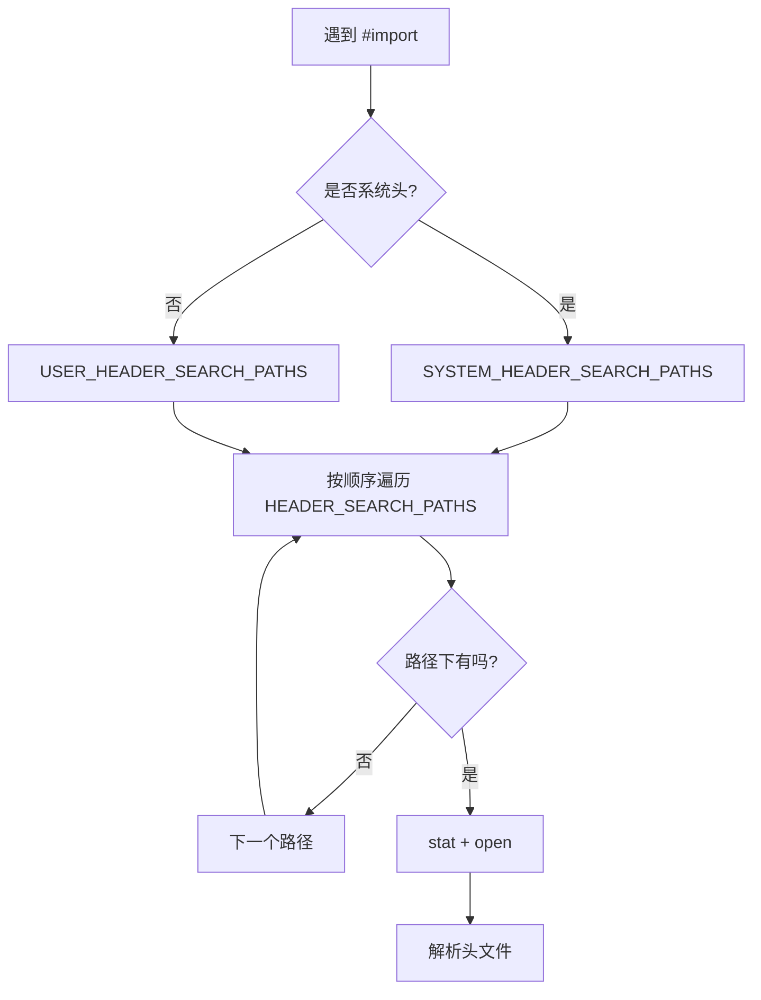
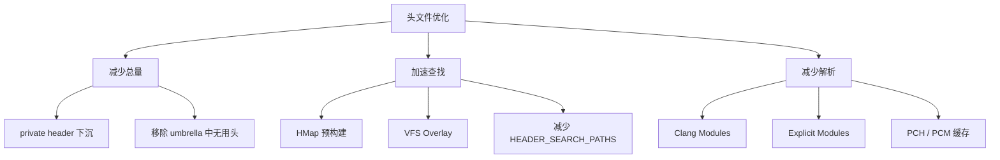

+++
title = "编译优化-头文件与HMap"
date = '2026-05-02T22:32:27+08:00'
draft = false
weight = 8
tags = ["iOS", "工程化", "编译"]
categories = ["iOS开发", "工程化"]
+++
对以 Objective-C 为主或混编的 iOS 大型工程，头文件查找是一个被严重低估的编译开销点。美团的统计显示，400+ Pod 组件的工程会产生近 5 万个头文件，导致海量的 IO 操作和编译参数膨胀。Header Map（HMap）技术能把头文件查找从 O(n) 的目录扫描退化为 O(1) 的哈希查表。

---

## 头文件查找的代价

### Clang 的查找流程

当 Clang 遇到 `#import <AFNetworking/AFNetworking.h>` 时：



每一次查找都要对**所有** `HEADER_SEARCH_PATHS` 执行 `stat(2)` 系统调用，当路径数量达到数千时，光 `stat` 就是显著开销。

### CocoaPods 的头文件布局

CocoaPods 的经典头文件目录结构：

```text
Pods/
├── Headers/
│   ├── Public/
│   │   ├── AFNetworking/AFNetworking.h
│   │   ├── SDWebImage/SDWebImage.h
│   │   └── ... (每个 Pod 一个目录)
│   └── Private/
│       └── ... (每个 Pod 一个目录)
└── Target Support Files/
    └── Pods-App/Pods-App.xcconfig
```

生成的 `HEADER_SEARCH_PATHS` 形如：

```text
HEADER_SEARCH_PATHS = $(inherited) \
  "${PODS_ROOT}/Headers/Public" \
  "${PODS_ROOT}/Headers/Public/AFNetworking" \
  "${PODS_ROOT}/Headers/Public/SDWebImage" \
  "${PODS_ROOT}/Headers/Public/IGListKit" \
  ... 几百行
```

### 叠加效应

| 头文件数 | Pod 数 | 路径数 | 每次 stat 耗时 |
|---------|-------|-------|---------------|
| 1000 | 50 | ~100 | 可忽略 |
| 10000 | 200 | ~500 | 明显 |
| 50000 | 400+ | ~1500 | 瓶颈 |

这还没算上 `Arguments Too Long` 问题——当 `HEADER_SEARCH_PATHS` 膨胀到 Unix `ARG_MAX` 限制（通常 2MB）时，构建会直接失败。

---

## HMap 原理

### 文件格式

HMap 本质是 Clang 原生支持的 **内存映射哈希表**，扩展名 `.hmap`。它直接把 "头文件名 → 绝对路径" 的映射以二进制表存储，避免查找时遍历目录。

Clang 定义的格式（`include/clang/Lex/HeaderMapTypes.h`）：

```c
struct HMapHeader {
    uint32_t Magic;           // 'hmap' = 0x68 6D 61 70
    uint16_t Version;         // 1
    uint16_t Reserved;        // 0
    uint32_t StringsOffset;   // 字符串池起点
    uint32_t NumEntries;      // 有效条目数
    uint32_t NumBuckets;      // 桶数（2 的幂）
    uint32_t MaxValueLength;  // 最长 value 长度
};

struct HMapBucket {
    uint32_t Key;      // key 在字符串池的偏移
    uint32_t Prefix;   // value 前缀在字符串池的偏移
    uint32_t Suffix;   // value 后缀在字符串池的偏移
};
```

文件结构：


### 查找流程

Clang 用 `HMapBucket.Key / Prefix / Suffix` 重组路径：

```text
完整路径 = Prefix + Suffix
```

拆成前后缀是为了让同一个目录下的多个头文件共享一份 `Prefix`，节省空间。哈希函数：

```c
uint32_t hash(const char* s) {
    uint32_t h = 0;
    for (; *s; ++s) h += tolower(*s) * 13;
    return h;
}
```

开放寻址（线性探测），冲突率低时近似 O(1)。

### 如何生成

Xcode 和 CocoaPods 本身就会给每个 Target 生成 HMap，典型位置：

```text
DerivedData/.../Build/Intermediates.noindex/.../
  MyTarget.build/MyTarget-project-headers.hmap
  MyTarget.build/MyTarget-own-target-headers.hmap
  MyTarget.build/MyTarget-all-target-headers.hmap
```

Clang 命令行通过 `-I/path/to/MyTarget.hmap` 传入，查找头文件时优先走 HMap。

---

## 美团 cocoapods-hmap-prebuilt 方案

### 动机

虽然 Xcode/CocoaPods 默认会生成 HMap，但有几个问题：

1. **Target 级 HMap**：每个 Target 只映射自己的 Header，跨 Target 访问仍然走 Search Path
2. **CocoaPods 传统 Header 布局需要大量 Search Path**
3. **需要一次打包之后 HMap 才齐全**

美团 `cocoapods-hmap-prebuilt` 的核心思路：**在 Pod Install 阶段，预先为所有 Pod 生成一个"大一统" HMap**，覆盖所有公开头文件的完整映射。这样 `HEADER_SEARCH_PATHS` 可以被极度精简。

### 配置

安装插件后，`Podfile` 加一行：

```ruby
plugin 'cocoapods-hmap-prebuilt'
```

执行 `pod install` 时插件会：

1. 扫描所有 Pod 的 `public_header_files` 配置
2. 按 "include 风格"（`#import <AFNetworking/AFNetworking.h>` 等）生成映射键
3. 用 Clang 原生的 HMap 格式序列化成 `.hmap` 文件
4. 修改 xcconfig，把一长串 `HEADER_SEARCH_PATHS` 替换为一个 HMap：

```text
HEADER_SEARCH_PATHS = $(inherited) \
  "${PODS_ROOT}/Headers/hmap/abc123/Compile_Public.hmap"
```

### 收益

美团公开数据：

| 指标 | 传统 | HMap 预构建 | 变化 |
|-----|------|------------|------|
| 全源码编译 | 基准 | -45% | 大幅缩短 |
| Xcode 打包阶段 | 基准 | -50% | 大幅缩短 |
| 命令行长度 | 数百 KB | < 1 KB | Arguments Too Long 治愈 |

抖音 CocoaPods 优化也采用了类似思路，与 `filelist` 方案配合解决链接参数过长：

```text
OTHER_LDFLAGS[arch=*] = $(inherited) \
  -filelist "xx-relative.filelist,${PODS_CONFIGURATION_BUILD_DIR}"
```

---

## 与 Modules 的关系

### HMap vs Module Map

`modulemap` 是模块层的描述，HMap 是头文件查找层的优化：

| 能力 | HMap | module.modulemap |
|-----|------|------------------|
| 解决"头文件去哪找" | ✅ | ❌ |
| 解决"头文件解析几次" | ❌ | ✅ |
| 格式 | 二进制哈希表 | 文本 DSL |
| 需要显式写 | 工具自动生成 | 作者手写 |

**两者互补**：Modules 减少"同一个头解析多次"的开销；HMap 减少"找到那个头"的开销。在 Explicit Modules 下依然需要 HMap（尤其对大量 Objective-C Pod），因为 scan 阶段也要走头文件查找。

### VFS Overlay

Clang 的 `-ivfsoverlay` 能通过 YAML 描述把真实文件系统"虚拟"成另一个布局。Bazel 的 `rules_apple` 就用 VFS Overlay 把 Pod 的头文件虚拟到模块内部路径，避免 HMap / Header Search Path 膨胀。原理上比 HMap 更通用，但需要 Bazel 生态配合。

---

## 动手生成 HMap

Homebrew 上有 `hmap` 命令行工具（milend/hmap-cli）可以查看和构造 HMap：

```bash
# 查看
hmap print ./MyTarget.hmap

# 创建
echo '{"AFNetworking/AFNetworking.h": "/path/to/AFNetworking.h"}' \
  | hmap write output.hmap
```

Xcode 生成的 `.hmap` 也可以直接用这个工具查看，便于定位"头文件找不到"的诡异问题。

---

## 优化清单



实际项目里推荐的落地路径：

1. 先用 [编译优化-观测]() 里的 `-ftime-trace` 看头文件解析耗时
2. 若 Pod 数量 > 100，优先评估 `cocoapods-hmap-prebuilt` 或自研 HMap 插件
3. 开启 Clang Modules（`CLANG_ENABLE_MODULES=YES`）让高频头复用解析
4. 进一步开启 Explicit Modules（见 [编译优化-Explicit Modules]()）
5. 配合 `filelist` / OTHER_LDFLAGS 优化解决 Arguments Too Long

头文件优化的本质是**把一次构建中的"重复 IO + 重复解析"替换为一次性的预计算**，这在超大工程的收益往往比 Swift 侧的微观优化更明显。
