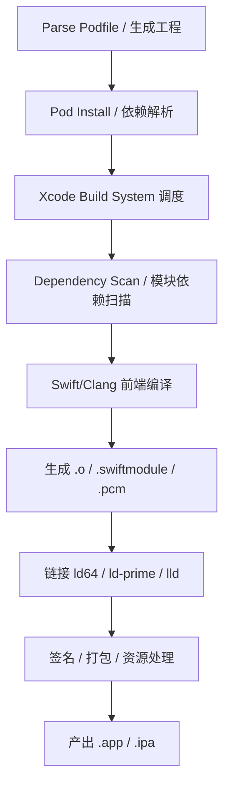
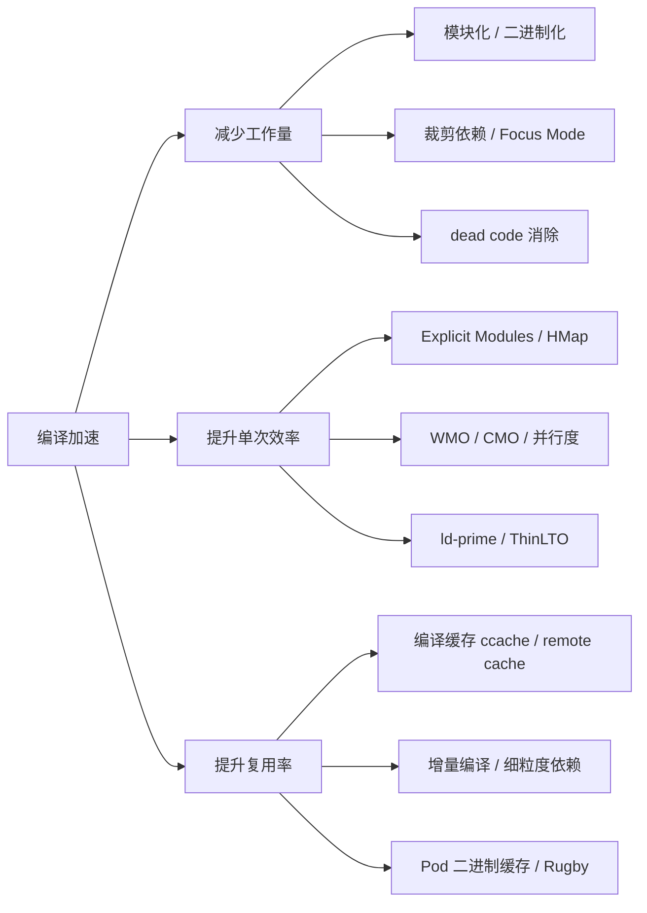
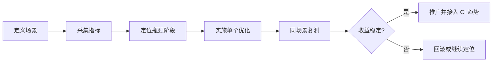
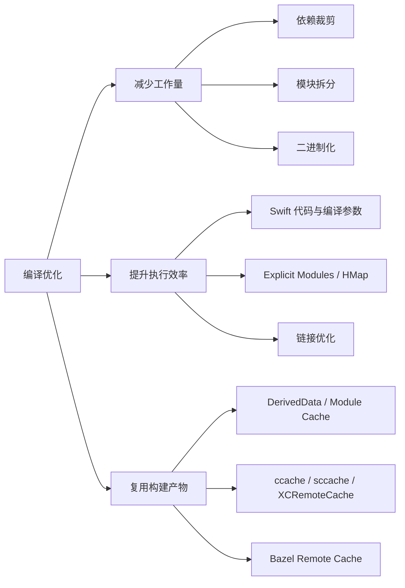
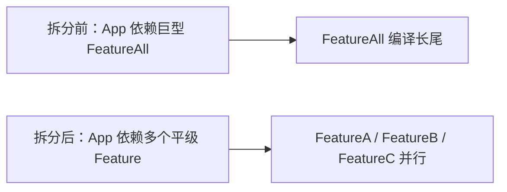
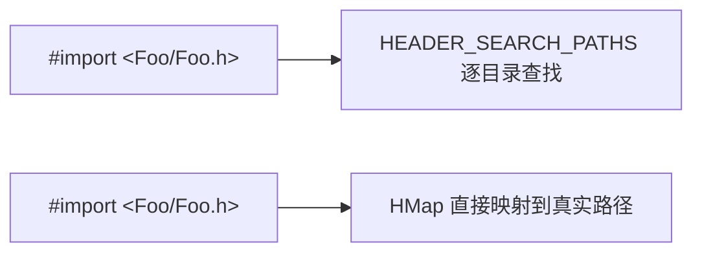
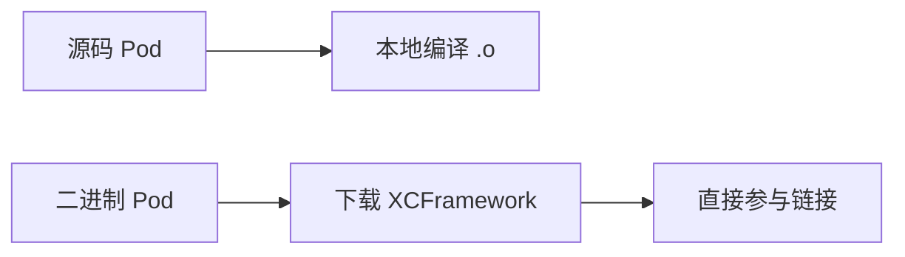

+++
title = "编译优化"
date = '2026-05-27T22:24:03+08:00'
draft = false
weight = 12
tags = ["iOS", "工程化", "编译"]
categories = ["iOS开发", "工程化"]
+++
大型 iOS 工程的编译耗时往往是研发效能最突出的瓶颈之一。以抖音、今日头条、美团为代表的一线团队，工程代码量通常在数百万到千万行级，本地全量编译耗时 10 分钟以上、CI 上半小时起步已是常态。编译等待不仅直接压缩研发时间，还会打断心流、降低人均产出。

本系列文章从 iOS 编译系统的原理出发，结合社区最新实践（Xcode 16/17 Explicit Modules、rules_xcodeproj、seer-optimize、cocoapods-hmap-prebuilt、Rugby 等），系统性介绍编译优化的各类手段与背后的原理。

---

## 编译流程概述

理解[iOS编译原理]()是编译优化的前提。一次典型的 iOS 编译流程可以划分为以下阶段：



| 阶段 | 主要工作 | 常见瓶颈 |
|-----|---------|---------|
| 依赖管理 | Pod Install、SPM 解析 | Source 更新慢、Specification 解析重复、沙盒拷贝 |
| 工程生成 | 生成 Pods.xcodeproj、xcconfig、hmap | Target 数量多、pbxproj 膨胀 |
| 构建调度 | Build System 解析任务图、并行调度 | 依赖粒度过粗、并行度不足 |
| 模块扫描 | Clang/Swift 依赖扫描 | 隐式模块重复编译 |
| 源码编译 | Swift/Clang 前端、类型检查、SIL/IR 生成 | 类型推导爆炸、WMO 关闭、PCH 失效 |
| 链接 | 符号解析、LTO、dead-strip | 链接参数过长、ThinLTO 串行 |
| 收尾 | 签名、资源拷贝、dSYM | 串行脚本阻塞 |

---

## 优化思路全景

编译优化的核心思路只有三条：**减少需要做的工作**、**让必须做的工作更快**、**让做过的工作可复用**。所有社区实践都可以归入这三类。



---

## 文章导航

本系列包含以下文章，建议按顺序阅读：

### 1. 观测与诊断

优化之前必须能量化，否则无法验证收益。

- [编译优化-观测]()
  - Build With Timing Summary、-debug-time-compilation
  - -driver-show-incremental、-driver-show-job-lifecycle
  - -warn-long-expression-type-checking、-warn-long-function-bodies
  - Xcode Build Timeline、xcodebuild -showBuildTimingSummary
  - 自研 Profiler 与数据上报（CocoaPods Profiler / XCLogParser）

### 2. 构建系统

理解 Xcode 构建系统才能针对性优化。

- [编译优化-Xcode构建系统]()
  - llbuild、XCBBuildService、SwiftDriver 架构
  - 任务图、并行度与关键路径
  - 增量编译原理、swift-driver 的 incremental build
  - Xcode 17 细粒度依赖追踪
  - XCBBuildServiceProxy 与大厂自定义构建

### 3. 模块化与 Explicit Modules

Xcode 16/17 最重要的构建变革。

- [编译优化-Explicit Modules]()
  - Clang/Swift Module 基础
  - Implicit vs Explicit Module Build
  - Scan → Build Module → Compile Source 三阶段
  - 模块变体（variant）爆炸与消减
  - 对 CI 冷启动 / 本地增量的不同影响

### 4. 头文件与 HMap

针对 Objective-C / 混编工程的头文件查找优化。

- [编译优化-头文件与HMap]()
  - HEADER_SEARCH_PATHS 的 IO 开销
  - HMap 二进制映射表格式
  - 美团 cocoapods-hmap-prebuilt 原理
  - VFS Overlay 与 Bazel 的 header layering

### 5. Swift 代码层优化

源码层能做到的加速。

- [编译优化-Swift编译优化]()
  - 类型推导与 "expression too complex" 的根因
  - Whole Module Optimization (WMO)
  - Cross Module Optimization (CMO)
  - 访问控制（private/internal/public）对增量编译的影响
  - 泛型特化、@inlinable、@_optimize

### 6. 链接优化

链接阶段的大块耗时优化。

- [编译优化-链接优化]()
  - ld64 / ld-prime（Xcode 15+） / lld 对比
  - ThinLTO 原理与参数调优
  - filelist 方式解决 Arguments Too Long
  - dead_strip / -dead_strip_dylibs
  - 符号导出控制与 -exported_symbols_list

### 7. 二进制化

把源码编译换成产物链接。

- [编译优化-二进制化]()
  - 静态库、动态库、Framework、XCFramework
  - BUILD_LIBRARY_FOR_DISTRIBUTION 与 ABI 稳定
  - CocoaPods 二进制化方案（cocoapods-bin、imy-bin）
  - Rugby 的 Remote Cache / Prebuild 原理
  - 源码回切调试（美团 zsource）

### 8. CocoaPods 优化

依赖管理阶段的加速。

- [编译优化-CocoaPods优化]()
  - Pod Install 六阶段耗时分析
  - 按需更新 Source / 文件锁同步
  - Specification / FileAccessors / SandboxAnalyzer 缓存
  - 增量安装、单 Target/Configuration 安装
  - 抖音 seer-optimize 的整体方案

### 9. 编译缓存

做过的工作不再重复做。

- [编译优化-编译缓存]()
  - ccache 的 direct / preprocessor 模式
  - Clang modules cache / Swift module cache
  - XCRemoteCache（Spotify）：Xcode 原生兼容的 Target 级远程缓存
  - 远程缓存（Bazel Remote Cache、sccache）
  - 缓存命中率的关键影响因素

### 10. Bazel 方案

Monorepo 与下一代构建系统。

- [编译优化-Bazel方案]()
  - Bazel 核心概念与 sandbox/remote execution
  - rules_apple / rules_swift / rules_xcodeproj
  - 字节 BitSky、Bilibili、Airbnb 实践
  - Bazel vs Xcode 的 trade-off
  - 混合构建（Build with Proxy）

---

## 常见面试问题1: iOS 工程编译慢时，应该如何观测和定位瓶颈？

编译优化第一步不是改参数，而是建立可重复的观测闭环。因为“编译慢”可能慢在不同层：`pod install` 依赖解析慢、Xcode 构建调度慢、Swift 类型检查慢、Clang 反复解析头文件慢、链接慢、Run Script 串行阻塞，或者 CI 缓存命中率低。没有分层观测，很容易把优化做偏。



### 1. 先拆场景

同一个工程至少要分别测五类场景：

| 场景 | 测什么 | 为什么重要 |
|-----|-------|-----------|
| Clean Build | 全量源码编译、模块扫描、链接成本 | 反映 CI 冷启动和新同学首次构建体验 |
| 增量编译 | 改一个常用业务文件后的重编范围 | 反映日常开发反馈速度 |
| 空改动构建 | 没有源码变化时是否仍触发任务 | 能暴露 Run Script 输入输出缺失、依赖追踪错误 |
| CI 构建 | 网络、缓存、机器规格、并发队列下的真实耗时 | 反映团队整体交付效率 |
| `pod install` | 依赖解析、下载、工程生成、集成耗时 | 大型 CocoaPods 工程常常慢在编译前 |

测量时要控制变量：固定 Xcode 版本、固定分支、固定 DerivedData 状态、固定模拟器 / SDK，至少跑 3 次取中位数。一次构建的结果容易被 Spotlight、磁盘缓存、网络抖动、机器温度影响。

### 2. 采集总耗时和阶段耗时

最基础的命令是 `xcodebuild -showBuildTimingSummary`，它能告诉你主要时间花在 `CompileSwiftSources`、`CompileC`、`Ld`、`PhaseScriptExecution`、`Copy` 还是资源处理上。

需要注意，Timing Summary 里的时间通常是**累计耗时**，不是墙钟耗时。例如 `CompileC 300s` 可能是 1000 个 `.m` 文件并行编译的累计值，真实墙钟只有几十秒。所以它适合判断“哪类任务占比高”，不能直接当作总构建耗时。

### 3. 看任务图和关键路径

Xcode Build Timeline 能看出哪些任务真正卡住了墙钟时间。重点观察三类现象：

| Timeline 现象 | 常见原因 | 后续排查方向 |
|---------------|---------|-------------|
| 后半段只剩一个长 Swift 色块 | 某个大 Target WMO / batch 编译长尾 | 拆 Target、治理 Swift 慢文件、二进制化 |
| 中间大量空白等待 | Target 依赖图太窄或有伪依赖 | 清理 Target Dependencies、减少 public header、打破循环依赖 |
| `PhaseScriptExecution` 每次都跑 | Run Script 没写 Input / Output | 给脚本补输入输出或移出构建链路 |
| `Ld` 占构建后段很长 | 链接输入过多、LTO、符号处理慢 | 链接器、filelist、dead strip、二进制拆分 |
| `SwiftDriver Compilation Requirements` 阻塞 OC | 混编桥接头或 `*-Swift.h` 依赖过重 | 瘦身 Bridging Header、减少 Swift 暴露给 ObjC |

新版 Xcode Scheme 使用 `Build Order = Dependency Order` 描述并行构建语义，Xcode 会按依赖关系尽可能并行。真正影响并行度的是任务图中的依赖边，而不是简单开关。

### 4. 定位 Swift 编译瓶颈

Swift 慢通常慢在前端：类型检查、泛型约束求解、宏展开、SIL 生成、模块依赖扫描。可以通过这些参数定位：

```xcconfig
OTHER_SWIFT_FLAGS = $(inherited) \
  -Xfrontend -debug-time-compilation \
  -Xfrontend -warn-long-expression-type-checking=200 \
  -Xfrontend -warn-long-function-bodies=500 \
  -driver-show-incremental \
  -driver-show-job-lifecycle
```

常见判断方式：

| 日志 / 告警 | 含义 | 处理方向 |
|------------|------|---------|
| `expression took xxx ms to type-check` | 单个表达式类型推导过慢 | 拆表达式、加类型标注、减少复杂泛型 / result builder |
| `function took xxx ms to type-check` | 函数体过大或控制流复杂 | 拆函数、抽局部变量、减少链式调用 |
| `Queuing because of dependencies discovered later` | 增量依赖传播扩大 | 收敛 public API、拆模块、减少跨文件隐式依赖 |
| 大量文件因同一 `.swiftdeps` 变化重编 | 模块接口变化影响下游 | 降低可见性、减少 `public` / `@objc` / `@inlinable` |

Swift 观测的重点不是只找“最慢文件”，还要看**为什么改一个文件会牵连一片文件**。这通常和访问控制、模块边界、桥接头、宏和生成代码有关。

### 5. 定位 Clang / ObjC 头文件与模块问题

ObjC / C / C++ 工程常见瓶颈是头文件查找和解析。每个 `.m` / `.mm` 都是一个 translation unit，如果它通过 umbrella header 或 PCH 间接包含大量头文件，就会被重复解析。

排查方向包括：

- 看 `HEADER_SEARCH_PATHS` 是否非常长，尤其是 CocoaPods 生成的 public/private header path。
- 看 Bridging Header 是否导入了大量 ObjC 头，导致 Swift 编译前必须解析它们。
- 看 Clang Module Cache / `.pcm` 是否频繁失效或出现大量 variant。
- 看是否开启 Explicit Modules 后，CI clean build 因冷缓存变慢。

对于模块问题，重点指标是 module variant 数量和 cache hit rate。同一个模块如果因为宏、架构、SDK、deployment target、编译参数不同切出很多 `.pcm`，即使开启 Explicit Modules 也可能变慢。

### 6. 定位链接瓶颈

链接阶段可以从 Timing Summary 看到 `Ld` 是否占比高，也可以给链接器打开更细的耗时输出：

```xcconfig
OTHER_LDFLAGS = $(inherited) -Wl,-time
```

链接慢常见原因：

- 输入 `.o` / `.a` / framework 过多，符号表和 ObjC metadata 处理成本高。
- Debug 误开 LTO 或 Release 使用了 Monolithic LTO，导致链接阶段长尾。
- `OTHER_LDFLAGS`、`LIBRARY_SEARCH_PATHS`、`FRAMEWORK_SEARCH_PATHS` 过长，甚至触发 `Arguments Too Long`。
- 静态库 / 动态库混用不合理，产生重复符号、重复链接、启动与构建之间的取舍失衡。

### 7. 定位 CocoaPods 阶段瓶颈

`pod install` 可以拆成 resolve、download、validate、generate project、integrate user project 等阶段。大型工程常见慢点是 Specs 仓更新、依赖解析、文件扫描、沙盒拷贝和 Pods 工程生成。

可以用简单 profiler 包住 CocoaPods 的关键方法，或者先用 `pod install --verbose` 粗看阶段：

```bash
time pod install --verbose
```

真正工程化落地时，一般会上报这些指标：

| 指标 | 含义 |
|-----|------|
| `pod.resolve_duration` | 依赖解析耗时 |
| `pod.download_duration` | 下载 / clone / 解压耗时 |
| `pod.generate_project_duration` | Pods 工程生成耗时 |
| `pod.integrate_duration` | 写入 user project / xcconfig 耗时 |
| `pod.cache_hit_rate` | Specs、FileAccessors、SandboxAnalyzer 等缓存命中率 |

### 8. CI 长期指标

一次本地优化通过不代表长期有效，最终要把构建指标接入 CI 趋势：

| 指标 | 说明 |
|-----|------|
| `build.total_duration` | 总墙钟耗时，中位数和 P90 都要看 |
| `build.clean_duration` | Clean Build 耗时 |
| `build.incremental_duration` | 增量构建耗时 |
| `build.swift_compile_duration` | Swift 编译累计耗时 |
| `build.clang_compile_duration` | Clang / ObjC 编译累计耗时 |
| `build.link_duration` | 链接耗时 |
| `build.script_duration` | Run Script 耗时 |
| `build.cache_hit_rate` | 缓存命中率 |
| `build.incremental_file_count` | 单次增量触发的文件数 |

面试里可以这样总结：**我会先分 clean、incremental、no-op、CI、pod install 五个场景测基线，再用 Timing Summary 看阶段占比，用 Build Timeline 看关键路径，用 Swift / Clang 诊断定位慢文件和模块问题，用链接器日志定位 `Ld`，最后把核心指标接入 CI 趋势。优化动作必须单变量推进，复测稳定后再推广。**

## 常见面试问题2: iOS 工程中，编译优化有哪些常见方案？每种方案的原理和实现方式是什么？

编译优化可以归纳成三句话：**减少需要做的工作、让必须做的工作更快、让做过的工作可复用**。在工程里对应三大类方案：依赖和模块治理、编译 / 链接阶段加速、缓存和构建系统升级。



### 1. 基线 Build Settings 优化

这类是成本最低的优化，目标是避免 Debug / CI 做不必要的工作。

**原理**：Debug 构建追求反馈速度，不需要完整优化、完整 dSYM、全架构、索引数据；Release 构建才追求优化质量和符号产物。把不同 configuration 的目标区分开，可以立刻减少编译和产物处理成本。

```xcconfig
// Debug：优先本地构建速度
ONLY_ACTIVE_ARCH = YES
DEBUG_INFORMATION_FORMAT = dwarf
SWIFT_OPTIMIZATION_LEVEL = -Onone
GCC_OPTIMIZATION_LEVEL = 0
SWIFT_COMPILATION_MODE = incremental

// CI：如果不需要代码索引，可以关闭 Index Store
COMPILER_INDEX_STORE_ENABLE = NO

// Release：优先运行时性能和产物质量
SWIFT_COMPILATION_MODE = wholemodule
SWIFT_OPTIMIZATION_LEVEL = -O
DEBUG_INFORMATION_FORMAT = dwarf-with-dsym
DEAD_CODE_STRIPPING = YES
```

**实现注意点**：`ONLY_ACTIVE_ARCH=YES` 只适合 Debug，本地只编当前架构可以少一半 slice；Release / Archive 不能开，否则产物架构不完整。CI 关闭 Index Store 能省时间，但如果 CI 还要做 SourceKit / 静态分析 / 索引上传，就不能一刀切关闭。

### 2. 依赖裁剪 / Focus Mode

**原理**：大型 App 的本地开发通常只改一个业务域，但默认构建会生成和编译整个工程。Focus Mode 的思路是把“开发态依赖”和“全量态依赖”拆开：本地只保留当前业务所需模块，CI 定期跑全量，避免依赖被裁坏。

```ruby
# Podfile 示例：默认只集成当前业务需要的依赖
def enabled?(name)
  ENV[name] == '1'
end

target 'App' do
  pod 'BaseKit'
  pod 'NetworkKit'
  pod 'OrderFeature'

  pod 'LiveFeature' if enabled?('ENABLE_LIVE')
  pod 'IMFeature' if enabled?('ENABLE_IM')
  pod 'VideoEditor' if enabled?('ENABLE_VIDEO_EDITOR')
end
```

```bash
# 本地开发订单模块：少生成工程、少扫头文件、少编 Target
pod install

# CI 或联调全量能力：显式打开重模块
ENABLE_LIVE=1 ENABLE_IM=1 ENABLE_VIDEO_EDITOR=1 pod install
```

**实现细节**：

1. 要有一份模块分组配置，例如 `base`、`order`、`live`、`im`、`video_editor`。
2. Podfile / 工程生成脚本读取环境变量或本地配置，只安装当前分组。
3. App 入口要能处理被裁掉的模块，例如路由表、Tab、Feature Flag 不能强引用缺失模块。
4. CI 至少保留一条全量构建流水线，防止本地 Focus Mode 把依赖问题隐藏掉。

**风险**：裁剪依赖不是删代码，不能让主工程出现大量 `#if FOCUS_ORDER` 侵入业务。更好的做法是通过路由注册、插件化注册、弱依赖协议隔离，让模块缺失时自然不注册。

### 3. 模块拆分与依赖图治理

**原理**：Xcode 底层通过 `llbuild` 执行任务 DAG。新版 Xcode 的 `Build Order = Dependency Order` 会按依赖关系尽可能并行，但并行度受依赖图宽度限制。如果所有业务都依赖一个巨大 Target，或者 CocoaPods 给静态库 Pod 生成了大量不必要依赖边，Timeline 上就会出现长尾和等待。



**实现方式**：

- 把“老大哥”Target 拆成更小的业务 Target，例如 `FeatureOrder`、`FeaturePayment`、`FeatureProfile`。
- 下沉通用能力到基础库，避免业务模块互相 import。
- 消除循环依赖，用协议、路由、中间层或事件总线隔离。
- 清理 CocoaPods 生成的静态库伪依赖。静态库之间很多时候不需要产物级依赖，最终由 App 链接合并即可。
- Xcode 15+ 可以评估 `MERGEABLE_LIBRARY` / `PRELINK_STATIC_LIBS`，在模块化开发和链接 / 启动成本之间折中。

**注意点**：模块拆分不是越细越好。Target 太多会带来工程生成变慢、索引变慢、链接输入变多、依赖管理复杂等副作用。一般优先拆“关键路径上的大模块”，而不是机械地按目录拆。

### 4. CocoaPods 优化

**原理**：很多工程慢在编译之前。`pod install` 包括 Specs 同步、依赖解析、下载、沙盒处理、Pods 工程生成、写入 user project 等步骤。Pod 数量上百后，解析和文件扫描都可能变成分钟级。


**实现方案**：

- 使用 CocoaPods CDN Source，避免每次拉取完整 Specs Git 仓。
- 按需更新 Source。不要默认 `pod install --repo-update` 更新所有 source，只更新新增或版本缺失的 spec 仓。
- 增强 Specification 缓存，修复缓存 key 命中率低的问题。
- 开启官方增量能力：

```ruby
install! 'cocoapods',
  :incremental_installation => true,
  :generate_multiple_pod_projects => true,
  :deterministic_uuids => false
```

- 对固定版本 Pod 缓存 FileAccessors / SandboxAnalyzer 结果。因为源码文件列表、资源文件列表、vendored framework 信息对同一版本是稳定的，没有必要每次全量扫描。
- 下载阶段并发化，Git 依赖尽量使用归档包或 HTTP API，避免完整 `git clone`。
- 沙盒从“拷贝”改成“软链接”或共享缓存，减少大仓库文件 IO。
- 对新增 public header 做编译期 hook，自动补符号链接，减少轻微文件变更导致的 `pod install`。

**注意点**：CocoaPods 优化容易引入一致性问题。缓存必须带版本、校验和、podspec 内容 hash；软链接方案要处理用户误删缓存、路径不一致、CI 沙盒隔离；`deterministic_uuids => false` 可以规避部分 UUID 冲突，但会增加工程文件 diff 噪声。

### 5. 头文件、HMap 与 VFS Overlay

**原理**：ObjC 的 `#import` 需要在 `HEADER_SEARCH_PATHS` 中逐个目录查找。大型 CocoaPods 工程会生成很长的 public / private header path，每个 `.m` 文件都要重复查找和解析。HMap 是 Xcode 使用的二进制映射表，把头文件名直接映射到真实路径，减少目录遍历。



**实现方式**：

- 清理 `HEADER_SEARCH_PATHS`，避免 `$(PODS_ROOT)/**` 这类过宽路径。
- public header 下沉为 private header，减少暴露面。
- 清理 umbrella header，避免一个头文件间接拖入全世界。
- 对 CocoaPods 使用 HMap 预构建方案，把 Pods public headers 写成 hmap。
- Bazel / 自研构建系统可用 VFS Overlay 描述虚拟头文件布局，实现 header layering。

**注意点**：HMap 只能加速查找，不能减少头文件本身的解析成本。要真正减少 Clang 前端工作量，还要结合 Clang Modules、Explicit Modules、PCH / PCM 缓存和头文件依赖治理。

### 6. Explicit Modules

**原理**：隐式模块模式下，编译器在主编译过程中发现缺少 `.pcm`，会临时 fork 子进程编译模块，Xcode Timeline 不可见，多个进程还可能争抢 ModuleCache。Explicit Modules 把流程拆成 Scan、Build Module、Compile Source 三步，让模块依赖显式进入构建图。


**实现方式**：

```xcconfig
// Xcode 15+ / 16+ 可评估开启
SWIFT_ENABLE_EXPLICIT_MODULES = YES
CLANG_ENABLE_EXPLICIT_MODULES = YES
```

开启后要重点治理 module variant。variant 由架构、SDK、deployment target、宏、编译参数共同决定。同一个 `Foundation` / `UIKit` / 内部模块如果被切成很多 context hash，就会重复生成 `.pcm`。

**减少 variant 的方式**：

- 统一 Pod 的 `IPHONEOS_DEPLOYMENT_TARGET`。
- 统一 `GCC_PREPROCESSOR_DEFINITIONS`、`OTHER_CFLAGS`、`SWIFT_ACTIVE_COMPILATION_CONDITIONS`。
- Debug 开启 `ONLY_ACTIVE_ARCH=YES`，减少本地多架构 variant。
- 用共享 `.xcconfig` 管理 Pods 编译参数。
- CI 持久化 `DerivedData/ModuleCache.noindex`，避免每次冷启动重建所有 `.pcm`。

**注意点**：Explicit Modules 对本地增量通常有收益，但 CI clean build 在冷缓存下可能变慢，因为所有模块变体都被显式构建出来。所以不能只看本地，要同时测本地增量、CI clean、CI 带缓存三类场景。

### 7. Swift 代码层与编译模式优化

**原理**：Swift 编译慢的核心常在类型检查和泛型约束求解。复杂字面量、长链式调用、result builder、泛型嵌套、存在类型、宏展开都会让约束系统搜索空间变大。访问控制也会影响增量传播：`public` / `open` API 的变化会影响下游模块，`private` / `internal` 的变化影响范围更小。

**代码层实现**：

```swift
// 优化前：字面量、闭包返回值和 map 链式调用都依赖推导
let payload = users.reduce(into: [:]) { result, user in
    result[user.id] = [
        "name": user.name,
        "age": user.age,
        "tags": user.tags.map { $0.rawValue }
    ]
}

// 优化后：拆分表达式，并给关键中间值补类型
typealias UserPayload = [String: Any]

let payload: [String: UserPayload] = users.reduce(into: [:]) { result, user in
    let tags: [String] = user.tags.map { tag in tag.rawValue }
    let item: UserPayload = [
        "name": user.name,
        "age": user.age,
        "tags": tags
    ]
    result[user.id] = item
}
```

常见做法：

- 给复杂字面量、闭包参数、闭包返回值加显式类型。
- 拆分长表达式，减少一条表达式里的重载候选。
- 默认 `internal` / `private`，谨慎使用 `public`、`open`、`@objc`、`@inlinable`。
- 能不继承的类和方法加 `final`，让编译器更容易做静态派发。
- 混编项目减少 Bridging Header 内容，避免每个 Swift 文件都感知大量 ObjC 头。
- 控制 Swift Macro 使用面，宏插件要预编译并缓存。

**编译模式**：

- Debug 常用 `SWIFT_OPTIMIZATION_LEVEL=-Onone`，优先编译速度。
- `SWIFT_COMPILATION_MODE=incremental` 适合日常开发，能减少无关文件重编。
- Release 常用 WMO（Whole Module Optimization），编译器能看到整个 module，运行时优化更好。
- CMO（Cross Module Optimization）允许跨模块内联，适合 Release，但会扩大增量影响范围，不建议 Debug 默认开启。

### 8. 链接优化

**原理**：链接器要读取所有 `.o` / `.a` / framework，解析符号、处理 ObjC metadata、做 dead strip、执行 LTO、写出 Mach-O。大工程里链接常常是构建后段的长尾。

**实现方案**：

| 场景 | 方案 | 原理 |
|-----|------|------|
| Debug 链接慢 | 使用 `ld-prime`，关闭 LTO | Debug 不追求链接期优化，减少不必要工作 |
| Release 优化慢 | 使用 ThinLTO 而非 Monolithic LTO | ThinLTO 只汇总 summary，后端可并行 |
| 参数过长 | 使用 `-filelist` | 把链接输入写入文件，避免 `ARG_MAX` |
| 依赖过多 | `dead_strip` / `dead_strip_dylibs` | 去掉未引用代码和动态库 |
| 符号过多 | 控制导出符号 | 减少符号解析和产物体积 |

```text
# Pods-App.filelist
${PODS_CONFIGURATION_BUILD_DIR}/NetworkKit/NetworkKit.a
${PODS_CONFIGURATION_BUILD_DIR}/ImagePipeline/ImagePipeline.a

# xcconfig
OTHER_LDFLAGS[arch=*] = $(inherited) \
  -filelist "Pods-App.filelist,${PODS_CONFIGURATION_BUILD_DIR}"
```

**注意点**：`dead_strip` 可能和 ObjC category、反射、动态查找冲突，静态库里的 category 还要考虑 `-ObjC` 或 dummy class。LTO 能提升运行时性能，但会增加链接成本，所以 Debug 通常关闭，Release 再评估收益。

### 9. 二进制化

**原理**：二进制化把“本地源码编译”换成“下载预编译产物 + 链接”。稳定基础库、第三方库、底层通用库通常改动少但编译重，最适合二进制化。



**实现方式**：

```ruby
plugin 'cocoapods-bin'

use_frameworks! :linkage => :static

target 'App' do
  pod 'NetworkKit', :binary => true
  pod 'ImagePipeline', :binary => true
  pod 'FeatureProfile', :path => '../FeatureProfile'
end
```

一个完整二进制系统通常包括：

1. 打包服务：用壳工程或独立流水线执行 `xcodebuild archive`。
2. 产物格式：优先 XCFramework，包含真机 / 模拟器 slice。
3. 制品仓：OSS、S3、GitLab Packages、GitHub Releases 等。
4. 二进制 Spec 仓：用 podspec 指向 `vendored_frameworks` 或 `vendored_libraries`。
5. 版本维度：按 Pod 版本、Xcode 大版本、Swift 版本、configuration 区分产物。
6. 调试能力：支持单组件切源码，或通过 DWARF 路径 + source map 找回源码。
7. 回退能力：二进制缺失、下载失败、校验失败时自动回源码。

**注意点**：

- Swift 二进制强依赖编译器版本。跨 Xcode 版本要么开启 `BUILD_LIBRARY_FOR_DISTRIBUTION`，要么按 Xcode 版本分产物。
- `BUILD_LIBRARY_FOR_DISTRIBUTION` 提升兼容性，但会限制部分优化，并要求依赖链也满足 library evolution。
- 资源 bundle、`PrivacyInfo.xcprivacy`、modulemap、umbrella header、签名、dSYM 都要随产物发布。
- 源码 Pod 和二进制 Pod 混用时，要保证依赖声明完整，否则会出现找不到模块、duplicate symbol、undefined symbol。

### 10. 编译缓存

**原理**：缓存的目标是让相同输入不重复编译。输入包括源码、头文件、编译参数、宏、SDK、Xcode / Swift 版本、环境变量等。只要这些输入一致，就可以复用 `.o`、`.pcm`、`.swiftmodule`、Target 产物或 Bazel action 输出。

| 缓存层级 | 代表方案 | 适用场景 |
|---------|---------|---------|
| 本地增量 | Xcode incremental、DerivedData 保留 | 日常开发 |
| 模块缓存 | Clang Module Cache、Swift Module Cache | 头文件多、模块多的工程 |
| 编译器缓存 | `ccache`、`sccache` | C / ObjC / C++ 或 CI 集群 |
| Target 级缓存 | XCRemoteCache、Rugby Remote Cache | 保留 Xcode 工程体系的大型项目 |
| 构建系统缓存 | Bazel Remote Cache | Monorepo、远程执行 |

**实现细节**：

- CI 缓存 `DerivedData`、`Pods`、CocoaPods cache、ModuleCache。
- `ccache` 通过 wrapper 替换 `clang`，命中时直接返回 `.o`。
- `sccache` 支持远程后端，更适合 CI 集群。
- XCRemoteCache 以 Target 为粒度缓存产物，consumer 下载 producer 生成的产物，减少重复构建。
- Bazel Remote Cache 以 action hash 为 key，天然适合远程共享。

**注意点**：

1. 缓存 key 必须包含 Xcode 版本、SDK、Swift 版本、编译参数、宏定义、依赖版本。
2. 路径、时间戳、机器名等非确定性输入会导致 hash 不稳定，要尽量消除。
3. 必须输出 cache miss reason，否则命中率低时无法治理。
4. 必须有一键旁路开关，缓存污染时能快速回到源码编译。
5. 缓存要有淘汰策略，避免 CI 长尾分支打爆存储。

### 11. Bazel / 远程执行

**原理**：Bazel 把构建拆成声明式 target 和 action，每个 action 的输入输出明确，可 sandbox，可远程缓存，也可远程执行。相比 Xcode 工程，Bazel 的优势在于可复现、细粒度缓存、跨机器共享和 Monorepo 规模化。

**iOS 常见形态**：

- `rules_apple` / `rules_swift` 负责编译 iOS target。
- `rules_xcodeproj` 生成 Xcode 工程，让开发者仍然能在 Xcode 里编辑、索引、调试。
- Remote Cache 让 CI / 本地复用 action 产物。
- Remote Execution 把编译 action 分发到远端机器执行。
- Build with Proxy / XCBBuildServiceProxy 模式可以保留 Xcode 入口，把真正构建转给 Bazel 或自研引擎。

**适用场景**：

- 200+ Pod 或超大 Monorepo。
- 多团队共用一套源码和 CI 集群。
- 有专职工程化团队维护 rules、迁移工具、调试体验和 Xcode 兼容。

**注意点**：Bazel 不是简单的“更快 Xcode”。它需要重建依赖描述、处理资源规则、签名、Swift / ObjC 混编、Preview、索引、调试、三方库迁移。中小工程直接上 Bazel 往往收益不抵维护成本。

### 12. 按规模选型

| 工程规模 | 推荐优先级 | 不建议过早做 |
|---------|-----------|-------------|
| 小型工程（< 50 Pod） | Build Settings、Swift 慢表达式、Run Script 输入输出、Explicit Modules 评估 | 自研二进制平台、Bazel |
| 中型工程（50-200 Pod） | CocoaPods 增量安装、HMap / filelist、Module Cache、Rugby / cocoapods-bin | 全量迁移 Bazel |
| 大型工程（200+ Pod） | 二进制化、远程缓存、Focus Mode、CocoaPods 深度定制、关键路径治理 | 只靠改编译参数 |
| 超大型 / Monorepo | Bazel + rules_xcodeproj + Remote Cache / Remote Execution | 继续堆 Xcode 脚本和手工配置 |

面试里可以这样总结：**我会按收益和复杂度推进：先做观测和基线配置，再治理 Run Script、Swift 慢表达式、头文件和 Explicit Modules；中型工程继续做 CocoaPods 增量、HMap、filelist、Module Cache；大型工程上二进制化、远程缓存和 Focus Mode；超大型 Monorepo 才考虑 Bazel 和远程执行。所有方案都要说明原理、命中场景、实现成本、回滚机制和长期指标。**
