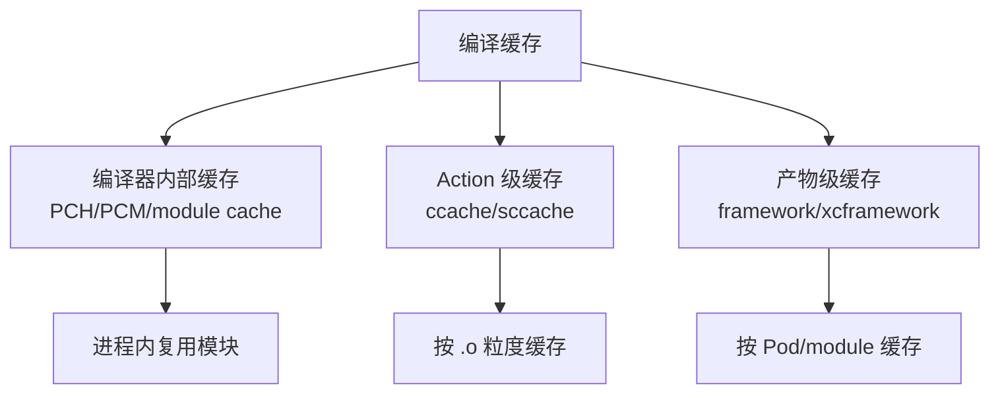
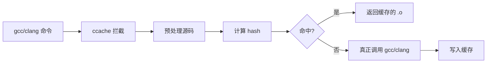
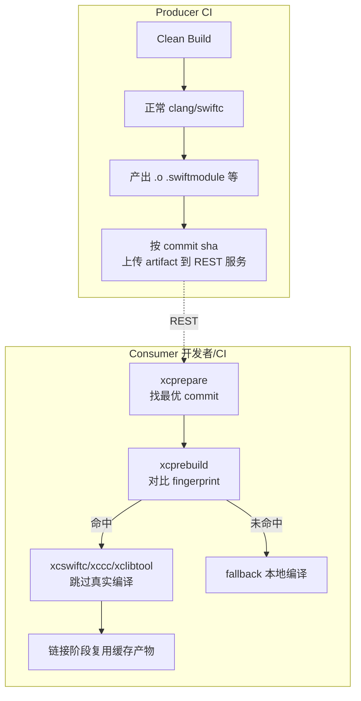
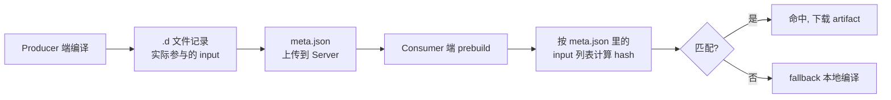
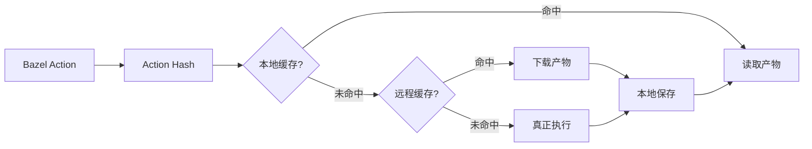

+++
title = "编译优化-编译缓存"
date = '2026-05-08T13:07:14+08:00'
draft = false
weight = 9
tags = ["iOS", "工程化", "编译"]
categories = ["iOS开发", "工程化"]
+++
"已经编译过的东西不再编译一遍"——这是编译优化的基础原理。Xcode 的增量编译、CocoaPods 的二进制缓存、Bazel 的 Action Cache 都是不同层次的编译缓存。本文聚焦 `ccache`、Clang/Swift module cache、远程缓存等通用方案的原理与 iOS 落地。

---

## 缓存分层

缓存按命中粒度可以分为三个层次：



| 层次 | 粒度 | 代表 | 命中率 |
|-----|------|------|-------|
| 编译器内部 | frontend 解析结果 | Clang ModuleCache、Swift Module Cache | 高（本地） |
| Action | 源文件 → 目标文件 | ccache、sccache、Bazel | 中（取决于参数稳定性） |
| 产物 | 整个 Pod 或 module | cocoapods-bin、Rugby | 高（版本号稳定） |

---

## Clang Module Cache

### 原理

Clang 的 `@import` / `@_exported import` 会把外部模块预编译成 `.pcm`，缓存到 `ModuleCachePath`：

```text
DerivedData/<project>/Build/ModuleCache.noindex/
  <context-hash>/
    Foundation-ABCDEF.pcm
    UIKit-ABCDEF.pcm
    ...
```

`context-hash` 把影响模块编译结果的参数（target、宏、SDK、deployment target）摘要到一起，只要参数一致就命中缓存。

### 优化点

- **减少变体**：module cache 命中率的关键是 `context-hash` 稳定。见 [编译优化-Explicit Modules]() 的"减少模块变体"部分
- **持久化到 CI 缓存**：CI 上把 `ModuleCache.noindex` 目录纳入 cache step
- **清理策略**：module cache 默认 7 天 LRU。大工程可适当增加 size 上限

```text
# Build Settings 或 xcconfig
CLANG_MODULE_CACHE_PATH = $(DERIVED_DATA_DIR)/ModuleCache
```

### Explicit Modules 下的变化

开启 Explicit Modules 后，`.pcm` 变为显式 task：

- 优点：可被 `-ivfsoverlay` / sandbox 约束，便于远程缓存
- 缺点：失去了"用到才编译"的懒加载优势，CI 冷启动可能变慢

---

## Swift Module Cache

### 原理

Swift 有两级模块缓存：

```text
# 默认位置
DerivedData/<project>/Build/Intermediates.noindex/.../swift-module-cache/
```

- `.swiftmodule`：二进制序列化形式，绑定具体 Swift 编译器版本
- `.swiftinterface`：文本形式，可被不同 Swift 版本解析（ABI 稳定前提）

### Swift ABI 与缓存命中

开启 `BUILD_LIBRARY_FOR_DISTRIBUTION=YES` 后，Swift 会生成 `.swiftinterface`，让不同 Xcode 版本能共享模块接口。但具体编译的 `.swiftmodule` 仍然绑定版本。

远程缓存要点：
- 同一 Xcode 版本下可跨机器共享 `.swiftmodule`
- 跨版本只能复用源码（`.swiftinterface`）
- CI 镜像要锁定 Xcode 版本，缓存 key 要带上版本号

---

## ccache

### 原理

[ccache](https://ccache.dev) 是 C/C++ 界经典的编译缓存，通过拦截编译器调用、对 **预处理后的源码 + 编译参数** 做哈希，命中缓存时直接返回 `.o`：



两种模式：

| 模式 | 原理 | 命中率 | 耗时 |
|-----|------|-------|------|
| Preprocessor mode（默认） | 展开所有 `#include` 再 hash | 高 | 预处理也有开销 |
| Direct mode | 跳过预处理，用 include 依赖图 hash | 略低 | 最快 |

### iOS 集成

Xcode 不原生支持 ccache，需要通过 wrapper 替换 CC：

```bash
# 1. 安装 ccache
brew install ccache

# 2. 创建 wrapper 脚本
cat > /usr/local/bin/clang-wrapper <<'EOF'
#!/bin/bash
exec ccache /usr/bin/clang "$@"
EOF
chmod +x /usr/local/bin/clang-wrapper

# 3. 在 xcconfig 覆盖
CC = /usr/local/bin/clang-wrapper
CXX = /usr/local/bin/clang++-wrapper
```

### 限制与坑

ccache 在 iOS 工程上命中率通常远低于 Linux/C 工程：

- **Modules 与 PCH**：ccache 对 `-fmodules` 的支持有限，早期版本会强制关闭 Modules 才能工作（CocoaPods 用 `COMPILER_INDEX_STORE_ENABLE=NO` 加补救）
- **绝对路径**：Xcode 传的路径都是绝对路径，不同 `DerivedData` 会让 hash 不一致。用 `CCACHE_BASEDIR` 或 `-fdebug-prefix-map` 相对化
- **不覆盖 Swift**：ccache 只能用于 Clang 家族，Swift 需要另找方案
- **ObjC `-W` 警告**：不同工程警告策略不同会污染 hash

### 收益

对 OC 为主的工程，ccache 在**多用户共享缓存 + 稳定参数**时能提供 30–60% 的加速。Swift 工程收益有限，最好配合 [编译优化-二进制化]() 一起使用。

---

## sccache

[sccache](https://github.com/mozilla/sccache) 是 Mozilla 开发的下一代编译缓存，相比 ccache：

- 原生支持远程缓存（S3、GCS、Redis、Memcached）
- 对 Rust 的支持一流
- 对 Clang / MSVC 也能覆盖
- Swift 支持社区还在推进中

iOS 集成方式类似 ccache，但因为**远程缓存**能让多台 CI 共享，在大型组织里效果好于 ccache。

---

## XCRemoteCache

[XCRemoteCache](https://github.com/spotify/XCRemoteCache) 是 Spotify 在 2021 年开源的 iOS 专用远程缓存工具（最新 v0.3.29 发布于 2024 年 7 月）。与 ccache / sccache 这类通用编译器缓存不同，它**以 Xcode Target 为粒度**做缓存，天然兼容 Swift、Objective-C 和混编 Target，无需迁到 Bazel 就能获得远程缓存能力。Spotify 官方报告 clean build 耗时减少约 **70%**。

### 架构



核心概念：

- **Producer / Consumer 两种模式**：CI 上跑 Producer 生成并上传产物，开发者机器跑 Consumer 只下载复用
- **编译器 wrapper**：通过替换 `CC` / `SWIFT_EXEC` / `LIBTOOL` 为 `xccc` / `xcswiftc` / `xclibtool` 等瘦封装进程实现拦截
- **REST 协议**：一个简单的 HTTP 接口，官方提供 Docker 版，也可直接用 S3 / GCS 做后端

### Fingerprint 机制

XCRemoteCache 不直接对源码做 hash，而是依赖 Xcode 的 `.d` 依赖文件：



这种设计避开了"实际用不到的头文件变化导致缓存全失效"的问题，但也带来一个边界：**新增文件时 fingerprint 不会包含它**，`xcswiftc` 会识别新文件自动 fallback 到本地全量编译；OC / 混编 Target 通过 `history.compile` 侧写文件回溯补全。

### 选 commit 策略

XCRemoteCache 选择复用哪个 sha 的产物：

1. `xcprepare` 在本地与 remote 分支的 `git merge-base` 附近找最近 10 个公共祖先
2. 对每个候选 sha 发 `HEAD` 请求，看是否存在完整的 marker 文件
3. 选最新的"完整已上传"的 sha 写入 `arc.rc`

CI 每次 Producer 跑完要调 `xcprepare mark`，上传一个 `{sha}-{Target}-{Config}-{Platform}-{XcodeBuild}.json` 空标记文件表示"该 sha 的产物已就绪"。

### Focused / Thin Targets

XCRemoteCache 支持 **Focused Targets** 优化：

- **Focused Target**：开发者可能会改动的 Target，正常做 fingerprint 比对
- **Thin Target**：开发者不改的依赖（典型如 Pod），产物直接走缓存，不算 fingerprint

Thin Target 只保留一个 `standin.swift` / `standin.m` 占位源码，编译时直接把远端产物挪过去。大工程里绝大多数 Pod 都可以设为 Thin，本地只为业务 Target 跑 fingerprint，大幅降低开销。这和 [编译优化-二进制化]() 里 Rugby 的思路在目标上相似，但 XCRemoteCache 更贴近 Xcode 原生构建。

### Debug Symbols 与源码路径

远程产物里的调试信息会嵌入 Producer 机器的绝对路径，直接用会让 LLDB 找不到源码。XCRemoteCache 的解决方式：

```text
# C
-fdebug-prefix-map=$(SRCROOT)=/xxxxxxxxxx

# Swift
-debug-prefix-map $(SRCROOT)=/xxxxxxxxxx
```

所有机器都把源码根映射到同一个假路径（如 `/xxxxxxxxxx`），再在 `~/.lldbinit` 里写一条 `target.source-map` 在调试会话开始时翻译回本地路径。`xcprepare integrate` 会自动完成这部分配置。

### 接入方式

官方 `xcprepare integrate` 一键集成（修改 `.xcodeproj`）：

```bash
# Producer 端
xcremotecache/xcprepare integrate \
  --input MyApp.xcodeproj \
  --mode producer \
  --final-producer-target MyApp

# Consumer 端
xcremotecache/xcprepare integrate \
  --input MyApp.xcodeproj \
  --mode consumer
```

也有专门的 [cocoapods-xcremotecache](https://github.com/spotify/cocoapods-xcremotecache) 插件让 CocoaPods 工程几行配置接入：

```ruby
plugin 'cocoapods-xcremotecache'
xcremotecache({
  'cache_addresses' => ['https://xcremotecacheserver.com'],
  'primary_repo' => 'https://yourRepo.git',
  'mode' => 'consumer',
  'final_target' => 'MyApp',
})
```

### 与其他方案的对比

| 维度 | XCRemoteCache | Rugby | Bazel Remote Cache | ccache/sccache |
|-----|---------------|-------|--------------------|----------------|
| 粒度 | Xcode Target | Pod | Action | 单个 .o |
| 覆盖 Swift | ✅ 原生 | ✅ 原生 | ✅ 原生 | ⚠️ 部分 |
| 要求迁构建系统 | ❌ | ❌ | ✅ | ❌ |
| 原生远程缓存 | ✅ | ✅ | ✅ | ✅ |
| 远程执行 | ❌ | ❌ | ✅ | ❌ |
| 接入成本 | 中（改 xcodeproj） | 低（CLI 即可） | 高 | 中 |

实际选型建议：

- **不想动构建系统，又要远程缓存**：XCRemoteCache
- **只加速 Pod，不想改业务 Target**：Rugby
- **已经是 Monorepo / 愿意上 Bazel**：Bazel Remote Cache（+ Remote Execution）

### 使用注意

- **Xcode 版本绑定**：artifact 必须和 Producer 端 Xcode Build Number 一致，升级 Xcode 要同时重刷 Producer 缓存
- **Producer 稳定性**：Producer 端如果非 hermetic（机器名、时间戳、用户名等渗入产物），Consumer 命中率会大幅下降
- **Apple Silicon**：官方推荐 per-architecture artifact，fat artifact 是备选
- **Swift 增量**：命中缓存的 Target 对内部来说是"重新生成"，原本的 Swift 增量编译状态会被重置

---

## Bazel Remote Cache

### 原理

Bazel 天生把每个 Action（编译、链接、资源处理）都表示为：

```text
Action: (inputs, cmd, env) → outputs
```

对 `(inputs, cmd, env)` 做 content-addressed hash，结果写入本地 `~/.cache/bazel/...`，也可以推到远端：



### 远程后端

- **HTTP 后端**：直接 PUT/GET 到对象存储（S3/GCS/MinIO）
- **gRPC 后端**：支持 [Remote Execution API](https://github.com/bazelbuild/remote-apis)，能做远程执行
- **自建**：bazel-remote、nativelink 等开源实现

### iOS 场景

- Bazel iOS 工程：开箱即用
- 混合 Bazel + Xcode：搭配 `rules_xcodeproj`
- 传统 Xcode 工程：需要通过 XCBBuildServiceProxy 改造才能利用 Bazel Remote Cache

详见 [编译优化-Bazel方案]()。

### 命中率陷阱

远程缓存的命中率对以下细节极度敏感：

| 因素 | 影响 | 对策 |
|-----|------|------|
| 源文件绝对路径 | 不命中 | 用 sandbox / `exec_properties` 规范化 |
| 机器指纹（macOS 版本） | 不命中 | 锁定 CI 机器 SDK/Xcode |
| 时间戳 | 不命中 | 工具链 strip timestamps |
| 用户名 / HOME | 不命中 | 用容器或固定路径 |

做好 "hermetic build" 是远程缓存能真正工作的前提。

---

## Derived Data 持久化

不引入 ccache/Bazel 也能做的最简单缓存：把 `DerivedData` 纳入 CI cache。

```yaml
# GitHub Actions 示例
- uses: actions/cache@v4
  with:
    path: ~/Library/Developer/Xcode/DerivedData
    key: derived-${{ runner.os }}-${{ hashFiles('Podfile.lock', 'Package.resolved') }}
    restore-keys: |
      derived-${{ runner.os }}-
```

关键点：

- **Key 包含依赖锁文件**：依赖变化时缓存自动失效
- **增量大小**：DerivedData 往往 GB 级，要评估拉取耗时
- **Xcode 版本**：Xcode 升级后 DerivedData 格式变化，key 要带 xcode 版本

这一层优化零改造，效果却能覆盖大多数中等工程，强烈推荐作为首选。

---

## 增量 LTO 缓存

ThinLTO 的 backend 阶段可以缓存：

```text
OTHER_LDFLAGS = -Wl,-cache_path_lto,$(DERIVED_FILE_DIR)/lto-cache
OTHER_LDFLAGS = -Wl,-prune_interval_lto,600
OTHER_LDFLAGS = -Wl,-prune_after_lto,259200  # 3 天
```

效果：Thin LTO 的 Release 构建从数分钟降到数十秒增量。

见 [编译优化-链接优化]()。

---

## 索引 Cache

Xcode 的 Index Store（用于代码跳转、补全）也是一种缓存，但它和编译缓存独立：

```text
COMPILER_INDEX_STORE_ENABLE = YES    # 本地开发需要
COMPILER_INDEX_STORE_ENABLE = NO     # CI 关闭，省 15% 左右时间
```

开启后每次编译都会写 `.indexstore`，在 CI 关闭可节省大量 IO。

---

## 编译缓存策略矩阵

| 场景 | 推荐方案 |
|-----|---------|
| 本地开发增量 | Xcode 原生 incremental + DerivedData 保留 |
| 本地开发换分支 | 二进制化（Rugby）+ Module Cache 持久化 |
| CI 单机 | Derived Data Cache + CocoaPods Cache |
| 多人 / 多 CI 共享（非 Bazel） | XCRemoteCache + 二进制化 |
| CI 集群 | Bazel Remote Cache / sccache |
| 跨 Xcode 版本 | 缓存 key 带 Xcode 版本，回退到源码编译 |

---

## 落地陷阱

1. **缓存污染**：环境变量、机器名、时间戳让看似一样的构建产生不同 hash
2. **缓存过期**：长尾版本占用大量存储，必须有清理策略
3. **调试困难**：缓存命中的产物可能和"重新编译"的不完全一致（如 timestamp），要有"旁路开关"
4. **假阴性**：缓存未命中却不知原因，要输出 cache miss reason（ccache `--show-stats` / Bazel `--explain`）

任何缓存引入都必须同时建立：

- 命中率监控（目标 > 70%）
- Miss 原因告警
- 一键旁路机制

否则缓存故障时整个构建会比没缓存还慢。

---

## 总结

编译缓存是投入产出比最高的一类优化，但也是最容易踩坑的一类。按复杂度递增顺序建议的落地路径：

1. CI 缓存 `DerivedData` / `Pods` / `CocoaPods Cache`
2. 本地 / CI 共享 Clang + Swift Module Cache
3. 二进制化依赖（[编译优化-二进制化]()）
4. 引入 ccache（对 OC 为主的工程）
5. 接入 XCRemoteCache，获得 Xcode 原生兼容的 Target 级远程缓存
6. 切 Bazel，接入 Remote Cache & Remote Execution（[编译优化-Bazel方案]()）

每一步都应通过 [编译优化-观测]() 的指标体系验证收益。
